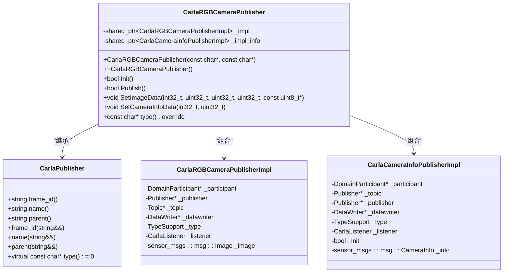
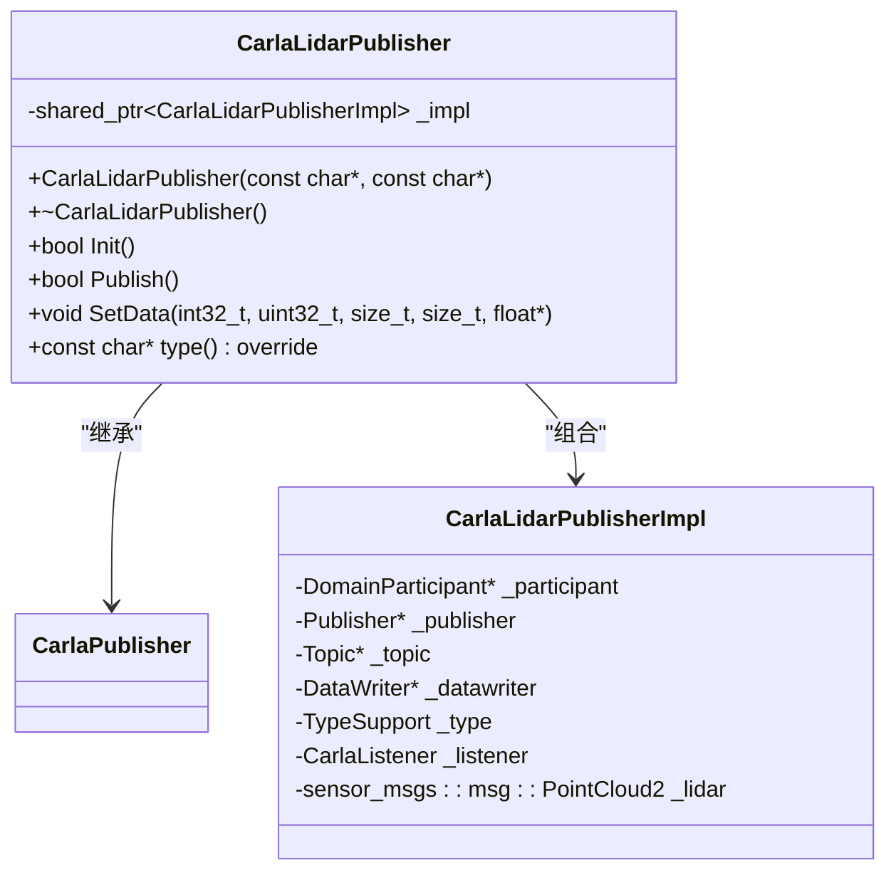
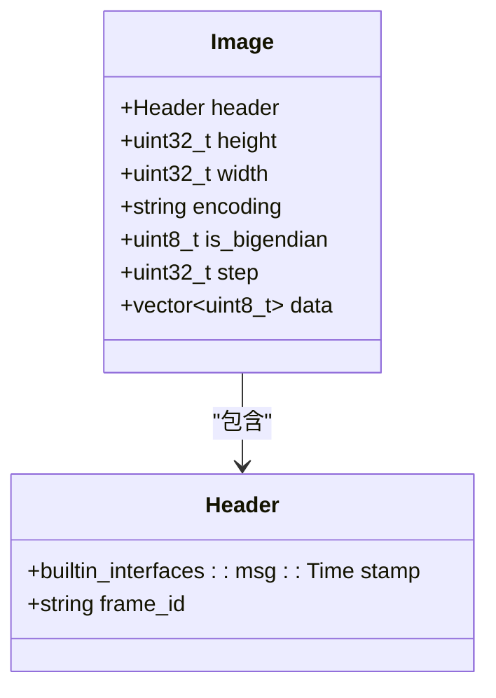
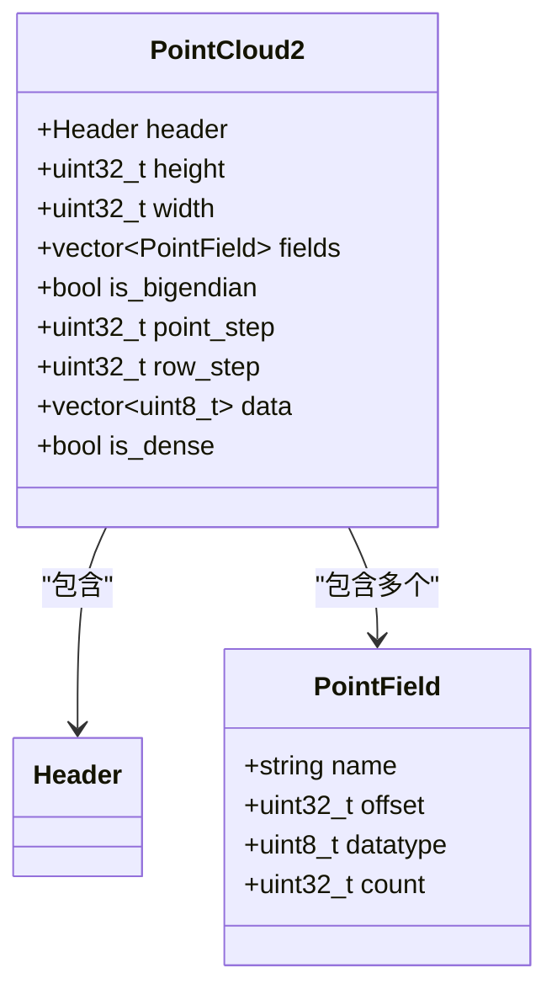
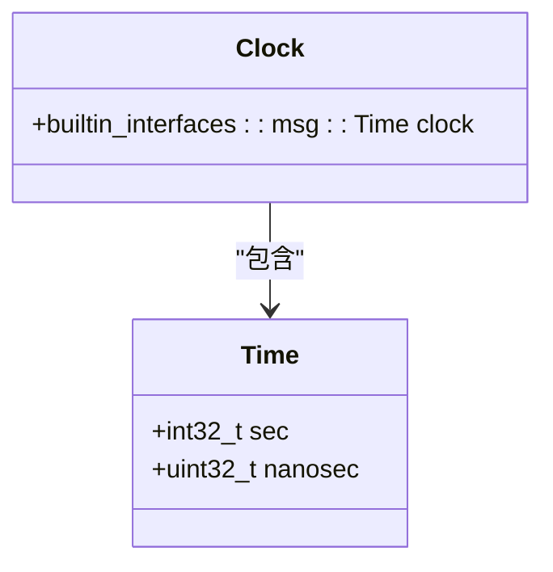

# 消息发布系统

> **引用文件**
> **本文档引用的文件**

- [CarlaRGBCameraPublisher.h](https://github.com/carla-simulator/carla/blob/ue5-dev/LibCarla/source/carla/ros2/publishers/CarlaRGBCameraPublisher.h)
- [CarlaRGBCameraPublisher.cpp](https://github.com/carla-simulator/carla/blob/ue5-dev/LibCarla/source/carla/ros2/publishers/CarlaRGBCameraPublisher.cpp)
- [CarlaLidarPublisher.h](https://github.com/carla-simulator/carla/blob/ue5-dev/LibCarla/source/carla/ros2/publishers/CarlaLidarPublisher.h)
- [CarlaLidarPublisher.cpp](https://github.com/carla-simulator/carla/blob/ue5-dev/LibCarla/source/carla/ros2/publishers/CarlaLidarPublisher.cpp)
- [CarlaClockPublisher.h](https://github.com/carla-simulator/carla/blob/ue5-dev/LibCarla/source/carla/ros2/publishers/CarlaClockPublisher.h)
- [CarlaClockPublisher.cpp](https://github.com/carla-simulator/carla/blob/ue5-dev/LibCarla/source/carla/ros2/publishers/CarlaClockPublisher.cpp)
- [CarlaGNSSPublisher.h](https://github.com/carla-simulator/carla/blob/ue5-dev/LibCarla/source/carla/ros2/publishers/CarlaGNSSPublisher.h)
- [CarlaIMUPublisher.h](https://github.com/carla-simulator/carla/blob/ue5-dev/LibCarla/source/carla/ros2/publishers/CarlaIMUPublisher.h)
- [Image.h](https://github.com/carla-simulator/carla/blob/ue5-dev/LibCarla/source/carla/ros2/types/Image.h)
- [PointCloud2.h](https://github.com/carla-simulator/carla/blob/ue5-dev/LibCarla/source/carla/ros2/types/PointCloud2.h)
- [Clock.h](https://github.com/carla-simulator/carla/blob/ue5-dev/LibCarla/source/carla/ros2/types/Clock.h)
- [ROS2.h](https://github.com/carla-simulator/carla/blob/ue5-dev/LibCarla/source/carla/ros2/ROS2.h)

## 目录

1. [引言](#引言)
2. [核心发布者类实现](#核心发布者类实现)
3. [消息类型映射](#消息类型映射)
4. [发布频率与 QoS 策略](#发布频率与qos策略)
5. [/carla/clock 时间同步机制](#carlaclock时间同步机制)
6. [自定义发布者扩展](#自定义发布者扩展)
7. [消息序列化过程](#消息序列化过程)
8. [结论](#结论)

## 引言

CARLA 仿真器通过 ROS2 接口提供丰富的传感器和状态数据发布功能。本系统基于 Fast DDS 实现，为自动驾驶研究提供了完整的传感器数据流。发布者系统设计为模块化架构，每个传感器类型都有对应的发布者类，负责将 CARLA 内部数据结构转换为 ROS2 标准消息格式并发布到相应的主题。

**Section sources**

- <a href="https://github.com/carla-simulator/carla/blob/ue5-dev/LibCarla/source/carla/ros2/ROS2.h#L1-L177" target="_blank">ROS2.h</a>

## 核心发布者类实现

CARLA 的 ROS2 发布者系统采用面向对象的设计模式，所有发布者类都继承自基类`CarlaPublisher`。该基类定义了通用属性如帧 ID、名称和父级关系，为所有具体发布者提供统一接口。

### CarlaRGBCameraPublisher 实现

`CarlaRGBCameraPublisher`类负责发布 RGB 相机数据，它同时管理图像数据和相机信息两个独立的消息流。该类通过两个实现结构体`CarlaRGBCameraPublisherImpl`和`CarlaCameraInfoPublisherImpl`分别处理`sensor_msgs/Image`和`sensor_msgs/CameraInfo`消息的发布。



**Diagram sources**

- <a href="https://github.com/carla-simulator/carla/blob/ue5-dev/LibCarla/source/carla/ros2/publishers/CarlaRGBCameraPublisher.h#L15-L48" target="_blank">CarlaRGBCameraPublisher.h</a>
- <a href="https://github.com/carla-simulator/carla/blob/ue5-dev/LibCarla/source/carla/ros2/publishers/CarlaRGBCameraPublisher.cpp#L32-L51" target="_blank">CarlaRGBCameraPublisher.cpp</a>

**Section sources**

- <a href="https://github.com/carla-simulator/carla/blob/ue5-dev/LibCarla/source/carla/ros2/publishers/CarlaRGBCameraPublisher.h#L1-L51" target="_blank">CarlaRGBCameraPublisher.h</a>
- <a href="https://github.com/carla-simulator/carla/blob/ue5-dev/LibCarla/source/carla/ros2/publishers/CarlaRGBCameraPublisher.cpp#L1-L416" target="_blank">CarlaRGBCameraPublisher.cpp</a>

### CarlaLidarPublisher 实现

`CarlaLidarPublisher`类专门用于发布激光雷达点云数据。与相机发布者类似，它也包含一个实现结构体`CarlaLidarPublisherImpl`来管理 DDS 实体和消息数据。该发布者将 CARLA 内部的 LidarData 结构转换为标准的`sensor_msgs/PointCloud2`格式。



**Diagram sources**

- <a href="https://github.com/carla-simulator/carla/blob/ue5-dev/LibCarla/source/carla/ros2/publishers/CarlaLidarPublisher.h#L15-L36" target="_blank">CarlaLidarPublisher.h</a>
- <a href="https://github.com/carla-simulator/carla/blob/ue5-dev/LibCarla/source/carla/ros2/publishers/CarlaLidarPublisher.cpp#L30-L38" target="_blank">CarlaLidarPublisher.cpp</a>

**Section sources**

- <a href="https://github.com/carla-simulator/carla/blob/ue5-dev/LibCarla/source/carla/ros2/publishers/CarlaLidarPublisher.h#L1-L39" target="_blank">CarlaLidarPublisher.h</a>
- <a href="https://github.com/carla-simulator/carla/blob/ue5-dev/LibCarla/source/carla/ros2/publishers/CarlaLidarPublisher.cpp#L1-L261" target="_blank">CarlaLidarPublisher.cpp</a>

## 消息类型映射

CARLA 的 ROS2 发布者系统实现了多种传感器数据到 ROS2 标准消息类型的精确映射，确保与其他 ROS2 组件的兼容性。

### 图像消息映射

RGB 相机数据被映射到`sensor_msgs/Image`消息类型。在`CarlaRGBCameraPublisher`中，通过`SetImageData`方法将 CARLA 的原始图像数据转换为 ROS2 图像消息：

- **时间戳**: 从 CARLA 仿真时间转换为`builtin_interfaces/Time`
- **尺寸**: 直接映射高度和宽度字段
- **编码**: 设置为"bgra8"格式
- **步长**: 计算为`width * 4`字节
- **数据**: 通过 memcpy 复制原始像素数据



**Diagram sources**

- <a href="https://github.com/carla-simulator/carla/blob/ue5-dev/LibCarla/source/carla/ros2/types/Image.h#L72-L343" target="_blank">Image.h</a>

### 点云消息映射

激光雷达数据被映射到`sensor_msgs/PointCloud2`消息类型。`CarlaLidarPublisher`在`SetData`方法中完成这一转换：

- **字段定义**: 创建包含 x、y、z 和 intensity 四个字段的 PointField 数组
- **偏移量**: 分别设置为 0、4、8、12 字节
- **数据类型**: 全部为 FLOAT32
- **点步长**: 固定为 16 字节(4 个 float)
- **行步长**: 等于总数据大小
- **坐标系变换**: Y 轴方向取反以匹配 ROS 坐标系



**Diagram sources**

- <a href="https://github.com/carla-simulator/carla/blob/ue5-dev/LibCarla/source/carla/ros2/types/PointCloud2.h#L73-L382" target="_blank">PointCloud2.h</a>

### 其他传感器消息映射

系统还支持多种其他传感器的消息映射：

- **GNSS**: 映射到`sensor_msgs/NavSatFix`消息
- **IMU**: 映射到`sensor_msgs/Imu`消息
- **雷达**: 映射到`sensor_msgs/RadarDetection`消息
- **碰撞检测**: 映射到自定义的`CarlaCollisionEvent`消息

**Section sources**

- <a href="https://github.com/carla-simulator/carla/blob/ue5-dev/LibCarla/source/carla/ros2/publishers/CarlaGNSSPublisher.h#L1-L35" target="_blank">CarlaGNSSPublisher.h</a>
- <a href="https://github.com/carla-simulator/carla/blob/ue5-dev/LibCarla/source/carla/ros2/publishers/CarlaIMUPublisher.h#L1-L35" target="_blank">CarlaIMUPublisher.h</a>

## 发布频率与 QoS 策略

CARLA 的 ROS2 发布者系统实现了精细的发布频率控制和 QoS 策略配置，确保数据传输的可靠性和实时性。

### QoS 策略配置

所有发布者在初始化时都配置了标准的 DDS QoS 策略：

- **DomainParticipantQos**: 使用默认 QoS，设置参与者名称为发布者名称
- **PublisherQos**: 使用默认发布者 QoS
- **TopicQos**: 使用默认主题 QoS
- **DataWriterQos**: 配置历史内存策略为 PREALLOCATED_WITH_REALLOC_MEMORY_MODE，确保高效内存管理

在`CarlaRGBCameraPublisher::InitImage`方法中，系统创建 DDS 域参与者、发布者、主题和数据写入器，并注册相应的类型支持。

### 主题命名约定

发布者遵循统一的主题命名规则：

- **图像数据**: `rt/carla/[parent]/[name]/image`
- **相机信息**: `rt/carla/[parent]/[name]/camera_info`
- **点云数据**: `rt/carla/[parent]/[name]`
- **时钟数据**: `rt/clock`

这种层次化的命名结构便于组织和管理大量的传感器数据流。

**Section sources**

- <a href="https://github.com/carla-simulator/carla/blob/ue5-dev/LibCarla/source/carla/ros2/publishers/CarlaRGBCameraPublisher.cpp#L67-L113" target="_blank">CarlaRGBCameraPublisher.cpp</a>
- <a href="https://github.com/carla-simulator/carla/blob/ue5-dev/LibCarla/source/carla/ros2/publishers/CarlaLidarPublisher.cpp#L40-L84" target="_blank">CarlaLidarPublisher.cpp</a>

## /carla/clock 时间同步机制

CARLA 仿真器通过`/carla/clock`话题提供精确的时间同步服务，这是实现传感器数据时间对齐的关键机制。

### 时间转换原理

`CarlaClockPublisher`类负责将 CARLA 仿真时间转换为 ROS2 时钟消息。系统维护两个时间变量：

- `_seconds`: 整数秒部分
- `_nanoseconds`: 纳秒部分

当接收到新的仿真时间戳时，系统将其分解为秒和纳秒部分，并通过`SetData`方法更新内部时钟消息。

### 时钟消息结构

时钟消息基于`rosgraph_msgs/Clock`类型，包含一个`builtin_interfaces/Time`字段。该消息被定期发布到`rt/clock`主题，为所有订阅者提供统一的时间基准。



**Diagram sources**

- <a href="https://github.com/carla-simulator/carla/blob/ue5-dev/LibCarla/source/carla/ros2/types/Clock.h#L72-L209" target="_blank">Clock.h</a>

### 同步流程

时间同步的典型流程如下：

1. CARLA 仿真器更新仿真时间戳
2. ROS2 系统调用`SetTimestamp`方法
3. `CarlaClockPublisher`更新内部时钟消息
4. 系统定期调用`Publish`方法发布时钟消息
5. 所有传感器数据使用当前时钟时间戳

这种机制确保了所有传感器数据具有精确的时间关联，对于多传感器融合至关重要。

**Section sources**

- <a href="https://github.com/carla-simulator/carla/blob/ue5-dev/LibCarla/source/carla/ros2/publishers/CarlaClockPublisher.h#L1-L36" target="_blank">CarlaClockPublisher.h</a>
- <a href="https://github.com/carla-simulator/carla/blob/ue5-dev/LibCarla/source/carla/ros2/publishers/CarlaClockPublisher.cpp#L1-L204" target="_blank">CarlaClockPublisher.cpp</a>
- <a href="https://github.com/carla-simulator/carla/blob/ue5-dev/LibCarla/source/carla/ros2/ROS2.h#L63-L64" target="_blank">ROS2.h</a>

## 自定义发布者扩展

CARLA 的模块化发布者架构支持轻松添加新的数据流，开发者可以基于现有模式创建自定义发布者。

### 扩展步骤

要添加新的传感器数据流，需要遵循以下步骤：

1. **创建新的发布者类**: 继承`CarlaPublisher`基类
2. **定义消息类型**: 选择或创建合适的 ROS2 消息类型
3. **实现初始化方法**: 配置 DDS 实体和 QoS 策略
4. **实现数据设置方法**: 将 CARLA 内部数据转换为 ROS2 消息
5. **实现发布方法**: 通过 DDS 数据写入器发布消息
6. **注册到 ROS2 系统**: 在`ROS2`类中添加相应的处理方法

### 示例：添加新传感器

假设要添加一个自定义传感器发布者，基本结构如下：

```cpp
class CustomSensorPublisher : public CarlaPublisher {
public:
    CustomSensorPublisher(const char* ros_name = "", const char* parent = "");
    ~CustomSensorPublisher();

    bool Init();
    bool Publish();
    void SetData(int32_t seconds, uint32_t nanoseconds, const CustomDataType& data);
    const char* type() const override { return "custom sensor"; }

private:
    struct CustomSensorPublisherImpl {
        efd::DomainParticipant* _participant { nullptr };
        efd::Publisher* _publisher { nullptr };
        efd::Topic* _topic { nullptr };
        efd::DataWriter* _datawriter { nullptr };
        efd::TypeSupport _type { new custom_msgs::msg::CustomDataPubSubType() };
        CarlaListener _listener {};
        custom_msgs::msg::CustomData _data {};
    };

    std::shared_ptr<CustomSensorPublisherImpl> _impl;
};
```

**Section sources**

- <a href="https://github.com/carla-simulator/carla/blob/ue5-dev/LibCarla/source/carla/ros2/publishers/CarlaPublisher.h#L12-L34" target="_blank">CarlaPublisher.h</a>

## 消息序列化过程

CARLA 的 ROS2 发布者系统实现了高效的消息序列化过程，将 CARLA 内部数据结构转换为 ROS2 IDL 兼容格式。

### 序列化流程

消息序列化的主要步骤包括：

1. **数据提取**: 从 CARLA 传感器回调中获取原始数据
2. **格式转换**: 将数据转换为 ROS2 消息类型的字段
3. **时间戳设置**: 使用当前仿真时间设置消息时间戳
4. **内存复制**: 将数据复制到消息缓冲区
5. **DDS 序列化**: 通过 Fast CDR 库进行最终序列化

### 图像数据序列化

对于 RGB 相机数据，序列化过程如下：

- 创建`sensor_msgs::msg::Image`对象
- 设置头部信息(时间戳和帧 ID)
- 设置图像尺寸和编码格式
- 计算并设置步长
- 复制原始像素数据到消息的 data 字段
- 调用 DDS 数据写入器的 write 方法

### 点云数据序列化

激光雷达数据的序列化更为复杂：

- 创建`sensor_msgs::msg::PointCloud2`对象
- 定义四个 PointField(x, y, z, intensity)
- 设置每个字段的名称、偏移量和数据类型
- 设置点步长和行步长
- 转换坐标系(Y 轴取反)
- 复制点云数据到消息缓冲区

整个序列化过程通过 Fast CDR 库自动完成，确保了跨平台的兼容性和高效性。

**Section sources**

- <a href="https://github.com/carla-simulator/carla/blob/ue5-dev/LibCarla/source/carla/ros2/publishers/CarlaRGBCameraPublisher.cpp#L292-L317" target="_blank">CarlaRGBCameraPublisher.cpp</a>
- <a href="https://github.com/carla-simulator/carla/blob/ue5-dev/LibCarla/source/carla/ros2/publishers/CarlaLidarPublisher.cpp#L150-L203" target="_blank">CarlaLidarPublisher.cpp</a>

## 结论

CARLA 的 ROS2 发布者系统提供了一个强大而灵活的框架，用于发布各种传感器和状态数据。通过模块化的发布者类设计、标准的消息类型映射、精确的时间同步机制和高效的序列化过程，该系统为自动驾驶研究提供了可靠的数据基础设施。开发者可以基于现有的架构轻松扩展系统功能，添加新的传感器数据流，满足特定的研究需求。
