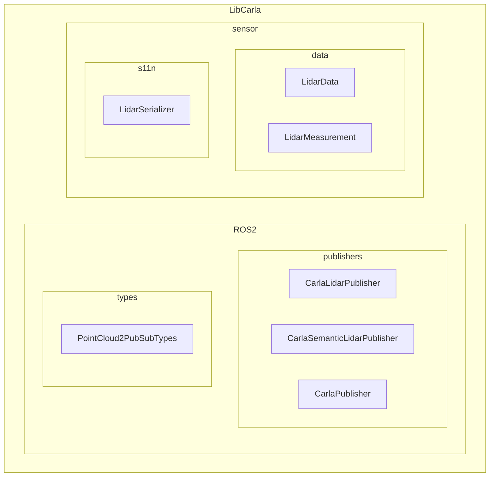
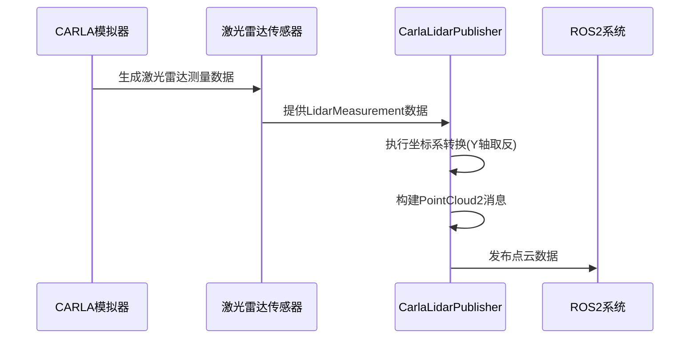
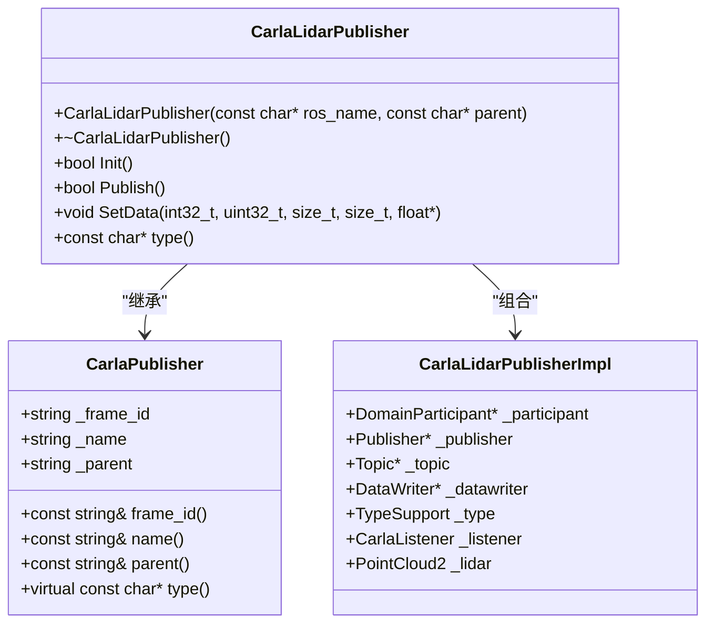
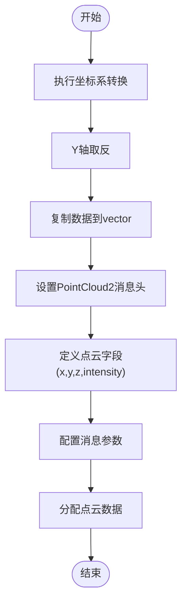
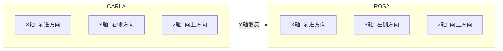
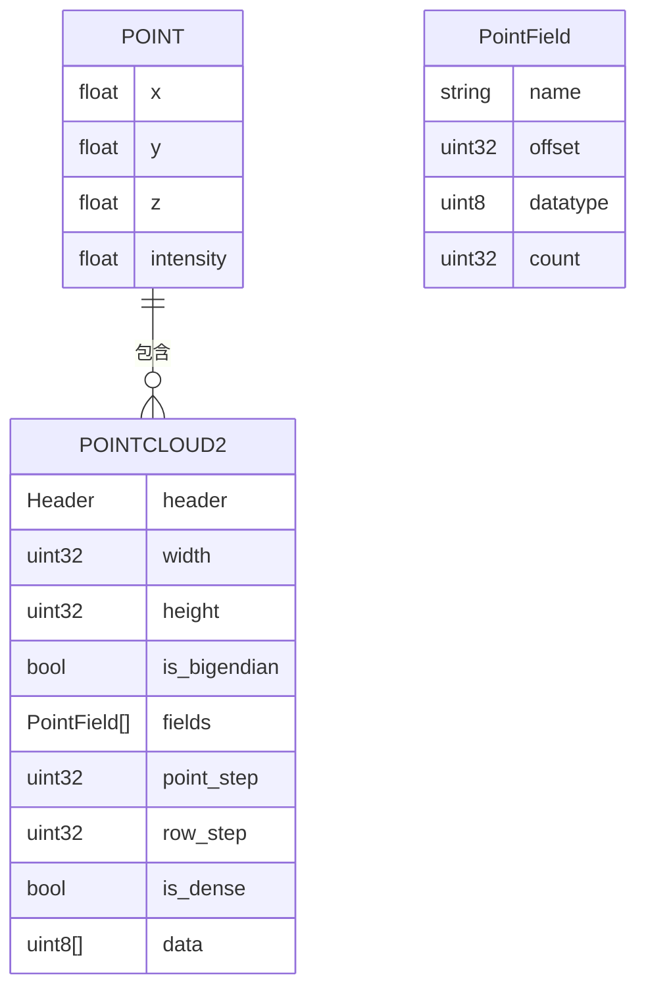

# 激光雷达发布器

> **引用文件**
> **本文档引用的文件**

- [CarlaLidarPublisher.h](https://github.com/carla-simulator/carla/blob/ue5-dev/LibCarla/source/carla/ros2/publishers/CarlaLidarPublisher.h)
- [CarlaLidarPublisher.cpp](https://github.com/carla-simulator/carla/blob/ue5-dev/LibCarla/source/carla/ros2/publishers/CarlaLidarPublisher.cpp)
- [CarlaSemanticLidarPublisher.h](https://github.com/carla-simulator/carla/blob/ue5-dev/LibCarla/source/carla/ros2/publishers/CarlaSemanticLidarPublisher.h)
- [CarlaSemanticLidarPublisher.cpp](https://github.com/carla-simulator/carla/blob/ue5-dev/LibCarla/source/carla/ros2/publishers/CarlaSemanticLidarPublisher.cpp)
- [LidarData.h](https://github.com/carla-simulator/carla/blob/ue5-dev/LibCarla/source/carla/sensor/data/LidarData.h)
- [LidarMeasurement.h](https://github.com/carla-simulator/carla/blob/ue5-dev/LibCarla/source/carla/sensor/data/LidarMeasurement.h)
- [ros2_native_sensors.md](https://github.com/carla-simulator/carla/blob/ue5-dev/Docs/ros2_native_sensors.md)
- [LidarDescription.h](https://github.com/carla-simulator/carla/blob/ue5-dev/Unreal/CarlaUnreal/Plugins/Carla/Source/Carla/Sensor/LidarDescription.h)

## 目录

1. [简介](#简介)
2. [项目结构](#项目结构)
3. [核心组件](#核心组件)
4. [架构概述](#架构概述)
5. [详细组件分析](#详细组件分析)
6. [依赖分析](#依赖分析)
7. [性能考虑](#性能考虑)
8. [故障排除指南](#故障排除指南)
9. [结论](#结论)

## 简介

本文档详细描述了 CARLA 模拟器中激光雷达发布器（CarlaLidarPublisher）如何将激光雷达传感器数据转换为 ROS2 的 sensor_msgs/PointCloud2 格式。文档涵盖了点云数据的组织方式、坐标系转换、强度信息编码、点云字段定义以及不同激光雷达配置对输出点云的影响，并提供性能优化建议。

## 项目结构

CARLA 的激光雷达发布器实现位于 LibCarla 模块的 ROS2 发布器子目录中，遵循清晰的分层架构。



**图示来源**

- [CarlaLidarPublisher.h](https://github.com/carla-simulator/carla/blob/ue5-dev/LibCarla/source/carla/ros2/publishers/CarlaLidarPublisher.h)
- [LidarData.h](https://github.com/carla-simulator/carla/blob/ue5-dev/LibCarla/source/carla/sensor/data/LidarData.h)

**本节来源**

- [CarlaLidarPublisher.h](https://github.com/carla-simulator/carla/blob/ue5-dev/LibCarla/source/carla/ros2/publishers/CarlaLidarPublisher.h)
- [LidarDescription.h](https://github.com/carla-simulator/carla/blob/ue5-dev/Unreal/CarlaUnreal/Plugins/Carla/Source/Carla/Sensor/LidarDescription.h)

## 核心组件

CarlaLidarPublisher 是将 CARLA 激光雷达数据发布到 ROS2 系统的核心组件，负责处理数据转换、坐标系变换和 ROS2 消息发布。

**本节来源**

- [CarlaLidarPublisher.h](https://github.com/carla-simulator/carla/blob/ue5-dev/LibCarla/source/carla/ros2/publishers/CarlaLidarPublisher.h)
- [CarlaLidarPublisher.cpp](https://github.com/carla-simulator/carla/blob/ue5-dev/LibCarla/source/carla/ros2/publishers/CarlaLidarPublisher.cpp)

## 架构概述

激光雷达发布器的架构包括数据采集、坐标转换、消息构建和发布四个主要阶段。



**图示来源**

- [CarlaLidarPublisher.cpp](https://github.com/carla-simulator/carla/blob/ue5-dev/LibCarla/source/carla/ros2/publishers/CarlaLidarPublisher.cpp)
- [LidarMeasurement.h](https://github.com/carla-simulator/carla/blob/ue5-dev/LibCarla/source/carla/sensor/data/LidarMeasurement.h)

## 详细组件分析

### CarlaLidarPublisher 分析

CarlaLidarPublisher 类负责将 CARLA 的激光雷达数据转换为 ROS2 兼容的 PointCloud2 格式，并处理必要的坐标系转换。

#### 类结构分析



**图示来源**

- [CarlaLidarPublisher.h](https://github.com/carla-simulator/carla/blob/ue5-dev/LibCarla/source/carla/ros2/publishers/CarlaLidarPublisher.h)
- [CarlaPublisher.h](https://github.com/carla-simulator/carla/blob/ue5-dev/LibCarla/source/carla/ros2/publishers/CarlaPublisher.h)

#### 数据转换流程



**图示来源**

- [CarlaLidarPublisher.cpp](https://github.com/carla-simulator/carla/blob/ue5-dev/LibCarla/source/carla/ros2/publishers/CarlaLidarPublisher.cpp)

**本节来源**

- [CarlaLidarPublisher.h](https://github.com/carla-simulator/carla/blob/ue5-dev/LibCarla/source/carla/ros2/publishers/CarlaLidarPublisher.h)
- [CarlaLidarPublisher.cpp](https://github.com/carla-simulator/carla/blob/ue5-dev/LibCarla/source/carla/ros2/publishers/CarlaLidarPublisher.cpp)

### 点云数据组织

详细分析激光雷达点云数据在 CARLA 和 ROS2 之间的组织方式和转换过程。

#### 坐标系转换



**图示来源**

- [CarlaLidarPublisher.cpp](https://github.com/carla-simulator/carla/blob/ue5-dev/LibCarla/source/carla/ros2/publishers/CarlaLidarPublisher.cpp)

#### 点云字段定义



**图示来源**

- [CarlaLidarPublisher.cpp](https://github.com/carla-simulator/carla/blob/ue5-dev/LibCarla/source/carla/ros2/publishers/CarlaLidarPublisher.cpp)

**本节来源**

- [CarlaLidarPublisher.cpp](https://github.com/carla-simulator/carla/blob/ue5-dev/LibCarla/source/carla/ros2/publishers/CarlaLidarPublisher.cpp)
- [LidarData.h](https://github.com/carla-simulator/carla/blob/ue5-dev/LibCarla/source/carla/sensor/data/LidarData.h)

## 依赖分析

分析激光雷达发布器与其他组件的依赖关系。

```mermaid
graph TD
CarlaLidarPublisher --> CarlaPublisher : "继承"
CarlaLidarPublisher --> PointCloud2PubSubTypes : "使用"
CarlaLidarPublisher --> CarlaListener : "使用"
CarlaLidarPublisher --> FastDDS : "依赖"
CarlaLidarPublisher --> LidarMeasurement : "接收数据"
LidarMeasurement --> LidarData : "基于"
LidarData --> SensorData : "序列化"
```

**图示来源**

- [CarlaLidarPublisher.h](https://github.com/carla-simulator/carla/blob/ue5-dev/LibCarla/source/carla/ros2/publishers/CarlaLidarPublisher.h)
- [CarlaLidarPublisher.cpp](https://github.com/carla-simulator/carla/blob/ue5-dev/LibCarla/source/carla/ros2/publishers/CarlaLidarPublisher.cpp)

**本节来源**

- [CarlaLidarPublisher.h](https://github.com/carla-simulator/carla/blob/ue5-dev/LibCarla/source/carla/ros2/publishers/CarlaLidarPublisher.h)
- [LidarData.h](https://github.com/carla-simulator/carla/blob/ue5-dev/LibCarla/source/carla/sensor/data/LidarData.h)

## 性能考虑

针对激光雷达发布器的性能优化建议。

### 配置参数对性能的影响

| 配置参数                    | 默认值 | 影响     | 优化建议                     |
| --------------------------- | ------ | -------- | ---------------------------- |
| 通道数(Channels)            | 32     | 点云密度 | 根据需求调整，降低可提高性能 |
| 最大距离(Range)             | 100 米 | 检测范围 | 减小范围可降低计算负载       |
| 每秒点数(PointsPerSecond)   | 56000  | 数据量   | 降低可减少带宽和处理开销     |
| 旋转频率(RotationFrequency) | 10Hz   | 更新率   | 降低可减少 CPU 使用率        |
| 水平视场(HorizontalFov)     | 360°   | 覆盖范围 | 减小可提高特定方向分辨率     |

**本节来源**

- [LidarDescription.h](https://github.com/carla-simulator/carla/blob/ue5-dev/Unreal/CarlaUnreal/Plugins/Carla/Source/Carla/Sensor/LidarDescription.h)
- [CarlaLidarPublisher.cpp](https://github.com/carla-simulator/carla/blob/ue5-dev/LibCarla/source/carla/ros2/publishers/CarlaLidarPublisher.cpp)

## 故障排除指南

常见问题及解决方案。

### 常见问题

- **点云数据不完整**: 检查 FastDDS 配置和网络带宽
- **坐标系错误**: 确认 Y 轴已正确取反转换
- **性能瓶颈**: 降低点云密度或发布频率
- **数据延迟**: 检查 ROS2 网络配置和 QoS 设置

**本节来源**

- [CarlaLidarPublisher.cpp](https://github.com/carla-simulator/carla/blob/ue5-dev/LibCarla/source/carla/ros2/publishers/CarlaLidarPublisher.cpp)
- [ros2_native_sensors.md](https://github.com/carla-simulator/carla/blob/ue5-dev/Docs/ros2_native_sensors.md)

## 结论

CarlaLidarPublisher 成功实现了将 CARLA 模拟器的激光雷达数据转换为 ROS2 标准的 PointCloud2 格式，通过 Y 轴取反完成了从左手系到右手系的坐标转换。该实现支持灵活的激光雷达配置，可根据不同计算平台的需求调整点云密度和发布频率以优化性能。
