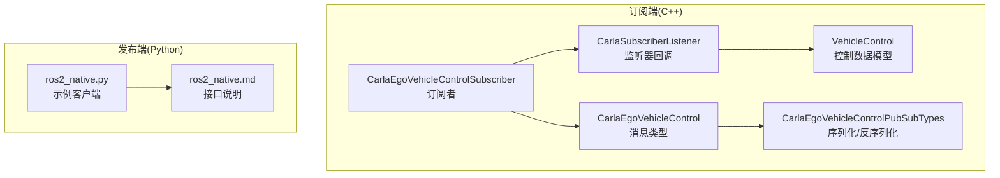
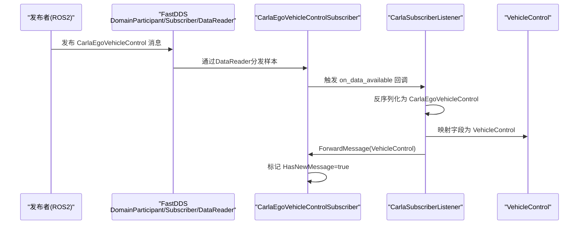
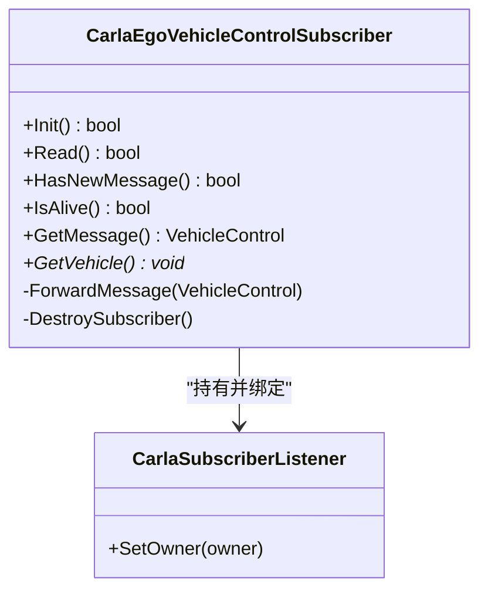
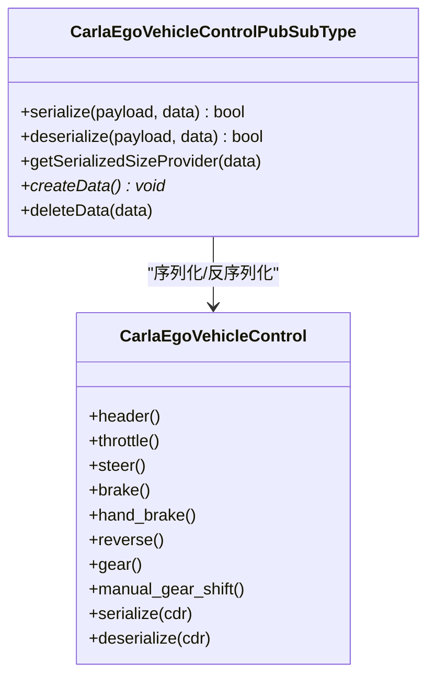
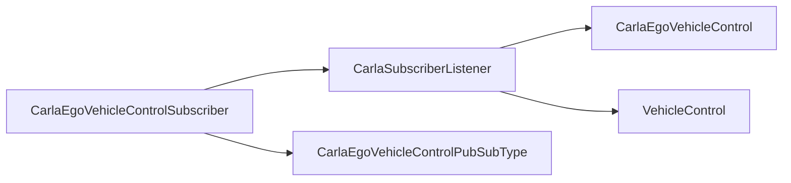

# 消息订阅系统

**本文引用的文件**
- [CarlaEgoVehicleControlSubscriber.h](https://github.com/carla-simulator/carla/blob/ue5-dev/LibCarla/source/carla/ros2/subscribers/CarlaEgoVehicleControlSubscriber.h)
- [CarlaEgoVehicleControlSubscriber.cpp](https://github.com/carla-simulator/carla/blob/ue5-dev/LibCarla/source/carla/ros2/subscribers/CarlaEgoVehicleControlSubscriber.cpp)
- [CarlaSubscriberListener.h](https://github.com/carla-simulator/carla/blob/ue5-dev/LibCarla/source/carla/ros2/listeners/CarlaSubscriberListener.h)
- [CarlaSubscriberListener.cpp](https://github.com/carla-simulator/carla/blob/ue5-dev/LibCarla/source/carla/ros2/listeners/CarlaSubscriberListener.cpp)
- [CarlaEgoVehicleControl.h](https://github.com/carla-simulator/carla/blob/ue5-dev/LibCarla/source/carla/ros2/types/CarlaEgoVehicleControl.h)
- [CarlaEgoVehicleControlPubSubTypes.cpp](https://github.com/carla-simulator/carla/blob/ue5-dev/LibCarla/source/carla/ros2/types/CarlaEgoVehicleControlPubSubTypes.cpp)
- [VehicleControl.h](https://github.com/carla-simulator/carla/blob/ue5-dev/LibCarla/source/carla/rpc/VehicleControl.h)
- [ros2_native.md](https://github.com/carla-simulator/carla/blob/ue5-dev/Docs/ros2_native.md)
- [ros2_native.py](https://github.com/carla-simulator/carla/blob/ue5-dev/PythonAPI/examples/ros2/ros2_native.py)
- [README.md](https://github.com/carla-simulator/carla/blob/ue5-dev/PythonAPI/examples/ros2/README.md)

## 目录
1. [简介](#简介)
2. [项目结构](#项目结构)
3. [核心组件](#核心组件)
4. [架构总览](#架构总览)
5. [详细组件分析](#详细组件分析)
6. [依赖关系分析](#依赖关系分析)
7. [性能与实时性考量](#性能与实时性考量)
8. [故障排查指南](#故障排查指南)
9. [结论](#结论)
10. [附录：扩展与定制指南](#附录扩展与定制指南)

## 简介
本文件面向使用ROS2与CARLA进行车辆控制交互的开发者，系统化阐述“控制命令订阅系统”的设计与实现，重点覆盖：
- 控制命令的接收与处理流程（油门、刹车、转向等）
- 消息反序列化与错误处理策略
- 基于ros2_native.py示例的订阅者客户端实现模式
- 回调函数设计与实时性、可靠性保障
- 如何扩展订阅者系统以支持新控制模式或自定义消息类型

## 项目结构
围绕ROS2控制订阅系统的关键代码位于以下模块：
- 订阅者实现：LibCarla/source/carla/ros2/subscribers
- 监听器回调：LibCarla/source/carla/ros2/listeners
- 消息类型与序列化：LibCarla/source/carla/ros2/types
- 控制数据模型：LibCarla/source/carla/rpc
- 文档与示例：Docs与PythonAPI/examples

图表来源
- [CarlaEgoVehicleControlSubscriber.cpp](https://github.com/carla-simulator/carla/blob/ue5-dev/LibCarla/source/carla/ros2/subscribers/CarlaEgoVehicleControlSubscriber.cpp#L45-L120)
- [CarlaSubscriberListener.cpp](https://github.com/carla-simulator/carla/blob/ue5-dev/LibCarla/source/carla/ros2/listeners/CarlaSubscriberListener.cpp#L47-L101)
- [CarlaEgoVehicleControl.h](https://github.com/carla-simulator/carla/blob/ue5-dev/LibCarla/source/carla/ros2/types/CarlaEgoVehicleControl.h#L154-L285)
- [CarlaEgoVehicleControlPubSubTypes.cpp](https://github.com/carla-simulator/carla/blob/ue5-dev/LibCarla/source/carla/ros2/types/CarlaEgoVehicleControlPubSubTypes.cpp#L82-L131)
- [VehicleControl.h](https://github.com/carla-simulator/carla/blob/ue5-dev/LibCarla/source/carla/rpc/VehicleControl.h#L41-L47)
- [ros2_native.py](https://github.com/carla-simulator/carla/blob/ue5-dev/PythonAPI/examples/ros2/ros2_native.py#L1-L132)
- [ros2_native.md](https://github.com/carla-simulator/carla/blob/ue5-dev/Docs/ros2_native.md#L33-L64)

章节来源
- [CarlaEgoVehicleControlSubscriber.h](https://github.com/carla-simulator/carla/blob/ue5-dev/LibCarla/source/carla/ros2/subscribers/CarlaEgoVehicleControlSubscriber.h#L18-L45)
- [CarlaEgoVehicleControlSubscriber.cpp](https://github.com/carla-simulator/carla/blob/ue5-dev/LibCarla/source/carla/ros2/subscribers/CarlaEgoVehicleControlSubscriber.cpp#L45-L120)
- [CarlaSubscriberListener.cpp](https://github.com/carla-simulator/carla/blob/ue5-dev/LibCarla/source/carla/ros2/listeners/CarlaSubscriberListener.cpp#L47-L101)
- [CarlaEgoVehicleControl.h](https://github.com/carla-simulator/carla/blob/ue5-dev/LibCarla/source/carla/ros2/types/CarlaEgoVehicleControl.h#L154-L285)
- [CarlaEgoVehicleControlPubSubTypes.cpp](https://github.com/carla-simulator/carla/blob/ue5-dev/LibCarla/source/carla/ros2/types/CarlaEgoVehicleControlPubSubTypes.cpp#L82-L131)
- [VehicleControl.h](https://github.com/carla-simulator/carla/blob/ue5-dev/LibCarla/source/carla/rpc/VehicleControl.h#L41-L47)
- [ros2_native.md](https://github.com/carla-simulator/carla/blob/ue5-dev/Docs/ros2_native.md#L33-L64)
- [ros2_native.py](https://github.com/carla-simulator/carla/blob/ue5-dev/PythonAPI/examples/ros2/ros2_native.py#L1-L132)

## 核心组件
- CarlaEgoVehicleControlSubscriber：负责创建FastDDS订阅端，注册主题与类型，接收消息并通过监听器转发到上层。
- CarlaSubscriberListener：FastDDS DataReaderListener实现，从DataReader取出样本并映射为VehicleControl对象，触发ForwardMessage。
- CarlaEgoVehicleControl：ROS2消息类型，包含throttle、steer、brake、hand_brake、reverse、gear、manual_gear_shift等字段。
- CarlaEgoVehicleControlPubSubTypes：提供序列化/反序列化逻辑，支撑消息在DDS网络中的传输。
- VehicleControl：CARLA内部控制数据结构，用于后续应用到具体Actor。

章节来源
- [CarlaEgoVehicleControlSubscriber.h](https://github.com/carla-simulator/carla/blob/ue5-dev/LibCarla/source/carla/ros2/subscribers/CarlaEgoVehicleControlSubscriber.h#L18-L45)
- [CarlaEgoVehicleControlSubscriber.cpp](https://github.com/carla-simulator/carla/blob/ue5-dev/LibCarla/source/carla/ros2/subscribers/CarlaEgoVehicleControlSubscriber.cpp#L154-L174)
- [CarlaSubscriberListener.cpp](https://github.com/carla-simulator/carla/blob/ue5-dev/LibCarla/source/carla/ros2/listeners/CarlaSubscriberListener.cpp#L47-L101)
- [CarlaEgoVehicleControl.h](https://github.com/carla-simulator/carla/blob/ue5-dev/LibCarla/source/carla/ros2/types/CarlaEgoVehicleControl.h#L154-L285)
- [CarlaEgoVehicleControlPubSubTypes.cpp](https://github.com/carla-simulator/carla/blob/ue5-dev/LibCarla/source/carla/ros2/types/CarlaEgoVehicleControlPubSubTypes.cpp#L82-L131)
- [VehicleControl.h](https://github.com/carla-simulator/carla/blob/ue5-dev/LibCarla/source/carla/rpc/VehicleControl.h#L41-L47)

## 架构总览
下图展示了从ROS2网络到CARLA控制执行的端到端路径。

图表来源
- [CarlaEgoVehicleControlSubscriber.cpp](https://github.com/carla-simulator/carla/blob/ue5-dev/LibCarla/source/carla/ros2/subscribers/CarlaEgoVehicleControlSubscriber.cpp#L92-L120)
- [CarlaSubscriberListener.cpp](https://github.com/carla-simulator/carla/blob/ue5-dev/LibCarla/source/carla/ros2/listeners/CarlaSubscriberListener.cpp#L47-L101)
- [CarlaEgoVehicleControlPubSubTypes.cpp](https://github.com/carla-simulator/carla/blob/ue5-dev/LibCarla/source/carla/ros2/types/CarlaEgoVehicleControlPubSubTypes.cpp#L82-L131)
- [VehicleControl.h](https://github.com/carla-simulator/carla/blob/ue5-dev/LibCarla/source/carla/rpc/VehicleControl.h#L41-L47)

## 详细组件分析

### CarlaEgoVehicleControlSubscriber：订阅者生命周期与初始化
- 初始化流程
  - 创建DomainParticipant、注册TypeSupport、创建Subscriber与Topic
  - 创建DataReader并绑定CarlaSubscriberListener
- 关键方法
  - Init：完成上述初始化并返回成功状态
  - Read：尝试从DataReader取出下一个样本（返回码分支处理）
  - GetMessage/HasNewMessage/IsAlive：线程安全地暴露最新控制指令
  - ForwardMessage：由监听器调用，将VehicleControl写入内部缓存并标记新消息
- 资源管理
  - 析构时依次删除DataReader、Subscriber、Topic与DomainParticipant

图表来源
- [CarlaEgoVehicleControlSubscriber.h](https://github.com/carla-simulator/carla/blob/ue5-dev/LibCarla/source/carla/ros2/subscribers/CarlaEgoVehicleControlSubscriber.h#L18-L45)
- [CarlaEgoVehicleControlSubscriber.cpp](https://github.com/carla-simulator/carla/blob/ue5-dev/LibCarla/source/carla/ros2/subscribers/CarlaEgoVehicleControlSubscriber.cpp#L45-L120)
- [CarlaSubscriberListener.h](https://github.com/carla-simulator/carla/blob/ue5-dev/LibCarla/source/carla/ros2/listeners/CarlaSubscriberListener.h#L15-L27)

章节来源
- [CarlaEgoVehicleControlSubscriber.cpp](https://github.com/carla-simulator/carla/blob/ue5-dev/LibCarla/source/carla/ros2/subscribers/CarlaEgoVehicleControlSubscriber.cpp#L45-L120)
- [CarlaEgoVehicleControlSubscriber.cpp](https://github.com/carla-simulator/carla/blob/ue5-dev/LibCarla/source/carla/ros2/subscribers/CarlaEgoVehicleControlSubscriber.cpp#L154-L174)
- [CarlaEgoVehicleControlSubscriber.cpp](https://github.com/carla-simulator/carla/blob/ue5-dev/LibCarla/source/carla/ros2/subscribers/CarlaEgoVehicleControlSubscriber.cpp#L180-L203)

### CarlaSubscriberListener：回调与消息反序列化
- on_data_available
  - 从DataReader取出样本，若返回码为OK则进行反序列化
  - 将CarlaEgoVehicleControl的各字段映射到VehicleControl
  - 调用ForwardMessage将控制指令传递给订阅者
- 错误处理
  - 对所有ReturnCode进行分支处理并输出错误信息
- 连接状态
  - on_subscription_matched：跟踪匹配数量变化，当无匹配时销毁订阅者

图表来源
- [CarlaSubscriberListener.cpp](https://github.com/carla-simulator/carla/blob/ue5-dev/LibCarla/source/carla/ros2/listeners/CarlaSubscriberListener.cpp#L47-L101)

章节来源
- [CarlaSubscriberListener.cpp](https://github.com/carla-simulator/carla/blob/ue5-dev/LibCarla/source/carla/ros2/listeners/CarlaSubscriberListener.cpp#L31-L45)
- [CarlaSubscriberListener.cpp](https://github.com/carla-simulator/carla/blob/ue5-dev/LibCarla/source/carla/ros2/listeners/CarlaSubscriberListener.cpp#L47-L101)

### 消息类型与反序列化：CarlaEgoVehicleControl与PubSubTypes
- 字段定义
  - 包含header、throttle、steer、brake、hand_brake、reverse、gear、manual_gear_shift
- 序列化/反序列化
  - PubSubType提供serialize/deserialize、getSerializedSizeProvider、createData/deleteData
  - 反序列化时从payload中读取字节流并填充CarlaEgoVehicleControl对象

图表来源
- [CarlaEgoVehicleControl.h](https://github.com/carla-simulator/carla/blob/ue5-dev/LibCarla/source/carla/ros2/types/CarlaEgoVehicleControl.h#L154-L285)
- [CarlaEgoVehicleControlPubSubTypes.cpp](https://github.com/carla-simulator/carla/blob/ue5-dev/LibCarla/source/carla/ros2/types/CarlaEgoVehicleControlPubSubTypes.cpp#L59-L131)

章节来源
- [CarlaEgoVehicleControl.h](https://github.com/carla-simulator/carla/blob/ue5-dev/LibCarla/source/carla/ros2/types/CarlaEgoVehicleControl.h#L154-L285)
- [CarlaEgoVehicleControlPubSubTypes.cpp](https://github.com/carla-simulator/carla/blob/ue5-dev/LibCarla/source/carla/ros2/types/CarlaEgoVehicleControlPubSubTypes.cpp#L82-L131)

### 控制数据模型：VehicleControl
- 字段含义
  - throttle、steer、brake：标量控制值
  - hand_brake、reverse、manual_gear_shift：布尔开关
  - gear：档位整数
- 用途
  - 作为订阅者内部的统一控制载体，供后续应用到具体Actor

章节来源
- [VehicleControl.h](https://github.com/carla-simulator/carla/blob/ue5-dev/LibCarla/source/carla/rpc/VehicleControl.h#L41-L47)

### ros2_native.py示例：订阅者客户端实现模式
- 示例目标
  - 展示如何在CARLA世界中启用同步模式、生成传感器、启用ROS并运行循环
- 关键点
  - 同步模式与固定时间步长设置
  - 传感器启用ROS：sensor.enable_for_ros()
  - 主循环中world.tick()推进仿真
- 与订阅系统的关联
  - 当ego车辆spawn且ros_name配置后，会自动创建对应主题的订阅者（/carla/{ros_name}/vehicle_control_cmd）

章节来源
- [ros2_native.py](https://github.com/carla-simulator/carla/blob/ue5-dev/PythonAPI/examples/ros2/ros2_native.py#L66-L116)
- [ros2_native.md](https://github.com/carla-simulator/carla/blob/ue5-dev/Docs/ros2_native.md#L33-L64)
- [README.md](https://github.com/carla-simulator/carla/blob/ue5-dev/PythonAPI/examples/ros2/README.md#L1-L41)

## 依赖关系分析
- 订阅者对监听器的依赖：订阅者持有监听器实例，并在初始化时绑定
- 监听器对消息类型的依赖：监听器直接操作CarlaEgoVehicleControl对象
- 订阅者对消息类型的依赖：订阅者注册TypeSupport并创建DataReader
- 反序列化依赖：PubSubType负责序列化/反序列化
- 控制应用依赖：VehicleControl作为中间数据结构

图表来源
- [CarlaEgoVehicleControlSubscriber.cpp](https://github.com/carla-simulator/carla/blob/ue5-dev/LibCarla/source/carla/ros2/subscribers/CarlaEgoVehicleControlSubscriber.cpp#L45-L120)
- [CarlaSubscriberListener.cpp](https://github.com/carla-simulator/carla/blob/ue5-dev/LibCarla/source/carla/ros2/listeners/CarlaSubscriberListener.cpp#L47-L101)
- [CarlaEgoVehicleControlPubSubTypes.cpp](https://github.com/carla-simulator/carla/blob/ue5-dev/LibCarla/source/carla/ros2/types/CarlaEgoVehicleControlPubSubTypes.cpp#L82-L131)
- [VehicleControl.h](https://github.com/carla-simulator/carla/blob/ue5-dev/LibCarla/source/carla/rpc/VehicleControl.h#L41-L47)

章节来源
- [CarlaEgoVehicleControlSubscriber.cpp](https://github.com/carla-simulator/carla/blob/ue5-dev/LibCarla/source/carla/ros2/subscribers/CarlaEgoVehicleControlSubscriber.cpp#L45-L120)
- [CarlaSubscriberListener.cpp](https://github.com/carla-simulator/carla/blob/ue5-dev/LibCarla/source/carla/ros2/listeners/CarlaSubscriberListener.cpp#L47-L101)
- [CarlaEgoVehicleControlPubSubTypes.cpp](https://github.com/carla-simulator/carla/blob/ue5-dev/LibCarla/source/carla/ros2/types/CarlaEgoVehicleControlPubSubTypes.cpp#L82-L131)

## 性能与实时性考量
- 实时性保障
  - 使用同步模式与固定时间步长，确保控制指令在tick周期内被消费
  - 监听器回调在DataReader可用时立即处理，避免阻塞主线程
- 可靠性策略
  - 对DataReader返回码进行全面分支处理，及时发现并记录异常
  - 连接状态监控：当无匹配发布者时主动销毁订阅者，避免悬挂资源
- 数据一致性
  - 通过HasNewMessage/GetMessage的原子性访问，避免竞态条件
  - ForwardMessage仅在反序列化成功后更新控制指令

章节来源
- [CarlaEgoVehicleControlSubscriber.cpp](https://github.com/carla-simulator/carla/blob/ue5-dev/LibCarla/source/carla/ros2/subscribers/CarlaEgoVehicleControlSubscriber.cpp#L92-L120)
- [CarlaSubscriberListener.cpp](https://github.com/carla-simulator/carla/blob/ue5-dev/LibCarla/source/carla/ros2/listeners/CarlaSubscriberListener.cpp#L31-L45)
- [ros2_native.py](https://github.com/carla-simulator/carla/blob/ue5-dev/PythonAPI/examples/ros2/ros2_native.py#L79-L104)

## 故障排查指南
- 常见问题与定位
  - 无法创建DomainParticipant/Subscriber/Topic/DataReader：检查初始化返回值与错误日志
  - 反序列化失败：确认消息类型与序列化版本一致；检查PubSubType的serialize/deserialize实现
  - 无数据：确认主题名称与命名空间是否正确（/carla/{ros_name}/vehicle_control_cmd）
  - 连接断开：on_subscription_matched检测到匹配计数归零时会销毁订阅者
- 建议排查步骤
  - 在监听器回调中打印ReturnCode，定位具体失败原因
  - 确认发布端已安装并正确配置ros-carla-msgs包
  - 验证ego车辆ros_name属性与主题命名一致

章节来源
- [CarlaEgoVehicleControlSubscriber.cpp](https://github.com/carla-simulator/carla/blob/ue5-dev/LibCarla/source/carla/ros2/subscribers/CarlaEgoVehicleControlSubscriber.cpp#L45-L120)
- [CarlaSubscriberListener.cpp](https://github.com/carla-simulator/carla/blob/ue5-dev/LibCarla/source/carla/ros2/listeners/CarlaSubscriberListener.cpp#L47-L101)
- [ros2_native.md](https://github.com/carla-simulator/carla/blob/ue5-dev/Docs/ros2_native.md#L33-L64)

## 结论
该订阅者系统以FastDDS为基础，通过监听器回调将ROS2消息反序列化为统一的VehicleControl对象，并提供HasNewMessage/GetMessage等接口，满足实时性与可靠性的要求。结合ros2_native.py示例，开发者可快速搭建控制链路，并按需扩展以支持新的控制模式或自定义消息类型。

## 附录：扩展与定制指南
- 扩展控制模式
  - 新增消息字段：在CarlaEgoVehicleControl中添加字段，并在PubSubType中完善序列化/反序列化
  - 映射到新控制结构：在监听器回调中新增字段映射，或引入新的中间结构
- 自定义消息类型
  - 定义IDL消息并在编译阶段生成类型支持
  - 在订阅者中注册新类型并创建对应DataReader
- 与示例集成
  - 参考ros2_native.py的同步模式与tick循环，确保控制指令在仿真步进中被消费
  - 通过ros2_native.md的接口说明，校验主题命名与字段范围

章节来源
- [CarlaEgoVehicleControl.h](https://github.com/carla-simulator/carla/blob/ue5-dev/LibCarla/source/carla/ros2/types/CarlaEgoVehicleControl.h#L154-L285)
- [CarlaEgoVehicleControlPubSubTypes.cpp](https://github.com/carla-simulator/carla/blob/ue5-dev/LibCarla/source/carla/ros2/types/CarlaEgoVehicleControlPubSubTypes.cpp#L82-L131)
- [ros2_native.md](https://github.com/carla-simulator/carla/blob/ue5-dev/Docs/ros2_native.md#L33-L64)
- [ros2_native.py](https://github.com/carla-simulator/carla/blob/ue5-dev/PythonAPI/examples/ros2/ros2_native.py#L66-L116)