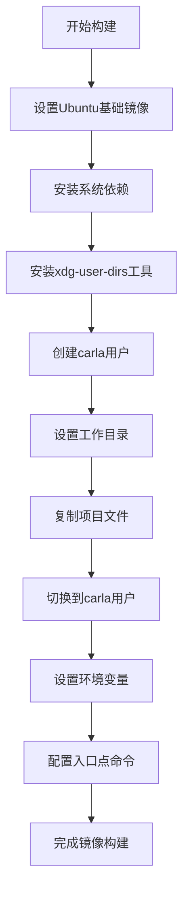
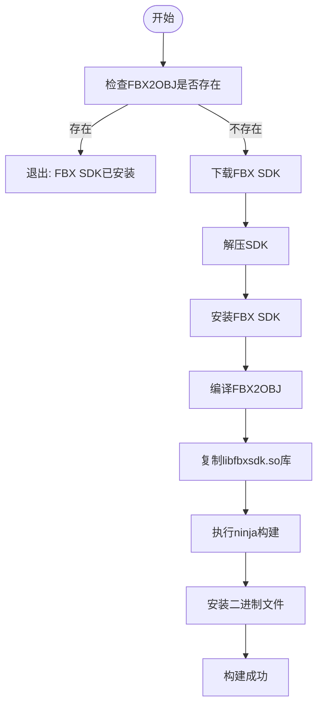
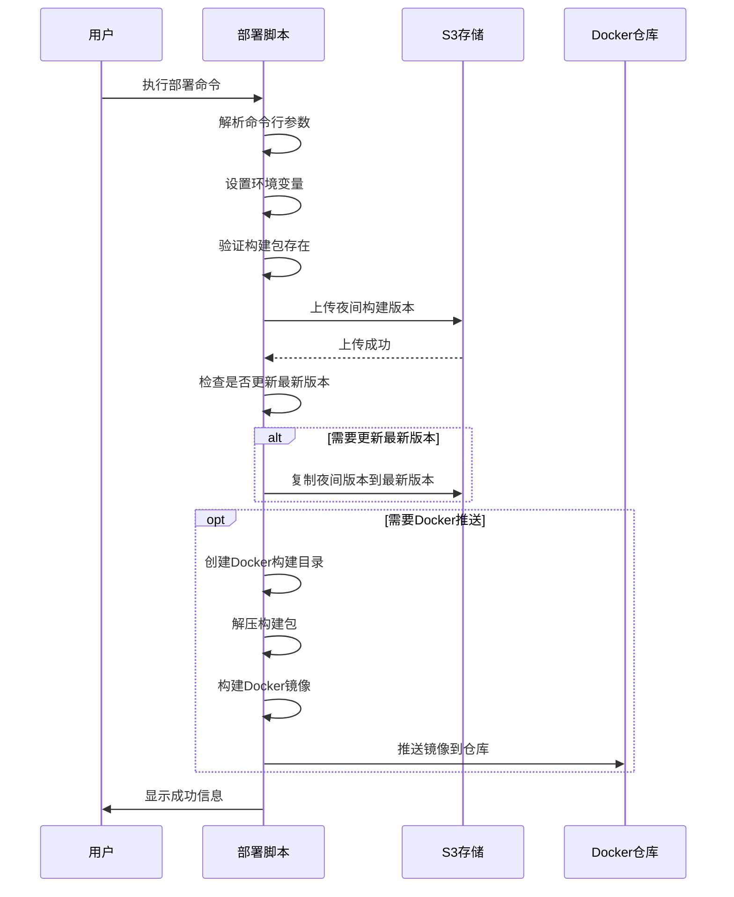

# Docker 工具

> **引用文件**
> **本文档中引用的文件**

- [Release.Dockerfile](https://github.com/carla-simulator/carla/blob/ue5-dev/Util/Docker/Release.Dockerfile)
- [BuildUtilsDocker.sh](https://github.com/carla-simulator/carla/blob/ue5-dev/Util/Tools/BuildUtilsDocker.sh)
- [Deploy.sh](https://github.com/carla-simulator/carla/blob/ue5-dev/Util/Tools/Deploy.sh)
- [Deploy.bat](https://github.com/carla-simulator/carla/blob/ue5-dev/Util/Tools/Deploy.bat)
- [Environment.sh](https://github.com/carla-simulator/carla/blob/ue5-dev/Util/Tools/Environment.sh)
- [build.sh](https://github.com/carla-simulator/carla/blob/ue5-dev/Util/DockerUtils/dist/build.sh)
- [build.bat](https://github.com/carla-simulator/carla/blob/ue5-dev/Util/DockerUtils/dist/build.bat)
- [build_docker.md](https://github.com/carla-simulator/carla/blob/ue5-dev/Docs/build_docker.md)

## 目录

1. [简介](#简介)
2. [Release.Dockerfile 结构分析](#releasedockerfile结构分析)
3. [BuildUtilsDocker.sh 自动化构建](#buildutilsdockersh自动化构建)
4. [部署脚本分析](#部署脚本分析)
5. [自定义 Docker 镜像指南](#自定义docker镜像指南)
6. [Docker 容器运行时配置](#docker容器运行时配置)
7. [性能优化建议](#性能优化建议)
8. [常见问题解决方案](#常见问题解决方案)
9. [结论](#结论)

## 简介

CARLA 自动驾驶仿真平台提供了完整的 Docker 集成和容器化工具，使用户能够在隔离的环境中运行 CARLA 服务器。这些工具包括 Dockerfile 定义、自动化构建脚本和跨平台部署脚本，支持在不同操作系统上进行一致的部署和运行。本文档详细解释了这些工具的结构和使用方法，为用户提供全面的 Docker 集成指南。

## Release.Dockerfile 结构分析

CARLA 的 Release.Dockerfile 定义了用于构建 CARLA Docker 镜像的完整流程。该 Dockerfile 采用多阶段构建策略，确保最终镜像的轻量化和安全性。



**Diagram sources**

- <a href="https://github.com/carla-simulator/carla/blob/ue5-dev/Util/Docker/Release.Dockerfile#L1-L26" target="_blank">Release.Dockerfile</a>

**Section sources**

- <a href="https://github.com/carla-simulator/carla/blob/ue5-dev/Util/Docker/Release.Dockerfile#L1-L26" target="_blank">Release.Dockerfile</a>

### 基础镜像选择

Dockerfile 的第一行使用 ARG 指令定义了 Ubuntu 发行版版本，默认设置为"22.04"。这确保了构建过程的灵活性，允许用户在构建时指定不同的 Ubuntu 版本。

```dockerfile
ARG UBUNTU_DISTRO="22.04"
FROM ubuntu:${UBUNTU_DISTRO}
```

### 依赖安装

Dockerfile 通过 RUN 指令安装了运行 CARLA 所需的关键系统依赖：

- `libsdl2-2.0`: SDL2 库，用于处理图形、音频和输入
- `xserver-xorg`: X 服务器，支持图形界面显示
- `libvulkan1`: Vulkan 图形 API 库，用于高性能图形渲染
- `libomp5`: OpenMP 运行时库，支持并行计算

此外，还单独安装了`xdg-user-dirs`工具，这是 Unreal Engine 定位用户文档目录所必需的。

### 用户和权限配置

为了安全起见，Dockerfile 创建了一个专用的"carla"用户，并将后续操作切换到该用户身份执行。这种做法遵循了容器安全最佳实践，避免了以 root 用户身份运行应用程序。

```dockerfile
RUN useradd -m carla
USER carla
```

### 文件复制和工作目录

所有项目文件被复制到容器的/workspace 目录中，并设置为工作目录。COPY 指令的--chown 参数确保了文件所有权正确分配给 carla 用户。

```dockerfile
WORKDIR /workspace
COPY --chown=carla:carla . .
```

### 环境变量和入口点

Dockerfile 设置了 SDL_VIDEODRIVER 环境变量为"x11"，确保图形输出使用 X11 显示协议。最后，通过 CMD 指令定义了容器的默认执行命令，即运行 CarlaUnreal.sh 脚本。

```dockerfile
ENV SDL_VIDEODRIVER="x11"
CMD ["/bin/bash", "CarlaUnreal.sh"]
```

## BuildUtilsDocker.sh 自动化构建

BuildUtilsDocker.sh 脚本自动化了 Docker 构建工具的准备过程，特别是 FBX 到 OBJ 格式转换工具的编译和安装。



**Diagram sources**

- <a href="https://github.com/carla-simulator/carla/blob/ue5-dev/Util/Tools/BuildUtilsDocker.sh#L1-L64" target="_blank">BuildUtilsDocker.sh</a>

**Section sources**

- <a href="https://github.com/carla-simulator/carla/blob/ue5-dev/Util/Tools/BuildUtilsDocker.sh#L1-L64" target="_blank">BuildUtilsDocker.sh</a>

### 脚本执行流程

脚本首先检查 FBX2OBJ 可执行文件是否已经存在，如果存在则直接退出，避免重复安装。这种检查机制提高了构建效率，特别是在持续集成环境中。

### FBX SDK 管理

脚本从 Autodesk 官方网站下载 FBX SDK，解压并安装到指定目录。安装过程通过管道传递自动回答安装向导的问题，实现了完全自动化。

```bash
echo -e "y\nyes\nn\n" | "${CARLA_DOCKER_UTILS_FOLDER}/${LIB_NAME}" "${FBX2OBJ_DEP_FOLDER}"
```

### 编译过程

使用 CMake 和 Ninja 构建系统编译 FBX2OBJ 工具。CMake 配置指定了 C++14 标准和位置独立代码（PIC）编译选项，确保生成的二进制文件可以在共享库中使用。

```bash
cmake -G "Ninja" \
    -DCMAKE_CXX_FLAGS="-fPIC -std=c++14" \
    ..
```

### 错误处理

脚本包含了完善的错误处理机制。如果 ninja 构建失败，会显示详细的错误信息，并提示用户安装必要的开发依赖（如 libxml2-dev）。

```bash
if [ $? -eq 1 ]; then
  fatal_error "Make sure \"libxml2-dev\" is installed using:\n\n    sudo apt-get install libxml2-dev\n"
  exit 1
fi
```

## 部署脚本分析

CARLA 提供了跨平台的部署脚本（Deploy.sh 和 Deploy.bat），用于将构建的 CARLA 包上传到云存储并进行版本管理。



**Diagram sources**

- <a href="https://github.com/carla-simulator/carla/blob/ue5-dev/Util/Tools/Deploy.sh#L1-L143" target="_blank">Deploy.sh</a>
- <a href="https://github.com/carla-simulator/carla/blob/ue5-dev/Util/Tools/Deploy.bat#L1-L130" target="_blank">Deploy.bat</a>

**Section sources**

- <a href="https://github.com/carla-simulator/carla/blob/ue5-dev/Util/Tools/Deploy.sh#L1-L143" target="_blank">Deploy.sh</a>
- <a href="https://github.com/carla-simulator/carla/blob/ue5-dev/Util/Tools/Deploy.bat#L1-L130" target="_blank">Deploy.bat</a>

### Linux 部署脚本(Deploy.sh)

Linux 版本的部署脚本提供了丰富的命令行选项：

- `--replace-latest`: 将最新构建替换为当前构建
- `--docker-push`: 构建并推送 Docker 镜像
- `--dry-run`: 干运行模式，仅显示将要执行的命令
- `--summary-output`: 指定摘要输出文件路径

脚本使用 AWS CLI 工具将构建包上传到 Backblaze B2 云存储，并支持通过环境变量自定义端点 URL。

### Windows 部署脚本(Deploy.bat)

Windows 版本的批处理脚本提供了类似的功能，但针对 Windows 环境进行了适配：

- 使用 Windows 批处理语法
- 处理 Windows 路径分隔符
- 支持 Windows 特有的环境变量设置

脚本能够检测版本类型（发布版本或开发版本），并相应地设置部署名称和路径。

### 版本命名策略

两个脚本都实现了智能的版本命名策略：

- 对于发布版本（标签版本），使用版本号命名
- 对于开发版本，使用 Git 提交日期和哈希值命名

这种策略确保了版本的唯一性和可追溯性。

## 自定义 Docker 镜像指南

创建自定义 CARLA Docker 镜像是扩展平台功能的关键步骤。以下指南提供了创建和修改 Docker 镜像的详细步骤。

### 添加额外依赖

要在 Docker 镜像中添加额外的依赖，可以修改 Release.Dockerfile 中的 RUN 指令：

```dockerfile
RUN packages='libsdl2-2.0 xserver-xorg libvulkan1 libomp5 python3-pip' \
    && apt-get update \
    && DEBIAN_FRONTEND=noninteractive apt-get install -y $packages \
    && rm -rf /var/lib/apt/lists/*
```

在此示例中，添加了 python3-pip 包管理器，以便在容器内安装 Python 包。

### 修改构建参数

可以通过构建参数自定义镜像构建过程：

```bash
docker build --build-arg UBUNTU_DISTRO=20.04 -t carla-custom:latest .
```

此命令将 Ubuntu 版本从默认的 22.04 更改为 20.04。

### 多阶段构建优化

为了进一步优化镜像大小，可以采用多阶段构建策略：

```dockerfile
# 构建阶段
FROM ubuntu:22.04 as builder
# 安装构建依赖和编译工具

# 运行阶段
FROM ubuntu:22.04
# 只复制必要的运行时文件
COPY --from=builder /path/to/compiled/bin /app/
```

### 自定义入口点

可以创建自定义的启动脚本以满足特定需求：

```bash
#!/bin/bash
# custom_start.sh

# 设置环境变量
export CARLA_SERVER_PORT=2000
export CARLA_TM_PORT=8000

# 启动CARLA服务器
echo "Starting CARLA server on port $CARLA_SERVER_PORT"
exec /bin/bash CarlaUnreal.sh -carla-rpc-port=$CARLA_SERVER_PORT -nosound
```

然后在 Dockerfile 中引用此脚本：

```dockerfile
COPY custom_start.sh /workspace/
CMD ["/bin/bash", "custom_start.sh"]
```

## Docker 容器运行时配置

正确配置 Docker 容器的运行时参数对于 CARLA 的正常运行至关重要。

### 端口映射

CARLA 使用多个端口进行通信，需要正确映射：

```bash
docker run \
    -p 2000-2002:2000-2002 \
    carlasim/carla:latest
```

- 端口 2000: CARLA 服务器 RPC 接口
- 端口 2001: Traffic Manager
- 端口 2002: 其他服务

### GPU 支持配置

启用 GPU 支持需要配置 NVIDIA Container Toolkit：

```bash
docker run \
    --runtime=nvidia \
    --env=NVIDIA_VISIBLE_DEVICES=all \
    --env=NVIDIA_DRIVER_CAPABILITIES=all \
    carlasim/carla:latest
```

这些参数确保容器可以访问所有 NVIDIA GPU 设备和驱动功能。

### 共享卷设置

为了在容器和主机之间共享数据，可以使用卷挂载：

```bash
docker run \
    --volume="/path/on/host:/path/in/container:rw" \
    carlasim/carla:latest
```

常见的挂载场景包括：

- 挂载数据集目录
- 挂载配置文件
- 挂载输出目录以保存仿真结果

### 显示配置

根据是否需要图形界面，有两种显示配置方式：

**无头模式（无显示）：**

```bash
docker run \
    --runtime=nvidia \
    --net=host \
    carlasim/carla:latest bash CarlaUnreal.sh -RenderOffScreen -nosound
```

**有显示模式：**

```bash
docker run \
    --runtime=nvidia \
    --net=host \
    --user=$(id -u):$(id -g) \
    --env=DISPLAY=$DISPLAY \
    --volume="/tmp/.X11-unix:/tmp/.X11-unix:rw" \
    carlasim/carla:latest bash CarlaUnreal.sh -nosound
```

## 性能优化建议

优化 CARLA Docker 镜像和容器的性能对于提高仿真效率至关重要。

### 镜像大小最小化

通过以下策略减小镜像大小：

1. **合并 RUN 指令：**

```dockerfile
RUN apt-get update && \
    apt-get install -y package1 package2 && \
    rm -rf /var/lib/apt/lists/*
```

2. **使用多阶段构建：**
   分离构建环境和运行环境，只将必要的二进制文件复制到最终镜像。

3. **清理临时文件：**
   在每个安装步骤后清理包管理器缓存。

### 缓存策略

利用 Docker 构建缓存提高构建效率：

1. **合理排序 Dockerfile 指令：**
   将不经常变化的指令放在前面，经常变化的指令放在后面。

2. **使用.dockerignore 文件：**
   排除不必要的文件和目录，避免它们进入构建上下文。

3. **分层缓存：**

```dockerfile
# 基础依赖（很少变化）
COPY requirements.txt .
RUN pip install -r requirements.txt

# 应用代码（经常变化）
COPY . .
```

### 运行时性能优化

1. **GPU 资源分配：**

```bash
--gpus '"device=0,1"'  # 指定使用特定GPU
--shm-size=2g  # 增加共享内存大小
```

2. **网络性能：**
   使用`--net=host`模式减少网络开销，特别是在需要低延迟通信的场景中。

3. **存储性能：**
   使用`--volume`挂载高性能存储，避免使用 Docker 的联合文件系统进行频繁的 I/O 操作。

## 常见问题解决方案

### 权限错误

**问题：** 在 Linux 上运行 Docker 命令时需要 sudo 权限。

**解决方案：**

1. 将用户添加到 docker 组：

```bash
sudo usermod -aG docker $USER
```

2. 重新登录或执行`newgrp docker`激活组成员资格。

### 网络配置问题

**问题：** 容器无法访问外部网络或主机无法访问容器服务。

**解决方案：**

1. 检查 Docker 网络配置：

```bash
docker network ls
docker network inspect bridge
```

2. 使用正确的网络模式：

- `--net=host`: 使用主机网络栈
- `-p HOST_PORT:CONTAINER_PORT`: 端口映射

### GPU 支持问题

**问题：** NVIDIA 驱动无法在容器内访问。

**解决方案：**

1. 确认 NVIDIA 驱动在主机上正常工作：

```bash
nvidia-smi
```

2. 安装 NVIDIA Container Toolkit：

```bash
distribution=$(. /etc/os-release;echo $ID$VERSION_ID)
curl -s -L https://nvidia.github.io/nvidia-docker/gpgkey | sudo apt-key add -
curl -s -L https://nvidia.github.io/nvidia-docker/$distribution/nvidia-docker.list | sudo tee /etc/apt/sources.list.d/nvidia-docker.list
sudo apt-get update && sudo apt-get install -y nvidia-docker2
sudo systemctl restart docker
```

3. 测试 NVIDIA Docker 支持：

```bash
docker run --rm --gpus all nvidia/cuda:11.0-base-ubuntu20.04 nvidia-smi
```

### 显示问题

**问题：** 无法在容器内显示图形界面。

**解决方案：**

1. 确保 X11 转发已启用：

```bash
xhost +local:docker
```

2. 正确配置显示环境：

```bash
docker run \
    --env="DISPLAY" \
    --env="QT_X11_NO_MITSHM=1" \
    --volume="/tmp/.X11-unix:/tmp/.X11-unix:rw" \
    your-image
```

3. 对于 WSL2 用户，需要安装 X 服务器（如 VcXsrv）并配置 DISPLAY 环境变量。

## 结论

CARLA 的 Docker 集成和容器化工具提供了一套完整的解决方案，用于构建、部署和运行自动驾驶仿真环境。通过 Release.Dockerfile、BuildUtilsDocker.sh 和部署脚本的协同工作，用户可以轻松创建自定义的 Docker 镜像，并在各种环境中一致地部署 CARLA。合理的运行时配置和性能优化策略可以显著提高仿真效率，而对常见问题的深入理解则有助于快速解决部署过程中遇到的挑战。这套工具链不仅简化了 CARLA 的使用，还为大规模分布式仿真和持续集成提供了坚实的基础。
