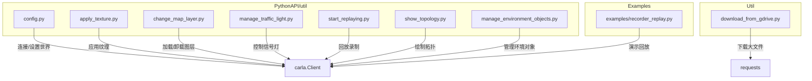
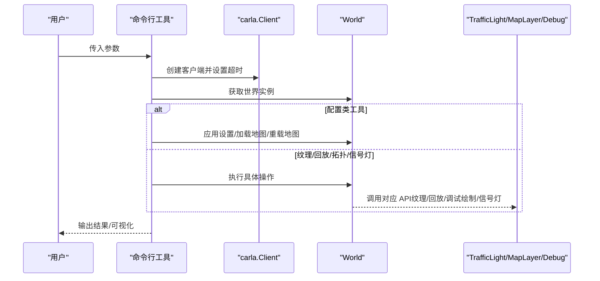
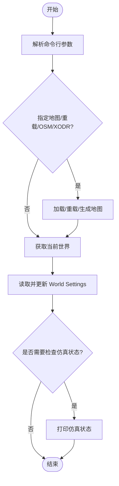
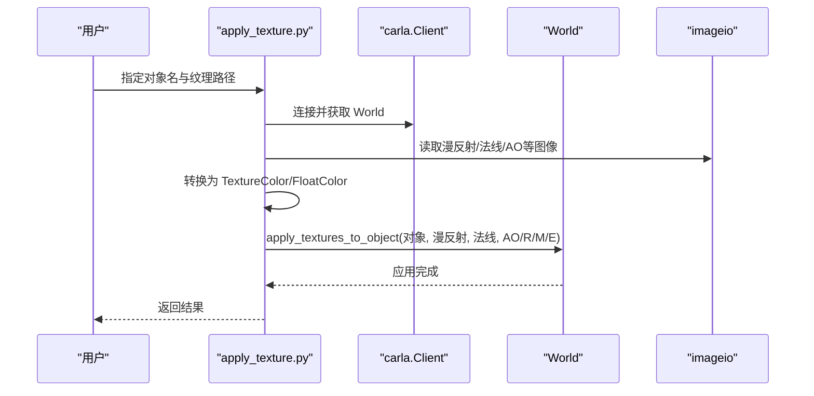
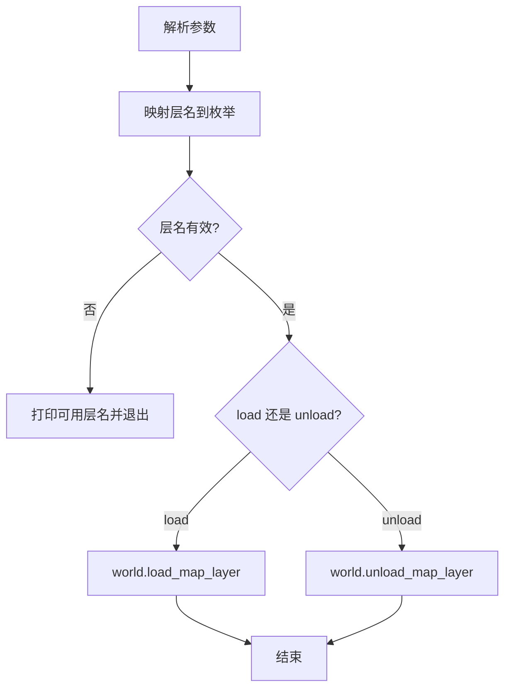
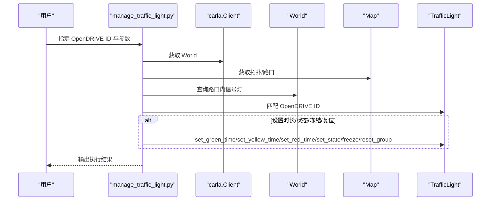
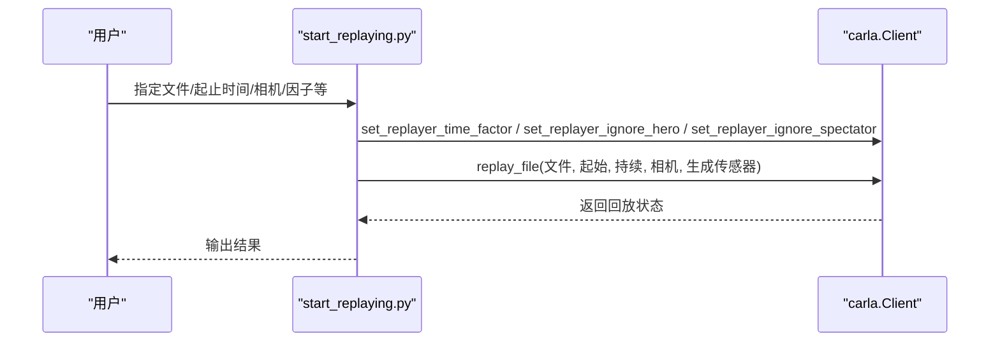
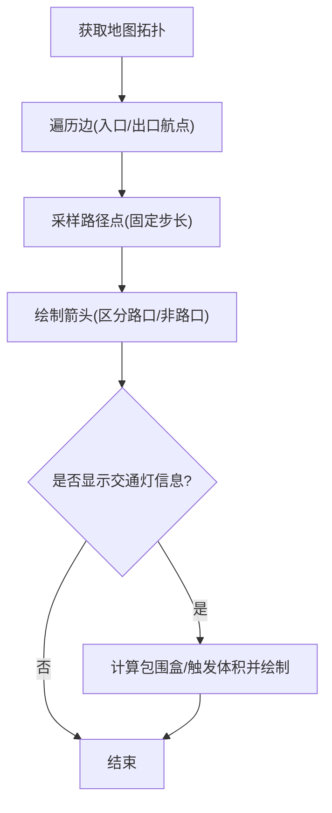
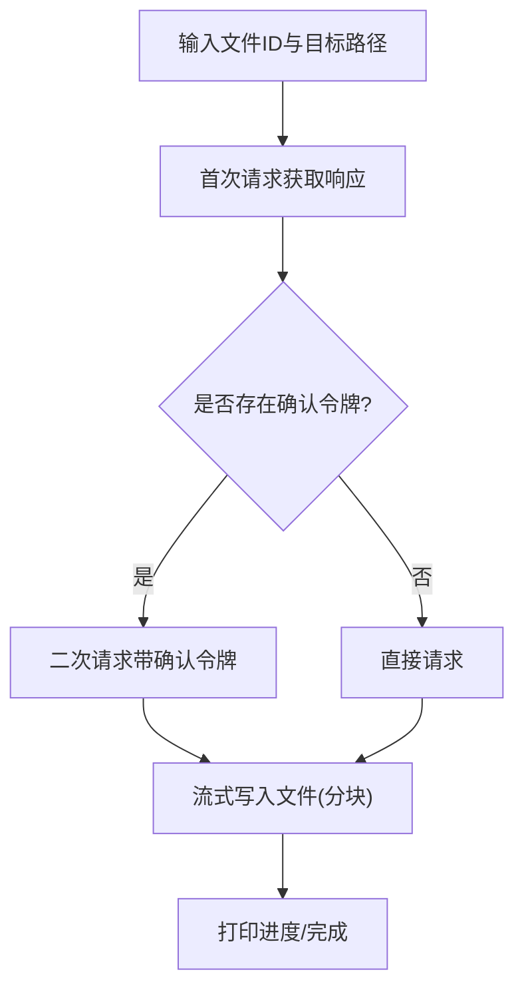
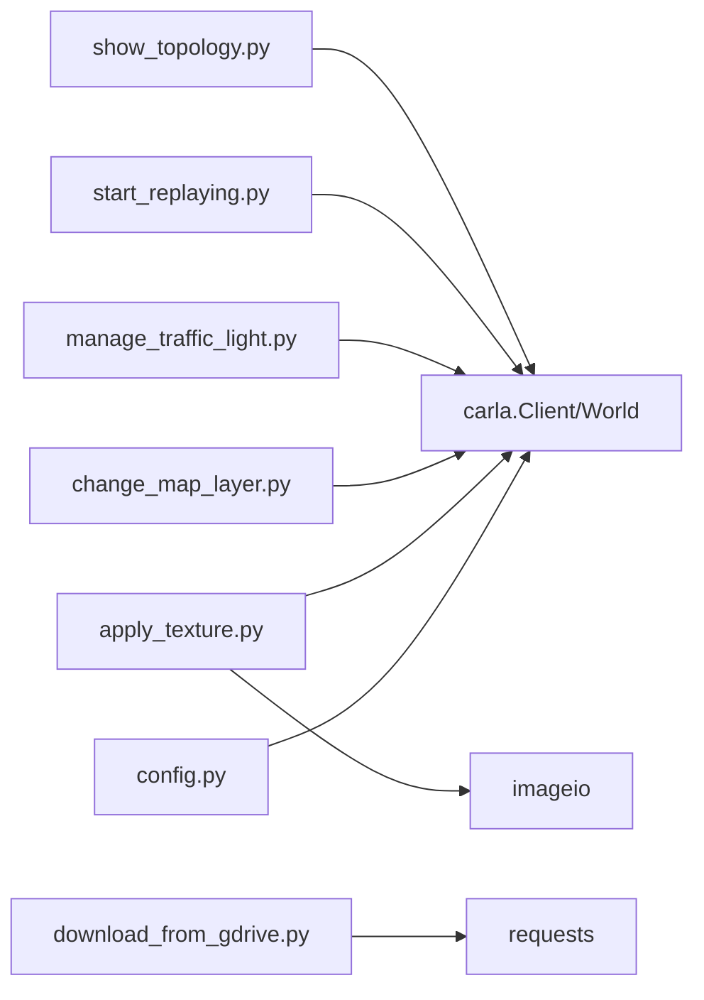

# Python 实用工具

> **引用文件**
> **本文引用的文件列表**

- [PythonAPI/util/config.py](https://github.com/carla-simulator/carla/blob/ue5-dev/PythonAPI/util/config.py)
- [PythonAPI/util/apply_texture.py](https://github.com/carla-simulator/carla/blob/ue5-dev/PythonAPI/util/apply_texture.py)
- [PythonAPI/util/change_map_layer.py](https://github.com/carla-simulator/carla/blob/ue5-dev/PythonAPI/util/change_map_layer.py)
- [PythonAPI/util/manage_traffic_light.py](https://github.com/carla-simulator/carla/blob/ue5-dev/PythonAPI/util/manage_traffic_light.py)
- [PythonAPI/util/start_replaying.py](https://github.com/carla-simulator/carla/blob/ue5-dev/PythonAPI/util/start_replaying.py)
- [PythonAPI/util/show_topology.py](https://github.com/carla-simulator/carla/blob/ue5-dev/PythonAPI/util/show_topology.py)
- [Util/download_from_gdrive.py](https://github.com/carla-simulator/carla/blob/ue5-dev/Util/download_from_gdrive.py)
- [PythonAPI/test/API/test_apply_textures.py](https://github.com/carla-simulator/carla/blob/ue5-dev/PythonAPI/test/API/test_apply_textures.py)
- [PythonAPI/examples/recorder_replay.py](https://github.com/carla-simulator/carla/blob/ue5-dev/PythonAPI/examples/recorder_replay.py)
- [PythonAPI/util/show_traffic_lights.py](https://github.com/carla-simulator/carla/blob/ue5-dev/PythonAPI/util/show_traffic_lights.py)
- [PythonAPI/util/show_junctions.py](https://github.com/carla-simulator/carla/blob/ue5-dev/PythonAPI/util/show_junctions.py)
- [PythonAPI/util/show_crosswalks.py](https://github.com/carla-simulator/carla/blob/ue5-dev/PythonAPI/util/show_crosswalks.py)
- [PythonAPI/util/manage_environment_objects.py](https://github.com/carla-simulator/carla/blob/ue5-dev/PythonAPI/util/manage_environment_objects.py)

## 目录

1. [简介](#简介)
2. [项目结构](#项目结构)
3. [核心组件](#核心组件)
4. [架构总览](#架构总览)
5. [详细组件分析](#详细组件分析)
6. [依赖关系分析](#依赖关系分析)
7. [性能与可用性建议](#性能与可用性建议)
8. [故障排查指南](#故障排查指南)
9. [结论](#结论)
10. [附录：使用示例与最佳实践](#附录使用示例与最佳实践)

## 简介

本文件系统化梳理 CARLA Python 实用工具集，覆盖以下工具的功能、实现要点、数据流与典型使用场景：

- 配置管理：config.py
- 自定义纹理应用：apply_texture.py
- 动态地图层管理：change_map_layer.py
- 交通信号灯控制：manage_traffic_light.py
- 录制回放启动：start_replaying.py
- 道路拓扑可视化：show_topology.py
- 资源从 Google Drive 下载：Util/download_from_gdrive.py

文档同时提供面向自动化测试与仿真工作流的集成建议、常见问题排查与性能优化提示，帮助读者快速上手并稳定落地。

## 项目结构

这些工具位于 PythonAPI/util 与 Util 目录下，均采用命令行入口，通过 carla.Client 连接仿真服务器，调用 World/TrafficLight 等接口完成配置、渲染、回放等操作。

图表来源

- <a href="https://github.com/carla-simulator/carla/blob/ue5-dev/PythonAPI/util/config.py#L1-L260" target="_blank">PythonAPI/util/config.py</a>
- <a href="https://github.com/carla-simulator/carla/blob/ue5-dev/PythonAPI/util/apply_texture.py#L1-L109" target="_blank">PythonAPI/util/apply_texture.py</a>
- <a href="https://github.com/carla-simulator/carla/blob/ue5-dev/PythonAPI/util/change_map_layer.py#L1-L63" target="_blank">PythonAPI/util/change_map_layer.py</a>
- <a href="https://github.com/carla-simulator/carla/blob/ue5-dev/PythonAPI/util/manage_traffic_light.py#L1-L111" target="_blank">PythonAPI/util/manage_traffic_light.py</a>
- <a href="https://github.com/carla-simulator/carla/blob/ue5-dev/PythonAPI/util/start_replaying.py#L1-L79" target="_blank">PythonAPI/util/start_replaying.py</a>
- <a href="https://github.com/carla-simulator/carla/blob/ue5-dev/PythonAPI/util/show_topology.py#L1-L96" target="_blank">PythonAPI/util/show_topology.py</a>
- <a href="https://github.com/carla-simulator/carla/blob/ue5-dev/Util/download_from_gdrive.py#L1-L87" target="_blank">Util/download_from_gdrive.py</a>
- <a href="https://github.com/carla-simulator/carla/blob/ue5-dev/PythonAPI/examples/recorder_replay.py#L1-L164" target="_blank">PythonAPI/examples/recorder_replay.py</a>

章节来源

- <a href="https://github.com/carla-simulator/carla/blob/ue5-dev/PythonAPI/util/config.py#L1-L260" target="_blank">PythonAPI/util/config.py</a>
- <a href="https://github.com/carla-simulator/carla/blob/ue5-dev/PythonAPI/util/apply_texture.py#L1-L109" target="_blank">PythonAPI/util/apply_texture.py</a>
- <a href="https://github.com/carla-simulator/carla/blob/ue5-dev/PythonAPI/util/change_map_layer.py#L1-L63" target="_blank">PythonAPI/util/change_map_layer.py</a>
- <a href="https://github.com/carla-simulator/carla/blob/ue5-dev/PythonAPI/util/manage_traffic_light.py#L1-L111" target="_blank">PythonAPI/util/manage_traffic_light.py</a>
- <a href="https://github.com/carla-simulator/carla/blob/ue5-dev/PythonAPI/util/start_replaying.py#L1-L79" target="_blank">PythonAPI/util/start_replaying.py</a>
- <a href="https://github.com/carla-simulator/carla/blob/ue5-dev/PythonAPI/util/show_topology.py#L1-L96" target="_blank">PythonAPI/util/show_topology.py</a>
- <a href="https://github.com/carla-simulator/carla/blob/ue5-dev/Util/download_from_gdrive.py#L1-L87" target="_blank">Util/download_from_gdrive.py</a>
- <a href="https://github.com/carla-simulator/carla/blob/ue5-dev/PythonAPI/examples/recorder_replay.py#L1-L164" target="_blank">PythonAPI/examples/recorder_replay.py</a>

## 核心组件

- 配置管理（config.py）
  - 支持主机与端口参数、列出可用地图/蓝图、加载/重载地图、基于 OpenDRIVE/OpenStreetMap 的地图生成、帧率与同步模式设置、瓦片流距离与演员激活距离等。
- 自定义纹理应用（apply_texture.py）
  - 读取图像文件，转换为 8 位或浮点纹理，应用于指定对象（支持漫反射、法线、AO/Rough/Metal/Emissive）。
- 动态地图层管理（change_map_layer.py）
  - 按名称加载/卸载地图层（如 Buildings、Props、Foliage 等）。
- 交通信号灯控制（manage_traffic_light.py）
  - 基于 OpenDRIVE ID 查找信号灯，设置绿/黄/红时长、状态、冻结、复位组等。
- 录制回放启动（start_replaying.py）
  - 设置回放缓存时间因子、是否忽略英雄车、是否移动观察者相机、是否在回放世界中生成传感器等，然后回放指定文件。
- 道路拓扑可视化（show_topology.py）
  - 绘制道路拓扑箭头，区分路口与非路口颜色；可选显示交通灯触发体积与包围盒。
- Google Drive 资源下载（Util/download_from_gdrive.py）
  - 大文件下载，处理确认令牌，分块写入，终端进度反馈。

章节来源

- <a href="https://github.com/carla-simulator/carla/blob/ue5-dev/PythonAPI/util/config.py#L91-L248" target="_blank">PythonAPI/util/config.py</a>
- <a href="https://github.com/carla-simulator/carla/blob/ue5-dev/PythonAPI/util/apply_texture.py#L51-L106" target="_blank">PythonAPI/util/apply_texture.py</a>
- <a href="https://github.com/carla-simulator/carla/blob/ue5-dev/PythonAPI/util/change_map_layer.py#L28-L60" target="_blank">PythonAPI/util/change_map_layer.py</a>
- <a href="https://github.com/carla-simulator/carla/blob/ue5-dev/PythonAPI/util/manage_traffic_light.py#L41-L108" target="_blank">PythonAPI/util/manage_traffic_light.py</a>
- <a href="https://github.com/carla-simulator/carla/blob/ue5-dev/PythonAPI/util/start_replaying.py#L14-L66" target="_blank">PythonAPI/util/start_replaying.py</a>
- <a href="https://github.com/carla-simulator/carla/blob/ue5-dev/PythonAPI/util/show_topology.py#L54-L94" target="_blank">PythonAPI/util/show_topology.py</a>
- <a href="https://github.com/carla-simulator/carla/blob/ue5-dev/Util/download_from_gdrive.py#L34-L68" target="_blank">Util/download_from_gdrive.py</a>

## 架构总览

各工具均遵循“命令行参数解析 -> 连接 CARLA -> 获取 World -> 执行操作”的通用流程。部分工具还依赖外部库（如 imageio、requests）进行图像与网络处理。

图表来源

- <a href="https://github.com/carla-simulator/carla/blob/ue5-dev/PythonAPI/util/config.py#L150-L240" target="_blank">PythonAPI/util/config.py</a>
- <a href="https://github.com/carla-simulator/carla/blob/ue5-dev/PythonAPI/util/apply_texture.py#L76-L106" target="_blank">PythonAPI/util/apply_texture.py</a>
- <a href="https://github.com/carla-simulator/carla/blob/ue5-dev/PythonAPI/util/start_replaying.py#L52-L66" target="_blank">PythonAPI/util/start_replaying.py</a>
- <a href="https://github.com/carla-simulator/carla/blob/ue5-dev/PythonAPI/util/show_topology.py#L68-L94" target="_blank">PythonAPI/util/show_topology.py</a>
- <a href="https://github.com/carla-simulator/carla/blob/ue5-dev/PythonAPI/util/manage_traffic_light.py#L73-L108" target="_blank">PythonAPI/util/manage_traffic_light.py</a>

## 详细组件分析

### 配置管理（config.py）

- 主要职责
  - 解析主机与端口、列出可用地图与蓝图、加载/重载地图、基于 OpenDRIVE/OpenStreetMap 生成地图、设置帧率与同步模式、瓦片流距离与演员激活距离、打印仿真快照信息。
- 关键流程
  - 参数解析后建立客户端，按条件选择加载/重载/生成地图路径，随后根据参数更新 World Settings 并应用。
  - 可选打印仿真状态（版本、地图、时间、帧率、渲染/同步开关、演员数量等）。
- 错误处理
  - 文件读取异常、端口不可达、参数冲突等情况均有明确提示。
- 性能与可用性
  - 固定帧率与同步模式适合确定性测试；变量帧率适合高吞吐场景。
  - OpenDRIVE/OSM 生成参数可调，平衡质量与性能。

图表来源

- <a href="https://github.com/carla-simulator/carla/blob/ue5-dev/PythonAPI/util/config.py#L91-L248" target="_blank">PythonAPI/util/config.py</a>

章节来源

- <a href="https://github.com/carla-simulator/carla/blob/ue5-dev/PythonAPI/util/config.py#L91-L248" target="_blank">PythonAPI/util/config.py</a>

### 自定义纹理应用（apply_texture.py）

- 主要职责
  - 将本地图像文件转换为 CARLA 纹理（8 位漫反射、浮点法线与 AO/Rough/Metal/Emissive），并应用到指定对象。
- 关键流程
  - 读取图像 -> 转换为 TextureColor/TextureFloatColor -> 调用 World.apply_textures_to_object。
- 数据结构与复杂度
  - 图像像素遍历 O(W×H)，内存占用与图像尺寸线性相关。
- 错误处理
  - 缺少对象名时报错；图像读取失败时退出。
- 集成建议
  - 与自动化测试结合：批量生成噪声纹理，验证材质渲染一致性。

图表来源

- <a href="https://github.com/carla-simulator/carla/blob/ue5-dev/PythonAPI/util/apply_texture.py#L51-L106" target="_blank">PythonAPI/util/apply_texture.py</a>

章节来源

- <a href="https://github.com/carla-simulator/carla/blob/ue5-dev/PythonAPI/util/apply_texture.py#L51-L106" target="_blank">PythonAPI/util/apply_texture.py</a>
- <a href="https://github.com/carla-simulator/carla/blob/ue5-dev/PythonAPI/test/API/test_apply_textures.py#L86-L127" target="_blank">PythonAPI/test/API/test_apply_textures.py</a>

### 动态地图层管理（change_map_layer.py）

- 主要职责
  - 加载/卸载地图层（Buildings、Decals、Foliage、Ground、ParkedVehicles、Particles、Props、StreetLights、Walls、All）。
- 关键流程
  - 参数解析 -> 映射层名到枚举 -> load_map_layer 或 unload_map_layer。
- 错误处理
  - 层名不存在时输出可用列表并退出。
- 使用场景
  - 快速切换城市细节密度，或在大规模地图中按需加载/卸载静态资产。

图表来源

- <a href="https://github.com/carla-simulator/carla/blob/ue5-dev/PythonAPI/util/change_map_layer.py#L28-L60" target="_blank">PythonAPI/util/change_map_layer.py</a>

章节来源

- <a href="https://github.com/carla-simulator/carla/blob/ue5-dev/PythonAPI/util/change_map_layer.py#L28-L60" target="_blank">PythonAPI/util/change_map_layer.py</a>

### 交通信号灯控制（manage_traffic_light.py）

- 主要职责
  - 通过 OpenDRIVE ID 定位信号灯，设置绿/黄/红时长、瞬时状态、冻结、复位组等。
- 关键流程
  - 解析参数 -> 从地图拓扑收集所有路口 -> 查询目标信号灯 -> 执行设置。
- 错误处理
  - 未找到目标信号灯时提示并退出；状态枚举错误时提示可用集合。
- 可视化辅助
  - 提供 show_traffic_lights.py 辅助查看信号灯包围盒、触发体积、光箱、受影响/停止航点等。

图表来源

- <a href="https://github.com/carla-simulator/carla/blob/ue5-dev/PythonAPI/util/manage_traffic_light.py#L41-L108" target="_blank">PythonAPI/util/manage_traffic_light.py</a>
- <a href="https://github.com/carla-simulator/carla/blob/ue5-dev/PythonAPI/util/show_traffic_lights.py#L56-L100" target="_blank">PythonAPI/util/show_traffic_lights.py</a>

章节来源

- <a href="https://github.com/carla-simulator/carla/blob/ue5-dev/PythonAPI/util/manage_traffic_light.py#L41-L108" target="_blank">PythonAPI/util/manage_traffic_light.py</a>
- <a href="https://github.com/carla-simulator/carla/blob/ue5-dev/PythonAPI/util/show_traffic_lights.py#L56-L100" target="_blank">PythonAPI/util/show_traffic_lights.py</a>

### 录制回放启动（start_replaying.py）

- 主要职责
  - 设置回放缓存时间因子、是否忽略英雄车、是否移动观察者相机、是否在回放世界中生成传感器，然后回放指定文件。
- 关键流程
  - 参数解析 -> 创建客户端 -> set*replayer*\* -> replay_file -> 输出回放结果。
- 与示例脚本的关系
  - examples/recorder_replay.py 提供更完整的交互式回放体验（速度调节、跟随视角、同步模式等）。

图表来源

- <a href="https://github.com/carla-simulator/carla/blob/ue5-dev/PythonAPI/util/start_replaying.py#L14-L66" target="_blank">PythonAPI/util/start_replaying.py</a>
- <a href="https://github.com/carla-simulator/carla/blob/ue5-dev/PythonAPI/examples/recorder_replay.py#L96-L128" target="_blank">PythonAPI/examples/recorder_replay.py</a>

章节来源

- <a href="https://github.com/carla-simulator/carla/blob/ue5-dev/PythonAPI/util/start_replaying.py#L14-L66" target="_blank">PythonAPI/util/start_replaying.py</a>
- <a href="https://github.com/carla-simulator/carla/blob/ue5-dev/PythonAPI/examples/recorder_replay.py#L96-L128" target="_blank">PythonAPI/examples/recorder_replay.py</a>

### 道路拓扑可视化（show_topology.py）

- 主要职责
  - 遍历地图拓扑，绘制道路方向箭头；可选计算并绘制交通灯触发体积与包围盒。
- 关键流程
  - 获取拓扑 -> 采样路径点 -> 绘制箭头；若显示交通灯，计算旋转后的包围盒与触发体积并绘制。
- 可视化辅助
  - show_junctions.py 与 show_crosswalks.py 分别用于绘制路口边界与人行横道连线。

图表来源

- <a href="https://github.com/carla-simulator/carla/blob/ue5-dev/PythonAPI/util/show_topology.py#L54-L94" target="_blank">PythonAPI/util/show_topology.py</a>
- <a href="https://github.com/carla-simulator/carla/blob/ue5-dev/PythonAPI/util/show_junctions.py#L28-L56" target="_blank">PythonAPI/util/show_junctions.py</a>
- <a href="https://github.com/carla-simulator/carla/blob/ue5-dev/PythonAPI/util/show_crosswalks.py#L67-L88" target="_blank">PythonAPI/util/show_crosswalks.py</a>

章节来源

- <a href="https://github.com/carla-simulator/carla/blob/ue5-dev/PythonAPI/util/show_topology.py#L54-L94" target="_blank">PythonAPI/util/show_topology.py</a>
- <a href="https://github.com/carla-simulator/carla/blob/ue5-dev/PythonAPI/util/show_junctions.py#L28-L56" target="_blank">PythonAPI/util/show_junctions.py</a>
- <a href="https://github.com/carla-simulator/carla/blob/ue5-dev/PythonAPI/util/show_crosswalks.py#L67-L88" target="_blank">PythonAPI/util/show_crosswalks.py</a>

### Google Drive 资源下载（Util/download_from_gdrive.py）

- 主要职责
  - 处理 Google Drive 的“确认下载”令牌，分块下载大文件，实时打印进度。
- 关键流程
  - 发送请求 -> 识别确认令牌 -> 再次请求并流式写入 -> 终端进度刷新。
- 错误处理
  - 中断时友好提示；文件不存在或网络异常时给出明确信息。

图表来源

- <a href="https://github.com/carla-simulator/carla/blob/ue5-dev/Util/download_from_gdrive.py#L34-L68" target="_blank">Util/download_from_gdrive.py</a>

章节来源

- <a href="https://github.com/carla-simulator/carla/blob/ue5-dev/Util/download_from_gdrive.py#L34-L68" target="_blank">Util/download_from_gdrive.py</a>

## 依赖关系分析

- 工具间耦合
  - 多数工具仅依赖 carla.Client 与 World 接口，耦合度低，便于独立使用。
  - show_topology.py 与 manage_traffic_light.py 在逻辑上互补：前者可视化拓扑，后者控制信号灯。
- 外部依赖
  - apply_texture.py 依赖 imageio；download_from_gdrive.py 依赖 requests。
- 可能的循环依赖
  - 无直接循环依赖，工具通过公共 API 调用，结构清晰。

图表来源

- <a href="https://github.com/carla-simulator/carla/blob/ue5-dev/PythonAPI/util/apply_texture.py#L14-L20" target="_blank">PythonAPI/util/apply_texture.py</a>
- <a href="https://github.com/carla-simulator/carla/blob/ue5-dev/Util/download_from_gdrive.py#L15-L16" target="_blank">Util/download_from_gdrive.py</a>

章节来源

- <a href="https://github.com/carla-simulator/carla/blob/ue5-dev/PythonAPI/util/apply_texture.py#L14-L20" target="_blank">PythonAPI/util/apply_texture.py</a>
- <a href="https://github.com/carla-simulator/carla/blob/ue5-dev/Util/download_from_gdrive.py#L15-L16" target="_blank">Util/download_from_gdrive.py</a>

## 性能与可用性建议

- 固定帧率与同步模式
  - 在自动化测试中建议启用同步模式与固定帧率，确保确定性；在高吞吐场景可关闭同步与渲染。
- 地图层管理
  - 在大规模地图中按需加载/卸载静态层，减少内存与渲染压力。
- 纹理应用
  - 控制纹理分辨率与格式，避免过大的图像导致内存峰值；批量应用时注意 GPU/CPU 负载。
- 回放
  - 合理设置回放缓存时间因子与忽略策略，避免回放卡顿；必要时开启同步模式提升相机跟随稳定性。
- 可视化
  - 可视化工具仅用于调试，避免在长时间运行中持续绘制影响性能。

[本节为通用建议，不直接分析具体文件]

## 故障排查指南

- 连接失败
  - 检查主机与端口参数；确认 CARLA 服务器已启动且网络可达。
- 文件不存在
  - OpenDRIVE/OSM 文件路径错误；确认文件存在且可读。
- 对象/层名无效
  - apply_texture.py 缺少对象名；change_map_layer.py 层名拼写错误；manage_traffic_light.py OpenDRIVE ID 不存在。
- 权限与令牌
  - download_from_gdrive.py 需要正确 ID 与目标路径；网络受限时可能无法访问。
- 回放异常
  - start_replaying.py 与 examples/recorder_replay.py 的参数组合不当可能导致回放失败；优先参考示例脚本。

章节来源

- <a href="https://github.com/carla-simulator/carla/blob/ue5-dev/PythonAPI/util/config.py#L160-L204" target="_blank">PythonAPI/util/config.py</a>
- <a href="https://github.com/carla-simulator/carla/blob/ue5-dev/PythonAPI/util/apply_texture.py#L81-L106" target="_blank">PythonAPI/util/apply_texture.py</a>
- <a href="https://github.com/carla-simulator/carla/blob/ue5-dev/PythonAPI/util/change_map_layer.py#L45-L60" target="_blank">PythonAPI/util/change_map_layer.py</a>
- <a href="https://github.com/carla-simulator/carla/blob/ue5-dev/PythonAPI/util/manage_traffic_light.py#L73-L108" target="_blank">PythonAPI/util/manage_traffic_light.py</a>
- <a href="https://github.com/carla-simulator/carla/blob/ue5-dev/PythonAPI/util/start_replaying.py#L50-L66" target="_blank">PythonAPI/util/start_replaying.py</a>
- <a href="https://github.com/carla-simulator/carla/blob/ue5-dev/Util/download_from_gdrive.py#L56-L68" target="_blank">Util/download_from_gdrive.py</a>

## 结论

上述工具覆盖了 CARLA 仿真中的关键操作面：配置、纹理、地图层、信号灯、回放与可视化。它们以简洁的命令行接口与稳定的 API 调用，为自动化测试与仿真工作流提供了高效支撑。建议在实际项目中结合同步模式、固定帧率与按需加载策略，以获得更好的确定性与性能表现。

[本节为总结性内容，不直接分析具体文件]

## 附录：使用示例与最佳实践

- 配置管理（config.py）
  - 列出可用地图与蓝图：使用 --list 与 --list-blueprints。
  - 加载/重载地图：--map/--reload-map。
  - 设置帧率与同步：--delta-seconds/--fps/--no-sync。
  - OpenDRIVE/OSM 地图生成：--xodr-path/--osm-path。
  - 示例路径：<a href="https://github.com/carla-simulator/carla/blob/ue5-dev/PythonAPI/util/config.py#L91-L248" target="_blank">PythonAPI/util/config.py</a>
- 自定义纹理应用（apply_texture.py）
  - 应用对象纹理：--object-name 与 --diffuse/--normal/--ao_roughness_metallic_emissive。
  - 测试参考：<a href="https://github.com/carla-simulator/carla/blob/ue5-dev/PythonAPI/test/API/test_apply_textures.py#L86-L127" target="_blank">PythonAPI/test/API/test_apply_textures.py</a>
- 动态地图层管理（change_map_layer.py）
  - 加载/卸载层：--layer 与 --action。
  - 示例路径：<a href="https://github.com/carla-simulator/carla/blob/ue5-dev/PythonAPI/util/change_map_layer.py#L28-L60" target="_blank">PythonAPI/util/change_map_layer.py</a>
- 交通信号灯控制（manage_traffic_light.py）
  - 设置时长/状态/冻结/复位：--id 与 -gt/-yt/-rt/-st/-f/--reset-group。
  - 可视化辅助：<a href="https://github.com/carla-simulator/carla/blob/ue5-dev/PythonAPI/util/show_traffic_lights.py#L56-L100" target="_blank">PythonAPI/util/show_traffic_lights.py</a>
- 录制回放启动（start_replaying.py）
  - 基本回放：--recorder-filename 与 --start/--duration/--time-factor/--ignore-hero/--move-spectator/--spawn-sensors。
  - 交互式回放：<a href="https://github.com/carla-simulator/carla/blob/ue5-dev/PythonAPI/examples/recorder_replay.py#L96-L128" target="_blank">PythonAPI/examples/recorder_replay.py</a>
- 道路拓扑可视化（show_topology.py）
  - 可视化拓扑与信号灯信息：--show。
  - 补充工具：<a href="https://github.com/carla-simulator/carla/blob/ue5-dev/PythonAPI/util/show_junctions.py#L28-L56" target="_blank">PythonAPI/util/show_junctions.py</a>、<a href="https://github.com/carla-simulator/carla/blob/ue5-dev/PythonAPI/util/show_crosswalks.py#L67-L88" target="_blank">PythonAPI/util/show_crosswalks.py</a>
- Google Drive 资源下载（Util/download_from_gdrive.py）
  - 下载大文件：python3 Util/download_from_gdrive.py <file_id> <destination>。
  - 示例路径：<a href="https://github.com/carla-simulator/carla/blob/ue5-dev/Util/download_from_gdrive.py#L70-L87" target="_blank">Util/download_from_gdrive.py</a>

章节来源

- <a href="https://github.com/carla-simulator/carla/blob/ue5-dev/PythonAPI/util/config.py#L91-L248" target="_blank">PythonAPI/util/config.py</a>
- <a href="https://github.com/carla-simulator/carla/blob/ue5-dev/PythonAPI/util/apply_texture.py#L51-L106" target="_blank">PythonAPI/util/apply_texture.py</a>
- <a href="https://github.com/carla-simulator/carla/blob/ue5-dev/PythonAPI/util/change_map_layer.py#L28-L60" target="_blank">PythonAPI/util/change_map_layer.py</a>
- <a href="https://github.com/carla-simulator/carla/blob/ue5-dev/PythonAPI/util/manage_traffic_light.py#L41-L108" target="_blank">PythonAPI/util/manage_traffic_light.py</a>
- <a href="https://github.com/carla-simulator/carla/blob/ue5-dev/PythonAPI/util/start_replaying.py#L14-L66" target="_blank">PythonAPI/util/start_replaying.py</a>
- <a href="https://github.com/carla-simulator/carla/blob/ue5-dev/PythonAPI/util/show_topology.py#L54-L94" target="_blank">PythonAPI/util/show_topology.py</a>
- <a href="https://github.com/carla-simulator/carla/blob/ue5-dev/Util/download_from_gdrive.py#L70-L87" target="_blank">Util/download_from_gdrive.py</a>
- <a href="https://github.com/carla-simulator/carla/blob/ue5-dev/PythonAPI/test/API/test_apply_textures.py#L86-L127" target="_blank">PythonAPI/test/API/test_apply_textures.py</a>
- <a href="https://github.com/carla-simulator/carla/blob/ue5-dev/PythonAPI/examples/recorder_replay.py#L96-L128" target="_blank">PythonAPI/examples/recorder_replay.py</a>
- <a href="https://github.com/carla-simulator/carla/blob/ue5-dev/PythonAPI/util/show_traffic_lights.py#L56-L100" target="_blank">PythonAPI/util/show_traffic_lights.py</a>
- <a href="https://github.com/carla-simulator/carla/blob/ue5-dev/PythonAPI/util/show_junctions.py#L28-L56" target="_blank">PythonAPI/util/show_junctions.py</a>
- <a href="https://github.com/carla-simulator/carla/blob/ue5-dev/PythonAPI/util/show_crosswalks.py#L67-L88" target="_blank">PythonAPI/util/show_crosswalks.py</a>
