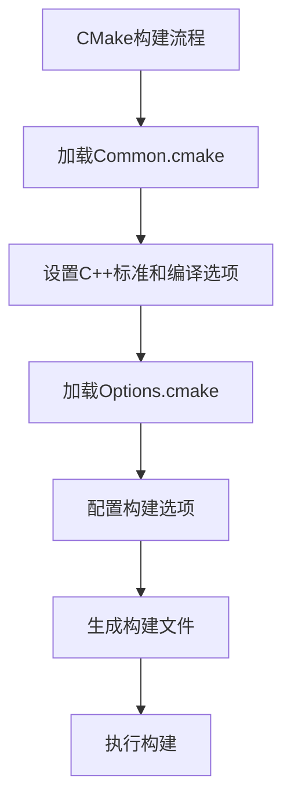
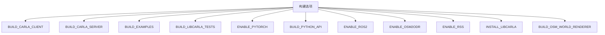
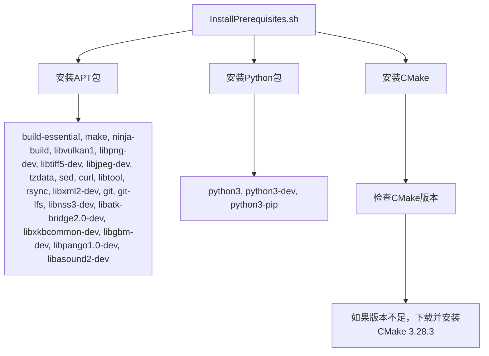
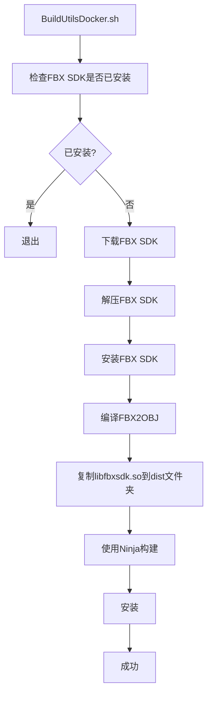
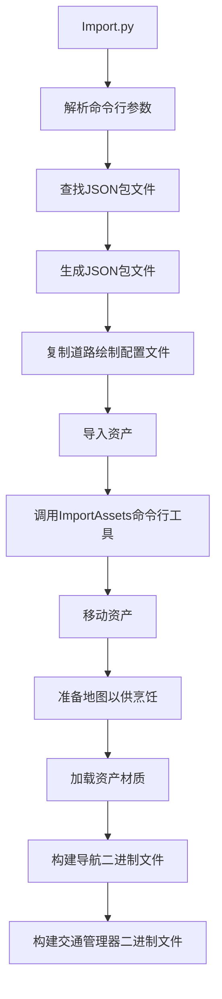
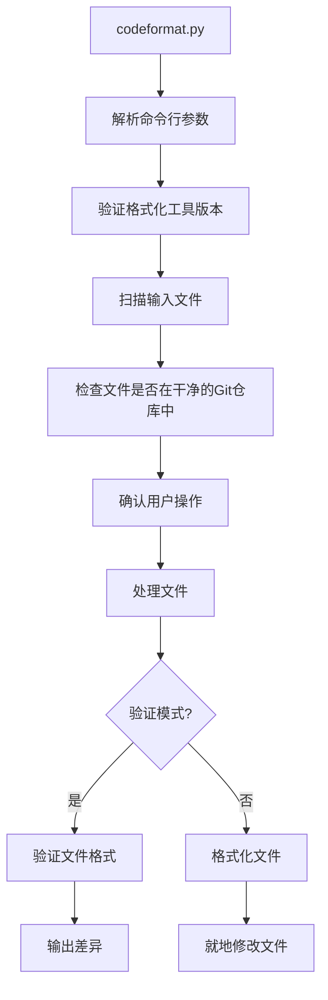
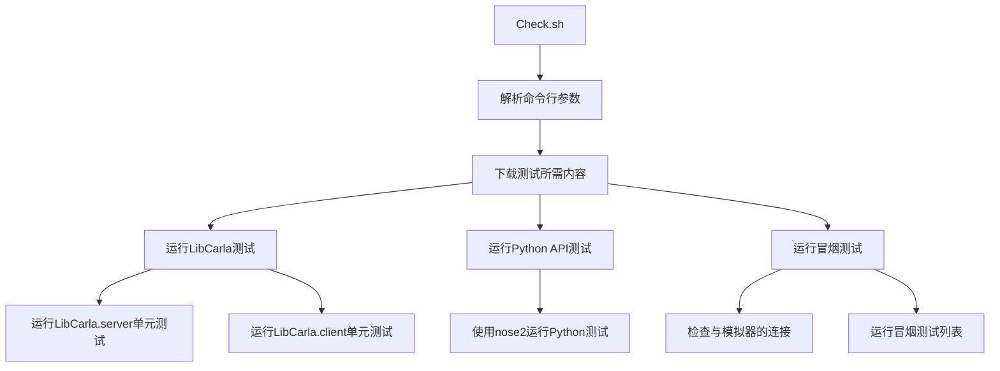
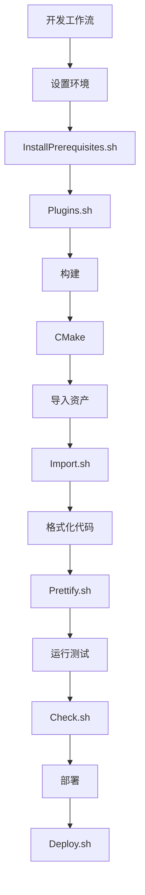

# 工具与实用程序


**本文档中引用的文件**   
- [Import.py](https://github.com/carla-simulator/carla/blob/ue5-dev/Util/Tools/Import.py)
- [InstallPrerequisites.sh](https://github.com/carla-simulator/carla/blob/ue5-dev/Util/SetupUtils/InstallPrerequisites.sh)
- [Release.Dockerfile](https://github.com/carla-simulator/carla/blob/ue5-dev/Util/Docker/Release.Dockerfile)
- [Import.sh](https://github.com/carla-simulator/carla/blob/ue5-dev/Util/Tools/Import.sh)
- [BuildUtilsDocker.sh](https://github.com/carla-simulator/carla/blob/ue5-dev/Util/Tools/BuildUtilsDocker.sh)
- [Environment.sh](https://github.com/carla-simulator/carla/blob/ue5-dev/Util/Tools/Environment.sh)
- [Prettify.sh](https://github.com/carla-simulator/carla/blob/ue5-dev/Util/Tools/Prettify.sh)
- [codeformat.py](https://github.com/carla-simulator/carla/blob/ue5-dev/Util/Formatting/codeformat.py)
- [Plugins.sh](https://github.com/carla-simulator/carla/blob/ue5-dev/Util/Tools/Plugins.sh)
- [Deploy.sh](https://github.com/carla-simulator/carla/blob/ue5-dev/Util/Tools/Deploy.sh)
- [Plugins.bat](https://github.com/carla-simulator/carla/blob/ue5-dev/Util/Tools/Plugins.bat)
- [Deploy.bat](https://github.com/carla-simulator/carla/blob/ue5-dev/Util/Tools/Deploy.bat)
- [Common.cmake](https://github.com/carla-simulator/carla/blob/ue5-dev/CMake/Common.cmake)
- [Options.cmake](https://github.com/carla-simulator/carla/blob/ue5-dev/CMake/Options.cmake)
- [Check.sh](https://github.com/carla-simulator/carla/blob/ue5-dev/Util/Tools/Check.sh)


## 目录
1. [简介](#简介)
2. [构建工具](#构建工具)
3. [设置工具](#设置工具)
4. [Docker实用程序](#docker实用程序)
5. [Python脚本](#python脚本)
6. [集成与工作流](#集成与工作流)
7. [最佳实践与故障排除](#最佳实践与故障排除)
8. [结论](#结论)

## 简介
CARLA生态系统提供了一套全面的工具和实用程序，用于构建、设置、部署和管理自动驾驶仿真环境。这些工具涵盖了从依赖管理到资产导入、从代码格式化到持续集成的各个方面。本文档详细介绍了这些工具的功能、使用模式和配置选项，为初学者和经验丰富的用户提供指导。

## 构建工具
CARLA使用CMake作为其主要的构建系统，通过一系列CMake脚本管理复杂的构建过程。这些脚本定义了编译选项、依赖关系和构建配置。

### CMake脚本
CMake脚本是CARLA构建系统的核心，负责配置和生成构建文件。主要的CMake脚本包括`Common.cmake`和`Options.cmake`，它们定义了编译器选项、依赖版本和构建配置。



**Diagram sources**
- [Common.cmake](https://github.com/carla-simulator/carla/blob/ue5-dev/CMake/Common.cmake)
- [Options.cmake](https://github.com/carla-simulator/carla/blob/ue5-dev/CMake/Options.cmake)

**Section sources**
- [Common.cmake](https://github.com/carla-simulator/carla/blob/ue5-dev/CMake/Common.cmake)
- [Options.cmake](https://github.com/carla-simulator/carla/blob/ue5-dev/CMake/Options.cmake)

### 构建选项
`Options.cmake`脚本定义了CARLA的各种构建选项，允许用户根据需要定制构建过程。这些选项包括是否构建客户端、服务器、示例和测试，以及是否启用PyTorch、ROS2等特定功能。



**Diagram sources**
- [Options.cmake](https://github.com/carla-simulator/carla/blob/ue5-dev/CMake/Options.cmake)

**Section sources**
- [Options.cmake](https://github.com/carla-simulator/carla/blob/ue5-dev/CMake/Options.cmake)

## 设置工具
设置工具用于配置开发环境，安装必要的依赖项，并准备CARLA的构建和运行环境。

### InstallPrerequisites.sh
`InstallPrerequisites.sh`脚本用于在Linux系统上安装CARLA所需的所有先决条件。它会安装必要的APT包、Python包和CMake。



**Diagram sources**
- [InstallPrerequisites.sh](https://github.com/carla-simulator/carla/blob/ue5-dev/Util/SetupUtils/InstallPrerequisites.sh)

**Section sources**
- [InstallPrerequisites.sh](https://github.com/carla-simulator/carla/blob/ue5-dev/Util/SetupUtils/InstallPrerequisites.sh)

## Docker实用程序
Docker实用程序用于在Docker容器中构建和运行CARLA，确保环境的一致性和可移植性。

### Release.Dockerfile
`Release.Dockerfile`定义了用于发布CARLA的Docker镜像。它基于Ubuntu镜像，安装必要的依赖项，并设置工作目录。

```mermaid
flowchart TD
A["Release.Dockerfile"] --> B["FROM ubuntu:22.04"]
B --> C["安装依赖包"]
C --> D["libsdl2-2.0, xserver-xorg, libvulkan1, libomp5"]
B --> E["安装xdg-user-dirs"]
E --> F["用于定位用户文档目录"]
B --> G["创建carla用户"]
G --> H["设置工作目录/workspace"]
H --> I["复制文件到容器"]
I --> J["设置SDL_VIDEODRIVER=x11"]
J --> K["CMD [\"/bin/bash\", \"CarlaUnreal.sh\"]"]
```

**Diagram sources**
- [Release.Dockerfile](https://github.com/carla-simulator/carla/blob/ue5-dev/Util/Docker/Release.Dockerfile)

**Section sources**
- [Release.Dockerfile](https://github.com/carla-simulator/carla/blob/ue5-dev/Util/Docker/Release.Dockerfile)

### BuildUtilsDocker.sh
`BuildUtilsDocker.sh`脚本用于在Docker容器中构建FBX2OBJ工具，该工具用于将FBX文件转换为OBJ格式。



**Diagram sources**
- [BuildUtilsDocker.sh](https://github.com/carla-simulator/carla/blob/ue5-dev/Util/Tools/BuildUtilsDocker.sh)

**Section sources**
- [BuildUtilsDocker.sh](https://github.com/carla-simulator/carla/blob/ue5-dev/Util/Tools/BuildUtilsDocker.sh)

## Python脚本
Python脚本是CARLA生态系统中的重要组成部分，用于自动化各种任务，如资产导入、代码格式化和测试运行。

### Import.py
`Import.py`脚本用于将自定义资产（如地图和道具）导入CARLA。它支持从FBX和XODR文件生成JSON配置，并调用Unreal Engine的命令行工具进行导入。



**Diagram sources**
- [Import.py](https://github.com/carla-simulator/carla/blob/ue5-dev/Util/Tools/Import.py)

**Section sources**
- [Import.py](https://github.com/carla-simulator/carla/blob/ue5-dev/Util/Tools/Import.py)

### codeformat.py
`codeformat.py`脚本用于格式化CARLA代码库中的C++和Python文件。它使用clang-format和autopep8工具来确保代码风格的一致性。



**Diagram sources**
- [codeformat.py](https://github.com/carla-simulator/carla/blob/ue5-dev/Util/Formatting/codeformat.py)

**Section sources**
- [codeformat.py](https://github.com/carla-simulator/carla/blob/ue5-dev/Util/Formatting/codeformat.py)

### Check.sh
`Check.sh`脚本用于运行CARLA的单元测试。它支持运行LibCarla和Python API的测试，并可以生成XML格式的测试结果。



**Diagram sources**
- [Check.sh](https://github.com/carla-simulator/carla/blob/ue5-dev/Util/Tools/Check.sh)

**Section sources**
- [Check.sh](https://github.com/carla-simulator/carla/blob/ue5-dev/Util/Tools/Check.sh)

## 集成与工作流
CARLA的工具和实用程序被设计为在开发和部署工作流中紧密集成，确保从开发到生产的平滑过渡。

### 工作流集成
CARLA的工具通过一系列脚本和配置文件集成到开发工作流中。例如，`Import.sh`脚本包装了`Import.py`，提供了更友好的命令行接口。`Prettify.sh`脚本用于代码格式化，确保代码库的一致性。



**Diagram sources**
- [Import.sh](https://github.com/carla-simulator/carla/blob/ue5-dev/Util/Tools/Import.sh)
- [Prettify.sh](https://github.com/carla-simulator/carla/blob/ue5-dev/Util/Tools/Prettify.sh)
- [Check.sh](https://github.com/carla-simulator/carla/blob/ue5-dev/Util/Tools/Check.sh)
- [Deploy.sh](https://github.com/carla-simulator/carla/blob/ue5-dev/Util/Tools/Deploy.sh)

**Section sources**
- [Import.sh](https://github.com/carla-simulator/carla/blob/ue5-dev/Util/Tools/Import.sh)
- [Prettify.sh](https://github.com/carla-simulator/carla/blob/ue5-dev/Util/Tools/Prettify.sh)
- [Check.sh](https://github.com/carla-simulator/carla/blob/ue5-dev/Util/Tools/Check.sh)
- [Deploy.sh](https://github.com/carla-simulator/carla/blob/ue5-dev/Util/Tools/Deploy.sh)

## 最佳实践与故障排除
为了确保CARLA工具的顺利使用，以下是一些最佳实践和常见问题的解决方案。

### 最佳实践
- **环境一致性**：使用Docker容器确保开发和生产环境的一致性。
- **代码格式化**：在提交代码前使用`Prettify.sh`脚本格式化代码，确保代码风格一致。
- **依赖管理**：使用`InstallPrerequisites.sh`脚本安装所有依赖项，避免版本冲突。
- **测试覆盖**：定期运行`Check.sh`脚本，确保代码的稳定性和可靠性。

### 常见问题
- **CMake版本不足**：如果`InstallPrerequisites.sh`脚本检测到CMake版本不足，它会自动下载并安装CMake 3.28.3。
- **FBX SDK安装失败**：确保网络连接正常，并检查FBX SDK的下载链接是否有效。
- **Unreal Engine路径错误**：在`Options.cmake`中正确设置`CARLA_UNREAL_ENGINE_PATH`，确保Unreal Engine的路径正确。
- **权限问题**：运行`InstallPrerequisites.sh`脚本时需要root权限，确保以root用户或使用sudo运行。

## 结论
CARLA生态系统中的工具和实用程序为自动驾驶仿真提供了强大的支持。通过合理使用这些工具，开发者可以高效地构建、测试和部署自动驾驶应用。本文档详细介绍了这些工具的功能、使用模式和配置选项，为初学者和经验丰富的用户提供全面的指导。