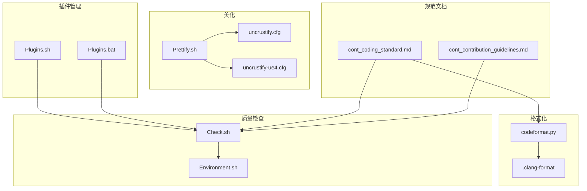
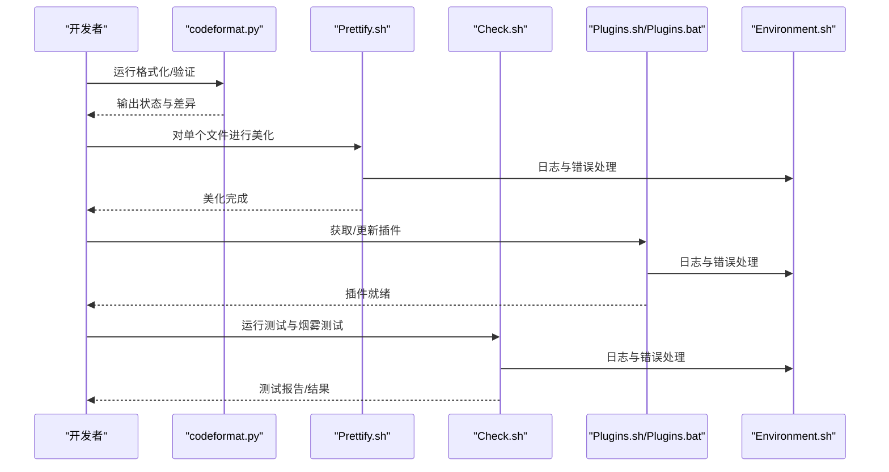
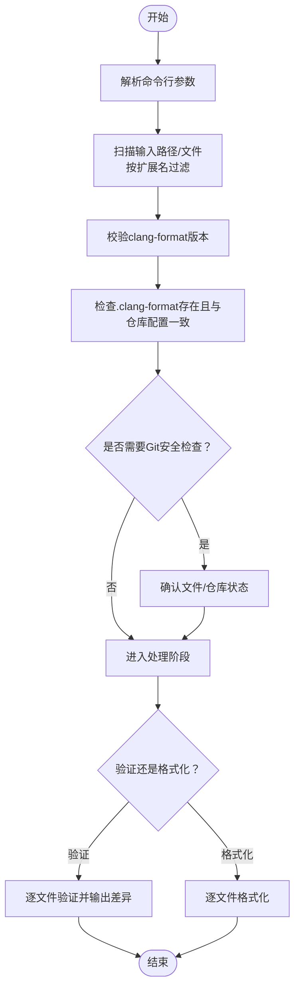
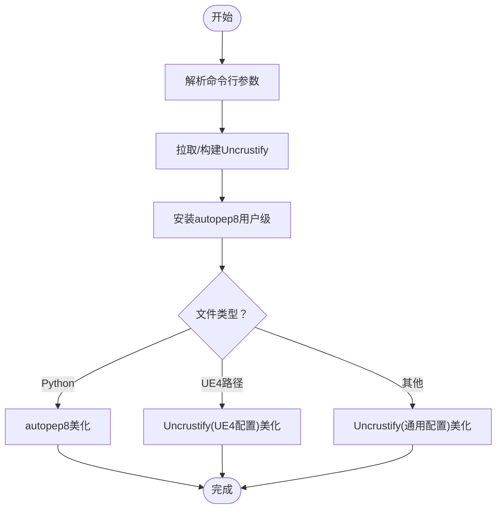
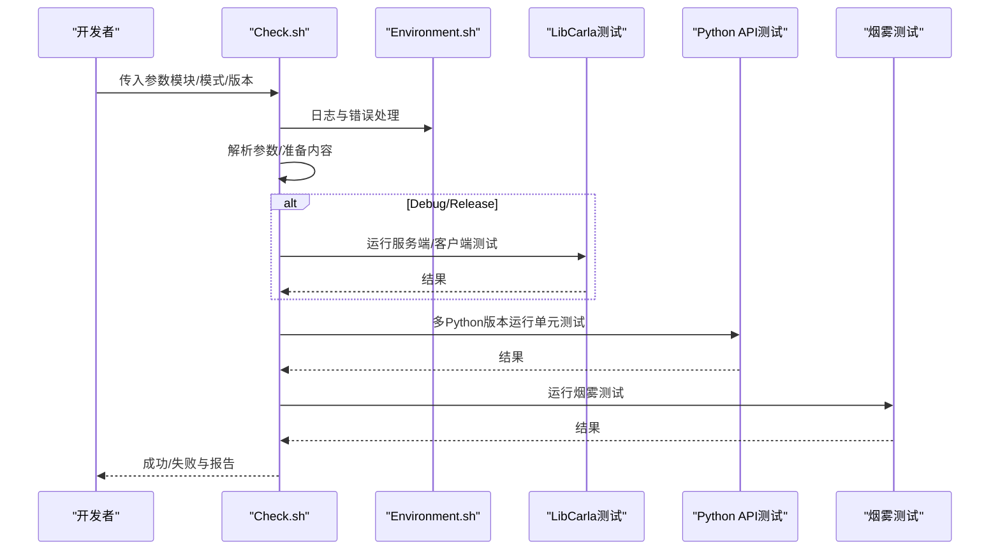
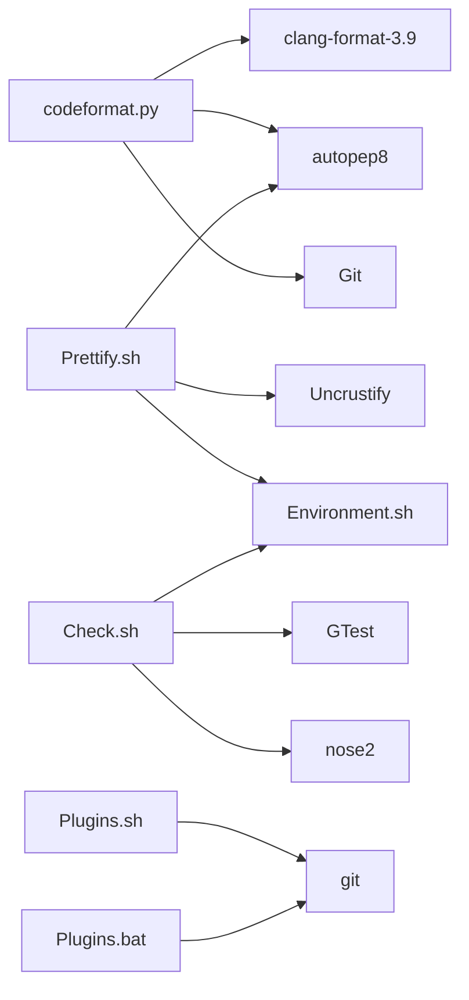

# 开发实用工具

**本文引用的文件列表**
- [Util/Formatting/codeformat.py](https://github.com/carla-simulator/carla/blob/ue5-dev/Util/Formatting/codeformat.py)
- [Util/Formatting/clang-format](https://github.com/carla-simulator/carla/blob/ue5-dev/Util/Formatting/clang-format)
- [Util/Tools/Check.sh](https://github.com/carla-simulator/carla/blob/ue5-dev/Util/Tools/Check.sh)
- [Util/Tools/Prettify.sh](https://github.com/carla-simulator/carla/blob/ue5-dev/Util/Tools/Prettify.sh)
- [Util/Tools/Plugins.sh](https://github.com/carla-simulator/carla/blob/ue5-dev/Util/Tools/Plugins.sh)
- [Util/Tools/Plugins.bat](https://github.com/carla-simulator/carla/blob/ue5-dev/Util/Tools/Plugins.bat)
- [Util/Tools/Environment.sh](https://github.com/carla-simulator/carla/blob/ue5-dev/Util/Tools/Environment.sh)
- [Util/Tools/uncrustify.cfg](https://github.com/carla-simulator/carla/blob/ue5-dev/Util/Tools/uncrustify.cfg)
- [Util/Tools/uncrustify-ue4.cfg](https://github.com/carla-simulator/carla/blob/ue5-dev/Util/Tools/uncrustify-ue4.cfg)
- [Docs/cont_coding_standard.md](https://github.com/carla-simulator/carla/blob/ue5-dev/Docs/cont_coding_standard.md)
- [Docs/cont_contribution_guidelines.md](https://github.com/carla-simulator/carla/blob/ue5-dev/Docs/cont_contribution_guidelines.md)
- [README.md](https://github.com/carla-simulator/carla/blob/ue5-dev/README.md)

## 目录
1. [简介](#简介)
2. [项目结构](#项目结构)
3. [核心组件](#核心组件)
4. [架构总览](#架构总览)
5. [详细组件分析](#详细组件分析)
6. [依赖关系分析](#依赖关系分析)
7. [性能与可维护性考量](#性能与可维护性考量)
8. [故障排查指南](#故障排查指南)
9. [结论](#结论)
10. [附录：开发工作流与最佳实践](#附录开发工作流与最佳实践)

## 简介
本文件面向CARLA开发团队，系统梳理并说明开发辅助工具链，包括：
- 代码格式化工具：clang-format与codeformat.py的配置与使用
- 代码质量检查与静态分析：Check.sh的测试与运行流程
- 代码美化工具：Prettify.sh对Uncrustify与autopep8的封装
- 插件管理工具：Plugins.sh与Plugins.bat用于获取与安装Unreal插件
- 团队协作与CI集成：如何将上述工具融入IDE与持续集成流水线
- 自定义配置指南：如何按项目需求调整工具行为

## 项目结构
开发辅助工具集中于Util目录下的Formatting与Tools子目录，配合Docs中的编码规范文档，形成从“风格约束”到“执行工具”的闭环。

图表来源
- [Util/Formatting/codeformat.py](https://github.com/carla-simulator/carla/blob/ue5-dev/Util/Formatting/codeformat.py#L1-L430)
- [Util/Formatting/clang-format](https://github.com/carla-simulator/carla/blob/ue5-dev/Util/Formatting/clang-format#L1-L96)
- [Util/Tools/Prettify.sh](https://github.com/carla-simulator/carla/blob/ue5-dev/Util/Tools/Prettify.sh#L1-L142)
- [Util/Tools/uncrustify.cfg](https://github.com/carla-simulator/carla/blob/ue5-dev/Util/Tools/uncrustify.cfg#L1-L200)
- [Util/Tools/uncrustify-ue4.cfg](https://github.com/carla-simulator/carla/blob/ue5-dev/Util/Tools/uncrustify-ue4.cfg#L1-L200)
- [Util/Tools/Check.sh](https://github.com/carla-simulator/carla/blob/ue5-dev/Util/Tools/Check.sh#L1-L239)
- [Util/Tools/Environment.sh](https://github.com/carla-simulator/carla/blob/ue5-dev/Util/Tools/Environment.sh#L1-L16)
- [Util/Tools/Plugins.sh](https://github.com/carla-simulator/carla/blob/ue5-dev/Util/Tools/Plugins.sh#L1-L41)
- [Util/Tools/Plugins.bat](https://github.com/carla-simulator/carla/blob/ue5-dev/Util/Tools/Plugins.bat#L1-L78)
- [Docs/cont_coding_standard.md](https://github.com/carla-simulator/carla/blob/ue5-dev/Docs/cont_coding_standard.md#L1-L43)
- [Docs/cont_contribution_guidelines.md](https://github.com/carla-simulator/carla/blob/ue5-dev/Docs/cont_contribution_guidelines.md#L63-L139)

章节来源
- [README.md](https://github.com/carla-simulator/carla/blob/ue5-dev/README.md#L1-L215)

## 核心组件
- 代码格式化器（clang-format + codeformat.py）
  - 通过codeformat.py统一调用clang-format与autopep8，支持版本校验、仓库一致性检查、差异输出等能力。
- 代码美化器（Prettify.sh）
  - 自动拉取并构建Uncrustify，按文件类型选择不同配置；自动安装autopep8并进行Python美化。
- 质量检查脚本（Check.sh）
  - 统一运行LibCarla单元测试、Python API测试、烟雾测试，支持GTest参数注入、多Python版本测试、结果导出。
- 插件管理（Plugins.sh / Plugins.bat）
  - 拉取carla-plugins仓库，支持发布版与开发版两种克隆策略。
- 环境支撑（Environment.sh）
  - 提供日志与致命错误处理的通用函数，被多个Shell脚本复用。

章节来源
- [Util/Formatting/codeformat.py](https://github.com/carla-simulator/carla/blob/ue5-dev/Util/Formatting/codeformat.py#L1-L430)
- [Util/Tools/Prettify.sh](https://github.com/carla-simulator/carla/blob/ue5-dev/Util/Tools/Prettify.sh#L1-L142)
- [Util/Tools/Check.sh](https://github.com/carla-simulator/carla/blob/ue5-dev/Util/Tools/Check.sh#L1-L239)
- [Util/Tools/Plugins.sh](https://github.com/carla-simulator/carla/blob/ue5-dev/Util/Tools/Plugins.sh#L1-L41)
- [Util/Tools/Plugins.bat](https://github.com/carla-simulator/carla/blob/ue5-dev/Util/Tools/Plugins.bat#L1-L78)
- [Util/Tools/Environment.sh](https://github.com/carla-simulator/carla/blob/ue5-dev/Util/Tools/Environment.sh#L1-L16)

## 架构总览
下图展示工具链在开发流程中的位置与交互关系。

图表来源
- [Util/Formatting/codeformat.py](https://github.com/carla-simulator/carla/blob/ue5-dev/Util/Formatting/codeformat.py#L1-L430)
- [Util/Tools/Prettify.sh](https://github.com/carla-simulator/carla/blob/ue5-dev/Util/Tools/Prettify.sh#L1-L142)
- [Util/Tools/Check.sh](https://github.com/carla-simulator/carla/blob/ue5-dev/Util/Tools/Check.sh#L1-L239)
- [Util/Tools/Plugins.sh](https://github.com/carla-simulator/carla/blob/ue5-dev/Util/Tools/Plugins.sh#L1-L41)
- [Util/Tools/Plugins.bat](https://github.com/carla-simulator/carla/blob/ue5-dev/Util/Tools/Plugins.bat#L1-L78)
- [Util/Tools/Environment.sh](https://github.com/carla-simulator/carla/blob/ue5-dev/Util/Tools/Environment.sh#L1-L16)

## 详细组件分析

### 代码格式化：clang-format 与 codeformat.py
- 功能要点
  - 版本校验：确保clang-format版本符合预期，避免跨环境不一致。
  - 配置一致性：扫描各源码目录，查找.clang-format文件并与仓库内置配置比对，提示不一致时需确认继续。
  - 文件扫描：支持按扩展名过滤（C/C++/头文件/Python），支持排除规则与符号链接跳过。
  - Git安全检查：在非verify模式下，对文件所在Git仓库进行跟踪状态与工作区清洁度检查，必要时交互确认。
  - 验证与格式化：支持仅验证（输出差异）或直接修改文件；支持显示差异。
- 关键流程（简化）

图表来源
- [Util/Formatting/codeformat.py](https://github.com/carla-simulator/carla/blob/ue5-dev/Util/Formatting/codeformat.py#L1-L430)

章节来源
- [Util/Formatting/codeformat.py](https://github.com/carla-simulator/carla/blob/ue5-dev/Util/Formatting/codeformat.py#L1-L430)
- [Util/Formatting/clang-format](https://github.com/carla-simulator/carla/blob/ue5-dev/Util/Formatting/clang-format#L1-L96)
- [Docs/cont_coding_standard.md](https://github.com/carla-simulator/carla/blob/ue5-dev/Docs/cont_coding_standard.md#L1-L43)

### 代码美化：Prettify.sh
- 功能要点
  - 自动下载并构建指定版本的Uncrustify，缓存至本地构建目录。
  - 自动安装autopep8（用户级）以满足Python美化需求。
  - 根据文件类型选择不同配置：
    - Python文件：使用autopep8
    - Unreal/CarlaUnreal路径下的文件：使用UE4专用配置
    - 其他C/C++文件：使用通用配置
  - 支持单文件美化，输出日志与错误处理。
- 关键流程（简化）

图表来源
- [Util/Tools/Prettify.sh](https://github.com/carla-simulator/carla/blob/ue5-dev/Util/Tools/Prettify.sh#L1-L142)
- [Util/Tools/uncrustify.cfg](https://github.com/carla-simulator/carla/blob/ue5-dev/Util/Tools/uncrustify.cfg#L1-L200)
- [Util/Tools/uncrustify-ue4.cfg](https://github.com/carla-simulator/carla/blob/ue5-dev/Util/Tools/uncrustify-ue4.cfg#L1-L200)

章节来源
- [Util/Tools/Prettify.sh](https://github.com/carla-simulator/carla/blob/ue5-dev/Util/Tools/Prettify.sh#L1-L142)
- [Util/Tools/uncrustify.cfg](https://github.com/carla-simulator/carla/blob/ue5-dev/Util/Tools/uncrustify.cfg#L1-L200)
- [Util/Tools/uncrustify-ue4.cfg](https://github.com/carla-simulator/carla/blob/ue5-dev/Util/Tools/uncrustify-ue4.cfg#L1-L200)

### 代码质量检查：Check.sh
- 功能要点
  - 参数解析：支持调试模式、XML结果输出、GTest参数注入、全量/分模块测试选择。
  - 内容准备：按需下载测试所需内容资源。
  - 测试执行：
    - LibCarla服务端/客户端单元测试（Debug/Release）
    - Python API单元测试（多Python版本）
    - 烟雾测试（连接性与基础功能）
  - 结果输出：支持生成XML测试报告，便于CI系统消费。
- 关键流程（简化）

图表来源
- [Util/Tools/Check.sh](https://github.com/carla-simulator/carla/blob/ue5-dev/Util/Tools/Check.sh#L1-L239)
- [Util/Tools/Environment.sh](https://github.com/carla-simulator/carla/blob/ue5-dev/Util/Tools/Environment.sh#L1-L16)

章节来源
- [Util/Tools/Check.sh](https://github.com/carla-simulator/carla/blob/ue5-dev/Util/Tools/Check.sh#L1-L239)
- [Util/Tools/Environment.sh](https://github.com/carla-simulator/carla/blob/ue5-dev/Util/Tools/Environment.sh#L1-L16)

### 插件管理：Plugins.sh 与 Plugins.bat
- 功能要点
  - 支持发布版与开发版两种克隆策略（深度克隆/完整历史）。
  - 若已存在目标目录则跳过克隆，避免重复下载。
  - Windows批处理脚本提供等价功能与错误处理。
- 关键流程（简化）

图表来源
- [Util/Tools/Plugins.sh](https://github.com/carla-simulator/carla/blob/ue5-dev/Util/Tools/Plugins.sh#L1-L41)
- [Util/Tools/Plugins.bat](https://github.com/carla-simulator/carla/blob/ue5-dev/Util/Tools/Plugins.bat#L1-L78)

章节来源
- [Util/Tools/Plugins.sh](https://github.com/carla-simulator/carla/blob/ue5-dev/Util/Tools/Plugins.sh#L1-L41)
- [Util/Tools/Plugins.bat](https://github.com/carla-simulator/carla/blob/ue5-dev/Util/Tools/Plugins.bat#L1-L78)

## 依赖关系分析
- 工具间耦合
  - codeformat.py依赖clang-format与autopep8，同时与Git交互进行仓库一致性检查。
  - Prettify.sh依赖Uncrustify与autopep8，内部通过Environment.sh统一日志与错误处理。
  - Check.sh依赖Environment.sh，负责测试执行与结果输出。
  - Plugins.sh/Plugins.bat独立运行，但与Check.sh共同构成“获取插件—运行测试”的工作流。
- 外部依赖
  - clang-format-3.9、autopep8、Uncrustify、Python测试框架（nose2）、GTest等。
- 潜在风险
  - 版本漂移：clang-format版本不匹配会导致格式化结果不一致。
  - Git状态：未提交/未跟踪文件在格式化前需确认，避免误操作。
  - CI稳定性：测试参数与Python版本需在CI中固定，避免随机失败。

图表来源
- [Util/Formatting/codeformat.py](https://github.com/carla-simulator/carla/blob/ue5-dev/Util/Formatting/codeformat.py#L1-L430)
- [Util/Tools/Prettify.sh](https://github.com/carla-simulator/carla/blob/ue5-dev/Util/Tools/Prettify.sh#L1-L142)
- [Util/Tools/Check.sh](https://github.com/carla-simulator/carla/blob/ue5-dev/Util/Tools/Check.sh#L1-L239)
- [Util/Tools/Plugins.sh](https://github.com/carla-simulator/carla/blob/ue5-dev/Util/Tools/Plugins.sh#L1-L41)
- [Util/Tools/Plugins.bat](https://github.com/carla-simulator/carla/blob/ue5-dev/Util/Tools/Plugins.bat#L1-L78)
- [Util/Tools/Environment.sh](https://github.com/carla-simulator/carla/blob/ue5-dev/Util/Tools/Environment.sh#L1-L16)

## 性能与可维护性考量
- 性能
  - codeformat.py采用增量扫描与按扩展名过滤，避免对无关文件遍历。
  - Prettify.sh通过本地缓存Uncrustify二进制，减少重复编译开销。
  - Check.sh按需下载测试资源，避免不必要的网络与磁盘占用。
- 可维护性
  - 统一日志与错误处理由Environment.sh提供，降低脚本重复实现。
  - clang-format与Uncrustify配置文件集中管理，便于团队统一风格。
  - Check.sh支持GTest参数注入与XML输出，利于CI系统集成与报告可视化。

[本节为通用指导，无需列出具体文件来源]

## 故障排查指南
- clang-format版本不匹配
  - 现象：版本字符串不匹配导致退出。
  - 处理：安装指定版本clang-format或调整仓库配置。
  - 参考：[Util/Formatting/codeformat.py](https://github.com/carla-simulator/carla/blob/ue5-dev/Util/Formatting/codeformat.py#L1-L120)
- .clang-format缺失或不一致
  - 现象：找不到.clang-format或与仓库内置配置不一致。
  - 处理：在对应目录放置.clang-format，或确认继续。
  - 参考：[Util/Formatting/codeformat.py](https://github.com/carla-simulator/carla/blob/ue5-dev/Util/Formatting/codeformat.py#L120-L200)
- Git仓库状态问题
  - 现象：工作区不干净或文件未跟踪。
  - 处理：提交变更或清理工作区；确认继续或取消。
  - 参考：[Util/Formatting/codeformat.py](https://github.com/carla-simulator/carla/blob/ue5-dev/Util/Formatting/codeformat.py#L280-L370)
- Uncrustify构建失败
  - 现象：无法找到Uncrustify可执行文件。
  - 处理：检查网络与权限，重新执行Prettify.sh。
  - 参考：[Util/Tools/Prettify.sh](https://github.com/carla-simulator/carla/blob/ue5-dev/Util/Tools/Prettify.sh#L50-L120)
- autopep8未安装
  - 现象：找不到autopep8命令。
  - 处理：按脚本提示安装用户级autopep8。
  - 参考：[Util/Tools/Prettify.sh](https://github.com/carla-simulator/carla/blob/ue5-dev/Util/Tools/Prettify.sh#L90-L110)
- 测试执行失败
  - 现象：LibCarla或Python API测试失败。
  - 处理：查看XML报告与日志，定位失败用例；在CI中固定Python版本与参数。
  - 参考：[Util/Tools/Check.sh](https://github.com/carla-simulator/carla/blob/ue5-dev/Util/Tools/Check.sh#L120-L239)
- 插件克隆失败
  - 现象：git命令执行失败。
  - 处理：检查git可用性与网络；Windows下确认已启用x64 Native Tools。
  - 参考：[Util/Tools/Plugins.bat](https://github.com/carla-simulator/carla/blob/ue5-dev/Util/Tools/Plugins.bat#L1-L78)

章节来源
- [Util/Formatting/codeformat.py](https://github.com/carla-simulator/carla/blob/ue5-dev/Util/Formatting/codeformat.py#L1-L430)
- [Util/Tools/Prettify.sh](https://github.com/carla-simulator/carla/blob/ue5-dev/Util/Tools/Prettify.sh#L1-L142)
- [Util/Tools/Check.sh](https://github.com/carla-simulator/carla/blob/ue5-dev/Util/Tools/Check.sh#L1-L239)
- [Util/Tools/Plugins.bat](https://github.com/carla-simulator/carla/blob/ue5-dev/Util/Tools/Plugins.bat#L1-L78)

## 结论
本工具链覆盖了从“风格约束”到“执行与验证”的完整开发流程。通过统一的格式化、美化与质量检查工具，结合插件管理与环境支撑脚本，能够有效提升代码一致性与可维护性，并为CI集成提供稳定可靠的执行入口。建议团队在IDE与CI中固化使用这些工具，以保障长期的开发效率与质量。

[本节为总结性内容，无需列出具体文件来源]

## 附录：开发工作流与最佳实践

### 在IDE中集成
- VS Code
  - 安装clang-format与Python扩展，设置保存时自动格式化。
  - 使用codeformat.py作为外部工具，绑定快捷键一键验证/格式化。
- CLion/IntelliJ
  - 配置clang-format为代码格式化工具，按项目根目录放置.clang-format。
  - 使用Prettify.sh对单文件进行美化，或在编辑器外部运行。
- Sublime Text
  - 使用CARLA提供的项目文件与插件，结合codeformat.py进行批量格式化。

[本节为通用指导，无需列出具体文件来源]

### 持续集成（CI）集成
- 触发条件
  - PR与分支推送触发，优先运行烟雾测试与Python API测试。
  - Release分支或Tag触发全量测试与报告生成。
- 步骤建议
  - 安装clang-format-3.9、autopep8、Uncrustify（或使用Prettify.sh自动安装）。
  - 执行codeformat.py验证模式，失败即终止流水线。
  - 运行Check.sh，开启XML输出，上传测试报告。
  - 插件管理：在CI中预缓存Plugins目录，避免重复克隆。
- 参考文件
  - [Util/Tools/Check.sh](https://github.com/carla-simulator/carla/blob/ue5-dev/Util/Tools/Check.sh#L1-L239)
  - [Util/Tools/Prettify.sh](https://github.com/carla-simulator/carla/blob/ue5-dev/Util/Tools/Prettify.sh#L1-L142)
  - [Util/Tools/Plugins.sh](https://github.com/carla-simulator/carla/blob/ue5-dev/Util/Tools/Plugins.sh#L1-L41)

章节来源
- [Util/Tools/Check.sh](https://github.com/carla-simulator/carla/blob/ue5-dev/Util/Tools/Check.sh#L1-L239)
- [Util/Tools/Prettify.sh](https://github.com/carla-simulator/carla/blob/ue5-dev/Util/Tools/Prettify.sh#L1-L142)
- [Util/Tools/Plugins.sh](https://github.com/carla-simulator/carla/blob/ue5-dev/Util/Tools/Plugins.sh#L1-L41)

### 自定义配置指南
- 修改clang-format风格
  - 在项目根目录放置.clang-format，遵循仓库内置配置风格。
  - 使用codeformat.py验证配置一致性，避免跨环境差异。
  - 参考：[Util/Formatting/clang-format](https://github.com/carla-simulator/carla/blob/ue5-dev/Util/Formatting/clang-format#L1-L96)
- 调整Uncrustify规则
  - 根据项目需求修改uncrustify.cfg或uncrustify-ue4.cfg。
  - Prettify.sh会按文件类型选择对应配置，确保一致性。
  - 参考：[Util/Tools/uncrustify.cfg](https://github.com/carla-simulator/carla/blob/ue5-dev/Util/Tools/uncrustify.cfg#L1-L200)、[Util/Tools/uncrustify-ue4.cfg](https://github.com/carla-simulator/carla/blob/ue5-dev/Util/Tools/uncrustify-ue4.cfg#L1-L200)
- 调整Check.sh参数
  - 在CI中固定Python版本列表与GTest参数，避免随机失败。
  - 参考：[Util/Tools/Check.sh](https://github.com/carla-simulator/carla/blob/ue5-dev/Util/Tools/Check.sh#L1-L239)

章节来源
- [Util/Formatting/clang-format](https://github.com/carla-simulator/carla/blob/ue5-dev/Util/Formatting/clang-format#L1-L96)
- [Util/Tools/uncrustify.cfg](https://github.com/carla-simulator/carla/blob/ue5-dev/Util/Tools/uncrustify.cfg#L1-L200)
- [Util/Tools/uncrustify-ue4.cfg](https://github.com/carla-simulator/carla/blob/ue5-dev/Util/Tools/uncrustify-ue4.cfg#L1-L200)
- [Util/Tools/Check.sh](https://github.com/carla-simulator/carla/blob/ue5-dev/Util/Tools/Check.sh#L1-L239)

### 团队协作与质量保证建议
- 编码标准
  - 统一使用Spaces而非Tabs；Python遵循PEP8；C++遵循Google风格变体与Unreal标准。
  - 参考：[Docs/cont_coding_standard.md](https://github.com/carla-simulator/carla/blob/ue5-dev/Docs/cont_coding_standard.md#L1-L43)
- 贡献流程
  - 采用Gitflow模型，先合并到dev再发布；提交前必须通过make check与CI检查。
  - 参考：[Docs/cont_contribution_guidelines.md](https://github.com/carla-simulator/carla/blob/ue5-dev/Docs/cont_contribution_guidelines.md#L63-L139)

章节来源
- [Docs/cont_coding_standard.md](https://github.com/carla-simulator/carla/blob/ue5-dev/Docs/cont_coding_standard.md#L1-L43)
- [Docs/cont_contribution_guidelines.md](https://github.com/carla-simulator/carla/blob/ue5-dev/Docs/cont_contribution_guidelines.md#L63-L139)