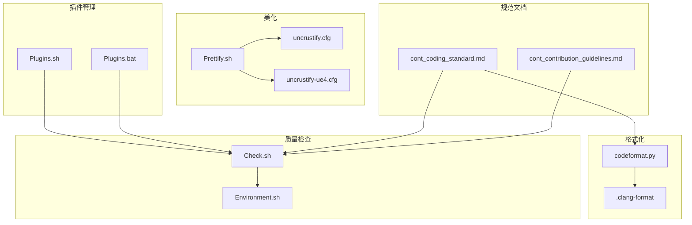
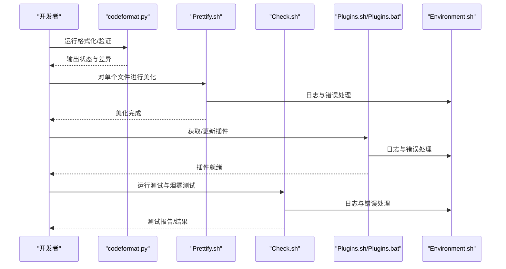
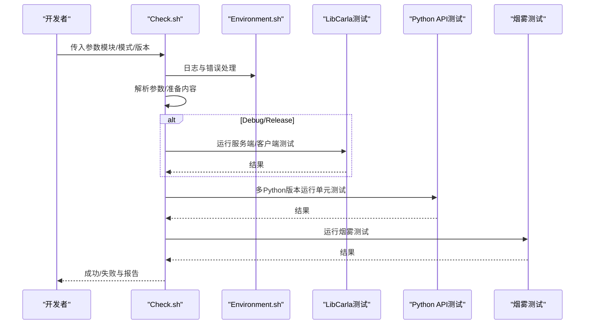
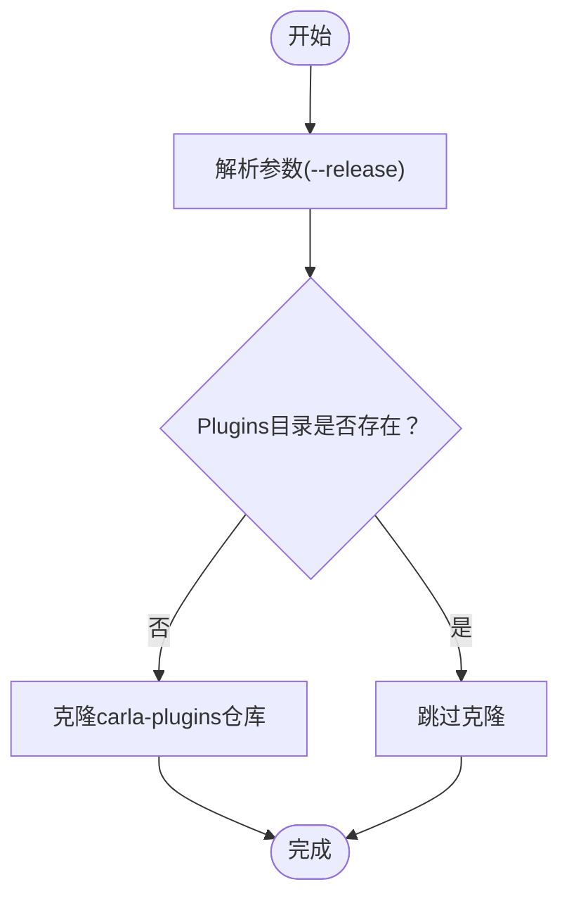
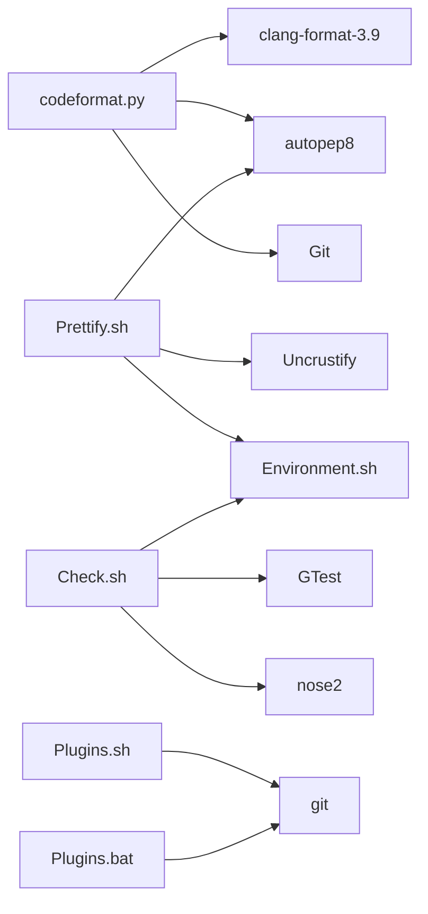

# 开发实用工具

> **引用文件**
> **本文引用的文件列表**

- [Util/Formatting/codeformat.py](https://github.com/carla-simulator/carla/blob/ue5-dev/Util/Formatting/codeformat.py)
- [Util/Formatting/clang-format](https://github.com/carla-simulator/carla/blob/ue5-dev/Util/Formatting/clang-format)
- [Util/Tools/Check.sh](https://github.com/carla-simulator/carla/blob/ue5-dev/Util/Tools/Check.sh)
- [Util/Tools/Prettify.sh](https://github.com/carla-simulator/carla/blob/ue5-dev/Util/Tools/Prettify.sh)
- [Util/Tools/Plugins.sh](https://github.com/carla-simulator/carla/blob/ue5-dev/Util/Tools/Plugins.sh)
- [Util/Tools/Plugins.bat](https://github.com/carla-simulator/carla/blob/ue5-dev/Util/Tools/Plugins.bat)
- [Util/Tools/Environment.sh](https://github.com/carla-simulator/carla/blob/ue5-dev/Util/Tools/Environment.sh)
- [Util/Tools/uncrustify.cfg](https://github.com/carla-simulator/carla/blob/ue5-dev/Util/Tools/uncrustify.cfg)
- [Util/Tools/uncrustify-ue4.cfg](https://github.com/carla-simulator/carla/blob/ue5-dev/Util/Tools/uncrustify-ue4.cfg)
- [Docs/cont_coding_standard.md](https://github.com/carla-simulator/carla/blob/ue5-dev/Docs/cont_coding_standard.md)
- [Docs/cont_contribution_guidelines.md](https://github.com/carla-simulator/carla/blob/ue5-dev/Docs/cont_contribution_guidelines.md)
- [README.md](https://github.com/carla-simulator/carla/blob/ue5-dev/README.md)

## 目录

1. [简介](#简介)
2. [项目结构](#项目结构)
3. [核心组件](#核心组件)
4. [架构总览](#架构总览)
5. [详细组件分析](#详细组件分析)
6. [依赖关系分析](#依赖关系分析)
7. [性能与可维护性考量](#性能与可维护性考量)
8. [故障排查指南](#故障排查指南)
9. [结论](#结论)
10. [附录：开发工作流与最佳实践](#附录开发工作流与最佳实践)

## 简介

本文件面向 CARLA 开发团队，系统梳理并说明开发辅助工具链，包括：

- 代码格式化工具：clang-format 与 codeformat.py 的配置与使用
- 代码质量检查与静态分析：Check.sh 的测试与运行流程
- 代码美化工具：Prettify.sh 对 Uncrustify 与 autopep8 的封装
- 插件管理工具：Plugins.sh 与 Plugins.bat 用于获取与安装 Unreal 插件
- 团队协作与 CI 集成：如何将上述工具融入 IDE 与持续集成流水线
- 自定义配置指南：如何按项目需求调整工具行为

## 项目结构

开发辅助工具集中于 Util 目录下的 Formatting 与 Tools 子目录，配合 Docs 中的编码规范文档，形成从“风格约束”到“执行工具”的闭环。

图表来源

- <a href="https://github.com/carla-simulator/carla/blob/ue5-dev/Util/Formatting/codeformat.py#L1-L430" target="_blank">Util/Formatting/codeformat.py</a>
- <a href="https://github.com/carla-simulator/carla/blob/ue5-dev/Util/Formatting/clang-format#L1-L96" target="_blank">Util/Formatting/clang-format</a>
- <a href="https://github.com/carla-simulator/carla/blob/ue5-dev/Util/Tools/Prettify.sh#L1-L142" target="_blank">Util/Tools/Prettify.sh</a>
- <a href="https://github.com/carla-simulator/carla/blob/ue5-dev/Util/Tools/uncrustify.cfg#L1-L200" target="_blank">Util/Tools/uncrustify.cfg</a>
- <a href="https://github.com/carla-simulator/carla/blob/ue5-dev/Util/Tools/uncrustify-ue4.cfg#L1-L200" target="_blank">Util/Tools/uncrustify-ue4.cfg</a>
- <a href="https://github.com/carla-simulator/carla/blob/ue5-dev/Util/Tools/Check.sh#L1-L239" target="_blank">Util/Tools/Check.sh</a>
- <a href="https://github.com/carla-simulator/carla/blob/ue5-dev/Util/Tools/Environment.sh#L1-L16" target="_blank">Util/Tools/Environment.sh</a>
- <a href="https://github.com/carla-simulator/carla/blob/ue5-dev/Util/Tools/Plugins.sh#L1-L41" target="_blank">Util/Tools/Plugins.sh</a>
- <a href="https://github.com/carla-simulator/carla/blob/ue5-dev/Util/Tools/Plugins.bat#L1-L78" target="_blank">Util/Tools/Plugins.bat</a>
- <a href="https://github.com/carla-simulator/carla/blob/ue5-dev/Docs/cont_coding_standard.md#L1-L43" target="_blank">Docs/cont_coding_standard.md</a>
- <a href="https://github.com/carla-simulator/carla/blob/ue5-dev/Docs/cont_contribution_guidelines.md#L63-L139" target="_blank">Docs/cont_contribution_guidelines.md</a>

章节来源

- <a href="https://github.com/carla-simulator/carla/blob/ue5-dev/README.md#L1-L215" target="_blank">README.md</a>

## 核心组件

- 代码格式化器（clang-format + codeformat.py）
  - 通过 codeformat.py 统一调用 clang-format 与 autopep8，支持版本校验、仓库一致性检查、差异输出等能力。
- 代码美化器（Prettify.sh）
  - 自动拉取并构建 Uncrustify，按文件类型选择不同配置；自动安装 autopep8 并进行 Python 美化。
- 质量检查脚本（Check.sh）
  - 统一运行 LibCarla 单元测试、Python API 测试、烟雾测试，支持 GTest 参数注入、多 Python 版本测试、结果导出。
- 插件管理（Plugins.sh / Plugins.bat）
  - 拉取 carla-plugins 仓库，支持发布版与开发版两种克隆策略。
- 环境支撑（Environment.sh）
  - 提供日志与致命错误处理的通用函数，被多个 Shell 脚本复用。

章节来源

- <a href="https://github.com/carla-simulator/carla/blob/ue5-dev/Util/Formatting/codeformat.py#L1-L430" target="_blank">Util/Formatting/codeformat.py</a>
- <a href="https://github.com/carla-simulator/carla/blob/ue5-dev/Util/Tools/Prettify.sh#L1-L142" target="_blank">Util/Tools/Prettify.sh</a>
- <a href="https://github.com/carla-simulator/carla/blob/ue5-dev/Util/Tools/Check.sh#L1-L239" target="_blank">Util/Tools/Check.sh</a>
- <a href="https://github.com/carla-simulator/carla/blob/ue5-dev/Util/Tools/Plugins.sh#L1-L41" target="_blank">Util/Tools/Plugins.sh</a>
- <a href="https://github.com/carla-simulator/carla/blob/ue5-dev/Util/Tools/Plugins.bat#L1-L78" target="_blank">Util/Tools/Plugins.bat</a>
- <a href="https://github.com/carla-simulator/carla/blob/ue5-dev/Util/Tools/Environment.sh#L1-L16" target="_blank">Util/Tools/Environment.sh</a>

## 架构总览

下图展示工具链在开发流程中的位置与交互关系。

图表来源

- <a href="https://github.com/carla-simulator/carla/blob/ue5-dev/Util/Formatting/codeformat.py#L1-L430" target="_blank">Util/Formatting/codeformat.py</a>
- <a href="https://github.com/carla-simulator/carla/blob/ue5-dev/Util/Tools/Prettify.sh#L1-L142" target="_blank">Util/Tools/Prettify.sh</a>
- <a href="https://github.com/carla-simulator/carla/blob/ue5-dev/Util/Tools/Check.sh#L1-L239" target="_blank">Util/Tools/Check.sh</a>
- <a href="https://github.com/carla-simulator/carla/blob/ue5-dev/Util/Tools/Plugins.sh#L1-L41" target="_blank">Util/Tools/Plugins.sh</a>
- <a href="https://github.com/carla-simulator/carla/blob/ue5-dev/Util/Tools/Plugins.bat#L1-L78" target="_blank">Util/Tools/Plugins.bat</a>
- <a href="https://github.com/carla-simulator/carla/blob/ue5-dev/Util/Tools/Environment.sh#L1-L16" target="_blank">Util/Tools/Environment.sh</a>

## 详细组件分析

### 代码格式化：clang-format 与 codeformat.py

- 功能要点
  - 版本校验：确保 clang-format 版本符合预期，避免跨环境不一致。
  - 配置一致性：扫描各源码目录，查找.clang-format 文件并与仓库内置配置比对，提示不一致时需确认继续。
  - 文件扫描：支持按扩展名过滤（C/C++/头文件/Python），支持排除规则与符号链接跳过。
  - Git 安全检查：在非 verify 模式下，对文件所在 Git 仓库进行跟踪状态与工作区清洁度检查，必要时交互确认。
  - 验证与格式化：支持仅验证（输出差异）或直接修改文件；支持显示差异。
- 关键流程（简化）

图表来源

- <a href="https://github.com/carla-simulator/carla/blob/ue5-dev/Util/Formatting/codeformat.py#L1-L430" target="_blank">Util/Formatting/codeformat.py</a>

章节来源

- <a href="https://github.com/carla-simulator/carla/blob/ue5-dev/Util/Formatting/codeformat.py#L1-L430" target="_blank">Util/Formatting/codeformat.py</a>
- <a href="https://github.com/carla-simulator/carla/blob/ue5-dev/Util/Formatting/clang-format#L1-L96" target="_blank">Util/Formatting/clang-format</a>
- <a href="https://github.com/carla-simulator/carla/blob/ue5-dev/Docs/cont_coding_standard.md#L1-L43" target="_blank">Docs/cont_coding_standard.md</a>

### 代码美化：Prettify.sh

- 功能要点
  - 自动下载并构建指定版本的 Uncrustify，缓存至本地构建目录。
  - 自动安装 autopep8（用户级）以满足 Python 美化需求。
  - 根据文件类型选择不同配置：
    - Python 文件：使用 autopep8
    - Unreal/CarlaUnreal 路径下的文件：使用 UE4 专用配置
    - 其他 C/C++文件：使用通用配置
  - 支持单文件美化，输出日志与错误处理。
- 关键流程（简化）

图表来源

- <a href="https://github.com/carla-simulator/carla/blob/ue5-dev/Util/Tools/Prettify.sh#L1-L142" target="_blank">Util/Tools/Prettify.sh</a>
- <a href="https://github.com/carla-simulator/carla/blob/ue5-dev/Util/Tools/uncrustify.cfg#L1-L200" target="_blank">Util/Tools/uncrustify.cfg</a>
- <a href="https://github.com/carla-simulator/carla/blob/ue5-dev/Util/Tools/uncrustify-ue4.cfg#L1-L200" target="_blank">Util/Tools/uncrustify-ue4.cfg</a>

章节来源

- <a href="https://github.com/carla-simulator/carla/blob/ue5-dev/Util/Tools/Prettify.sh#L1-L142" target="_blank">Util/Tools/Prettify.sh</a>
- <a href="https://github.com/carla-simulator/carla/blob/ue5-dev/Util/Tools/uncrustify.cfg#L1-L200" target="_blank">Util/Tools/uncrustify.cfg</a>
- <a href="https://github.com/carla-simulator/carla/blob/ue5-dev/Util/Tools/uncrustify-ue4.cfg#L1-L200" target="_blank">Util/Tools/uncrustify-ue4.cfg</a>

### 代码质量检查：Check.sh

- 功能要点
  - 参数解析：支持调试模式、XML 结果输出、GTest 参数注入、全量/分模块测试选择。
  - 内容准备：按需下载测试所需内容资源。
  - 测试执行：
    - LibCarla 服务端/客户端单元测试（Debug/Release）
    - Python API 单元测试（多 Python 版本）
    - 烟雾测试（连接性与基础功能）
  - 结果输出：支持生成 XML 测试报告，便于 CI 系统消费。
- 关键流程（简化）

图表来源

- <a href="https://github.com/carla-simulator/carla/blob/ue5-dev/Util/Tools/Check.sh#L1-L239" target="_blank">Util/Tools/Check.sh</a>
- <a href="https://github.com/carla-simulator/carla/blob/ue5-dev/Util/Tools/Environment.sh#L1-L16" target="_blank">Util/Tools/Environment.sh</a>

章节来源

- <a href="https://github.com/carla-simulator/carla/blob/ue5-dev/Util/Tools/Check.sh#L1-L239" target="_blank">Util/Tools/Check.sh</a>
- <a href="https://github.com/carla-simulator/carla/blob/ue5-dev/Util/Tools/Environment.sh#L1-L16" target="_blank">Util/Tools/Environment.sh</a>

### 插件管理：Plugins.sh 与 Plugins.bat

- 功能要点
  - 支持发布版与开发版两种克隆策略（深度克隆/完整历史）。
  - 若已存在目标目录则跳过克隆，避免重复下载。
  - Windows 批处理脚本提供等价功能与错误处理。
- 关键流程（简化）

图表来源

- <a href="https://github.com/carla-simulator/carla/blob/ue5-dev/Util/Tools/Plugins.sh#L1-L41" target="_blank">Util/Tools/Plugins.sh</a>
- <a href="https://github.com/carla-simulator/carla/blob/ue5-dev/Util/Tools/Plugins.bat#L1-L78" target="_blank">Util/Tools/Plugins.bat</a>

章节来源

- <a href="https://github.com/carla-simulator/carla/blob/ue5-dev/Util/Tools/Plugins.sh#L1-L41" target="_blank">Util/Tools/Plugins.sh</a>
- <a href="https://github.com/carla-simulator/carla/blob/ue5-dev/Util/Tools/Plugins.bat#L1-L78" target="_blank">Util/Tools/Plugins.bat</a>

## 依赖关系分析

- 工具间耦合
  - codeformat.py 依赖 clang-format 与 autopep8，同时与 Git 交互进行仓库一致性检查。
  - Prettify.sh 依赖 Uncrustify 与 autopep8，内部通过 Environment.sh 统一日志与错误处理。
  - Check.sh 依赖 Environment.sh，负责测试执行与结果输出。
  - Plugins.sh/Plugins.bat 独立运行，但与 Check.sh 共同构成“获取插件—运行测试”的工作流。
- 外部依赖
  - clang-format-3.9、autopep8、Uncrustify、Python 测试框架（nose2）、GTest 等。
- 潜在风险
  - 版本漂移：clang-format 版本不匹配会导致格式化结果不一致。
  - Git 状态：未提交/未跟踪文件在格式化前需确认，避免误操作。
  - CI 稳定性：测试参数与 Python 版本需在 CI 中固定，避免随机失败。

图表来源

- <a href="https://github.com/carla-simulator/carla/blob/ue5-dev/Util/Formatting/codeformat.py#L1-L430" target="_blank">Util/Formatting/codeformat.py</a>
- <a href="https://github.com/carla-simulator/carla/blob/ue5-dev/Util/Tools/Prettify.sh#L1-L142" target="_blank">Util/Tools/Prettify.sh</a>
- <a href="https://github.com/carla-simulator/carla/blob/ue5-dev/Util/Tools/Check.sh#L1-L239" target="_blank">Util/Tools/Check.sh</a>
- <a href="https://github.com/carla-simulator/carla/blob/ue5-dev/Util/Tools/Plugins.sh#L1-L41" target="_blank">Util/Tools/Plugins.sh</a>
- <a href="https://github.com/carla-simulator/carla/blob/ue5-dev/Util/Tools/Plugins.bat#L1-L78" target="_blank">Util/Tools/Plugins.bat</a>
- <a href="https://github.com/carla-simulator/carla/blob/ue5-dev/Util/Tools/Environment.sh#L1-L16" target="_blank">Util/Tools/Environment.sh</a>

## 性能与可维护性考量

- 性能
  - codeformat.py 采用增量扫描与按扩展名过滤，避免对无关文件遍历。
  - Prettify.sh 通过本地缓存 Uncrustify 二进制，减少重复编译开销。
  - Check.sh 按需下载测试资源，避免不必要的网络与磁盘占用。
- 可维护性
  - 统一日志与错误处理由 Environment.sh 提供，降低脚本重复实现。
  - clang-format 与 Uncrustify 配置文件集中管理，便于团队统一风格。
  - Check.sh 支持 GTest 参数注入与 XML 输出，利于 CI 系统集成与报告可视化。

[本节为通用指导，无需列出具体文件来源]

## 故障排查指南

- clang-format 版本不匹配
  - 现象：版本字符串不匹配导致退出。
  - 处理：安装指定版本 clang-format 或调整仓库配置。
  - 参考：<a href="https://github.com/carla-simulator/carla/blob/ue5-dev/Util/Formatting/codeformat.py#L1-L120" target="_blank">Util/Formatting/codeformat.py</a>
- .clang-format 缺失或不一致
  - 现象：找不到.clang-format 或与仓库内置配置不一致。
  - 处理：在对应目录放置.clang-format，或确认继续。
  - 参考：<a href="https://github.com/carla-simulator/carla/blob/ue5-dev/Util/Formatting/codeformat.py#L120-L200" target="_blank">Util/Formatting/codeformat.py</a>
- Git 仓库状态问题
  - 现象：工作区不干净或文件未跟踪。
  - 处理：提交变更或清理工作区；确认继续或取消。
  - 参考：<a href="https://github.com/carla-simulator/carla/blob/ue5-dev/Util/Formatting/codeformat.py#L280-L370" target="_blank">Util/Formatting/codeformat.py</a>
- Uncrustify 构建失败
  - 现象：无法找到 Uncrustify 可执行文件。
  - 处理：检查网络与权限，重新执行 Prettify.sh。
  - 参考：<a href="https://github.com/carla-simulator/carla/blob/ue5-dev/Util/Tools/Prettify.sh#L50-L120" target="_blank">Util/Tools/Prettify.sh</a>
- autopep8 未安装
  - 现象：找不到 autopep8 命令。
  - 处理：按脚本提示安装用户级 autopep8。
  - 参考：<a href="https://github.com/carla-simulator/carla/blob/ue5-dev/Util/Tools/Prettify.sh#L90-L110" target="_blank">Util/Tools/Prettify.sh</a>
- 测试执行失败
  - 现象：LibCarla 或 Python API 测试失败。
  - 处理：查看 XML 报告与日志，定位失败用例；在 CI 中固定 Python 版本与参数。
  - 参考：<a href="https://github.com/carla-simulator/carla/blob/ue5-dev/Util/Tools/Check.sh#L120-L239" target="_blank">Util/Tools/Check.sh</a>
- 插件克隆失败
  - 现象：git 命令执行失败。
  - 处理：检查 git 可用性与网络；Windows 下确认已启用 x64 Native Tools。
  - 参考：<a href="https://github.com/carla-simulator/carla/blob/ue5-dev/Util/Tools/Plugins.bat#L1-L78" target="_blank">Util/Tools/Plugins.bat</a>

章节来源

- <a href="https://github.com/carla-simulator/carla/blob/ue5-dev/Util/Formatting/codeformat.py#L1-L430" target="_blank">Util/Formatting/codeformat.py</a>
- <a href="https://github.com/carla-simulator/carla/blob/ue5-dev/Util/Tools/Prettify.sh#L1-L142" target="_blank">Util/Tools/Prettify.sh</a>
- <a href="https://github.com/carla-simulator/carla/blob/ue5-dev/Util/Tools/Check.sh#L1-L239" target="_blank">Util/Tools/Check.sh</a>
- <a href="https://github.com/carla-simulator/carla/blob/ue5-dev/Util/Tools/Plugins.bat#L1-L78" target="_blank">Util/Tools/Plugins.bat</a>

## 结论

本工具链覆盖了从“风格约束”到“执行与验证”的完整开发流程。通过统一的格式化、美化与质量检查工具，结合插件管理与环境支撑脚本，能够有效提升代码一致性与可维护性，并为 CI 集成提供稳定可靠的执行入口。建议团队在 IDE 与 CI 中固化使用这些工具，以保障长期的开发效率与质量。

[本节为总结性内容，无需列出具体文件来源]

## 附录：开发工作流与最佳实践

### 在 IDE 中集成

- VS Code
  - 安装 clang-format 与 Python 扩展，设置保存时自动格式化。
  - 使用 codeformat.py 作为外部工具，绑定快捷键一键验证/格式化。
- CLion/IntelliJ
  - 配置 clang-format 为代码格式化工具，按项目根目录放置.clang-format。
  - 使用 Prettify.sh 对单文件进行美化，或在编辑器外部运行。
- Sublime Text
  - 使用 CARLA 提供的项目文件与插件，结合 codeformat.py 进行批量格式化。

[本节为通用指导，无需列出具体文件来源]

### 持续集成（CI）集成

- 触发条件
  - PR 与分支推送触发，优先运行烟雾测试与 Python API 测试。
  - Release 分支或 Tag 触发全量测试与报告生成。
- 步骤建议
  - 安装 clang-format-3.9、autopep8、Uncrustify（或使用 Prettify.sh 自动安装）。
  - 执行 codeformat.py 验证模式，失败即终止流水线。
  - 运行 Check.sh，开启 XML 输出，上传测试报告。
  - 插件管理：在 CI 中预缓存 Plugins 目录，避免重复克隆。
- 参考文件
  - <a href="https://github.com/carla-simulator/carla/blob/ue5-dev/Util/Tools/Check.sh#L1-L239" target="_blank">Util/Tools/Check.sh</a>
  - <a href="https://github.com/carla-simulator/carla/blob/ue5-dev/Util/Tools/Prettify.sh#L1-L142" target="_blank">Util/Tools/Prettify.sh</a>
  - <a href="https://github.com/carla-simulator/carla/blob/ue5-dev/Util/Tools/Plugins.sh#L1-L41" target="_blank">Util/Tools/Plugins.sh</a>

章节来源

- <a href="https://github.com/carla-simulator/carla/blob/ue5-dev/Util/Tools/Check.sh#L1-L239" target="_blank">Util/Tools/Check.sh</a>
- <a href="https://github.com/carla-simulator/carla/blob/ue5-dev/Util/Tools/Prettify.sh#L1-L142" target="_blank">Util/Tools/Prettify.sh</a>
- <a href="https://github.com/carla-simulator/carla/blob/ue5-dev/Util/Tools/Plugins.sh#L1-L41" target="_blank">Util/Tools/Plugins.sh</a>

### 自定义配置指南

- 修改 clang-format 风格
  - 在项目根目录放置.clang-format，遵循仓库内置配置风格。
  - 使用 codeformat.py 验证配置一致性，避免跨环境差异。
  - 参考：<a href="https://github.com/carla-simulator/carla/blob/ue5-dev/Util/Formatting/clang-format#L1-L96" target="_blank">Util/Formatting/clang-format</a>
- 调整 Uncrustify 规则
  - 根据项目需求修改 uncrustify.cfg 或 uncrustify-ue4.cfg。
  - Prettify.sh 会按文件类型选择对应配置，确保一致性。
  - 参考：<a href="https://github.com/carla-simulator/carla/blob/ue5-dev/Util/Tools/uncrustify.cfg#L1-L200" target="_blank">Util/Tools/uncrustify.cfg</a>、<a href="https://github.com/carla-simulator/carla/blob/ue5-dev/Util/Tools/uncrustify-ue4.cfg#L1-L200" target="_blank">Util/Tools/uncrustify-ue4.cfg</a>
- 调整 Check.sh 参数
  - 在 CI 中固定 Python 版本列表与 GTest 参数，避免随机失败。
  - 参考：<a href="https://github.com/carla-simulator/carla/blob/ue5-dev/Util/Tools/Check.sh#L1-L239" target="_blank">Util/Tools/Check.sh</a>

章节来源

- <a href="https://github.com/carla-simulator/carla/blob/ue5-dev/Util/Formatting/clang-format#L1-L96" target="_blank">Util/Formatting/clang-format</a>
- <a href="https://github.com/carla-simulator/carla/blob/ue5-dev/Util/Tools/uncrustify.cfg#L1-L200" target="_blank">Util/Tools/uncrustify.cfg</a>
- <a href="https://github.com/carla-simulator/carla/blob/ue5-dev/Util/Tools/uncrustify-ue4.cfg#L1-L200" target="_blank">Util/Tools/uncrustify-ue4.cfg</a>
- <a href="https://github.com/carla-simulator/carla/blob/ue5-dev/Util/Tools/Check.sh#L1-L239" target="_blank">Util/Tools/Check.sh</a>

### 团队协作与质量保证建议

- 编码标准
  - 统一使用 Spaces 而非 Tabs；Python 遵循 PEP8；C++遵循 Google 风格变体与 Unreal 标准。
  - 参考：<a href="https://github.com/carla-simulator/carla/blob/ue5-dev/Docs/cont_coding_standard.md#L1-L43" target="_blank">Docs/cont_coding_standard.md</a>
- 贡献流程
  - 采用 Gitflow 模型，先合并到 dev 再发布；提交前必须通过 make check 与 CI 检查。
  - 参考：<a href="https://github.com/carla-simulator/carla/blob/ue5-dev/Docs/cont_contribution_guidelines.md#L63-L139" target="_blank">Docs/cont_contribution_guidelines.md</a>

章节来源

- <a href="https://github.com/carla-simulator/carla/blob/ue5-dev/Docs/cont_coding_standard.md#L1-L43" target="_blank">Docs/cont_coding_standard.md</a>
- <a href="https://github.com/carla-simulator/carla/blob/ue5-dev/Docs/cont_contribution_guidelines.md#L63-L139" target="_blank">Docs/cont_contribution_guidelines.md</a>
