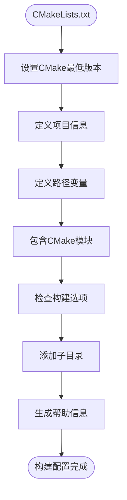
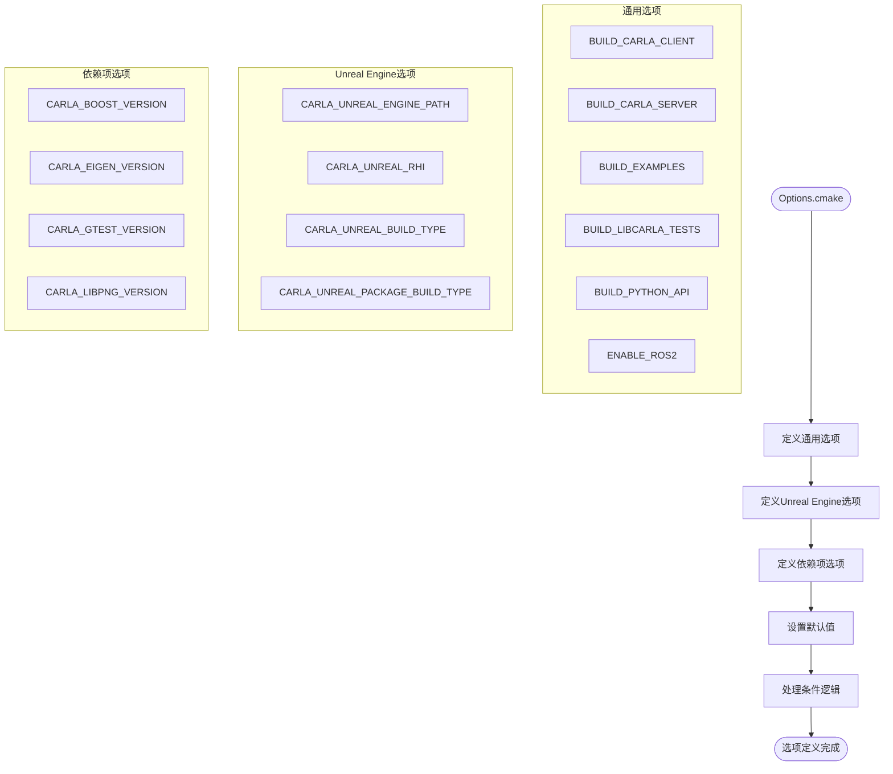
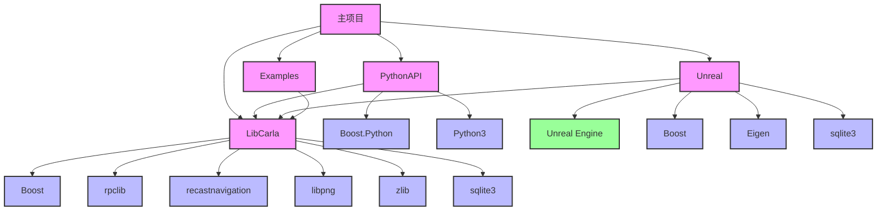
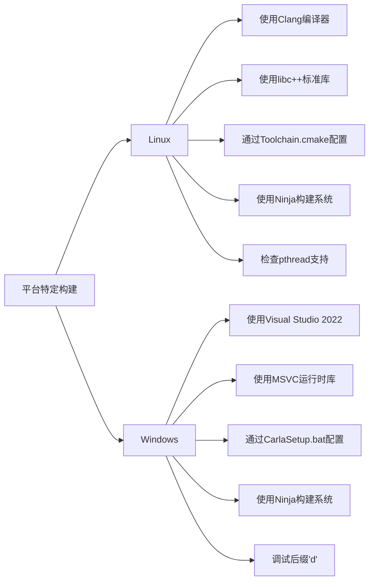
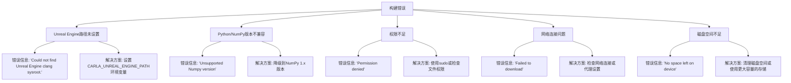
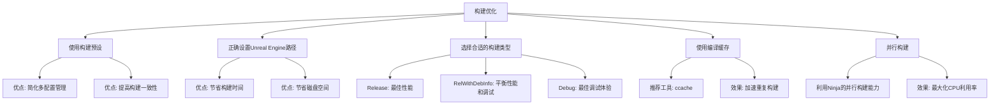

# 构建工具

> **引用文件**
> **本文档中引用的文件**

- [CMakeLists.txt](https://github.com/carla-simulator/carla/blob/ue5-dev/CMakeLists.txt)
- [CMakePresets.json](https://github.com/carla-simulator/carla/blob/ue5-dev/CMakePresets.json)
- [CMake/Options.cmake](https://github.com/carla-simulator/carla/blob/ue5-dev/CMake/Options.cmake)
- [CMake/Common.cmake](https://github.com/carla-simulator/carla/blob/ue5-dev/CMake/Common.cmake)
- [CMake/Dependencies.cmake](https://github.com/carla-simulator/carla/blob/ue5-dev/CMake/Dependencies.cmake)
- [CMake/Util.cmake](https://github.com/carla-simulator/carla/blob/ue5-dev/CMake/Util.cmake)
- [CMake/Toolchain.cmake](https://github.com/carla-simulator/carla/blob/ue5-dev/CMake/Toolchain.cmake)
- [LibCarla/CMakeLists.txt](https://github.com/carla-simulator/carla/blob/ue5-dev/LibCarla/CMakeLists.txt)
- [PythonAPI/CMakeLists.txt](https://github.com/carla-simulator/carla/blob/ue5-dev/PythonAPI/CMakeLists.txt)
- [Unreal/CMakeLists.txt](https://github.com/carla-simulator/carla/blob/ue5-dev/Unreal/CMakeLists.txt)
- [CarlaSetup.sh](https://github.com/carla-simulator/carla/blob/ue5-dev/CarlaSetup.sh)
- [CarlaSetup.bat](https://github.com/carla-simulator/carla/blob/ue5-dev/CarlaSetup.bat)
- [Docs/build_carla.md](https://github.com/carla-simulator/carla/blob/ue5-dev/Docs/build_carla.md)
- [Docs/build_linux_ue5.md](https://github.com/carla-simulator/carla/blob/ue5-dev/Docs/build_linux_ue5.md)
- [Docs/build_windows_ue5.md](https://github.com/carla-simulator/carla/blob/ue5-dev/Docs/build_windows_ue5.md)

## 目录

1. [简介](#简介)
2. [CMake 构建系统概述](#cmake构建系统概述)
3. [CMakeLists.txt 结构分析](#cmakeliststxt结构分析)
4. [CMakePresets.json 配置](#cmakepresetsjson配置)
5. [Options.cmake 构建选项](#optionscmake构建选项)
6. [构建流程与组件依赖](#构建流程与组件依赖)
7. [平台特定构建差异](#平台特定构建差异)
8. [构建命令示例](#构建命令示例)
9. [常见构建错误与解决方案](#常见构建错误与解决方案)
10. [构建优化建议](#构建优化建议)

## 简介

CARLA 是一款开源的自动驾驶研究模拟器，其构建系统基于 CMake 构建系统，支持跨平台编译和复杂的依赖管理。本文档详细介绍了 CARLA 的构建系统，重点分析 CMake 构建系统及其相关配置文件。文档涵盖了 CMakeLists.txt 的结构和关键配置选项、CMakePresets.json 的作用和使用方法、Options.cmake 中定义的各种构建选项，以及不同平台的构建差异和注意事项。同时，文档为初学者提供了逐步构建指南，并为高级用户提供自定义构建选项和性能优化建议。

**Section sources**

- [Docs/build_carla.md](https://github.com/carla-simulator/carla/blob/ue5-dev/Docs/build_carla.md)

## CMake 构建系统概述

CARLA 的构建系统采用现代 CMake（版本 3.27.2 及以上）作为其核心构建工具，通过模块化的 CMake 配置文件实现复杂的构建逻辑和依赖管理。整个构建系统由多个 CMake 配置文件组成，包括主 CMakeLists.txt、CMakePresets.json、Options.cmake 等，这些文件共同定义了项目的构建配置、依赖关系和构建目标。

构建系统的设计遵循模块化原则，将不同的功能和配置分离到独立的文件中，提高了可维护性和可读性。主 CMakeLists.txt 文件负责项目的基本配置和子目录的包含，而具体的构建逻辑和依赖管理则分散在各个 CMake 子模块中。这种设计使得开发者可以轻松地理解和修改构建配置，同时也便于新功能的添加和现有功能的维护。

**Section sources**

- <a href="https://github.com/carla-simulator/carla/blob/ue5-dev/CMakeLists.txt#L1-L52" target="_blank">CMakeLists.txt</a>
- <a href="https://github.com/carla-simulator/carla/blob/ue5-dev/CMakePresets.json#L1-L8" target="_blank">CMakePresets.json</a>

## CMakeLists.txt 结构分析

CARLA 的主 CMakeLists.txt 文件定义了项目的基本配置和构建流程。文件首先设置了项目所需的最低 CMake 版本（3.27.2），然后通过`project()`命令定义了项目名称、版本和使用的编程语言。项目版本号由三个部分组成：主版本号、次版本号和补丁版本号，分别在文件中通过`CARLA_VERSION_MAJOR`、`CARLA_VERSION_MINOR`和`CARLA_VERSION_PATCH`变量定义。

文件中定义了多个重要的路径变量，如`CARLA_WORKSPACE_PATH`（工作区路径）、`CARLA_BUILD_PATH`（构建路径）和`CARLA_PACKAGE_PATH`（包路径），这些变量在后续的构建过程中被广泛使用。构建系统通过`include()`命令包含了多个 CMake 模块文件，包括`Util.cmake`、`Options.cmake`、`Common.cmake`和`Dependencies.cmake`，这些模块分别负责工具函数、构建选项、通用配置和依赖管理。



**Diagram sources**

- <a href="https://github.com/carla-simulator/carla/blob/ue5-dev/CMakeLists.txt#L11-L142" target="_blank">CMakeLists.txt</a>

**Section sources**

- <a href="https://github.com/carla-simulator/carla/blob/ue5-dev/CMakeLists.txt#L11-L142" target="_blank">CMakeLists.txt</a>

## CMakePresets.json 配置

CMakePresets.json 文件是 CARLA 构建系统中的一个重要配置文件，它定义了预设的构建配置，简化了多配置构建的复杂性。该文件遵循 CMake 3.27.2 的预设格式，包含一个版本号和一个配置预设列表。每个预设都定义了特定的构建配置，包括生成器、二进制目录、安装目录和缓存变量。

文件中定义了四个主要的构建预设：Common、Development、Release 和 Debug。Common 预设是一个隐藏的基类预设，定义了所有预设共享的配置，如使用 Ninja 作为生成器和指定工具链文件。其他三个预设继承自 Common 预设，并根据不同的构建需求设置了不同的缓存变量。Development 预设用于开发构建，设置了 RelWithDebInfo 构建类型并启用了编译命令导出；Release 预设用于发布构建，设置了 Release 构建类型；Debug 预设用于调试构建，设置了 Debug 构建类型并启用了编译命令导出。

```mermaid
classDiagram
class CMakePreset {
+string version
+object cmakeMinimumRequired
+array configurePresets
}
class ConfigurePreset {
+string name
+string generator
+string binaryDir
+string installDir
+object cacheVariables
+string inherits
+boolean hidden
}
CMakePreset --> ConfigurePreset : "包含"
ConfigurePreset <|-- CommonPreset : "继承"
ConfigurePreset <|-- DevelopmentPreset : "继承"
ConfigurePreset <|-- ReleasePreset : "继承"
ConfigurePreset <|-- DebugPreset : "继承"
class CommonPreset {
+string name : "Common"
+string generator : "Ninja"
+string binaryDir : "${sourceDir}/Build/${presetName}"
+string installDir : "${sourceDir}/Install/${presetName}"
+object cacheVariables : {CMAKE_TOOLCHAIN_FILE : "..."}
+boolean hidden : true
}
class DevelopmentPreset {
+string name : "Development"
+string inherits : "Common"
+object cacheVariables : {CMAKE_BUILD_TYPE : "RelWithDebInfo", CMAKE_EXPORT_COMPILE_COMMANDS : true}
}
class ReleasePreset {
+string name : "Release"
+string inherits : "Common"
+object cacheVariables : {CMAKE_BUILD_TYPE : "Release"}
}
class DebugPreset {
+string name : "Debug"
+string inherits : "Common"
+object cacheVariables : {CMAKE_BUILD_TYPE : "Debug", CMAKE_EXPORT_COMPILE_COMMANDS : true}
}
```

**Diagram sources**

- <a href="https://github.com/carla-simulator/carla/blob/ue5-dev/CMakePresets.json#L1-L50" target="_blank">CMakePresets.json</a>

**Section sources**

- <a href="https://github.com/carla-simulator/carla/blob/ue5-dev/CMakePresets.json#L1-L50" target="_blank">CMakePresets.json</a>

## Options.cmake 构建选项

Options.cmake 文件是 CARLA 构建系统中定义构建选项的核心文件，它通过自定义的`carla_option`和`carla_string_option`宏定义了大量可配置的构建选项。这些选项分为多个类别，包括通用选项、Unreal Engine 相关选项和依赖项特定选项，为开发者提供了高度的构建自定义能力。

通用选项包括`BUILD_CARLA_CLIENT`、`BUILD_CARLA_SERVER`、`BUILD_EXAMPLES`等，用于控制是否构建 CARLA 客户端、服务器和示例程序。`BUILD_PYTHON_API`选项用于控制是否构建 Python API，而`ENABLE_ROS2`选项用于启用 ROS2 支持。这些选项大多有默认值，开发者可以通过 CMake 命令行或 CMake GUI 进行修改。

Unreal Engine 相关选项是 CARLA 构建系统中的一个重要部分，包括`CARLA_UNREAL_ENGINE_PATH`（Unreal Engine 路径）、`CARLA_UNREAL_RHI`（渲染硬件接口）和`CARLA_UNREAL_BUILD_TYPE`（构建类型）等。这些选项允许开发者指定 Unreal Engine 的安装路径、目标渲染接口和默认构建配置，确保 CARLA 能够正确地与 Unreal Engine 集成。



**Diagram sources**

- <a href="https://github.com/carla-simulator/carla/blob/ue5-dev/CMake/Options.cmake#L1-L480" target="_blank">CMake/Options.cmake</a>

**Section sources**

- <a href="https://github.com/carla-simulator/carla/blob/ue5-dev/CMake/Options.cmake#L1-L480" target="_blank">CMake/Options.cmake</a>

## 构建流程与组件依赖

CARLA 的构建流程是一个复杂的多阶段过程，涉及多个组件的编译和链接。构建系统通过 CMake 的`add_subdirectory()`命令将不同的组件作为子项目添加到主构建中，这些组件包括 LibCarla、PythonAPI、Unreal 和 Examples 等。每个组件都有自己的 CMakeLists.txt 文件，定义了该组件的构建逻辑和依赖关系。

LibCarla 是 CARLA 的核心库，包含客户端和服务器的实现。根据`BUILD_CARLA_CLIENT`和`BUILD_CARLA_SERVER`选项的设置，构建系统会条件性地编译相应的源文件。LibCarla 依赖于多个第三方库，包括 Boost、rpclib、recastnavigation、libpng 和 zlib 等，这些依赖通过`Dependencies.cmake`文件中的`carla_dependency_add()`宏进行管理。

PythonAPI 组件负责构建 CARLA 的 Python 绑定，它依赖于 LibCarla 和 Boost.Python 库。构建系统通过`find_package(Python3)`命令查找 Python3 的安装，并通过`carla_add_custom_target()`定义了`carla-python-api`和`carla-python-api-install`两个自定义目标，分别用于构建和安装 Python API。



**Diagram sources**

- <a href="https://github.com/carla-simulator/carla/blob/ue5-dev/CMakeLists.txt#L87-L109" target="_blank">CMakeLists.txt</a>
- <a href="https://github.com/carla-simulator/carla/blob/ue5-dev/LibCarla/CMakeLists.txt#L92-L230" target="_blank">LibCarla/CMakeLists.txt</a>
- <a href="https://github.com/carla-simulator/carla/blob/ue5-dev/PythonAPI/CMakeLists.txt#L1-L199" target="_blank">PythonAPI/CMakeLists.txt</a>
- <a href="https://github.com/carla-simulator/carla/blob/ue5-dev/Unreal/CMakeLists.txt#L1-L618" target="_blank">Unreal/CMakeLists.txt</a>

**Section sources**

- <a href="https://github.com/carla-simulator/carla/blob/ue5-dev/CMakeLists.txt#L87-L109" target="_blank">CMakeLists.txt</a>
- <a href="https://github.com/carla-simulator/carla/blob/ue5-dev/LibCarla/CMakeLists.txt#L92-L230" target="_blank">LibCarla/CMakeLists.txt</a>
- <a href="https://github.com/carla-simulator/carla/blob/ue5-dev/PythonAPI/CMakeLists.txt#L1-L199" target="_blank">PythonAPI/CMakeLists.txt</a>
- <a href="https://github.com/carla-simulator/carla/blob/ue5-dev/Unreal/CMakeLists.txt#L1-L618" target="_blank">Unreal/CMakeLists.txt</a>

## 平台特定构建差异

CARLA 的构建系统针对 Linux 和 Windows 平台进行了专门的配置和优化，以适应不同操作系统的特性和要求。这些差异主要体现在编译器设置、工具链配置和构建脚本等方面。

在 Linux 平台上，CARLA 使用 Clang 编译器和 Ninja 构建系统，并通过`Toolchain.cmake`文件配置了 Unreal Engine 特定的编译环境。该文件设置了 Unreal Engine 的 sysroot 路径、包含目录和库路径，并配置了 libc++作为 C++标准库。构建系统还通过`check_linker_flag()`检查了 pthread 库的支持，并在链接时添加了相应的选项。

在 Windows 平台上，CARLA 使用 Visual Studio 2022 的编译器和 Ninja 构建系统。构建系统通过`CarlaSetup.bat`脚本自动安装和配置 Visual Studio 环境，并通过`vcvars64.bat`激活"x64 Native Tools Command Prompt"终端环境。Windows 平台的构建还涉及特定的调试后缀设置，如在 Debug 构建中为库文件添加'd'后缀。



**Diagram sources**

- <a href="https://github.com/carla-simulator/carla/blob/ue5-dev/CMake/Toolchain.cmake#L1-L211" target="_blank">CMake/Toolchain.cmake</a>
- <a href="https://github.com/carla-simulator/carla/blob/ue5-dev/CarlaSetup.sh#L1-L149" target="_blank">CarlaSetup.sh</a>
- <a href="https://github.com/carla-simulator/carla/blob/ue5-dev/CarlaSetup.bat#L1-L149" target="_blank">CarlaSetup.bat</a>

**Section sources**

- <a href="https://github.com/carla-simulator/carla/blob/ue5-dev/CMake/Toolchain.cmake#L1-L211" target="_blank">CMake/Toolchain.cmake</a>
- <a href="https://github.com/carla-simulator/carla/blob/ue5-dev/CarlaSetup.sh#L1-L149" target="_blank">CarlaSetup.sh</a>
- <a href="https://github.com/carla-simulator/carla/blob/ue5-dev/CarlaSetup.bat#L1-L149" target="_blank">CarlaSetup.bat</a>

## 构建命令示例

CARLA 提供了多种构建命令，适用于不同的构建场景和需求。最基本的构建流程包括配置、编译和安装三个步骤。配置阶段使用`cmake`命令设置构建选项和生成构建系统，编译阶段使用`cmake --build`命令执行实际的编译过程，安装阶段则使用特定的目标进行安装。

对于 Linux 平台，典型的构建命令如下：

```bash
# 配置构建系统
cmake -G Ninja -S . -B Build --toolchain=$PWD/CMake/Toolchain.cmake -DCMAKE_BUILD_TYPE=Release

# 编译CARLA
cmake --build Build

# 构建并安装Python API
cmake --build Build --target carla-python-api-install

# 启动Unreal编辑器
cmake --build Build --target launch
```

对于 Windows 平台，构建命令类似，但不需要指定工具链文件：

```bash
# 配置构建系统
cmake -G Ninja -S . -B Build -DCMAKE_BUILD_TYPE=Release

# 编译CARLA
cmake --build Build

# 构建并安装Python API
cmake --build Build --target carla-python-api-install

# 启动Unreal编辑器
cmake --build Build --target launch
```

使用构建预设可以进一步简化构建命令：

```bash
# 使用预设配置开发构建
cmake --preset Linux-Development

# 使用预设编译
cmake --build Build/Linux-Development/

# 使用预设启动编辑器
cmake --build Build/Linux-Development/ --target launch
```

**Section sources**

- <a href="https://github.com/carla-simulator/carla/blob/ue5-dev/Docs/build_linux_ue5.md#L76-L108" target="_blank">Docs/build_linux_ue5.md</a>
- <a href="https://github.com/carla-simulator/carla/blob/ue5-dev/Docs/build_windows_ue5.md#L42-L72" target="_blank">Docs/build_windows_ue5.md</a>

## 常见构建错误与解决方案

在构建 CARLA 过程中，开发者可能会遇到各种错误。最常见的错误之一是 Unreal Engine 路径未正确设置。当`CARLA_UNREAL_ENGINE_PATH`环境变量未定义时，构建系统会尝试下载和编译 Unreal Engine，这需要大量的时间和磁盘空间。解决方案是手动设置该环境变量，指向已安装的 Unreal Engine 路径。

另一个常见问题是 Python 版本不兼容。CARLA 的构建系统对 NumPy 版本有特定要求，如果安装了 NumPy 2.x 版本，构建过程会失败。错误信息会明确指出不支持的 NumPy 版本，解决方案是降级到 NumPy 1.x 版本。

权限问题也是常见的构建障碍，特别是在 Linux 平台上。如果构建脚本没有足够的权限，可能会导致文件写入失败或依赖项下载失败。解决方案是确保以适当的权限运行构建脚本，或在需要时使用`sudo`命令。



**Diagram sources**

- <a href="https://github.com/carla-simulator/carla/blob/ue5-dev/CMake/Dependencies.cmake#L54-L56" target="_blank">CMake/Dependencies.cmake</a>
- <a href="https://github.com/carla-simulator/carla/blob/ue5-dev/PythonAPI/CMakeLists.txt#L27-L29" target="_blank">PythonAPI/CMakeLists.txt</a>
- <a href="https://github.com/carla-simulator/carla/blob/ue5-dev/CarlaSetup.sh#L47-L58" target="_blank">CarlaSetup.sh</a>

**Section sources**

- <a href="https://github.com/carla-simulator/carla/blob/ue5-dev/CMake/Dependencies.cmake#L54-L56" target="_blank">CMake/Dependencies.cmake</a>
- <a href="https://github.com/carla-simulator/carla/blob/ue5-dev/PythonAPI/CMakeLists.txt#L27-L29" target="_blank">PythonAPI/CMakeLists.txt</a>
- <a href="https://github.com/carla-simulator/carla/blob/ue5-dev/CarlaSetup.sh#L47-L58" target="_blank">CarlaSetup.sh</a>

## 构建优化建议

为了提高 CARLA 的构建效率和性能，开发者可以采取多种优化措施。首先，建议使用构建预设来管理不同的构建配置，这可以避免重复的配置步骤并确保构建的一致性。预设系统允许开发者轻松地在开发、调试和发布构建之间切换，而无需手动修改大量的 CMake 选项。

其次，建议在构建前正确设置`CARLA_UNREAL_ENGINE_PATH`环境变量，以避免不必要的 Unreal Engine 下载和编译。这可以节省数小时的构建时间和数百 GB 的磁盘空间。如果已经有一个可用的 Unreal Engine 安装，直接使用它是最高效的选择。

对于性能优化，建议在发布构建中使用`Release`构建类型，并禁用不必要的调试信息和日志。这可以显著减小二进制文件的大小并提高运行时性能。同时，可以考虑使用 ccache 等编译缓存工具来加速重复构建过程。



**Diagram sources**

- <a href="https://github.com/carla-simulator/carla/blob/ue5-dev/CMakePresets.json#L11-L48" target="_blank">CMakePresets.json</a>
- <a href="https://github.com/carla-simulator/carla/blob/ue5-dev/CMake/Options.cmake#L231-L240" target="_blank">CMake/Options.cmake</a>
- <a href="https://github.com/carla-simulator/carla/blob/ue5-dev/CMakeLists.txt#L13-L19" target="_blank">CMakeLists.txt</a>

**Section sources**

- <a href="https://github.com/carla-simulator/carla/blob/ue5-dev/CMakePresets.json#L11-L48" target="_blank">CMakePresets.json</a>
- <a href="https://github.com/carla-simulator/carla/blob/ue5-dev/CMake/Options.cmake#L231-L240" target="_blank">CMake/Options.cmake</a>
- <a href="https://github.com/carla-simulator/carla/blob/ue5-dev/CMakeLists.txt#L13-L19" target="_blank">CMakeLists.txt</a>
