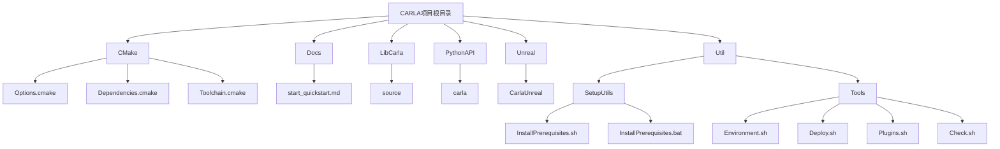
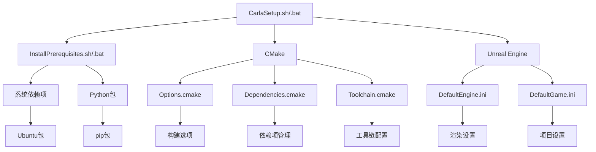
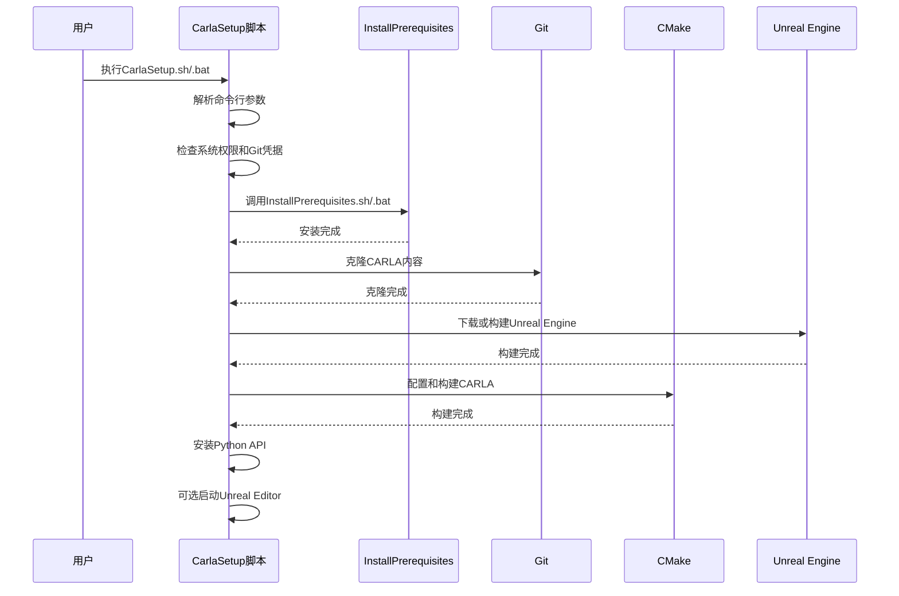
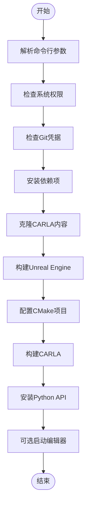
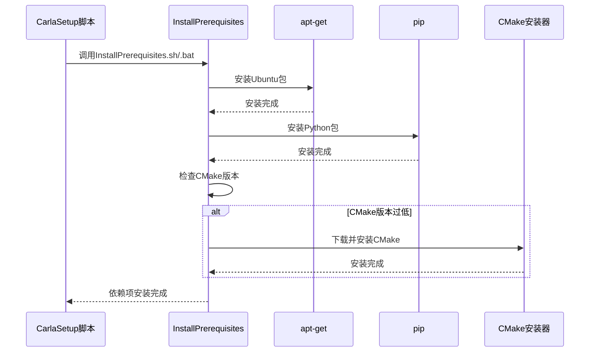
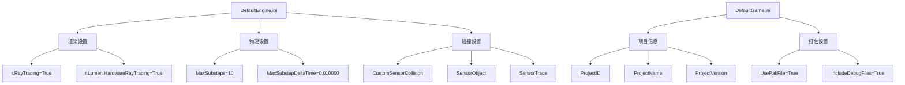
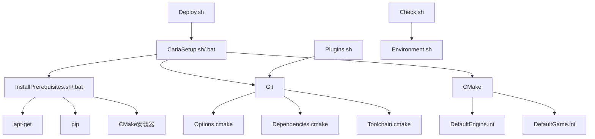

# 设置与配置工具

> **引用文件**
> **本文档中引用的文件**

- [CarlaSetup.sh](https://github.com/carla-simulator/carla/blob/ue5-dev/CarlaSetup.sh)
- [CarlaSetup.bat](https://github.com/carla-simulator/carla/blob/ue5-dev/CarlaSetup.bat)
- [InstallPrerequisites.sh](https://github.com/carla-simulator/carla/blob/ue5-dev/Util/SetupUtils/InstallPrerequisites.sh)
- [InstallPrerequisites.bat](https://github.com/carla-simulator/carla/blob/ue5-dev/Util/SetupUtils/InstallPrerequisites.bat)
- [Environment.sh](https://github.com/carla-simulator/carla/blob/ue5-dev/Util/Tools/Environment.sh)
- [DefaultEngine.ini](https://github.com/carla-simulator/carla/blob/ue5-dev/Unreal/CarlaUnreal/Config/DefaultEngine.ini)
- [DefaultGame.ini](https://github.com/carla-simulator/carla/blob/ue5-dev/Unreal/CarlaUnreal/Config/DefaultGame.ini)
- [Options.cmake](https://github.com/carla-simulator/carla/blob/ue5-dev/CMake/Options.cmake)
- [Dependencies.cmake](https://github.com/carla-simulator/carla/blob/ue5-dev/CMake/Dependencies.cmake)
- [Toolchain.cmake](https://github.com/carla-simulator/carla/blob/ue5-dev/CMake/Toolchain.cmake)
- [Deploy.sh](https://github.com/carla-simulator/carla/blob/ue5-dev/Util/Tools/Deploy.sh)
- [Plugins.sh](https://github.com/carla-simulator/carla/blob/ue5-dev/Util/Tools/Plugins.sh)
- [Check.sh](https://github.com/carla-simulator/carla/blob/ue5-dev/Util/Tools/Check.sh)

## 目录

1. [简介](#简介)
2. [项目结构](#项目结构)
3. [核心组件](#核心组件)
4. [架构概述](#架构概述)
5. [详细组件分析](#详细组件分析)
6. [依赖分析](#依赖分析)
7. [性能考虑](#性能考虑)
8. [故障排除指南](#故障排除指南)
9. [结论](#结论)

## 简介

CARLA 是一个开源的自动驾驶仿真平台，提供了一个完整的工具链来设置和配置开发环境。本文档深入探讨了 CARLA 环境设置和配置工具，详细解释了`CarlaSetup.sh`和`CarlaSetup.bat`脚本的功能，包括它们如何检测系统环境、安装依赖项和配置开发环境。我们还将分析`InstallPrerequisites`脚本的作用和执行流程，解释`Environment.sh`如何设置必要的环境变量，并描述 Unreal 项目配置文件（如`DefaultEngine.ini`和`DefaultGame.ini`）中的关键设置及其对仿真行为的影响。此外，本文档提供了不同操作系统下的设置指南和故障排除技巧，以及配置最佳实践，如如何优化性能设置和调整仿真参数。为新手提供清晰的设置步骤，同时为经验丰富的用户揭示高级配置选项。

## 项目结构

CARLA 项目具有清晰的模块化结构，每个目录都有特定的职责。项目根目录包含主要的构建和配置脚本，如`CarlaSetup.sh`和`CarlaSetup.bat`，这些脚本用于自动化环境设置过程。`CMake`目录包含构建系统的配置文件，定义了编译选项和依赖关系。`Docs`目录存放文档，包括快速入门指南和详细的教程。`LibCarla`目录包含核心库的源代码，而`PythonAPI`目录提供了 Python 接口。`Unreal`目录包含 Unreal Engine 项目文件和配置，`Util`目录则包含各种实用工具脚本，如设置工具、部署脚本和检查工具。

**图示来源**

- [CarlaSetup.sh](https://github.com/carla-simulator/carla/blob/ue5-dev/CarlaSetup.sh)
- [CarlaSetup.bat](https://github.com/carla-simulator/carla/blob/ue5-dev/CarlaSetup.bat)
- [Options.cmake](https://github.com/carla-simulator/carla/blob/ue5-dev/CMake/Options.cmake)
- [Dependencies.cmake](https://github.com/carla-simulator/carla/blob/ue5-dev/CMake/Dependencies.cmake)
- [Toolchain.cmake](https://github.com/carla-simulator/carla/blob/ue5-dev/CMake/Toolchain.cmake)
- [start_quickstart.md](https://github.com/carla-simulator/carla/blob/ue5-dev/Docs/start_quickstart.md)
- [InstallPrerequisites.sh](https://github.com/carla-simulator/carla/blob/ue5-dev/Util/SetupUtils/InstallPrerequisites.sh)
- [InstallPrerequisites.bat](https://github.com/carla-simulator/carla/blob/ue5-dev/Util/SetupUtils/InstallPrerequisites.bat)
- [Environment.sh](https://github.com/carla-simulator/carla/blob/ue5-dev/Util/Tools/Environment.sh)
- [Deploy.sh](https://github.com/carla-simulator/carla/blob/ue5-dev/Util/Tools/Deploy.sh)
- [Plugins.sh](https://github.com/carla-simulator/carla/blob/ue5-dev/Util/Tools/Plugins.sh)
- [Check.sh](https://github.com/carla-simulator/carla/blob/ue5-dev/Util/Tools/Check.sh)

**本节来源**

- [CarlaSetup.sh](https://github.com/carla-simulator/carla/blob/ue5-dev/CarlaSetup.sh)
- [CarlaSetup.bat](https://github.com/carla-simulator/carla/blob/ue5-dev/CarlaSetup.bat)
- [Options.cmake](https://github.com/carla-simulator/carla/blob/ue5-dev/CMake/Options.cmake)
- [Dependencies.cmake](https://github.com/carla-simulator/carla/blob/ue5-dev/CMake/Dependencies.cmake)
- [Toolchain.cmake](https://github.com/carla-simulator/carla/blob/ue5-dev/CMake/Toolchain.cmake)
- [start_quickstart.md](https://github.com/carla-simulator/carla/blob/ue5-dev/Docs/start_quickstart.md)

## 核心组件

CARLA 环境设置和配置工具的核心组件包括`CarlaSetup.sh`和`CarlaSetup.bat`脚本，它们负责自动化整个设置过程。这些脚本首先解析命令行参数，然后检查系统权限和 Git 凭据。接下来，它们调用`InstallPrerequisites`脚本来安装必要的系统依赖项和 Python 包。之后，脚本会克隆 CARLA 内容并下载或构建 Unreal Engine。最后，它们使用 CMake 配置和构建 CARLA 项目，并安装 Python API。`Environment.sh`脚本则为其他 shell 脚本设置环境变量和日志功能。

**本节来源**

- [CarlaSetup.sh](https://github.com/carla-simulator/carla/blob/ue5-dev/CarlaSetup.sh)
- [CarlaSetup.bat](https://github.com/carla-simulator/carla/blob/ue5-dev/CarlaSetup.bat)
- [InstallPrerequisites.sh](https://github.com/carla-simulator/carla/blob/ue5-dev/Util/SetupUtils/InstallPrerequisites.sh)
- [InstallPrerequisites.bat](https://github.com/carla-simulator/carla/blob/ue5-dev/Util/SetupUtils/InstallPrerequisites.bat)
- [Environment.sh](https://github.com/carla-simulator/carla/blob/ue5-dev/Util/Tools/Environment.sh)

## 架构概述

CARLA 的设置和配置架构是一个多层次的系统，从顶层的设置脚本到底层的构建系统和配置文件。`CarlaSetup.sh`和`CarlaSetup.bat`作为入口点，协调整个设置过程。它们依赖于`InstallPrerequisites`脚本来处理依赖项安装，利用 CMake 系统来管理构建过程，并通过 Unreal Engine 的配置文件来定制仿真环境。这个架构确保了跨平台的一致性和可重复性，使得开发者可以在不同的操作系统上轻松地设置和配置 CARLA 环境。

**图示来源**

- [CarlaSetup.sh](https://github.com/carla-simulator/carla/blob/ue5-dev/CarlaSetup.sh)
- [CarlaSetup.bat](https://github.com/carla-simulator/carla/blob/ue5-dev/CarlaSetup.bat)
- [InstallPrerequisites.sh](https://github.com/carla-simulator/carla/blob/ue5-dev/Util/SetupUtils/InstallPrerequisites.sh)
- [InstallPrerequisites.bat](https://github.com/carla-simulator/carla/blob/ue5-dev/Util/SetupUtils/InstallPrerequisites.bat)
- [Options.cmake](https://github.com/carla-simulator/carla/blob/ue5-dev/CMake/Options.cmake)
- [Dependencies.cmake](https://github.com/carla-simulator/carla/blob/ue5-dev/CMake/Dependencies.cmake)
- [Toolchain.cmake](https://github.com/carla-simulator/carla/blob/ue5-dev/CMake/Toolchain.cmake)
- [DefaultEngine.ini](https://github.com/carla-simulator/carla/blob/ue5-dev/Unreal/CarlaUnreal/Config/DefaultEngine.ini)
- [DefaultGame.ini](https://github.com/carla-simulator/carla/blob/ue5-dev/Unreal/CarlaUnreal/Config/DefaultGame.ini)

## 详细组件分析

### CarlaSetup 脚本分析

`CarlaSetup.sh`和`CarlaSetup.bat`是 CARLA 环境设置的主要脚本，分别用于 Linux 和 Windows 系统。它们的功能相似，但语法和命令有所不同。这些脚本首先解析命令行参数，如`--interactive`、`--skip-prerequisites`、`--launch`和`--python-root`，以确定运行模式和配置。然后，它们检查系统权限和 Git 凭据，确保有足够的权限执行后续操作。接下来，脚本调用`InstallPrerequisites`来安装必要的依赖项。之后，它们克隆 CARLA 内容并下载或构建 Unreal Engine。最后，使用 CMake 配置和构建 CARLA 项目，并可选择启动 Unreal Editor。

#### 对于 API/服务组件：

**图示来源**

- [CarlaSetup.sh](https://github.com/carla-simulator/carla/blob/ue5-dev/CarlaSetup.sh)
- [CarlaSetup.bat](https://github.com/carla-simulator/carla/blob/ue5-dev/CarlaSetup.bat)
- [InstallPrerequisites.sh](https://github.com/carla-simulator/carla/blob/ue5-dev/Util/SetupUtils/InstallPrerequisites.sh)
- [InstallPrerequisites.bat](https://github.com/carla-simulator/carla/blob/ue5-dev/Util/SetupUtils/InstallPrerequisites.bat)

#### 对于复杂逻辑组件：

**图示来源**

- [CarlaSetup.sh](https://github.com/carla-simulator/carla/blob/ue5-dev/CarlaSetup.sh)
- [CarlaSetup.bat](https://github.com/carla-simulator/carla/blob/ue5-dev/CarlaSetup.bat)

**本节来源**

- [CarlaSetup.sh](https://github.com/carla-simulator/carla/blob/ue5-dev/CarlaSetup.sh)
- [CarlaSetup.bat](https://github.com/carla-simulator/carla/blob/ue5-dev/CarlaSetup.bat)

### InstallPrerequisites 脚本分析

`InstallPrerequisites.sh`和`InstallPrerequisites.bat`脚本负责安装 CARLA 所需的系统依赖项和 Python 包。在 Linux 系统上，`InstallPrerequisites.sh`使用`apt-get`安装必要的 Ubuntu 包，如`build-essential`、`ninja-build`和`libvulkan1`。它还检查并安装指定版本的 Python 包，包括从`requirements.txt`文件中列出的包。此外，脚本会检查 CMake 的版本，如果低于最低要求（3.28.0），则会下载并安装最新版本的 CMake。在 Windows 系统上，`InstallPrerequisites.bat`脚本会检查是否已安装 Visual Studio 2022，如果没有，则下载并安装社区版。它还会安装 Ninja 构建工具和指定版本的 Python，然后使用 pip 安装 Python 依赖项。

#### 对于 API/服务组件：

**图示来源**

- [InstallPrerequisites.sh](https://github.com/carla-simulator/carla/blob/ue5-dev/Util/SetupUtils/InstallPrerequisites.sh)
- [InstallPrerequisites.bat](https://github.com/carla-simulator/carla/blob/ue5-dev/Util/SetupUtils/InstallPrerequisites.bat)

**本节来源**

- [InstallPrerequisites.sh](https://github.com/carla-simulator/carla/blob/ue5-dev/Util/SetupUtils/InstallPrerequisites.sh)
- [InstallPrerequisites.bat](https://github.com/carla-simulator/carla/blob/ue5-dev/Util/SetupUtils/InstallPrerequisites.bat)

### Environment.sh 脚本分析

`Environment.sh`脚本是一个简单的 shell 脚本，为其他 shell 脚本提供基本的环境设置功能。它定义了两个函数：`log`用于输出带时间戳的日志信息，`fatal_error`用于在发生错误时输出错误信息并退出脚本。这些函数通过`basename "$0"`获取当前脚本的名称，以便在日志和错误消息中显示。该脚本还设置了`set -e`选项，确保在任何命令失败时脚本立即退出，从而提高脚本的健壮性。

**本节来源**

- [Environment.sh](https://github.com/carla-simulator/carla/blob/ue5-dev/Util/Tools/Environment.sh)

### Unreal 项目配置文件分析

Unreal 项目配置文件，特别是`DefaultEngine.ini`和`DefaultGame.ini`，对 CARLA 仿真环境的行为有重要影响。`DefaultEngine.ini`文件包含渲染、物理和碰撞设置。例如，`r.RayTracing=True`启用了光线追踪，提高了渲染的真实感；`r.Lumen.HardwareRayTracing=True`启用了 Lumen 硬件光线追踪，进一步增强了光照效果。物理设置如`MaxSubsteps=10`和`MaxSubstepDeltaTime=0.010000`控制了物理模拟的精度和稳定性。`DefaultGame.ini`文件则定义了项目的基本信息，如项目 ID、名称和版本，以及打包设置，如是否生成 pak 文件和是否包含调试文件。

#### 对于复杂逻辑组件：

**图示来源**

- [DefaultEngine.ini](https://github.com/carla-simulator/carla/blob/ue5-dev/Unreal/CarlaUnreal/Config/DefaultEngine.ini)
- [DefaultGame.ini](https://github.com/carla-simulator/carla/blob/ue5-dev/Unreal/CarlaUnreal/Config/DefaultGame.ini)

**本节来源**

- [DefaultEngine.ini](https://github.com/carla-simulator/carla/blob/ue5-dev/Unreal/CarlaUnreal/Config/DefaultEngine.ini)
- [DefaultGame.ini](https://github.com/carla-simulator/carla/blob/ue5-dev/Unreal/CarlaUnreal/Config/DefaultGame.ini)

## 依赖分析

CARLA 的设置和配置工具依赖于多个外部组件和系统工具。`CarlaSetup.sh`和`CarlaSetup.bat`脚本依赖于`InstallPrerequisites`脚本来安装系统依赖项，如 Ubuntu 包、Python 包和 CMake。它们还依赖于 Git 来克隆 CARLA 内容和 Unreal Engine。CMake 系统依赖于`Options.cmake`、`Dependencies.cmake`和`Toolchain.cmake`文件来管理构建选项、依赖项和工具链配置。Unreal Engine 项目依赖于`DefaultEngine.ini`和`DefaultGame.ini`文件来定义渲染、物理和项目设置。此外，`Util`目录中的其他脚本，如`Deploy.sh`、`Plugins.sh`和`Check.sh`，也依赖于这些核心组件来完成部署、插件管理和测试任务。

**图示来源**

- [CarlaSetup.sh](https://github.com/carla-simulator/carla/blob/ue5-dev/CarlaSetup.sh)
- [CarlaSetup.bat](https://github.com/carla-simulator/carla/blob/ue5-dev/CarlaSetup.bat)
- [InstallPrerequisites.sh](https://github.com/carla-simulator/carla/blob/ue5-dev/Util/SetupUtils/InstallPrerequisites.sh)
- [InstallPrerequisites.bat](https://github.com/carla-simulator/carla/blob/ue5-dev/Util/SetupUtils/InstallPrerequisites.bat)
- [Options.cmake](https://github.com/carla-simulator/carla/blob/ue5-dev/CMake/Options.cmake)
- [Dependencies.cmake](https://github.com/carla-simulator/carla/blob/ue5-dev/CMake/Dependencies.cmake)
- [Toolchain.cmake](https://github.com/carla-simulator/carla/blob/ue5-dev/CMake/Toolchain.cmake)
- [DefaultEngine.ini](https://github.com/carla-simulator/carla/blob/ue5-dev/Unreal/CarlaUnreal/Config/DefaultEngine.ini)
- [DefaultGame.ini](https://github.com/carla-simulator/carla/blob/ue5-dev/Unreal/CarlaUnreal/Config/DefaultGame.ini)
- [Deploy.sh](https://github.com/carla-simulator/carla/blob/ue5-dev/Util/Tools/Deploy.sh)
- [Plugins.sh](https://github.com/carla-simulator/carla/blob/ue5-dev/Util/Tools/Plugins.sh)
- [Check.sh](https://github.com/carla-simulator/carla/blob/ue5-dev/Util/Tools/Check.sh)
- [Environment.sh](https://github.com/carla-simulator/carla/blob/ue5-dev/Util/Tools/Environment.sh)

**本节来源**

- [CarlaSetup.sh](https://github.com/carla-simulator/carla/blob/ue5-dev/CarlaSetup.sh)
- [CarlaSetup.bat](https://github.com/carla-simulator/carla/blob/ue5-dev/CarlaSetup.bat)
- [InstallPrerequisites.sh](https://github.com/carla-simulator/carla/blob/ue5-dev/Util/SetupUtils/InstallPrerequisites.sh)
- [InstallPrerequisites.bat](https://github.com/carla-simulator/carla/blob/ue5-dev/Util/SetupUtils/InstallPrerequisites.bat)
- [Options.cmake](https://github.com/carla-simulator/carla/blob/ue5-dev/CMake/Options.cmake)
- [Dependencies.cmake](https://github.com/carla-simulator/carla/blob/ue5-dev/CMake/Dependencies.cmake)
- [Toolchain.cmake](https://github.com/carla-simulator/carla/blob/ue5-dev/CMake/Toolchain.cmake)
- [DefaultEngine.ini](https://github.com/carla-simulator/carla/blob/ue5-dev/Unreal/CarlaUnreal/Config/DefaultEngine.ini)
- [DefaultGame.ini](https://github.com/carla-simulator/carla/blob/ue5-dev/Unreal/CarlaUnreal/Config/DefaultGame.ini)
- [Deploy.sh](https://github.com/carla-simulator/carla/blob/ue5-dev/Util/Tools/Deploy.sh)
- [Plugins.sh](https://github.com/carla-simulator/carla/blob/ue5-dev/Util/Tools/Plugins.sh)
- [Check.sh](https://github.com/carla-simulator/carla/blob/ue5-dev/Util/Tools/Check.sh)
- [Environment.sh](https://github.com/carla-simulator/carla/blob/ue5-dev/Util/Tools/Environment.sh)

## 性能考虑

为了优化 CARLA 仿真环境的性能，可以调整多个设置。在`DefaultEngine.ini`文件中，可以通过修改`r.Streaming.PoolSize`来控制纹理流送的内存池大小，从而平衡内存使用和渲染性能。启用`r.VirtualTextures`可以提高大场景的渲染效率。物理模拟的性能可以通过调整`MaxSubsteps`和`MaxSubstepDeltaTime`来优化，较高的值会增加模拟的精度但也会增加计算开销。此外，禁用不必要的渲染特性，如`r.DefaultFeature.Bloom=False`和`r.DefaultFeature.AmbientOcclusion=False`，可以显著提高帧率。在打包设置中，将`CARLA_UNREAL_PACKAGE_NO_COMPRESSION`设置为`ON`可以加快包的生成速度，但会增加包的大小。

**本节来源**

- [DefaultEngine.ini](https://github.com/carla-simulator/carla/blob/ue5-dev/Unreal/CarlaUnreal/Config/DefaultEngine.ini)
- [Options.cmake](https://github.com/carla-simulator/carla/blob/ue5-dev/CMake/Options.cmake)

## 故障排除指南

在设置和配置 CARLA 环境时，可能会遇到各种问题。常见的问题包括权限不足、Git 凭据缺失、依赖项安装失败和构建错误。如果遇到权限问题，确保以管理员身份运行脚本或使用`sudo`。如果 Git 凭据缺失，可以在运行脚本前设置`GIT_LOCAL_CREDENTIALS`环境变量。依赖项安装失败可能是由于网络问题或包管理器配置错误，可以尝试手动安装缺失的包。构建错误通常与 CMake 配置或编译器版本有关，可以检查`CMakeLists.txt`文件和编译器版本是否兼容。此外，查看日志文件和错误消息可以帮助定位问题。

**本节来源**

- [CarlaSetup.sh](https://github.com/carla-simulator/carla/blob/ue5-dev/CarlaSetup.sh)
- [CarlaSetup.bat](https://github.com/carla-simulator/carla/blob/ue5-dev/CarlaSetup.bat)
- [InstallPrerequisites.sh](https://github.com/carla-simulator/carla/blob/ue5-dev/Util/SetupUtils/InstallPrerequisites.sh)
- [InstallPrerequisites.bat](https://github.com/carla-simulator/carla/blob/ue5-dev/Util/SetupUtils/InstallPrerequisites.bat)

## 结论

CARLA 环境设置和配置工具提供了一套完整的解决方案，用于自动化和简化开发环境的搭建过程。通过`CarlaSetup.sh`和`CarlaSetup.bat`脚本，开发者可以轻松地在不同操作系统上安装和配置 CARLA。`InstallPrerequisites`脚本确保了所有必要的依赖项都被正确安装，而 CMake 系统和 Unreal Engine 配置文件则提供了灵活的构建和仿真设置。了解这些工具的工作原理和配置选项，可以帮助开发者更高效地使用 CARLA 进行自动驾驶研究和开发。通过遵循最佳实践和利用高级配置选项，可以进一步优化仿真环境的性能和功能。
