# 资源导入工具

**本文档中引用的文件**   
- [Import.py](https://github.com/carla-simulator/carla/blob/ue5-dev/Util/Tools/Import.py)
- [Import.sh](https://github.com/carla-simulator/carla/blob/ue5-dev/Util/Tools/Import.sh)
- [FBX2OBJ.cpp](https://github.com/carla-simulator/carla/blob/ue5-dev/Util/DockerUtils/fbx/src/FBX2OBJ.cpp)
- [MeshToSplineActor.cpp](https://github.com/carla-simulator/carla/blob/ue5-dev/Unreal/CarlaUnreal/Plugins/CarlaTools/Source/CarlaTools/Private/BlueprintLibrary/MeshToSplineActor.cpp)
- [MeshToSplineActor.h](https://github.com/carla-simulator/carla/blob/ue5-dev/Unreal/CarlaUnreal/Plugins/CarlaTools/Source/CarlaTools/Public/BlueprintLibrary/MeshToSplineActor.h)
- [ProceduralBuildingUtilities.cpp](https://github.com/carla-simulator/carla/blob/ue5-dev/Unreal/CarlaUnreal/Plugins/CarlaTools/Source/CarlaTools/Private/ProceduralBuildingUtilities.cpp)
- [ProceduralBuildingUtilities.h](https://github.com/carla-simulator/carla/blob/ue5-dev/Unreal/CarlaUnreal/Plugins/CarlaTools/Source/CarlaTools/Public/ProceduralBuildingUtilities.h)
- [README.md](https://github.com/carla-simulator/carla/blob/ue5-dev/Import/README.md)
- [custom_assets_tutorials.md](https://github.com/carla-simulator/carla/blob/ue5-dev/Docs/custom_assets_tutorials.md)
- [content_authoring_props.md](https://github.com/carla-simulator/carla/blob/ue5-dev/Docs/content_authoring_props.md)

## 目录
1. [简介](#简介)
2. [项目结构](#项目结构)
3. [核心组件](#核心组件)
4. [架构概述](#架构概述)
5. [详细组件分析](#详细组件分析)
6. [依赖分析](#依赖分析)
7. [性能考虑](#性能考虑)
8. [故障排除指南](#故障排除指南)
9. [结论](#结论)

## 简介
CARLA资源导入工具是一套完整的系统，用于将外部3D模型和资产集成到CARLA仿真环境中。该系统包括Python脚本、Shell脚本和C++工具，支持从不同3D建模软件导出的资产导入。工具链涵盖了从FBX文件转换到OBJ格式，到道路和环境生成，再到高级建模功能的完整流程。本文档详细介绍了Import.py和Import.sh脚本的使用方法，解释了FBX2OBJ.cpp如何将FBX文件转换为OBJ格式，描述了MeshToSplineActor等工具在道路和环境生成中的应用，并涵盖了ProceduralBuildingUtilities等高级建模工具的功能。

## 项目结构
CARLA资源导入工具的项目结构清晰，主要组件分布在不同的目录中。核心导入脚本位于Util/Tools目录下，而相关的C++工具则位于Unreal/CarlaUnreal/Plugins/CarlaTools目录中。FBX到OBJ的转换工具位于Util/DockerUtils/fbx/src目录中。

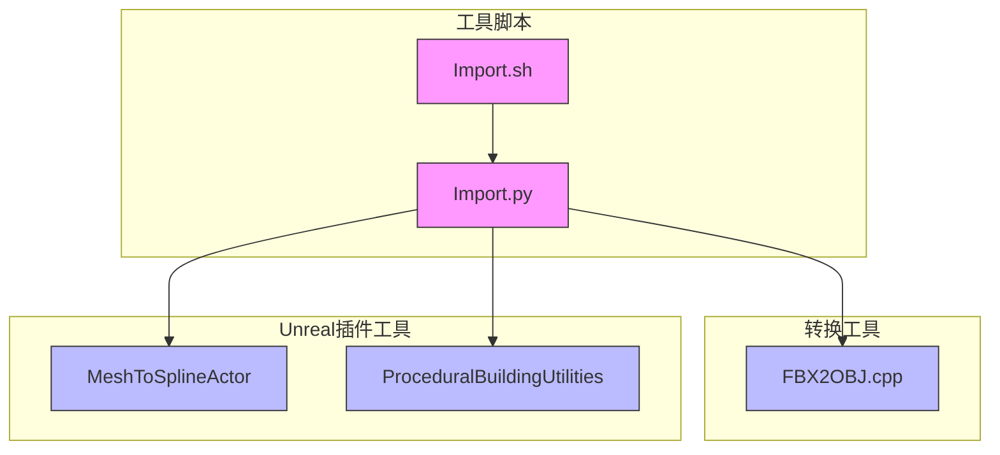

**图源**
- [Import.py](https://github.com/carla-simulator/carla/blob/ue5-dev/Util/Tools/Import.py)
- [Import.sh](https://github.com/carla-simulator/carla/blob/ue5-dev/Util/Tools/Import.sh)
- [FBX2OBJ.cpp](https://github.com/carla-simulator/carla/blob/ue5-dev/Util/DockerUtils/fbx/src/FBX2OBJ.cpp)
- [MeshToSplineActor.cpp](https://github.com/carla-simulator/carla/blob/ue5-dev/Unreal/CarlaUnreal/Plugins/CarlaTools/Source/CarlaTools/Private/BlueprintLibrary/MeshToSplineActor.cpp)
- [ProceduralBuildingUtilities.cpp](https://github.com/carla-simulator/carla/blob/ue5-dev/Unreal/CarlaUnreal/Plugins/CarlaTools/Source/CarlaTools/Private/ProceduralBuildingUtilities.cpp)

**本节源**
- [Import.py](https://github.com/carla-simulator/carla/blob/ue5-dev/Util/Tools/Import.py)
- [Import.sh](https://github.com/carla-simulator/carla/blob/ue5-dev/Util/Tools/Import.sh)
- [FBX2OBJ.cpp](https://github.com/carla-simulator/carla/blob/ue5-dev/Util/DockerUtils/fbx/src/FBX2OBJ.cpp)
- [MeshToSplineActor.cpp](https://github.com/carla-simulator/carla/blob/ue5-dev/Unreal/CarlaUnreal/Plugins/CarlaTools/Source/CarlaTools/Private/BlueprintLibrary/MeshToSplineActor.cpp)
- [ProceduralBuildingUtilities.cpp](https://github.com/carla-simulator/carla/blob/ue5-dev/Unreal/CarlaUnreal/Plugins/CarlaTools/Source/CarlaTools/Private/ProceduralBuildingUtilities.cpp)

## 核心组件
CARLA资源导入工具的核心组件包括Import.py和Import.sh脚本，它们是整个导入流程的入口点。Import.py是主要的Python脚本，负责处理资产导入的逻辑，而Import.sh是用于在Linux系统上执行导入操作的Shell脚本。此外，FBX2OBJ.cpp是用于将FBX文件转换为OBJ格式的C++程序，而MeshToSplineActor和ProceduralBuildingUtilities是Unreal Engine中的高级建模工具。

**本节源**
- [Import.py](https://github.com/carla-simulator/carla/blob/ue5-dev/Util/Tools/Import.py)
- [Import.sh](https://github.com/carla-simulator/carla/blob/ue5-dev/Util/Tools/Import.sh)
- [FBX2OBJ.cpp](https://github.com/carla-simulator/carla/blob/ue5-dev/Util/DockerUtils/fbx/src/FBX2OBJ.cpp)
- [MeshToSplineActor.cpp](https://github.com/carla-simulator/carla/blob/ue5-dev/Unreal/CarlaUnreal/Plugins/CarlaTools/Source/CarlaTools/Private/BlueprintLibrary/MeshToSplineActor.cpp)
- [ProceduralBuildingUtilities.cpp](https://github.com/carla-simulator/carla/blob/ue5-dev/Unreal/CarlaUnreal/Plugins/CarlaTools/Source/CarlaTools/Private/ProceduralBuildingUtilities.cpp)

## 架构概述
CARLA资源导入工具的架构是一个多层次的系统，从用户界面到底层处理都有明确的分工。用户通过Import.sh脚本启动导入过程，该脚本调用Import.py脚本。Import.py脚本负责解析输入参数，生成导入设置文件，并调用Unreal Engine的命令行工具来执行实际的资产导入。在导入过程中，如果需要将FBX文件转换为OBJ格式，会调用FBX2OBJ.cpp编译的程序。对于高级建模任务，如道路生成和建筑生成，会使用Unreal Engine中的MeshToSplineActor和ProceduralBuildingUtilities工具。

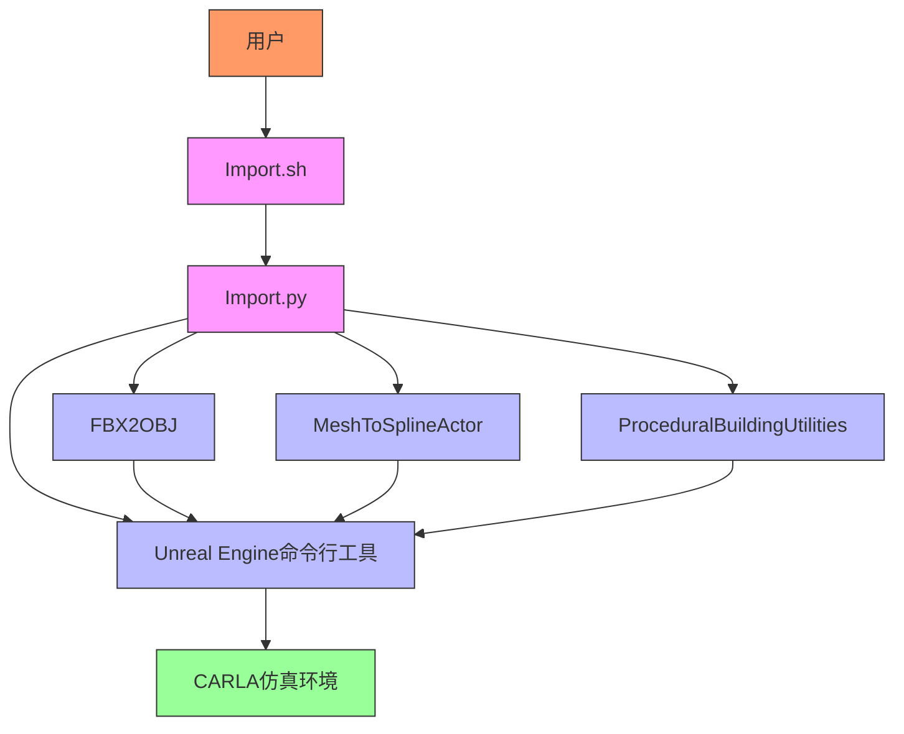

**图源**
- [Import.py](https://github.com/carla-simulator/carla/blob/ue5-dev/Util/Tools/Import.py)
- [Import.sh](https://github.com/carla-simulator/carla/blob/ue5-dev/Util/Tools/Import.sh)
- [FBX2OBJ.cpp](https://github.com/carla-simulator/carla/blob/ue5-dev/Util/DockerUtils/fbx/src/FBX2OBJ.cpp)
- [MeshToSplineActor.cpp](https://github.com/carla-simulator/carla/blob/ue5-dev/Unreal/CarlaUnreal/Plugins/CarlaTools/Source/CarlaTools/Private/BlueprintLibrary/MeshToSplineActor.cpp)
- [ProceduralBuildingUtilities.cpp](https://github.com/carla-simulator/carla/blob/ue5-dev/Unreal/CarlaUnreal/Plugins/CarlaTools/Source/CarlaTools/Private/ProceduralBuildingUtilities.cpp)

## 详细组件分析

### Import.py和Import.sh脚本分析
Import.py和Import.sh脚本是CARLA资源导入工具的核心，它们负责协调整个导入流程。Import.py脚本提供了丰富的功能，包括生成JSON配置文件、调用Unreal Engine命令行工具、处理地图和资产的导入等。Import.sh脚本则是一个简单的包装器，用于在Linux系统上执行Import.py脚本。

#### Import.py脚本功能
Import.py脚本的主要功能包括：
- 解析命令行参数
- 生成JSON配置文件
- 调用Unreal Engine命令行工具
- 处理地图和资产的导入
- 生成导航二进制文件

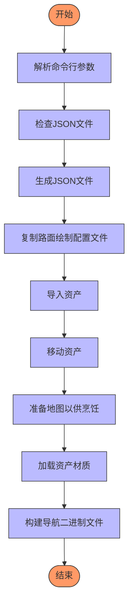

**图源**
- [Import.py](https://github.com/carla-simulator/carla/blob/ue5-dev/Util/Tools/Import.py#L593-L630)

#### Import.sh脚本功能
Import.sh脚本的主要功能是解析命令行参数并调用Import.py脚本。它支持指定Python版本、批量大小、包名等参数。

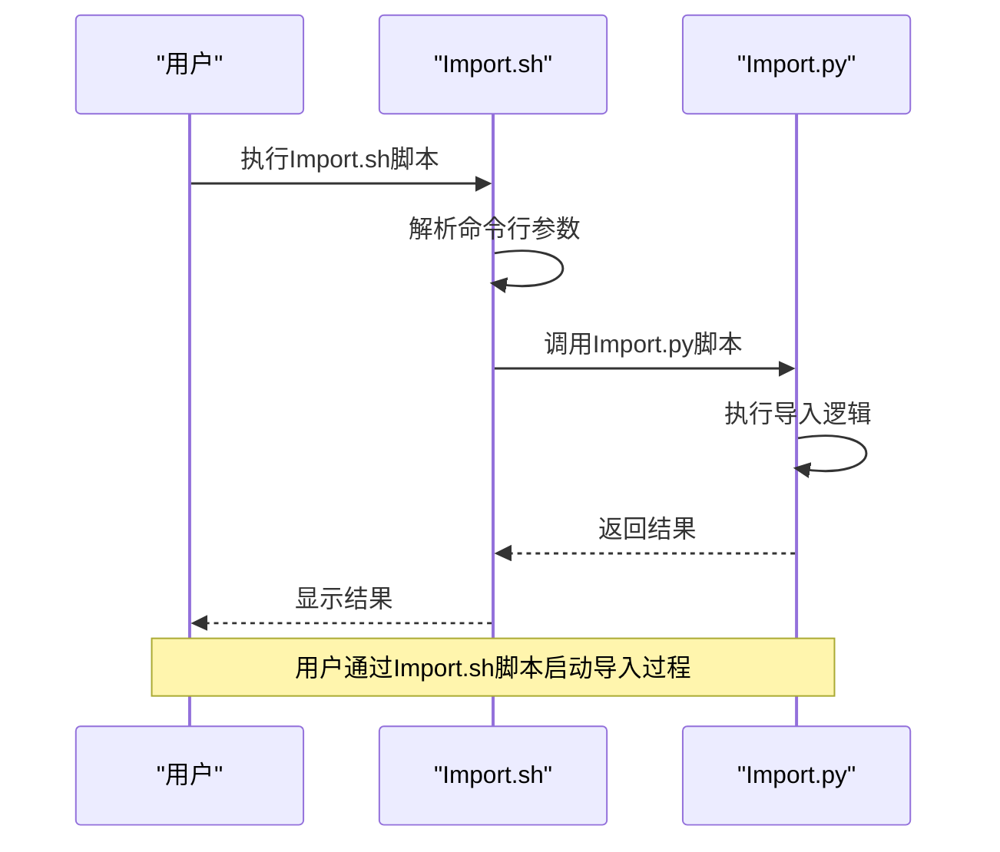

**图源**
- [Import.sh](https://github.com/carla-simulator/carla/blob/ue5-dev/Util/Tools/Import.sh#L1-L52)

**本节源**
- [Import.py](https://github.com/carla-simulator/carla/blob/ue5-dev/Util/Tools/Import.py)
- [Import.sh](https://github.com/carla-simulator/carla/blob/ue5-dev/Util/Tools/Import.sh)

### FBX2OBJ.cpp转换工具分析
FBX2OBJ.cpp是一个C++程序，用于将FBX文件转换为OBJ格式。这个工具在CARLA资源导入过程中起着关键作用，因为它允许用户将从不同3D建模软件导出的FBX文件转换为CARLA可以使用的OBJ格式。

#### FBX2OBJ.cpp工作流程
FBX2OBJ.cpp的工作流程包括以下几个步骤：
1. 初始化FBX SDK
2. 加载FBX文件
3. 设置材质
4. 导出为OBJ文件

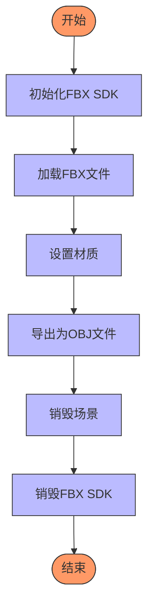

**图源**
- [FBX2OBJ.cpp](https://github.com/carla-simulator/carla/blob/ue5-dev/Util/DockerUtils/fbx/src/FBX2OBJ.cpp#L210-L250)

#### FBX2OBJ.cpp材质设置
FBX2OBJ.cpp根据节点名称自动设置材质。例如，如果节点名称包含"Road_Road"或"Roads_Road"，则将其材质设置为道路材质。

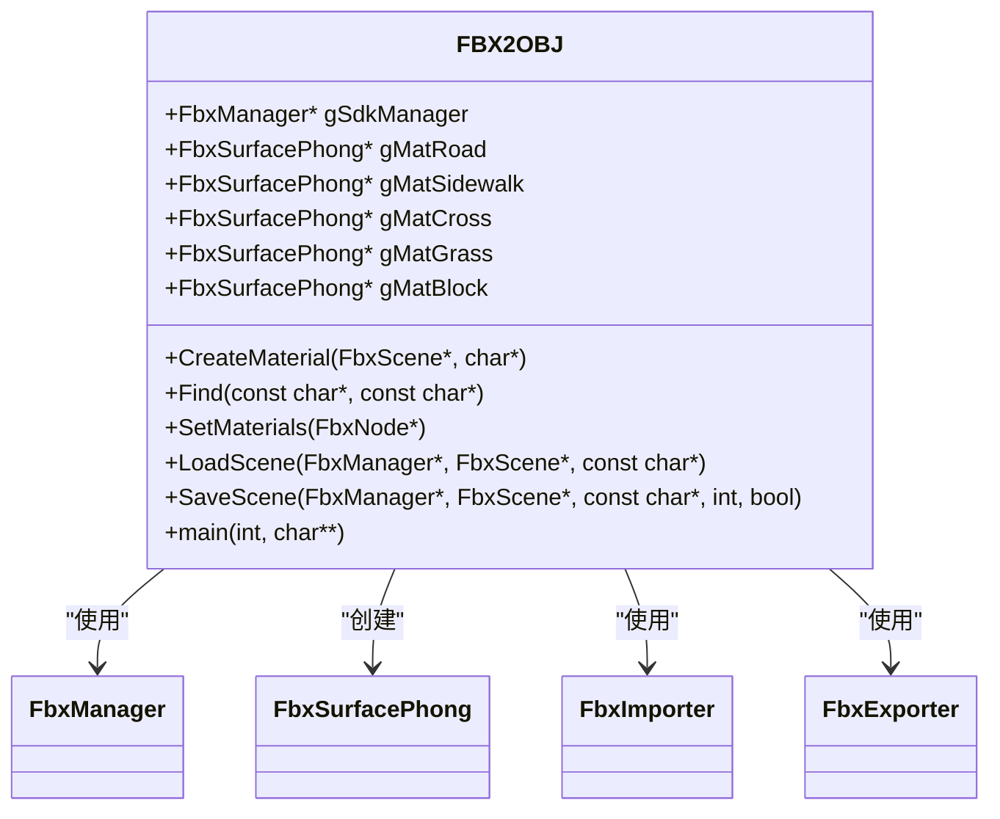

**图源**
- [FBX2OBJ.cpp](https://github.com/carla-simulator/carla/blob/ue5-dev/Util/DockerUtils/fbx/src/FBX2OBJ.cpp)

**本节源**
- [FBX2OBJ.cpp](https://github.com/carla-simulator/carla/blob/ue5-dev/Util/DockerUtils/fbx/src/FBX2OBJ.cpp)

### MeshToSplineActor工具分析
MeshToSplineActor是一个Unreal Engine中的Actor，用于从静态网格生成样条线。这个工具在道路和环境生成中非常有用，因为它可以自动从3D模型的边界生成样条线，从而简化道路设计过程。

#### MeshToSplineActor工作流程
MeshToSplineActor的工作流程包括以下几个步骤：
1. 获取源Actor的静态网格组件
2. 提取网格的所有部分
3. 将顶点焊接以关闭微小间隙
4. 将三角形分割成岛屿
5. 为每个岛屿生成边界环
6. 移除内部岛屿
7. 合并接近的岛屿
8. 生成样条线

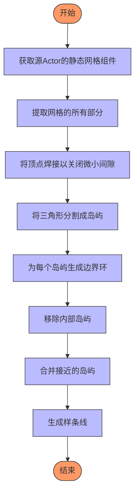

**图源**
- [MeshToSplineActor.cpp](https://github.com/carla-simulator/carla/blob/ue5-dev/Unreal/CarlaUnreal/Plugins/CarlaTools/Source/CarlaTools/Private/BlueprintLibrary/MeshToSplineActor.cpp#L320-L518)

#### MeshToSplineActor类结构
MeshToSplineActor类的主要成员包括：
- SourceActor: 源Actor
- GeneratedSplines: 生成的样条线组件
- WeldVertexTolerance: 顶点焊接容差
- MergeIslandsDistance: 岛屿合并距离
- ContainmentEpsilon: 包含容差

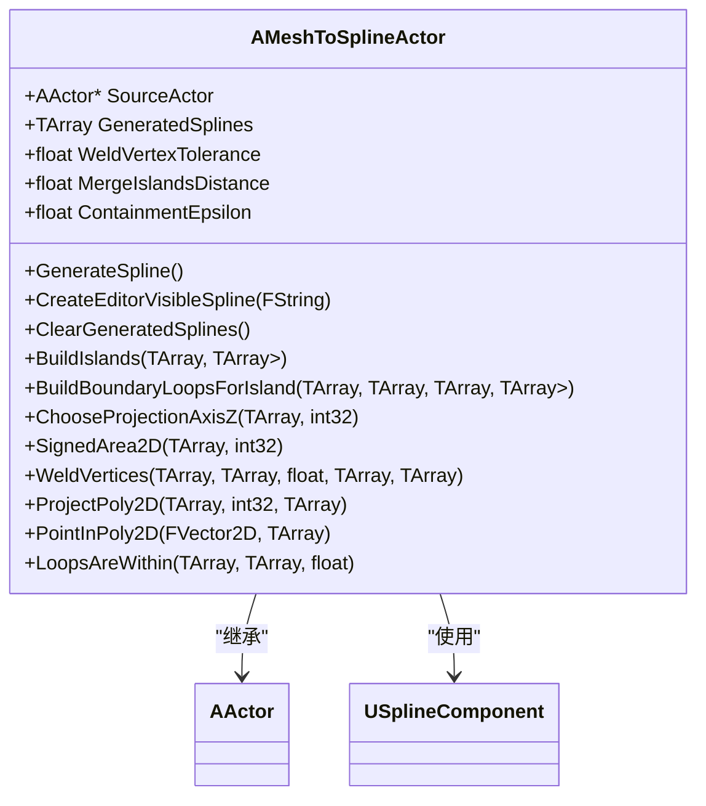

**图源**
- [MeshToSplineActor.h](https://github.com/carla-simulator/carla/blob/ue5-dev/Unreal/CarlaUnreal/Plugins/CarlaTools/Source/CarlaTools/Public/BlueprintLibrary/MeshToSplineActor.h)

**本节源**
- [MeshToSplineActor.cpp](https://github.com/carla-simulator/carla/blob/ue5-dev/Unreal/CarlaUnreal/Plugins/CarlaTools/Source/CarlaTools/Private/BlueprintLibrary/MeshToSplineActor.cpp)
- [MeshToSplineActor.h](https://github.com/carla-simulator/carla/blob/ue5-dev/Unreal/CarlaUnreal/Plugins/CarlaTools/Source/CarlaTools/Public/BlueprintLibrary/MeshToSplineActor.h)

### ProceduralBuildingUtilities工具分析
ProceduralBuildingUtilities是一个Unreal Engine中的Actor，用于程序化生成建筑。这个工具提供了多种功能，包括生成建筑 impostor 纹理、生成建筑 impostor 几何体、将程序化建筑烹饪为静态网格等。

#### ProceduralBuildingUtilities功能
ProceduralBuildingUtilities的主要功能包括：
- 生成建筑 impostor 纹理
- 生成建筑 impostor 几何体
- 将程序化建筑烹饪为静态网格
- 将建筑放置到父Actor上
- 生成建筑材质资产

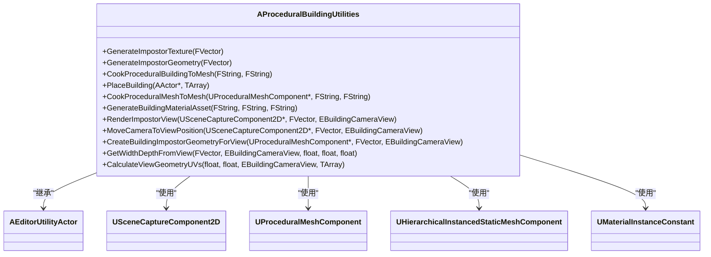

**图源**
- [ProceduralBuildingUtilities.h](https://github.com/carla-simulator/carla/blob/ue5-dev/Unreal/CarlaUnreal/Plugins/CarlaTools/Source/CarlaTools/Public/ProceduralBuildingUtilities.h)

#### ProceduralBuildingUtilities工作流程
ProceduralBuildingUtilities的工作流程包括以下几个步骤：
1. 生成建筑 impostor 纹理
2. 生成建筑 impostor 几何体
3. 将程序化建筑烹饪为静态网格

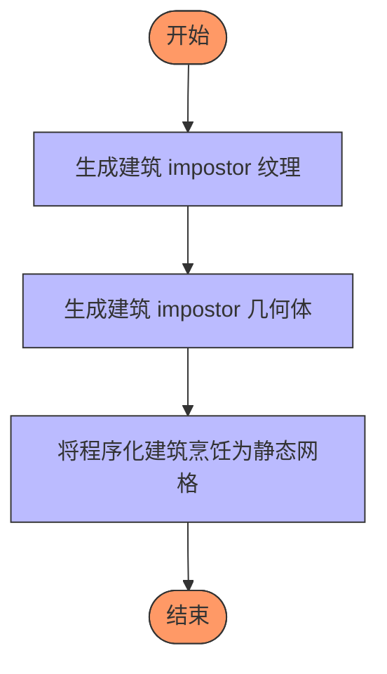

**图源**
- [ProceduralBuildingUtilities.cpp](https://github.com/carla-simulator/carla/blob/ue5-dev/Unreal/CarlaUnreal/Plugins/CarlaTools/Source/CarlaTools/Private/ProceduralBuildingUtilities.cpp)

**本节源**
- [ProceduralBuildingUtilities.cpp](https://github.com/carla-simulator/carla/blob/ue5-dev/Unreal/CarlaUnreal/Plugins/CarlaTools/Source/CarlaTools/Private/ProceduralBuildingUtilities.cpp)
- [ProceduralBuildingUtilities.h](https://github.com/carla-simulator/carla/blob/ue5-dev/Unreal/CarlaUnreal/Plugins/CarlaTools/Source/CarlaTools/Public/ProceduralBuildingUtilities.h)

## 依赖分析
CARLA资源导入工具的依赖关系复杂，涉及多个层次的依赖。从脚本到C++程序，再到Unreal Engine插件，每个组件都有其特定的依赖。

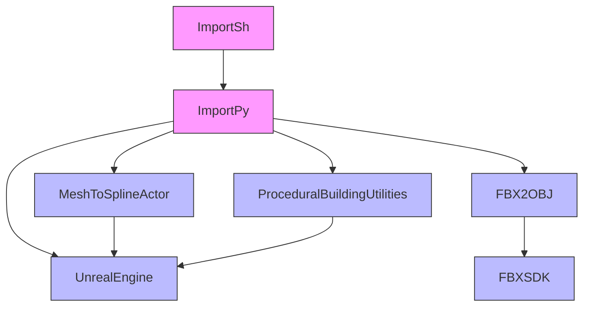

**图源**
- [Import.py](https://github.com/carla-simulator/carla/blob/ue5-dev/Util/Tools/Import.py)
- [Import.sh](https://github.com/carla-simulator/carla/blob/ue5-dev/Util/Tools/Import.sh)
- [FBX2OBJ.cpp](https://github.com/carla-simulator/carla/blob/ue5-dev/Util/DockerUtils/fbx/src/FBX2OBJ.cpp)
- [MeshToSplineActor.cpp](https://github.com/carla-simulator/carla/blob/ue5-dev/Unreal/CarlaUnreal/Plugins/CarlaTools/Source/CarlaTools/Private/BlueprintLibrary/MeshToSplineActor.cpp)
- [ProceduralBuildingUtilities.cpp](https://github.com/carla-simulator/carla/blob/ue5-dev/Unreal/CarlaUnreal/Plugins/CarlaTools/Source/CarlaTools/Private/ProceduralBuildingUtilities.cpp)

**本节源**
- [Import.py](https://github.com/carla-simulator/carla/blob/ue5-dev/Util/Tools/Import.py)
- [Import.sh](https://github.com/carla-simulator/carla/blob/ue5-dev/Util/Tools/Import.sh)
- [FBX2OBJ.cpp](https://github.com/carla-simulator/carla/blob/ue5-dev/Util/DockerUtils/fbx/src/FBX2OBJ.cpp)
- [MeshToSplineActor.cpp](https://github.com/carla-simulator/carla/blob/ue5-dev/Unreal/CarlaUnreal/Plugins/CarlaTools/Source/CarlaTools/Private/BlueprintLibrary/MeshToSplineActor.cpp)
- [ProceduralBuildingUtilities.cpp](https://github.com/carla-simulator/carla/blob/ue5-dev/Unreal/CarlaUnreal/Plugins/CarlaTools/Source/CarlaTools/Private/ProceduralBuildingUtilities.cpp)

## 性能考虑
CARLA资源导入工具在设计时考虑了性能因素。例如，Import.py脚本支持批量导入，可以减少Unreal Engine的内存使用。FBX2OBJ.cpp程序在转换FBX文件时，会根据节点名称自动设置材质，从而减少手动操作。MeshToSplineActor工具在生成样条线时，会将顶点焊接以关闭微小间隙，并合并接近的岛屿，从而生成更简洁的样条线。ProceduralBuildingUtilities工具在生成建筑 impostor 时，会从四个方向（前、左、后、右）捕捉纹理，从而生成更真实的 impostor。

## 故障排除指南
在使用CARLA资源导入工具时，可能会遇到一些常见问题。以下是一些解决方案：

1. **FBX文件导入失败**：确保FBX文件的版本与FBX SDK兼容。可以在Import.py脚本中添加错误处理代码，以捕获并显示详细的错误信息。
2. **材质丢失**：确保FBX文件中的材质名称符合CARLA的命名规范。可以在FBX2OBJ.cpp程序中添加更多的材质匹配规则。
3. **比例问题**：在3D建模软件中导出FBX文件时，确保使用正确的单位（通常是厘米）。可以在Import.py脚本中添加比例调整功能。
4. **坐标系转换问题**：CARLA使用左手坐标系，而一些3D建模软件使用右手坐标系。可以在FBX2OBJ.cpp程序中添加坐标系转换功能。
5. **纹理丢失**：确保FBX文件中的纹理路径正确。可以在Import.py脚本中添加纹理路径修复功能。

**本节源**
- [Import.py](https://github.com/carla-simulator/carla/blob/ue5-dev/Util/Tools/Import.py)
- [FBX2OBJ.cpp](https://github.com/carla-simulator/carla/blob/ue5-dev/Util/DockerUtils/fbx/src/FBX2OBJ.cpp)

## 结论
CARLA资源导入工具是一套功能强大且灵活的系统，可以将外部3D模型和资产集成到CARLA仿真环境中。通过Import.py和Import.sh脚本，用户可以轻松地导入各种资产。FBX2OBJ.cpp程序提供了FBX到OBJ的转换功能，而MeshToSplineActor和ProceduralBuildingUtilities工具则提供了高级建模功能。通过遵循最佳实践和使用提供的故障排除指南，用户可以成功地将自定义资产集成到CARLA仿真环境中。