# ROS2 集成

> **引用文件**
> **本文档引用的文件**

- [ROS2.h](https://github.com/carla-simulator/carla/blob/ue5-dev/LibCarla/source/carla/ros2/ROS2.h)
- [ROS2.cpp](https://github.com/carla-simulator/carla/blob/ue5-dev/LibCarla/source/carla/ros2/ROS2.cpp)
- [ROS2CallbackData.h](https://github.com/carla-simulator/carla/blob/ue5-dev/LibCarla/source/carla/ros2/ROS2CallbackData.h)
- [CarlaPublisher.h](https://github.com/carla-simulator/carla/blob/ue5-dev/LibCarla/source/carla/ros2/publishers/CarlaPublisher.h)
- [CarlaTransformPublisher.h](https://github.com/carla-simulator/carla/blob/ue5-dev/LibCarla/source/carla/ros2/publishers/CarlaTransformPublisher.h)
- [CarlaSubscriber.h](https://github.com/carla-simulator/carla/blob/ue5-dev/LibCarla/source/carla/ros2/subscribers/CarlaSubscriber.h)
- [CarlaEgoVehicleControlSubscriber.h](https://github.com/carla-simulator/carla/blob/ue5-dev/LibCarla/source/carla/ros2/subscribers/CarlaEgoVehicleControlSubscriber.h)
- [types 目录](https://github.com/carla-simulator/carla/blob/ue5-dev/LibCarla/source/carla/ros2/types/)
- [ros2_native.py](https://github.com/carla-simulator/carla/blob/ue5-dev/PythonAPI/examples/ros2/ros2_native.py)
- [fastrtps-profile.xml](https://github.com/carla-simulator/carla/blob/ue5-dev/PythonAPI/examples/ros2/config/fastrtps-profile.xml)
- [ros2_native.rviz](https://github.com/carla-simulator/carla/blob/ue5-dev/PythonAPI/examples/ros2/rviz/ros2_native.rviz)

## 目录

1. [简介](#简介)
2. [通信架构](#通信架构)
3. [核心类与接口](#核心类与接口)
4. [发布者/订阅者模式](#发布者订阅者模式)
5. [支持的 ROS2 消息类型](#支持的ros2消息类型)
6. [数据映射与转换](#数据映射与转换)
7. [实时数据流处理](#实时数据流处理)
8. [实战指南](#实战指南)
9. [初学者示例](#初学者示例)
10. [高级配置](#高级配置)

## 简介

CARLA 与 ROS2 的集成提供了一个强大的仿真平台，用于自动驾驶系统开发。本 API 文档详细描述了 CARLA 与 ROS2 之间的通信架构，包括核心类、接口、消息类型和数据流处理机制。ROS2 集成允许用户通过标准的 ROS2 接口访问 CARLA 仿真环境中的传感器数据、车辆控制和环境状态。

**Section sources**

- <a href="https://github.com/carla-simulator/carla/blob/ue5-dev/LibCarla/source/carla/ros2/ROS2.h#L1-L177" target="_blank">ROS2.h</a>
- <a href="https://github.com/carla-simulator/carla/blob/ue5-dev/LibCarla/source/carla/ros2/ROS2.cpp#L1-L800" target="_blank">ROS2.cpp</a>

## 通信架构

CARLA 与 ROS2 的通信架构基于发布者/订阅者模式，通过 DDS（数据分发服务）实现高效的数据传输。核心通信组件包括：

- **ROS2 单例类**：管理所有 ROS2 通信的中心控制器
- **发布者系统**：将 CARLA 传感器数据发布到 ROS2 话题
- **订阅者系统**：接收来自 ROS2 的车辆控制命令
- **时钟同步**：确保仿真时间与 ROS2 时间系统的同步
- **TF 变换**：发布坐标系变换信息

该架构支持同步模式下的精确时间控制，确保传感器数据和控制命令的时序一致性。通信流程从 CARLA 仿真器采集数据开始，通过 ROS2 中间件发布到相应的 ROS2 话题，同时接收来自 ROS2 节点的控制指令并应用到仿真车辆。

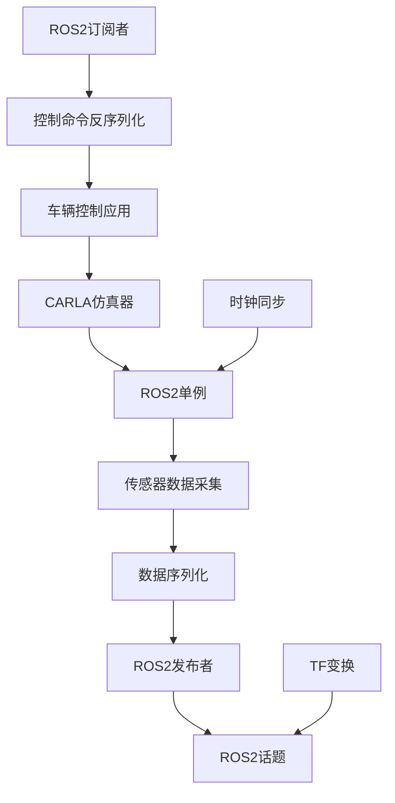

**Diagram sources**

- <a href="https://github.com/carla-simulator/carla/blob/ue5-dev/LibCarla/source/carla/ros2/ROS2.h#L47-L176" target="_blank">ROS2.h</a>
- <a href="https://github.com/carla-simulator/carla/blob/ue5-dev/LibCarla/source/carla/ros2/ROS2.cpp#L77-L800" target="_blank">ROS2.cpp</a>

## 核心类与接口

### ROS2 类

`ROS2`类是整个集成系统的核心，采用单例模式实现，负责管理所有 ROS2 通信功能。该类提供了启用/禁用 ROS2 功能、设置时间戳、管理参与者名称和处理数据流的接口。

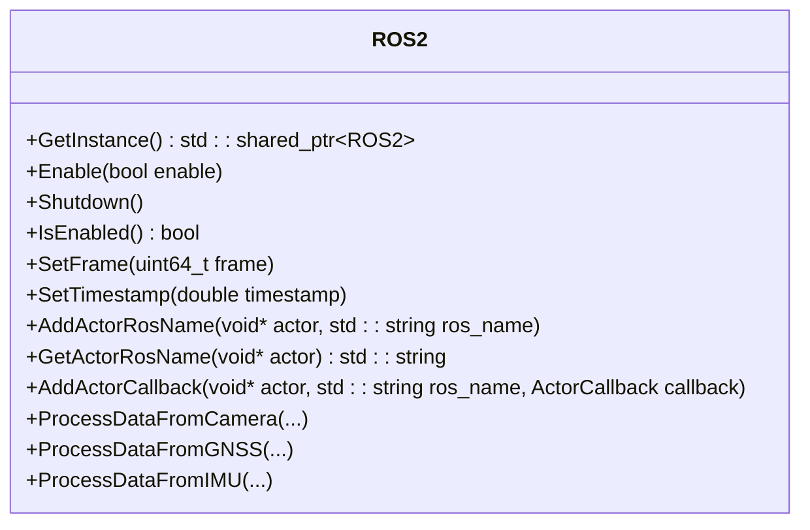

**Diagram sources**

- <a href="https://github.com/carla-simulator/carla/blob/ue5-dev/LibCarla/source/carla/ros2/ROS2.h#L47-L176" target="_blank">ROS2.h</a>

### CarlaPublisher 类

`CarlaPublisher`是所有发布者的基类，定义了通用的发布者接口和属性。它提供了 ROS2 话题名称、帧 ID 和父级名称的管理功能。

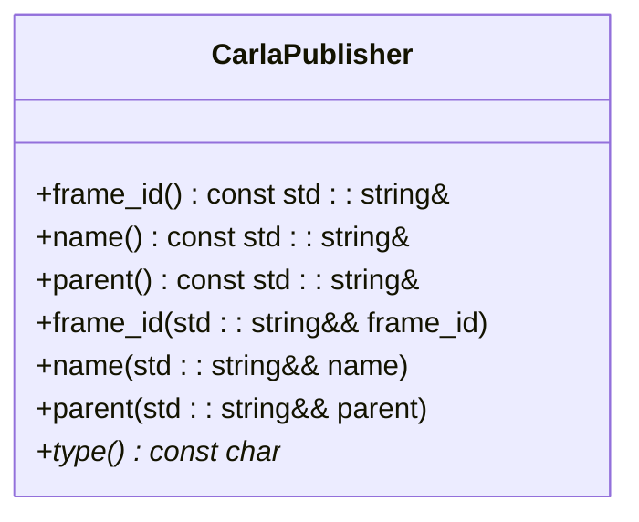

**Diagram sources**

- <a href="https://github.com/carla-simulator/carla/blob/ue5-dev/LibCarla/source/carla/ros2/publishers/CarlaPublisher.h#L12-L35" target="_blank">CarlaPublisher.h</a>

### CarlaTransformPublisher 类

`CarlaTransformPublisher`专门用于发布坐标系变换信息，继承自`CarlaPublisher`。它负责将 CARLA 中的变换数据转换为 ROS2 的 TF 消息格式。

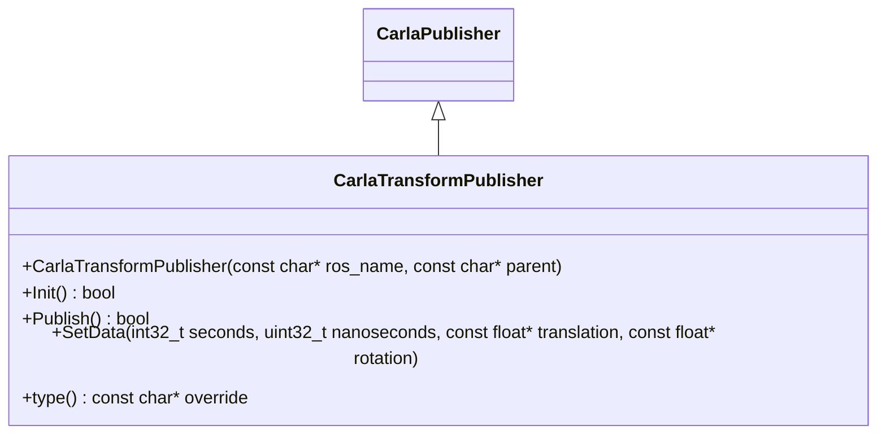

**Diagram sources**

- <a href="https://github.com/carla-simulator/carla/blob/ue5-dev/LibCarla/source/carla/ros2/publishers/CarlaTransformPublisher.h#L17-L36" target="_blank">CarlaTransformPublisher.h</a>

### CarlaSubscriber 类

`CarlaSubscriber`是所有订阅者的基类，定义了通用的订阅者接口。它提供了 ROS2 话题名称、帧 ID 和父级名称的管理功能。

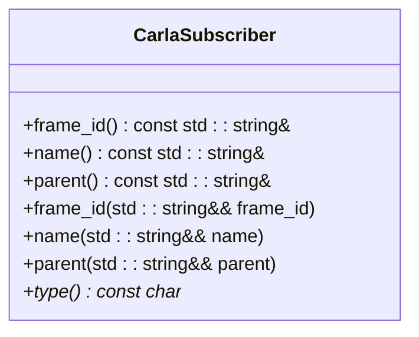

**Diagram sources**

- <a href="https://github.com/carla-simulator/carla/blob/ue5-dev/LibCarla/source/carla/ros2/subscribers/CarlaSubscriber.h#L12-L35" target="_blank">CarlaSubscriber.h</a>

### CarlaEgoVehicleControlSubscriber 类

`CarlaEgoVehicleControlSubscriber`专门用于接收车辆控制命令，继承自`CarlaSubscriber`。它将 ROS2 的车辆控制消息转换为 CARLA 可识别的控制指令。

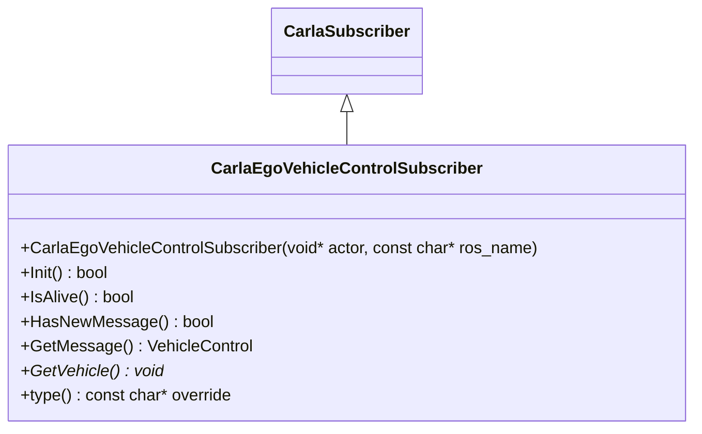

**Diagram sources**

- [CarlaEgoVehicleControlSubscriber.h](https://github.com/carla-simulator/carla/blob/ue5-dev/LibCarla/source/carla/ros2/subscribers/CarlaEgoVehicleControlSubscriber.h)

**Section sources**

- <a href="https://github.com/carla-simulator/carla/blob/ue5-dev/LibCarla/source/carla/ros2/ROS2.h#L40-L46" target="_blank">ROS2.h</a>
- <a href="https://github.com/carla-simulator/carla/blob/ue5-dev/LibCarla/source/carla/ros2/publishers/CarlaPublisher.h#L12-L35" target="_blank">CarlaPublisher.h</a>
- <a href="https://github.com/carla-simulator/carla/blob/ue5-dev/LibCarla/source/carla/ros2/publishers/CarlaTransformPublisher.h#L17-L36" target="_blank">CarlaTransformPublisher.h</a>
- <a href="https://github.com/carla-simulator/carla/blob/ue5-dev/LibCarla/source/carla/ros2/subscribers/CarlaSubscriber.h#L12-L35" target="_blank">CarlaSubscriber.h</a>

## 发布者订阅者模式

CARLA 的 ROS2 集成采用标准的发布者/订阅者模式，实现了松耦合的通信架构。该模式的核心特点包括：

- **异步通信**：发布者和订阅者无需同时在线
- **多对多通信**：一个发布者可以向多个订阅者发送数据，一个订阅者可以接收多个发布者的数据
- **基于主题的路由**：消息通过主题名称进行路由
- **服务质量(QoS)配置**：支持不同的可靠性级别和历史深度

在 CARLA 中，传感器数据作为发布者，车辆控制命令作为订阅者。每个传感器实例化一个对应的发布者对象，将采集的数据发布到指定的 ROS2 话题。同时，车辆控制订阅者监听特定话题，接收并处理控制命令。

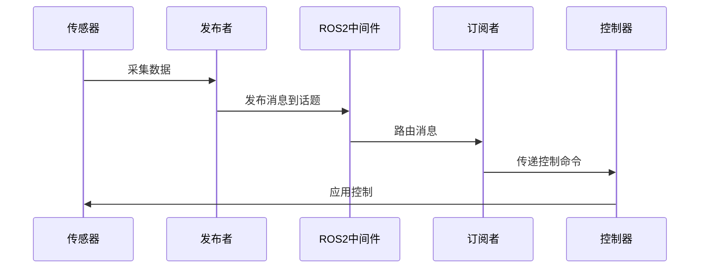

**Diagram sources**

- <a href="https://github.com/carla-simulator/carla/blob/ue5-dev/LibCarla/source/carla/ros2/ROS2.cpp#L524-L800" target="_blank">ROS2.cpp</a>
- <a href="https://github.com/carla-simulator/carla/blob/ue5-dev/LibCarla/source/carla/ros2/ROS2.h#L86-L147" target="_blank">ROS2.h</a>

## 支持的 ROS2 消息类型

CARLA 支持多种标准的 ROS2 消息类型，涵盖了传感器数据、车辆状态和环境信息。所有消息类型定义在`types`目录中，基于 ROS2 IDL 文件生成。

### 传感器数据消息

| 消息类型            | 对应 CARLA 传感器    | ROS2 消息包 | 用途         |
| ------------------- | -------------------- | ----------- | ------------ |
| Image               | RGB 相机、深度相机等 | sensor_msgs | 图像数据     |
| PointCloud2         | 激光雷达             | sensor_msgs | 点云数据     |
| Imu                 | IMU 传感器           | sensor_msgs | 惯性测量数据 |
| NavSatFix           | GNSS 传感器          | sensor_msgs | GPS 位置数据 |
| CameraInfo          | 相机传感器           | sensor_msgs | 相机内参     |
| CarlaCollisionEvent | 碰撞传感器           | carla_msgs  | 碰撞事件     |
| CarlaLineInvasion   | 车道入侵传感器       | carla_msgs  | 车道入侵事件 |

### 车辆控制消息

| 消息类型               | 字段              | 类型  | 描述     |
| ---------------------- | ----------------- | ----- | -------- |
| CarlaEgoVehicleControl | throttle          | float | 油门     |
|                        | steer             | float | 转向     |
|                        | brake             | float | 刹车     |
|                        | hand_brake        | bool  | 手刹     |
|                        | reverse           | bool  | 倒车     |
|                        | gear              | int32 | 档位     |
|                        | manual_gear_shift | bool  | 手动换挡 |

### 环境状态消息

| 消息类型  | 用途         |
| --------- | ------------ |
| Clock     | 全局时钟同步 |
| TFMessage | 坐标系变换   |
| Odometry  | 车辆里程计   |

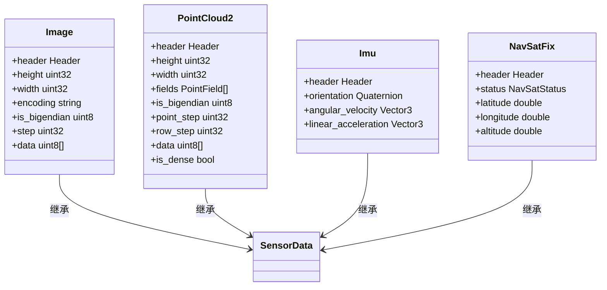

**Diagram sources**

- [Image.h](https://github.com/carla-simulator/carla/blob/ue5-dev/LibCarla/source/carla/ros2/types/Image.h)
- [PointCloud2.h](https://github.com/carla-simulator/carla/blob/ue5-dev/LibCarla/source/carla/ros2/types/PointCloud2.h)
- [Imu.h](https://github.com/carla-simulator/carla/blob/ue5-dev/LibCarla/source/carla/ros2/types/Imu.h)
- [NavSatFix.h](https://github.com/carla-simulator/carla/blob/ue5-dev/LibCarla/source/carla/ros2/types/NavSatFix.h)

**Section sources**

- [types 目录](https://github.com/carla-simulator/carla/blob/ue5-dev/LibCarla/source/carla/ros2/types/)

## 数据映射与转换

### 坐标系转换

CARLA 使用左手坐标系，而 ROS2 使用右手坐标系，因此需要进行坐标系转换。转换规则如下：

- X 轴：CARLA 的 X 轴对应 ROS2 的 X 轴
- Y 轴：CARLA 的 Y 轴对应 ROS2 的-Y 轴
- Z 轴：CARLA 的 Z 轴对应 ROS2 的 Z 轴

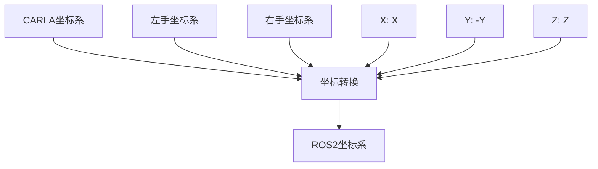

### 时间同步

CARLA 仿真时间与 ROS2 时间系统通过`Clock`消息进行同步。时间戳由 CARLA 的仿真时间生成，转换为 ROS2 的`builtin_interfaces::msg::Time`格式。

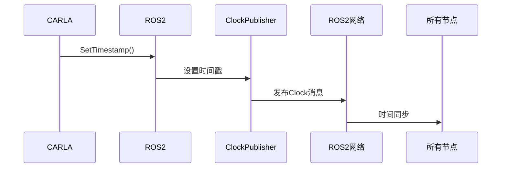

### QoS 配置

CARLA 的 ROS2 集成支持可配置的 QoS（服务质量）参数，包括：

- **可靠性**：可靠模式或尽力而为模式
- **历史深度**：保留的消息数量
- **持久性**：消息的持久化策略
- **生命周期**：实体的生命周期管理

默认配置为可靠模式，确保关键传感器数据的可靠传输。

**Section sources**

- <a href="https://github.com/carla-simulator/carla/blob/ue5-dev/LibCarla/source/carla/ros2/ROS2.cpp#L125-L137" target="_blank">ROS2.cpp</a>
- [Clock.h](https://github.com/carla-simulator/carla/blob/ue5-dev/LibCarla/source/carla/ros2/types/Clock.h)

## 实时数据流处理

### 数据流架构

CARLA 的实时数据流处理架构采用事件驱动模式，确保低延迟和高吞吐量。数据流从传感器采集开始，经过序列化、发布，最终到达订阅者。

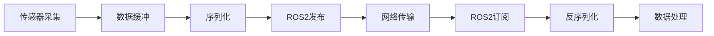

### 事件驱动通信

CARLA 使用事件驱动机制处理 ROS2 通信，主要事件包括：

- **帧更新事件**：每帧调用`SetFrame`更新帧计数
- **时间更新事件**：每帧调用`SetTimestamp`更新时间戳
- **数据到达事件**：传感器数据到达时触发处理
- **控制命令事件**：接收到控制命令时触发应用

事件处理在`ROS2::SetFrame`方法中实现，该方法检查是否有新的控制命令到达，并调用相应的回调函数。

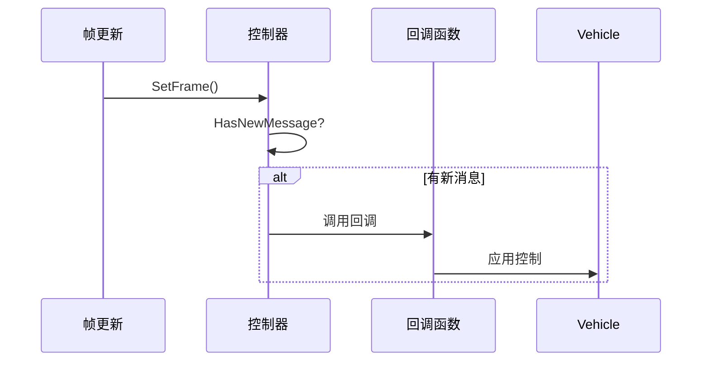

**Section sources**

- <a href="https://github.com/carla-simulator/carla/blob/ue5-dev/LibCarla/source/carla/ros2/ROS2.cpp#L87-L137" target="_blank">ROS2.cpp</a>
- <a href="https://github.com/carla-simulator/carla/blob/ue5-dev/LibCarla/source/carla/ros2/ROS2CallbackData.h#L15-L39" target="_blank">ROS2CallbackData.h</a>

## 实战指南

### FastRTPS 配置

FastRTPS 是 ROS2 的默认 DDS 实现，可以通过配置文件优化性能。在`PythonAPI/examples/ros2/config/fastrtps-profile.xml`中提供了示例配置。

关键配置参数：

- **传输协议**：UDPv4 或共享内存
- **消息大小**：根据传感器数据大小调整
- **线程优先级**：提高关键线程的优先级
- **内存管理**：优化内存分配策略

### RViz 集成

RViz 是 ROS2 的可视化工具，可以实时显示 CARLA 仿真数据。通过加载`PythonAPI/examples/ros2/rviz/ros2_native.rviz`配置文件，可以快速设置可视化界面。

支持的可视化功能：

- 3D 场景渲染
- 传感器数据叠加
- 车辆轨迹显示
- TF 坐标系可视化
- 点云数据显示

### Python 示例

`PythonAPI/examples/ros2/ros2_native.py`提供了完整的 ROS2 集成示例，展示了如何配置和使用 CARLA 的 ROS2 功能。

主要步骤：

1. 创建客户端连接
2. 设置同步模式
3. 配置交通管理器
4. 加载配置文件
5. 生成车辆和传感器
6. 启动仿真循环

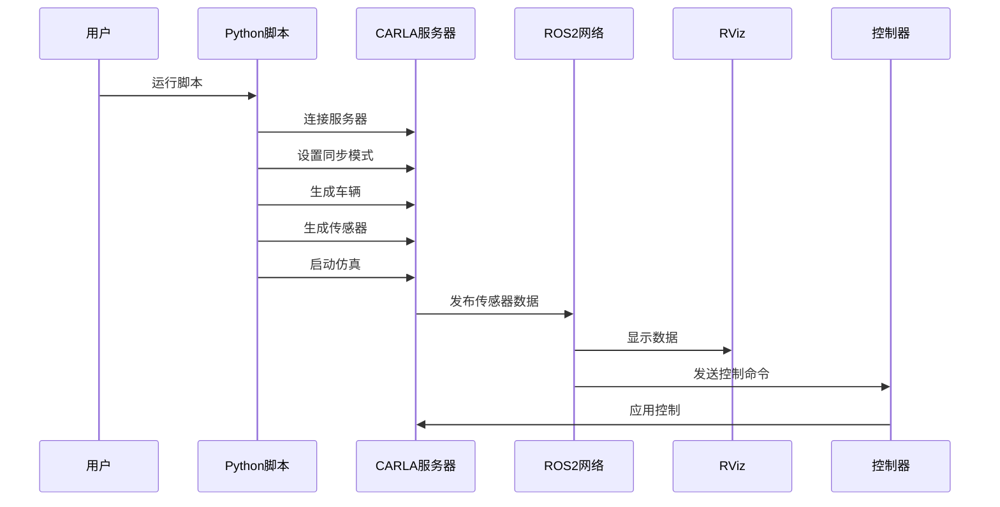

**Diagram sources**

- <a href="https://github.com/carla-simulator/carla/blob/ue5-dev/PythonAPI/examples/ros2/ros2_native.py#L1-L132" target="_blank">ros2_native.py</a>
- [fastrtps-profile.xml](https://github.com/carla-simulator/carla/blob/ue5-dev/PythonAPI/examples/ros2/config/fastrtps-profile.xml)
- [ros2_native.rviz](https://github.com/carla-simulator/carla/blob/ue5-dev/PythonAPI/examples/ros2/rviz/ros2_native.rviz)

**Section sources**

- <a href="https://github.com/carla-simulator/carla/blob/ue5-dev/PythonAPI/examples/ros2/ros2_native.py#L1-L132" target="_blank">ros2_native.py</a>

## 初学者示例

### 里程计发布示例

以下是一个简单的里程计发布示例，展示如何从 CARLA 获取车辆状态并发布为 ROS2 的 Odometry 消息：

1. 启用 ROS2 功能
2. 获取车辆 Actor
3. 设置 ROS 名称
4. 启动仿真循环
5. 每帧发布里程计数据

关键代码路径：

- `ROS2::Enable(true)`
- `Actor::SetAttribute("ros_name", "ego_vehicle")`
- `ROS2::SetFrame(frame_count)`
- `ROS2::SetTimestamp(simulation_time)`

该示例可以帮助初学者理解 CARLA 与 ROS2 的基本集成流程。

**Section sources**

- <a href="https://github.com/carla-simulator/carla/blob/ue5-dev/LibCarla/source/carla/ros2/ROS2.h#L60-L65" target="_blank">ROS2.h</a>
- <a href="https://github.com/carla-simulator/carla/blob/ue5-dev/PythonAPI/examples/ros2/ros2_native.py#L66-L102" target="_blank">ros2_native.py</a>

## 高级配置

### 多机器人仿真

CARLA 支持多机器人仿真，每个机器人可以独立配置 ROS2 通信。关键配置包括：

- **命名空间隔离**：为每个机器人设置独立的 ROS 命名空间
- **话题前缀**：使用不同的话题前缀区分机器人
- **TF 树管理**：维护独立的坐标系变换树
- **资源分配**：合理分配计算资源

多机器人仿真需要特别注意网络带宽和计算负载，建议使用高性能硬件和优化的 DDS 配置。

### DDS 安全配置

DDS 安全配置提供了通信的机密性、完整性和认证。主要安全特性包括：

- **身份认证**：验证参与者身份
- **访问控制**：限制参与者权限
- **加密通信**：保护数据机密性
- **完整性保护**：防止数据篡改

安全配置需要生成和管理密钥、证书和策略文件，建议在生产环境中启用。

**Section sources**

- <a href="https://github.com/carla-simulator/carla/blob/ue5-dev/LibCarla/source/carla/ros2/ROS2.h#L67-L73" target="_blank">ROS2.h</a>
- <a href="https://github.com/carla-simulator/carla/blob/ue5-dev/LibCarla/source/carla/ros2/ROS2.cpp#L139-L201" target="_blank">ROS2.cpp</a>
