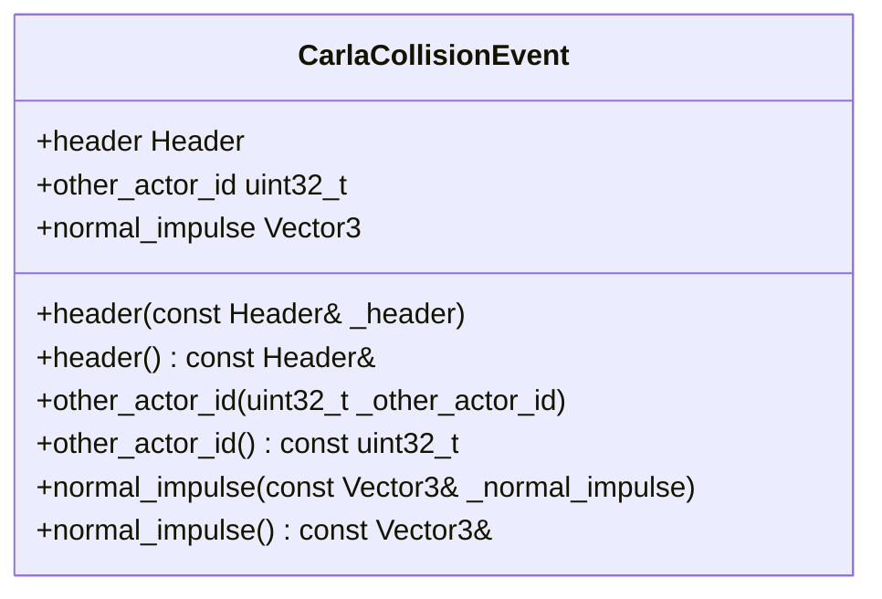
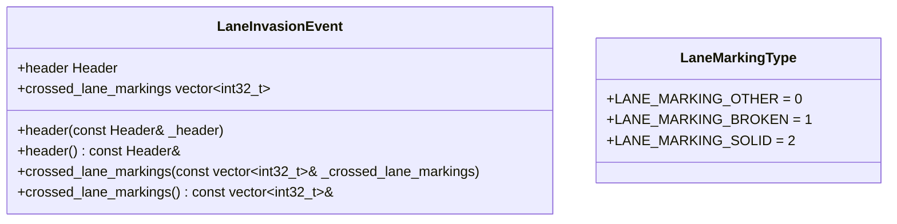
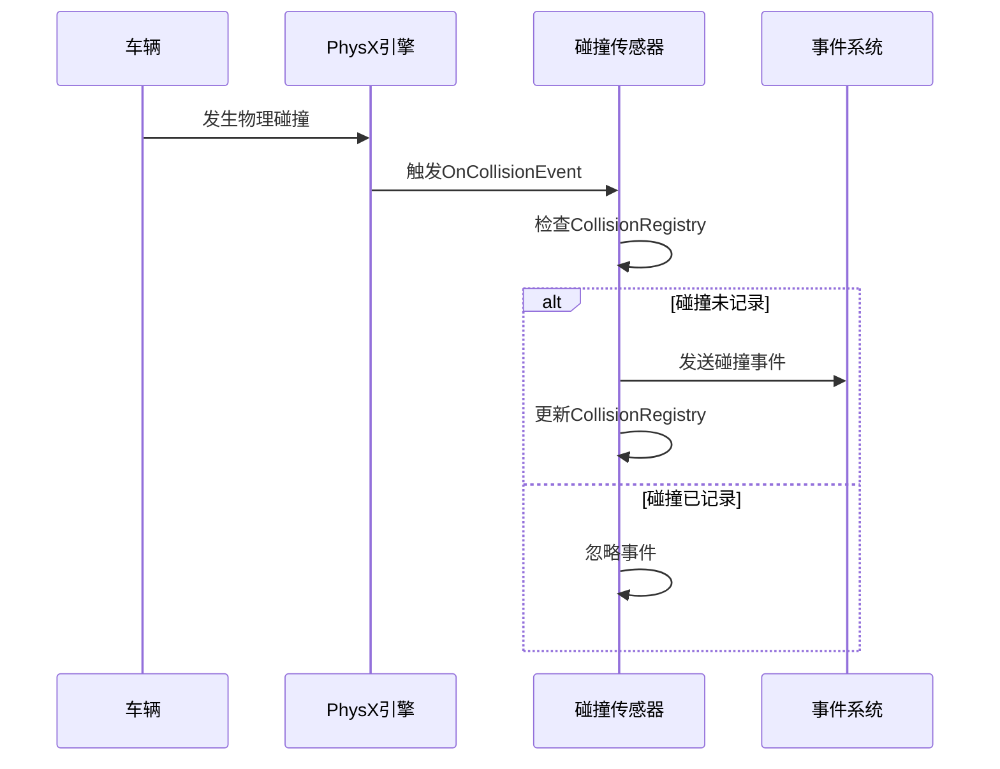
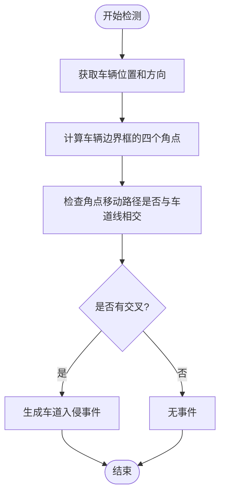
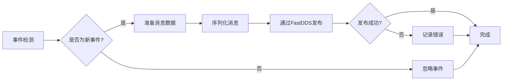

# 事件检测消息

> **引用文件**
> **本文档引用的文件**

- [CarlaCollisionEvent.h](https://github.com/carla-simulator/carla/blob/ue5-dev/LibCarla/source/carla/ros2/types/CarlaCollisionEvent.h)
- [CarlaCollisionEvent.cpp](https://github.com/carla-simulator/carla/blob/ue5-dev/LibCarla/source/carla/ros2/types/CarlaCollisionEvent.cpp)
- [CarlaLineInvasion.h](https://github.com/carla-simulator/carla/blob/ue5-dev/LibCarla/source/carla/ros2/types/CarlaLineInvasion.h)
- [CarlaLineInvasion.cpp](https://github.com/carla-simulator/carla/blob/ue5-dev/LibCarla/source/carla/ros2/types/CarlaLineInvasion.cpp)
- [CollisionSensor.cpp](https://github.com/carla-simulator/carla/blob/ue5-dev/Unreal/CarlaUnreal/Plugins/Carla/Source/Carla/Sensor/CollisionSensor.cpp)
- [LaneInvasionSensor.cpp](https://github.com/carla-simulator/carla/blob/ue5-dev/LibCarla/source/carla/client/LaneInvasionSensor.cpp)
- [CollisionEvent.h](https://github.com/carla-simulator/carla/blob/ue5-dev/LibCarla/source/carla/sensor/data/CollisionEvent.h)
- [LaneInvasionEvent.h](https://github.com/carla-simulator/carla/blob/ue5-dev/LibCarla/source/carla/sensor/data/LaneInvasionEvent.h)

## 目录

1. [引言](#引言)
2. [碰撞事件消息](#碰撞事件消息)
3. [车道入侵事件消息](#车道入侵事件消息)
4. [事件检测机制](#事件检测机制)
5. [消息发布策略](#消息发布策略)
6. [应用场景示例](#应用场景示例)
7. [结论](#结论)

## 引言

本文档详细描述 CARLA 仿真平台中的事件检测消息系统，重点介绍碰撞检测和车道入侵两类核心事件消息。文档将深入分析 CarlaCollisionEvent 和 CarlaLineInvasion 消息的结构、字段含义、数据类型以及事件的触发和发布机制。通过理解这些事件消息，开发者可以构建更安全的自动驾驶系统，实现紧急制动、驾驶员提醒等关键功能。

## 碰撞事件消息

CarlaCollisionEvent 消息用于报告车辆与其他物体发生碰撞的事件。该消息包含碰撞对象、碰撞位置和碰撞力度等关键信息，为自动驾驶系统提供重要的安全反馈。

### 消息结构与字段

CarlaCollisionEvent 消息定义在`CarlaCollisionEvent.h`文件中，其主要字段包括：

- **header**: 消息头，包含时间戳和帧信息，数据类型为`std_msgs::msg::Header`。
- **other_actor_id**: 碰撞对象的唯一标识符，数据类型为`uint32_t`，表示与主车辆发生碰撞的其他实体（如行人、其他车辆等）。
- **normal_impulse**: 碰撞的法向冲量，数据类型为`geometry_msgs::msg::Vector3`，表示碰撞瞬间的力向量，单位为牛顿秒（N·s）。



**图表来源**

- [CarlaCollisionEvent.h](https://github.com/carla-simulator/carla/blob/ue5-dev/LibCarla/source/carla/ros2/types/CarlaCollisionEvent.h)

**本节来源**

- [CarlaCollisionEvent.h](https://github.com/carla-simulator/carla/blob/ue5-dev/LibCarla/source/carla/ros2/types/CarlaCollisionEvent.h)
- [CarlaCollisionEvent.cpp](https://github.com/carla-simulator/carla/blob/ue5-dev/LibCarla/source/carla/ros2/types/CarlaCollisionEvent.cpp)

## 车道入侵事件消息

CarlaLineInvasion 消息用于报告车辆跨越车道线的事件。该消息包含车道标记类型和入侵程度等参数，帮助系统判断车辆是否偏离了正常行驶车道。

### 消息结构与字段

CarlaLineInvasion 消息定义在`CarlaLineInvasion.h`文件中，其主要字段包括：

- **header**: 消息头，包含时间戳和帧信息，数据类型为`std_msgs::msg::Header`。
- **crossed_lane_markings**: 被跨越的车道线标记类型列表，数据类型为`std::vector<int32_t>`，其中每个值代表一种车道线类型：
  - `LANE_MARKING_OTHER` (0): 其他类型
  - `LANE_MARKING_BROKEN` (1): 虚线
  - `LANE_MARKING_SOLID` (2): 实线



**图表来源**

- [CarlaLineInvasion.h](https://github.com/carla-simulator/carla/blob/ue5-dev/LibCarla/source/carla/ros2/types/CarlaLineInvasion.h)

**本节来源**

- [CarlaLineInvasion.h](https://github.com/carla-simulator/carla/blob/ue5-dev/LibCarla/source/carla/ros2/types/CarlaLineInvasion.h)
- [CarlaLineInvasion.cpp](https://github.com/carla-simulator/carla/blob/ue5-dev/LibCarla/source/carla/ros2/types/CarlaLineInvasion.cpp)

## 事件检测机制

事件检测机制是 CARLA 仿真平台的核心功能之一，负责实时监控车辆状态并触发相应的事件消息。碰撞检测和车道入侵检测分别通过不同的传感器和算法实现。

### 碰撞检测机制

碰撞检测通过`CollisionSensor`实现，该传感器注册到车辆的物理碰撞事件上。当车辆与其他物体发生碰撞时，PhysX 物理引擎会触发`OnCollisionEvent`回调函数。该函数会计算碰撞的法向冲量，并通过数据流发送碰撞事件。

为了防止同一碰撞事件在单帧内被重复触发，系统使用`CollisionRegistry`来记录当前帧内已处理的碰撞。每次检测到碰撞时，系统会检查该碰撞是否已在当前帧中记录，如果已记录则忽略该事件。



**图表来源**

- [CollisionSensor.cpp](https://github.com/carla-simulator/carla/blob/ue5-dev/Unreal/CarlaUnreal/Plugins/Carla/Source/Carla/Sensor/CollisionSensor.cpp)

**本节来源**

- [CollisionSensor.cpp](https://github.com/carla-simulator/carla/blob/ue5-dev/Unreal/CarlaUnreal/Plugins/Carla/Source/Carla/Sensor/CollisionSensor.cpp)
- [CollisionEvent.h](https://github.com/carla-simulator/carla/blob/ue5-dev/LibCarla/source/carla/sensor/data/CollisionEvent.h)

### 车道入侵检测机制

车道入侵检测通过`LaneInvasionSensor`实现，该传感器在每个仿真周期检查车辆是否跨越了车道线。系统通过计算车辆边界框的四个角点在前后两帧之间的移动轨迹，来判断是否与车道线相交。

检测算法首先获取车辆当前的变换矩阵和边界框，然后计算四个角点的位置。通过调用地图的`CalculateCrossedLanes`方法，系统可以确定这些角点的移动路径是否与任何车道线相交。如果检测到交叉，则生成车道入侵事件。



**图表来源**

- [LaneInvasionSensor.cpp](https://github.com/carla-simulator/carla/blob/ue5-dev/LibCarla/source/carla/client/LaneInvasionSensor.cpp)

**本节来源**

- [LaneInvasionSensor.cpp](https://github.com/carla-simulator/carla/blob/ue5-dev/LibCarla/source/carla/client/LaneInvasionSensor.cpp)
- [LaneInvasionEvent.h](https://github.com/carla-simulator/carla/blob/ue5-dev/LibCarla/source/carla/sensor/data/LaneInvasionEvent.h)

## 消息发布策略

CARLA 平台采用高效的消息发布策略，确保事件消息能够及时、准确地传递给订阅者，同时避免消息过载和重复。

### 事件去重机制

为了防止在单个仿真帧内产生重复的事件消息，系统实现了多种去重机制：

1. **碰撞事件去重**: `CollisionSensor`使用`CollisionRegistry`存储当前帧内已处理的碰撞事件。每次检测到碰撞时，系统会检查该碰撞（由帧号、主车辆和碰撞对象唯一确定）是否已在注册表中，如果存在则忽略该事件。

2. **车道入侵事件去重**: `LaneInvasionCallback`使用`_bounds`存储前一帧的车辆边界框。系统会检查当前帧与前一帧之间的距离变化，如果变化过小则认为车辆没有显著移动，从而避免生成重复的入侵事件。

### 频率控制

事件消息的发布频率受到仿真帧率的控制。由于事件检测在每个仿真周期执行，因此消息的发布频率与仿真步长直接相关。用户可以通过调整仿真步长来控制事件检测的频率。

对于 ROS2 发布，系统使用 FastDDS 作为通信中间件，通过`CarlaCollisionEventPublisher`和`CarlaLineInvasionPublisher`类实现消息发布。发布者会检查写入操作的返回码，确保消息成功发布。



**图表来源**

- [CollisionSensor.cpp](https://github.com/carla-simulator/carla/blob/ue5-dev/Unreal/CarlaUnreal/Plugins/Carla/Source/Carla/Sensor/CollisionSensor.cpp)
- [CarlaLineInvasionPublisher.cpp](https://github.com/carla-simulator/carla/blob/ue5-dev/LibCarla/source/carla/ros2/publishers/CarlaLineInvasionPublisher.cpp)

**本节来源**

- [CollisionSensor.cpp](https://github.com/carla-simulator/carla/blob/ue5-dev/Unreal/CarlaUnreal/Plugins/Carla/Source/Carla/Sensor/CollisionSensor.cpp)
- [CarlaLineInvasionPublisher.cpp](https://github.com/carla-simulator/carla/blob/ue5-dev/LibCarla/source/carla/ros2/publishers/CarlaLineInvasionPublisher.cpp)

## 应用场景示例

基于 CARLA 的事件检测消息系统，可以构建多种实际应用场景，提升自动驾驶系统的安全性和智能化水平。

### 基于碰撞消息的紧急制动系统

紧急制动系统可以订阅`CarlaCollisionEvent`消息，当检测到即将发生碰撞时立即触发制动。系统可以根据碰撞力度（法向冲量）的大小来决定制动的强度：

- **轻度碰撞**: 减速至安全速度
- **中度碰撞**: 紧急制动
- **重度碰撞**: 启动碰撞规避程序

```python
def on_collision(event):
    impulse = event.normal_impulse
    intensity = math.sqrt(impulse.x**2 + impulse.y**2 + impulse.z**2)

    if intensity > HIGH_THRESHOLD:
        # 重度碰撞，紧急制动
        vehicle.apply_control(carla.VehicleControl(hand_brake=True))
    elif intensity > MEDIUM_THRESHOLD:
        # 中度碰撞，减速
        vehicle.apply_control(carla.VehicleControl(brake=0.8))
    else:
        # 轻度碰撞，轻微减速
        vehicle.apply_control(carla.VehicleControl(brake=0.3))
```

### 基于车道入侵的驾驶员提醒系统

车道入侵提醒系统可以订阅`CarlaLineInvasion`消息，当车辆跨越车道线时向驾驶员发出警告。系统可以根据车道线类型采取不同的提醒策略：

- **虚线**: 视为正常变道，不提醒或轻微提醒
- **实线**: 视为违规，发出强烈警告
- **双实线**: 视为严重违规，立即警告并记录

```python
def on_lane_invasion(event):
    for marking in event.crossed_lane_markings:
        if marking == LANE_MARKING_SOLID:
            # 跨越实线，发出警告
            hud.display_warning("禁止变道！")
            play_alert_sound()
        elif marking == LANE_MARKING_BROKEN:
            # 跨越虚线，记录变道
            log_lane_change()
```

**本节来源**

- [manual_control.py](https://github.com/carla-simulator/carla/blob/ue5-dev/PythonAPI/examples/manual_control.py)
- [automatic_control.py](https://github.com/carla-simulator/carla/blob/ue5-dev/PythonAPI/examples/automatic_control.py)

## 结论

CARLA 平台的事件检测消息系统为自动驾驶仿真提供了强大的安全保障功能。通过详细的碰撞和车道入侵事件消息，开发者可以构建更加智能和安全的驾驶辅助系统。系统的事件去重和频率控制机制确保了消息的高效传递，避免了不必要的资源消耗。未来可以进一步优化事件检测算法，提高检测精度和响应速度，为自动驾驶技术的发展提供更可靠的支持。
