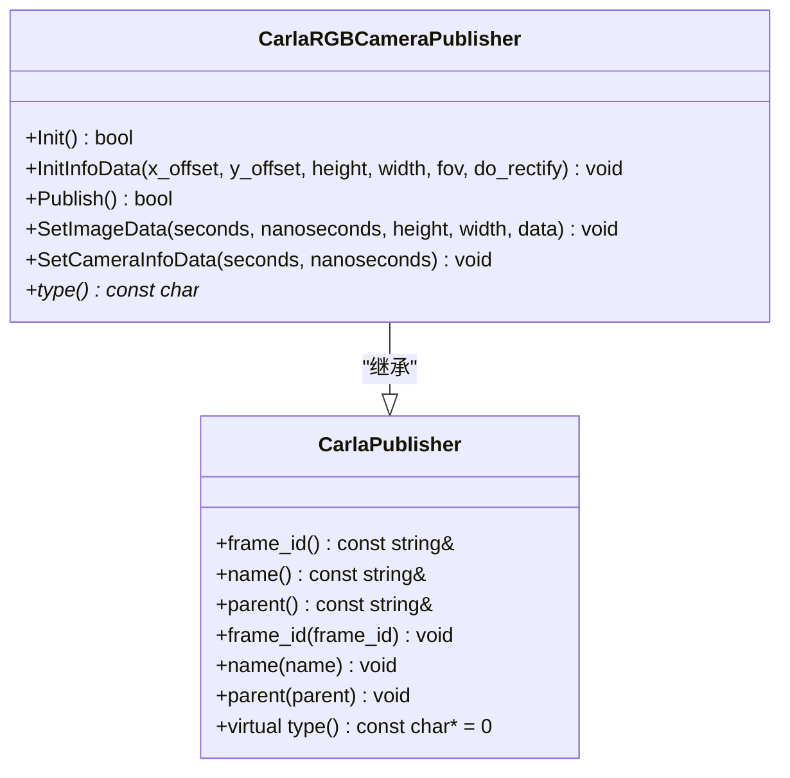
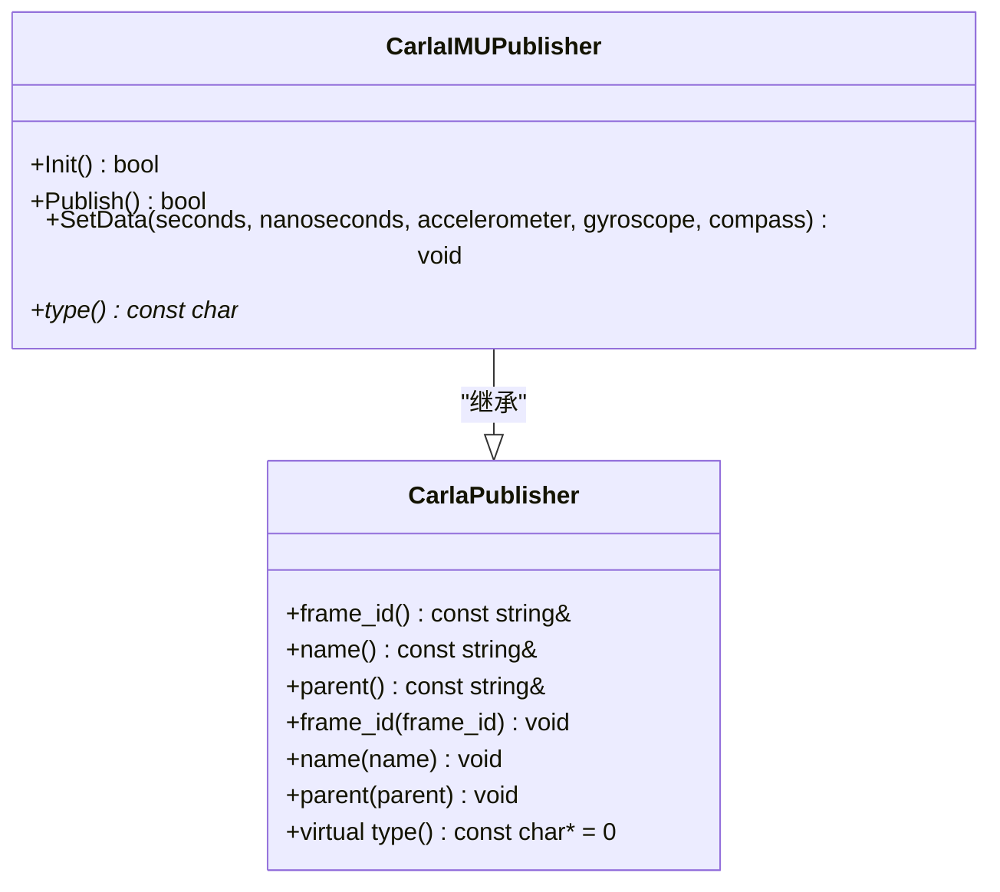
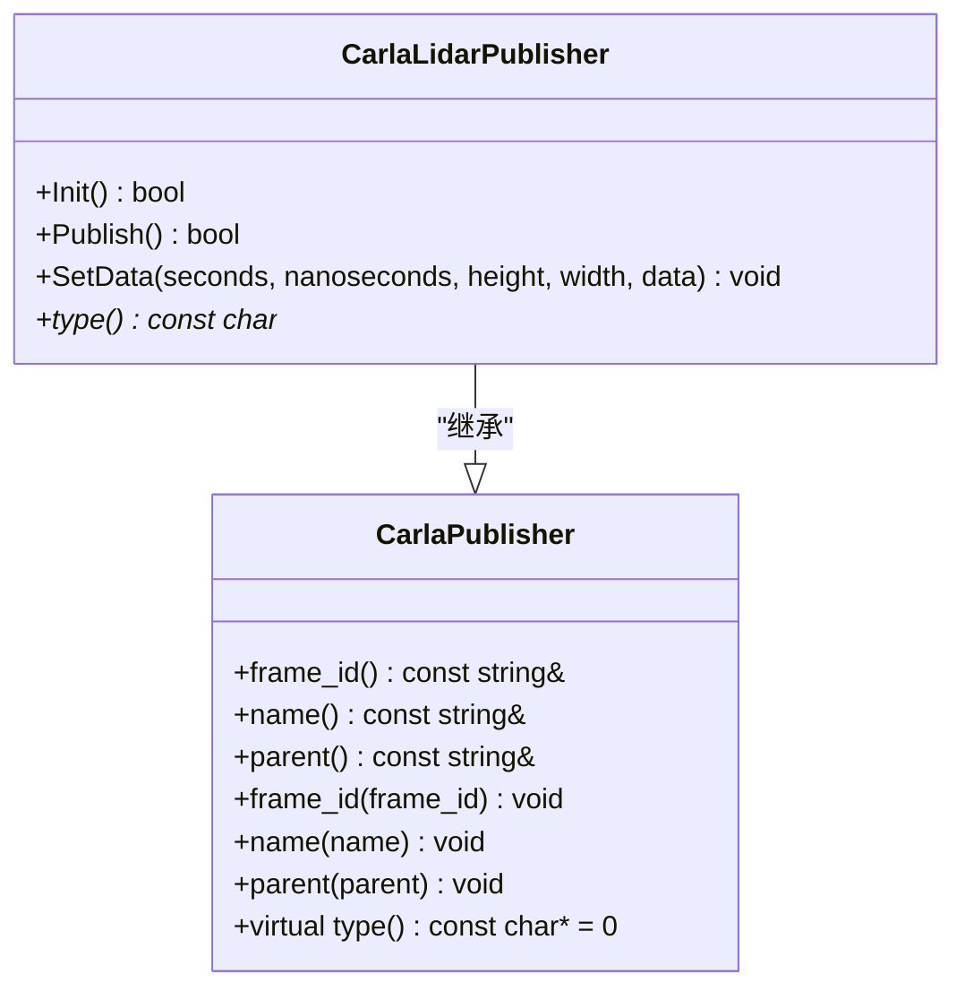
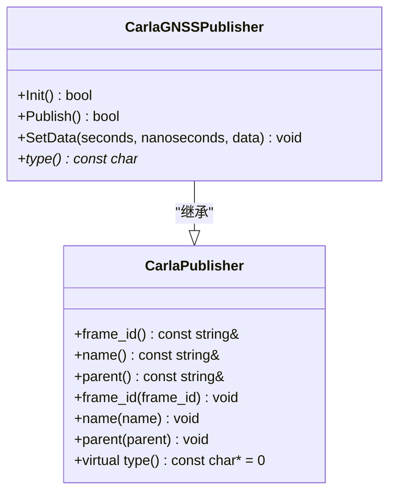
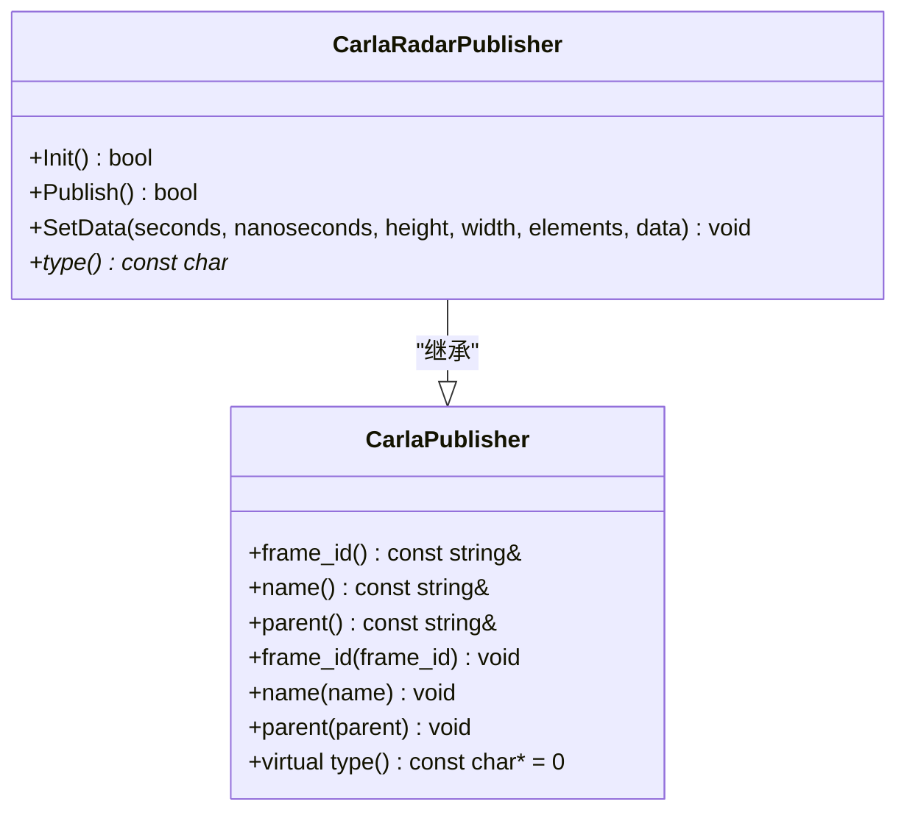
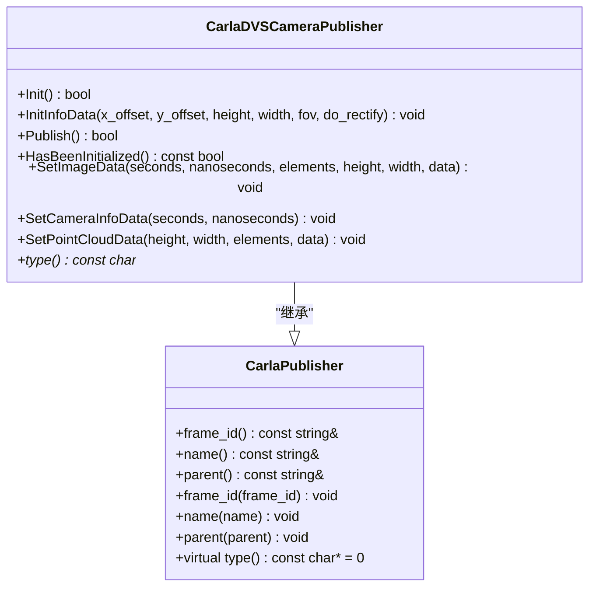
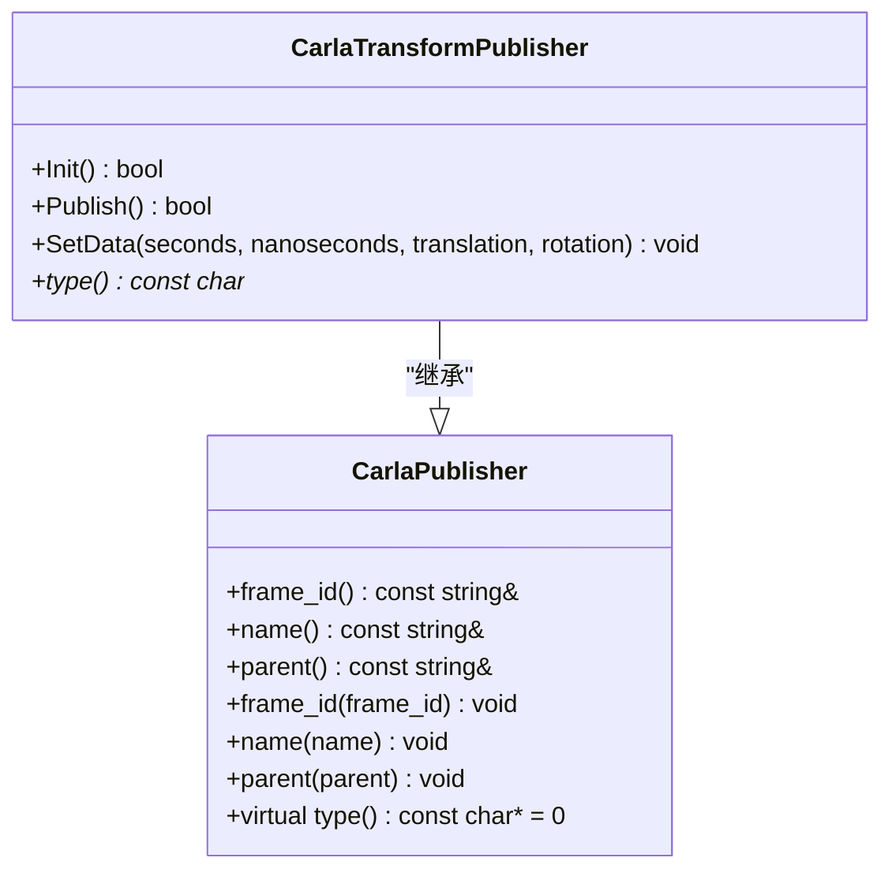
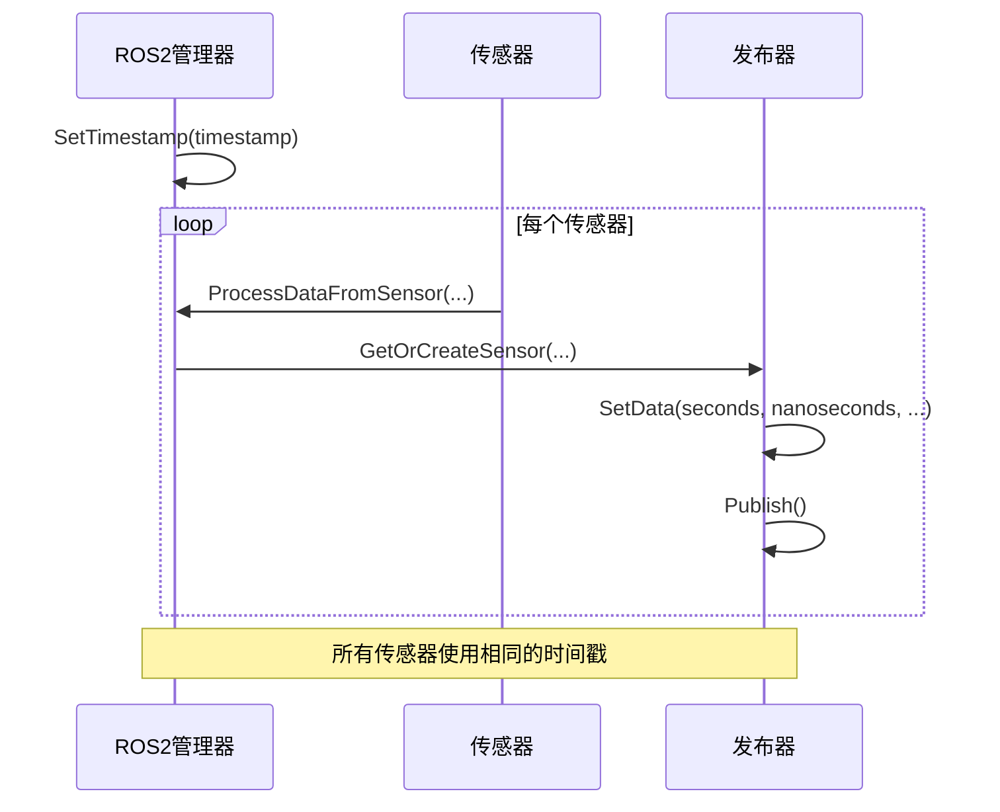
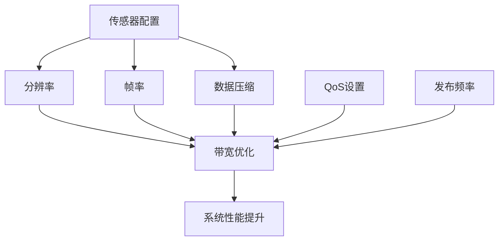

# 传感器数据消息

> **引用文件**
> **本文档中引用的文件**

- [ROS2.h](https://github.com/carla-simulator/carla/blob/ue5-dev/LibCarla/source/carla/ros2/ROS2.h)
- [ROS2.cpp](https://github.com/carla-simulator/carla/blob/ue5-dev/LibCarla/source/carla/ros2/ROS2.cpp)
- [CarlaRGBCameraPublisher.h](https://github.com/carla-simulator/carla/blob/ue5-dev/LibCarla/source/carla/ros2/publishers/CarlaRGBCameraPublisher.h)
- [CarlaIMUPublisher.h](https://github.com/carla-simulator/carla/blob/ue5-dev/LibCarla/source/carla/ros2/publishers/CarlaIMUPublisher.h)
- [CarlaLidarPublisher.h](https://github.com/carla-simulator/carla/blob/ue5-dev/LibCarla/source/carla/ros2/publishers/CarlaLidarPublisher.h)
- [CarlaGNSSPublisher.h](https://github.com/carla-simulator/carla/blob/ue5-dev/LibCarla/source/carla/ros2/publishers/CarlaGNSSPublisher.h)
- [CarlaTransformPublisher.h](https://github.com/carla-simulator/carla/blob/ue5-dev/LibCarla/source/carla/ros2/publishers/CarlaTransformPublisher.h)
- [CarlaCollisionPublisher.h](https://github.com/carla-simulator/carla/blob/ue5-dev/LibCarla/source/carla/ros2/publishers/CarlaCollisionPublisher.h)
- [CarlaRadarPublisher.h](https://github.com/carla-simulator/carla/blob/ue5-dev/LibCarla/source/carla/ros2/publishers/CarlaRadarPublisher.h)
- [CarlaDVSCameraPublisher.h](https://github.com/carla-simulator/carla/blob/ue5-dev/LibCarla/source/carla/ros2/publishers/CarlaDVSCameraPublisher.h)

## 目录

1. [引言](#引言)
2. [核心传感器消息格式](#核心传感器消息格式)
3. [坐标系转换与时间戳同步](#坐标系转换与时间戳同步)
4. [发布频率与带宽需求](#发布频率与带宽需求)
5. [实际消息示例](#实际消息示例)
6. [结论](#结论)

## 引言

本文档系统化描述 CARLA 仿真平台中各类传感器的 ROS2 消息格式。文档详细说明了摄像头、IMU、激光雷达、GNSS、雷达、DVS 相机等传感器的数据字段、采样频率、坐标系定义和时间戳同步机制。特别关注传感器数据从 Unreal Engine 4 坐标系到 ROS 标准坐标系的转换过程，以及不同类型传感器消息的发布频率和带宽需求，为系统性能优化提供指导。

## 核心传感器消息格式

### 摄像头传感器

CARLA 中的摄像头传感器（包括 RGB、深度、法线、语义分割等）通过`CarlaRGBCameraPublisher`类发布 ROS2 消息。摄像头数据包含图像数据和相机信息两部分。

图像消息包含时间戳、高度、宽度和图像数据，其中图像数据以 uint8 数组形式传输。相机信息消息包含相机内参（焦距、主点偏移等）和外参信息，遵循 ROS 的`sensor_msgs/CameraInfo`标准。



**图示来源**

- <a href="https://github.com/carla-simulator/carla/blob/ue5-dev/LibCarla/source/carla/ros2/publishers/CarlaRGBCameraPublisher.h#L18-L51" target="_blank">CarlaRGBCameraPublisher.h</a>
- <a href="https://github.com/carla-simulator/carla/blob/ue5-dev/LibCarla/source/carla/ros2/publishers/CarlaPublisher.h#L12-L35" target="_blank">CarlaPublisher.h</a>

### IMU 传感器

IMU 传感器通过`CarlaIMUPublisher`类发布消息，包含加速度计、陀螺仪和磁力计数据。IMU 消息遵循 ROS 的`sensor_msgs/Imu`标准格式。

IMU 数据包含线性加速度（x, y, z 轴）、角速度（x, y, z 轴）和方向信息。加速度和角速度数据以 float 数组形式传输，时间戳以秒和纳秒的整数形式表示。



**图示来源**

- <a href="https://github.com/carla-simulator/carla/blob/ue5-dev/LibCarla/source/carla/ros2/publishers/CarlaIMUPublisher.h#L16-L35" target="_blank">CarlaIMUPublisher.h</a>
- <a href="https://github.com/carla-simulator/carla/blob/ue5-dev/LibCarla/source/carla/ros2/publishers/CarlaPublisher.h#L12-L35" target="_blank">CarlaPublisher.h</a>

### 激光雷达传感器

激光雷达传感器通过`CarlaLidarPublisher`类发布消息，包含点云数据。激光雷达消息遵循 ROS 的`sensor_msgs/PointCloud2`标准格式。

点云数据包含高度、宽度和点数据，其中点数据以 float 数组形式传输，每个点包含 x, y, z 坐标。激光雷达支持标准激光雷达和语义激光雷达两种类型。



**图示来源**

- <a href="https://github.com/carla-simulator/carla/blob/ue5-dev/LibCarla/source/carla/ros2/publishers/CarlaLidarPublisher.h#L17-L39" target="_blank">CarlaLidarPublisher.h</a>
- <a href="https://github.com/carla-simulator/carla/blob/ue5-dev/LibCarla/source/carla/ros2/publishers/CarlaPublisher.h#L12-L35" target="_blank">CarlaPublisher.h</a>

### GNSS 传感器

GNSS 传感器通过`CarlaGNSSPublisher`类发布消息，包含地理定位数据。GNSS 消息遵循 ROS 的`sensor_msgs/NavSatFix`标准格式。

GNSS 数据包含纬度、经度和海拔高度，以 double 类型数组形式传输。时间戳以秒和纳秒的整数形式表示。



**图示来源**

- <a href="https://github.com/carla-simulator/carla/blob/ue5-dev/LibCarla/source/carla/ros2/publishers/CarlaGNSSPublisher.h#L16-L35" target="_blank">CarlaGNSSPublisher.h</a>
- <a href="https://github.com/carla-simulator/carla/blob/ue5-dev/LibCarla/source/carla/ros2/publishers/CarlaPublisher.h#L12-L35" target="_blank">CarlaPublisher.h</a>

### 雷达传感器

雷达传感器通过`CarlaRadarPublisher`类发布消息，包含雷达检测到的目标信息。雷达消息包含高度、宽度、元素数量和数据。

雷达数据以 uint8 数组形式传输，包含检测到的目标的距离、速度、方位角和仰角信息。



**图示来源**

- <a href="https://github.com/carla-simulator/carla/blob/ue5-dev/LibCarla/source/carla/ros2/publishers/CarlaRadarPublisher.h#L17-L39" target="_blank">CarlaRadarPublisher.h</a>
- <a href="https://github.com/carla-simulator/carla/blob/ue5-dev/LibCarla/source/carla/ros2/publishers/CarlaPublisher.h#L12-L35" target="_blank">CarlaPublisher.h</a>

### DVS 相机传感器

DVS（动态视觉传感器）通过`CarlaDVSCameraPublisher`类发布消息，包含事件流数据。DVS 相机发布三种类型的消息：图像、相机信息和点云。

DVS 数据包含事件数量、高度、宽度和事件数据，其中事件数据以 uint8 数组形式传输，每个事件包含 x, y 坐标、极性和时间戳。



**图示来源**

- <a href="https://github.com/carla-simulator/carla/blob/ue5-dev/LibCarla/source/carla/ros2/publishers/CarlaDVSCameraPublisher.h#L19-L58" target="_blank">CarlaDVSCameraPublisher.h</a>
- <a href="https://github.com/carla-simulator/carla/blob/ue5-dev/LibCarla/source/carla/ros2/publishers/CarlaPublisher.h#L12-L35" target="_blank">CarlaPublisher.h</a>

### 里程计与变换传感器

变换传感器通过`CarlaTransformPublisher`类发布消息，包含传感器的位姿信息。变换消息遵循 ROS 的`geometry_msgs/TransformStamped`标准格式。

变换数据包含位置（x, y, z）和旋转（四元数），以 float 数组形式传输。时间戳以秒和纳秒的整数形式表示。



**图示来源**

- <a href="https://github.com/carla-simulator/carla/blob/ue5-dev/LibCarla/source/carla/ros2/publishers/CarlaTransformPublisher.h#L17-L36" target="_blank">CarlaTransformPublisher.h</a>
- <a href="https://github.com/carla-simulator/carla/blob/ue5-dev/LibCarla/source/carla/ros2/publishers/CarlaPublisher.h#L12-L35" target="_blank">CarlaPublisher.h</a>

## 坐标系转换与时间戳同步

### 坐标系定义

CARLA 使用 Unreal Engine 4 的坐标系，而 ROS 使用标准的右手坐标系。坐标系转换规则如下：

- UE4 坐标系：X 轴向前，Y 轴向右，Z 轴向上
- ROS 坐标系：X 轴向前，Y 轴向左，Z 轴向上

因此，从 UE4 到 ROS 的坐标系转换需要对 Y 轴进行符号反转。

```mermaid
flowchart TD
Start([UE4坐标系]) --> Conversion["坐标转换: Y = -Y"]
Conversion --> End([ROS坐标系])
Note over Start,End: UE4: X-前, Y-右, Z-上<br/>ROS: X-前, Y-左, Z-上
```

**图示来源**

- <a href="https://github.com/carla-simulator/carla/blob/ue5-dev/LibCarla/source/carla/ros2/ROS2.cpp#L746" target="_blank">ROS2.cpp</a>
- <a href="https://github.com/carla-simulator/carla/blob/ue5-dev/LibCarla/source/carla/ros2/publishers/CarlaTransformPublisher.h#L28" target="_blank">CarlaTransformPublisher.h</a>

### 时间戳同步机制

CARLA 使用高精度时间戳同步所有传感器数据。时间戳由`ROS2`类统一管理，确保所有传感器消息的时间戳一致。

时间戳以两个整数表示：秒（int32_t）和纳秒（uint32_t）。这种表示方法避免了浮点数精度问题，确保了时间同步的准确性。



**图示来源**

- <a href="https://github.com/carla-simulator/carla/blob/ue5-dev/LibCarla/source/carla/ros2/ROS2.cpp#L125-L136" target="_blank">ROS2.cpp</a>
- <a href="https://github.com/carla-simulator/carla/blob/ue5-dev/LibCarla/source/carla/ros2/ROS2.h#L158-L159" target="_blank">ROS2.h</a>

## 发布频率与带宽需求

### 传感器发布频率

不同传感器的发布频率根据其物理特性和应用需求而定：

- 摄像头：10-30 Hz（可配置）
- IMU：100 Hz
- 激光雷达：10-20 Hz
- GNSS：10 Hz
- 雷达：10-20 Hz
- DVS 相机：可变频率（事件驱动）

发布频率在 CARLA 的传感器配置中可调，开发者可根据系统性能需求进行优化。

### 带宽需求分析

不同传感器的带宽需求差异显著：

- 摄像头：高带宽，与分辨率和帧率成正比
- IMU：低带宽，固定小数据量
- 激光雷达：高带宽，与点云密度成正比
- GNSS：低带宽，固定小数据量
- 雷达：中等带宽，与检测目标数量相关
- DVS 相机：可变带宽，与场景活动程度相关

系统性能优化建议：

1. 根据应用需求调整传感器分辨率和帧率
2. 使用数据压缩技术减少带宽占用
3. 合理配置传感器发布频率，避免不必要的数据传输
4. 使用 ROS2 的 QoS 设置优化网络传输



**图示来源**

- <a href="https://github.com/carla-simulator/carla/blob/ue5-dev/LibCarla/source/carla/ros2/ROS2.cpp#L86-L149" target="_blank">ROS2.cpp</a>
- <a href="https://github.com/carla-simulator/carla/blob/ue5-dev/LibCarla/source/carla/ros2/publishers/CarlaRGBCameraPublisher.h#L28" target="_blank">CarlaRGBCameraPublisher.h</a>

## 实际消息示例

### 摄像头消息示例

使用`ros2 topic echo`命令查看摄像头消息：

```bash
ros2 topic echo /carla/ego_vehicle/rgb_front/image
```

输出示例：

```
header:
  stamp:
    sec: 1234
    nanosec: 567890000
  frame_id: "ego_vehicle/rgb_front"
height: 480
width: 640
encoding: "rgb8"
is_bigendian: 0
step: 1920
data: <binary data>
```

### IMU 消息示例

使用`ros2 topic echo`命令查看 IMU 消息：

```bash
ros2 topic echo /carla/ego_vehicle/imu
```

输出示例：

```
header:
  stamp:
    sec: 1234
    nanosec: 567890000
  frame_id: "ego_vehicle/imu"
orientation:
  x: 0.0
  y: 0.0
  z: 0.0
  w: 1.0
angular_velocity:
  x: 0.1
  y: -0.2
  z: 0.05
linear_acceleration:
  x: 0.5
  y: -0.3
  z: 9.8
```

### 激光雷达消息示例

使用`ros2 topic echo`命令查看激光雷达消息：

```bash
ros2 topic echo /carla/ego_vehicle/lidar
```

输出示例：

```
header:
  stamp:
    sec: 1234
    nanosec: 567890000
  frame_id: "ego_vehicle/lidar"
height: 1
width: 10000
fields: [...]
is_bigendian: 0
point_step: 16
row_step: 160000
data: <binary data>
```

**节来源**

- <a href="https://github.com/carla-simulator/carla/blob/ue5-dev/LibCarla/source/carla/ros2/ROS2.cpp#L524-L707" target="_blank">ROS2.cpp</a>
- <a href="https://github.com/carla-simulator/carla/blob/ue5-dev/LibCarla/source/carla/ros2/ROS2.h#L86-L92" target="_blank">ROS2.h</a>

## 结论

本文档系统化描述了 CARLA 中各类传感器的 ROS2 消息格式，包括摄像头、IMU、激光雷达、GNSS、雷达和 DVS 相机等。文档详细说明了各传感器的数据字段、采样频率、坐标系定义和时间戳同步机制。

关键要点总结：

1. 所有传感器消息都通过统一的发布器类实现，遵循 ROS 标准消息格式
2. 从 UE4 坐标系到 ROS 坐标系需要进行 Y 轴符号反转
3. 时间戳由 ROS2 管理器统一管理，确保所有传感器数据的时间同步
4. 不同传感器的带宽需求差异显著，系统性能优化需要综合考虑分辨率、帧率和数据压缩等因素

开发者应根据具体应用需求合理配置传感器参数，以在数据质量和系统性能之间取得最佳平衡。

**节来源**

- [ROS2.h](https://github.com/carla-simulator/carla/blob/ue5-dev/LibCarla/source/carla/ros2/ROS2.h)
- [ROS2.cpp](https://github.com/carla-simulator/carla/blob/ue5-dev/LibCarla/source/carla/ros2/ROS2.cpp)
