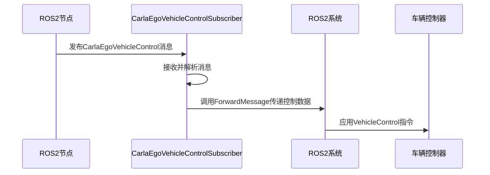
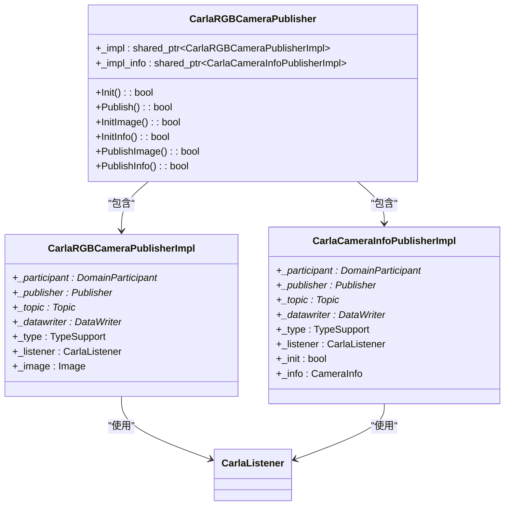
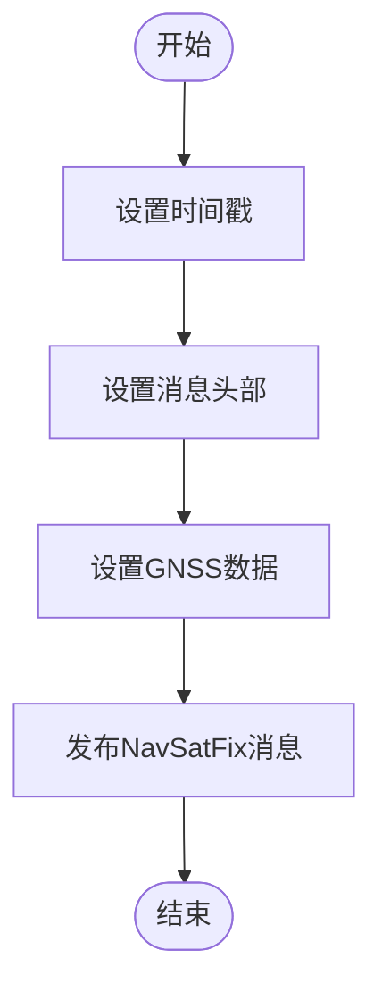
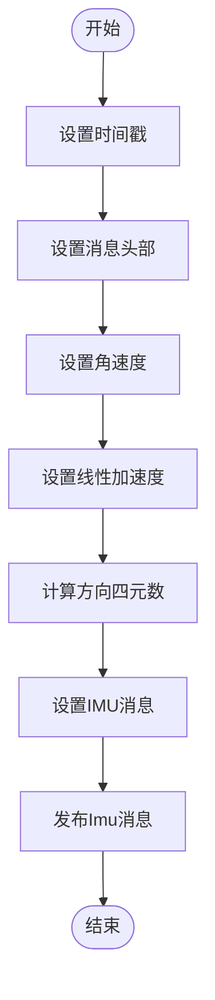
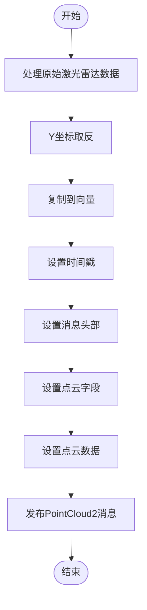
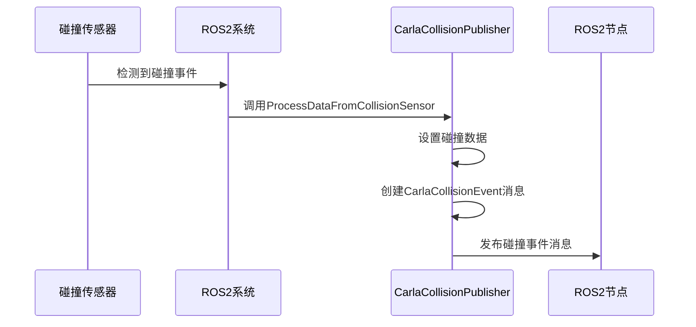
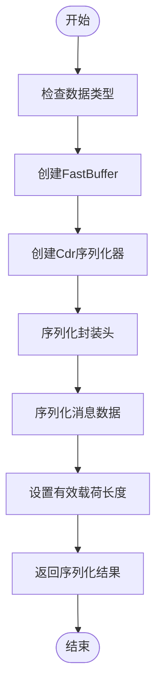

# 消息类型


**本文档中引用的文件**   
- [ros2_native_msgs.md](https://github.com/carla-simulator/carla/blob/ue5-dev/Docs/ros2_native_msgs.md)
- [ROS2.h](https://github.com/carla-simulator/carla/blob/ue5-dev/LibCarla/source/carla/ros2/ROS2.h)
- [CarlaEgoVehicleControlSubscriber.h](https://github.com/carla-simulator/carla/blob/ue5-dev/LibCarla/source/carla/ros2/subscribers/CarlaEgoVehicleControlSubscriber.h)
- [CarlaEgoVehicleControlPubSubTypes.cpp](https://github.com/carla-simulator/carla/blob/ue5-dev/LibCarla/source/carla/ros2/types/CarlaEgoVehicleControlPubSubTypes.cpp)
- [CameraInfoPubSubTypes.cpp](https://github.com/carla-simulator/carla/blob/ue5-dev/LibCarla/source/carla/ros2/types/CameraInfoPubSubTypes.cpp)
- [CarlaRGBCameraPublisher.cpp](https://github.com/carla-simulator/carla/blob/ue5-dev/LibCarla/source/carla/ros2/publishers/CarlaRGBCameraPublisher.cpp)
- [CarlaGNSSPublisher.cpp](https://github.com/carla-simulator/carla/blob/ue5-dev/LibCarla/source/carla/ros2/publishers/CarlaGNSSPublisher.cpp)
- [CarlaIMUPublisher.cpp](https://github.com/carla-simulator/carla/blob/ue5-dev/LibCarla/source/carla/ros2/publishers/CarlaIMUPublisher.cpp)
- [CarlaLidarPublisher.cpp](https://github.com/carla-simulator/carla/blob/ue5-dev/LibCarla/source/carla/ros2/publishers/CarlaLidarPublisher.cpp)
- [CarlaCollisionPublisher.cpp](https://github.com/carla-simulator/carla/blob/ue5-dev/LibCarla/source/carla/ros2/publishers/CarlaCollisionPublisher.cpp)
- [CarlaEgoVehicleControlSubscriber.cpp](https://github.com/carla-simulator/carla/blob/ue5-dev/LibCarla/source/carla/ros2/subscribers/CarlaEgoVehicleControlSubscriber.cpp)


## 目录
1. [引言](#引言)
2. [核心消息类型](#核心消息类型)
3. [车辆控制消息](#车辆控制消息)
4. [传感器数据消息](#传感器数据消息)
5. [事件检测消息](#事件检测消息)
6. [坐标系转换机制](#坐标系转换机制)
7. [时间戳同步机制](#时间戳同步机制)
8. [消息序列化与PubSubTypes](#消息序列化与pubsubtypes)
9. [实际消息示例](#实际消息示例)
10. [自定义消息扩展指南](#自定义消息扩展指南)

## 引言

CARLA仿真器通过ROS2桥接器提供了一套完整的自定义消息类型，用于在CARLA仿真环境与ROS2系统之间交换数据。这些消息类型涵盖了车辆控制、传感器数据、事件检测等多个方面，为自动驾驶系统的开发和测试提供了坚实的基础。本文档系统化地描述了CARLA支持的所有自定义消息格式，包括字段定义、数据类型和单位说明，并深入探讨了从CARLA内部数据结构到ROS2消息的映射机制。

CARLA的ROS2实现基于Fast DDS（原Fast RTPS）中间件，通过发布/订阅模式实现高效的数据通信。消息系统设计考虑了实时性、可靠性和兼容性，确保了仿真数据能够准确、及时地传输到ROS2节点。本文档将详细分析消息类型的结构、序列化过程以及坐标系转换等关键机制，为开发者提供全面的技术参考。

**Section sources**
- [ros2_native_msgs.md](https://github.com/carla-simulator/carla/blob/ue5-dev/Docs/ros2_native_msgs.md)

## 核心消息类型

CARLA的ROS2消息系统包含多种核心消息类型，主要分为车辆控制、传感器数据和事件检测三大类。这些消息类型定义在`carla_msgs`和`sensor_msgs`命名空间下，遵循ROS2的消息定义规范。每种消息类型都经过精心设计，以准确反映CARLA仿真器中的相应数据结构。

车辆控制消息主要用于向CARLA中的车辆发送控制指令，包括油门、转向、刹车等参数。传感器数据消息则涵盖了各种传感器的输出，如摄像头、激光雷达、IMU、GNSS等，提供了丰富的环境感知数据。事件检测消息用于报告仿真过程中发生的特定事件，如碰撞、车道入侵等，为安全分析和行为评估提供了重要依据。

所有消息类型都包含标准的头部信息（Header），其中包含时间戳和坐标系标识，确保了数据的时间同步和空间一致性。消息的字段命名和数据类型选择都遵循了ROS2的最佳实践，便于与其他ROS2系统集成。

**Section sources**
- [ros2_native_msgs.md](https://github.com/carla-simulator/carla/blob/ue5-dev/Docs/ros2_native_msgs.md)

## 车辆控制消息

### CarlaEgoVehicleControl.msg

`CarlaEgoVehicleControl.msg`是CARLA中最核心的车辆控制消息类型，用于向仿真中的车辆发送控制指令。该消息定义了车辆运动控制的所有基本参数，包括油门、转向、刹车、手刹、倒车和档位等。

| 字段 | 类型 | 描述 |
| ---- | ---- | ---- |
| `header` | [Header](https://docs.ros.org/en/melodic/api/std_msgs/html/msg/Header.html) | 消息发布时的时间戳和坐标系ID |
| `throttle` | float32 | 车辆油门控制标量值：**[0.0, 1.0]** |
| `steer` | float32 | 车辆转向控制标量值：**[-1.0, 1.0]** |
| `brake` | float32 | 车辆刹车控制标量值：**[0.0, 1.0]** |
| `hand_brake` | bool | 如果为**True**，则启用手刹 |
| `reverse` | bool | 如果为**True**，则车辆将倒车行驶 |
| `gear` | int32 | 车辆档位切换 |
| `manual_gear_shift` | bool | 如果为**True**，则使用`gear`字段进行手动换挡 |

该消息通过`CarlaEgoVehicleControlSubscriber`类接收，并转换为CARLA内部的`VehicleControl`结构体。订阅者实现位于`LibCarla/source/carla/ros2/subscribers/CarlaEgoVehicleControlSubscriber.cpp`，负责处理ROS2消息并将其转发给CARLA的车辆控制器。



**Diagram sources**
- [CarlaEgoVehicleControlSubscriber.h](https://github.com/carla-simulator/carla/blob/ue5-dev/LibCarla/source/carla/ros2/subscribers/CarlaEgoVehicleControlSubscriber.h)
- [CarlaEgoVehicleControlSubscriber.cpp](https://github.com/carla-simulator/carla/blob/ue5-dev/LibCarla/source/carla/ros2/subscribers/CarlaEgoVehicleControlSubscriber.cpp)

### CarlaEgoVehicleStatus.msg

`CarlaEgoVehicleStatus.msg`消息提供了车辆在仿真世界中的当前状态信息，包括速度、加速度、方向和当前控制值。该消息作为车辆状态的反馈，对于闭环控制和状态监控至关重要。

| 字段 | 类型 | 描述 |
| ---- | ---- | ---- |
| `header` | [Header](https://docs.ros.org/en/melodic/api/std_msgs/html/msg/Header.html) | 消息发布时的时间戳和坐标系ID |
| `velocity` | float32 | 车辆当前速度 |
| `acceleration` | geometry_msgs/Accel | 车辆当前加速度 |
| `orientation` | geometry_msgs/Quaternion | 车辆当前方向 |
| `control` | [CarlaEgoVehicleControl](#carlaegovehiclecontrolmsg) | CARLA报告的当前控制值 |

该消息由CARLA的车辆状态发布器生成，通过ROS2系统发布，供其他节点订阅和使用。

**Section sources**
- [ros2_native_msgs.md](https://github.com/carla-simulator/carla/blob/ue5-dev/Docs/ros2_native_msgs.md)

## 传感器数据消息

### 图像传感器消息

CARLA为RGB摄像头提供了标准的ROS2图像消息支持，使用`sensor_msgs/Image`和`sensor_msgs/CameraInfo`消息类型。`CarlaRGBCameraPublisher`类负责将CARLA的摄像头数据转换为ROS2消息并发布。

`CarlaRGBCameraPublisher`的实现位于`LibCarla/source/carla/ros2/publishers/CarlaRGBCameraPublisher.cpp`，它创建了两个发布器：一个用于图像数据，另一个用于相机信息。图像数据发布到`/image`主题，相机信息发布到`/camera_info`主题。



**Diagram sources**
- [CarlaRGBCameraPublisher.cpp](https://github.com/carla-simulator/carla/blob/ue5-dev/LibCarla/source/carla/ros2/publishers/CarlaRGBCameraPublisher.cpp)

### GNSS传感器消息

`CarlaGNSSPublisher`类负责将CARLA的GNSS传感器数据转换为ROS2的`sensor_msgs/NavSatFix`消息。该消息提供了车辆的全球定位信息，包括纬度、经度和海拔高度。

`SetData`方法在`CarlaGNSSPublisher.cpp`中实现，负责设置消息的时间戳和GNSS数据。时间戳使用CARLA仿真器的同步时间，确保了数据的时间一致性。



**Diagram sources**
- [CarlaGNSSPublisher.cpp](https://github.com/carla-simulator/carla/blob/ue5-dev/LibCarla/source/carla/ros2/publishers/CarlaGNSSPublisher.cpp)

### IMU传感器消息

`CarlaIMUPublisher`类将CARLA的IMU传感器数据转换为ROS2的`sensor_msgs/Imu`消息。该消息包含了角速度、线性加速度和方向四元数等关键惯性数据。

在`CarlaIMUPublisher.cpp`的`SetData`方法中，实现了从CARLA的IMU数据到ROS2消息的转换。特别值得注意的是方向四元数的计算，它将UE4坐标系下的罗盘读数转换为ROS标准的坐标系。



**Diagram sources**
- [CarlaIMUPublisher.cpp](https://github.com/carla-simulator/carla/blob/ue5-dev/LibCarla/source/carla/ros2/publishers/CarlaIMUPublisher.cpp)

### 激光雷达传感器消息

`CarlaLidarPublisher`类负责处理激光雷达数据，将其转换为ROS2的`sensor_msgs/PointCloud2`消息。该消息包含了点云的完整信息，包括点的坐标、强度和点云的结构描述。

在`CarlaLidarPublisher.cpp`的`SetData`方法中，实现了点云数据的转换和坐标系调整。特别地，代码中对Y坐标进行了取反操作（`*it *= -1.0f;`），这是坐标系转换的关键步骤。



**Diagram sources**
- [CarlaLidarPublisher.cpp](https://github.com/carla-simulator/carla/blob/ue5-dev/LibCarla/source/carla/ros2/publishers/CarlaLidarPublisher.cpp)

## 事件检测消息

### CarlaCollisionEvent.msg

`CarlaCollisionEvent.msg`消息用于报告车辆碰撞事件，由碰撞传感器检测到碰撞时生成。该消息包含了碰撞的详细信息，如碰撞对象ID和法向冲量。

| 字段 | 类型 | 描述 |
| ---- | ---- | ---- |
| `header` | [Header](https://docs.ros.org/en/melodic/api/std_msgs/html/msg/Header.html) | 消息发布时的时间戳和坐标系ID |
| `other_actor_id` | uint32 | 碰撞对象的ID |
| `normal_impulse` | geometry_msgs/Vector3 | 碰撞产生的冲量向量 |

`CarlaCollisionPublisher`类负责发布该消息，其实现在`CarlaCollisionPublisher.cpp`中。`SetData`方法将CARLA的碰撞数据转换为ROS2消息格式。



**Diagram sources**
- [CarlaCollisionPublisher.cpp](https://github.com/carla-simulator/carla/blob/ue5-dev/LibCarla/source/carla/ros2/publishers/CarlaCollisionPublisher.cpp)

### CarlaLaneInvasionEvent.msg

`CarlaLaneInvasionEvent.msg`消息用于报告车道入侵事件，由车道入侵传感器检测到车辆跨越车道线时生成。该消息包含了跨越的车道线类型信息。

| 字段 | 类型 | 描述 |
| ---- | ---- | ---- |
| `header` | [header](https://docs.ros.org/en/melodic/api/std_msgs/html/msg/Header.html) | 消息发布时的时间戳和坐标系ID |
| `crossed_lane_markings` | int32[] | 跨越的车道线类型：**LANE_MARKING_OTHER**=0 **LANE_MARKING_BROKEN**=1 **LANE_MARKING_SOLID**=2 |

该消息为高级驾驶辅助系统（ADAS）和自动驾驶系统提供了重要的车道保持信息。

**Section sources**
- [ros2_native_msgs.md](https://github.com/carla-simulator/carla/blob/ue5-dev/Docs/ros2_native_msgs.md)

## 坐标系转换机制

CARLA使用Unreal Engine 4（UE4）的坐标系，而ROS2使用标准的机器人坐标系，两者之间存在显著差异。CARLA的ROS2桥接器实现了自动的坐标系转换，确保了数据在不同系统间的正确性。

在UE4坐标系中，X轴指向前方，Y轴指向右侧，Z轴指向上方。而在ROS标准坐标系中，X轴指向前方，Y轴指向左侧，Z轴指向上方。因此，Y轴需要进行取反操作来实现坐标系的转换。

这一转换在多个传感器的发布器中都有体现。例如，在`CarlaLidarPublisher.cpp`中，对激光雷达数据的Y坐标进行了取反：

```cpp
for (++it; it < end; it += 4) {
    *it *= -1.0f;
}
```

同样，在`CarlaIMUPublisher.cpp`中，IMU数据的Y轴分量也需要进行相应的转换。对于方向信息，需要将UE4坐标系下的欧拉角转换为ROS坐标系下的四元数。

这种坐标系转换确保了CARLA生成的传感器数据能够与ROS2中的其他传感器数据正确对齐，避免了因坐标系不一致导致的定位和感知错误。

**Section sources**
- [CarlaLidarPublisher.cpp](https://github.com/carla-simulator/carla/blob/ue5-dev/LibCarla/source/carla/ros2/publishers/CarlaLidarPublisher.cpp)
- [CarlaIMUPublisher.cpp](https://github.com/carla-simulator/carla/blob/ue5-dev/LibCarla/source/carla/ros2/publishers/CarlaIMUPublisher.cpp)

## 时间戳同步机制

CARLA的ROS2桥接器实现了精确的时间戳同步机制，确保了所有发布的消息都具有准确的时间信息。时间戳使用CARLA仿真器的同步时间，而不是系统时间，这保证了在不同仿真步长和同步模式下的时间一致性。

在`ROS2.h`中，`SetTimestamp`方法用于设置当前的时间戳：

```cpp
void SetTimestamp(double timestamp);
```

这个时间戳被转换为`builtin_interfaces::msg::Time`格式，包含秒和纳秒两个部分。每个消息的头部（Header）都包含这个时间戳，使得订阅者能够准确地知道数据生成的时间。

时间戳同步对于多传感器融合和状态估计至关重要。例如，在同时处理摄像头图像和激光雷达点云时，精确的时间戳可以确保数据在时间上对齐，从而提高融合算法的准确性。

**Section sources**
- [ROS2.h](https://github.com/carla-simulator/carla/blob/ue5-dev/LibCarla/source/carla/ros2/ROS2.h)

## 消息序列化与PubSubTypes

CARLA的ROS2消息系统使用Fast CDR（Common Data Representation）进行消息序列化。每个消息类型都有对应的`PubSubType`类，负责消息的序列化和反序列化操作。

以`CarlaEgoVehicleControlPubSubTypes.cpp`为例，`CarlaEgoVehicleControlPubSubType`类实现了`serialize`和`deserialize`方法：

```cpp
bool CarlaEgoVehicleControlPubSubType::serialize(
        void* data,
        SerializedPayload_t* payload)
{
    CarlaEgoVehicleControl* p_type = static_cast<CarlaEgoVehicleControl*>(data);
    eprosima::fastcdr::FastBuffer fastbuffer(reinterpret_cast<char*>(payload->data), payload->max_size);
    eprosima::fastcdr::Cdr ser(fastbuffer, eprosima::fastcdr::Cdr::DEFAULT_ENDIAN, eprosima::fastcdr::Cdr::DDS_CDR);
    payload->encapsulation = ser.endianness() == eprosima::fastcdr::Cdr::BIG_ENDIANNESS ? CDR_BE : CDR_LE;
    ser.serialize_encapsulation();
    try
    {
        p_type->serialize(ser);
    }
    catch (eprosima::fastcdr::exception::NotEnoughMemoryException& /*exception*/)
    {
        return false;
    }
    payload->length = static_cast<uint32_t>(ser.getSerializedDataLength());
    return true;
}
```

`serialize`方法将消息对象序列化为字节流，而`deserialize`方法则将字节流反序列化为消息对象。这些操作由Fast CDR库高效地完成，确保了消息传输的性能。

`PubSubType`类还负责管理消息类型的元数据，如类型名称、最大序列化大小等，这些信息在DDS发现过程中起着关键作用。



**Diagram sources**
- [CarlaEgoVehicleControlPubSubTypes.cpp](https://github.com/carla-simulator/carla/blob/ue5-dev/LibCarla/source/carla/ros2/types/CarlaEgoVehicleControlPubSubTypes.cpp)

## 实际消息示例

以下是一个通过`ros2 topic echo`命令查看的`CarlaEgoVehicleControl`消息的实际输出示例：

```
header:
  stamp:
    sec: 1234
    nanosec: 567890000
  frame_id: "ego_vehicle"
throttle: 0.75
steer: -0.3
brake: 0.0
hand_brake: false
reverse: false
gear: 1
manual_gear_shift: false
```

这是一个典型的车辆控制消息，表示车辆以75%的油门开度、向左30%的转向角度行驶，没有刹车，处于一档。

以下是一个`sensor_msgs/Imu`消息的示例：

```
header:
  stamp:
    sec: 1234
    nanosec: 567890000
  frame_id: "imu_sensor"
orientation:
  x: 0.0
  y: 0.0
  z: 0.0
  w: 1.0
angular_velocity:
  x: 0.1
  y: -0.05
  z: 0.2
linear_acceleration:
  x: 2.5
  y: -1.0
  z: 9.8
```

该消息表示IMU传感器的读数，包括角速度和线性加速度。

**Section sources**
- [ros2_native_msgs.md](https://github.com/carla-simulator/carla/blob/ue5-dev/Docs/ros2_native_msgs.md)

## 自定义消息扩展指南

要向CARLA的ROS2系统添加新的自定义消息类型，需要遵循以下步骤：

1. **定义消息类型**：在`.msg`文件中定义新的消息结构，遵循ROS2的消息定义语法。
2. **生成代码**：使用`rosidl_generator_cpp`工具生成C++代码，包括消息类和`PubSubType`类。
3. **实现发布器/订阅器**：创建新的发布器或订阅器类，继承自`CarlaPublisher`或`CarlaSubscriber`。
4. **集成到ROS2系统**：在`ROS2.h`中添加新的发布器/订阅器管理接口。
5. **注册消息类型**：在系统初始化时注册新的消息类型。

例如，要添加一个新的传感器消息类型，可以创建一个`CarlaCustomSensorPublisher`类，类似于现有的传感器发布器。该类需要实现`Init`和`Publish`方法，并处理从CARLA到ROS2的消息转换。

```cpp
class CarlaCustomSensorPublisher : public CarlaPublisher {
public:
    bool Init() override;
    bool Publish() override;
    void SetData(int32_t seconds, uint32_t nanoseconds, const CustomData& data);
private:
    struct CarlaCustomSensorPublisherImpl {
        efd::DomainParticipant* _participant { nullptr };
        efd::Publisher* _publisher { nullptr };
        efd::Topic* _topic { nullptr };
        efd::DataWriter* _datawriter { nullptr };
        efd::TypeSupport _type { new custom_msgs::msg::CustomSensorPubSubType() };
        CarlaListener _listener {};
        custom_msgs::msg::CustomSensor _sensor {};
    };
    std::shared_ptr<CarlaCustomSensorPublisherImpl> _impl;
};
```

通过这种方式，可以轻松地扩展CARLA的ROS2消息系统，以支持新的传感器类型或自定义数据格式。

**Section sources**
- [CarlaRGBCameraPublisher.cpp](https://github.com/carla-simulator/carla/blob/ue5-dev/LibCarla/source/carla/ros2/publishers/CarlaRGBCameraPublisher.cpp)
- [CarlaEgoVehicleControlPubSubTypes.cpp](https://github.com/carla-simulator/carla/blob/ue5-dev/LibCarla/source/carla/ros2/types/CarlaEgoVehicleControlPubSubTypes.cpp)