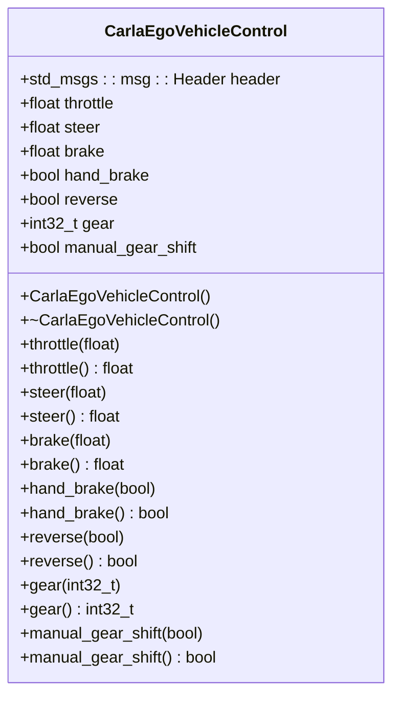
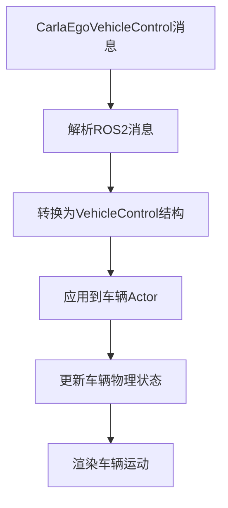
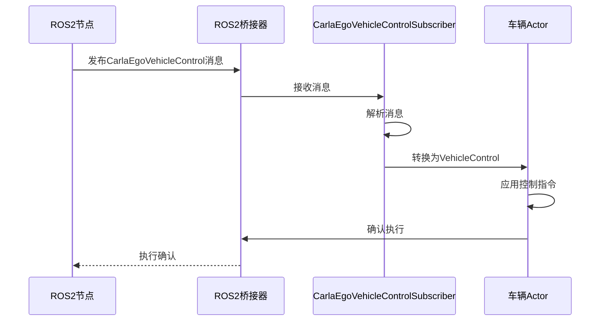

# 车辆控制消息


**本文档中引用的文件**   
- [CarlaEgoVehicleControl.h](https://github.com/carla-simulator/carla/blob/ue5-dev/LibCarla/source/carla/ros2/types/CarlaEgoVehicleControl.h)
- [CarlaEgoVehicleControl.cpp](https://github.com/carla-simulator/carla/blob/ue5-dev/LibCarla/source/carla/ros2/types/CarlaEgoVehicleControl.cpp)
- [CarlaEgoVehicleControlSubscriber.h](https://github.com/carla-simulator/carla/blob/ue5-dev/LibCarla/source/carla/ros2/subscribers/CarlaEgoVehicleControlSubscriber.h)
- [CarlaEgoVehicleControlSubscriber.cpp](https://github.com/carla-simulator/carla/blob/ue5-dev/LibCarla/source/carla/ros2/subscribers/CarlaEgoVehicleControlSubscriber.cpp)
- [VehicleControl.h](https://github.com/carla-simulator/carla/blob/ue5-dev/LibCarla/source/carla/rpc/VehicleControl.h)
- [ROS2.cpp](https://github.com/carla-simulator/carla/blob/ue5-dev/LibCarla/source/carla/ros2/ROS2.cpp)
- [ros2_native.py](https://github.com/carla-simulator/carla/blob/ue5-dev/PythonAPI/examples/ros2/ros2_native.py)
- [ros2_native_msgs.md](https://github.com/carla-simulator/carla/blob/ue5-dev/Docs/ros2_native_msgs.md)


## 目录
1. [简介](#简介)
2. [CarlaEgoVehicleControl消息结构](#carlaegovehiclecontrol消息结构)
3. [控制参数详解](#控制参数详解)
4. [消息与车辆动力学模型的映射](#消息与车辆动力学模型的映射)
5. [数据流分析](#数据流分析)
6. [使用示例](#使用示例)
7. [常见问题排查](#常见问题排查)
8. [结论](#结论)

## 简介
本文档详细描述了CARLA仿真器中用于车辆控制的`CarlaEgoVehicleControl` ROS2消息类型。该消息是实现精确车辆控制的核心接口，允许通过ROS2系统向CARLA中的车辆发送控制指令。文档将深入分析消息结构、各字段的取值范围和单位，解释其与CARLA车辆动力学模型的映射关系，并提供完整的数据流图示和实际使用示例。

**Section sources**
- [ros2_native_msgs.md](https://github.com/carla-simulator/carla/blob/ue5-dev/Docs/ros2_native_msgs.md#L66-L80)

## CarlaEgoVehicleControl消息结构
`CarlaEgoVehicleControl`消息定义了对车辆进行控制所需的所有参数。该消息结构包含油门、刹车、转向、手刹等控制字段，以及用于同步的头部信息。消息的完整结构如下表所示：

| 字段 | 类型 | 描述 |
|------|------|------|
| `header` | std_msgs/Header | 时间戳和帧ID，用于消息同步 |
| `throttle` | float32 | 油门控制值，范围[0.0, 1.0] |
| `steer` | float32 | 转向控制值，范围[-1.0, 1.0] |
| `brake` | float32 | 刹车控制值，范围[0.0, 1.0] |
| `hand_brake` | bool | 手刹状态，true表示启用 |
| `reverse` | bool | 倒车状态，true表示倒车 |
| `gear` | int32 | 指定的档位 |
| `manual_gear_shift` | bool | 手动换挡模式，true表示启用 |

该消息结构在C++代码中定义为一个类，包含相应的构造函数、析构函数、赋值操作符和访问器方法。消息的序列化和反序列化通过Fast CDR实现，确保了在ROS2网络中的高效传输。



**Diagram sources**
- [CarlaEgoVehicleControl.h](https://github.com/carla-simulator/carla/blob/ue5-dev/LibCarla/source/carla/ros2/types/CarlaEgoVehicleControl.h#L72-L349)
- [CarlaEgoVehicleControl.cpp](https://github.com/carla-simulator/carla/blob/ue5-dev/LibCarla/source/carla/ros2/types/CarlaEgoVehicleControl.cpp#L44-L63)

**Section sources**
- [CarlaEgoVehicleControl.h](https://github.com/carla-simulator/carla/blob/ue5-dev/LibCarla/source/carla/ros2/types/CarlaEgoVehicleControl.h#L66-L355)
- [CarlaEgoVehicleControl.cpp](https://github.com/carla-simulator/carla/blob/ue5-dev/LibCarla/source/carla/ros2/types/CarlaEgoVehicleControl.cpp#L44-L436)

## 控制参数详解
### 油门 (throttle)
油门参数控制车辆的加速程度，其数据类型为`float32`，取值范围为[0.0, 1.0]。其中0.0表示完全松开油门，1.0表示完全踩下油门。该值直接映射到车辆引擎的节气门开度，影响发动机输出扭矩。

### 转向 (steer)
转向参数控制车辆的方向，其数据类型为`float32`，取值范围为[-1.0, 1.0]。其中-1.0表示最大左转，1.0表示最大右转，0.0表示直行。该值控制前轮的转向角度，负值表示向左转向，正值表示向右转向。

### 刹车 (brake)
刹车参数控制车辆的制动程度，其数据类型为`float32`，取值范围为[0.0, 1.0]。其中0.0表示完全松开刹车，1.0表示完全踩下刹车。该值影响制动系统的液压压力，从而控制制动力矩。

### 手刹 (hand_brake)
手刹参数控制车辆的手刹状态，其数据类型为`bool`。当值为`true`时，启用手刹；当值为`false`时，释放手刹。手刹主要用于停车时防止车辆移动。

### 倒车 (reverse)
倒车参数控制车辆的行驶方向，其数据类型为`bool`。当值为`true`时，车辆进入倒车模式；当值为`false`时，车辆处于前进模式。

### 档位 (gear)
档位参数指定车辆的当前档位，其数据类型为`int32_t`。该值与`manual_gear_shift`参数配合使用，当手动换挡模式启用时，此值指定具体的档位。

### 手动换挡 (manual_gear_shift)
手动换挡参数控制车辆的换挡模式，其数据类型为`bool`。当值为`true`时，启用手动换挡模式，此时`gear`参数生效；当值为`false`时，车辆使用自动换挡。

**Section sources**
- [ros2_native_msgs.md](https://github.com/carla-simulator/carla/blob/ue5-dev/Docs/ros2_native_msgs.md#L72-L79)
- [CarlaEgoVehicleControl.h](https://github.com/carla-simulator/carla/blob/ue5-dev/LibCarla/source/carla/ros2/types/CarlaEgoVehicleControl.h#L157-L284)

## 消息与车辆动力学模型的映射
`CarlaEgoVehicleControl`消息中的控制参数与CARLA车辆动力学模型之间存在直接的映射关系。当接收到控制消息时，CARLA引擎会将这些参数转换为物理引擎可理解的力和力矩，从而实现车辆的精确控制。

在底层实现中，`CarlaEgoVehicleControl`消息首先被转换为`VehicleControl`结构体，该结构体是CARLA内部使用的车辆控制表示。`VehicleControl`结构体包含相同的控制字段，但可能具有不同的数据类型和单位。这种转换确保了ROS2消息与CARLA内部系统的无缝集成。

车辆的物理行为由多个因素共同决定，包括车辆质量、轮胎摩擦系数、空气阻力等。这些参数在车辆蓝图中定义，并在车辆创建时加载。控制参数与这些物理参数相互作用，共同决定了车辆的运动状态。

例如，油门值与发动机扭矩曲线相关联，通过车辆的传动系统传递到驱动轮，产生驱动力。转向值与前轮的最大转向角相关联，影响车辆的转弯半径。刹车值与制动系统的最大制动力矩相关联，影响车辆的减速能力。



**Diagram sources**
- [VehicleControl.h](https://github.com/carla-simulator/carla/blob/ue5-dev/LibCarla/source/carla/rpc/VehicleControl.h#L20-L97)
- [ROS2.cpp](https://github.com/carla-simulator/carla/blob/ue5-dev/LibCarla/source/carla/ros2/ROS2.cpp#L88-L123)

**Section sources**
- [VehicleControl.h](https://github.com/carla-simulator/carla/blob/ue5-dev/LibCarla/source/carla/rpc/VehicleControl.h#L1-L101)
- [ROS2.cpp](https://github.com/carla-simulator/carla/blob/ue5-dev/LibCarla/source/carla/ros2/ROS2.cpp#L88-L123)

## 数据流分析
从ROS2控制命令到CARLA车辆执行的完整数据流涉及多个组件和步骤。理解这一数据流对于调试和优化控制系统至关重要。

数据流始于ROS2发布者节点，该节点通过`/carla/ego_vehicle/vehicle_control_cmd`主题发布`CarlaEgoVehicleControl`消息。CARLA服务器中的ROS2桥接器订阅此主题，并接收控制消息。接收到的消息被传递给`CarlaEgoVehicleControlSubscriber`，该订阅者负责处理消息并将其转换为CARLA内部格式。

转换后的控制指令通过回调机制传递给相应的车辆Actor，最终应用到车辆的物理模型上。整个过程在每个仿真步骤中执行，确保了控制指令的及时应用。



**Diagram sources**
- [CarlaEgoVehicleControlSubscriber.h](https://github.com/carla-simulator/carla/blob/ue5-dev/LibCarla/source/carla/ros2/subscribers/CarlaEgoVehicleControlSubscriber.h#L18-L44)
- [CarlaEgoVehicleControlSubscriber.cpp](https://github.com/carla-simulator/carla/blob/ue5-dev/LibCarla/source/carla/ros2/subscribers/CarlaEgoVehicleControlSubscriber.cpp#L45-L199)

**Section sources**
- [CarlaEgoVehicleControlSubscriber.h](https://github.com/carla-simulator/carla/blob/ue5-dev/LibCarla/source/carla/ros2/subscribers/CarlaEgoVehicleControlSubscriber.h#L1-L47)
- [CarlaEgoVehicleControlSubscriber.cpp](https://github.com/carla-simulator/carla/blob/ue5-dev/LibCarla/source/carla/ros2/subscribers/CarlaEgoVehicleControlSubscriber.cpp#L1-L242)

## 使用示例
### ROS2命令行控制
可以通过`ros2 topic pub`命令直接发送控制指令。以下示例展示了如何发送一个简单的控制命令：

```bash
ros2 topic pub /carla/ego_vehicle/vehicle_control_cmd carla_msgs/msg/CarlaEgoVehicleControl "{
  header: {stamp: {sec: 0, nanosec: 0}, frame_id: 'map'},
  throttle: 0.5,
  steer: 0.0,
  brake: 0.0,
  hand_brake: false,
  reverse: false,
  gear: 0,
  manual_gear_shift: false
}"
```

### Python脚本控制
在Python脚本中，可以使用CARLA的Python API来发送控制指令。以下是一个简单的示例：

```python
import rospy
from carla_msgs.msg import CarlaEgoVehicleControl

def send_control_command():
    rospy.init_node('vehicle_control_node')
    pub = rospy.Publisher('/carla/ego_vehicle/vehicle_control_cmd', CarlaEgoVehicleControl, queue_size=1)
    
    control_msg = CarlaEgoVehicleControl()
    control_msg.throttle = 0.5
    control_msg.steer = 0.0
    control_msg.brake = 0.0
    control_msg.hand_brake = False
    control_msg.reverse = False
    control_msg.gear = 0
    control_msg.manual_gear_shift = False
    
    pub.publish(control_msg)
```

**Section sources**
- [ros2_native.py](https://github.com/carla-simulator/carla/blob/ue5-dev/PythonAPI/examples/ros2/ros2_native.py#L1-L132)

## 常见问题排查
### 控制延迟
控制延迟可能由多种因素引起，包括网络延迟、仿真步长设置和消息处理时间。解决方法包括：
- 减小仿真步长（fixed_delta_seconds）
- 确保ROS2网络连接稳定
- 在同步模式下运行仿真，确保每个控制指令都在正确的仿真步骤中应用

### 命令不响应
当发送控制命令但车辆没有响应时，可能的原因包括：
- 车辆处于自动驾驶模式，需要先关闭自动驾驶
- ROS2主题名称错误，确保使用正确的主题名称
- 车辆Actor ID不匹配，确保控制消息发送给正确的车辆

### 转向异常
转向异常可能表现为车辆转向角度与控制指令不符。这通常与车辆的物理参数设置有关，如最大转向角。检查车辆蓝图中的相关参数，并确保控制值在有效范围内。

**Section sources**
- [ros2_native_msgs.md](https://github.com/carla-simulator/carla/blob/ue5-dev/Docs/ros2_native_msgs.md#L66-L80)
- [ros2_native.py](https://github.com/carla-simulator/carla/blob/ue5-dev/PythonAPI/examples/ros2/ros2_native.py#L96)

## 结论
`CarlaEgoVehicleControl`消息是CARLA仿真器中实现车辆精确控制的关键接口。通过理解其结构、参数含义和数据流，开发者可以有效地控制仿真车辆的行为。本文档提供了详细的参考信息，包括消息结构、参数说明、实现细节和使用示例，为开发和调试基于CARLA的自动驾驶系统提供了重要支持。