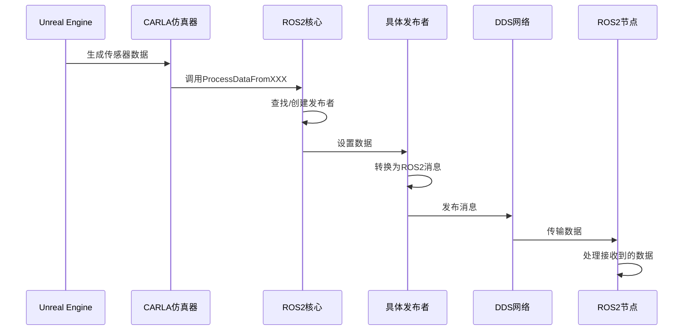
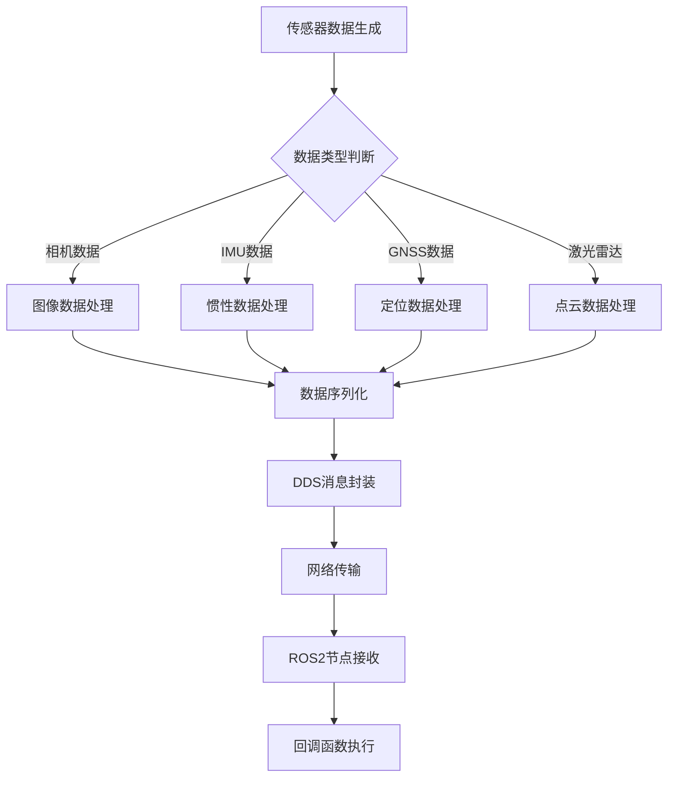
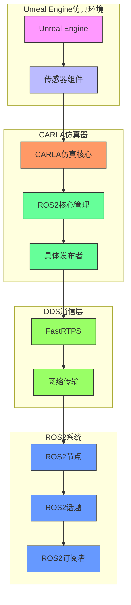

# 通信架构

> **引用文件**
> **本文档引用的文件**

- [ROS2.h](https://github.com/carla-simulator/carla/blob/ue5-dev/LibCarla/source/carla/ros2/ROS2.h)
- [ROS2.cpp](https://github.com/carla-simulator/carla/blob/ue5-dev/LibCarla/source/carla/ros2/ROS2.cpp)
- [ROS2CallbackData.h](https://github.com/carla-simulator/carla/blob/ue5-dev/LibCarla/source/carla/ros2/ROS2CallbackData.h)
- [CarlaPublisher.h](https://github.com/carla-simulator/carla/blob/ue5-dev/LibCarla/source/carla/ros2/publishers/CarlaPublisher.h)
- [CarlaTransformPublisher.h](https://github.com/carla-simulator/carla/blob/ue5-dev/LibCarla/source/carla/ros2/publishers/CarlaTransformPublisher.h)
- [CarlaEgoVehicleControlSubscriber.h](https://github.com/carla-simulator/carla/blob/ue5-dev/LibCarla/source/carla/ros2/subscribers/CarlaEgoVehicleControlSubscriber.h)
- [CarlaEgoVehicleControl.h](https://github.com/carla-simulator/carla/blob/ue5-dev/LibCarla/source/carla/ros2/types/CarlaEgoVehicleControl.h)
- [Clock.h](https://github.com/carla-simulator/carla/blob/ue5-dev/LibCarla/source/carla/ros2/types/Clock.h)
- [Image.h](https://github.com/carla-simulator/carla/blob/ue5-dev/LibCarla/source/carla/ros2/types/Image.h)
- [Imu.h](https://github.com/carla-simulator/carla/blob/ue5-dev/LibCarla/source/carla/ros2/types/Imu.h)
- [NavSatFix.h](https://github.com/carla-simulator/carla/blob/ue5-dev/LibCarla/source/carla/ros2/types/NavSatFix.h)

## 目录

1. [简介](#简介)
2. [核心类职责与协作](#核心类职责与协作)
3. [基于 DDS 的实时数据流处理](#基于dds的实时数据流处理)
4. [线程模型与异步回调](#线程模型与异步回调)
5. [数据流架构图](#数据流架构图)
6. [FastRTPS 配置与性能](#fastrtps配置与性能)
7. [多节点部署最佳实践](#多节点部署最佳实践)

## 简介

本文档详细描述了 CARLA 与 ROS2 之间的通信架构，重点分析了客户端-服务器交互模式。文档深入探讨了 ROS2.h 中定义的核心类（如 ROS2、CarlaPublisher、CarlaSubscriber）的职责和协作关系，解释了基于 DDS 的实时数据流处理机制，包括连接建立、会话管理和错误恢复策略。同时，文档化了线程模型和异步回调处理，展示了如何保证传感器数据的低延迟传输，并提供了数据从 Unreal Engine 仿真环境到 ROS2 话题的完整路径架构图。

## 核心类职责与协作

CARLA 的 ROS2 通信架构基于一组核心类实现，这些类协同工作以实现仿真环境与 ROS2 系统之间的数据交换。

### ROS2 类

`ROS2`类是整个通信系统的核心单例控制器，负责管理所有 ROS2 相关的功能。它通过静态方法`GetInstance()`提供全局访问点，确保系统中只有一个实例存在。该类的主要职责包括：

- **系统启停控制**：通过`Enable()`和`Shutdown()`方法管理 ROS2 系统的生命周期
- **状态管理**：维护当前帧号、时间戳等全局状态信息
- **资源管理**：创建和管理发布者、订阅者以及相关的回调函数
- **数据分发**：接收来自仿真环境的原始数据并分发给相应的发布者

### CarlaPublisher 与 CarlaSubscriber 类

`CarlaPublisher`和`CarlaSubscriber`是抽象基类，定义了所有具体发布者和订阅者的基本接口。`CarlaPublisher`负责将 CARLA 仿真数据发布到 ROS2 话题，而`CarlaSubscriber`则负责从 ROS2 话题接收控制命令。

### 具体发布者与订阅者

系统实现了多种具体的发布者类，如`CarlaRGBCameraPublisher`、`CarlaLidarPublisher`、`CarlaGNSSPublisher`等，每种发布者专门处理特定类型的传感器数据。`CarlaEgoVehicleControlSubscriber`是主要的订阅者类，负责接收来自 ROS2 系统的车辆控制命令。

**本节来源**

- <a href="https://github.com/carla-simulator/carla/blob/ue5-dev/LibCarla/source/carla/ros2/ROS2.h#L47-L177" target="_blank">ROS2.h</a>
- <a href="https://github.com/carla-simulator/carla/blob/ue5-dev/LibCarla/source/carla/ros2/publishers/CarlaPublisher.h#L12-L35" target="_blank">CarlaPublisher.h</a>
- <a href="https://github.com/carla-simulator/carla/blob/ue5-dev/LibCarla/source/carla/ros2/publishers/CarlaTransformPublisher.h#L17-L36" target="_blank">CarlaTransformPublisher.h</a>
- <a href="https://github.com/carla-simulator/carla/blob/ue5-dev/LibCarla/source/carla/ros2/subscribers/CarlaEgoVehicleControlSubscriber.h#L18-L47" target="_blank">CarlaEgoVehicleControlSubscriber.h</a>

## 基于 DDS 的实时数据流处理

CARLA 的 ROS2 通信基于 DDS（Data Distribution Service）协议实现，利用 FastRTPS 作为底层通信中间件，确保了实时数据流的高效传输。

### 连接建立与会话管理

系统在初始化时通过`Enable()`方法建立与 DDS 网络的连接。`ROS2`类维护一个单例实例，负责管理所有通信会话。当传感器数据可用时，系统通过`GetOrCreateSensor()`方法获取或创建相应的发布者实例，确保每个传感器都有独立的数据流通道。

### 数据流处理机制

数据流处理采用事件驱动模式，主要流程如下：

1. 仿真环境生成传感器数据
2. 数据通过`ProcessDataFromXXX()`系列方法提交给`ROS2`实例
3. `ROS2`实例根据传感器类型查找或创建相应的发布者
4. 发布者将数据转换为 ROS2 消息格式并发布到对应话题

### 错误恢复策略

系统实现了多层次的错误恢复机制：

- **连接监控**：定期检查发布者和订阅者的存活状态
- **自动重建**：当检测到连接丢失时，自动重建发布者和订阅者实例
- **数据完整性检查**：在数据处理前验证缓冲区的有效性

**图表来源**

- <a href="https://github.com/carla-simulator/carla/blob/ue5-dev/LibCarla/source/carla/ros2/ROS2.cpp#L77-L800" target="_blank">ROS2.cpp</a>
- <a href="https://github.com/carla-simulator/carla/blob/ue5-dev/LibCarla/source/carla/ros2/ROS2.h#L86-L147" target="_blank">ROS2.h</a>

**本节来源**

- <a href="https://github.com/carla-simulator/carla/blob/ue5-dev/LibCarla/source/carla/ros2/ROS2.cpp#L77-L800" target="_blank">ROS2.cpp</a>
- <a href="https://github.com/carla-simulator/carla/blob/ue5-dev/LibCarla/source/carla/ros2/ROS2.h#L86-L147" target="_blank">ROS2.h</a>

## 线程模型与异步回调

CARLA 的 ROS2 通信系统采用多线程异步处理模型，确保传感器数据的低延迟传输和实时性。

### 线程架构

系统主要包含以下线程：

- **主仿真线程**：运行 Unreal Engine 和 CARLA 仿真逻辑
- **ROS2 通信线程**：处理 DDS 网络通信
- **回调处理线程**：执行用户注册的回调函数

### 异步回调机制

系统通过函数对象（`std::function`）实现异步回调，主要特点包括：

- **类型安全**：使用`std::variant`封装不同类型的消息数据
- **内存安全**：使用`std::shared_ptr`管理发布者和订阅者的生命周期
- **线程安全**：通过智能指针和原子操作确保多线程环境下的数据一致性

### 低延迟优化

为保证传感器数据的低延迟传输，系统采用了以下优化策略：

- **零拷贝传输**：尽可能使用共享内存和引用传递，减少数据复制
- **批量处理**：对高频数据进行批量处理，降低通信开销
- **优先级调度**：为关键传感器数据设置更高的传输优先级

**图表来源**

- <a href="https://github.com/carla-simulator/carla/blob/ue5-dev/LibCarla/source/carla/ros2/ROS2CallbackData.h#L15-L39" target="_blank">ROS2CallbackData.h</a>
- <a href="https://github.com/carla-simulator/carla/blob/ue5-dev/LibCarla/source/carla/ros2/ROS2.cpp#L88-L137" target="_blank">ROS2.cpp</a>

**本节来源**

- <a href="https://github.com/carla-simulator/carla/blob/ue5-dev/LibCarla/source/carla/ros2/ROS2CallbackData.h#L15-L39" target="_blank">ROS2CallbackData.h</a>
- <a href="https://github.com/carla-simulator/carla/blob/ue5-dev/LibCarla/source/carla/ros2/ROS2.cpp#L88-L137" target="_blank">ROS2.cpp</a>

## 数据流架构图

以下架构图展示了数据从 Unreal Engine 仿真环境到 ROS2 话题的完整路径。

**图表来源**

- [ROS2.h](https://github.com/carla-simulator/carla/blob/ue5-dev/LibCarla/source/carla/ros2/ROS2.h)
- [ROS2.cpp](https://github.com/carla-simulator/carla/blob/ue5-dev/LibCarla/source/carla/ros2/ROS2.cpp)
- [publishers 目录](https://github.com/carla-simulator/carla/blob/ue5-dev/LibCarla/source/carla/ros2/publishers/)

## FastRTPS 配置与性能

FastRTPS 作为 CARLA 与 ROS2 通信的底层中间件，其配置对通信性能有显著影响。

### 关键配置参数

- **传输协议**：支持 UDP、TCP 和共享内存等多种传输方式
- **QoS 策略**：可配置可靠性、持久性、历史记录等服务质量参数
- **资源限制**：可设置内存使用、线程数等资源限制

### 性能影响分析

不同的 FastRTPS 配置对通信性能的影响主要体现在：

- **延迟**：共享内存传输比网络传输具有更低的延迟
- **吞吐量**：批量处理和适当的消息大小可以提高吞吐量
- **CPU 使用率**：高效的序列化和反序列化算法可以降低 CPU 使用率

### 优化建议

- 对于高频率传感器（如相机），建议使用共享内存传输
- 对于关键控制命令，应配置高可靠性 QoS 策略
- 根据网络条件调整消息大小和批量处理策略

**本节来源**

- [ROS2.cpp](https://github.com/carla-simulator/carla/blob/ue5-dev/LibCarla/source/carla/ros2/ROS2.cpp)
- [ROS2.h](https://github.com/carla-simulator/carla/blob/ue5-dev/LibCarla/source/carla/ros2/ROS2.h)

## 多节点部署最佳实践

在多节点部署场景下，遵循以下最佳实践可以确保系统的稳定性和性能。

### 节点规划

- **功能分离**：将不同类型的数据处理分配到不同的节点
- **负载均衡**：根据数据量和处理复杂度合理分配节点负载
- **冗余设计**：关键功能节点应有备份，提高系统可靠性

### 网络配置

- **带宽管理**：为高带宽需求的传感器数据预留足够的网络带宽
- **延迟优化**：尽量减少网络跳数，降低传输延迟
- **安全性**：配置适当的网络安全策略，防止未授权访问

### 故障处理

- **健康检查**：定期检查各节点的运行状态
- **自动恢复**：配置自动重启机制，快速恢复故障节点
- **日志监控**：集中管理日志，便于问题排查

**本节来源**

- [ROS2.cpp](https://github.com/carla-simulator/carla/blob/ue5-dev/LibCarla/source/carla/ros2/ROS2.cpp)
- [ROS2.h](https://github.com/carla-simulator/carla/blob/ue5-dev/LibCarla/source/carla/ros2/ROS2.h)
