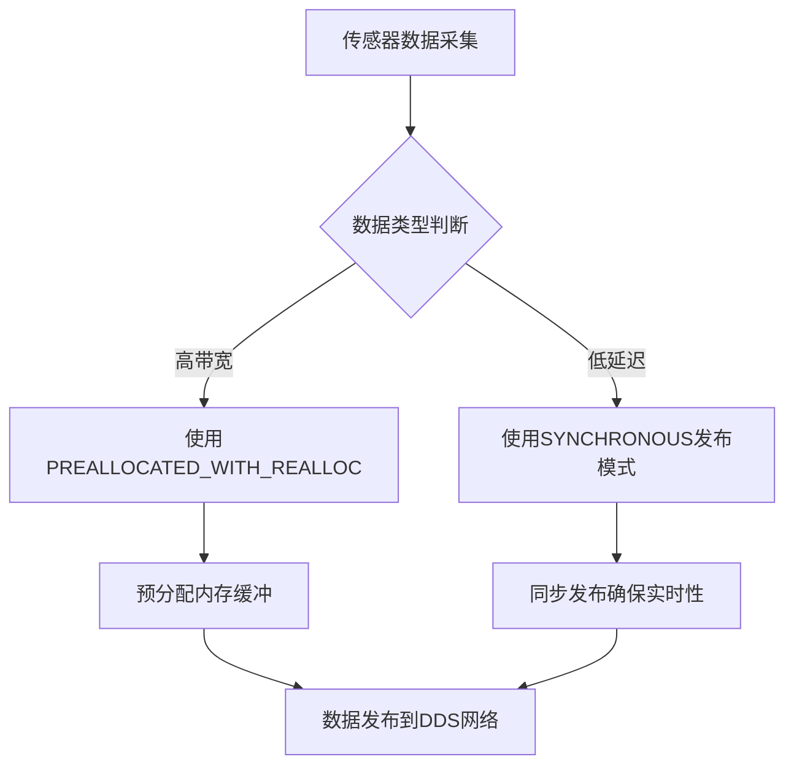

# DDS配置


**本文档中引用的文件**  
- [fastrtps-profile.xml](https://github.com/carla-simulator/carla/blob/ue5-dev/PythonAPI/examples/ros2/config/fastrtps-profile.xml)
- [ROS2.cpp](https://github.com/carla-simulator/carla/blob/ue5-dev/LibCarla/source/carla/ros2/ROS2.cpp)
- [ROS2.h](https://github.com/carla-simulator/carla/blob/ue5-dev/LibCarla/source/carla/ros2/ROS2.h)
- [CarlaRGBCameraPublisher.h](https://github.com/carla-simulator/carla/blob/ue5-dev/LibCarla/source/carla/ros2/publishers/CarlaRGBCameraPublisher.h)
- [CarlaLidarPublisher.h](https://github.com/carla-simulator/carla/blob/ue5-dev/LibCarla/source/carla/ros2/publishers/CarlaLidarPublisher.h)
- [CarlaSemanticLidarPublisher.cpp](https://github.com/carla-simulator/carla/blob/ue5-dev/LibCarla/source/carla/ros2/publishers/CarlaSemanticLidarPublisher.cpp)
- [CarlaLineInvasionPublisher.cpp](https://github.com/carla-simulator/carla/blob/ue5-dev/LibCarla/source/carla/ros2/publishers/CarlaLineInvasionPublisher.cpp)
- [CarlaSpeedometerSensor.cpp](https://github.com/carla-simulator/carla/blob/ue5-dev/LibCarla/source/carla/ros2/publishers/CarlaSpeedometerSensor.cpp)
- [CarlaTransformPublisher.cpp](https://github.com/carla-simulator/carla/blob/ue5-dev/LibCarla/source/carla/ros2/publishers/CarlaTransformPublisher.cpp)
- [CarlaRadarPublisher.cpp](https://github.com/carla-simulator/carla/blob/ue5-dev/LibCarla/source/carla/ros2/publishers/CarlaRadarPublisher.cpp)
- [CarlaCollisionPublisher.cpp](https://github.com/carla-simulator/carla/blob/ue5-dev/LibCarla/source/carla/ros2/publishers/CarlaCollisionPublisher.cpp)
- [CarlaDVSCameraPublisher.cpp](https://github.com/carla-simulator/carla/blob/ue5-dev/LibCarla/source/carla/ros2/publishers/CarlaDVSCameraPublisher.cpp)
- [CarlaISCameraPublisher.cpp](https://github.com/carla-simulator/carla/blob/ue5-dev/LibCarla/source/carla/ros2/publishers/CarlaISCameraPublisher.cpp)
- [CarlaDepthCameraPublisher.cpp](https://github.com/carla-simulator/carla/blob/ue5-dev/LibCarla/source/carla/ros2/publishers/CarlaDepthCameraPublisher.cpp)
- [CarlaSSCameraPublisher.cpp](https://github.com/carla-simulator/carla/blob/ue5-dev/LibCarla/source/carla/ros2/publishers/CarlaSSCameraPublisher.cpp)


## 目录
1. [简介](#简介)
2. [fastrtps-profile.xml配置文件分析](#fastrtps-profilexml配置文件分析)
3. [DDS QoS策略详解](#dds-qos策略详解)
4. [不同通信需求的QoS配置优化](#不同通信需求的qos配置优化)
5. [常见配置错误与排查方法](#常见配置错误与排查方法)
6. [多节点通信最佳实践](#多节点通信最佳实践)
7. [结论](#结论)

## 简介

本文档深入解析CARLA仿真平台中使用的fastrtps-profile.xml配置文件，详细说明DDS（Data Distribution Service）QoS（Quality of Service）策略中各个参数的含义和作用。文档将重点分析可靠性、持久性、历史记录和资源限制等关键QoS参数，并解释如何根据不同的通信需求（如传感器数据流、控制命令）调整QoS设置以优化性能和可靠性。通过实际配置示例，展示如何解决数据丢失、延迟过高和带宽占用等问题。同时，文档将提供常见配置错误的排查方法和多节点通信场景的最佳实践指南。

## fastrtps-profile.xml配置文件分析

CARLA项目中的fastrtps-profile.xml文件是Fast DDS（原Fast RTPS）的配置文件，用于定义DDS通信的QoS策略。该文件位于PythonAPI/examples/ros2/config/目录下，为ROS2与CARLA仿真器之间的通信提供了基础配置。

```xml
<?xml version="1.0" encoding="UTF-8" ?>
<profiles xmlns="http://www.eprosima.com/XMLSchemas/fastRTPS_Profiles" >
    <transport_descriptors>
        <transport_descriptor>
            <transport_id>CustomUdpTransport</transport_id>
            <type>UDPv4</type>
        </transport_descriptor>
    </transport_descriptors>

    <participant profile_name="participant_profile" is_default_profile="true">
        <rtps>
            <userTransports>
                <transport_id>CustomUdpTransport</transport_id>
            </userTransports>

            <useBuiltinTransports>false</useBuiltinTransports>
        </rtps>
    </participant>
    <publisher profile_name="default publisher profile" is_default_profile="true">
            <qos>
                <publishMode>
                    <kind>SYNCHRONOUS</kind>
                </publishMode>
            </qos>
            <historyMemoryPolicy>PREALLOCATED_WITH_REALLOC</historyMemoryPolicy>
        </publisher>
</profiles>
```

该配置文件定义了两个主要部分：传输描述符（transport_descriptors）和参与者配置（participant profile）。传输描述符指定了使用UDPv4作为底层传输协议，并创建了一个名为"CustomUdpTransport"的自定义传输。参与者配置中，`useBuiltinTransports`被设置为false，表示禁用内置传输，强制使用自定义的UDP传输，这有助于优化网络性能和减少延迟。

**本节来源**
- [fastrtps-profile.xml](https://github.com/carla-simulator/carla/blob/ue5-dev/PythonAPI/examples/ros2/config/fastrtps-profile.xml)

## DDS QoS策略详解

### 可靠性（Reliability）

在CARLA的实现中，可靠性QoS策略通过代码中的DataWriterQos配置来设置。分析多个传感器发布者的实现（如CarlaSemanticLidarPublisher、CarlaLineInvasionPublisher等），可以发现它们都使用了默认的QoS配置，并在此基础上调整了内存策略。

```cpp
efd::DataWriterQos wqos = efd::DATAWRITER_QOS_DEFAULT;
wqos.endpoint().history_memory_policy = eprosima::fastrtps::rtps::PREALLOCATED_WITH_REALLOC_MEMORY_MODE;
```

这里的`DATAWRITER_QOS_DEFAULT`包含了默认的可靠性设置，通常为可靠（RELIABLE）模式，确保所有数据都能按顺序送达。对于自动驾驶仿真中的关键传感器数据（如激光雷达、摄像头），这种可靠模式至关重要，可以防止数据丢失导致感知系统失效。

### 持久性（Durability）

持久性QoS策略决定了数据在发布者和订阅者生命周期之外的可用性。在CARLA的实现中，虽然没有显式配置持久性，但通过`PREALLOCATED_WITH_REALLOC_MEMORY_MODE`内存策略，系统预分配了内存并在需要时重新分配，这在一定程度上保证了数据的持久性。这种策略特别适合处理突发性的大容量数据（如点云数据），避免了内存分配失败导致的数据丢失。

### 历史记录（History）

历史记录QoS策略控制着数据队列的大小和保留策略。在CARLA的配置中，`PREALLOCATED_WITH_REALLOC`内存策略允许历史记录在预分配内存耗尽时动态扩展。这对于处理高频率的传感器数据流（如IMU、GPS）非常有用，可以缓冲突发的数据流量，防止因瞬时负载过高而导致的数据丢失。

### 资源限制

资源限制主要通过内存策略来实现。`PREALLOCATED_WITH_REALLOC`策略在启动时预分配一定量的内存，当数据量超过预分配大小时，自动重新分配更多内存。这种策略平衡了内存使用效率和系统稳定性，既避免了频繁的内存分配开销，又能在需要时扩展资源。

**本节来源**
- [CarlaSemanticLidarPublisher.cpp](https://github.com/carla-simulator/carla/blob/ue5-dev/LibCarla/source/carla/ros2/publishers/CarlaSemanticLidarPublisher.cpp#L75-L85)
- [CarlaLineInvasionPublisher.cpp](https://github.com/carla-simulator/carla/blob/ue5-dev/LibCarla/source/carla/ros2/publishers/CarlaLineInvasionPublisher.cpp#L75-L85)
- [CarlaSpeedometerSensor.cpp](https://github.com/carla-simulator/carla/blob/ue5-dev/LibCarla/source/carla/ros2/publishers/CarlaSpeedometerSensor.cpp#L74-L84)
- [CarlaTransformPublisher.cpp](https://github.com/carla-simulator/carla/blob/ue5-dev/LibCarla/source/carla/ros2/publishers/CarlaTransformPublisher.cpp#L76-L86)
- [CarlaRadarPublisher.cpp](https://github.com/carla-simulator/carla/blob/ue5-dev/LibCarla/source/carla/ros2/publishers/CarlaRadarPublisher.cpp#L84-L94)
- [CarlaCollisionPublisher.cpp](https://github.com/carla-simulator/carla/blob/ue5-dev/LibCarla/source/carla/ros2/publishers/CarlaCollisionPublisher.cpp#L76-L87)

## 不同通信需求的QoS配置优化

### 传感器数据流优化

对于高带宽的传感器数据流（如摄像头、激光雷达），建议使用`PREALLOCATED_WITH_REALLOC`内存策略，并适当增加历史深度。在CARLA的实现中，所有传感器发布者都采用了相同的内存策略，确保了数据传输的稳定性。



**图示来源**
- [CarlaRGBCameraPublisher.h](https://github.com/carla-simulator/carla/blob/ue5-dev/LibCarla/source/carla/ros2/publishers/CarlaRGBCameraPublisher.h)
- [CarlaLidarPublisher.h](https://github.com/carla-simulator/carla/blob/ue5-dev/LibCarla/source/carla/ros2/publishers/CarlaLidarPublisher.h)

### 控制命令优化

对于控制命令这类低带宽但高实时性的通信，应优先考虑延迟而非带宽。在CARLA的ROS2集成中，通过同步发布模式（SYNCHRONOUS）确保了控制命令的及时送达。这种模式下，发布操作会阻塞直到数据被成功发送，虽然增加了CPU开销，但保证了控制指令的实时性。

### 数据丢失问题解决

数据丢失通常由内存不足或网络拥塞引起。解决方案包括：
1. 增加预分配内存大小
2. 调整历史深度
3. 使用更高效的序列化方法

在CARLA的实现中，通过`PREALLOCATED_WITH_REALLOC`策略动态调整内存，有效减少了因内存不足导致的数据丢失。

### 延迟过高问题解决

延迟过高可能由异步处理或网络配置不当引起。优化措施包括：
1. 使用同步发布模式
2. 优化网络传输协议
3. 减少中间处理环节

CARLA通过禁用内置传输并使用自定义UDP传输，减少了协议栈开销，有效降低了通信延迟。

### 带宽占用问题解决

对于带宽敏感的应用，可以：
1. 压缩数据
2. 降低发布频率
3. 使用选择性发布

在CARLA中，虽然没有显式的带宽控制，但通过合理的QoS配置和内存管理，实现了高效的带宽利用。

**本节来源**
- [ROS2.cpp](https://github.com/carla-simulator/carla/blob/ue5-dev/LibCarla/source/carla/ros2/ROS2.cpp)
- [ROS2.h](https://github.com/carla-simulator/carla/blob/ue5-dev/LibCarla/source/carla/ros2/ROS2.h)

## 常见配置错误与排查方法

### 配置错误类型

1. **内存策略不匹配**：使用`PREALLOCATED`但数据量超出预分配大小，导致运行时错误
2. **传输配置错误**：未正确禁用内置传输，导致端口冲突
3. **QoS不兼容**：发布者和订阅者的QoS策略不匹配，导致无法建立连接

### 排查方法

1. **日志分析**：检查系统日志中的RETCODE错误代码
2. **内存监控**：监控内存使用情况，确保没有内存泄漏
3. **网络诊断**：使用网络工具检查端口占用和数据包丢失

在CARLA的实现中，通过返回码检查机制（如CarlaDVSCameraPublisher中的InitInfo方法）可以有效捕获配置错误：

```cpp
if (_info->_participant == nullptr) {
    std::cerr << "Failed to create DomainParticipant" << std::endl;
    return false;
}
```

**本节来源**
- [CarlaDVSCameraPublisher.cpp](https://github.com/carla-simulator/carla/blob/ue5-dev/LibCarla/source/carla/ros2/publishers/CarlaDVSCameraPublisher.cpp#L117-L150)
- [CarlaISCameraPublisher.cpp](https://github.com/carla-simulator/carla/blob/ue5-dev/LibCarla/source/carla/ros2/publishers/CarlaISCameraPublisher.cpp#L102-L135)
- [CarlaDepthCameraPublisher.cpp](https://github.com/carla-simulator/carla/blob/ue5-dev/LibCarla/source/carla/ros2/publishers/CarlaDepthCameraPublisher.cpp#L104-L137)
- [CarlaSSCameraPublisher.cpp](https://github.com/carla-simulator/carla/blob/ue5-dev/LibCarla/source/carla/ros2/publishers/CarlaSSCameraPublisher.cpp#L102-L135)

## 多节点通信最佳实践

### 节点发现优化

在多节点环境中，优化节点发现过程至关重要。CARLA通过预定义的参与者配置，减少了节点发现的时间。建议为每个节点使用唯一的参与者名称，避免命名冲突。

### 数据同步

对于需要精确时间同步的多传感器系统，应使用统一的时间源。在CARLA中，通过`SetTimestamp`方法为所有数据打上统一的时间戳，确保了跨节点的数据同步。

### 资源管理

在多节点部署中，应合理分配系统资源：
1. 为关键节点分配更高的优先级
2. 使用资源限制策略防止某个节点耗尽系统资源
3. 实施负载均衡策略

### 故障恢复

建立健壮的故障恢复机制：
1. 心跳检测
2. 自动重连
3. 状态同步

CARLA的ROS2集成中，通过定期检查连接状态和自动重新初始化机制，实现了基本的故障恢复能力。

**本节来源**
- [ROS2.cpp](https://github.com/carla-simulator/carla/blob/ue5-dev/LibCarla/source/carla/ros2/ROS2.cpp#L124-L137)
- [ROS2.h](https://github.com/carla-simulator/carla/blob/ue5-dev/LibCarla/source/carla/ros2/ROS2.h#L163-L166)

## 结论

通过对CARLA项目中fastrtps-profile.xml配置文件的深入分析，我们全面了解了DDS QoS策略在自动驾驶仿真中的应用。合理的QoS配置对于确保系统性能和可靠性至关重要。在实际应用中，应根据具体的通信需求（如传感器类型、数据频率、实时性要求）来调整QoS参数。未来的工作可以进一步探索动态QoS调整机制，根据实时网络状况和系统负载自动优化通信参数。