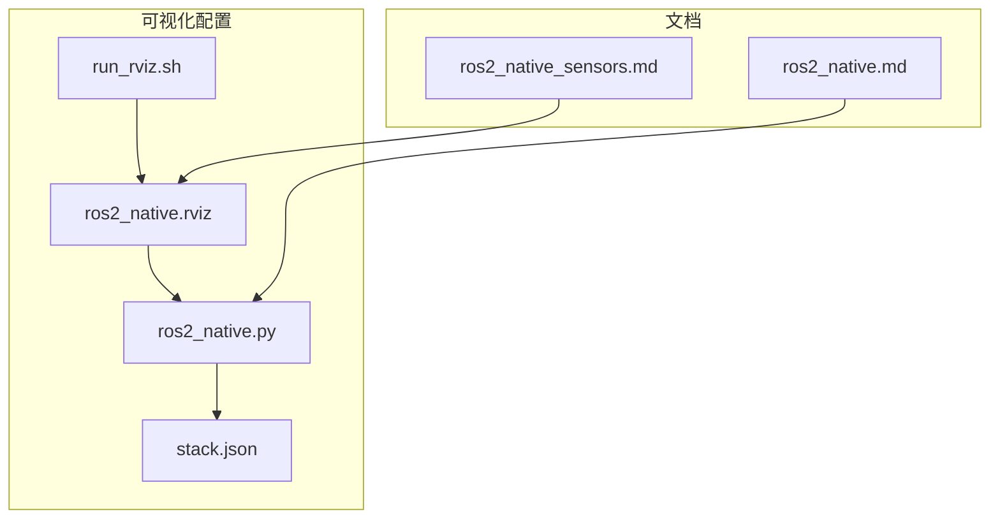
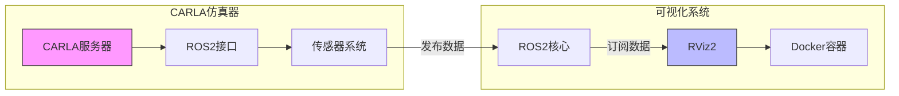
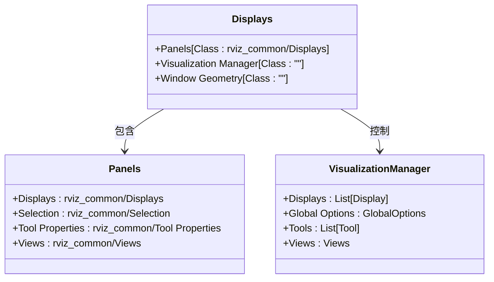
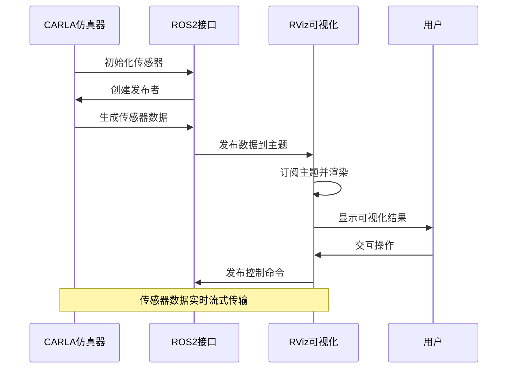
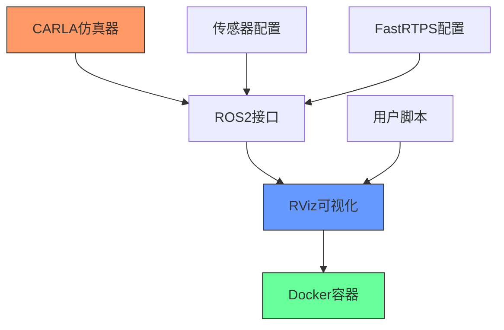

# 可视化配置

**本文档中引用的文件**  
- [ros2_native.rviz](https://github.com/carla-simulator/carla/blob/ue5-dev/PythonAPI/examples/ros2/rviz/ros2_native.rviz)
- [ros2_native.md](https://github.com/carla-simulator/carla/blob/ue5-dev/Docs/ros2_native.md)
- [ros2_native_sensors.md](https://github.com/carla-simulator/carla/blob/ue5-dev/Docs/ros2_native_sensors.md)
- [run_rviz.sh](https://github.com/carla-simulator/carla/blob/ue5-dev/PythonAPI/examples/ros2/run_rviz.sh)
- [ros2_native.py](https://github.com/carla-simulator/carla/blob/ue5-dev/PythonAPI/examples/ros2/ros2_native.py)
- [stack.json](https://github.com/carla-simulator/carla/blob/ue5-dev/PythonAPI/examples/ros2/stack.json)
- [fastrtps-profile.xml](https://github.com/carla-simulator/carla/blob/ue5-dev/PythonAPI/examples/ros2/config/fastrtps-profile.xml)
- [ROS2.cpp](https://github.com/carla-simulator/carla/blob/ue5-dev/LibCarla/source/carla/ros2/ROS2.cpp)
- [CarlaRGBCameraPublisher.h](https://github.com/carla-simulator/carla/blob/ue5-dev/LibCarla/source/carla/ros2/publishers/CarlaRGBCameraPublisher.h)
- [CarlaLidarPublisher.h](https://github.com/carla-simulator/carla/blob/ue5-dev/LibCarla/source/carla/ros2/publishers/CarlaLidarPublisher.h)
- [CarlaIMUPublisher.h](https://github.com/carla-simulator/carla/blob/ue5-dev/LibCarla/source/carla/ros2/publishers/CarlaIMUPublisher.h)

## 目录
1. [简介](#简介)
2. [项目结构](#项目结构)
3. [核心组件](#核心组件)
4. [架构概述](#架构概述)
5. [详细组件分析](#详细组件分析)
6. [依赖分析](#依赖分析)
7. [性能考虑](#性能考虑)
8. [故障排除指南](#故障排除指南)
9. [结论](#结论)

## 简介
本文档详细解析CARLA仿真环境中ROS2原生RViz配置文件的结构和内容，说明如何正确配置RViz以显示各类传感器数据（如摄像头、激光雷达、IMU等）。文档将解释各个显示面板的设置方法，包括坐标系选择、数据主题订阅和可视化样式调整，并提供从零开始创建自定义可视化配置的step-by-step指南。此外，文档还将展示如何集成车辆状态、轨迹规划和环境感知结果的综合可视化，并包含常见显示问题的故障排除方法。

## 项目结构
CARLA项目的ROS2可视化功能主要位于PythonAPI/examples/ros2目录下，包含RViz配置文件、示例脚本和相关配置。核心可视化配置通过RViz工具实现，利用ROS2接口从CARLA仿真器接收传感器数据。

**图源**  
- [ros2_native.rviz](https://github.com/carla-simulator/carla/blob/ue5-dev/PythonAPI/examples/ros2/rviz/ros2_native.rviz)
- [ros2_native.py](https://github.com/carla-simulator/carla/blob/ue5-dev/PythonAPI/examples/ros2/ros2_native.py)
- [stack.json](https://github.com/carla-simulator/carla/blob/ue5-dev/PythonAPI/examples/ros2/stack.json)
- [run_rviz.sh](https://github.com/carla-simulator/carla/blob/ue5-dev/PythonAPI/examples/ros2/run_rviz.sh)

**节源**  
- [ros2_native.rviz](https://github.com/carla-simulator/carla/blob/ue5-dev/PythonAPI/examples/ros2/rviz/ros2_native.rviz)
- [ros2_native.py](https://github.com/carla-simulator/carla/blob/ue5-dev/PythonAPI/examples/ros2/ros2_native.py)

## 核心组件
本节分析CARLA ROS2可视化系统的核心组件，包括RViz配置文件、传感器数据发布机制和可视化控制脚本。系统通过ROS2接口将CARLA仿真器中的传感器数据流式传输到RViz进行可视化。

**节源**  
- [ros2_native.rviz](https://github.com/carla-simulator/carla/blob/ue5-dev/PythonAPI/examples/ros2/rviz/ros2_native.rviz)
- [ROS2.cpp](https://github.com/carla-simulator/carla/blob/ue5-dev/LibCarla/source/carla/ros2/ROS2.cpp)
- [CarlaRGBCameraPublisher.h](https://github.com/carla-simulator/carla/blob/ue5-dev/LibCarla/source/carla/ros2/publishers/CarlaRGBCameraPublisher.h)

## 架构概述
CARLA的ROS2可视化架构采用客户端-服务器模式，其中CARLA仿真器作为数据源，通过ROS2发布传感器数据，RViz作为可视化客户端订阅并显示这些数据。整个系统通过Docker容器化方式运行RViz，确保环境一致性。

**图源**  
- [ros2_native.md](https://github.com/carla-simulator/carla/blob/ue5-dev/Docs/ros2_native.md)
- [ros2_native_sensors.md](https://github.com/carla-simulator/carla/blob/ue5-dev/Docs/ros2_native_sensors.md)
- [run_rviz.sh](https://github.com/carla-simulator/carla/blob/ue5-dev/PythonAPI/examples/ros2/run_rviz.sh)

## 详细组件分析

### RViz配置文件分析
`ros2_native.rviz`文件定义了RViz的完整可视化布局，包括显示面板、工具设置和视图配置。该配置文件组织传感器数据为逻辑组，便于用户监控和分析。

#### 显示面板配置

**图源**  
- [ros2_native.rviz](https://github.com/carla-simulator/carla/blob/ue5-dev/PythonAPI/examples/ros2/rviz/ros2_native.rviz#L1-L210)

**节源**  
- [ros2_native.rviz](https://github.com/carla-simulator/carla/blob/ue5-dev/PythonAPI/examples/ros2/rviz/ros2_native.rviz#L1-L210)

### 传感器数据流分析
CARLA通过ROS2接口发布多种传感器数据，每种传感器类型对应特定的ROS消息格式。数据流从CARLA服务器经ROS2中间件传输到RViz客户端。

#### 传感器数据流序列图

**图源**  
- [ROS2.cpp](https://github.com/carla-simulator/carla/blob/ue5-dev/LibCarla/source/carla/ros2/ROS2.cpp#L77-L749)
- [ros2_native_sensors.md](https://github.com/carla-simulator/carla/blob/ue5-dev/Docs/ros2_native_sensors.md)

**节源**  
- [ROS2.cpp](https://github.com/carla-simulator/carla/blob/ue5-dev/LibCarla/source/carla/ros2/ROS2.cpp#L77-L749)
- [ros2_native_sensors.md](https://github.com/carla-simulator/carla/blob/ue5-dev/Docs/ros2_native_sensors.md)

### 传感器类型与主题映射
CARLA支持多种传感器类型，每种传感器发布到特定的ROS主题。主题命名遵循统一的模式：`/carla/[<父角色名称>]/<传感器角色名称>`。

#### 传感器主题映射表
| 传感器类型 | ROS主题 | 消息类型 |
|---------|--------|--------|
| RGB摄像头 | `/carla/[<PARENT ROLE NAME>]/<SENSOR ROLE NAME>/image` | sensor_msgs/Image |
| 深度摄像头 | `/carla/[<PARENT ROLE NAME>]/<SENSOR ROLE NAME>/image` | sensor_msgs/Image |
| 语义分割摄像头 | `/carla/[<PARENT ROLE NAME>]/<SENSOR ROLE NAME>/image` | sensor_msgs/Image |
| 激光雷达 | `/carla/[<PARENT ROLE NAME>]/<SENSOR ROLE NAME>` | sensor_msgs/PointCloud2 |
| IMU | `/carla/[<PARENT ROLE NAME>]/<SENSOR ROLE NAME>` | sensor_msgs/Imu |
| GNSS | `/carla/[<PARENT ROLE NAME>]/<SENSOR ROLE NAME>` | sensor_msgs/NavSatFix |
| 雷达 | `/carla/[<PARENT ROLE NAME>]/<SENSOR ROLE NAME>` | sensor_msgs/PointCloud2 |

**节源**  
- [ros2_native_sensors.md](https://github.com/carla-simulator/carla/blob/ue5-dev/Docs/ros2_native_sensors.md)
- [CarlaRGBCameraPublisher.h](https://github.com/carla-simulator/carla/blob/ue5-dev/LibCarla/source/carla/ros2/publishers/CarlaRGBCameraPublisher.h)
- [CarlaLidarPublisher.h](https://github.com/carla-simulator/carla/blob/ue5-dev/LibCarla/source/carla/ros2/publishers/CarlaLidarPublisher.h)
- [CarlaIMUPublisher.h](https://github.com/carla-simulator/carla/blob/ue5-dev/LibCarla/source/carla/ros2/publishers/CarlaIMUPublisher.h)

## 依赖分析
CARLA的ROS2可视化系统依赖于多个组件和工具，包括CARLA仿真器、ROS2框架、RViz可视化工具和Docker容器化环境。

**图源**  
- [run_rviz.sh](https://github.com/carla-simulator/carla/blob/ue5-dev/PythonAPI/examples/ros2/run_rviz.sh)
- [fastrtps-profile.xml](https://github.com/carla-simulator/carla/blob/ue5-dev/PythonAPI/examples/ros2/config/fastrtps-profile.xml)
- [ros2_native.py](https://github.com/carla-simulator/carla/blob/ue5-dev/PythonAPI/examples/ros2/ros2_native.py)

**节源**  
- [run_rviz.sh](https://github.com/carla-simulator/carla/blob/ue5-dev/PythonAPI/examples/ros2/run_rviz.sh)
- [fastrtps-profile.xml](https://github.com/carla-simulator/carla/blob/ue5-dev/PythonAPI/examples/ros2/config/fastrtps-profile.xml)
- [ros2_native.py](https://github.com/carla-simulator/carla/blob/ue5-dev/PythonAPI/examples/ros2/ros2_native.py)

## 性能考虑
CARLA的ROS2可视化系统在性能方面需要考虑数据传输带宽、处理延迟和可视化刷新率。系统通过配置参数优化性能表现。

- **数据传输**: 使用FastRTPS作为DDS实现，配置为同步发布模式以确保数据完整性
- **带宽优化**: 传感器数据分辨率和帧率可配置，平衡数据质量和网络负载
- **可视化性能**: RViz配置中设置适当的更新间隔和渲染质量
- **系统资源**: Docker容器化部署确保资源隔离和环境一致性

## 故障排除指南
本节分析常见的可视化问题及其解决方案，帮助用户快速诊断和修复问题。

**节源**  
- [ros2_native.md](https://github.com/carla-simulator/carla/blob/ue5-dev/Docs/ros2_native.md)
- [README.md](https://github.com/carla-simulator/carla/blob/ue5-dev/PythonAPI/examples/ros2/README.md)
- [run_rviz.sh](https://github.com/carla-simulator/carla/blob/ue5-dev/PythonAPI/examples/ros2/run_rviz.sh)

### 常见问题及解决方案
1. **RViz无法启动**
   - 检查Docker是否正确安装和运行
   - 验证X11转发权限配置
   - 确认网络连接和防火墙设置

2. **传感器数据未显示**
   - 确认CARLA服务器已使用`--ros2`参数启动
   - 检查传感器是否已启用ROS2输出
   - 验证主题名称和订阅设置

3. **数据延迟或卡顿**
   - 检查网络带宽和延迟
   - 调整传感器数据分辨率和帧率
   - 优化FastRTPS配置参数

4. **坐标系错位**
   - 确认固定坐标系设置正确
   - 检查传感器变换关系
   - 验证TF树完整性

## 结论
CARLA的ROS2原生可视化系统提供了一套完整的解决方案，用于显示仿真环境中的各类传感器数据。通过`ros2_native.rviz`配置文件，用户可以方便地设置和管理多个传感器的可视化显示。系统采用模块化设计，支持从摄像头到激光雷达等多种传感器类型，并通过标准化的ROS消息格式实现数据交换。建议用户根据具体需求调整传感器配置和可视化参数，以获得最佳的性能和用户体验。