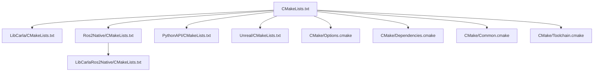
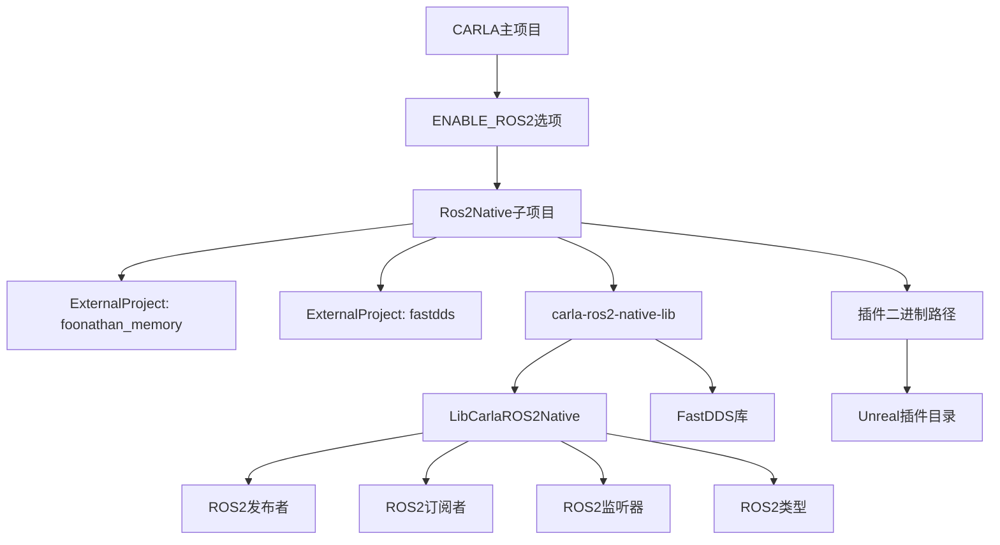
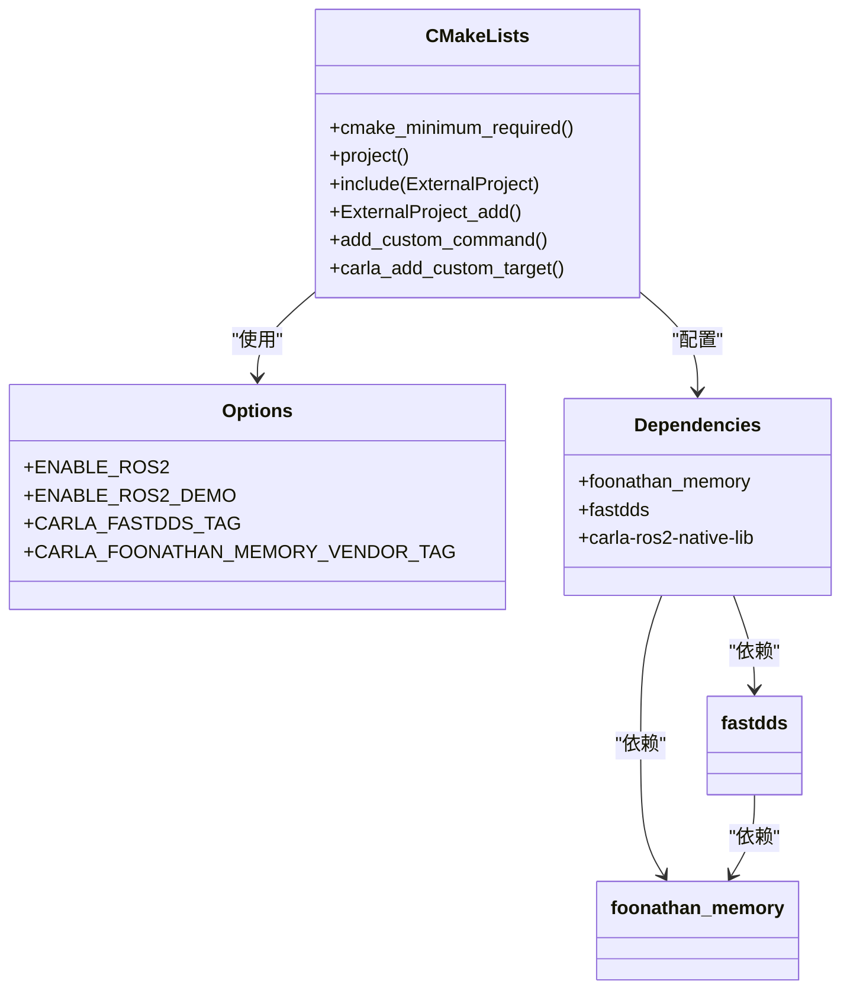
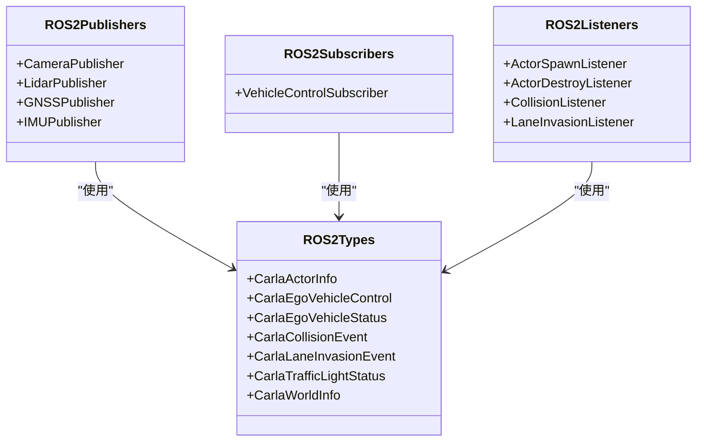
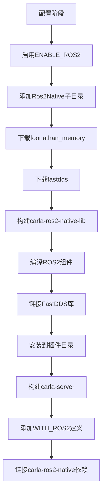
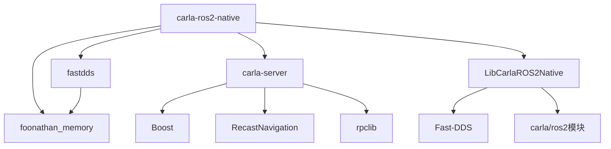

# 构建系统集成


**本文档中引用的文件**   
- [CMakeLists.txt](https://github.com/carla-simulator/carla/blob/ue5-dev/CMakeLists.txt)
- [LibCarla/CMakeLists.txt](https://github.com/carla-simulator/carla/blob/ue5-dev/LibCarla/CMakeLists.txt)
- [Ros2Native/CMakeLists.txt](https://github.com/carla-simulator/carla/blob/ue5-dev/Ros2Native/CMakeLists.txt)
- [Ros2Native/LibCarlaRos2Native/CMakeLists.txt](https://github.com/carla-simulator/carla/blob/ue5-dev/Ros2Native/LibCarlaRos2Native/CMakeLists.txt)
- [CMake/Options.cmake](https://github.com/carla-simulator/carla/blob/ue5-dev/CMake/Options.cmake)
- [CMake/Dependencies.cmake](https://github.com/carla-simulator/carla/blob/ue5-dev/CMake/Dependencies.cmake)
- [CMake/Common.cmake](https://github.com/carla-simulator/carla/blob/ue5-dev/CMake/Common.cmake)
- [CMake/Toolchain.cmake](https://github.com/carla-simulator/carla/blob/ue5-dev/CMake/Toolchain.cmake)
- [CMakePresets.json](https://github.com/carla-simulator/carla/blob/ue5-dev/CMakePresets.json)
- [Docs/ros2_native.md](https://github.com/carla-simulator/carla/blob/ue5-dev/Docs/ros2_native.md)
- [Docs/ros2_native_msgs.md](https://github.com/carla-simulator/carla/blob/ue5-dev/Docs/ros2_native_msgs.md)
- [PythonAPI/examples/ros2/ros2_native.py](https://github.com/carla-simulator/carla/blob/ue5-dev/PythonAPI/examples/ros2/ros2_native.py)
- [PythonAPI/examples/ros2/config/fastrtps-profile.xml](https://github.com/carla-simulator/carla/blob/ue5-dev/PythonAPI/examples/ros2/config/fastrtps-profile.xml)


## 目录
1. [简介](#简介)
2. [项目结构](#项目结构)
3. [核心构建组件](#核心构建组件)
4. [ROS2集成架构](#ros2集成架构)
5. [详细组件分析](#详细组件分析)
6. [依赖关系分析](#依赖关系分析)
7. [构建流程指南](#构建流程指南)
8. [常见构建错误解决方案](#常见构建错误解决方案)
9. [持续集成最佳实践](#持续集成最佳实践)
10. [附录](#附录)

## 简介
本文档全面文档化了CARLA与ROS2的构建系统集成过程，详细说明了如何在CMakeLists.txt中配置ament和colcon构建工具。文档解释了如何正确声明ROS2依赖、消息类型和编译目标，确保跨平台构建的兼容性。提供了从源码编译到包管理的完整流程指南，包括环境变量设置、依赖解析和链接配置。针对常见构建错误（如库版本冲突、路径问题）提供了详细的解决方案，并为持续集成环境提供了最佳实践建议。

## 项目结构
CARLA项目的构建系统采用模块化设计，通过多个CMakeLists.txt文件组织不同组件的构建过程。核心构建文件包括根目录的CMakeLists.txt、LibCarla模块的CMakeLists.txt以及专门用于ROS2集成的Ros2Native模块。



**Diagram sources**
- [CMakeLists.txt](https://github.com/carla-simulator/carla/blob/ue5-dev/CMakeLists.txt#L1-L142)
- [LibCarla/CMakeLists.txt](https://github.com/carla-simulator/carla/blob/ue5-dev/LibCarla/CMakeLists.txt#L1-L382)
- [Ros2Native/CMakeLists.txt](https://github.com/carla-simulator/carla/blob/ue5-dev/Ros2Native/CMakeLists.txt#L1-L76)
- [CMake/Options.cmake](https://github.com/carla-simulator/carla/blob/ue5-dev/CMake/Options.cmake#L1-L480)
- [CMake/Dependencies.cmake](https://github.com/carla-simulator/carla/blob/ue5-dev/CMake/Dependencies.cmake#L1-L280)
- [CMake/Common.cmake](https://github.com/carla-simulator/carla/blob/ue5-dev/CMake/Common.cmake#L1-L262)
- [CMake/Toolchain.cmake](https://github.com/carla-simulator/carla/blob/ue5-dev/CMake/Toolchain.cmake#L1-L211)

**Section sources**
- [CMakeLists.txt](https://github.com/carla-simulator/carla/blob/ue5-dev/CMakeLists.txt#L1-L142)
- [project_structure](https://github.com/carla-simulator/carla/blob/ue5-dev/project_structure)

## 核心构建组件

CARLA的构建系统由多个核心组件构成，包括主构建文件、选项配置、依赖管理、通用配置和工具链配置。这些组件协同工作，确保跨平台构建的一致性和可靠性。

**Section sources**
- [CMakeLists.txt](https://github.com/carla-simulator/carla/blob/ue5-dev/CMakeLists.txt#L1-L142)
- [CMake/Options.cmake](https://github.com/carla-simulator/carla/blob/ue5-dev/CMake/Options.cmake#L1-L480)
- [CMake/Dependencies.cmake](https://github.com/carla-simulator/carla/blob/ue5-dev/CMake/Dependencies.cmake#L1-L280)
- [CMake/Common.cmake](https://github.com/carla-simulator/carla/blob/ue5-dev/CMake/Common.cmake#L1-L262)
- [CMake/Toolchain.cmake](https://github.com/carla-simulator/carla/blob/ue5-dev/CMake/Toolchain.cmake#L1-L211)

## ROS2集成架构

CARLA通过专门的Ros2Native模块实现与ROS2的深度集成。该架构采用分层设计，确保ROS2功能的模块化和可配置性。



**Diagram sources**
- [CMakeLists.txt](https://github.com/carla-simulator/carla/blob/ue5-dev/CMakeLists.txt#L95-L97)
- [Ros2Native/CMakeLists.txt](https://github.com/carla-simulator/carla/blob/ue5-dev/Ros2Native/CMakeLists.txt#L1-L76)
- [Ros2Native/LibCarlaRos2Native/CMakeLists.txt](https://github.com/carla-simulator/carla/blob/ue5-dev/Ros2Native/LibCarlaRos2Native/CMakeLists.txt#L1-L64)
- [LibCarla/CMakeLists.txt](https://github.com/carla-simulator/carla/blob/ue5-dev/LibCarla/CMakeLists.txt#L114-L125)

**Section sources**
- [CMakeLists.txt](https://github.com/carla-simulator/carla/blob/ue5-dev/CMakeLists.txt#L95-L97)
- [Ros2Native/CMakeLists.txt](https://github.com/carla-simulator/carla/blob/ue5-dev/Ros2Native/CMakeLists.txt#L1-L76)
- [Docs/ros2_native.md](https://github.com/carla-simulator/carla/blob/ue5-dev/Docs/ros2_native.md#L1-L64)

## 详细组件分析

### ROS2集成组件分析
CARLA的ROS2集成通过多个层次的组件实现，从构建系统配置到运行时功能集成。

#### 构建系统配置


**Diagram sources**
- [CMake/Options.cmake](https://github.com/carla-simulator/carla/blob/ue5-dev/CMake/Options.cmake#L54-L63)
- [Ros2Native/CMakeLists.txt](https://github.com/carla-simulator/carla/blob/ue5-dev/Ros2Native/CMakeLists.txt#L1-L76)
- [CMake/Dependencies.cmake](https://github.com/carla-simulator/carla/blob/ue5-dev/CMake/Dependencies.cmake#L1-L280)

#### ROS2消息类型组件


**Diagram sources**
- [LibCarlaRos2Native/CMakeLists.txt](https://github.com/carla-simulator/carla/blob/ue5-dev/Ros2Native/LibCarlaRos2Native/CMakeLists.txt#L15-L31)
- [LibCarla/source/carla/ros2/publishers](https://github.com/carla-simulator/carla/blob/ue5-dev/LibCarla/source/carla/ros2/publishers)
- [LibCarla/source/carla/ros2/subscribers](https://github.com/carla-simulator/carla/blob/ue5-dev/LibCarla/source/carla/ros2/subscribers)
- [LibCarla/source/carla/ros2/listeners](https://github.com/carla-simulator/carla/blob/ue5-dev/LibCarla/source/carla/ros2/listeners)
- [LibCarla/source/carla/ros2/types](https://github.com/carla-simulator/carla/blob/ue5-dev/LibCarla/source/carla/ros2/types)

### 构建流程组件分析


**Diagram sources**
- [CMakeLists.txt](https://github.com/carla-simulator/carla/blob/ue5-dev/CMakeLists.txt#L95-L97)
- [Ros2Native/CMakeLists.txt](https://github.com/carla-simulator/carla/blob/ue5-dev/Ros2Native/CMakeLists.txt#L1-L76)
- [LibCarla/CMakeLists.txt](https://github.com/carla-simulator/carla/blob/ue5-dev/LibCarla/CMakeLists.txt#L114-L125)
- [LibCarla/CMakeLists.txt](https://github.com/carla-simulator/carla/blob/ue5-dev/LibCarla/CMakeLists.txt#L226-L228)

**Section sources**
- [CMakeLists.txt](https://github.com/carla-simulator/carla/blob/ue5-dev/CMakeLists.txt#L95-L97)
- [Ros2Native/CMakeLists.txt](https://github.com/carla-simulator/carla/blob/ue5-dev/Ros2Native/CMakeLists.txt#L1-L76)
- [LibCarla/CMakeLists.txt](https://github.com/carla-simulator/carla/blob/ue5-dev/LibCarla/CMakeLists.txt#L114-L125)

## 依赖关系分析

CARLA的ROS2集成依赖于多个第三方库和内部组件，这些依赖关系通过CMake的ExternalProject机制进行管理。



**Diagram sources**
- [Ros2Native/CMakeLists.txt](https://github.com/carla-simulator/carla/blob/ue5-dev/Ros2Native/CMakeLists.txt#L12-L46)
- [LibCarla/CMakeLists.txt](https://github.com/carla-simulator/carla/blob/ue5-dev/LibCarla/CMakeLists.txt#L198-L211)
- [Ros2Native/LibCarlaRos2Native/CMakeLists.txt](https://github.com/carla-simulator/carla/blob/ue5-dev/Ros2Native/LibCarlaRos2Native/CMakeLists.txt#L53-L56)
- [CMake/Dependencies.cmake](https://github.com/carla-simulator/carla/blob/ue5-dev/CMake/Dependencies.cmake#L1-L280)

**Section sources**
- [Ros2Native/CMakeLists.txt](https://github.com/carla-simulator/carla/blob/ue5-dev/Ros2Native/CMakeLists.txt#L12-L46)
- [CMake/Dependencies.cmake](https://github.com/carla-simulator/carla/blob/ue5-dev/CMake/Dependencies.cmake#L1-L280)
- [CMake/Options.cmake](https://github.com/carla-simulator/carla/blob/ue5-dev/CMake/Options.cmake#L440-L479)

## 构建流程指南

### 启用ROS2构建
要启用CARLA的ROS2功能，需要在CMake配置时设置ENABLE_ROS2选项：

```bash
cmake -G Ninja -S . -B Build --toolchain=$PWD/CMake/Toolchain.cmake -DCMAKE_BUILD_TYPE=Release -DENABLE_ROS2=ON
```

此配置会触发Ros2Native子项目的构建，包括foonathan_memory、fastdds和carla-ros2-native-lib等依赖项。

### 构建目标
CARLA的构建系统定义了多个与ROS2相关的构建目标：

- **carla-ros2-native**: 构建ROS2原生接口库
- **carla-server**: 当ENABLE_ROS2启用时，会链接ROS2相关代码
- **package**: 打包包含ROS2功能的CARLA发行版

### 环境变量设置
构建ROS2集成需要正确设置以下环境变量：

- **CARLA_UNREAL_ENGINE_PATH**: 指向CARLA定制的Unreal Engine安装路径
- **UE_ROOT**: Unreal Engine根路径
- **CMAKE_TOOLCHAIN_FILE**: 指向CMake/Toolchain.cmake文件

### 依赖解析
CARLA使用CMake的ExternalProject模块自动下载和构建ROS2依赖：

1. **foonathan_memory**: 内存管理库，被fastdds依赖
2. **fastdds**: eProsima的DDS实现，用于ROS2通信
3. **carla-ros2-native-lib**: CARLA特定的ROS2集成库

这些依赖项被构建并安装到临时目录，然后链接到主项目。

### 链接配置
ROS2相关库的链接配置在LibCarla/CMakeLists.txt中完成：

```cmake
if (ENABLE_ROS2)
    set (CARLA_ROS2_DEFINITIONS WITH_ROS2)
    add_dependencies (carla-server carla-ros2-native)
endif ()
```

这确保了当ENABLE_ROS2启用时，carla-server目标会依赖于carla-ros2-native目标，并定义WITH_ROS2预处理器宏。

**Section sources**
- [CMakeLists.txt](https://github.com/carla-simulator/carla/blob/ue5-dev/CMakeLists.txt#L95-L97)
- [CMake/Options.cmake](https://github.com/carla-simulator/carla/blob/ue5-dev/CMake/Options.cmake#L54-L63)
- [Ros2Native/CMakeLists.txt](https://github.com/carla-simulator/carla/blob/ue5-dev/Ros2Native/CMakeLists.txt#L1-L76)
- [LibCarla/CMakeLists.txt](https://github.com/carla-simulator/carla/blob/ue5-dev/LibCarla/CMakeLists.txt#L114-L125)
- [build_linux_ue5.md](https://github.com/carla-simulator/carla/blob/ue5-dev/Docs/build_linux_ue5.md#L78-L82)
- [Jenkinsfile](https://github.com/carla-simulator/carla/blob/ue5-dev/Jenkinsfile#L1-L36)

## 常见构建错误解决方案

### 库版本冲突
**问题**: foonathan_memory或fastdds版本不兼容
**解决方案**: 
1. 确保使用CMake/Options.cmake中定义的正确版本标签
2. 清理构建目录并重新配置
3. 检查CARLA_FASTDDS_TAG和CARLA_FOONATHAN_MEMORY_VENDOR_TAG的值

### 路径问题
**问题**: Unreal Engine路径未正确设置
**解决方案**:
1. 设置CARLA_UNREAL_ENGINE_PATH环境变量
2. 或在CMake配置时通过-D选项指定路径
3. 确保路径指向正确的Unreal Engine 5安装

### 编译器兼容性
**问题**: 编译器不兼容Unreal Engine的clang版本
**解决方案**:
1. 使用CMake/Toolchain.cmake中指定的clang版本
2. 确保CMAKE_C_COMPILER和CMAKE_CXX_COMPILER指向正确的编译器
3. 检查TARGET_TRIPLE设置是否正确

### 依赖下载失败
**问题**: ExternalProject无法下载依赖
**解决方案**:
1. 检查网络连接
2. 确认URL是否正确
3. 手动下载并放置到正确位置
4. 使用PREFER_CLONE选项从git仓库克隆

### 链接错误
**问题**: 无法找到fastdds或foonathan_memory符号
**解决方案**:
1. 确认ExternalProject已成功构建依赖
2. 检查PROJECT_INSTALL_PATH中的库文件是否存在
3. 验证target_link_libraries中的路径是否正确

**Section sources**
- [CMake/Toolchain.cmake](https://github.com/carla-simulator/carla/blob/ue5-dev/CMake/Toolchain.cmake#L1-L211)
- [Ros2Native/CMakeLists.txt](https://github.com/carla-simulator/carla/blob/ue5-dev/Ros2Native/CMakeLists.txt#L12-L46)
- [LibCarla/CMakeLists.txt](https://github.com/carla-simulator/carla/blob/ue5-dev/LibCarla/CMakeLists.txt#L198-L211)
- [CMake/Options.cmake](https://github.com/carla-simulator/carla/blob/ue5-dev/CMake/Options.cmake#L440-L479)

## 持续集成最佳实践

### 配置管理
在持续集成环境中，建议使用CMakePresets.json进行标准化配置：

```json
{
  "version": 4,
  "cmakeMinimumRequired": {
    "major": 3,
    "minor": 27,
    "patch": 2
  },
  "configurePresets": [
    {
      "name": "Common",
      "generator": "Ninja",
      "binaryDir": "${sourceDir}/Build/${presetName}",
      "installDir": "${sourceDir}/Install/${presetName}",
      "cacheVariables": {
        "CMAKE_TOOLCHAIN_FILE": "${sourceDir}/CMake/Toolchain.cmake"
      },
      "hidden": true
    },
    {
      "name": "Development",
      "inherits": "Common",
      "cacheVariables": {
        "CMAKE_BUILD_TYPE": "RelWithDebInfo",
        "CMAKE_EXPORT_COMPILE_COMMANDS": true,
        "ENABLE_ROS2": "ON"
      }
    }
  ]
}
```

### 构建脚本
使用标准化的构建脚本确保一致性：

```bash
cmake --preset=Development
cmake --build Build-Development --target package
```

### 依赖缓存
在CI环境中，建议缓存ExternalProject的下载内容以提高构建速度：

1. 缓存${CMAKE_CURRENT_BINARY_DIR}/install目录
2. 缓存ExternalProject的下载缓存
3. 使用本地镜像服务器加速下载

### 并行构建
利用Ninja生成器的并行构建能力：

```bash
cmake --build Build --parallel $(nproc)
```

### 构建验证
在CI流程中添加构建验证步骤：

1. 检查生成的库文件是否存在
2. 验证符号链接是否正确
3. 运行基本的功能测试

**Section sources**
- [CMakePresets.json](https://github.com/carla-simulator/carla/blob/ue5-dev/CMakePresets.json#L1-L50)
- [Jenkinsfile](https://github.com/carla-simulator/carla/blob/ue5-dev/Jenkinsfile#L1-L36)
- [CMake/Toolchain.cmake](https://github.com/carla-simulator/carla/blob/ue5-dev/CMake/Toolchain.cmake#L1-L211)
- [CMake/Options.cmake](https://github.com/carla-simulator/carla/blob/ue5-dev/CMake/Options.cmake#L54-L63)

## 附录

### ROS2消息参考
CARLA支持多种ROS2消息类型，包括：

- **CarlaActorInfo**: 演员基本信息
- **CarlaEgoVehicleControl**: 车辆控制命令
- **CarlaEgoVehicleStatus**: 车辆状态信息
- **CarlaCollisionEvent**: 碰撞事件
- **CarlaLaneInvasionEvent**: 车道入侵事件
- **CarlaTrafficLightStatus**: 交通灯状态
- **CarlaWorldInfo**: 世界信息

### 示例配置
CARLA提供了ROS2示例配置文件：

- **fastrtps-profile.xml**: FastDDS配置文件，定义传输描述符和发布者配置
- **ros2_native.py**: Python示例脚本，展示如何使用ROS2接口

### 工具链配置
CMake/Toolchain.cmake文件配置了Unreal Engine特定的构建工具链，包括：

- clang编译器路径
- libc++标准库
- Unreal Engine特定的编译选项
- 交叉编译工具链设置

**Section sources**
- [Docs/ros2_native_msgs.md](https://github.com/carla-simulator/carla/blob/ue5-dev/Docs/ros2_native_msgs.md#L1-L332)
- [PythonAPI/examples/ros2/config/fastrtps-profile.xml](https://github.com/carla-simulator/carla/blob/ue5-dev/PythonAPI/examples/ros2/config/fastrtps-profile.xml#L1-L28)
- [PythonAPI/examples/ros2/ros2_native.py](https://github.com/carla-simulator/carla/blob/ue5-dev/PythonAPI/examples/ros2/ros2_native.py#L1-L132)
- [CMake/Toolchain.cmake](https://github.com/carla-simulator/carla/blob/ue5-dev/CMake/Toolchain.cmake#L1-L211)