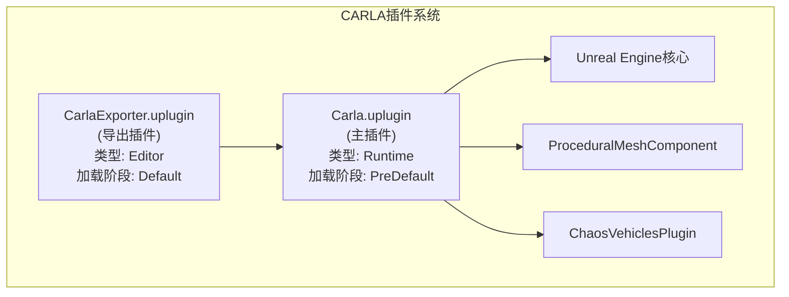
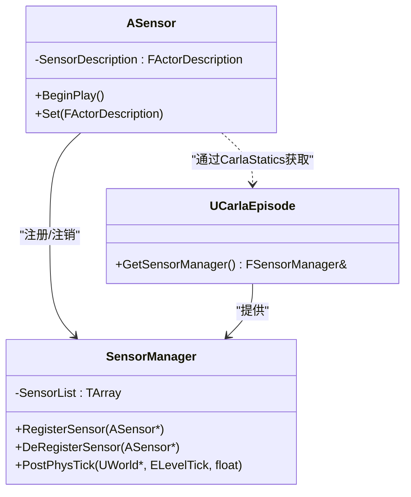
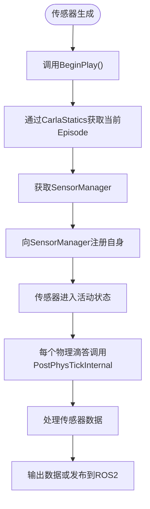
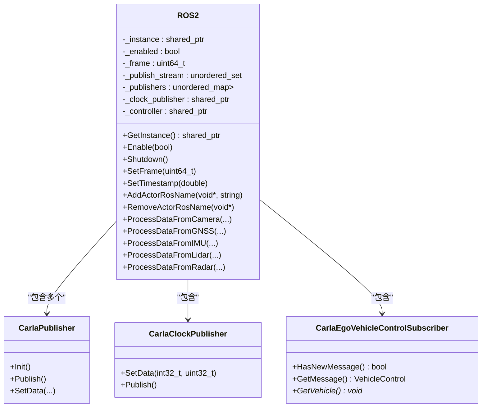
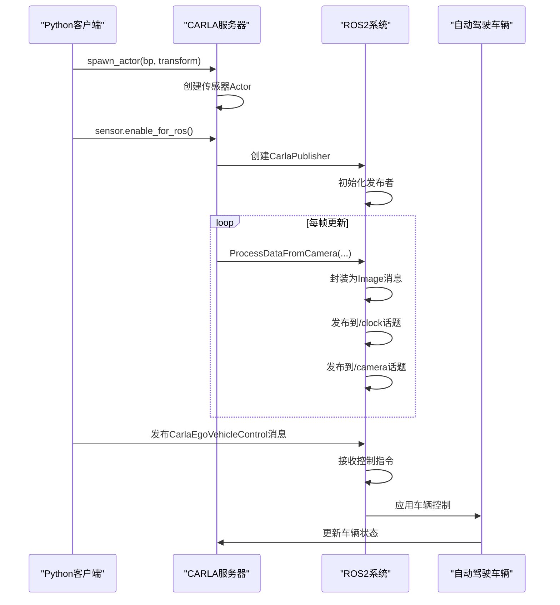
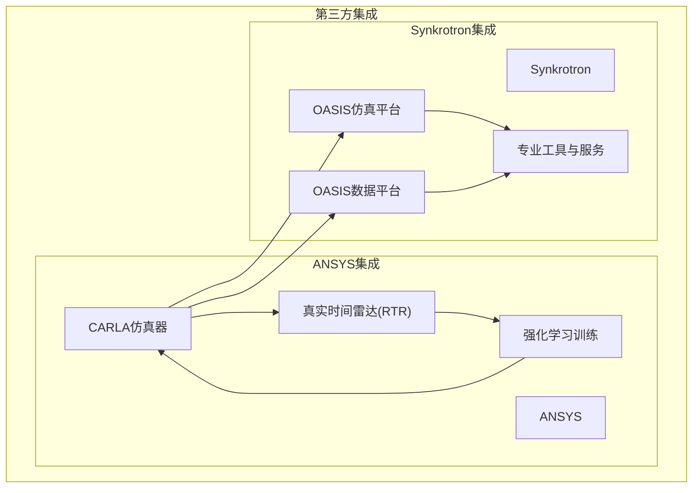
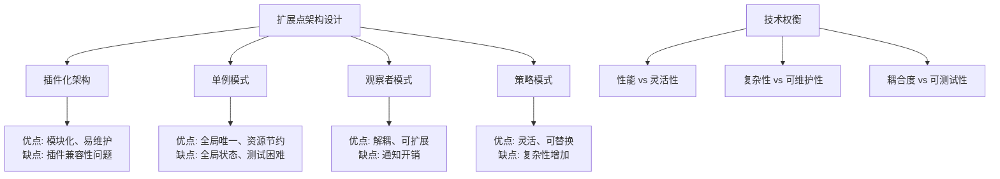

# 扩展与集成

> **引用文件**
> **本文档中引用的文件**

- [Carla.uplugin](https://github.com/carla-simulator/carla/blob/ue5-dev/Unreal/CarlaUnreal/Plugins/Carla/Carla.uplugin)
- [CarlaExporter.uplugin](https://github.com/carla-simulator/carla/blob/ue5-dev/Unreal/CarlaUnreal/Plugins/CarlaExporter/CarlaExporter.uplugin)
- [ROS2.h](https://github.com/carla-simulator/carla/blob/ue5-dev/LibCarla/source/carla/ros2/ROS2.h)
- [ROS2.cpp](https://github.com/carla-simulator/carla/blob/ue5-dev/LibCarla/source/carla/ros2/ROS2.cpp)
- [SensorRegistry.h](https://github.com/carla-simulator/carla/blob/ue5-dev/LibCarla/source/carla/sensor/SensorRegistry.h)
- [ros2_native.md](https://github.com/carla-simulator/carla/blob/ue5-dev/Docs/ros2_native.md)
- [ros2_native_sensors.md](https://github.com/carla-simulator/carla/blob/ue5-dev/Docs/ros2_native_sensors.md)
- [ecosys_ansys.md](https://github.com/carla-simulator/carla/blob/ue5-dev/Docs/ecosys_ansys.md)
- [ecosys_synkrotron.md](https://github.com/carla-simulator/carla/blob/ue5-dev/Docs/ecosys_synkrotron.md)
- [ros2_native.py](https://github.com/carla-simulator/carla/blob/ue5-dev/PythonAPI/examples/ros2/ros2_native.py)
- [CarlaEgoVehicleControl.h](https://github.com/carla-simulator/carla/blob/ue5-dev/LibCarla/source/carla/ros2/types/CarlaEgoVehicleControl.h)
- [CarlaEgoVehicleControlPubSubTypes.h](https://github.com/carla-simulator/carla/blob/ue5-dev/LibCarla/source/carla/ros2/types/CarlaEgoVehicleControlPubSubTypes.h)
- [SensorManager.h](https://github.com/carla-simulator/carla/blob/ue5-dev/Unreal/CarlaUnreal/Plugins/Carla/Source/Carla/Sensor/SensorManager.h)
- [SensorManager.cpp](https://github.com/carla-simulator/carla/blob/ue5-dev/Unreal/CarlaUnreal/Plugins/Carla/Source/Carla/Sensor/SensorManager.cpp)
- [Sensor.cpp](https://github.com/carla-simulator/carla/blob/ue5-dev/Unreal/CarlaUnreal/Plugins/Carla/Source/Carla/Sensor/Sensor.cpp)
- [ShaderBasedSensor.h](https://github.com/carla-simulator/carla/blob/ue5-dev/Unreal/CarlaUnreal/Plugins/Carla/Source/Carla/Sensor/ShaderBasedSensor.h)

## 目录

1. [简介](#简介)
2. [插件系统架构](#插件系统架构)
3. [自定义传感器开发](#自定义传感器开发)
4. [ROS2 集成](#ros2集成)
5. [第三方工具集成](#第三方工具集成)
6. [扩展点架构设计](#扩展点架构设计)
7. [初学者扩展示例](#初学者扩展示例)
8. [高级开发者最佳实践](#高级开发者最佳实践)
9. [安全考虑与兼容性](#安全考虑与兼容性)
10. [结论](#结论)

## 简介

CARLA 仿真器是一个开源的自动驾驶研究平台，支持通过插件系统、自定义传感器和第三方工具进行功能扩展。本文档详细介绍了 CARLA 的扩展与集成机制，重点涵盖 Unreal Engine 插件架构、自定义传感器开发、ROS2 原生集成以及与 ANSYS、Synkrotron 等第三方工具的集成方案。文档为初学者提供简单示例，同时为经验丰富的开发者提供深入的技术细节和最佳实践。

## 插件系统架构

CARLA 仿真器基于 Unreal Engine 构建，其功能扩展主要通过 Unreal 插件系统实现。核心插件包括主 CARLA 插件和 CarlaExporter 插件，分别负责仿真核心功能和几何导出功能。

主 CARLA 插件（Carla.uplugin）定义了运行时模块，类型为"Runtime"，在 PreDefault 阶段加载，确保在游戏启动前初始化。该插件依赖于 Unreal Engine 核心模块，并启用了 ProceduralMeshComponent 和 ChaosVehiclesPlugin 等关键子插件，为仿真提供程序化网格和物理车辆支持。



**图源**

- [Carla.uplugin](https://github.com/carla-simulator/carla/blob/ue5-dev/Unreal/CarlaUnreal/Plugins/Carla/Carla.uplugin)
- [CarlaExporter.uplugin](https://github.com/carla-simulator/carla/blob/ue5-dev/Unreal/CarlaUnreal/Plugins/CarlaExporter/CarlaExporter.uplugin)

CarlaExporter 插件（CarlaExporter.uplugin）是一个编辑器插件，类型为"Editor"，在 Default 阶段加载。其主要功能是将场景几何体导出以供 Recast 导航网格使用，不包含内容资源（CanContainContent: false），表明其专注于工具功能而非资产存储。

**本节来源**

- [Carla.uplugin](https://github.com/carla-simulator/carla/blob/ue5-dev/Unreal/CarlaUnreal/Plugins/Carla/Carla.uplugin)
- [CarlaExporter.uplugin](https://github.com/carla-simulator/carla/blob/ue5-dev/Unreal/CarlaUnreal/Plugins/CarlaExporter/CarlaExporter.uplugin)

## 自定义传感器开发

CARLA 的传感器系统基于面向对象设计，所有传感器继承自基类 ASensor。传感器的生命周期管理通过 SensorManager 实现，该管理器负责注册、注销和更新所有活动传感器。

当传感器 Actor 在 Unreal 中生成时，其 BeginPlay 方法会被调用，此时传感器会向当前 Episode 的 SensorManager 注册自己。SensorManager 维护一个传感器列表，并在每个物理滴答（PostPhysTick）时遍历该列表，调用每个传感器的 PostPhysTickInternal 方法，实现传感器数据的同步更新。



**图源**

- <a href="https://github.com/carla-simulator/carla/blob/ue5-dev/Unreal/CarlaUnreal/Plugins/Carla/Source/Carla/Sensor/Sensor.cpp#L30-L36" target="_blank">Sensor.cpp</a>
- <a href="https://github.com/carla-simulator/carla/blob/ue5-dev/Unreal/CarlaUnreal/Plugins/Carla/Source/Carla/Sensor/SensorManager.h#L16-L18" target="_blank">SensorManager.h</a>
- <a href="https://github.com/carla-simulator/carla/blob/ue5-dev/Unreal/CarlaUnreal/Plugins/Carla/Source/Carla/Sensor/SensorManager.cpp#L10-L27" target="_blank">SensorManager.cpp</a>

对于基于着色器的传感器（如摄像头），CARLA 提供了 ShaderBasedSensor 基类，允许通过蓝图或代码添加后处理着色器。开发者可以通过 AddShader 方法将自定义着色器添加到传感器，实现图像后处理效果。



**图源**

- <a href="https://github.com/carla-simulator/carla/blob/ue5-dev/Unreal/CarlaUnreal/Plugins/Carla/Source/Carla/Sensor/Sensor.cpp#L30-L36" target="_blank">Sensor.cpp</a>
- <a href="https://github.com/carla-simulator/carla/blob/ue5-dev/Unreal/CarlaUnreal/Plugins/Carla/Source/Carla/Sensor/SensorManager.cpp#L20-L27" target="_blank">SensorManager.cpp</a>
- <a href="https://github.com/carla-simulator/carla/blob/ue5-dev/Unreal/CarlaUnreal/Plugins/Carla/Source/Carla/Sensor/ShaderBasedSensor.h#L110-L114" target="_blank">ShaderBasedSensor.h</a>

传感器类型注册通过 SensorRegistry 机制实现，该机制使用编译时类型映射将传感器类与其序列化器关联。新传感器的注册需要四个步骤：包含序列化器头文件、添加传感器前向声明、在 SensorRegistry 中注册传感器-序列化器对，以及在条件编译块中包含传感器实现头文件。

**本节来源**

- [Sensor.cpp](https://github.com/carla-simulator/carla/blob/ue5-dev/Unreal/CarlaUnreal/Plugins/Carla/Source/Carla/Sensor/Sensor.cpp)
- [SensorManager.h](https://github.com/carla-simulator/carla/blob/ue5-dev/Unreal/CarlaUnreal/Plugins/Carla/Source/Carla/Sensor/SensorManager.h)
- [SensorManager.cpp](https://github.com/carla-simulator/carla/blob/ue5-dev/Unreal/CarlaUnreal/Plugins/Carla/Source/Carla/Sensor/SensorManager.cpp)
- [ShaderBasedSensor.h](https://github.com/carla-simulator/carla/blob/ue5-dev/Unreal/CarlaUnreal/Plugins/Carla/Source/Carla/Sensor/ShaderBasedSensor.h)
- [SensorRegistry.h](https://github.com/carla-simulator/carla/blob/ue5-dev/LibCarla/source/carla/sensor/SensorRegistry.h)

## ROS2 集成

CARLA 仿真器支持从服务器端原生集成 ROS2，通过`--ros2`命令行参数启动即可启用 ROS2 接口。该集成采用发布-订阅模式，CARLA 服务器作为 ROS2 节点发布传感器数据和时钟信息，同时订阅控制指令。

ROS2 系统的核心是 ROS2 单例类，负责管理所有发布者、订阅者和通信状态。该类采用单例模式确保全局唯一实例，通过 GetInstance()方法获取。其主要职责包括：启用/禁用 ROS2 功能、管理时间同步、处理传感器数据发布和接收控制指令。



**图源**

- <a href="https://github.com/carla-simulator/carla/blob/ue5-dev/LibCarla/source/carla/ros2/ROS2.h#L47-L173" target="_blank">ROS2.h</a>
- <a href="https://github.com/carla-simulator/carla/blob/ue5-dev/LibCarla/source/carla/ros2/ROS2.cpp#L51-L53" target="_blank">ROS2.cpp</a>

传感器数据发布流程如下：首先在 Python 客户端通过 set_attribute('ros_name', 'sensor_name')设置传感器的 ROS 名称，然后调用 enable_for_ros()方法启用 ROS 功能。当传感器生成时，CARLA 服务器会创建相应的发布者，并根据传感器类型和父级角色名称构建 ROS 话题路径，如`/carla/ego/front_camera/image`。

控制指令通过 CarlaEgoVehicleControl 消息接收，该消息包含油门、转向、刹车、手刹、倒车、档位和手动换挡等字段。服务器为每个标记为"ego"的车辆创建订阅者，监听`/carla/[role_name]/vehicle_control_cmd`话题。



**图源**

- [ROS2.h](https://github.com/carla-simulator/carla/blob/ue5-dev/LibCarla/source/carla/ros2/ROS2.h)
- [ROS2.cpp](https://github.com/carla-simulator/carla/blob/ue5-dev/LibCarla/source/carla/ros2/ROS2.cpp)
- [ros2_native.py](https://github.com/carla-simulator/carla/blob/ue5-dev/PythonAPI/examples/ros2/ros2_native.py)

ROS2 消息类型在 LibCarla 的 ros2/types 目录中定义，使用 C++类封装 ROS2 消息结构。例如，CarlaEgoVehicleControl 消息定义了控制车辆所需的所有参数，并通过 CarlaEgoVehicleControlPubSubTypes 实现序列化和反序列化。

**本节来源**

- [ROS2.h](https://github.com/carla-simulator/carla/blob/ue5-dev/LibCarla/source/carla/ros2/ROS2.h)
- [ROS2.cpp](https://github.com/carla-simulator/carla/blob/ue5-dev/LibCarla/source/carla/ros2/ROS2.cpp)
- [ros2_native.md](https://github.com/carla-simulator/carla/blob/ue5-dev/Docs/ros2_native.md)
- [ros2_native_sensors.md](https://github.com/carla-simulator/carla/blob/ue5-dev/Docs/ros2_native_sensors.md)
- [ros2_native.py](https://github.com/carla-simulator/carla/blob/ue5-dev/PythonAPI/examples/ros2/ros2_native.py)
- [CarlaEgoVehicleControl.h](https://github.com/carla-simulator/carla/blob/ue5-dev/LibCarla/source/carla/ros2/types/CarlaEgoVehicleControl.h)
- [CarlaEgoVehicleControlPubSubTypes.h](https://github.com/carla-simulator/carla/blob/ue5-dev/LibCarla/source/carla/ros2/types/CarlaEgoVehicleControlPubSubTypes.h)

## 第三方工具集成

CARLA 仿真器通过开放的架构设计支持与多种第三方工具的集成，其中 ANSYS 和 Synkrotron 是两个典型的集成案例。

ANSYS 通过其真实时间雷达（Real Time Radar, RTR）模型与 CARLA 集成，用于训练车辆纵向控制器。这种集成采用强化学习方法，将 CARLA 作为环境模拟器，ANSYS RTR 提供高保真的雷达传感器模型。集成方案详细介绍了模型设计、动作空间和奖励策略，实现了从仿真到真实世界的平滑过渡。

Synkrotron 基于 CARLA 构建了 OASIS 仿真解决方案套件，提供场景生成、传感器建模、交通模拟和数据管理等完整功能。OASIS 平台支持云规模部署和本地开发环境，通过容器化包装实现灵活部署。其核心功能包括：

- **OASIS 仿真平台**：支持场景导入与编辑、传感器配置、分布式任务管理和诊断分析
- **OASIS 数据平台**：管理自动驾驶研发管道中的海量数据，提供数据采集、过滤、环境重建、自动标注和场景标记功能
- **专业工具与服务**：提供鱼眼相机、高级激光雷达、SOTIF 场景生成、高精地图创建等专业工具



**图源**

- [ecosys_ansys.md](https://github.com/carla-simulator/carla/blob/ue5-dev/Docs/ecosys_ansys.md)
- [ecosys_synkrotron.md](https://github.com/carla-simulator/carla/blob/ue5-dev/Docs/ecosys_synkrotron.md)

这些集成方案展示了 CARLA 作为仿真平台的灵活性和可扩展性，通过标准化接口和开放架构，能够与不同领域的专业工具无缝集成，满足自动驾驶研发的多样化需求。

**本节来源**

- [ecosys_ansys.md](https://github.com/carla-simulator/carla/blob/ue5-dev/Docs/ecosys_ansys.md)
- [ecosys_synkrotron.md](https://github.com/carla-simulator/carla/blob/ue5-dev/Docs/ecosys_synkrotron.md)

## 扩展点架构设计

CARLA 的扩展点设计遵循模块化和松耦合原则，通过清晰的接口定义和分层架构实现功能扩展。核心设计决策包括：

1. **插件化架构**：使用 Unreal Engine 的插件系统，将核心功能与扩展功能分离，确保主程序的稳定性和扩展性。
2. **单例模式**：对于全局服务（如 ROS2 系统），采用单例模式确保资源的唯一性和全局可访问性。
3. **观察者模式**：传感器系统采用观察者模式，SensorManager 作为主题，传感器作为观察者，实现数据更新的解耦。
4. **策略模式**：传感器序列化采用策略模式，通过 SensorRegistry 注册不同的序列化策略，支持多种数据格式。

技术权衡方面，CARLA 在性能和灵活性之间取得了平衡。例如，ROS2 集成在服务器端实现，减少了网络传输开销，但增加了服务器负载。传感器数据在 C++层直接序列化为 ROS2 消息，避免了 Python 层的数据转换，提高了性能，但增加了 C++代码的复杂性。



**图源**

- [Carla.uplugin](https://github.com/carla-simulator/carla/blob/ue5-dev/Unreal/CarlaUnreal/Plugins/Carla/Carla.uplugin)
- [ROS2.h](https://github.com/carla-simulator/carla/blob/ue5-dev/LibCarla/source/carla/ros2/ROS2.h)
- [SensorManager.h](https://github.com/carla-simulator/carla/blob/ue5-dev/Unreal/CarlaUnreal/Plugins/Carla/Source/Carla/Sensor/SensorManager.h)
- [SensorRegistry.h](https://github.com/carla-simulator/carla/blob/ue5-dev/LibCarla/source/carla/sensor/SensorRegistry.h)

这些设计决策确保了 CARLA 既能满足高性能仿真需求，又能支持广泛的第三方集成和自定义扩展。

**本节来源**

- [Carla.uplugin](https://github.com/carla-simulator/carla/blob/ue5-dev/Unreal/CarlaUnreal/Plugins/Carla/Carla.uplugin)
- [ROS2.h](https://github.com/carla-simulator/carla/blob/ue5-dev/LibCarla/source/carla/ros2/ROS2.h)
- [SensorManager.h](https://github.com/carla-simulator/carla/blob/ue5-dev/Unreal/CarlaUnreal/Plugins/Carla/Source/Carla/Sensor/SensorManager.h)
- [SensorRegistry.h](https://github.com/carla-simulator/carla/blob/ue5-dev/LibCarla/source/carla/sensor/SensorRegistry.h)

## 初学者扩展示例

对于初学者，可以从简单的传感器启用和 ROS2 集成开始。以下是一个基本的扩展使用示例：

1. **启动 CARLA 服务器**：

```bash
./CarlaUnreal.sh --ros2
```

2. **在 Python 脚本中配置和启用传感器**：

```python
# 获取蓝图库
bp_library = world.get_blueprint_library()

# 配置摄像头
bp = bp_library.find('sensor.camera.rgb')
bp.set_attribute('ros_name', 'front_camera')
bp.set_attribute('width', '800')
bp.set_attribute('height', '600')

# 生成传感器并启用ROS
sensor = world.spawn_actor(bp, transform)
sensor.enable_for_ros()
```

3. **配置自动驾驶车辆**：

```python
# 配置车辆并设置ROS名称
vehicle_bp = bp_library.find("vehicle.lincoln.mkz_2020")
vehicle_bp.set_attribute("ros_name", "ego")
vehicle = world.spawn_actor(vehicle_bp, spawn_point)
```

这个简单示例展示了如何启用 CARLA 的 ROS2 功能，配置传感器和车辆，并通过 ROS2 接口进行通信。初学者可以在此基础上逐步探索更复杂的扩展功能。

**本节来源**

- [ros2_native.md](https://github.com/carla-simulator/carla/blob/ue5-dev/Docs/ros2_native.md)
- [ros2_native.py](https://github.com/carla-simulator/carla/blob/ue5-dev/PythonAPI/examples/ros2/ros2_native.py)

## 高级开发者最佳实践

对于经验丰富的开发者，以下是一些扩展开发的最佳实践：

1. **自定义传感器开发**：

   - 继承 ASensor 或其子类，实现特定传感器逻辑
   - 在 BeginPlay 中注册到 SensorManager
   - 实现 PostPhysTickInternal 方法处理数据采集
   - 使用 SensorRegistry 注册新传感器类型

2. **ROS2 集成优化**：

   - 合理设置传感器帧率，避免 ROS 网络过载
   - 使用适当的消息压缩，减少带宽占用
   - 实现数据过滤和降采样，提高处理效率
   - 利用 ROS2 的 QoS 策略优化通信性能

3. **性能优化**：

   - 避免在传感器更新循环中进行昂贵的计算
   - 使用对象池减少内存分配
   - 利用 Unreal 的多线程能力进行并行处理
   - 优化着色器代码，减少 GPU 负载

4. **代码组织**：
   - 遵循 CARLA 的代码结构和命名约定
   - 使用清晰的注释和文档
   - 实现错误处理和边界检查
   - 编写单元测试验证功能正确性

这些最佳实践有助于开发高效、稳定和可维护的 CARLA 扩展。

**本节来源**

- [Sensor.cpp](https://github.com/carla-simulator/carla/blob/ue5-dev/Unreal/CarlaUnreal/Plugins/Carla/Source/Carla/Sensor/Sensor.cpp)
- [SensorManager.h](https://github.com/carla-simulator/carla/blob/ue5-dev/Unreal/CarlaUnreal/Plugins/Carla/Source/Carla/Sensor/SensorManager.h)
- [ROS2.h](https://github.com/carla-simulator/carla/blob/ue5-dev/LibCarla/source/carla/ros2/ROS2.h)
- [ROS2.cpp](https://github.com/carla-simulator/carla/blob/ue5-dev/LibCarla/source/carla/ros2/ROS2.cpp)

## 安全考虑与兼容性

在扩展 CARLA 仿真器时，需要考虑以下安全和兼容性问题：

1. **版本兼容性**：

   - 确保插件与 CARLA 主版本兼容
   - 遵循语义化版本控制原则
   - 在版本更新时测试向后兼容性

2. **API 稳定性**：

   - 避免使用内部 API，优先使用公开接口
   - 监控 API 变更，及时更新扩展代码
   - 实现 API 版本检测和兼容性处理

3. **安全考虑**：

   - 验证输入数据，防止缓冲区溢出
   - 实现适当的错误处理和异常安全
   - 避免内存泄漏和资源竞争
   - 遵循安全编码规范

4. **向后兼容性**：
   - 保持 ROS 话题名称和消息格式的稳定性
   - 提供迁移指南和兼容层
   - 逐步弃用旧功能，而非突然移除

这些考虑确保了扩展的长期可用性和系统的整体稳定性。

**本节来源**

- [Carla.uplugin](https://github.com/carla-simulator/carla/blob/ue5-dev/Unreal/CarlaUnreal/Plugins/Carla/Carla.uplugin)
- [ROS2.h](https://github.com/carla-simulator/carla/blob/ue5-dev/LibCarla/source/carla/ros2/ROS2.h)
- [SensorRegistry.h](https://github.com/carla-simulator/carla/blob/ue5-dev/LibCarla/source/carla/sensor/SensorRegistry.h)

## 结论

CARLA 仿真器通过其灵活的插件系统、完善的传感器架构和强大的第三方集成能力，为自动驾驶研究提供了可扩展的仿真平台。本文档详细介绍了从基础使用到高级开发的各种扩展和集成方法，为不同层次的开发者提供了实用的指导。通过遵循最佳实践和考虑兼容性问题，开发者可以有效地扩展 CARLA 功能，满足特定的研究和开发需求。
