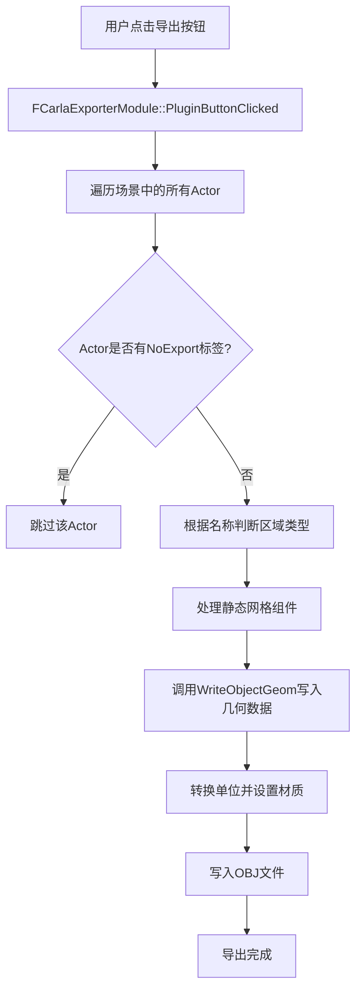
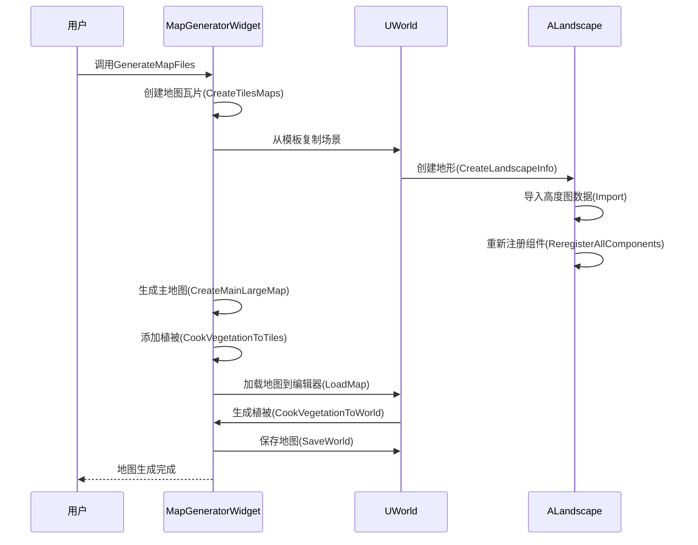
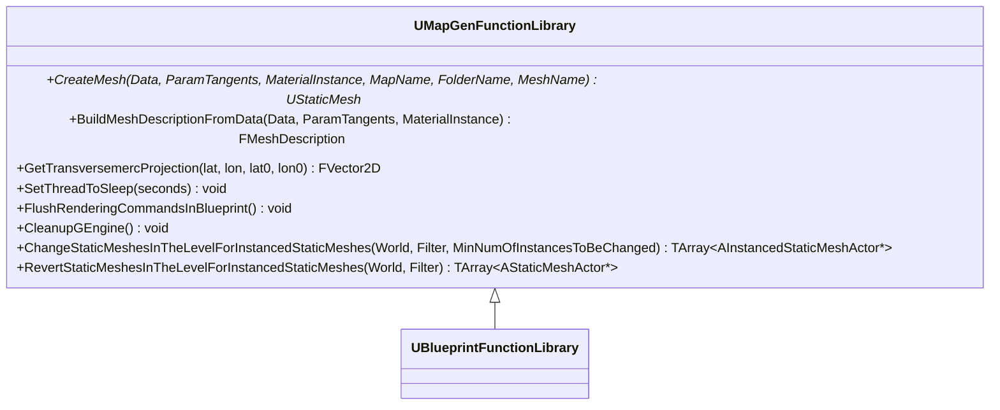
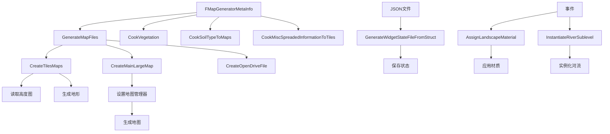
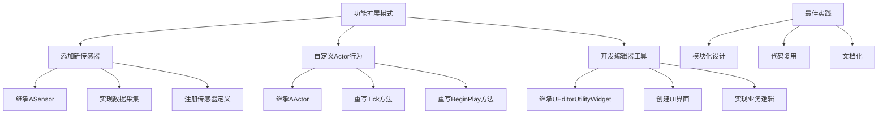
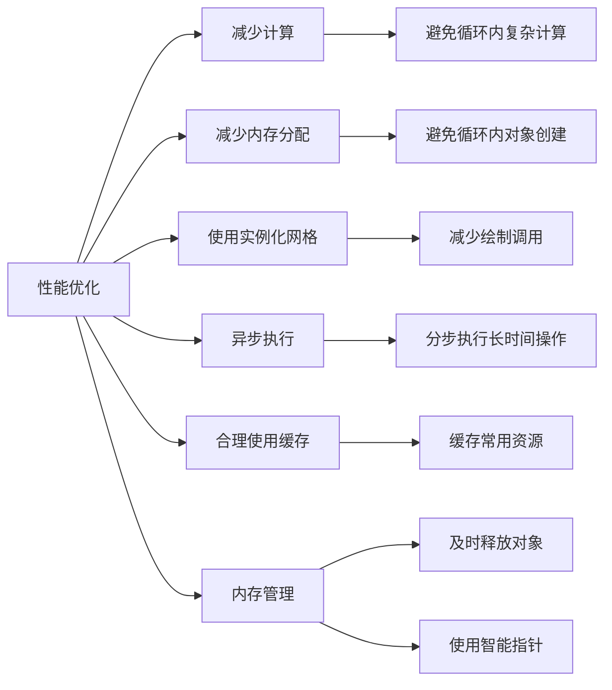

# 功能扩展

> **引用文件**
> **本文档引用的文件**

- [CarlaExporter.cpp](https://github.com/carla-simulator/carla/blob/ue5-dev/Unreal/CarlaUnreal/Plugins/CarlaExporter/Source/CarlaExporter/Private/CarlaExporter.cpp)
- [CarlaExporter.h](https://github.com/carla-simulator/carla/blob/ue5-dev/Unreal/CarlaUnreal/Plugins/CarlaExporter/Source/CarlaExporter/Public/CarlaExporter.h)
- [FBX2OBJ.cpp](https://github.com/carla-simulator/carla/blob/ue5-dev/Util/DockerUtils/fbx/src/FBX2OBJ.cpp)
- [MapGeneratorWidget.cpp](https://github.com/carla-simulator/carla/blob/ue5-dev/Unreal/CarlaUnreal/Plugins/CarlaTools/Source/CarlaTools/Private/MapGeneratorWidget.cpp)
- [MapGeneratorWidget.h](https://github.com/carla-simulator/carla/blob/ue5-dev/Unreal/CarlaUnreal/Plugins/CarlaTools/Source/CarlaTools/Public/MapGeneratorWidget.h)
- [MapGenFunctionLibrary.h](https://github.com/carla-simulator/carla/blob/ue5-dev/Unreal/CarlaUnreal/Plugins/Carla/Source/Carla/BlueprintLibary/MapGenFunctionLibrary.h)
- [CarlaExporter.Build.cs](https://github.com/carla-simulator/carla/blob/ue5-dev/Unreal/CarlaUnreal/Plugins/CarlaExporter/Source/CarlaExporter/CarlaExporter.Build.cs)
- [CarlaTools.Build.cs](https://github.com/carla-simulator/carla/blob/ue5-dev/Unreal/CarlaUnreal/Plugins/CarlaTools/Source/CarlaTools/CarlaTools.Build.cs)

## 目录

1. [引言](#引言)
2. [CarlaExporter 插件功能分析](#carlaexporter插件功能分析)
3. [CarlaTools 插件地图生成工具实现](#carlatools插件地图生成工具实现)
4. [C++功能扩展与蓝图集成](#c功能扩展与蓝图集成)
5. [插件间通信与数据共享机制](#插件间通信与数据共享机制)
6. [功能扩展模式与最佳实践](#功能扩展模式与最佳实践)
7. [性能优化建议](#性能优化建议)
8. [结论](#结论)

## 引言

CARLA 是一款开源的自动驾驶仿真平台，基于 Unreal Engine 构建，为自动驾驶算法的开发和测试提供了高度逼真的虚拟环境。本项目通过多个插件实现了核心功能的扩展，包括场景导出、地图生成和工具开发等。其中，CarlaExporter 插件负责将 Unreal Engine 中的场景导出为 CARLA 可识别的 OBJ 格式，而 CarlaTools 插件则提供了强大的地图生成和编辑功能。这些插件通过 C++与 Unreal Engine 深度集成，并通过蓝图系统向用户暴露功能，形成了一个完整的开发工作流。开发者可以通过这些工具创建复杂的虚拟环境，用于自动驾驶感知、规划和控制算法的测试。

## CarlaExporter 插件功能分析

CarlaExporter 插件实现了从 Unreal Engine 到 CARLA 平台的场景导出功能，其核心是将 FBX 格式的 3D 模型转换为 OBJ 格式。该插件通过集成 Autodesk FBX SDK，实现了高效的文件格式转换。插件的实现主要分为两个部分：Unreal Engine 中的导出模块和独立的 FBX 到 OBJ 转换工具。

在 Unreal Engine 中，`FCarlaExporterModule`类作为插件的主模块，负责注册菜单项和处理导出请求。当用户点击导出按钮时，插件会遍历当前场景中的所有 Actor，根据其名称中的关键词（如"Road_Road"、"Road_Sidewalk"等）判断其类型，并将其几何数据写入 OBJ 文件。导出过程中，插件会处理静态网格组件和实例化静态网格组件，确保所有场景元素都被正确导出。几何数据的写入通过`WriteObjectGeom`方法实现，该方法会将 Unreal Engine 中的厘米单位转换为 CARLA 使用的米单位，并根据不同的区域类型（道路、人行道、草地等）设置相应的材质。

独立的 FBX 到 OBJ 转换工具位于`Util/DockerUtils/fbx/src/FBX2OBJ.cpp`，它使用 FBX SDK 的 API 加载 FBX 文件，处理场景数据，并将其导出为 OBJ 格式。转换过程中，工具会根据节点名称自动设置材质，确保导出的模型在 CARLA 中具有正确的外观。FBX SDK 的初始化和配置在`BuildUtilsDocker.sh`脚本中完成，该脚本会自动下载并安装 FBX SDK，确保转换工具的正常运行。

**代码片段路径**

- <a href="https://github.com/carla-simulator/carla/blob/ue5-dev/Unreal/CarlaUnreal/Plugins/CarlaExporter/Source/CarlaExporter/Private/CarlaExporter.cpp#L63-L192" target="_blank">CarlaExporter.cpp</a>
- <a href="https://github.com/carla-simulator/carla/blob/ue5-dev/Util/DockerUtils/fbx/src/FBX2OBJ.cpp#L154-L208" target="_blank">FBX2OBJ.cpp</a>

## CarlaTools 插件地图生成工具实现

CarlaTools 插件提供了强大的地图生成和编辑功能，其核心是`MapGeneratorWidget`类。该类继承自`UEditorUtilityWidget`，为用户提供了一个可视化的地图生成界面。地图生成过程分为多个步骤，包括创建基础地图、生成地形、添加植被和设置特殊区域等。

`MapGeneratorWidget`通过`GenerateMapFiles`方法启动地图生成流程。该方法首先创建多个地图瓦片，然后生成主地图，并复制 OpenDrive 文件。地图瓦片的创建通过`CreateTilesMaps`方法实现，该方法会从基础地图模板复制场景，并根据高度图生成地形。地形生成过程中，插件会读取高度图的像素数据，将其转换为地形高度，并应用平滑和缝合算法，确保相邻瓦片之间的地形连续。

植被生成是地图生成的重要环节，通过`CookVegetationToTiles`方法实现。该方法会遍历所有地图瓦片，为每个瓦片创建程序化植被体积，并根据植被生成器的设置生成植被实例。植被的分布和密度可以通过`FoliageSpawners`参数进行控制，实现多样化的植被效果。此外，插件还支持在特定区域生成特殊类型的植被，通过`VegetationRoisMap`参数指定不同区域的植被配置。

**代码片段路径**

- <a href="https://github.com/carla-simulator/carla/blob/ue5-dev/Unreal/CarlaUnreal/Plugins/CarlaTools/Source/CarlaTools/Private/MapGeneratorWidget.cpp#L58-L853" target="_blank">MapGeneratorWidget.cpp</a>
- <a href="https://github.com/carla-simulator/carla/blob/ue5-dev/Unreal/CarlaUnreal/Plugins/CarlaTools/Source/CarlaTools/Public/MapGeneratorWidget.h#L249-L280" target="_blank">MapGeneratorWidget.h</a>

## C++功能扩展与蓝图集成

CARLA 插件通过蓝图函数库将 C++功能暴露给蓝图系统，实现了 C++与蓝图的无缝集成。`MapGenFunctionLibrary`是其中一个关键的蓝图函数库，它提供了多个静态方法，可以在蓝图中直接调用。

`MapGenFunctionLibrary`类使用`UBlueprintFunctionLibrary`作为基类，并通过`UFUNCTION(BlueprintCallable)`宏将方法标记为可被蓝图调用。例如，`CreateMesh`方法可以创建静态网格，`ChangeStaticMeshesInTheLevelForInstancedStaticMeshes`方法可以将场景中的静态网格转换为实例化静态网格，以减少绘制调用。这些方法在 C++中实现复杂的逻辑，然后通过蓝图系统提供给用户，使得非程序员也能使用这些高级功能。

蓝图函数库的集成需要在模块的构建文件中正确配置依赖关系。`CarlaTools.Build.cs`文件中，`PublicDependencyModuleNames`包含了`Core`、`Engine`等核心模块，`PrivateDependencyModuleNames`包含了`Carla`、`JsonUtilities`等私有依赖。这些配置确保了蓝图函数库能够访问所需的 API 和功能。

**代码片段路径**

- <a href="https://github.com/carla-simulator/carla/blob/ue5-dev/Unreal/CarlaUnreal/Plugins/Carla/Source/Carla/BlueprintLibary/MapGenFunctionLibrary.h#L24-L62" target="_blank">MapGenFunctionLibrary.h</a>
- <a href="https://github.com/carla-simulator/carla/blob/ue5-dev/Unreal/CarlaUnreal/Plugins/CarlaTools/Source/CarlaTools/CarlaTools.Build.cs#L78-L124" target="_blank">CarlaTools.Build.cs</a>

## 插件间通信与数据共享机制

CARLA 插件之间通过多种机制实现通信和数据共享。最常见的方式是通过共享的数据结构和全局对象。例如，`FMapGeneratorMetaInfo`结构体在 CarlaTools 插件中定义，用于存储地图生成的元信息，包括目标路径、地图名称、尺寸、植被生成器等。这个结构体在多个方法之间传递，作为配置参数和状态容器。

插件间的通信还通过事件系统实现。`MapGeneratorWidget`类定义了多个`BlueprintImplementableEvent`，如`AssignLandscapeMaterial`、`InstantiateRiverSublevel`等。这些事件可以在蓝图中实现，允许其他插件或用户代码在特定时机执行自定义逻辑。例如，当地形创建完成后，可以触发`AssignLandscapeMaterial`事件来应用特定的材质。

数据共享还通过文件系统实现。插件会将生成的地图、高度图、OpenDrive 文件等保存到指定目录，其他插件或外部工具可以读取这些文件。例如，`GenerateWidgetStateFileFromStruct`方法将`FMapGeneratorWidgetState`结构体序列化为 JSON 文件，保存插件的状态，以便下次加载时恢复。

**代码片段路径**

- <a href="https://github.com/carla-simulator/carla/blob/ue5-dev/Unreal/CarlaUnreal/Plugins/CarlaTools/Source/CarlaTools/Public/MapGeneratorWidget.h#L27-L78" target="_blank">MapGeneratorWidget.h</a>
- <a href="https://github.com/carla-simulator/carla/blob/ue5-dev/Unreal/CarlaUnreal/Plugins/CarlaTools/Source/CarlaTools/Private/MapGeneratorWidget.cpp#L597-L612" target="_blank">MapGeneratorWidget.cpp</a>

## 功能扩展模式与最佳实践

在 CARLA 中扩展功能有多种模式，包括添加新传感器类型、实现自定义 Actor 行为和开发编辑器工具。添加新传感器需要继承`ASensor`类，实现数据采集和处理逻辑，并在`SensorFactory`中注册传感器定义。自定义 Actor 行为可以通过继承`AActor`类并重写其方法来实现，例如`Tick`方法用于每帧更新，`BeginPlay`方法用于初始化。

开发编辑器工具是扩展 CARLA 功能的重要方式。通过继承`UEditorUtilityWidget`，可以创建自定义的编辑器界面，提供可视化操作。工具的实现需要考虑用户体验，提供清晰的反馈和错误处理。例如，`MapGeneratorWidget`在执行长时间操作时会输出日志信息，让用户了解当前进度。

最佳实践包括模块化设计、代码复用和文档化。插件应该被设计为独立的模块，具有清晰的接口和依赖关系。代码复用可以通过创建通用的工具函数和基类来实现。文档化不仅包括代码注释，还包括用户文档和示例，帮助其他开发者理解和使用扩展功能。

**代码片段路径**

- <a href="https://github.com/carla-simulator/carla/blob/ue5-dev/Unreal/CarlaUnreal/Plugins/Carla/Source/Carla/Sensor/SensorFactory.cpp#L98-L134" target="_blank">SensorFactory.cpp</a>
- <a href="https://github.com/carla-simulator/carla/blob/ue5-dev/Unreal/CarlaUnreal/Plugins/CarlaTools/Source/CarlaTools/Public/MapGeneratorWidget.h#L223-L225" target="_blank">MapGeneratorWidget.h</a>

## 性能优化建议

在开发 CARLA 插件时，性能优化是至关重要的。首先，应尽量减少不必要的计算和内存分配。例如，在遍历场景中的 Actor 时，应避免在循环内部进行复杂的计算或对象创建。其次，应合理使用实例化静态网格，将大量相同的静态网格转换为实例化静态网格，可以显著减少绘制调用，提高渲染性能。

对于长时间运行的操作，如地图生成，应考虑异步执行或分步执行，避免阻塞主线程。`MapGeneratorWidget`中的`SetThreadToSleep`方法可以用于在循环中插入短暂的休眠，让出 CPU 时间，提高响应性。此外，应合理使用缓存，避免重复计算。例如，可以缓存常用的材质或纹理，避免每次使用时都重新加载。

内存管理也是性能优化的重要方面。应确保及时释放不再使用的对象，避免内存泄漏。Unreal Engine 提供了智能指针和垃圾回收机制，应充分利用这些特性。对于大型数据结构，如高度图，应考虑使用流式处理，避免一次性加载到内存中。

**代码片段路径**

- <a href="https://github.com/carla-simulator/carla/blob/ue5-dev/Unreal/CarlaUnreal/Plugins/Carla/Source/Carla/BlueprintLibary/MapGenFunctionLibrary.h#L46-L49" target="_blank">MapGenFunctionLibrary.h</a>
- <a href="https://github.com/carla-simulator/carla/blob/ue5-dev/Unreal/CarlaUnreal/Plugins/CarlaTools/Source/CarlaTools/Private/MapGeneratorWidget.cpp#L81-L853" target="_blank">MapGeneratorWidget.cpp</a>

## 结论

CARLA 通过插件系统提供了强大的功能扩展能力。CarlaExporter 插件实现了从 Unreal Engine 到 CARLA 的场景导出，通过 FBX SDK 实现了高效的文件格式转换。CarlaTools 插件提供了完整的地图生成解决方案，支持地形生成、植被添加和特殊区域设置。通过蓝图函数库，C++功能可以无缝集成到蓝图系统中，为用户提供直观的操作界面。插件间通过共享数据结构、事件系统和文件系统实现通信和数据共享。开发者可以通过添加新传感器、实现自定义 Actor 行为和开发编辑器工具来扩展 CARLA 功能。在开发过程中，应遵循模块化设计、代码复用和文档化的最佳实践，并注意性能优化，确保插件的高效和稳定运行。
