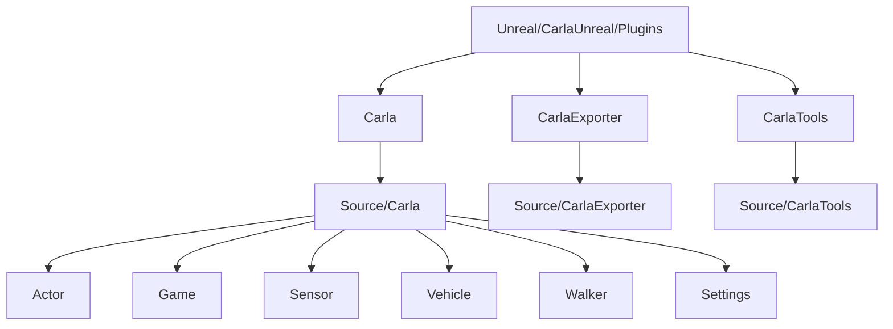
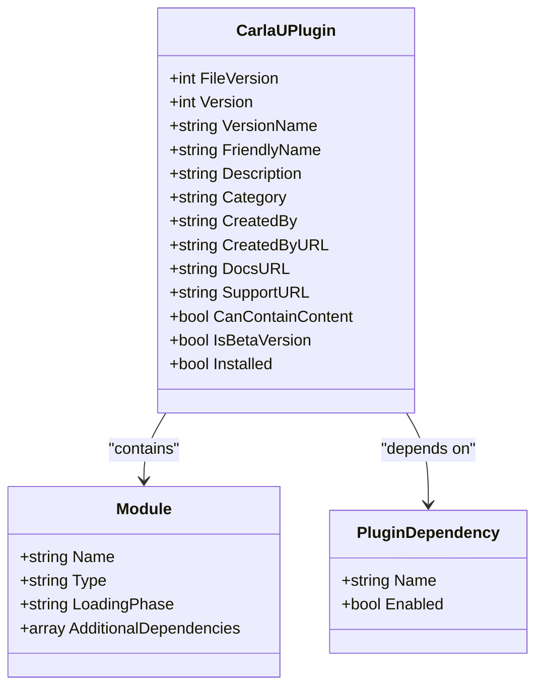
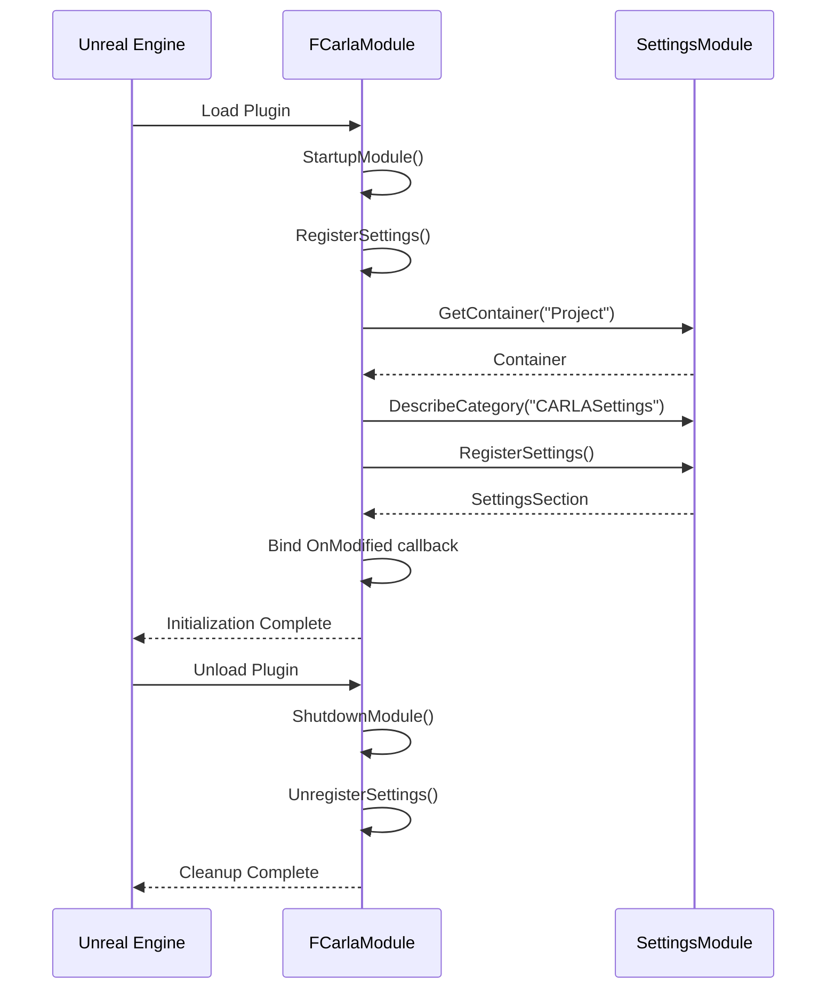
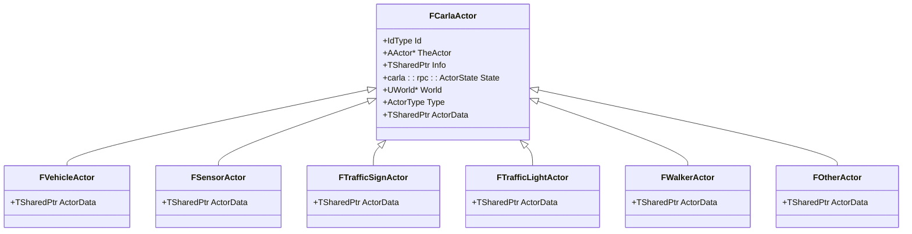
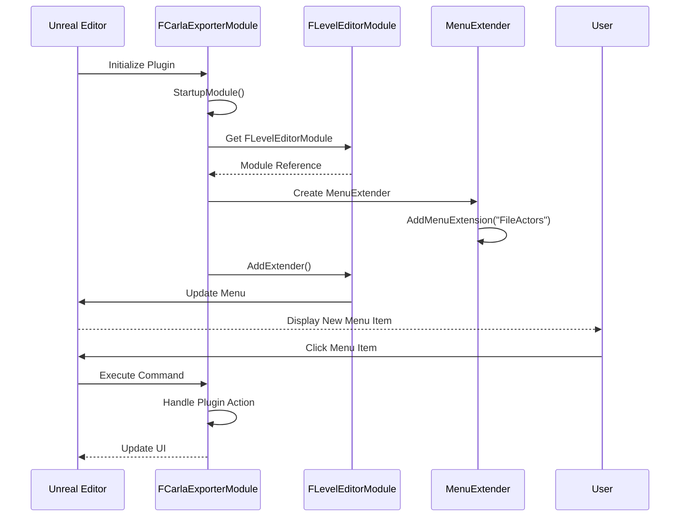
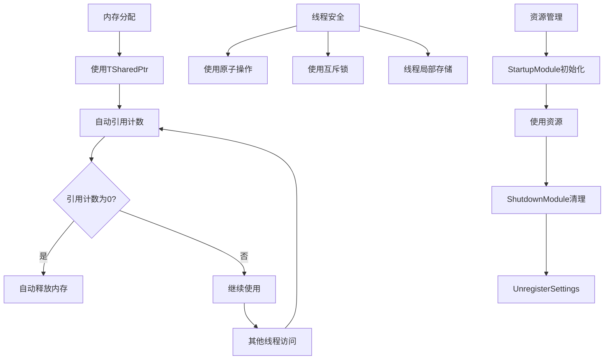

# 插件创建

> **引用文件**
> **本文档中引用的文件**

- [Carla.uplugin](https://github.com/carla-simulator/carla/blob/ue5-dev/Unreal/CarlaUnreal/Plugins/Carla/Carla.uplugin)
- [Carla.cpp](https://github.com/carla-simulator/carla/blob/ue5-dev/Unreal/CarlaUnreal/Plugins/Carla/Source/Carla/Carla.cpp)
- [Carla.h](https://github.com/carla-simulator/carla/blob/ue5-dev/Unreal/CarlaUnreal/Plugins/Carla/Source/Carla/Carla.h)
- [Carla.Build.cs](https://github.com/carla-simulator/carla/blob/ue5-dev/Unreal/CarlaUnreal/Plugins/Carla/Source/Carla/Carla.Build.cs)
- [CarlaSettings.h](https://github.com/carla-simulator/carla/blob/ue5-dev/Unreal/CarlaUnreal/Plugins/Carla/Source/Carla/Settings/CarlaSettings.h)
- [ActorDispatcher.cpp](https://github.com/carla-simulator/carla/blob/ue5-dev/Unreal/CarlaUnreal/Plugins/Carla/Source/Carla/Actor/ActorDispatcher.cpp)
- [ActorDispatcher.h](https://github.com/carla-simulator/carla/blob/ue5-dev/Unreal/CarlaUnreal/Plugins/Carla/Source/Carla/Actor/ActorDispatcher.h)
- [CarlaActor.cpp](https://github.com/carla-simulator/carla/blob/ue5-dev/Unreal/CarlaUnreal/Plugins/Carla/Source/Carla/Actor/CarlaActor.cpp)
- [CarlaTools.h](https://github.com/carla-simulator/carla/blob/ue5-dev/Unreal/CarlaUnreal/Plugins/CarlaTools/Source/CarlaTools/Public/CarlaTools.h)
- [CarlaExporter.cpp](https://github.com/carla-simulator/carla/blob/ue5-dev/Unreal/CarlaUnreal/Plugins/CarlaExporter/Source/CarlaExporter/Private/CarlaExporter.cpp)
- [CarlaExporterCommands.h](https://github.com/carla-simulator/carla/blob/ue5-dev/Unreal/CarlaUnreal/Plugins/CarlaExporter/Source/CarlaExporter/Public/CarlaExporterCommands.h)

## 目录

1. [项目结构](#项目结构)
2. [Carla.uplugin 文件详解](#carlauplugin文件详解)
3. [插件初始化过程](#插件初始化过程)
4. [自定义 CARLA 插件创建指南](#自定义carla插件创建指南)
5. [Actor 类型和功能接口定义](#actor类型和功能接口定义)
6. [插件与 Unreal Engine 编辑器集成](#插件与unreal-engine编辑器集成)
7. [线程安全和内存管理最佳实践](#线程安全和内存管理最佳实践)

## 项目结构

CARLA 插件的项目结构遵循 Unreal Engine 插件的标准组织方式，主要包含三个核心插件：Carla、CarlaExporter 和 CarlaTools。这些插件位于 Unreal/CarlaUnreal/Plugins 目录下，每个插件都有独立的 Source 目录存放 C++源代码。



**图示来源**

- [Carla.uplugin](https://github.com/carla-simulator/carla/blob/ue5-dev/Unreal/CarlaUnreal/Plugins/Carla/Carla.uplugin)
- [CarlaExporter.uplugin](https://github.com/carla-simulator/carla/blob/ue5-dev/Unreal/CarlaUnreal/Plugins/CarlaExporter/CarlaExporter.uplugin)
- [CarlaTools.uplugin](https://github.com/carla-simulator/carla/blob/ue5-dev/Unreal/CarlaUnreal/Plugins/CarlaTools/CarlaTools.uplugin)

**本节来源**

- [Carla.uplugin](https://github.com/carla-simulator/carla/blob/ue5-dev/Unreal/CarlaUnreal/Plugins/Carla/Carla.uplugin)
- [CarlaExporter.uplugin](https://github.com/carla-simulator/carla/blob/ue5-dev/Unreal/CarlaUnreal/Plugins/CarlaExporter/CarlaExporter.uplugin)
- [CarlaTools.uplugin](https://github.com/carla-simulator/carla/blob/ue5-dev/Unreal/CarlaUnreal/Plugins/CarlaTools/CarlaTools.uplugin)

## Carla.uplugin 文件详解

Carla.uplugin 文件是 CARLA 插件的核心配置文件，采用 JSON 格式定义了插件的元数据、模块配置和依赖关系。该文件位于 Unreal/CarlaUnreal/Plugins/Carla/目录下。

### 基本信息配置

Carla.uplugin 文件首先定义了插件的基本信息，包括版本号、友好名称、描述和创建者信息：

- **FileVersion**: 插件文件格式版本，当前为 3
- **Version**: 插件版本号，当前为 1
- **VersionName**: 版本名称，如"0.10.0"
- **FriendlyName**: 插件的友好名称"CARLA"
- **Description**: 插件描述"Open-source simulator for autonomous driving research."
- **Category**: 插件分类"Science"
- **CreatedBy**: 创建者"Computer Vision Center (CVC) at the Universitat Autonoma de Barcelona (UAB)"

### 模块定义

插件的核心是模块定义部分，通过"Modules"数组配置：

```json
"Modules": [
  {
    "Name": "Carla",
    "Type": "Runtime",
    "LoadingPhase": "PreDefault",
    "AdditionalDependencies": [
      "Engine"
    ]
  }
]
```

- **Name**: 模块名称"Carla"
- **Type**: 模块类型"Runtime"，表示这是一个运行时模块
- **LoadingPhase**: 加载阶段"PreDefault"，表示在默认加载阶段之前加载
- **AdditionalDependencies**: 额外依赖项，这里依赖"Engine"模块

### 插件依赖配置

Carla.uplugin 文件还通过"Plugins"数组配置了插件依赖：

```json
"Plugins": [
  {
    "Name": "ProceduralMeshComponent",
    "Enabled": true
  },
  {
    "Name": "ChaosVehiclesPlugin",
    "Enabled": true
  }
]
```

这些依赖确保了 CARLA 插件能够使用程序化网格组件和混沌车辆物理系统。

### 其他重要配置

- **CanContainContent**: true，表示插件可以包含内容资产
- **IsBetaVersion**: true，表示这是测试版本
- **Installed**: true，表示插件已安装



**图示来源**

- [Carla.uplugin](https://github.com/carla-simulator/carla/blob/ue5-dev/Unreal/CarlaUnreal/Plugins/Carla/Carla.uplugin)

**本节来源**

- [Carla.uplugin](https://github.com/carla-simulator/carla/blob/ue5-dev/Unreal/CarlaUnreal/Plugins/Carla/Carla.uplugin)

## 插件初始化过程

CARLA 插件的初始化过程主要通过 Carla.cpp 文件中的 StartupModule 和 ShutdownModule 方法实现，这两个方法定义了插件的生命周期管理。

### StartupModule 方法

StartupModule 方法在插件加载时被调用，负责初始化插件所需的各种资源和设置：

```cpp
void FCarlaModule::StartupModule()
{
    RegisterSettings();
    LoadChronoDll();
}
```

该方法主要执行两个关键操作：

1. **RegisterSettings()**: 注册插件设置，将 UCarlaSettings 对象暴露给 Unreal Engine 的设置系统，使用户可以在编辑器中配置 CARLA 相关参数。

2. **LoadChronoDll()**: 加载 Chrono 物理引擎的动态链接库，为车辆物理模拟提供支持。

### ShutdownModule 方法

ShutdownModule 方法在插件卸载时被调用，负责清理资源和注销设置：

```cpp
void FCarlaModule::ShutdownModule()
{
    if (UObjectInitialized())
    {
        UnregisterSettings();
    }
}
```

该方法确保在插件关闭时正确注销之前注册的设置，避免内存泄漏和资源冲突。

### 设置注册机制

RegisterSettings 方法实现了详细的设置注册逻辑：

```cpp
void FCarlaModule::RegisterSettings()
{
    if (ISettingsModule* SettingsModule = FModuleManager::GetModulePtr<ISettingsModule>("Settings"))
    {
        ISettingsContainerPtr SettingsContainer = SettingsModule->GetContainer("Project");

        SettingsContainer->DescribeCategory("CARLASettings",
            LOCTEXT("RuntimeWDCategoryName", "CARLA Settings"),
            LOCTEXT("RuntimeWDCategoryDescription", "CARLA plugin settings"));

        ISettingsSectionPtr SettingsSection = SettingsModule->RegisterSettings("Project", "CARLASettings", "General",
            LOCTEXT("RuntimeGeneralSettingsName", "General"),
            LOCTEXT("RuntimeGeneralSettingsDescription", "General configuration for the CARLA plugin"),
            GetMutableDefault<UCarlaSettings>()
        );

        if (SettingsSection.IsValid())
        {
            SettingsSection->OnModified().BindRaw(this, &FCarlaModule::HandleSettingsSaved);
        }
    }
}
```

这个机制将 UCarlaSettings 类的实例注册到项目设置中，创建名为"CARLASettings"的类别，并设置修改回调函数。



**图示来源**

- [Carla.cpp](https://github.com/carla-simulator/carla/blob/ue5-dev/Unreal/CarlaUnreal/Plugins/Carla/Source/Carla/Carla.cpp)
- [Carla.h](https://github.com/carla-simulator/carla/blob/ue5-dev/Unreal/CarlaUnreal/Plugins/Carla/Source/Carla/Carla.h)

**本节来源**

- [Carla.cpp](https://github.com/carla-simulator/carla/blob/ue5-dev/Unreal/CarlaUnreal/Plugins/Carla/Source/Carla/Carla.cpp)
- [Carla.h](https://github.com/carla-simulator/carla/blob/ue5-dev/Unreal/CarlaUnreal/Plugins/Carla/Source/Carla/Carla.h)

## 自定义 CARLA 插件创建指南

创建自定义 CARLA 插件需要遵循特定的目录结构和配置流程。以下是详细的分步指南：

### 目录结构创建

首先创建符合 Unreal Engine 插件规范的目录结构：

```
MyCarlaPlugin/
├── Config/
│   └── DefaultConfig.ini
├── Content/
├── Source/
│   └── MyCarlaPlugin/
│       ├── MyCarlaPlugin.Build.cs
│       ├── MyCarlaPlugin.h
│       └── MyCarlaPlugin.cpp
└── MyCarlaPlugin.uplugin
```

### .uplugin 文件配置

创建 MyCarlaPlugin.uplugin 文件，配置插件基本信息和模块：

```json
{
  "FileVersion": 3,
  "Version": 1,
  "VersionName": "1.0.0",
  "FriendlyName": "My CARLA Plugin",
  "Description": "Custom plugin for CARLA simulation",
  "Category": "Science",
  "CreatedBy": "Your Name",
  "CreatedByURL": "http://yourwebsite.com",
  "DocsURL": "http://yourwebsite.com/docs",
  "SupportURL": "http://yourwebsite.com/support",
  "CanContainContent": true,
  "IsBetaVersion": false,
  "Installed": true,
  "Modules": [
    {
      "Name": "MyCarlaPlugin",
      "Type": "Runtime",
      "LoadingPhase": "PreDefault",
      "AdditionalDependencies": ["Engine", "Carla"]
    }
  ],
  "Plugins": [
    {
      "Name": "Carla",
      "Enabled": true
    }
  ]
}
```

### 模块类实现

创建 MyCarlaPlugin.h 和 MyCarlaPlugin.cpp 文件，实现模块接口：

```cpp
// MyCarlaPlugin.h
#pragma once

#include "CoreMinimal.h"
#include "Modules/ModuleInterface.h"

class FMyCarlaPluginModule : public IModuleInterface
{
public:
    virtual void StartupModule() override;
    virtual void ShutdownModule() override;
};
```

```cpp
// MyCarlaPlugin.cpp
#include "MyCarlaPlugin.h"
#include "MyCarlaPluginSettings.h"

DEFINE_LOG_CATEGORY(LogMyCarlaPlugin);

void FMyCarlaPluginModule::StartupModule()
{
    // 初始化自定义设置
    RegisterSettings();

    // 其他初始化代码
    UE_LOG(LogMyCarlaPlugin, Log, TEXT("My CARLA Plugin started successfully"));
}

void FMyCarlaPluginModule::ShutdownModule()
{
    // 清理资源
    if (UObjectInitialized())
    {
        UnregisterSettings();
    }
}
```

### 构建配置

创建 MyCarlaPlugin.Build.cs 文件，配置编译选项：

```csharp
using UnrealBuildTool;

public class MyCarlaPlugin : ModuleRules
{
    public MyCarlaPlugin(ReadOnlyTargetRules Target) : base(Target)
    {
        PCHUsage = ModuleRules.PCHUsageMode.UseExplicitOrSharedPCHs;

        PublicIncludePaths.AddRange(
            new string[] {
                ModuleDirectory
            }
        );

        PrivateDependencyModuleNames.AddRange(
            new string[] {
                "Core",
                "CoreUObject",
                "Engine",
                "InputCore",
                "Carla"
            }
        );
    }
}
```

**本节来源**

- [Carla.uplugin](https://github.com/carla-simulator/carla/blob/ue5-dev/Unreal/CarlaUnreal/Plugins/Carla/Carla.uplugin)
- [Carla.cpp](https://github.com/carla-simulator/carla/blob/ue5-dev/Unreal/CarlaUnreal/Plugins/Carla/Source/Carla/Carla.cpp)
- [Carla.Build.cs](https://github.com/carla-simulator/carla/blob/ue5-dev/Unreal/CarlaUnreal/Plugins/Carla/Source/Carla/Carla.Build.cs)

## Actor 类型和功能接口定义

CARLA 插件通过 ActorDispatcher 系统管理各种 Actor 类型的创建和注册，实现了灵活的 Actor 类型定义机制。

### ActorDispatcher 系统

ActorDispatcher 是 CARLA 插件中负责 Actor 创建和管理的核心类，定义在 ActorDispatcher.h 文件中：

```cpp
UCLASS()
class CARLA_API UActorDispatcher : public UObject
{
    GENERATED_BODY()

public:
    using SpawnFunctionType = TFunction<FActorSpawnResult(const FTransform &, const FActorDescription &)>;

    void Bind(FActorDefinition Definition, SpawnFunctionType SpawnFunction);
    void Bind(ACarlaActorFactory &ActorFactory);

    TPair<EActorSpawnResultStatus, FCarlaActor*> SpawnActor(
        const FTransform &Transform,
        FActorDescription Description,
        FCarlaActor::IdType DesiredId = 0);

    bool DestroyActor(FCarlaActor::IdType ActorId);

    FCarlaActor* RegisterActor(
        AActor &Actor,
        FActorDescription ActorDescription,
        FActorRegistry::IdType DesiredId = 0);

private:
    TArray<FActorDefinition> Definitions;
    TArray<SpawnFunctionType> SpawnFunctions;
    TArray<TSubclassOf<AActor>> Classes;
    FActorRegistry Registry;
};
```

### Actor 类型层次结构

CARLA 插件定义了多种 Actor 类型，通过继承关系组织：



### Actor 创建流程

Actor 的创建流程通过 SpawnActor 方法实现，主要包括以下步骤：

1. 验证 ActorDescription 的有效性
2. 根据 UId 查找对应的 SpawnFunction
3. 调用 SpawnFunction 创建 Actor 实例
4. 注册新创建的 Actor 到 ActorRegistry
5. 返回创建结果

```cpp
TPair<EActorSpawnResultStatus, FCarlaActor*> UActorDispatcher::SpawnActor(
    const FTransform &Transform,
    FActorDescription Description,
    FCarlaActor::IdType DesiredId)
{
    if ((Description.UId == 0u) || (Description.UId > static_cast<uint32>(SpawnFunctions.Num())))
    {
        UE_LOG(LogCarla, Error, TEXT("Invalid ActorDescription '%s' (UId=%d)"), *Description.Id, Description.UId);
        return MakeTuple(EActorSpawnResultStatus::InvalidDescription, nullptr);
    }

    UE_LOG(LogCarla, Log, TEXT("Spawning actor '%s'"), *Description.Id);

    Description.Class = Classes[Description.UId - 1];
    FActorSpawnResult Result = SpawnFunctions[Description.UId - 1](Transform, Description);

    FCarlaActor* View = Result.IsValid() ?
        RegisterActor(*Result.Actor, std::move(Description), DesiredId) : nullptr;

    if (!View)
    {
        UE_LOG(LogCarla, Warning, TEXT("Failed to spawn actor '%s'"), *Description.Id);
    }
    else
    {
        ATagger::TagActor(*View->GetActor(), true);
    }

    return MakeTuple(Result.Status, View);
}
```

**图示来源**

- [ActorDispatcher.h](https://github.com/carla-simulator/carla/blob/ue5-dev/Unreal/CarlaUnreal/Plugins/Carla/Source/Carla/Actor/ActorDispatcher.h)
- [CarlaActor.cpp](https://github.com/carla-simulator/carla/blob/ue5-dev/Unreal/CarlaUnreal/Plugins/Carla/Source/Carla/Actor/CarlaActor.cpp)

**本节来源**

- [ActorDispatcher.h](https://github.com/carla-simulator/carla/blob/ue5-dev/Unreal/CarlaUnreal/Plugins/Carla/Source/Carla/Actor/ActorDispatcher.h)
- [ActorDispatcher.cpp](https://github.com/carla-simulator/carla/blob/ue5-dev/Unreal/CarlaUnreal/Plugins/Carla/Source/Carla/Actor/ActorDispatcher.cpp)
- [CarlaActor.cpp](https://github.com/carla-simulator/carla/blob/ue5-dev/Unreal/CarlaUnreal/Plugins/Carla/Source/Carla/Actor/CarlaActor.cpp)

## 插件与 Unreal Engine 编辑器集成

CARLA 插件通过多种机制与 Unreal Engine 编辑器集成，包括菜单项添加和工具窗口创建。

### 菜单项添加

CarlaExporter 插件展示了如何在编辑器中添加菜单项：

```cpp
void FCarlaExporterModule::StartupModule()
{
    FLevelEditorModule& LevelEditorModule = FModuleManager::LoadModuleChecked<FLevelEditorModule>("LevelEditor");

    TSharedPtr<FExtender> MenuExtender = MakeShareable(new FExtender());
    MenuExtender->AddMenuExtension("FileActors",
        EExtensionHook::After,
        PluginCommands,
        FMenuExtensionDelegate::CreateRaw(this, &FCarlaExporterModule::AddMenuExtension));

    LevelEditorModule.GetMenuExtensibilityManager()->AddExtender(MenuExtender);
}
```

这种方法通过 FLevelEditorModule 获取编辑器模块，创建菜单扩展器，并将其添加到指定的菜单位置。

### 工具窗口创建

CarlaTools 插件提供了编辑器工具的实现：

```cpp
class FCarlaToolsModule : public IModuleInterface
{
public:
    virtual void StartupModule() override;
    virtual void ShutdownModule() override;
};

IMPLEMENT_MODULE(FCarlaToolsModule, CarlaTools)
```

### 命令系统

插件使用 Unreal Engine 的命令系统来定义可执行操作：

```cpp
class FCarlaExporterCommands : public TCommands<FCarlaExporterCommands>
{
public:
    FCarlaExporterCommands()
        : TCommands<FCarlaExporterCommands>(
            TEXT("CarlaExporter"),
            NSLOCTEXT("Contexts", "CarlaExporter", "CarlaExporter Plugin"),
            NAME_None,
            FEditorStyle::GetStyleSetName())
    {
    }

    virtual void RegisterCommands() override;

public:
    TSharedPtr< FUICommandInfo > PluginActionExportAll;
};
```

### 编辑器工具 Actor

CarlaTools 插件还定义了可在编辑器中使用的工具 Actor：

```cpp
UCLASS(BlueprintType)
class CARLATOOLS_API AEditorCameraUtils : public AActor
{
    GENERATED_BODY()
public:
    UFUNCTION(BlueprintCallable, CallInEditor)
    void Get();

    UFUNCTION(BlueprintCallable, CallInEditor)
    void Set();

    UPROPERTY(BlueprintReadWrite, EditAnywhere)
    FTransform CameraTransform;
};
```

这种 Actor 可以在编辑器中实例化，并通过蓝图或 C++调用其方法。



**图示来源**

- [CarlaExporter.cpp](https://github.com/carla-simulator/carla/blob/ue5-dev/Unreal/CarlaUnreal/Plugins/CarlaExporter/Source/CarlaExporter/Private/CarlaExporter.cpp)
- [CarlaExporterCommands.h](https://github.com/carla-simulator/carla/blob/ue5-dev/Unreal/CarlaUnreal/Plugins/CarlaExporter/Source/CarlaExporter/Public/CarlaExporterCommands.h)
- [CarlaTools.h](https://github.com/carla-simulator/carla/blob/ue5-dev/Unreal/CarlaUnreal/Plugins/CarlaTools/Source/CarlaTools/Public/CarlaTools.h)

**本节来源**

- [CarlaExporter.cpp](https://github.com/carla-simulator/carla/blob/ue5-dev/Unreal/CarlaUnreal/Plugins/CarlaExporter/Source/CarlaExporter/Private/CarlaExporter.cpp)
- [CarlaExporterCommands.h](https://github.com/carla-simulator/carla/blob/ue5-dev/Unreal/CarlaUnreal/Plugins/CarlaExporter/Source/CarlaExporter/Public/CarlaExporterCommands.h)
- [CarlaTools.h](https://github.com/carla-simulator/carla/blob/ue5-dev/Unreal/CarlaUnreal/Plugins/CarlaTools/Source/CarlaTools/Public/CarlaTools.h)

## 线程安全和内存管理最佳实践

CARLA 插件在设计时充分考虑了线程安全和内存管理，为开发者提供了最佳实践参考。

### 内存管理策略

CARLA 插件采用智能指针和共享所有权模式来管理内存：

```cpp
TSharedPtr<FCarlaActor> FCarlaActor::ConstructCarlaActor(
    IdType ActorId,
    AActor* Actor,
    TSharedPtr<const FActorInfo> Info,
    ActorType Type,
    carla::rpc::ActorState InState,
    UWorld* World)
{
    switch(Type)
    {
    case ActorType::TrafficSign:
        return MakeShared<FTrafficSignActor>(ActorId, Actor, std::move(Info), InState, World);
    case ActorType::TrafficLight:
        return MakeShared<FTrafficLightActor>(ActorId, Actor, std::move(Info), InState, World);
    case ActorType::Vehicle:
        return MakeShared<FVehicleActor>(ActorId, Actor, std::move(Info), InState, World);
    case ActorType::Walker:
        return MakeShared<FWalkerActor>(ActorId, Actor, std::move(Info), InState, World);
    case ActorType::Sensor:
        return MakeShared<FSensorActor>(ActorId, Actor, std::move(Info), InState, World);
    default:
        return MakeShared<FOtherActor>(ActorId, Actor, std::move(Info), InState, World);
    }
}
```

使用 TSharedPtr 和 MakeShared 确保了对象的自动内存管理和线程安全的共享访问。

### 线程安全机制

CARLA 插件通过以下机制确保线程安全：

1. **原子操作**: 使用 UE4 的线程安全原语
2. **锁机制**: 在必要时使用互斥锁保护共享资源
3. **线程局部存储**: 为每个线程维护独立的状态

### 日志系统

插件实现了详细的日志记录机制，便于调试和监控：

```cpp
DEFINE_LOG_CATEGORY(LogCarla);
DEFINE_LOG_CATEGORY(LogCarlaServer);

UE_LOG(LogCarla, Log, TEXT("Spawning actor '%s'"), *Description.Id);
UE_LOG(LogCarla, Warning, TEXT("Failed to spawn actor '%s'"), *Description.Id);
```

### 资源清理

在 ShutdownModule 中确保所有资源都被正确清理：

```cpp
void FCarlaModule::ShutdownModule()
{
    if (UObjectInitialized())
    {
        UnregisterSettings();
    }
}
```

### 防止内存泄漏

通过 NonCopyable 基类防止意外的拷贝构造：

```cpp
class NonCopyable {
public:
    NonCopyable() = default;
    NonCopyable(const NonCopyable &) = delete;
    void operator=(const NonCopyable &) = delete;
};
```

这种设计模式确保了对象不会被意外复制，避免了浅拷贝导致的内存泄漏。



**图示来源**

- [CarlaActor.cpp](https://github.com/carla-simulator/carla/blob/ue5-dev/Unreal/CarlaUnreal/Plugins/Carla/Source/Carla/Actor/CarlaActor.cpp)
- [Carla.cpp](https://github.com/carla-simulator/carla/blob/ue5-dev/Unreal/CarlaUnreal/Plugins/Carla/Source/Carla/Carla.cpp)
- [NonCopyable.h](https://github.com/carla-simulator/carla/blob/ue5-dev/Unreal/CarlaUnreal/Plugins/Carla/Source/Carla/Util/NonCopyable.h)

**本节来源**

- [CarlaActor.cpp](https://github.com/carla-simulator/carla/blob/ue5-dev/Unreal/CarlaUnreal/Plugins/Carla/Source/Carla/Actor/CarlaActor.cpp)
- [Carla.cpp](https://github.com/carla-simulator/carla/blob/ue5-dev/Unreal/CarlaUnreal/Plugins/Carla/Source/Carla/Carla.cpp)
- [NonCopyable.h](https://github.com/carla-simulator/carla/blob/ue5-dev/Unreal/CarlaUnreal/Plugins/Carla/Source/Carla/Util/NonCopyable.h)
