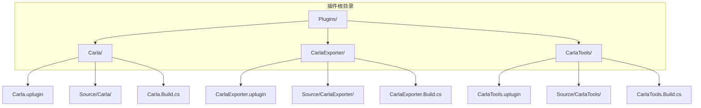
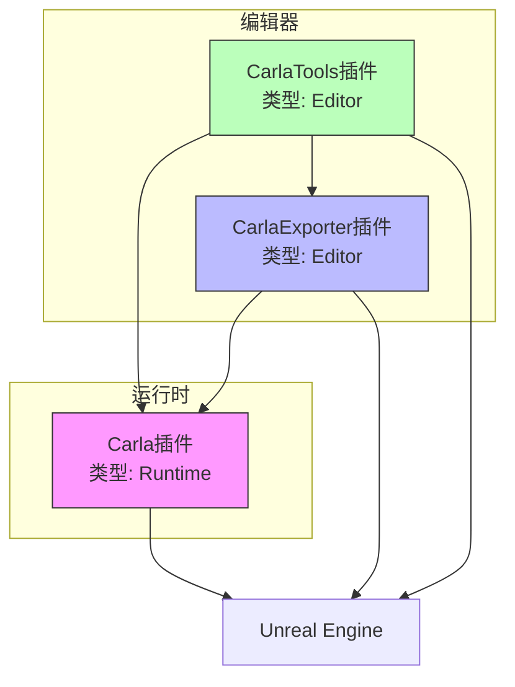
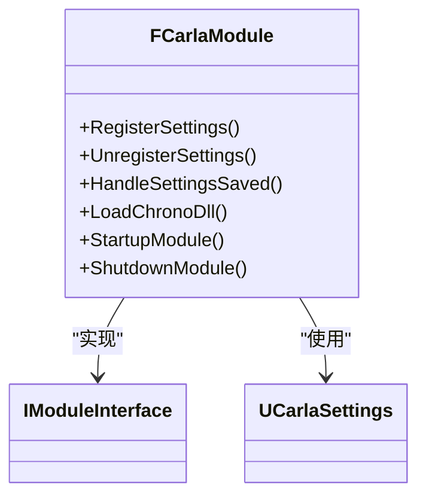
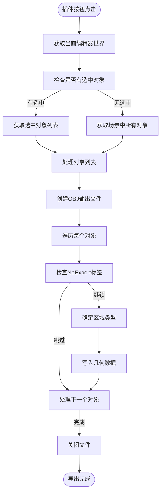
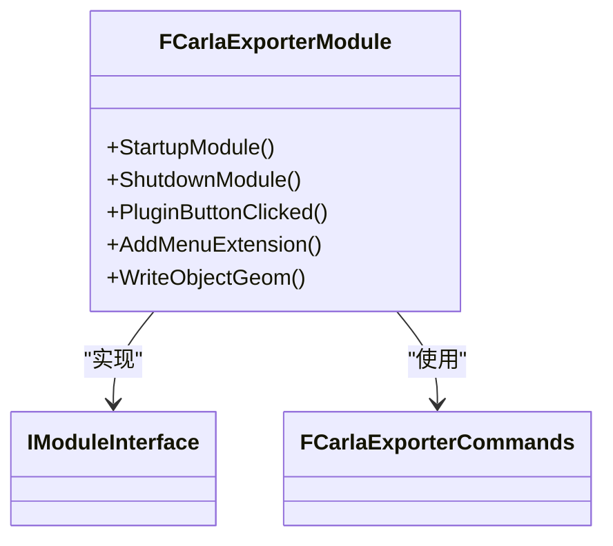
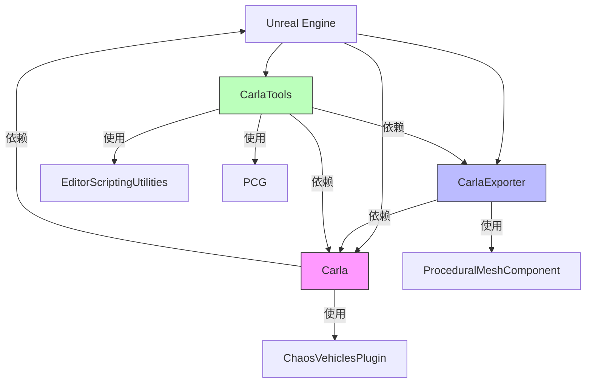

# 插件系统


**本文档中引用的文件**   
- [Carla.uplugin](https://github.com/carla-simulator/carla/blob/ue5-dev/Unreal/CarlaUnreal/Plugins/Carla/Carla.uplugin)
- [CarlaExporter.uplugin](https://github.com/carla-simulator/carla/blob/ue5-dev/Unreal/CarlaUnreal/Plugins/CarlaExporter/CarlaExporter.uplugin)
- [CarlaTools.uplugin](https://github.com/carla-simulator/carla/blob/ue5-dev/Unreal/CarlaUnreal/Plugins/CarlaTools/CarlaTools.uplugin)
- [Carla.Build.cs](https://github.com/carla-simulator/carla/blob/ue5-dev/Unreal/CarlaUnreal/Plugins/Carla/Source/Carla/Carla.Build.cs)
- [CarlaExporter.Build.cs](https://github.com/carla-simulator/carla/blob/ue5-dev/Unreal/CarlaUnreal/Plugins/CarlaExporter/Source/CarlaExporter/CarlaExporter.Build.cs)
- [CarlaTools.Build.cs](https://github.com/carla-simulator/carla/blob/ue5-dev/Unreal/CarlaUnreal/Plugins/CarlaTools/Source/CarlaTools/CarlaTools.Build.cs)
- [Carla.cpp](https://github.com/carla-simulator/carla/blob/ue5-dev/Unreal/CarlaUnreal/Plugins/Carla/Source/Carla/Carla.cpp)
- [Carla.h](https://github.com/carla-simulator/carla/blob/ue5-dev/Unreal/CarlaUnreal/Plugins/Carla/Source/Carla/Carla.h)
- [CarlaExporter.cpp](https://github.com/carla-simulator/carla/blob/ue5-dev/Unreal/CarlaUnreal/Plugins/CarlaExporter/Source/CarlaExporter/Private/CarlaExporter.cpp)
- [CarlaExporterCommands.cpp](https://github.com/carla-simulator/carla/blob/ue5-dev/Unreal/CarlaUnreal/Plugins/CarlaExporter/Source/CarlaExporter/Private/CarlaExporterCommands.cpp)


## 目录
1. [简介](#简介)
2. [项目结构](#项目结构)
3. [核心组件](#核心组件)
4. [架构概述](#架构概述)
5. [详细组件分析](#详细组件分析)
6. [依赖分析](#依赖分析)
7. [性能考虑](#性能考虑)
8. [故障排除指南](#故障排除指南)
9. [结论](#结论)

## 简介
CARLA插件系统是基于Unreal Engine构建的自动驾驶仿真平台的核心扩展机制。该系统通过模块化设计支持功能扩展，主要包含三个核心插件：Carla主插件、CarlaExporter导出插件和CarlaTools工具插件。这些插件共同构成了CARLA的完整功能体系，支持从场景创建、几何导出到运行时仿真的完整工作流程。

## 项目结构
CARLA插件系统位于Unreal项目目录下的Plugins子目录中，采用标准的Unreal插件结构组织。每个插件都有独立的配置文件(.uplugin)和源代码目录(Source)，通过构建配置文件(.Build.cs)管理编译依赖。



**图示来源**
- [Carla.uplugin](https://github.com/carla-simulator/carla/blob/ue5-dev/Unreal/CarlaUnreal/Plugins/Carla/Carla.uplugin)
- [CarlaExporter.uplugin](https://github.com/carla-simulator/carla/blob/ue5-dev/Unreal/CarlaUnreal/Plugins/CarlaExporter/CarlaExporter.uplugin)
- [CarlaTools.uplugin](https://github.com/carla-simulator/carla/blob/ue5-dev/Unreal/CarlaUnreal/Plugins/CarlaTools/CarlaTools.uplugin)

**章节来源**
- [Carla.uplugin](https://github.com/carla-simulator/carla/blob/ue5-dev/Unreal/CarlaUnreal/Plugins/Carla/Carla.uplugin)
- [CarlaExporter.uplugin](https://github.com/carla-simulator/carla/blob/ue5-dev/Unreal/CarlaUnreal/Plugins/CarlaExporter/CarlaExporter.uplugin)
- [CarlaTools.uplugin](https://github.com/carla-simulator/carla/blob/ue5-dev/Unreal/CarlaUnreal/Plugins/CarlaTools/CarlaTools.uplugin)

## 核心组件
CARLA插件系统的核心组件包括主插件Carla、导出插件CarlaExporter和工具插件CarlaTools。这些组件通过明确的职责划分和依赖关系协同工作，构成了完整的仿真平台功能体系。

**章节来源**
- [Carla.uplugin](https://github.com/carla-simulator/carla/blob/ue5-dev/Unreal/CarlaUnreal/Plugins/Carla/Carla.uplugin)
- [CarlaExporter.uplugin](https://github.com/carla-simulator/carla/blob/ue5-dev/Unreal/CarlaUnreal/Plugins/CarlaExporter/CarlaExporter.uplugin)
- [CarlaTools.uplugin](https://github.com/carla-simulator/carla/blob/ue5-dev/Unreal/CarlaUnreal/Plugins/CarlaTools/CarlaTools.uplugin)

## 架构概述
CARLA插件系统采用分层架构设计，各插件通过明确的接口和依赖关系协同工作。主插件提供核心仿真功能，导出插件负责几何数据处理，工具插件提供编辑器扩展功能。



**图示来源**
- [Carla.uplugin](https://github.com/carla-simulator/carla/blob/ue5-dev/Unreal/CarlaUnreal/Plugins/Carla/Carla.uplugin)
- [CarlaExporter.uplugin](https://github.com/carla-simulator/carla/blob/ue5-dev/Unreal/CarlaUnreal/Plugins/CarlaExporter/CarlaExporter.uplugin)
- [CarlaTools.uplugin](https://github.com/carla-simulator/carla/blob/ue5-dev/Unreal/CarlaUnreal/Plugins/CarlaTools/CarlaTools.uplugin)

## 详细组件分析
### Carla主插件分析
Carla主插件是整个仿真系统的核心，负责提供自动驾驶仿真所需的所有运行时功能。该插件在游戏运行时加载，提供车辆控制、传感器模拟、交通管理等核心功能。

#### 插件配置分析
Carla.uplugin文件定义了插件的基本属性和模块配置：

```json
{
  "FileVersion": 3,
  "Version": 1,
  "VersionName": "0.10.0",
  "FriendlyName": "CARLA",
  "Description": "Open-source simulator for autonomous driving research.",
  "Category": "Science",
  "CreatedBy": "Computer Vision Center (CVC) at the Universitat Autonoma de Barcelona (UAB)",
  "CreatedByURL": "http://carla.org",
  "DocsURL": "http://carla.readthedocs.io",
  "SupportURL": "https://github.com/carla-simulator/carla/issues",
  "CanContainContent": true,
  "IsBetaVersion": true,
  "Installed": true,
  "Modules": [
    {
      "Name": "Carla",
      "Type": "Runtime",
      "LoadingPhase": "PreDefault",
      "AdditionalDependencies": ["Engine"]
    }
  ],
  "Plugins": [
    {
      "Name": "ProceduralMeshComponent",
      "Enabled": true
    },
    {
      "Name": "ChaosVehiclesPlugin",
      "Enabled": true
    }
  ]
}
```

关键配置项说明：
- **Type**: "Runtime"表示该插件在游戏运行时加载
- **LoadingPhase**: "PreDefault"表示在默认加载阶段之前加载
- **AdditionalDependencies**: 声明对Unreal Engine核心模块的依赖
- **Plugins**: 启用ProceduralMeshComponent和ChaosVehiclesPlugin等必要插件



**图示来源**
- [Carla.uplugin](https://github.com/carla-simulator/carla/blob/ue5-dev/Unreal/CarlaUnreal/Plugins/Carla/Carla.uplugin)
- [Carla.cpp](https://github.com/carla-simulator/carla/blob/ue5-dev/Unreal/CarlaUnreal/Plugins/Carla/Source/Carla/Carla.cpp)
- [Carla.h](https://github.com/carla-simulator/carla/blob/ue5-dev/Unreal/CarlaUnreal/Plugins/Carla/Source/Carla/Carla.h)

**章节来源**
- [Carla.uplugin](https://github.com/carla-simulator/carla/blob/ue5-dev/Unreal/CarlaUnreal/Plugins/Carla/Carla.uplugin)
- [Carla.cpp](https://github.com/carla-simulator/carla/blob/ue5-dev/Unreal/CarlaUnreal/Plugins/Carla/Source/Carla/Carla.cpp)
- [Carla.h](https://github.com/carla-simulator/carla/blob/ue5-dev/Unreal/CarlaUnreal/Plugins/Carla/Source/Carla/Carla.h)

### CarlaExporter插件分析
CarlaExporter插件是一个编辑器插件，专门用于将Unreal场景中的几何数据导出为OBJ格式，供CARLA的导航系统使用。

#### 插件配置分析
CarlaExporter.uplugin文件定义了导出插件的配置：

```json
{
  "FileVersion": 3,
  "Version": 1,
  "VersionName": "1.0",
  "FriendlyName": "CarlaExporter",
  "Description": "Export geometry for using in Recast",
  "Category": "Other",
  "CreatedBy": "Carla Team",
  "CanContainContent": false,
  "IsBetaVersion": false,
  "Installed": false,
  "Modules": [
    {
      "Name": "CarlaExporter",
      "Type": "Editor",
      "LoadingPhase": "Default"
    }
  ]
}
```

关键配置项说明：
- **Type**: "Editor"表示该插件仅在编辑器中加载
- **CanContainContent**: false表示该插件不包含内容资源
- **Installed**: false表示默认未安装，需要手动启用

#### FBX到OBJ转换实现
CarlaExporter插件的核心功能是将场景中的静态网格体导出为OBJ文件，主要通过CarlaExporter.cpp中的PluginButtonClicked方法实现：



**图示来源**
- [CarlaExporter.uplugin](https://github.com/carla-simulator/carla/blob/ue5-dev/Unreal/CarlaUnreal/Plugins/CarlaExporter/CarlaExporter.uplugin)
- [CarlaExporter.cpp](https://github.com/carla-simulator/carla/blob/ue5-dev/Unreal/CarlaUnreal/Plugins/CarlaExporter/Source/CarlaExporter/Private/CarlaExporter.cpp)
- [CarlaExporter.Build.cs](https://github.com/carla-simulator/carla/blob/ue5-dev/Unreal/CarlaUnreal/Plugins/CarlaExporter/Source/CarlaExporter/CarlaExporter.Build.cs)

**章节来源**
- [CarlaExporter.uplugin](https://github.com/carla-simulator/carla/blob/ue5-dev/Unreal/CarlaUnreal/Plugins/CarlaExporter/CarlaExporter.uplugin)
- [CarlaExporter.cpp](https://github.com/carla-simulator/carla/blob/ue5-dev/Unreal/CarlaUnreal/Plugins/CarlaExporter/Source/CarlaExporter/Private/CarlaExporter.cpp)
- [CarlaExporter.Build.cs](https://github.com/carla-simulator/carla/blob/ue5-dev/Unreal/CarlaUnreal/Plugins/CarlaExporter/Source/CarlaExporter/CarlaExporter.Build.cs)

### CarlaTools插件分析
CarlaTools插件提供了一系列编辑器工具，用于增强CARLA在Unreal Editor中的功能。

#### 插件配置分析
CarlaTools.uplugin文件定义了工具插件的配置：

```json
{
  "FileVersion": 3,
  "Version": 1,
  "VersionName": "1.0",
  "FriendlyName": "CarlaTools",
  "Description": "This plugin provides engine tools for Carla",
  "Category": "Other",
  "CreatedBy": "Carla Team",
  "CreatedByURL": "http://carla.org",
  "DocsURL": "http://carla.readthedocs.io",
  "SupportURL": "https://github.com/carla-simulator/carla/issues",
  "CanContainContent": true,
  "IsBetaVersion": false,
  "IsExperimentalVersion": true,
  "Installed": true,
  "Modules": [
    {
      "Name": "CarlaTools",
      "Type": "Editor",
      "LoadingPhase": "Default"
    }
  ],
  "Plugins": [
    {
      "Name": "Carla",
      "Enabled": true
    },
    {
      "Name": "EditorScriptingUtilities",
      "Enabled": true
    },
    {
      "Name": "ProceduralMeshComponent",
      "Enabled": true
    },
    {
      "Name": "ChaosVehiclesPlugin",
      "Enabled": true
    },
    {
      "Name": "PCG",
      "Enabled": true
    }
  ]
}
```

关键配置项说明：
- 明确依赖Carla主插件，确保在主插件之后加载
- 启用EditorScriptingUtilities等脚本工具插件
- 标记为实验性版本(IsExperimentalVersion: true)



**图示来源**
- [CarlaTools.uplugin](https://github.com/carla-simulator/carla/blob/ue5-dev/Unreal/CarlaUnreal/Plugins/CarlaTools/CarlaTools.uplugin)
- [CarlaTools.Build.cs](https://github.com/carla-simulator/carla/blob/ue5-dev/Unreal/CarlaUnreal/Plugins/CarlaTools/Source/CarlaTools/CarlaTools.Build.cs)

**章节来源**
- [CarlaTools.uplugin](https://github.com/carla-simulator/carla/blob/ue5-dev/Unreal/CarlaUnreal/Plugins/CarlaTools/CarlaTools.uplugin)
- [CarlaTools.Build.cs](https://github.com/carla-simulator/carla/blob/ue5-dev/Unreal/CarlaUnreal/Plugins/CarlaTools/Source/CarlaTools/CarlaTools.Build.cs)

## 依赖分析
CARLA插件系统通过精心设计的依赖关系确保各组件的正确加载顺序和功能协作。



**图示来源**
- [Carla.uplugin](https://github.com/carla-simulator/carla/blob/ue5-dev/Unreal/CarlaUnreal/Plugins/Carla/Carla.uplugin)
- [CarlaExporter.uplugin](https://github.com/carla-simulator/carla/blob/ue5-dev/Unreal/CarlaUnreal/Plugins/CarlaExporter/CarlaExporter.uplugin)
- [CarlaTools.uplugin](https://github.com/carla-simulator/carla/blob/ue5-dev/Unreal/CarlaUnreal/Plugins/CarlaTools/CarlaTools.uplugin)
- [Carla.Build.cs](https://github.com/carla-simulator/carla/blob/ue5-dev/Unreal/CarlaUnreal/Plugins/Carla/Source/Carla/Carla.Build.cs)
- [CarlaExporter.Build.cs](https://github.com/carla-simulator/carla/blob/ue5-dev/Unreal/CarlaUnreal/Plugins/CarlaExporter/Source/CarlaExporter/CarlaExporter.Build.cs)
- [CarlaTools.Build.cs](https://github.com/carla-simulator/carla/blob/ue5-dev/Unreal/CarlaUnreal/Plugins/CarlaTools/Source/CarlaTools/CarlaTools.Build.cs)

**章节来源**
- [Carla.uplugin](https://github.com/carla-simulator/carla/blob/ue5-dev/Unreal/CarlaUnreal/Plugins/Carla/Carla.uplugin)
- [CarlaExporter.uplugin](https://github.com/carla-simulator/carla/blob/ue5-dev/Unreal/CarlaUnreal/Plugins/CarlaExporter/CarlaExporter.uplugin)
- [CarlaTools.uplugin](https://github.com/carla-simulator/carla/blob/ue5-dev/Unreal/CarlaUnreal/Plugins/CarlaTools/CarlaTools.uplugin)
- [Carla.Build.cs](https://github.com/carla-simulator/carla/blob/ue5-dev/Unreal/CarlaUnreal/Plugins/Carla/Source/Carla/Carla.Build.cs)
- [CarlaExporter.Build.cs](https://github.com/carla-simulator/carla/blob/ue5-dev/Unreal/CarlaUnreal/Plugins/CarlaExporter/Source/CarlaExporter/CarlaExporter.Build.cs)
- [CarlaTools.Build.cs](https://github.com/carla-simulator/carla/blob/ue5-dev/Unreal/CarlaUnreal/Plugins/CarlaTools/Source/CarlaTools/CarlaTools.Build.cs)

## 性能考虑
CARLA插件系统在设计时考虑了多个性能优化方面：

1. **模块化加载**: 通过将功能分离到不同的插件中，只在需要时加载相应的模块
2. **运行时与编辑器分离**: 将编辑器工具与运行时功能分离，减少最终构建的体积
3. **延迟加载**: 使用PreDefault加载阶段确保核心功能优先加载
4. **资源管理**: 通过RuntimeDependencies管理动态库的加载，避免内存浪费

## 故障排除指南
### 常见问题及解决方案
1. **插件无法加载**
   - 检查.uplugin文件中的Installed属性是否为true
   - 确认插件目录结构是否正确
   - 检查构建配置文件中的依赖关系

2. **导出功能失败**
   - 确认场景中对象是否有NoExport标签
   - 检查输出路径权限
   - 验证对象是否包含有效的静态网格体组件

3. **依赖插件缺失**
   - 确认RequiredPlugins在.uplugin文件中正确定义
   - 检查Unreal Engine版本兼容性
   - 验证第三方插件是否正确安装

**章节来源**
- [Carla.uplugin](https://github.com/carla-simulator/carla/blob/ue5-dev/Unreal/CarlaUnreal/Plugins/Carla/Carla.uplugin)
- [CarlaExporter.uplugin](https://github.com/carla-simulator/carla/blob/ue5-dev/Unreal/CarlaUnreal/Plugins/CarlaExporter/CarlaExporter.uplugin)
- [CarlaTools.uplugin](https://github.com/carla-simulator/carla/blob/ue5-dev/Unreal/CarlaUnreal/Plugins/CarlaTools/CarlaTools.uplugin)

## 结论
CARLA插件系统通过模块化设计提供了灵活的扩展机制。主插件Carla提供核心仿真功能，CarlaExporter插件负责几何数据导出，CarlaTools插件提供编辑器增强工具。这种分层架构不仅提高了代码的可维护性，还允许开发者根据需要选择性地使用特定功能。通过合理的依赖管理和构建配置，该系统确保了各组件的正确协作和高效运行。