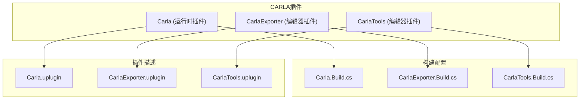
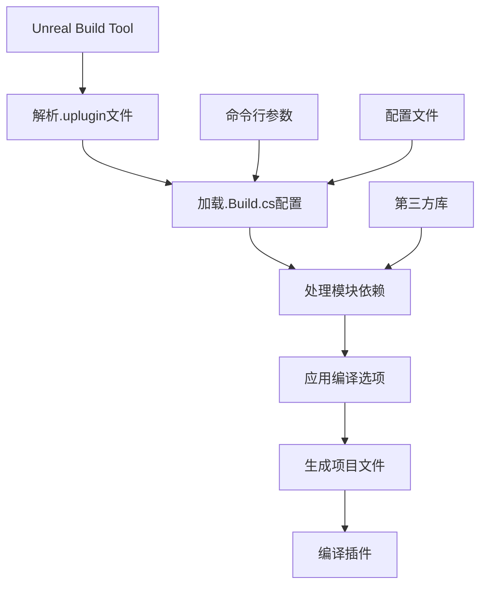
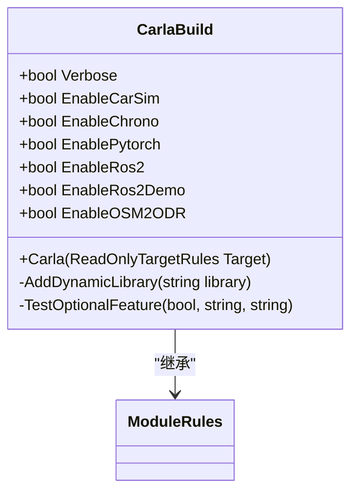
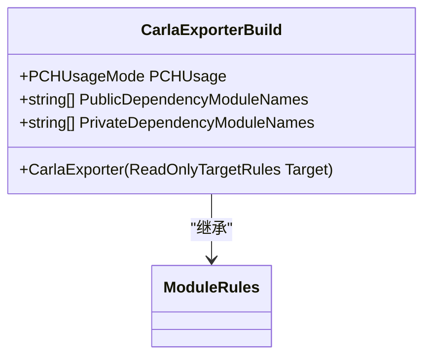
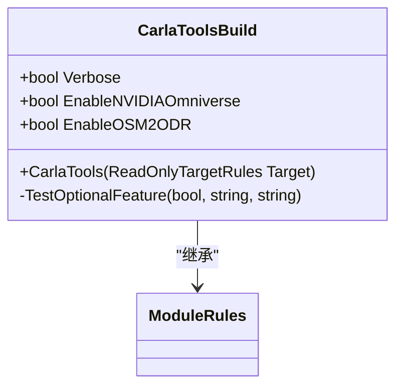
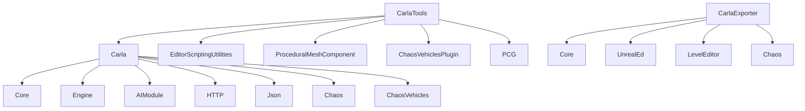

# 构建配置

**本文档中引用的文件**  
- [Carla.Build.cs](https://github.com/carla-simulator/carla/blob/ue5-dev/Unreal/CarlaUnreal/Plugins/Carla/Source/Carla/Carla.Build.cs)
- [CarlaExporter.Build.cs](https://github.com/carla-simulator/carla/blob/ue5-dev/Unreal/CarlaUnreal/Plugins/CarlaExporter/Source/CarlaExporter/CarlaExporter.Build.cs)
- [CarlaTools.Build.cs](https://github.com/carla-simulator/carla/blob/ue5-dev/Unreal/CarlaUnreal/Plugins/CarlaTools/Source/CarlaTools/CarlaTools.Build.cs)
- [CarlaUnreal.Build.cs](https://github.com/carla-simulator/carla/blob/ue5-dev/Unreal/CarlaUnreal/Source/CarlaUnreal/CarlaUnreal.Build.cs)
- [Carla.uplugin](https://github.com/carla-simulator/carla/blob/ue5-dev/Unreal/CarlaUnreal/Plugins/Carla/Carla.uplugin)
- [CarlaExporter.uplugin](https://github.com/carla-simulator/carla/blob/ue5-dev/Unreal/CarlaUnreal/Plugins/CarlaExporter/CarlaExporter.uplugin)
- [CarlaTools.uplugin](https://github.com/carla-simulator/carla/blob/ue5-dev/Unreal/CarlaUnreal/Plugins/CarlaTools/CarlaTools.uplugin)

## 目录
1. [简介](#简介)
2. [项目结构](#项目结构)
3. [核心组件](#核心组件)
4. [架构概述](#架构概述)
5. [详细组件分析](#详细组件分析)
6. [依赖分析](#依赖分析)
7. [性能考虑](#性能考虑)
8. [故障排除指南](#故障排除指南)
9. [结论](#结论)

## 简介
本文档深入分析CARLA插件的构建配置，重点研究Carla.Build.cs文件的结构和配置机制。文档详细解释了如何配置模块依赖、包含路径和编译选项，比较了不同插件（Carla、CarlaExporter、CarlaTools）的构建配置差异及其原因。同时提供配置自定义插件构建设置的完整指南，包括第三方库集成、条件编译和平台特定配置。文档还解释了构建系统与Unreal Build Tool的交互机制，以及如何处理不同Unreal Engine版本的兼容性问题。

## 项目结构
CARLA插件的构建配置主要分布在Unreal/CarlaUnreal/Plugins目录下的各个插件中。每个插件都有独立的构建配置文件（.Build.cs）和插件描述文件（.uplugin），这些文件共同定义了插件的编译行为、依赖关系和运行时特性。

**图示来源**
- [Carla.uplugin](https://github.com/carla-simulator/carla/blob/ue5-dev/Unreal/CarlaUnreal/Plugins/Carla/Carla.uplugin)
- [CarlaExporter.uplugin](https://github.com/carla-simulator/carla/blob/ue5-dev/Unreal/CarlaUnreal/Plugins/CarlaExporter/CarlaExporter.uplugin)
- [CarlaTools.uplugin](https://github.com/carla-simulator/carla/blob/ue5-dev/Unreal/CarlaUnreal/Plugins/CarlaTools/CarlaTools.uplugin)

**章节来源**
- [Carla.uplugin](https://github.com/carla-simulator/carla/blob/ue5-dev/Unreal/CarlaUnreal/Plugins/Carla/Carla.uplugin#L1-L40)
- [CarlaExporter.uplugin](https://github.com/carla-simulator/carla/blob/ue5-dev/Unreal/CarlaUnreal/Plugins/CarlaExporter/CarlaExporter.uplugin#L1-L24)
- [CarlaTools.uplugin](https://github.com/carla-simulator/carla/blob/ue5-dev/Unreal/CarlaUnreal/Plugins/CarlaTools/CarlaTools.uplugin#L1-L49)

## 核心组件
CARLA插件的核心构建配置由Carla.Build.cs文件定义，该文件配置了插件的编译选项、依赖模块和第三方库集成。构建系统通过命令行参数和配置文件实现灵活的条件编译，支持多种可选功能的启用和禁用。

**章节来源**
- [Carla.Build.cs](https://github.com/carla-simulator/carla/blob/ue5-dev/Unreal/CarlaUnreal/Plugins/Carla/Source/Carla/Carla.Build.cs#L1-L188)
- [CarlaTools.Build.cs](https://github.com/carla-simulator/carla/blob/ue5-dev/Unreal/CarlaUnreal/Plugins/CarlaTools/Source/CarlaTools/CarlaTools.Build.cs#L1-L147)

## 架构概述
CARLA插件的构建架构采用模块化设计，通过Unreal Build Tool（UBT）管理编译过程。构建系统支持运行时和编辑器两种插件类型，每种类型有不同的加载阶段和依赖要求。构建配置通过.Build.cs文件定义，而插件元数据通过.uplugin文件描述。

**图示来源**
- [Carla.Build.cs](https://github.com/carla-simulator/carla/blob/ue5-dev/Unreal/CarlaUnreal/Plugins/Carla/Source/Carla/Carla.Build.cs#L1-L188)
- [CarlaUnreal.Build.cs](https://github.com/carla-simulator/carla/blob/ue5-dev/Unreal/CarlaUnreal/Source/CarlaUnreal/CarlaUnreal.Build.cs#L1-L51)

## 详细组件分析

### Carla插件构建分析
Carla插件作为核心运行时插件，其构建配置支持多种可选功能的条件编译，包括CarSim、Chrono、PyTorch和ROS2集成。构建系统通过命令行参数和配置文件实现灵活的功能开关。

**图示来源**
- [Carla.Build.cs](https://github.com/carla-simulator/carla/blob/ue5-dev/Unreal/CarlaUnreal/Plugins/Carla/Source/Carla/Carla.Build.cs#L9-L187)

**章节来源**
- [Carla.Build.cs](https://github.com/carla-simulator/carla/blob/ue5-dev/Unreal/CarlaUnreal/Plugins/Carla/Source/Carla/Carla.Build.cs#L1-L188)
- [Carla.uplugin](https://github.com/carla-simulator/carla/blob/ue5-dev/Unreal/CarlaUnreal/Plugins/Carla/Carla.uplugin#L1-L40)

### CarlaExporter插件构建分析
CarlaExporter插件是一个编辑器插件，主要用于导出几何数据供Recast使用。其构建配置相对简单，主要依赖于Unreal Editor的核心模块。

**图示来源**
- [CarlaExporter.Build.cs](https://github.com/carla-simulator/carla/blob/ue5-dev/Unreal/CarlaUnreal/Plugins/CarlaExporter/Source/CarlaExporter/CarlaExporter.Build.cs#L9-L33)

**章节来源**
- [CarlaExporter.Build.cs](https://github.com/carla-simulator/carla/blob/ue5-dev/Unreal/CarlaUnreal/Plugins/CarlaExporter/Source/CarlaExporter/CarlaExporter.Build.cs#L1-L34)
- [CarlaExporter.uplugin](https://github.com/carla-simulator/carla/blob/ue5-dev/Unreal/CarlaUnreal/Plugins/CarlaExporter/CarlaExporter.uplugin#L1-L24)

### CarlaTools插件构建分析
CarlaTools插件是一个功能丰富的编辑器工具插件，提供了CARLA引擎的各种开发工具。其构建配置支持NVIDIA Omniverse和OSM2ODR功能的条件编译。

**图示来源**
- [CarlaTools.Build.cs](https://github.com/carla-simulator/carla/blob/ue5-dev/Unreal/CarlaUnreal/Plugins/CarlaTools/Source/CarlaTools/CarlaTools.Build.cs#L8-L146)

**章节来源**
- [CarlaTools.Build.cs](https://github.com/carla-simulator/carla/blob/ue5-dev/Unreal/CarlaUnreal/Plugins/CarlaTools/Source/CarlaTools/CarlaTools.Build.cs#L1-L147)
- [CarlaTools.uplugin](https://github.com/carla-simulator/carla/blob/ue5-dev/Unreal/CarlaUnreal/Plugins/CarlaTools/CarlaTools.uplugin#L1-L49)

## 依赖分析
CARLA插件的依赖关系复杂且层次分明，不同插件之间存在明确的依赖层级。构建系统通过PublicDependencyModuleNames和PrivateDependencyModuleNames精确控制依赖的可见性。

**图示来源**
- [Carla.uplugin](https://github.com/carla-simulator/carla/blob/ue5-dev/Unreal/CarlaUnreal/Plugins/Carla/Carla.uplugin#L16-L38)
- [CarlaTools.uplugin](https://github.com/carla-simulator/carla/blob/ue5-dev/Unreal/CarlaUnreal/Plugins/CarlaTools/CarlaTools.uplugin#L25-L47)
- [Carla.Build.cs](https://github.com/carla-simulator/carla/blob/ue5-dev/Unreal/CarlaUnreal/Plugins/Carla/Source/Carla/Carla.Build.cs#L104-L123)
- [CarlaTools.Build.cs](https://github.com/carla-simulator/carla/blob/ue5-dev/Unreal/CarlaUnreal/Plugins/CarlaTools/Source/CarlaTools/CarlaTools.Build.cs#L79-L123)

**章节来源**
- [Carla.uplugin](https://github.com/carla-simulator/carla/blob/ue5-dev/Unreal/CarlaUnreal/Plugins/Carla/Carla.uplugin#L1-L40)
- [CarlaTools.uplugin](https://github.com/carla-simulator/carla/blob/ue5-dev/Unreal/CarlaUnreal/Plugins/CarlaTools/CarlaTools.uplugin#L1-L49)
- [Carla.Build.cs](https://github.com/carla-simulator/carla/blob/ue5-dev/Unreal/CarlaUnreal/Plugins/Carla/Source/Carla/Carla.Build.cs#L1-L188)
- [CarlaTools.Build.cs](https://github.com/carla-simulator/carla/blob/ue5-dev/Unreal/CarlaUnreal/Plugins/CarlaTools/Source/CarlaTools/CarlaTools.Build.cs#L1-L147)

## 性能考虑
CARLA插件的构建配置考虑了性能优化，通过预编译头文件（PCH）和运行时依赖管理来提高编译效率。构建系统还支持延迟加载动态库，以优化运行时性能。

**章节来源**
- [Carla.Build.cs](https://github.com/carla-simulator/carla/blob/ue5-dev/Unreal/CarlaUnreal/Plugins/Carla/Source/Carla/Carla.Build.cs#L38-L40)
- [CarlaTools.Build.cs](https://github.com/carla-simulator/carla/blob/ue5-dev/Unreal/CarlaUnreal/Plugins/CarlaTools/Source/CarlaTools/CarlaTools.Build.cs#L25-L27)
- [CarlaExporter.Build.cs](https://github.com/carla-simulator/carla/blob/ue5-dev/Unreal/CarlaUnreal/Plugins/CarlaExporter/Source/CarlaExporter/CarlaExporter.Build.cs#L15-L15)

## 故障排除指南
在配置CARLA插件构建时，常见的问题包括依赖模块未正确声明、第三方库路径配置错误以及条件编译标志未正确设置。建议仔细检查.Build.cs文件中的依赖列表和配置文件。

**章节来源**
- [Carla.Build.cs](https://github.com/carla-simulator/carla/blob/ue5-dev/Unreal/CarlaUnreal/Plugins/Carla/Source/Carla/Carla.Build.cs#L50-L70)
- [CarlaTools.Build.cs](https://github.com/carla-simulator/carla/blob/ue5-dev/Unreal/CarlaUnreal/Plugins/CarlaTools/Source/CarlaTools/CarlaTools.Build.cs#L31-L50)
- [CarlaExporter.Build.cs](https://github.com/carla-simulator/carla/blob/ue5-dev/Unreal/CarlaUnreal/Plugins/CarlaExporter/Source/CarlaExporter/CarlaExporter.Build.cs#L17-L31)

## 结论
CARLA插件的构建配置系统设计精良，支持灵活的条件编译和模块化依赖管理。通过深入理解.Carla.Build.cs等构建文件的结构和机制，开发者可以有效地配置和定制插件的构建过程，满足特定项目的需求。建议开发者遵循最佳实践，合理组织依赖关系，优化构建性能。