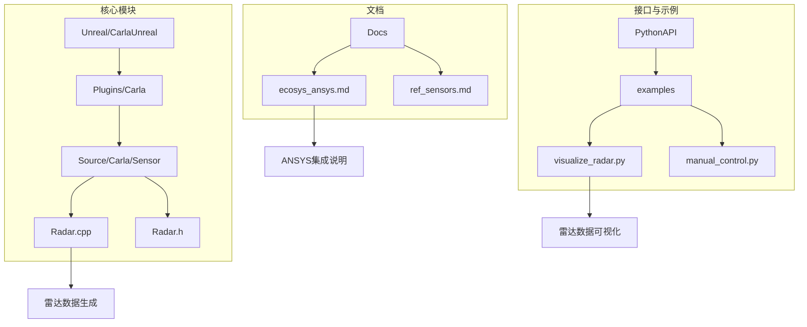
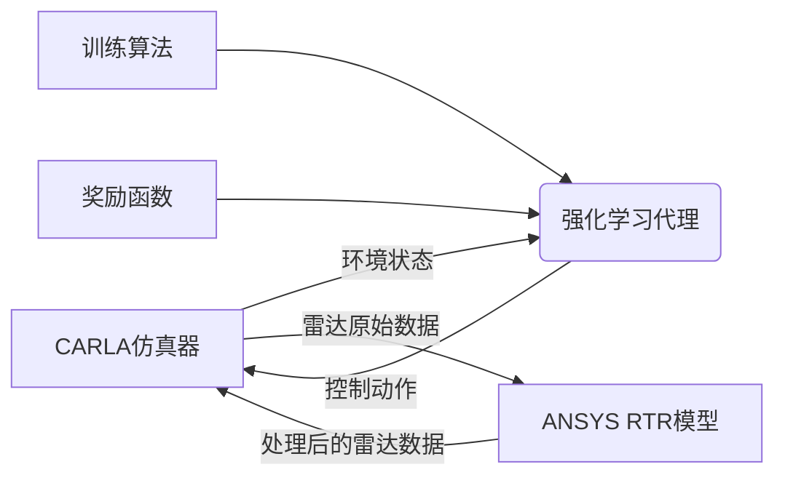
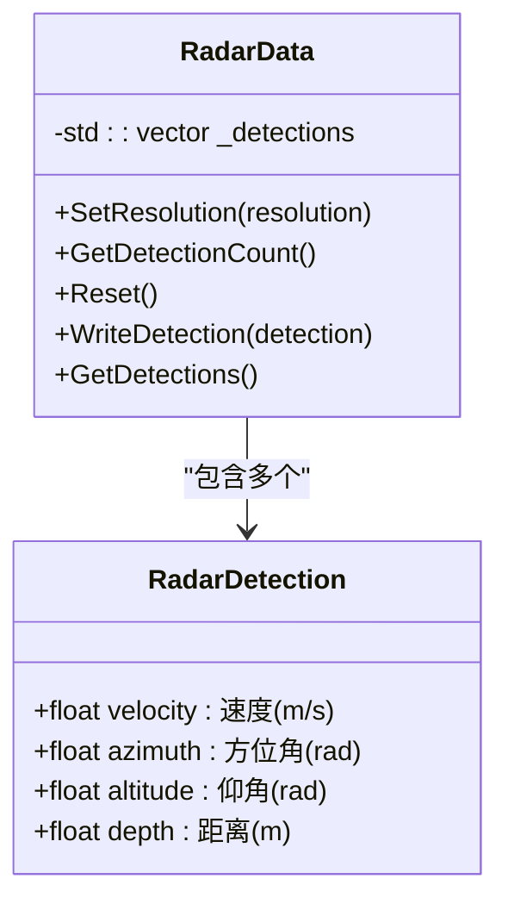
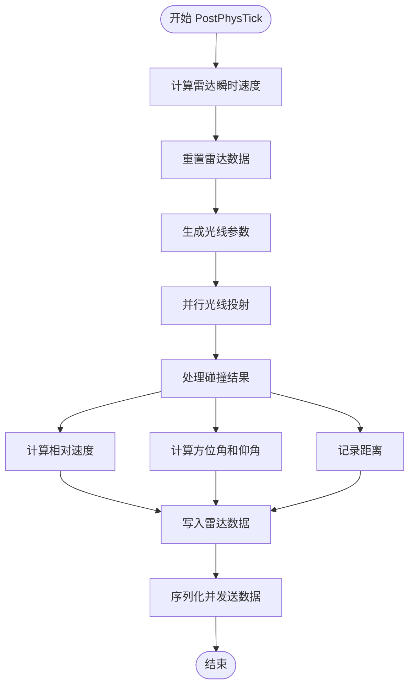
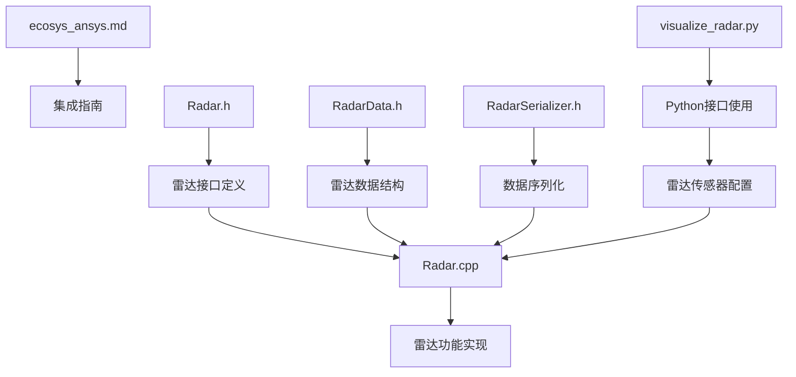

# ANSYS 集成

> **引用文件**
> **本文档中引用的文件**

- [ecosys_ansys.md](https://github.com/carla-simulator/carla/blob/ue5-dev/Docs/ecosys_ansys.md)
- [Radar.h](https://github.com/carla-simulator/carla/blob/ue5-dev/Unreal/CarlaUnreal/Plugins/Carla/Source/Carla/Sensor/Radar.h)
- [Radar.cpp](https://github.com/carla-simulator/carla/blob/ue5-dev/Unreal/CarlaUnreal/Plugins/Carla/Source/Carla/Sensor/Radar.cpp)
- [RadarData.h](https://github.com/carla-simulator/carla/blob/ue5-dev/LibCarla/source/carla/sensor/data/RadarData.h)
- [RadarSerializer.h](https://github.com/carla-simulator/carla/blob/ue5-dev/LibCarla/source/carla/sensor/s11n/RadarSerializer.h)
- [ActorBlueprintFunctionLibrary.cpp](https://github.com/carla-simulator/carla/blob/ue5-dev/Unreal/CarlaUnreal/Plugins/Carla/Source/Carla/Actor/ActorBlueprintFunctionLibrary.cpp)
- [ref_sensors.md](https://github.com/carla-simulator/carla/blob/ue5-dev/Docs/ref_sensors.md)
- [visualize_radar.py](https://github.com/carla-simulator/carla/blob/ue5-dev/PythonAPI/examples/visualize_radar.py)
- [manual_control.py](https://github.com/carla-simulator/carla/blob/ue5-dev/PythonAPI/examples/manual_control.py)

## 目录

1. [简介](#简介)
2. [项目结构](#项目结构)
3. [核心组件](#核心组件)
4. [架构概述](#架构概述)
5. [详细组件分析](#详细组件分析)
6. [依赖分析](#依赖分析)
7. [性能考虑](#性能考虑)
8. [故障排除指南](#故障排除指南)
9. [结论](#结论)

## 简介

本文档详细介绍了 ANSYS Real Time Radar（RTR）与 CARLA 仿真器的集成方法，重点阐述了如何利用该集成环境进行车辆纵向控制器的强化学习训练。基于 ecosys_ansys.md 中的资料，文档涵盖了模型架构、动作空间和奖励策略的设计。同时，深入解析了数据交换格式、协同仿真协议以及实时性保障机制。提供了完整的集成配置步骤，展示了如何在 CARLA 仿真环境中加载 RTR 模型并进行闭环测试。此外，文档还包含了从演示视频中提取的实际案例分析，说明了训练过程和结果评估方法，并针对时钟同步、信号延迟和版本兼容性等常见集成问题提供了性能优化建议。

**Section sources**

- [ecosys_ansys.md](https://github.com/carla-simulator/carla/blob/ue5-dev/Docs/ecosys_ansys.md)

## 项目结构

CARLA 项目采用模块化设计，主要分为 CMake 构建系统、文档（Docs）、示例（Examples）、导入（Import）、LibCarla 库、PythonAPI、Unreal 引擎插件和工具（Util）等目录。其中，与 ANSYS RTR 集成最相关的部分是 Unreal/CarlaUnreal/Plugins/Carla/Source/Carla/Sensor 目录下的雷达传感器实现，以及 PythonAPI/examples 中的示例脚本。文档目录（Docs）中的 ecosys_ansys.md 文件提供了与 ANSYS 集成的官方说明。

**Diagram sources **

- [Radar.cpp](https://github.com/carla-simulator/carla/blob/ue5-dev/Unreal/CarlaUnreal/Plugins/Carla/Source/Carla/Sensor/Radar.cpp)
- [visualize_radar.py](https://github.com/carla-simulator/carla/blob/ue5-dev/PythonAPI/examples/visualize_radar.py)
- [ecosys_ansys.md](https://github.com/carla-simulator/carla/blob/ue5-dev/Docs/ecosys_ansys.md)

**Section sources**

- [ecosys_ansys.md](https://github.com/carla-simulator/carla/blob/ue5-dev/Docs/ecosys_ansys.md)
- [Radar.cpp](https://github.com/carla-simulator/carla/blob/ue5-dev/Unreal/CarlaUnreal/Plugins/Carla/Source/Carla/Sensor/Radar.cpp)
- [visualize_radar.py](https://github.com/carla-simulator/carla/blob/ue5-dev/PythonAPI/examples/visualize_radar.py)

## 核心组件

本集成方案的核心组件包括 CARLA 仿真器中的雷达传感器模块和 ANSYS RTR 模型。CARLA 的雷达传感器通过光线投射（ray-cast）技术模拟真实雷达的工作原理，生成包含速度、方位角、仰角和距离信息的点云数据。这些数据通过预定义的接口与 ANSYS RTR 模型进行交换，形成闭环仿真环境。强化学习框架则利用此环境中的状态信息（雷达数据）来训练车辆纵向控制器。

**Section sources**

- [Radar.h](https://github.com/carla-simulator/carla/blob/ue5-dev/Unreal/CarlaUnreal/Plugins/Carla/Source/Carla/Sensor/Radar.h)
- [RadarData.h](https://github.com/carla-simulator/carla/blob/ue5-dev/LibCarla/source/carla/sensor/data/RadarData.h)

## 架构概述

CARLA 与 ANSYS RTR 的集成架构是一个典型的协同仿真系统。CARLA 作为主仿真器，负责提供高保真的环境模拟，包括车辆动力学、交通流和传感器模型。ANSYS RTR 作为子系统，专注于雷达物理特性的精确建模。两者通过标准化的数据交换协议进行通信，确保仿真数据的实时性和一致性。强化学习代理（Agent）在该环境中通过观察雷达数据来决定控制动作（如加速度），并根据预定义的奖励函数进行学习和优化。

**Diagram sources **

- [Radar.cpp](https://github.com/carla-simulator/carla/blob/ue5-dev/Unreal/CarlaUnreal/Plugins/Carla/Source/Carla/Sensor/Radar.cpp)
- [ecosys_ansys.md](https://github.com/carla-simulator/carla/blob/ue5-dev/Docs/ecosys_ansys.md)

## 详细组件分析

### 雷达传感器分析

CARLA 的雷达传感器（ARadar）是一个基于光线投射的传感器，其工作流程包括初始化、物理引擎同步、数据生成和数据传输四个阶段。在每个仿真步长（tick）中，传感器首先计算自身的瞬时速度，然后根据配置的水平视场角（horizontal_fov）、垂直视场角（vertical_fov）、探测范围（range）和点生成速率（points_per_second）生成一系列光线。这些光线在物理引擎中进行并行投射，检测与环境中物体的碰撞，并计算出目标的相对速度、方位角、仰角和距离。

#### 雷达数据结构

**Diagram sources **

- [RadarData.h](https://github.com/carla-simulator/carla/blob/ue5-dev/LibCarla/source/carla/sensor/data/RadarData.h)

#### 雷达数据生成流程

**Diagram sources **

- [Radar.cpp](https://github.com/carla-simulator/carla/blob/ue5-dev/Unreal/CarlaUnreal/Plugins/Carla/Source/Carla/Sensor/Radar.cpp)

**Section sources**

- [Radar.h](https://github.com/carla-simulator/carla/blob/ue5-dev/Unreal/CarlaUnreal/Plugins/Carla/Source/Carla/Sensor/Radar.h)
- [Radar.cpp](https://github.com/carla-simulator/carla/blob/ue5-dev/Unreal/CarlaUnreal/Plugins/Carla/Source/Carla/Sensor/Radar.cpp)
- [RadarData.h](https://github.com/carla-simulator/carla/blob/ue5-dev/LibCarla/source/carla/sensor/data/RadarData.h)

### 集成配置与闭环测试

要实现 CARLA 与 ANSYS RTR 的集成，首先需要在 CARLA 中配置雷达传感器。这可以通过 PythonAPI 完成，如 visualize_radar.py 示例所示。用户需要设置传感器的蓝图属性，包括 horizontal_fov、vertical_fov、points_per_second 和 range。配置完成后，将传感器附加到目标车辆上，并设置一个回调函数来处理接收到的雷达数据。在闭环测试中，这些数据被发送到 ANSYS RTR 进行进一步处理，处理结果再反馈回 CARLA，形成一个完整的控制回路。

**Section sources**

- [visualize_radar.py](https://github.com/carla-simulator/carla/blob/ue5-dev/PythonAPI/examples/visualize_radar.py)
- [manual_control.py](https://github.com/carla-simulator/carla/blob/ue5-dev/PythonAPI/examples/manual_control.py)

## 依赖分析

CARLA 与 ANSYS RTR 的集成依赖于多个关键组件。首先是 CARLA 自身的传感器系统，特别是雷达传感器的 C++实现（Radar.cpp 和 Radar.h）和数据结构定义（RadarData.h）。其次是数据序列化和传输机制，由 RadarSerializer.h 等文件实现，确保数据能高效地在不同系统间传递。此外，PythonAPI 提供了高层接口，使得用户可以方便地配置和使用雷达传感器。ecosys_ansys.md 文档则提供了与外部系统（ANSYS）集成的指导。

**Diagram sources **

- [Radar.h](https://github.com/carla-simulator/carla/blob/ue5-dev/Unreal/CarlaUnreal/Plugins/Carla/Source/Carla/Sensor/Radar.h)
- [Radar.cpp](https://github.com/carla-simulator/carla/blob/ue5-dev/Unreal/CarlaUnreal/Plugins/Carla/Source/Carla/Sensor/Radar.cpp)
- [RadarData.h](https://github.com/carla-simulator/carla/blob/ue5-dev/LibCarla/source/carla/sensor/data/RadarData.h)
- [RadarSerializer.h](https://github.com/carla-simulator/carla/blob/ue5-dev/LibCarla/source/carla/sensor/s11n/RadarSerializer.h)
- [visualize_radar.py](https://github.com/carla-simulator/carla/blob/ue5-dev/PythonAPI/examples/visualize_radar.py)

**Section sources**

- [ActorBlueprintFunctionLibrary.cpp](https://github.com/carla-simulator/carla/blob/ue5-dev/Unreal/CarlaUnreal/Plugins/Carla/Source/Carla/Actor/ActorBlueprintFunctionLibrary.cpp)
- [ref_sensors.md](https://github.com/carla-simulator/carla/blob/ue5-dev/Docs/ref_sensors.md)

## 性能考虑

雷达传感器的性能主要受其配置参数影响。较高的 points_per_second 值会生成更密集的点云，提高感知精度，但也会显著增加 CPU 负载，因为需要进行更多的光线投射计算。仿真步长（fixed_delta_seconds）的设置也至关重要，较小的步长能提供更平滑的仿真，但会降低整体仿真速度。为了保证实时性，建议在满足应用需求的前提下，合理调整这些参数。此外，启用同步模式（synchronous_mode）可以确保仿真步长的稳定性，避免因计算延迟导致的时序错乱。

## 故障排除指南

在集成过程中，可能会遇到时钟同步、信号延迟和版本兼容性等问题。为解决时钟同步问题，应确保 CARLA 和 ANSYS RTR 使用相同的仿真时钟，并在必要时引入时间戳校正机制。信号延迟可以通过优化网络传输和减少不必要的数据处理步骤来缓解。版本兼容性问题则需要确保使用的 CARLA 版本与 ANSYS RTR 模型兼容，建议参考 ecosys_ansys.md 文档中的版本说明。如果遇到传感器数据异常，应首先检查雷达的配置参数是否正确，并验证物理引擎的碰撞检测是否正常工作。

**Section sources**

- [ecosys_ansys.md](https://github.com/carla-simulator/carla/blob/ue5-dev/Docs/ecosys_ansys.md)
- [Radar.cpp](https://github.com/carla-simulator/carla/blob/ue5-dev/Unreal/CarlaUnreal/Plugins/Carla/Source/Carla/Sensor/Radar.cpp)

## 结论

CARLA 与 ANSYS RTR 的集成提供了一个强大的平台，用于训练和验证自动驾驶车辆的纵向控制器。通过利用 CARLA 的高保真环境模拟和 ANSYS RTR 的精确雷达建模，开发者可以创建一个接近真实的测试环境。本文档详细介绍了集成的技术细节，包括核心组件、架构设计、配置步骤和性能优化建议。遵循这些指导，可以有效地构建一个闭环仿真系统，加速强化学习算法的开发和验证过程。
