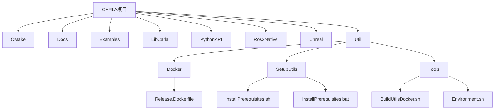
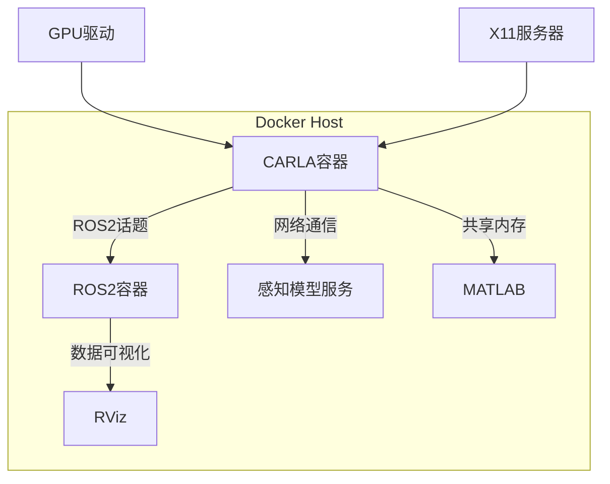
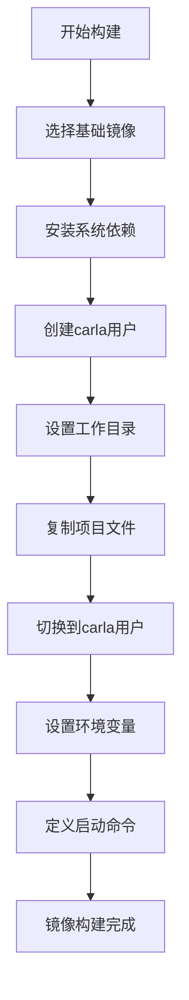
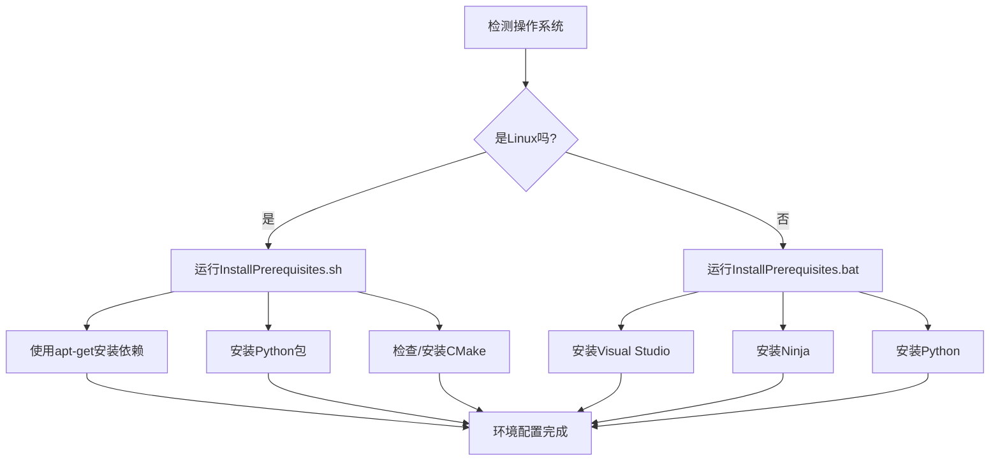
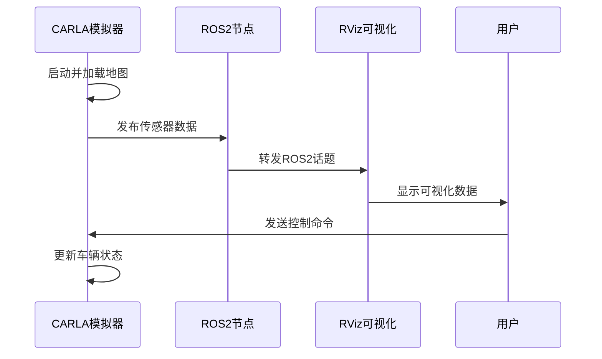
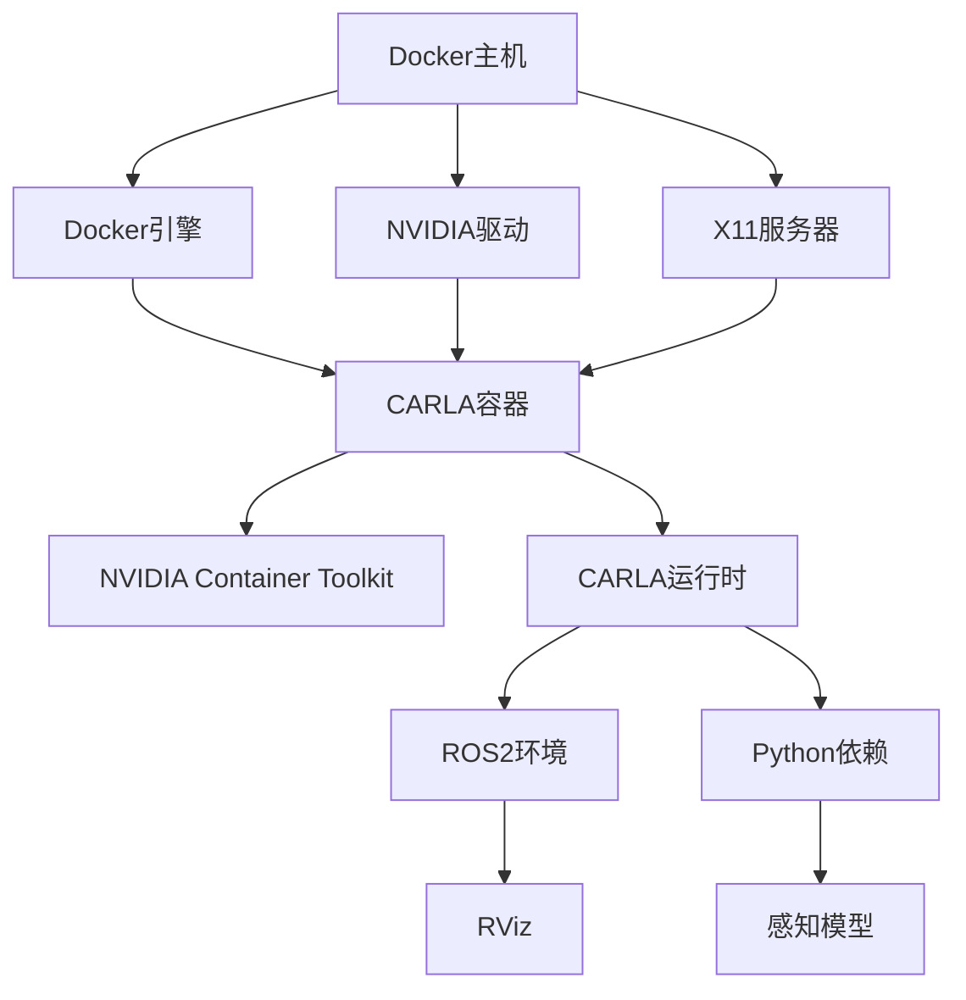

# Docker 部署集成

**本文档引用的文件**   
- [Release.Dockerfile](https://github.com/carla-simulator/carla/blob/ue5-dev/Util/Docker/Release.Dockerfile)
- [InstallPrerequisites.sh](https://github.com/carla-simulator/carla/blob/ue5-dev/Util/SetupUtils/InstallPrerequisites.sh)
- [InstallPrerequisites.bat](https://github.com/carla-simulator/carla/blob/ue5-dev/Util/SetupUtils/InstallPrerequisites.bat)
- [build_docker.md](https://github.com/carla-simulator/carla/blob/ue5-dev/Docs/build_docker.md)
- [start_quickstart.md](https://github.com/carla-simulator/carla/blob/ue5-dev/Docs/start_quickstart.md)
- [ros2_native.py](https://github.com/carla-simulator/carla/blob/ue5-dev/PythonAPI/examples/ros2/ros2_native.py)
- [run_rviz.sh](https://github.com/carla-simulator/carla/blob/ue5-dev/PythonAPI/examples/ros2/run_rviz.sh)
- [BuildUtilsDocker.sh](https://github.com/carla-simulator/carla/blob/ue5-dev/Util/Tools/BuildUtilsDocker.sh)
- [Environment.sh](https://github.com/carla-simulator/carla/blob/ue5-dev/Util/Tools/Environment.sh)
- [commands.h](https://github.com/carla-simulator/carla/blob/ue5-dev/LibCarla/source/carla/multigpu/commands.h)
- [CarlaEngine.cpp](https://github.com/carla-simulator/carla/blob/ue5-dev/Unreal/CarlaUnreal/Plugins/Carla/Source/Carla/Game/CarlaEngine.cpp)

## 目录
1. [简介](#简介)
2. [项目结构](#项目结构)
3. [核心组件](#核心组件)
4. [架构概述](#架构概述)
5. [详细组件分析](#详细组件分析)
6. [依赖分析](#依赖分析)
7. [性能考虑](#性能考虑)
8. [故障排除指南](#故障排除指南)
9. [结论](#结论)

## 简介
本文档提供了关于使用Docker容器化部署CARLA并与其他工具链集成的全面指南。基于Release.Dockerfile详细说明镜像构建过程，包括依赖项安装、环境变量配置和端口映射策略。结合SetupUtils中的安装脚本，描述如何自动化配置开发环境以支持第三方工具集成。提供多容器编排示例（如Docker Compose），展示CARLA与ROS2、MATLAB或感知模型服务的协同运行模式。涵盖性能调优建议、GPU加速配置和网络延迟优化技巧。包含常见部署问题的解决方案，如权限错误、驱动不兼容和跨平台构建问题。

## 项目结构
CARLA项目的结构组织清晰，主要分为几个关键目录：CMake包含构建配置，Docs包含文档，Examples包含示例代码，LibCarla包含核心库源码，PythonAPI包含Python接口，Ros2Native包含ROS2集成，Unreal包含Unreal引擎相关代码，Util包含各种工具脚本。特别地，Util/Docker目录包含Docker相关配置，Util/SetupUtils包含环境设置脚本，这些是容器化部署的关键组成部分。

**图示来源**
- [Release.Dockerfile](https://github.com/carla-simulator/carla/blob/ue5-dev/Util/Docker/Release.Dockerfile)
- [InstallPrerequisites.sh](https://github.com/carla-simulator/carla/blob/ue5-dev/Util/SetupUtils/InstallPrerequisites.sh)
- [InstallPrerequisites.bat](https://github.com/carla-simulator/carla/blob/ue5-dev/Util/SetupUtils/InstallPrerequisites.bat)
- [BuildUtilsDocker.sh](https://github.com/carla-simulator/carla/blob/ue5-dev/Util/Tools/BuildUtilsDocker.sh)
- [Environment.sh](https://github.com/carla-simulator/carla/blob/ue5-dev/Util/Tools/Environment.sh)

**章节来源**
- [Release.Dockerfile](https://github.com/carla-simulator/carla/blob/ue5-dev/Util/Docker/Release.Dockerfile)
- [InstallPrerequisites.sh](https://github.com/carla-simulator/carla/blob/ue5-dev/Util/SetupUtils/InstallPrerequisites.sh)
- [InstallPrerequisites.bat](https://github.com/carla-simulator/carla/blob/ue5-dev/Util/SetupUtils/InstallPrerequisites.bat)

## 核心组件
CARLA的核心组件包括LibCarla（C++核心库）、PythonAPI（Python接口）、Unreal引擎集成和ROS2原生接口。容器化部署的关键在于Release.Dockerfile定义的镜像构建过程，它基于Ubuntu基础镜像，安装必要的图形和系统依赖，创建carla用户，并设置工作目录。SetupUtils中的安装脚本自动化了开发环境的配置，确保所有依赖项正确安装。

**章节来源**
- [Release.Dockerfile](https://github.com/carla-simulator/carla/blob/ue5-dev/Util/Docker/Release.Dockerfile)
- [InstallPrerequisites.sh](https://github.com/carla-simulator/carla/blob/ue5-dev/Util/SetupUtils/InstallPrerequisites.sh)
- [InstallPrerequisites.bat](https://github.com/carla-simulator/carla/blob/ue5-dev/Util/SetupUtils/InstallPrerequisites.bat)

## 架构概述
CARLA的Docker部署架构采用分层设计，基础层是Ubuntu操作系统，中间层是CARLA运行时环境，顶层是应用和服务。通过Docker容器化，CARLA可以与ROS2、MATLAB等外部工具链无缝集成。多容器编排允许CARLA服务器、感知模型服务和可视化工具（如RViz）协同工作，形成完整的自动驾驶仿真环境。

**图示来源**
- [Release.Dockerfile](https://github.com/carla-simulator/carla/blob/ue5-dev/Util/Docker/Release.Dockerfile)
- [run_rviz.sh](https://github.com/carla-simulator/carla/blob/ue5-dev/PythonAPI/examples/ros2/run_rviz.sh)
- [build_docker.md](https://github.com/carla-simulator/carla/blob/ue5-dev/Docs/build_docker.md)

## 详细组件分析

### Docker镜像构建分析
Release.Dockerfile定义了CARLA Docker镜像的构建过程。它从Ubuntu基础镜像开始，安装SDL2、X服务器和Vulkan等图形依赖，创建非特权的carla用户以提高安全性，设置工作目录，并配置SDL视频驱动为x11。这种设计确保了容器内的CARLA应用能够正确处理图形输出。

**图示来源**
- [Release.Dockerfile](https://github.com/carla-simulator/carla/blob/ue5-dev/Util/Docker/Release.Dockerfile)

**章节来源**
- [Release.Dockerfile](https://github.com/carla-simulator/carla/blob/ue5-dev/Util/Docker/Release.Dockerfile)

### 环境自动化配置分析
SetupUtils中的InstallPrerequisites.sh和InstallPrerequisites.bat脚本提供了跨平台的环境自动化配置。Linux脚本使用apt-get安装构建工具、图形库和Python依赖，检查并安装适当版本的CMake。Windows脚本则负责安装Visual Studio、Ninja构建系统和Python环境。这些脚本确保了开发环境的一致性，为容器化部署奠定了基础。

**图示来源**
- [InstallPrerequisites.sh](https://github.com/carla-simulator/carla/blob/ue5-dev/Util/SetupUtils/InstallPrerequisites.sh)
- [InstallPrerequisites.bat](https://github.com/carla-simulator/carla/blob/ue5-dev/Util/SetupUtils/InstallPrerequisites.bat)

**章节来源**
- [InstallPrerequisites.sh](https://github.com/carla-simulator/carla/blob/ue5-dev/Util/SetupUtils/InstallPrerequisites.sh)
- [InstallPrerequisites.bat](https://github.com/carla-simulator/carla/blob/ue5-dev/Util/SetupUtils/InstallPrerequisites.bat)

### ROS2集成分析
CARLA通过原生ROS2接口与机器人操作系统集成。LibCarla中的MultiGPUCommand枚举定义了ENABLE_ROS、DISABLE_ROS等ROS相关命令，允许在运行时动态启用或禁用ROS功能。Python示例ros2_native.py展示了如何配置车辆和传感器并通过ROS2发布数据，而run_rviz.sh脚本则演示了如何使用Docker运行RViz进行数据可视化。

**图示来源**
- [commands.h](https://github.com/carla-simulator/carla/blob/ue5-dev/LibCarla/source/carla/multigpu/commands.h)
- [CarlaEngine.cpp](https://github.com/carla-simulator/carla/blob/ue5-dev/Unreal/CarlaUnreal/Plugins/Carla/Source/Carla/Game/CarlaEngine.cpp)
- [ros2_native.py](https://github.com/carla-simulator/carla/blob/ue5-dev/PythonAPI/examples/ros2/ros2_native.py)
- [run_rviz.sh](https://github.com/carla-simulator/carla/blob/ue5-dev/PythonAPI/examples/ros2/run_rviz.sh)

**章节来源**
- [commands.h](https://github.com/carla-simulator/carla/blob/ue5-dev/LibCarla/source/carla/multigpu/commands.h)
- [CarlaEngine.cpp](https://github.com/carla-simulator/carla/blob/ue5-dev/Unreal/CarlaUnreal/Plugins/Carla/Source/Carla/Game/CarlaEngine.cpp)
- [ros2_native.py](https://github.com/carla-simulator/carla/blob/ue5-dev/PythonAPI/examples/ros2/ros2_native.py)

## 依赖分析
CARLA的Docker部署依赖于多个关键组件：Docker引擎、NVIDIA Container Toolkit（用于GPU加速）、X11协议（用于图形显示）和ROS2环境。这些依赖通过分层方式管理，基础依赖由Docker主机提供，运行时依赖由容器镜像包含，应用依赖由Python包管理器处理。这种分层依赖管理确保了部署的灵活性和可移植性。

**图示来源**
- [build_docker.md](https://github.com/carla-simulator/carla/blob/ue5-dev/Docs/build_docker.md)
- [Release.Dockerfile](https://github.com/carla-simulator/carla/blob/ue5-dev/Util/Docker/Release.Dockerfile)
- [run_rviz.sh](https://github.com/carla-simulator/carla/blob/ue5-dev/PythonAPI/examples/ros2/run_rviz.sh)

**章节来源**
- [build_docker.md](https://github.com/carla-simulator/carla/blob/ue5-dev/Docs/build_docker.md)
- [start_quickstart.md](https://github.com/carla-simulator/carla/blob/ue5-dev/Docs/start_quickstart.md)

## 性能考虑
为了优化CARLA容器化部署的性能，建议采用以下策略：使用--runtime=nvidia参数启用GPU加速，通过--net=host减少网络开销，利用--shm-size增加共享内存大小以提高传感器数据传输效率。对于无头运行，使用-RenderOffScreen参数避免不必要的图形渲染。此外，合理配置Docker资源限制（CPU、内存）可以防止资源争用，确保仿真稳定性。

**章节来源**
- [build_docker.md](https://github.com/carla-simulator/carla/blob/ue5-dev/Docs/build_docker.md)
- [Release.Dockerfile](https://github.com/carla-simulator/carla/blob/ue5-dev/Util/Docker/Release.Dockerfile)

## 故障排除指南
常见的Docker部署问题包括权限错误、驱动不兼容和跨平台构建问题。对于权限错误，确保用户在docker组中且X11权限正确配置。驱动不兼容问题通常需要更新NVIDIA驱动和Container Toolkit到兼容版本。跨平台构建问题可通过使用多阶段构建和平台特定的Docker镜像来解决。调试时，检查容器日志、验证GPU可见性（nvidia-smi）和测试基本图形功能是有效的诊断步骤。

**章节来源**
- [build_docker.md](https://github.com/carla-simulator/carla/blob/ue5-dev/Docs/build_docker.md)
- [start_quickstart.md](https://github.com/carla-simulator/carla/blob/ue5-dev/Docs/start_quickstart.md)
- [run_rviz.sh](https://github.com/carla-simulator/carla/blob/ue5-dev/PythonAPI/examples/ros2/run_rviz.sh)

## 结论
CARLA的Docker容器化部署提供了一种高效、可移植的方式来运行自动驾驶仿真。通过Release.Dockerfile和SetupUtils脚本，可以自动化构建和配置过程，确保环境一致性。与ROS2等工具链的集成使得CARLA成为完整的自动驾驶开发平台。遵循本文档的指导，开发者可以快速建立功能完备的仿真环境，专注于算法开发而非环境配置。