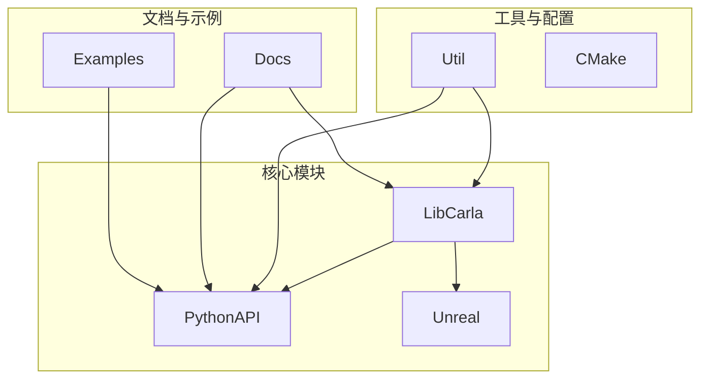
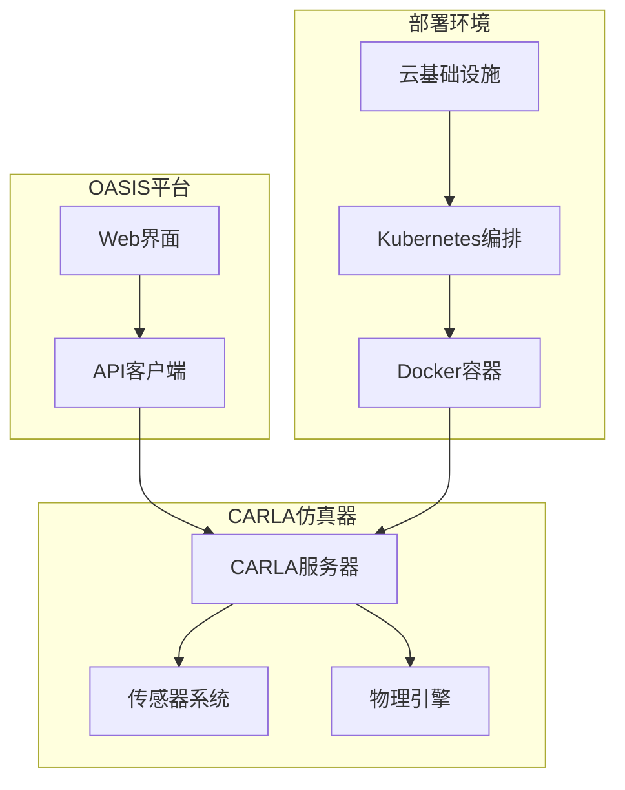
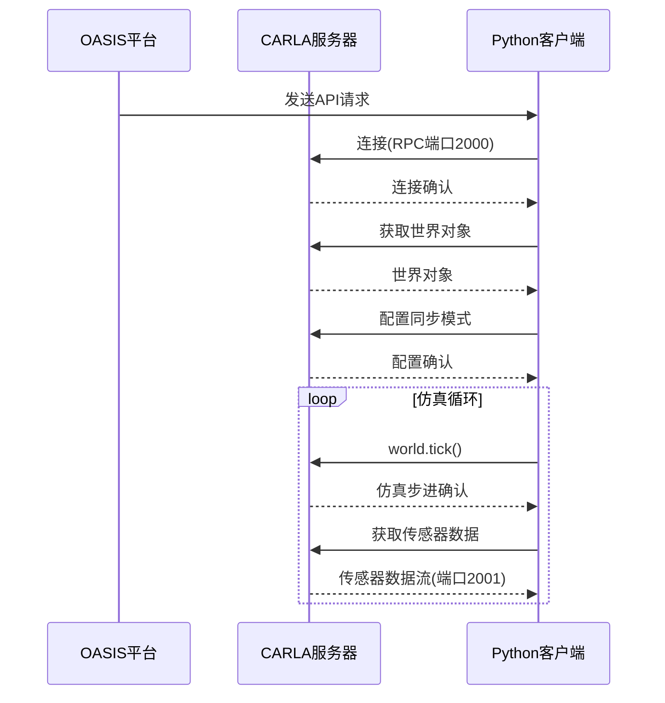
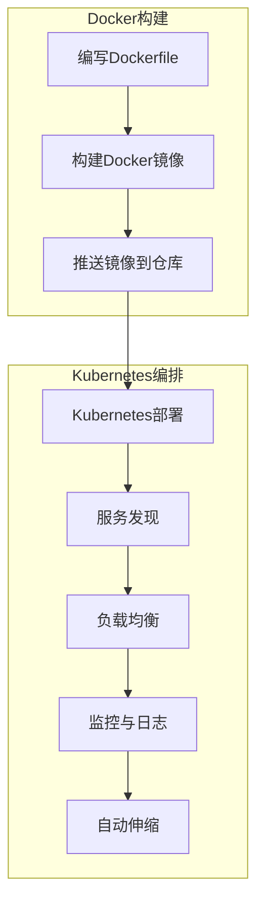
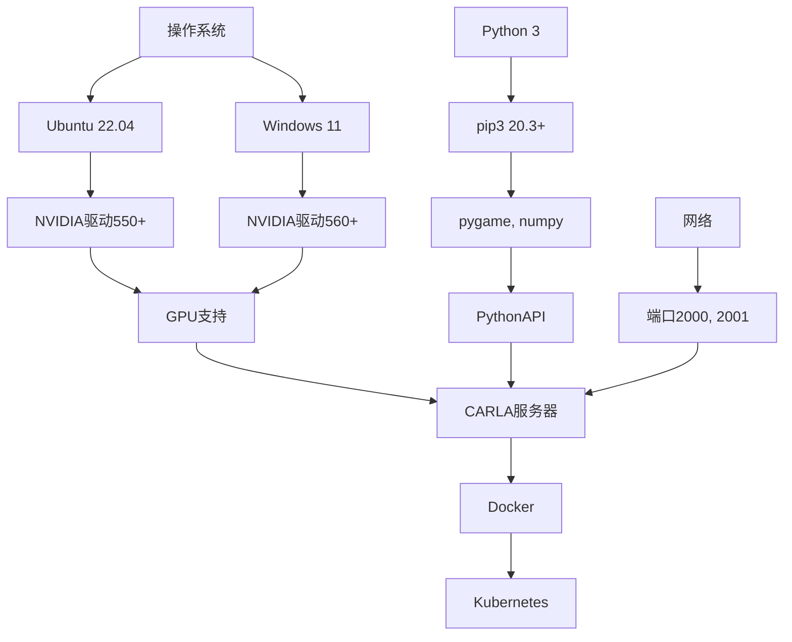

# API与部署集成

**本文档中引用的文件**  
- [ecosys_synkrotron.md](https://github.com/carla-simulator/carla/blob/ue5-dev/Docs/ecosys_synkrotron.md)
- [build_docker.md](https://github.com/carla-simulator/carla/blob/ue5-dev/Docs/build_docker.md)
- [start_quickstart.md](https://github.com/carla-simulator/carla/blob/ue5-dev/Docs/start_quickstart.md)
- [adv_synchrony_timestep.md](https://github.com/carla-simulator/carla/blob/ue5-dev/Docs/adv_synchrony_timestep.md)
- [foundations.md](https://github.com/carla-simulator/carla/blob/ue5-dev/Docs/foundations.md)
- [CarlaSettings.h](https://github.com/carla-simulator/carla/blob/ue5-dev/Unreal/CarlaUnreal/Plugins/Carla/Source/Carla/Settings/CarlaSettings.h)
- [CarlaSettings.cpp](https://github.com/carla-simulator/carla/blob/ue5-dev/Unreal/CarlaUnreal/Plugins/Carla/Source/Carla/Settings/CarlaSettings.cpp)
- [Client.cpp](https://github.com/carla-simulator/carla/blob/ue5-dev/PythonAPI/carla/src/Client.cpp)
- [Release.Dockerfile](https://github.com/carla-simulator/carla/blob/ue5-dev/Util/Docker/Release.Dockerfile)
- [Deploy.sh](https://github.com/carla-simulator/carla/blob/ue5-dev/Util/Tools/Deploy.sh)
- [Environment.sh](https://github.com/carla-simulator/carla/blob/ue5-dev/Util/Tools/Environment.sh)
- [BuildUtilsDocker.sh](https://github.com/carla-simulator/carla/blob/ue5-dev/Util/Tools/BuildUtilsDocker.sh)
- [InstallPrerequisites.sh](https://github.com/carla-simulator/carla/blob/ue5-dev/Util/SetupUtils/InstallPrerequisites.sh)
- [CarlaSetup.sh](https://github.com/carla-simulator/carla/blob/ue5-dev/CarlaSetup.sh)

## 目录
1. [介绍](#介绍)
2. [项目结构](#项目结构)
3. [核心组件](#核心组件)
4. [架构概述](#架构概述)
5. [详细组件分析](#详细组件分析)
6. [依赖分析](#依赖分析)
7. [性能考虑](#性能考虑)
8. [故障排除指南](#故障排除指南)
9. [结论](#结论)

## 介绍
本文档旨在为Synkrotron API与CARLA仿真器的集成及部署提供全面的技术指南。文档详细阐述了如何通过RESTful或WebSocket接口实现OASIS平台与CARLA仿真器的通信，并重点描述了容器化部署方案，包括Docker镜像的构建、Kubernetes编排配置，以及在云环境或本地服务器上的无缝部署。涵盖了网络配置、资源分配、安全性设置和监控集成等内容，确保集成系统的稳定性和可扩展性。

**本文档中引用的文件**  
- [ecosys_synkrotron.md](https://github.com/carla-simulator/carla/blob/ue5-dev/Docs/ecosys_synkrotron.md)

## 项目结构
CARLA项目采用模块化设计，主要包含CMake、Docs、Examples、Import、LibCarla、PythonAPI、Ros2Native、Unreal、Util等核心目录。其中，LibCarla是核心C++库，提供底层API；PythonAPI提供Python绑定，便于脚本开发；Unreal目录包含基于Unreal Engine 5的仿真环境；Util目录包含Docker和部署工具。这种结构支持从底层开发到高层应用的完整开发流程。

**图表来源**  
- [LibCarla](https://github.com/carla-simulator/carla/blob/ue5-dev/LibCarla)
- [PythonAPI](https://github.com/carla-simulator/carla/blob/ue5-dev/PythonAPI)
- [Unreal](https://github.com/carla-simulator/carla/blob/ue5-dev/Unreal)
- [Util](https://github.com/carla-simulator/carla/blob/ue5-dev/Util)

**本节来源**  
- [LibCarla](https://github.com/carla-simulator/carla/blob/ue5-dev/LibCarla)
- [PythonAPI](https://github.com/carla-simulator/carla/blob/ue5-dev/PythonAPI)
- [Unreal](https://github.com/carla-simulator/carla/blob/ue5-dev/Unreal)
- [Util](https://github.com/carla-simulator/carla/blob/ue5-dev/Util)

## 核心组件
CARLA的核心组件包括客户端-服务器架构、同步模式、流媒体系统和多GPU支持。客户端通过RPC端口（默认2000）与服务器通信，流媒体端口（默认2001）用于传感器数据传输。同步模式确保仿真步进与客户端处理同步，避免数据溢出。流媒体系统基于TCP实现高效数据传输，多GPU支持通过Primary-Secondary架构实现分布式渲染。

**本节来源**  
- [CarlaSettings.h](https://github.com/carla-simulator/carla/blob/ue5-dev/Unreal/CarlaUnreal/Plugins/Carla/Source/Carla/Settings/CarlaSettings.h#L82-L90)
- [adv_synchrony_timestep.md](https://github.com/carla-simulator/carla/blob/ue5-dev/Docs/adv_synchrony_timestep.md#L139-L159)
- [LibCarla/source/carla/streaming](https://github.com/carla-simulator/carla/blob/ue5-dev/LibCarla/source/carla/streaming)

## 架构概述
CARLA采用客户端-服务器架构，支持多种部署模式。OASIS平台作为客户端，通过API与CARLA服务器通信。在容器化部署中，CARLA服务器运行在Docker容器内，通过Kubernetes进行编排管理。网络配置确保RPC和流媒体端口的可达性，资源分配优化GPU和CPU使用，安全性通过网络隔离和访问控制实现。

**图表来源**  
- [CarlaSettings.h](https://github.com/carla-simulator/carla/blob/ue5-dev/Unreal/CarlaUnreal/Plugins/Carla/Source/Carla/Settings/CarlaSettings.h#L82-L90)
- [build_docker.md](https://github.com/carla-simulator/carla/blob/ue5-dev/Docs/build_docker.md)
- [Deploy.sh](https://github.com/carla-simulator/carla/blob/ue5-dev/Util/Tools/Deploy.sh)

**本节来源**  
- [CarlaSettings.h](https://github.com/carla-simulator/carla/blob/ue5-dev/Unreal/CarlaUnreal/Plugins/Carla/Source/Carla/Settings/CarlaSettings.h)
- [build_docker.md](https://github.com/carla-simulator/carla/blob/ue5-dev/Docs/build_docker.md)
- [Deploy.sh](https://github.com/carla-simulator/carla/blob/ue5-dev/Util/Tools/Deploy.sh)

## 详细组件分析

### API集成分析
Synkrotron的OASIS平台通过CARLA的Python API与仿真器集成。API提供丰富的功能，包括场景管理、传感器配置、车辆控制和数据获取。客户端通过`carla.Client`连接到服务器，使用`world`对象管理仿真环境，通过`blueprint`系统创建和配置实体。

**图表来源**  
- [Client.cpp](https://github.com/carla-simulator/carla/blob/ue5-dev/PythonAPI/carla/src/Client.cpp)
- [CarlaSettings.h](https://github.com/carla-simulator/carla/blob/ue5-dev/Unreal/CarlaUnreal/Plugins/Carla/Source/Carla/Settings/CarlaSettings.h#L99-L100)
- [adv_synchrony_timestep.md](https://github.com/carla-simulator/carla/blob/ue5-dev/Docs/adv_synchrony_timestep.md#L147-L156)

**本节来源**  
- [Client.cpp](https://github.com/carla-simulator/carla/blob/ue5-dev/PythonAPI/carla/src/Client.cpp)
- [CarlaSettings.h](https://github.com/carla-simulator/carla/blob/ue5-dev/Unreal/CarlaUnreal/Plugins/Carla/Source/Carla/Settings/CarlaSettings.h)
- [adv_synchrony_timestep.md](https://github.com/carla-simulator/carla/blob/ue5-dev/Docs/adv_synchrony_timestep.md)

### 容器化部署分析
CARLA提供Docker支持，便于在云环境或本地服务器上部署。`Release.Dockerfile`定义了基础镜像和依赖，`Deploy.sh`脚本自动化构建和推送流程。部署方案支持GPU直通，确保仿真性能。Kubernetes配置实现高可用性和弹性伸缩。

**图表来源**  
- [Release.Dockerfile](https://github.com/carla-simulator/carla/blob/ue5-dev/Util/Docker/Release.Dockerfile)
- [Deploy.sh](https://github.com/carla-simulator/carla/blob/ue5-dev/Util/Tools/Deploy.sh)
- [BuildUtilsDocker.sh](https://github.com/carla-simulator/carla/blob/ue5-dev/Util/Tools/BuildUtilsDocker.sh)

**本节来源**  
- [Release.Dockerfile](https://github.com/carla-simulator/carla/blob/ue5-dev/Util/Docker/Release.Dockerfile)
- [Deploy.sh](https://github.com/carla-simulator/carla/blob/ue5-dev/Util/Tools/Deploy.sh)
- [BuildUtilsDocker.sh](https://github.com/carla-simulator/carla/blob/ue5-dev/Util/Tools/BuildUtilsDocker.sh)

## 依赖分析
CARLA的依赖关系复杂，涉及操作系统、GPU驱动、Python包和网络配置。`InstallPrerequisites.sh`脚本自动化安装系统依赖，`requirements.txt`管理Python依赖。Docker部署隔离了环境依赖，提高了部署的可移植性。Kubernetes编排依赖于容器运行时和网络插件。

**图表来源**  
- [start_quickstart.md](https://github.com/carla-simulator/carla/blob/ue5-dev/Docs/start_quickstart.md#L16-L32)
- [InstallPrerequisites.sh](https://github.com/carla-simulator/carla/blob/ue5-dev/Util/SetupUtils/InstallPrerequisites.sh)
- [requirements.txt](https://github.com/carla-simulator/carla/blob/ue5-dev/requirements.txt)

**本节来源**  
- [start_quickstart.md](https://github.com/carla-simulator/carla/blob/ue5-dev/Docs/start_quickstart.md)
- [InstallPrerequisites.sh](https://github.com/carla-simulator/carla/blob/ue5-dev/Util/SetupUtils/InstallPrerequisites.sh)
- [requirements.txt](https://github.com/carla-simulator/carla/blob/ue5-dev/requirements.txt)

## 性能考虑
CARLA的性能受GPU、CPU、内存和网络带宽影响。同步模式下，客户端处理速度必须匹配仿真步进。流媒体系统优化TCP传输，减少延迟。容器化部署需合理分配资源，避免资源争用。监控系统实时跟踪性能指标，及时发现瓶颈。

**本节来源**  
- [CarlaSettings.h](https://github.com/carla-simulator/carla/blob/ue5-dev/Unreal/CarlaUnreal/Plugins/Carla/Source/Carla/Settings/CarlaSettings.h#L114-L115)
- [LibCarla/source/carla/streaming](https://github.com/carla-simulator/carla/blob/ue5-dev/LibCarla/source/carla/streaming)
- [adv_synchrony_timestep.md](https://github.com/carla-simulator/carla/blob/ue5-dev/Docs/adv_synchrony_timestep.md)

## 故障排除指南
常见问题包括连接失败、同步模式异常、传感器数据丢失和性能下降。检查网络配置，确保端口开放；验证GPU驱动版本；监控资源使用情况；使用日志诊断问题。Docker部署中，检查容器日志和资源限制。

**本节来源**  
- [CarlaSettings.cpp](https://github.com/carla-simulator/carla/blob/ue5-dev/Unreal/CarlaUnreal/Plugins/Carla/Source/Carla/Settings/CarlaSettings.cpp)
- [Environment.sh](https://github.com/carla-simulator/carla/blob/ue5-dev/Util/Tools/Environment.sh)
- [CarlaSetup.sh](https://github.com/carla-simulator/carla/blob/ue5-dev/CarlaSetup.sh)

## 结论
Synkrotron API与CARLA的集成提供了强大的自动驾驶仿真能力。通过RESTful或WebSocket接口，OASIS平台能够高效控制和监控CARLA仿真器。容器化部署方案确保了系统的可移植性和可扩展性，适用于从本地开发到云规模部署的各种场景。遵循本文档的指南，可以实现稳定、高效的集成系统。