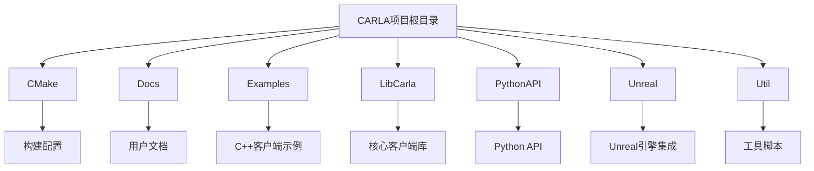
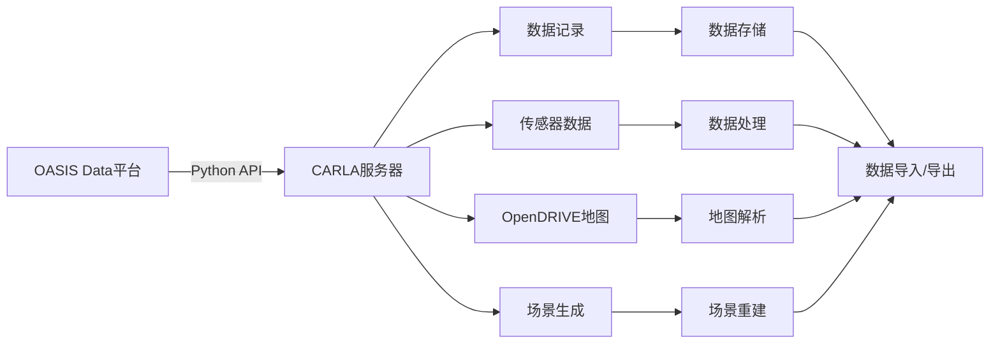
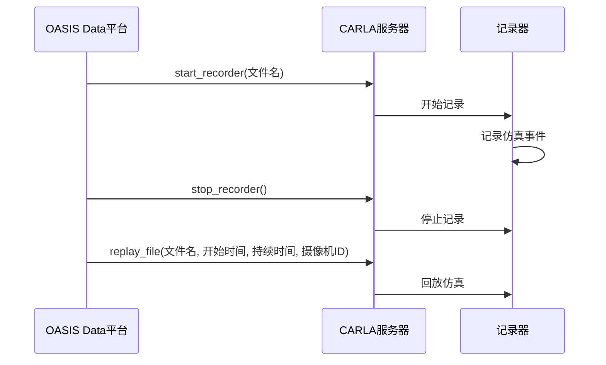
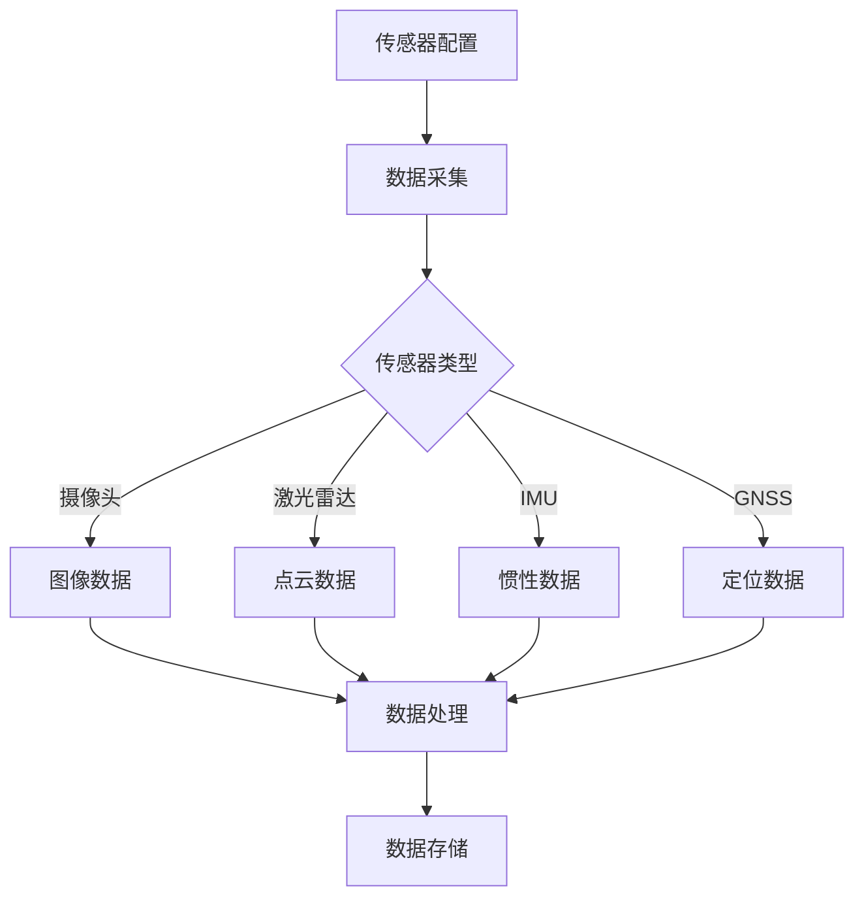
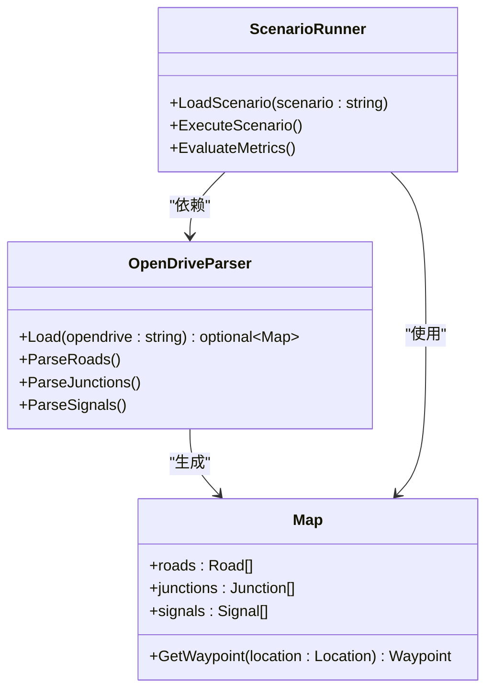
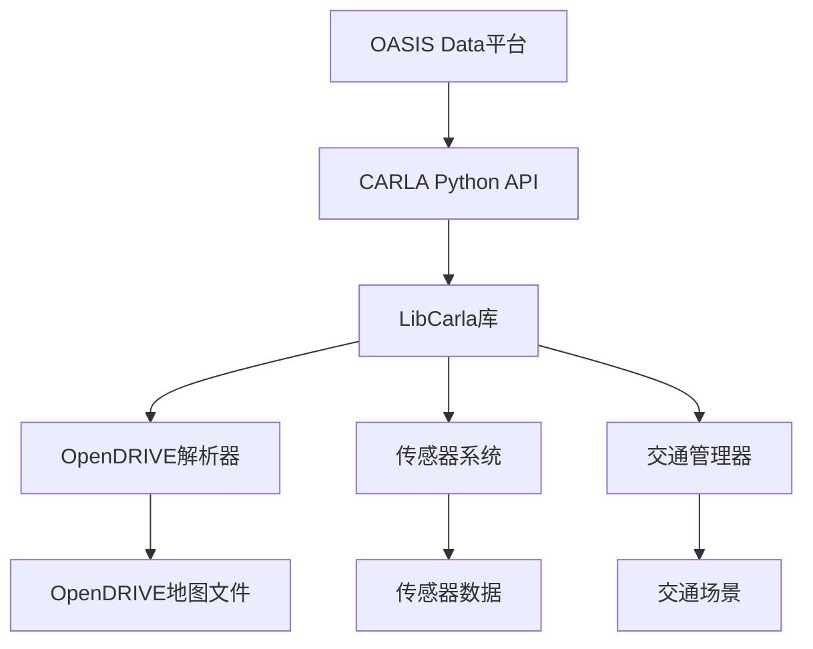

# OASIS Data 数据平台集成

**本文档引用的文件**
- [README.md](https://github.com/carla-simulator/carla/blob/ue5-dev/README.md)
- [index.md](https://github.com/carla-simulator/carla/blob/ue5-dev/Docs/index.md)
- [adv_recorder.md](https://github.com/carla-simulator/carla/blob/ue5-dev/Docs/adv_recorder.md)
- [recorder_replay.py](https://github.com/carla-simulator/carla/blob/ue5-dev/PythonAPI/examples/recorder_replay.py)
- [OpenDrive.cpp](https://github.com/carla-simulator/carla/blob/ue5-dev/LibCarla/source/test/client/OpenDrive.cpp)
- [OpenDrive.h](https://github.com/carla-simulator/carla/blob/ue5-dev/Unreal/CarlaUnreal/Plugins/Carla/Source/Carla/OpenDrive/OpenDrive.h)
- [OpenDriveParser.cpp](https://github.com/carla-simulator/carla/blob/ue5-dev/LibCarla/source/carla/opendrive/OpenDriveParser.cpp)
- [core_sensors.md](https://github.com/carla-simulator/carla/blob/ue5-dev/Docs/core_sensors.md)
- [tuto_G_scenic.md](https://github.com/carla-simulator/carla/blob/ue5-dev/Docs/tuto_G_scenic.md)
- [ts_traffic_simulation_overview.md](https://github.com/carla-simulator/carla/blob/ue5-dev/Docs/ts_traffic_simulation_overview.md)

## 目录
1. [简介](#简介)
2. [项目结构](#项目结构)
3. [核心组件](#核心组件)
4. [架构概述](#架构概述)
5. [详细组件分析](#详细组件分析)
6. [依赖分析](#依赖分析)
7. [性能考虑](#性能考虑)
8. [故障排除指南](#故障排除指南)
9. [结论](#结论)

## 简介
OASIS Data数据平台与CARLA仿真环境的集成文档旨在详细阐述OASIS Data在自动驾驶数据生命周期中的关键作用。该文档重点介绍从CARLA仿真环境中高效采集原始数据、执行数据匿名化处理、实施多级数据过滤策略、实现自动化标注流程以及支持场景重建等功能。同时，文档详细说明了OASIS Data与CARLA支持的OpenX和OpenScenario 1.0格式的兼容性，确保数据的互操作性，并提供数据导入导出的最佳实践和性能优化建议。

## 项目结构
CARLA项目采用模块化设计，主要包含CMake构建系统、文档、示例代码、第三方库和Unreal引擎集成等核心组件。项目结构清晰，便于开发者快速定位和理解各个功能模块。

**图示来源**
- [README.md](https://github.com/carla-simulator/carla/blob/ue5-dev/README.md#L1-L215)
- [项目结构](https://github.com/carla-simulator/carla/blob/ue5-dev/workspace_path)

## 核心组件
OASIS Data数据平台的核心功能包括数据记录与回放、传感器数据采集、OpenDRIVE地图支持和场景生成。这些功能共同构成了自动驾驶数据生命周期管理的基础。

**本节来源**
- [README.md](https://github.com/carla-simulator/carla/blob/ue5-dev/README.md#L1-L215)
- [index.md](https://github.com/carla-simulator/carla/blob/ue5-dev/Docs/index.md#L1-L61)

## 架构概述
OASIS Data与CARLA的集成架构基于客户端-服务器模式，通过Python API与CARLA服务器进行通信，实现数据的采集、处理和回放。该架构支持灵活的传感器配置和环境条件设置，为自动驾驶系统的开发、训练和验证提供了强大的支持。

**图示来源**
- [adv_recorder.md](https://github.com/carla-simulator/carla/blob/ue5-dev/Docs/adv_recorder.md#L1-L318)
- [core_sensors.md](https://github.com/carla-simulator/carla/blob/ue5-dev/Docs/core_sensors.md)

## 详细组件分析

### 数据记录与回放分析
OASIS Data平台通过CARLA的记录器功能实现仿真数据的记录与回放。记录器将所有仿真事件写入二进制文件，支持高保真度的仿真回放和事件追溯。

**图示来源**
- [adv_recorder.md](https://github.com/carla-simulator/carla/blob/ue5-dev/Docs/adv_recorder.md#L1-L318)
- [recorder_replay.py](https://github.com/carla-simulator/carla/blob/ue5-dev/PythonAPI/examples/recorder_replay.py#L1-L164)

### 传感器数据采集分析
OASIS Data平台支持多种传感器数据的采集，包括摄像头、激光雷达、IMU和GNSS等。这些传感器数据为自动驾驶系统的感知和决策提供了丰富的信息。

**图示来源**
- [core_sensors.md](https://github.com/carla-simulator/carla/blob/ue5-dev/Docs/core_sensors.md)
- [LibCarla/source/carla/ros2/ROS2.h](https://github.com/carla-simulator/carla/blob/ue5-dev/LibCarla/source/carla/ros2/ROS2.h#L85-L120)

### OpenX和OpenScenario支持分析
OASIS Data平台通过CARLA的OpenDRIVE解析器支持OpenX和OpenScenario 1.0格式，实现了高精度地图和复杂交通场景的导入与生成。

**图示来源**
- [OpenDriveParser.cpp](https://github.com/carla-simulator/carla/blob/ue5-dev/LibCarla/source/carla/opendrive/OpenDriveParser.cpp#L1-L36)
- [tuto_G_scenic.md](https://github.com/carla-simulator/carla/blob/ue5-dev/Docs/tuto_G_scenic.md#L36-L57)
- [ts_traffic_simulation_overview.md](https://github.com/carla-simulator/carla/blob/ue5-dev/Docs/ts_traffic_simulation_overview.md#L38-L56)

## 依赖分析
OASIS Data平台与CARLA的集成依赖于多个关键组件，包括Python API、OpenDRIVE解析器和场景生成器。这些组件之间的依赖关系确保了数据的完整性和一致性。

**图示来源**
- [PythonAPI](https://github.com/carla-simulator/carla/blob/ue5-dev/PythonAPI)
- [LibCarla](https://github.com/carla-simulator/carla/blob/ue5-dev/LibCarla)
- [Unreal/CarlaUnreal](https://github.com/carla-simulator/carla/blob/ue5-dev/Unreal/CarlaUnreal)

## 性能考虑
在使用OASIS Data平台与CARLA集成时，需要考虑以下几个性能优化建议：
1. 合理配置传感器参数，避免数据过载
2. 使用高效的数据存储格式，如二进制文件
3. 优化仿真时间步长，平衡仿真精度和性能
4. 利用CARLA的多GPU支持，提高渲染性能

## 故障排除指南
在使用OASIS Data平台与CARLA集成时，可能会遇到以下常见问题：
1. 数据记录文件过大：建议使用`additional_data=False`参数减少记录数据量
2. 仿真回放不同步：检查仿真时间步长和网络延迟
3. OpenDRIVE地图加载失败：确认地图文件路径和格式正确
4. 传感器数据丢失：检查传感器配置和数据流设置

**本节来源**
- [adv_recorder.md](https://github.com/carla-simulator/carla/blob/ue5-dev/Docs/adv_recorder.md#L1-L318)
- [core_sensors.md](https://github.com/carla-simulator/carla/blob/ue5-dev/Docs/core_sensors.md)

## 结论
OASIS Data数据平台与CARLA仿真环境的集成提供了一个完整的自动驾驶数据生命周期管理解决方案。通过高效的数据采集、处理和回放功能，以及对OpenX和OpenScenario 1.0格式的支持，该集成方案为自动驾驶系统的开发、训练和验证提供了强大的支持。未来的工作将集中在进一步优化数据处理性能和扩展场景生成能力上。