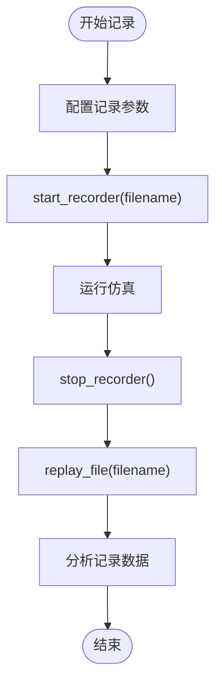

# OASIS Sim 仿真平台集成

> **引用文件**
> **本文档引用的文件**

- [README.md](https://github.com/carla-simulator/carla/blob/ue5-dev/README.md)
- [start_quickstart.md](https://github.com/carla-simulator/carla/blob/ue5-dev/Docs/start_quickstart.md)
- [python_api.md](https://github.com/carla-simulator/carla/blob/ue5-dev/Docs/python_api.md)
- [core_sensors.md](https://github.com/carla-simulator/carla/blob/ue5-dev/Docs/core_sensors.md)
- [adv_recorder.md](https://github.com/carla-simulator/carla/blob/ue5-dev/Docs/adv_recorder.md)
- [ref_sensors.md](https://github.com/carla-simulator/carla/blob/ue5-dev/Docs/ref_sensors.md)
- [recorder_replay.py](https://github.com/carla-simulator/carla/blob/ue5-dev/PythonAPI/examples/recorder_replay.py)
- [visualize_multiple_sensors.py](https://github.com/carla-simulator/carla/blob/ue5-dev/PythonAPI/examples/visualize_multiple_sensors.py)
- [visualize_radar.py](https://github.com/carla-simulator/carla/blob/ue5-dev/PythonAPI/examples/visualize_radar.py)
- [Sensor.cpp](https://github.com/carla-simulator/carla/blob/ue5-dev/PythonAPI/carla/src/Sensor.cpp)
- [SensorData.cpp](https://github.com/carla-simulator/carla/blob/ue5-dev/PythonAPI/carla/src/SensorData.cpp)
- [Sensor.h](https://github.com/carla-simulator/carla/blob/ue5-dev/LibCarla/source/carla/client/Sensor.h)
- [SensorData.h](https://github.com/carla-simulator/carla/blob/ue5-dev/LibCarla/source/carla/sensor/SensorData.h)

## 目录

1. [简介](#简介)
2. [项目结构](#项目结构)
3. [核心组件](#核心组件)
4. [架构概述](#架构概述)
5. [详细组件分析](#详细组件分析)
6. [依赖分析](#依赖分析)
7. [性能考虑](#性能考虑)
8. [故障排除指南](#故障排除指南)
9. [结论](#结论)

## 简介

OASIS Sim 仿真平台与 CARLA 集成旨在创建一个高保真度的自动驾驶仿真环境。CARLA 作为一个开源的自动驾驶研究模拟器，提供了灵活的传感器套件和环境条件配置，支持开发、训练和验证自动驾驶系统。本文档详细阐述了如何以 CARLA 为核心引擎，实现高保真场景的编辑与仿真，包括传感器模型配置、大规模仿真任务调度以及诊断日志分析功能。

## 项目结构

CARLA 项目结构清晰，主要包含 CMake 构建系统、文档、示例代码、Python API、ROS2 集成、Unreal 引擎集成、工具和实用程序等目录。核心功能由 LibCarla 库提供，通过 Python API 与用户交互。项目支持在 Linux 和 Windows 上构建，推荐使用 Ubuntu 22.04 或 Windows 11 操作系统，配备 NVIDIA RTX 3070/3080/3090 或更高级别的 GPU。

**Diagram sources**

- <a href="https://github.com/carla-simulator/carla/blob/ue5-dev/README.md#L1-L215" target="_blank">README.md</a>

**Section sources**

- <a href="https://github.com/carla-simulator/carla/blob/ue5-dev/README.md#L1-L215" target="_blank">README.md</a>

## 核心组件

CARLA 的核心组件包括客户端（Client）、世界（World）、演员（Actor）和传感器（Sensor）。客户端负责与服务器通信，世界管理仿真环境，演员代表仿真中的实体（如车辆、行人、传感器等），传感器则用于收集环境数据。这些组件通过 Python API 进行交互，实现对仿真环境的控制和数据采集。

**Section sources**

- <a href="https://github.com/carla-simulator/carla/blob/ue5-dev/Docs/python_api.md#L1-L800" target="_blank">python_api.md</a>
- <a href="https://github.com/carla-simulator/carla/blob/ue5-dev/Docs/core_sensors.md#L1-L198" target="_blank">core_sensors.md</a>

## 架构概述

CARLA 的架构基于客户端-服务器模式，客户端通过 RPC 与服务器通信，发送命令并接收数据。服务器运行仿真，处理物理计算、渲染和传感器数据生成。客户端可以创建多个实例，每个实例连接到服务器的 RPC 接口。仿真运行在服务器端，客户端仅接收数据。行人管理由客户端负责，因此在多客户端环境中可能会出现冲突。

**Diagram sources**

- <a href="https://github.com/carla-simulator/carla/blob/ue5-dev/Docs/python_api.md#L454-L457" target="_blank">python_api.md</a>

## 详细组件分析

### 传感器配置

CARLA 提供了多种传感器，包括摄像头、激光雷达、雷达、GNSS、IMU 等。每种传感器都有特定的属性和数据输出格式。配置传感器时，首先需要从蓝图库中找到相应的传感器蓝图，设置属性（如图像大小、视场角等），然后将其附加到目标演员上。

#### 摄像头传感器

摄像头传感器可以生成 RGB 图像、深度图、语义分割图等。配置摄像头时，需要设置图像分辨率、视场角和传感器滴答时间。

**Diagram sources**

- <a href="https://github.com/carla-simulator/carla/blob/ue5-dev/Docs/ref_sensors.md#L47-L81" target="_blank">ref_sensors.md</a>
- <a href="https://github.com/carla-simulator/carla/blob/ue5-dev/Docs/core_sensors.md#L112-L118" target="_blank">core_sensors.md</a>

#### 激光雷达传感器

激光雷达传感器生成 4D 点云数据，包含坐标和每个点的强度。配置激光雷达时，需要设置范围、通道数、每秒点数和旋转频率。

**Diagram sources**

- <a href="https://github.com/carla-simulator/carla/blob/ue5-dev/Docs/ref_sensors.md#L152-L153" target="_blank">ref_sensors.md</a>
- <a href="https://github.com/carla-simulator/carla/blob/ue5-dev/PythonAPI/examples/visualize_multiple_sensors.py#L290-L292" target="_blank">visualize_multiple_sensors.py</a>

#### 雷达传感器

雷达传感器生成 2D 点图，模拟视野内的元素及其相对于传感器的运动。配置雷达时，需要设置水平和垂直视场角、每秒点数和范围。

**Diagram sources**

- <a href="https://github.com/carla-simulator/carla/blob/ue5-dev/Docs/ref_sensors.md#L153-L154" target="_blank">ref_sensors.md</a>
- <a href="https://github.com/carla-simulator/carla/blob/ue5-dev/PythonAPI/examples/visualize_radar.py#L86-L90" target="_blank">visualize_radar.py</a>

### 分布式任务管理系统

CARLA 支持通过分布式任务管理系统进行大规模仿真任务调度。用户可以通过 Python 脚本批量生成交通、控制车辆行为、记录仿真数据等。`apply_batch`和`apply_batch_sync`方法允许在单个仿真步骤中执行多个命令，提高效率。

**Diagram sources**

- <a href="https://github.com/carla-simulator/carla/blob/ue5-dev/Docs/python_api.md#L465-L474" target="_blank">python_api.md</a>
- <a href="https://github.com/carla-simulator/carla/blob/ue5-dev/PythonAPI/carla/src/Sensor.cpp#L9-L11" target="_blank">Sensor.cpp</a>

### 诊断日志分析

CARLA 的记录和回放系统允许用户记录仿真过程并进行回放，以便进行问题追溯和性能评估。`start_recorder`方法开始记录，`stop_recorder`方法停止记录。记录文件包含所有事件，如演员创建和销毁、交通灯状态变化、车辆位置和速度等。`replay_file`方法用于回放记录，支持设置播放速度和跟随特定演员。

**Diagram sources**

- <a href="https://github.com/carla-simulator/carla/blob/ue5-dev/Docs/adv_recorder.md#L34-L51" target="_blank">adv_recorder.md</a>
- <a href="https://github.com/carla-simulator/carla/blob/ue5-dev/PythonAPI/examples/recorder_replay.py#L126-L127" target="_blank">recorder_replay.py</a>

**Section sources**

- <a href="https://github.com/carla-simulator/carla/blob/ue5-dev/Docs/adv_recorder.md#L1-L318" target="_blank">adv_recorder.md</a>
- <a href="https://github.com/carla-simulator/carla/blob/ue5-dev/PythonAPI/examples/recorder_replay.py#L1-L164" target="_blank">recorder_replay.py</a>

## 依赖分析

CARLA 依赖于 Unreal Engine 5.5 进行渲染和物理模拟，使用 CMake 进行构建。Python API 依赖于`pygame`和`numpy`库，用于图形显示和数值计算。项目还依赖于一些第三方库，如 PROJ、SQLite、Xerces-C 和 Eigen。

**Diagram sources**

- <a href="https://github.com/carla-simulator/carla/blob/ue5-dev/README.md#L204-L211" target="_blank">README.md</a>

## 性能考虑

为了确保高性能仿真，建议使用高性能 GPU 和足够的 VRAM。仿真性能受场景复杂度、传感器数量和分辨率、物理计算精度等因素影响。使用同步模式可以提高仿真稳定性，但会降低帧率。异步模式适合大规模仿真，但可能导致数据不一致。

## 故障排除指南

常见问题包括连接失败、传感器数据丢失、仿真卡顿等。解决方法包括检查网络连接、确保端口未被占用、优化场景复杂度、调整传感器设置等。使用`show_recorder_file_info`和`show_recorder_collisions`等工具可以帮助分析记录文件，定位问题。

**Section sources**

- <a href="https://github.com/carla-simulator/carla/blob/ue5-dev/Docs/start_quickstart.md#L32-L33" target="_blank">start_quickstart.md</a>
- <a href="https://github.com/carla-simulator/carla/blob/ue5-dev/Docs/adv_recorder.md#L104-L143" target="_blank">adv_recorder.md</a>

## 结论

OASIS Sim 仿真平台与 CARLA 集成提供了一个强大的高保真自动驾驶仿真环境。通过合理配置传感器模型、利用分布式任务管理系统进行大规模仿真，并结合诊断日志分析功能，用户可以有效地进行自动驾驶系统的开发、训练和验证。本文档提供了详细的配置示例和操作步骤，帮助用户顺利搭建基于 OASIS Sim 的仿真环境。
