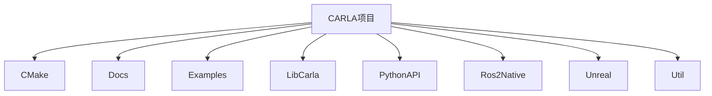
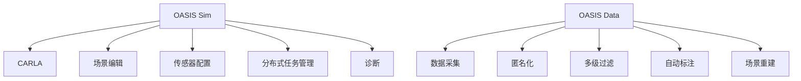
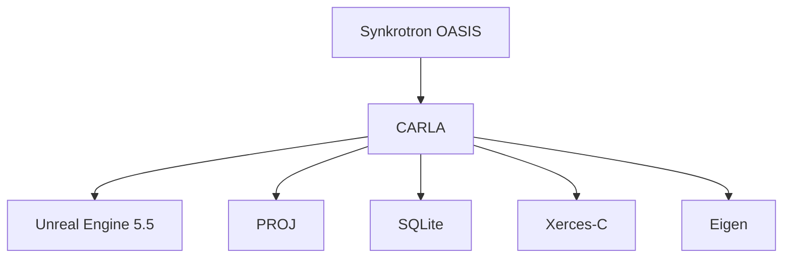

# Synkrotron 集成

> **引用文件**
> **本文档引用的文件**

- [ecosys_synkrotron.md](https://github.com/carla-simulator/carla/blob/ue5-dev/Docs/ecosys_synkrotron.md)
- [README.md](https://github.com/carla-simulator/carla/blob/ue5-dev/README.md)
- [Release.Dockerfile](https://github.com/carla-simulator/carla/blob/ue5-dev/Util/Docker/Release.Dockerfile)
- [OpenDrive.h](https://github.com/carla-simulator/carla/blob/ue5-dev/Unreal/CarlaUnreal/Plugins/Carla/Source/Carla/OpenDrive/OpenDrive.h)
- [OpenDriveParser.cpp](https://github.com/carla-simulator/carla/blob/ue5-dev/LibCarla/source/carla/opendrive/OpenDriveParser.cpp)
- [Sensor.cpp](https://github.com/carla-simulator/carla/blob/ue5-dev/PythonAPI/carla/src/Sensor.cpp)
- [Client.cpp](https://github.com/carla-simulator/carla/blob/ue5-dev/PythonAPI/carla/src/Client.cpp)
- [build_docker.md](https://github.com/carla-simulator/carla/blob/ue5-dev/Docs/build_docker.md)
- [ref_sensors.md](https://github.com/carla-simulator/carla/blob/ue5-dev/Docs/ref_sensors.md)
- [bp_library.md](https://github.com/carla-simulator/carla/blob/ue5-dev/Docs/bp_library.md)

## 目录

1. [简介](#简介)
2. [项目结构](#项目结构)
3. [核心组件](#核心组件)
4. [架构概述](#架构概述)
5. [详细组件分析](#详细组件分析)
6. [依赖分析](#依赖分析)
7. [性能考虑](#性能考虑)
8. [故障排除指南](#故障排除指南)
9. [结论](#结论)

## 简介

Synkrotron 提供基于 CARLA 的自动驾驶仿真高级解决方案。其产品套件 OASIS 支持场景生成、传感器建模、交通仿真和数据管理等广泛应用。OASIS Sim 仿真平台以 CARLA 为核心，支持完整的 AD 仿真生命周期，包括场景导入与编辑、传感器配置、分布式任务管理和诊断。OASIS Data 平台则管理自动驾驶研发管道中的大量数据，支持数据采集、匿名化、多级过滤、自动标注和场景重建。Synkrotron 还提供鱼眼相机、激光雷达物理模型、SOTIF 场景生成和静态场景创建等高级工具。

**Section sources**

- <a href="https://github.com/carla-simulator/carla/blob/ue5-dev/Docs/ecosys_synkrotron.md#L1-L57" target="_blank">ecosys_synkrotron.md</a>

## 项目结构

CARLA 项目结构包含多个关键目录，如 CMake、Docs、Examples、LibCarla、PythonAPI、Ros2Native、Unreal 和 Util。这些目录分别包含构建配置、文档、示例代码、核心库、Python API、ROS2 集成、Unreal Engine 项目和实用工具。

**Diagram sources**

- <a href="https://github.com/carla-simulator/carla/blob/ue5-dev/README.md#L1-L215" target="_blank">README.md</a>

## 核心组件

OASIS Sim 仿真平台支持完整的 AD 仿真生命周期，包括场景导入与编辑、传感器配置、分布式任务管理和诊断。OASIS Data 平台支持数据采集、匿名化、多级过滤、自动标注和场景重建。

**Section sources**

- <a href="https://github.com/carla-simulator/carla/blob/ue5-dev/Docs/ecosys_synkrotron.md#L1-L57" target="_blank">ecosys_synkrotron.md</a>

## 架构概述

Synkrotron 的 OASIS 平台基于 CARLA 构建，支持云和本地部署。OASIS Sim 以 CARLA 为核心，支持场景编辑、传感器配置、分布式任务管理和诊断。OASIS Data 平台管理自动驾驶研发管道中的大量数据，支持数据采集、匿名化、多级过滤、自动标注和场景重建。

**Diagram sources**

- <a href="https://github.com/carla-simulator/carla/blob/ue5-dev/Docs/ecosys_synkrotron.md#L1-L57" target="_blank">ecosys_synkrotron.md</a>

## 详细组件分析

### OASIS Sim 仿真平台分析

OASIS Sim 是一个功能齐全、可扩展的仿真平台，以 CARLA 为核心。它支持 AD 仿真的完整生命周期，包括场景导入与编辑、传感器配置、分布式任务管理和诊断。

**Section sources**

- <a href="https://github.com/carla-simulator/carla/blob/ue5-dev/Docs/ecosys_synkrotron.md#L17-L26" target="_blank">ecosys_synkrotron.md</a>

### OASIS Data 平台分析

OASIS Data 是一个管理自动驾驶研发管道中大量数据的平台。它支持数据采集、匿名化、多级过滤、自动标注和场景重建。

**Section sources**

- <a href="https://github.com/carla-simulator/carla/blob/ue5-dev/Docs/ecosys_synkrotron.md#L28-L38" target="_blank">ecosys_synkrotron.md</a>

### Synkrotron 工具和服务分析

Synkrotron 提供多种开发工具和服务，包括鱼眼相机、激光雷达物理模型、SOTIF 场景生成、地图创建、静态场景创建和动态场景重建。

**Section sources**

- <a href="https://github.com/carla-simulator/carla/blob/ue5-dev/Docs/ecosys_synkrotron.md#L40-L53" target="_blank">ecosys_synkrotron.md</a>

## 依赖分析

CARLA 依赖于 Unreal Engine 5.5 和多个第三方库，如 PROJ、SQLite、Xerces-C 和 Eigen。Synkrotron 的 OASIS 平台基于 CARLA 构建，利用其核心功能并扩展了场景生成、传感器建模和数据管理能力。

**Diagram sources**

- <a href="https://github.com/carla-simulator/carla/blob/ue5-dev/README.md#L196-L215" target="_blank">README.md</a>

## 性能考虑

CARLA 和 Synkrotron 的 OASIS 平台需要高性能硬件支持，推荐使用 Intel i7/i9 或 AMD Ryzen 7/9 处理器，32GB 以上内存，NVIDIA RTX 3070/3080/3090 或更好显卡，16GB 以上显存，Ubuntu 22.04 或 Windows 11 操作系统。

## 故障排除指南

在使用 Synkrotron 与 CARLA 集成时，可能遇到的问题包括硬件兼容性、软件依赖、网络配置和性能瓶颈。建议检查硬件是否满足推荐配置，确保所有软件依赖正确安装，网络配置正确，以及性能优化设置合理。

**Section sources**

- <a href="https://github.com/carla-simulator/carla/blob/ue5-dev/README.md#L22-L31" target="_blank">README.md</a>

## 结论

Synkrotron 的 OASIS 平台基于 CARLA 构建，提供了完整的自动驾驶仿真解决方案。通过集成 CARLA 的核心功能，OASIS Sim 和 OASIS Data 平台支持从场景生成到数据管理的完整 AD 仿真生命周期。Synkrotron 提供的高级工具进一步增强了仿真能力，支持鱼眼相机、激光雷达物理模型、SOTIF 场景生成和静态场景创建。通过容器化部署，OASIS 平台可以在云或本地环境中无缝集成，为工程团队提供高效的仿真解决方案。
