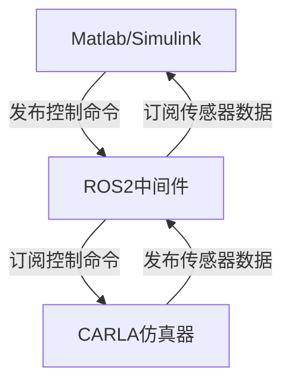
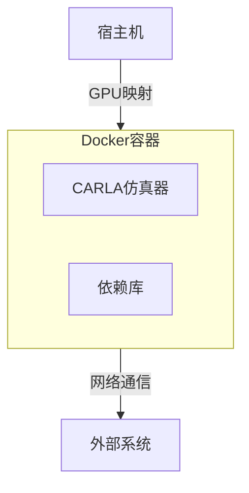
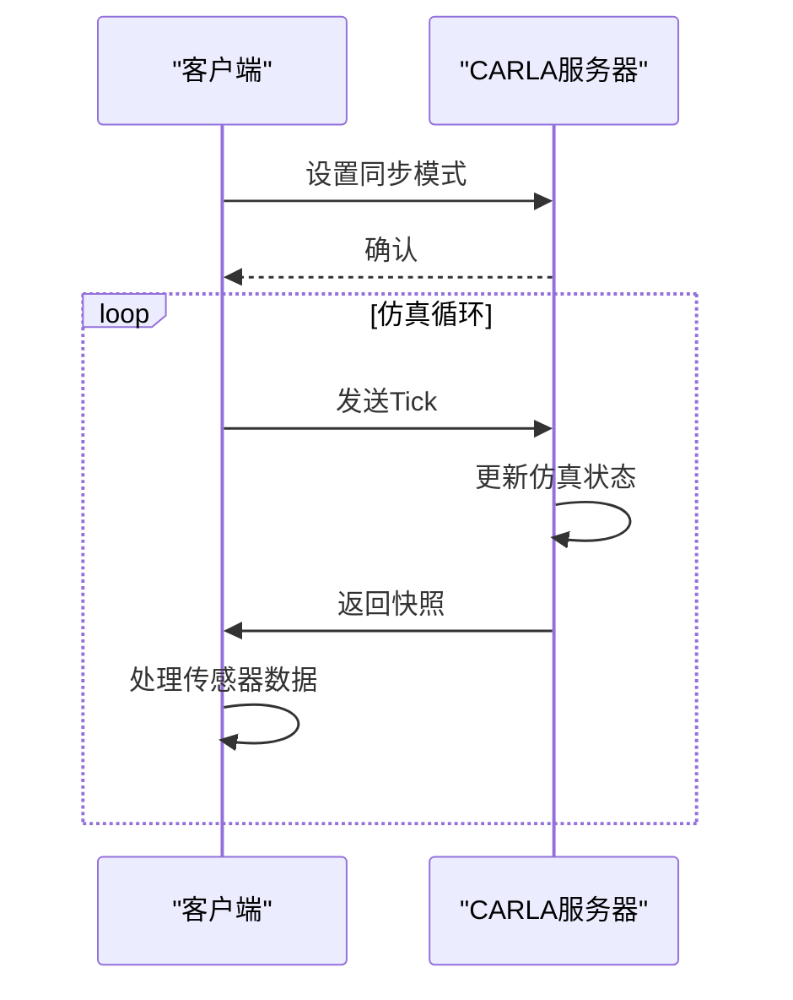

# 第三方工具集成

> **引用文件**
> **本文档中引用的文件**

- [ecosys_ansys.md](https://github.com/carla-simulator/carla/blob/ue5-dev/Docs/ecosys_ansys.md)
- [ecosys_synkrotron.md](https://github.com/carla-simulator/carla/blob/ue5-dev/Docs/ecosys_synkrotron.md)
- [Release.Dockerfile](https://github.com/carla-simulator/carla/blob/ue5-dev/Util/Docker/Release.Dockerfile)
- [InstallPrerequisites.sh](https://github.com/carla-simulator/carla/blob/ue5-dev/Util/SetupUtils/InstallPrerequisites.sh)
- [InstallPrerequisites.bat](https://github.com/carla-simulator/carla/blob/ue5-dev/Util/SetupUtils/InstallPrerequisites.bat)
- [ros2_native.md](https://github.com/carla-simulator/carla/blob/ue5-dev/Docs/ros2_native.md)
- [ros2_native_msgs.md](https://github.com/carla-simulator/carla/blob/ue5-dev/Docs/ros2_native_msgs.md)
- [adv_synchrony_timestep.md](https://github.com/carla-simulator/carla/blob/ue5-dev/Docs/adv_synchrony_timestep.md)
- [ref_sensors.md](https://github.com/carla-simulator/carla/blob/ue5-dev/Docs/ref_sensors.md)
- [build_docker.md](https://github.com/carla-simulator/carla/blob/ue5-dev/Docs/build_docker.md)

## 目录

1. [引言](#引言)
2. [CARLA 与 ANSYS 集成方案](#carla与ansys集成方案)
3. [CARLA 与 Synkrotron 集成方案](#carla与synkrotron集成方案)
4. [与 MATLAB/Simulink 集成](#与matlabsimulink集成)
5. [Docker 容器化部署](#docker容器化部署)
6. [协同仿真协议与数据交换](#协同仿真协议与数据交换)
7. [环境配置与依赖管理](#环境配置与依赖管理)
8. [高保真物理仿真参考架构](#高保真物理仿真参考架构)
9. [故障排除指南](#故障排除指南)
10. [结论](#结论)

## 引言

本文档详细介绍了 CARLA 仿真平台与第三方专业工具的集成方案，重点涵盖与 ANSYS、Synkrotron、MATLAB/Simulink 等工具的集成方法。文档解释了生态系统集成模式、数据交换格式、协同仿真协议以及通过 Docker 容器化部署的集成方法。同时提供了依赖项管理和环境配置的最佳实践，为工程团队提供高保真物理仿真集成的参考架构，包括实时性要求和数据同步策略，并包含解决版本兼容性和网络延迟问题的故障排除指南。

## CARLA 与 ANSYS 集成方案

ANSYS 通过其真实时间雷达（RTR）模型与 CARLA 仿真器集成，用于训练车辆纵向控制器。该集成方案利用强化学习技术，详细描述了模型、动作空间和奖励策略的使用。集成过程中，RTR 模型与 CARLA 仿真器协同工作，实现对车辆控制策略的训练和验证。文档中提供了相关演示文稿和视频，展示了在 CARLA 仿真器中的训练结果。

**Section sources**

- <a href="https://github.com/carla-simulator/carla/blob/ue5-dev/Docs/ecosys_ansys.md#L1-L9" target="_blank">ecosys_ansys.md</a>

## CARLA 与 Synkrotron 集成方案

Synkrotron 基于 CARLA 构建了先进的自动驾驶仿真解决方案，其产品套件 OASIS 支持广泛的应用，包括场景生成、传感器建模、交通仿真和数据管理。OASIS 平台具有灵活的架构，可部署在云端进行大规模仿真，也可在开发人员的本地环境中用于原型设计。

OASIS Sim 是一个功能齐全、可扩展的仿真平台，以 CARLA 为核心，支持 AD 仿真的完整生命周期，包括场景导入与编辑、传感器配置、分布式任务管理和通过丰富的仿真数据与日志进行诊断。OASIS Data 平台则用于管理自动驾驶研发管道中的大量数据，支持数据采集、匿名化、多阶段过滤、环境重建、自动标注和场景标记等功能。

**Section sources**

- <a href="https://github.com/carla-simulator/carla/blob/ue5-dev/Docs/ecosys_synkrotron.md#L1-L57" target="_blank">ecosys_synkrotron.md</a>

## 与 MATLAB/Simulink 集成

CARLA 通过 ROS2 原生接口与 MATLAB/Simulink 实现集成。启动 CARLA 仿真器时使用`--ros2`命令行选项即可启用 ROS2 接口。传感器数据通过 ROS 主题广播，控制数据可通过订阅特定主题发送到指定的主车辆。

CARLA 提供了标准的 ROS2 消息格式，包括`CarlaEgoVehicleControl.msg`用于车辆控制，包含油门、转向、刹车等控制参数。通过`ros-carla-msgs` ROS 包可以安装这些消息定义，实现与 MATLAB/Simulink 的无缝集成。

**Diagram sources **

- <a href="https://github.com/carla-simulator/carla/blob/ue5-dev/Docs/ros2_native.md#L1-L64" target="_blank">ros2_native.md</a>
- <a href="https://github.com/carla-simulator/carla/blob/ue5-dev/Docs/ros2_native_msgs.md#L1-L332" target="_blank">ros2_native_msgs.md</a>

**Section sources**

- <a href="https://github.com/carla-simulator/carla/blob/ue5-dev/Docs/ros2_native.md#L1-L64" target="_blank">ros2_native.md</a>
- <a href="https://github.com/carla-simulator/carla/blob/ue5-dev/Docs/ros2_native_msgs.md#L1-L332" target="_blank">ros2_native_msgs.md</a>

## Docker 容器化部署

CARLA 提供了 Docker 容器化部署方案，便于在不同环境中快速部署和运行仿真器。通过 Dockerfile 定义了容器的构建过程，包括基础镜像选择、依赖包安装和工作目录设置。

容器化部署支持无头模式运行（offscreen mode），适用于没有显示设备的服务器环境。通过 NVIDIA Container Toolkit，可以将 GPU 设备暴露给 Linux 容器，实现 GPU 加速的仿真计算。

**Diagram sources **

- <a href="https://github.com/carla-simulator/carla/blob/ue5-dev/Util/Docker/Release.Dockerfile#L1-L27" target="_blank">Release.Dockerfile</a>
- <a href="https://github.com/carla-simulator/carla/blob/ue5-dev/Docs/build_docker.md#L1-L54" target="_blank">build_docker.md</a>

**Section sources**

- <a href="https://github.com/carla-simulator/carla/blob/ue5-dev/Util/Docker/Release.Dockerfile#L1-L27" target="_blank">Release.Dockerfile</a>
- <a href="https://github.com/carla-simulator/carla/blob/ue5-dev/Docs/build_docker.md#L1-L54" target="_blank">build_docker.md</a>

## 协同仿真协议与数据交换

CARLA 的协同仿真基于客户端-服务器架构，通过同步模式实现精确的时间控制和数据同步。同步模式下，服务器等待客户端的"tick"消息后才更新到下一个仿真步骤，确保了多传感器数据的时间一致性。

仿真时间步长可配置为固定或可变。固定时间步长（如 0.05 秒）确保了物理和传感器数据对应于仿真中易于理解的时刻，是收集仿真数据的最佳方式。物理子步进功能允许在主仿真步长内进行更精细的物理计算，提高物理仿真的精度。

**Diagram sources **

- <a href="https://github.com/carla-simulator/carla/blob/ue5-dev/Docs/adv_synchrony_timestep.md#L1-L282" target="_blank">adv_synchrony_timestep.md</a>
- <a href="https://github.com/carla-simulator/carla/blob/ue5-dev/Docs/ref_sensors.md#L1-L768" target="_blank">ref_sensors.md</a>

**Section sources**

- <a href="https://github.com/carla-simulator/carla/blob/ue5-dev/Docs/adv_synchrony_timestep.md#L1-L282" target="_blank">adv_synchrony_timestep.md</a>
- <a href="https://github.com/carla-simulator/carla/blob/ue5-dev/Docs/ref_sensors.md#L1-L768" target="_blank">ref_sensors.md</a>

## 环境配置与依赖管理

CARLA 提供了详细的环境配置和依赖管理脚本，支持 Windows 和 Linux 系统。`SetupUtils`目录中的脚本自动化了依赖项的安装过程，包括 CMake、Python 包和其他系统依赖。

在 Linux 系统中，`InstallPrerequisites.sh`脚本使用 apt 包管理器安装必要的系统包，并检查 CMake 版本，必要时自动下载和安装指定版本的 CMake。在 Windows 系统中，`InstallPrerequisites.bat`脚本会检查并安装 Visual Studio、Ninja 构建工具和 Python 环境。

这些脚本确保了开发环境的一致性，减少了因环境差异导致的兼容性问题，为团队协作提供了可靠的基础。

**Section sources**

- <a href="https://github.com/carla-simulator/carla/blob/ue5-dev/Util/SetupUtils/InstallPrerequisites.sh#L1-L116" target="_blank">InstallPrerequisites.sh</a>
- <a href="https://github.com/carla-simulator/carla/blob/ue5-dev/Util/SetupUtils/InstallPrerequisites.bat#L1-L113" target="_blank">InstallPrerequisites.bat</a>

## 高保真物理仿真参考架构

高保真物理仿真集成需要考虑实时性要求和数据同步策略。CARLA 的同步模式与固定时间步长结合使用，是实现精确仿真的最佳模式，特别适用于需要慢速客户端或多个元素同步获取信息的场景。

物理确定性要求在加载或重新加载世界之前启用同步模式，并使用固定的 delta 秒。命令应批量处理而不是逐个发出，以确保在繁忙的仿真或过载的服务器中命令不会丢失。

参考架构建议使用 Docker 容器化部署，通过 GPU 映射实现高性能计算，同时利用 ROS2 中间件实现与 MATLAB/Simulink 等工具的集成。这种架构提供了良好的隔离性、可移植性和可扩展性。

**Section sources**

- <a href="https://github.com/carla-simulator/carla/blob/ue5-dev/Docs/adv_synchrony_timestep.md#L201-L269" target="_blank">adv_synchrony_timestep.md</a>

## 故障排除指南

### 版本兼容性问题

确保 CARLA 客户端和服务器版本一致。使用`GetClientVersion()`和`GetServerVersion()`方法检查版本匹配。GPU 驱动程序需要满足最低要求：Ubuntu 系统需要 NVIDIA RTX 驱动 550 或更高版本，Windows 系统需要 560 或更高版本。

### 网络延迟问题

检查防火墙设置，确保默认的 2000 和 2001 端口未被阻塞。在 Docker 部署中，使用`--net=host`参数减少网络开销。对于 ROS2 通信，检查`fastrtps-profile.xml`配置文件中的传输设置。

### 仿真性能问题

确保系统满足最低硬件要求：推荐使用 NVIDIA RTX 3000 系列或更高级别的 GPU，至少 16GB 显存。使用固定时间步长和物理子步进优化物理仿真精度。在无头模式下运行 CARLA 可以减少图形渲染开销。

### 数据同步问题

在同步模式下，确保客户端及时发送 tick 消息。对于 GPU 传感器数据，注意其通常有几帧的延迟，同步性在此尤为重要。使用`WaitForTick()`方法等待下一个 tick 并获取快照，确保数据一致性。

**Section sources**

- <a href="https://github.com/carla-simulator/carla/blob/ue5-dev/Docs/start_quickstart.md#L16-L47" target="_blank">start_quickstart.md</a>
- <a href="https://github.com/carla-simulator/carla/blob/ue5-dev/LibCarla/source/carla/client/detail/Simulator.h#L174-L219" target="_blank">Simulator.h</a>

## 结论

CARLA 提供了与 ANSYS、Synkrotron、MATLAB/Simulink 等专业工具的全面集成方案，通过 ROS2 原生接口、Docker 容器化部署和标准化的数据交换格式，实现了高保真物理仿真。文档中描述的生态系统集成模式、协同仿真协议和环境配置最佳实践，为工程团队提供了可靠的参考架构。通过遵循实时性要求和数据同步策略，并利用提供的故障排除指南，可以有效解决版本兼容性和网络延迟等问题，实现高效、精确的自动驾驶仿真开发。
