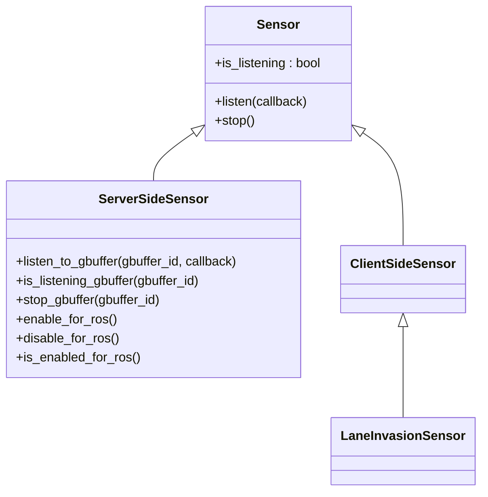
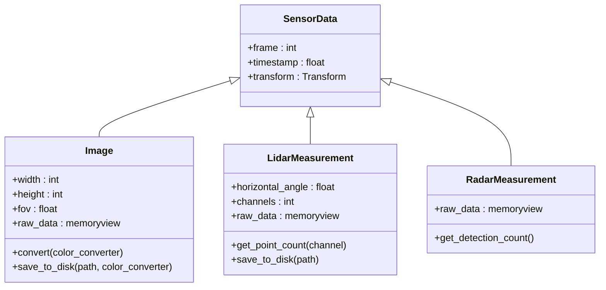
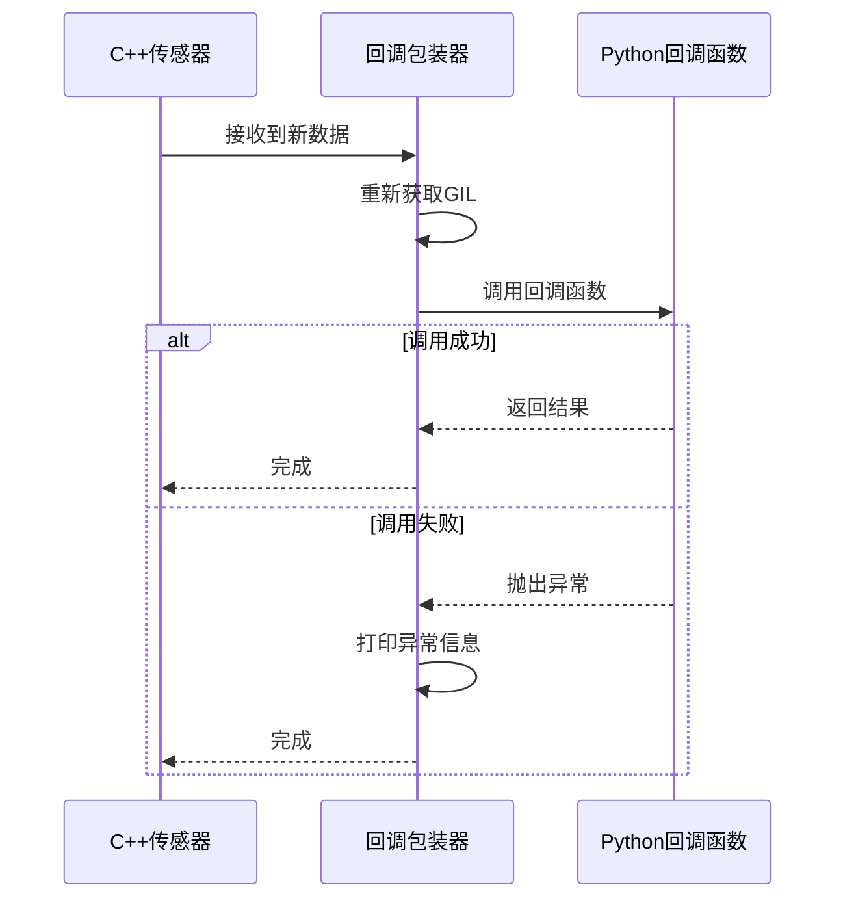
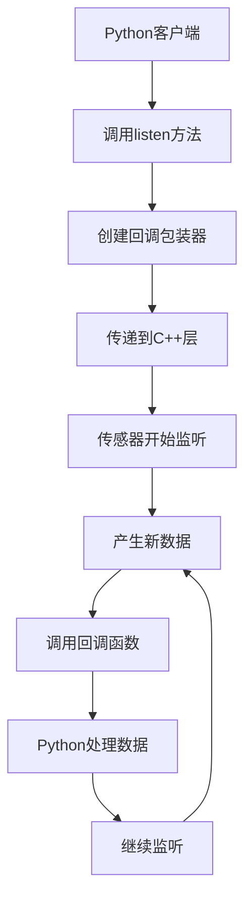
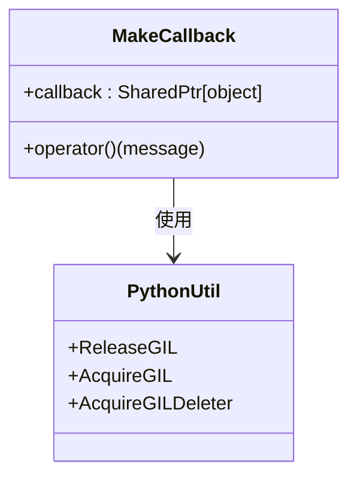
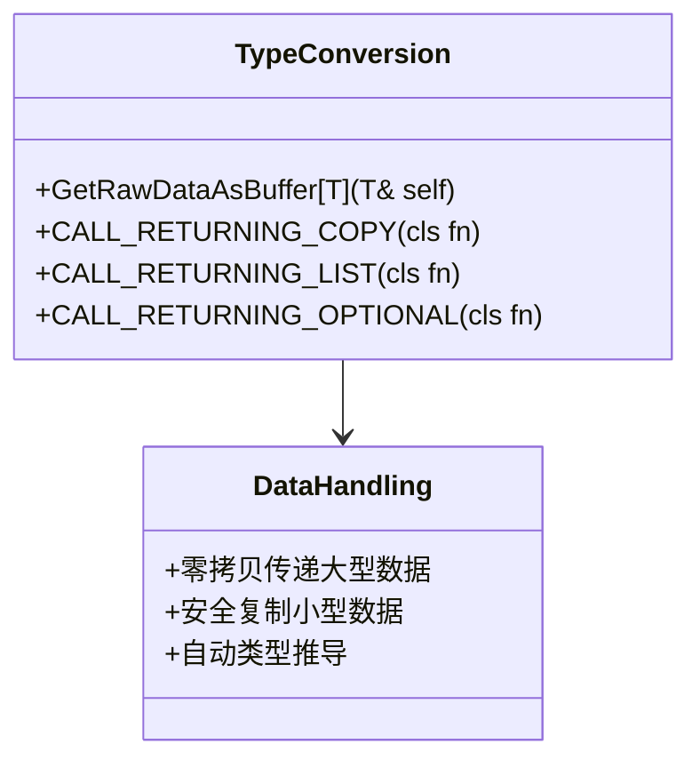
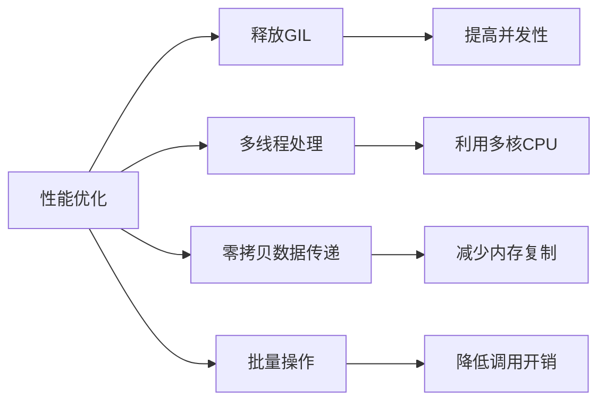

# Python API 暴露

> **引用文件**
> **本文档中引用的文件**

- [Sensor.cpp](https://github.com/carla-simulator/carla/blob/ue5-dev/PythonAPI/carla/src/Sensor.cpp)
- [SensorData.cpp](https://github.com/carla-simulator/carla/blob/ue5-dev/PythonAPI/carla/src/SensorData.cpp)
- [Sensor.h](https://github.com/carla-simulator/carla/blob/ue5-dev/LibCarla/source/carla/client/Sensor.h)
- [SensorData.h](https://github.com/carla-simulator/carla/blob/ue5-dev/LibCarla/source/carla/sensor/SensorData.h)
- [Image.h](https://github.com/carla-simulator/carla/blob/ue5-dev/LibCarla/source/carla/sensor/data/Image.h)
- [LidarMeasurement.h](https://github.com/carla-simulator/carla/blob/ue5-dev/LibCarla/source/carla/sensor/data/LidarMeasurement.h)
- [PythonAPI.h](https://github.com/carla-simulator/carla/blob/ue5-dev/PythonAPI/carla/include/PythonAPI.h)
- [PythonAPI.cpp](https://github.com/carla-simulator/carla/blob/ue5-dev/PythonAPI/carla/src/PythonAPI.cpp)
- [sensor_synchronization.py](https://github.com/carla-simulator/carla/blob/ue5-dev/PythonAPI/examples/sensor_synchronization.py)
- [visualize_multiple_sensors.py](https://github.com/carla-simulator/carla/blob/ue5-dev/PythonAPI/examples/visualize_multiple_sensors.py)

## 目录

1. [引言](#引言)
2. [Python 绑定生成机制](#python绑定生成机制)
3. [传感器数据类型转换策略](#传感器数据类型转换策略)
4. [异步数据流与回调函数处理](#异步数据流与回调函数处理)
5. [完整绑定实现示例](#完整绑定实现示例)
6. [内存管理与异常传播](#内存管理与异常传播)
7. [类型转换最佳实践](#类型转换最佳实践)
8. [性能优化建议](#性能优化建议)

## 引言

CARLA 模拟器通过 Python API 为用户提供了一套完整的接口，用于访问和控制 C++实现的自定义传感器。该系统基于 pybind11 库构建，实现了 C++类和方法到 Python 的无缝暴露。Python 客户端可以通过这些 API 订阅传感器数据、配置传感器参数，并处理复杂的异步数据流。本文档详细说明了如何将 C++实现的传感器暴露给 Python 客户端，涵盖绑定生成机制、数据类型转换、异步处理、内存管理等多个方面。

**Section sources**

- <a href="https://github.com/carla-simulator/carla/blob/ue5-dev/PythonAPI/carla/src/PythonAPI.cpp#L31-L57" target="_blank">PythonAPI.cpp</a>
- <a href="https://github.com/carla-simulator/carla/blob/ue5-dev/PythonAPI/carla/include/PythonAPI.h#L578-L599" target="_blank">PythonAPI.h</a>

## Python 绑定生成机制

CARLA 的 Python API 使用 pybind11 库将 C++类和方法暴露给 Python。核心机制是通过`export_*`函数在编译时生成绑定代码。每个`export_*`函数负责注册一组相关的 C++类和方法到 Python 模块中。

在`PythonAPI.cpp`文件中，`BOOST_PYTHON_MODULE(carla)`宏定义了名为`carla`的 Python 模块，并在其中调用各个`export_*`函数来注册不同的功能组件。这种模块化的设计使得 API 的组织更加清晰，便于维护和扩展。

对于传感器类的绑定，`export_sensor()`函数使用 pybind11 的`class_`模板来定义 C++ `Sensor`类的 Python 包装器。该包装器继承自`Actor`类，并暴露了`listen`、`stop`和`is_listening`等核心方法。特别地，`listen`方法通过一个辅助函数`SubscribeToStream`来实现，该函数将 Python 回调函数包装成 C++可调用的对象。

**Diagram sources **

- <a href="https://github.com/carla-simulator/carla/blob/ue5-dev/PythonAPI/carla/src/Sensor.cpp#L24-L53" target="_blank">Sensor.cpp</a>
- <a href="https://github.com/carla-simulator/carla/blob/ue5-dev/LibCarla/source/carla/client/Sensor.h#L17-L36" target="_blank">Sensor.h</a>

**Section sources**

- <a href="https://github.com/carla-simulator/carla/blob/ue5-dev/PythonAPI/carla/src/Sensor.cpp#L20-L53" target="_blank">Sensor.cpp</a>
- <a href="https://github.com/carla-simulator/carla/blob/ue5-dev/PythonAPI/carla/src/PythonAPI.cpp#L40" target="_blank">PythonAPI.cpp</a>

## 传感器数据类型转换策略

CARLA 的传感器数据类型转换策略旨在高效地在 C++和 Python 之间传递复杂数据结构，特别是点云和图像等大数据量的传感器数据。系统通过零拷贝的方式直接暴露原始数据缓冲区，避免了不必要的内存复制。

在`SensorData.cpp`文件中，`GetRawDataAsBuffer`模板函数是实现高效数据传递的核心。该函数使用`PyMemoryView_FromMemory`（Python 3）或`PyBuffer_FromMemory`（Python 2）直接从 C++数据缓冲区创建 Python 内存视图，使得 Python 代码可以直接访问底层的原始数据而无需复制。

对于图像数据，系统提供了多种颜色转换选项，包括原始格式、深度图、对数深度图和 CityScapes 调色板。这些转换通过`ConvertImage`函数实现，并在转换过程中释放 Python 全局解释器锁（GIL），允许其他 Python 线程并发执行。

**Diagram sources **

- <a href="https://github.com/carla-simulator/carla/blob/ue5-dev/PythonAPI/carla/src/SensorData.cpp#L357-L456" target="_blank">SensorData.cpp</a>
- <a href="https://github.com/carla-simulator/carla/blob/ue5-dev/LibCarla/source/carla/sensor/SensorData.h#L19-L72" target="_blank">SensorData.h</a>

**Section sources**

- <a href="https://github.com/carla-simulator/carla/blob/ue5-dev/PythonAPI/carla/src/SensorData.cpp#L156-L165" target="_blank">SensorData.cpp</a>
- <a href="https://github.com/carla-simulator/carla/blob/ue5-dev/PythonAPI/carla/src/SensorData.cpp#L340-L369" target="_blank">SensorData.cpp</a>

## 异步数据流与回调函数处理

CARLA 的传感器系统采用异步数据流模型，通过回调函数机制处理传感器数据。当传感器产生新的测量数据时，会调用注册的回调函数并将数据作为参数传递。

在`PythonAPI.h`文件中，`MakeCallback`函数是处理 Python 回调的核心。该函数首先检查回调对象是否可调用，然后使用`SharedPtr`和自定义删除器来管理回调对象的生命周期。特别重要的是，回调的删除操作在持有 GIL 的情况下执行，确保了 Python 对象管理的线程安全。

`MakeCallback`返回的 lambda 函数在调用时会重新获取 GIL，然后使用`py::call`调用 Python 回调函数。如果调用过程中发生异常，异常信息会被打印但不会传播到 C++层，防止 C++代码因 Python 异常而崩溃。

**Diagram sources **

- <a href="https://github.com/carla-simulator/carla/blob/ue5-dev/PythonAPI/carla/include/PythonAPI.h#L578-L599" target="_blank">PythonAPI.h</a>
- <a href="https://github.com/carla-simulator/carla/blob/ue5-dev/PythonAPI/carla/src/Sensor.cpp#L9-L18" target="_blank">Sensor.cpp</a>

**Section sources**

- <a href="https://github.com/carla-simulator/carla/blob/ue5-dev/PythonAPI/carla/include/PythonAPI.h#L578-L599" target="_blank">PythonAPI.h</a>
- <a href="https://github.com/carla-simulator/carla/blob/ue5-dev/PythonAPI/carla/src/Sensor.cpp#L9-L18" target="_blank">Sensor.cpp</a>

## 完整绑定实现示例

以下是一个完整的传感器绑定实现示例，涵盖了头文件声明、源文件实现和构建系统配置的关键部分。

在头文件中，传感器类继承自`Actor`并定义了抽象的`Listen`、`Stop`和`IsListening`方法。这些方法构成了传感器接口的核心，确保所有传感器类型都提供一致的 API。

**Diagram sources **

- <a href="https://github.com/carla-simulator/carla/blob/ue5-dev/LibCarla/source/carla/client/Sensor.h#L17-L36" target="_blank">Sensor.h</a>
- <a href="https://github.com/carla-simulator/carla/blob/ue5-dev/PythonAPI/carla/src/Sensor.cpp#L24-L30" target="_blank">Sensor.cpp</a>

**Section sources**

- <a href="https://github.com/carla-simulator/carla/blob/ue5-dev/LibCarla/source/carla/client/Sensor.h#L17-L36" target="_blank">Sensor.h</a>
- <a href="https://github.com/carla-simulator/carla/blob/ue5-dev/PythonAPI/carla/src/Sensor.cpp#L20-L53" target="_blank">Sensor.cpp</a>

## 内存管理与异常传播

CARLA 的 Python API 在内存管理和异常传播方面采用了多项最佳实践，确保接口的稳定性和性能。

内存管理方面，系统广泛使用`std::shared_ptr`来自动管理 C++对象的生命周期。当 Python 对象引用 C++对象时，`shared_ptr`确保只要 Python 端还持有引用，C++对象就不会被销毁。同时，`MakeCallback`函数使用自定义删除器确保回调对象在正确的上下文中被清理。

异常传播方面，系统采用防御性编程策略。在调用 Python 回调函数时，任何异常都会被捕获并打印，但不会传播回 C++层。这种设计防止了 Python 代码中的错误导致整个模拟器崩溃。

**Diagram sources **

- <a href="https://github.com/carla-simulator/carla/blob/ue5-dev/PythonAPI/carla/include/PythonAPI.h#L578-L599" target="_blank">PythonAPI.h</a>
- <a href="https://github.com/carla-simulator/carla/blob/ue5-dev/PythonAPI/carla/include/PythonAPI.h#L231-L234" target="_blank">PythonAPI.h</a>

**Section sources**

- <a href="https://github.com/carla-simulator/carla/blob/ue5-dev/PythonAPI/carla/include/PythonAPI.h#L578-L599" target="_blank">PythonAPI.h</a>
- <a href="https://github.com/carla-simulator/carla/blob/ue5-dev/PythonAPI/carla/include/PythonAPI.h#L231-L234" target="_blank">PythonAPI.h</a>

## 类型转换最佳实践

在 C++和 Python 之间进行类型转换时，CARLA API 遵循多项最佳实践以确保效率和安全性。

对于大型数据结构如图像和点云，系统避免复制数据，而是通过内存视图直接暴露原始缓冲区。这通过`GetRawDataAsBuffer`模板函数实现，该函数使用 Python 的内存视图 API 创建对 C++缓冲区的直接引用。

对于小型数据结构，系统使用`CALL_RETURNING_COPY`宏确保返回值的正确复制。该宏使用`std::decay_t`和`std::invoke_result_t`自动推导返回类型，避免了手动指定类型的错误。

**Diagram sources **

- <a href="https://github.com/carla-simulator/carla/blob/ue5-dev/PythonAPI/carla/include/PythonAPI.h#L149-L152" target="_blank">PythonAPI.h</a>
- <a href="https://github.com/carla-simulator/carla/blob/ue5-dev/PythonAPI/carla/src/SensorData.cpp#L156-L165" target="_blank">SensorData.cpp</a>

**Section sources**

- <a href="https://github.com/carla-simulator/carla/blob/ue5-dev/PythonAPI/carla/include/PythonAPI.h#L149-L152" target="_blank">PythonAPI.h</a>
- <a href="https://github.com/carla-simulator/carla/blob/ue5-dev/PythonAPI/carla/src/SensorData.cpp#L156-L165" target="_blank">SensorData.cpp</a>

## 性能优化建议

为了确保 Python 接口的高性能，CARLA API 在多个层面进行了优化。

首先，在数据转换过程中释放 GIL，允许其他 Python 线程并发执行。这在`ConvertImage`和`SaveImageToDisk`等函数中通过`carla::PythonUtil::ReleaseGIL`实现。

其次，对于计算密集型操作如光流到彩色图像的转换，系统使用多线程并行处理。`ColorCodedFlow`函数创建多个线程来处理图像的不同区域，充分利用多核 CPU 的计算能力。

最后，系统提供了直接访问原始数据缓冲区的能力，避免了不必要的数据复制和格式转换，显著提高了大数据量传感器的处理效率。

**Diagram sources **

- <a href="https://github.com/carla-simulator/carla/blob/ue5-dev/PythonAPI/carla/src/SensorData.cpp#L169-L187" target="_blank">SensorData.cpp</a>
- <a href="https://github.com/carla-simulator/carla/blob/ue5-dev/PythonAPI/carla/src/SensorData.cpp#L283-L297" target="_blank">SensorData.cpp</a>

**Section sources**

- <a href="https://github.com/carla-simulator/carla/blob/ue5-dev/PythonAPI/carla/src/SensorData.cpp#L169-L187" target="_blank">SensorData.cpp</a>
- <a href="https://github.com/carla-simulator/carla/blob/ue5-dev/PythonAPI/carla/src/SensorData.cpp#L283-L297" target="_blank">SensorData.cpp</a>
