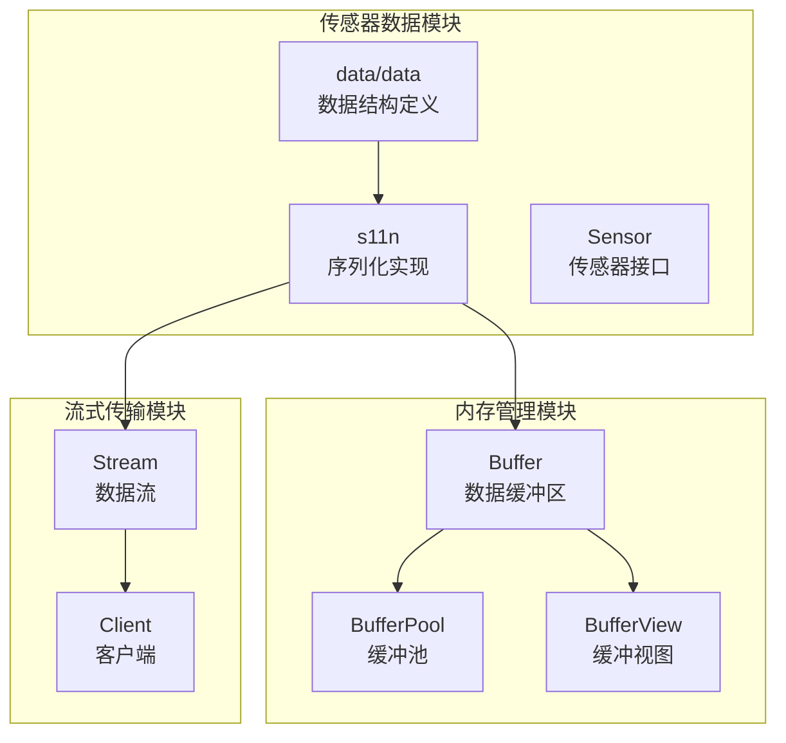
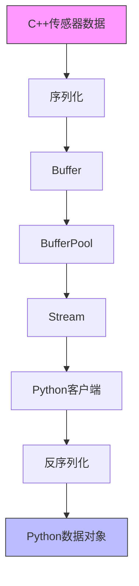
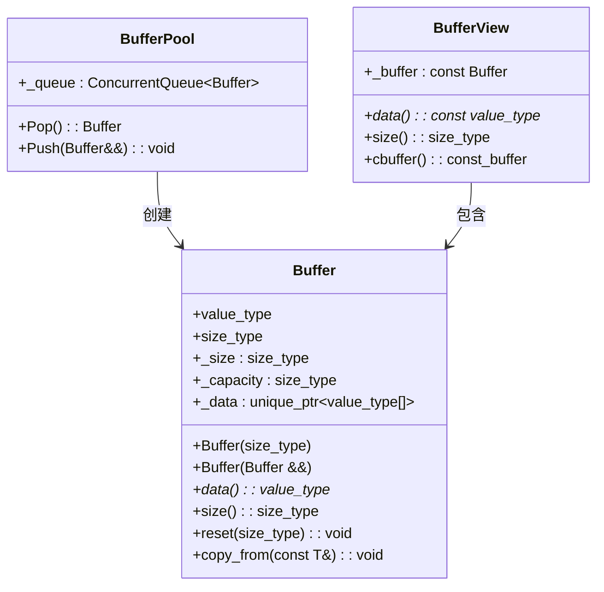
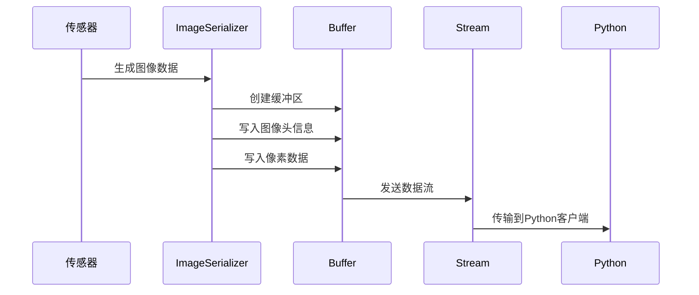
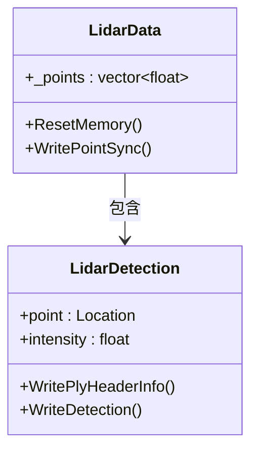
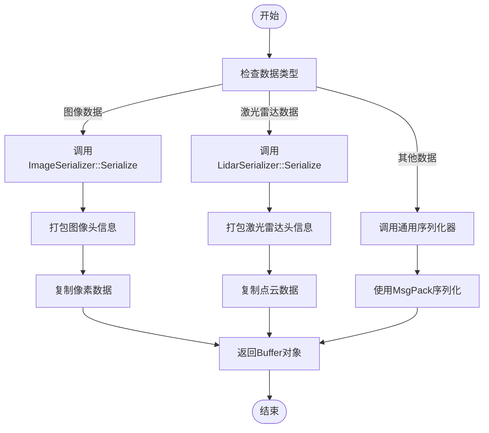
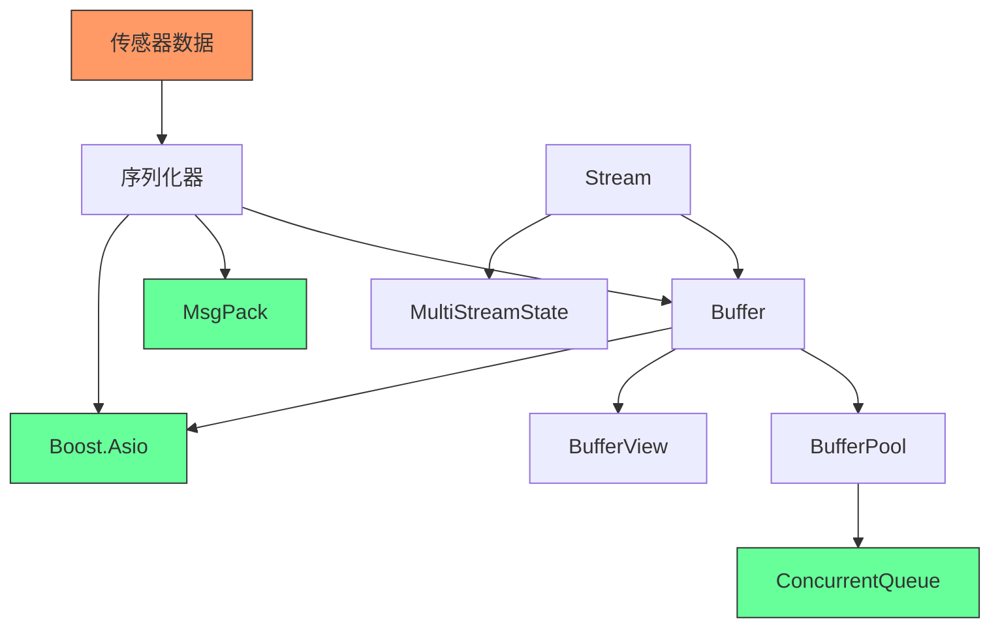

# 数据转换策略

**本文档中引用的文件**  
- [Buffer.h](https://github.com/carla-simulator/carla/blob/ue5-dev/LibCarla/source/carla/Buffer.h)
- [BufferPool.h](https://github.com/carla-simulator/carla/blob/ue5-dev/LibCarla/source/carla/BufferPool.h)
- [BufferView.h](https://github.com/carla-simulator/carla/blob/ue5-dev/LibCarla/source/carla/BufferView.h)
- [Image.h](https://github.com/carla-simulator/carla/blob/ue5-dev/LibCarla/source/carla/sensor/data/Image.h)
- [LidarData.h](https://github.com/carla-simulator/carla/blob/ue5-dev/LibCarla/source/carla/sensor/data/LidarData.h)
- [ImageSerializer.h](https://github.com/carla-simulator/carla/blob/ue5-dev/LibCarla/source/carla/sensor/s11n/ImageSerializer.h)
- [LidarSerializer.h](https://github.com/carla-simulator/carla/blob/ue5-dev/LibCarla/source/carla/sensor/s11n/LidarSerializer.h)
- [Stream.h](https://github.com/carla-simulator/carla/blob/ue5-dev/LibCarla/source/carla/streaming/Stream.h)
- [SensorData.h](https://github.com/carla-simulator/carla/blob/ue5-dev/LibCarla/source/carla/sensor/SensorData.h)
- [RawData.h](https://github.com/carla-simulator/carla/blob/ue5-dev/LibCarla/source/carla/sensor/RawData.h)

## 目录
1. [引言](#引言)
2. [项目结构](#项目结构)
3. [核心组件](#核心组件)
4. [架构概述](#架构概述)
5. [详细组件分析](#详细组件分析)
6. [依赖分析](#依赖分析)
7. [性能考虑](#性能考虑)
8. [故障排除指南](#故障排除指南)
9. [结论](#结论)

## 引言
本文深入探讨CARLA仿真平台中传感器数据从C++到Python的高效转换机制，重点分析大规模数据（如点云、图像和激光雷达数据）的传输策略。文档将揭示CARLA如何通过内存共享、零拷贝技术和序列化优化来实现高性能数据传递，确保高频率传感器数据流的稳定处理。

## 项目结构
CARLA的传感器数据处理系统主要位于`LibCarla`模块中，其核心功能分布在多个子目录中。`source/carla/sensor/data`目录包含各种传感器数据类型的定义，`source/carla/sensor/s11n`目录实现序列化逻辑，而`source/carla`目录提供底层内存管理和数据传输支持。

**图源**
- [Buffer.h](https://github.com/carla-simulator/carla/blob/ue5-dev/LibCarla/source/carla/Buffer.h#L26-L376)
- [BufferPool.h](https://github.com/carla-simulator/carla/blob/ue5-dev/LibCarla/source/carla/BufferPool.h#L22-L60)
- [BufferView.h](https://github.com/carla-simulator/carla/blob/ue5-dev/LibCarla/source/carla/BufferView.h#L27-L154)

**节源**
- [LibCarla/source/carla](https://github.com/carla-simulator/carla/blob/ue5-dev/LibCarla/source/carla)
- [LibCarla/source/carla/sensor](https://github.com/carla-simulator/carla/blob/ue5-dev/LibCarla/source/carla/sensor)

## 核心组件
CARLA的传感器数据转换系统由三个核心组件构成：缓冲区管理、序列化框架和流式传输机制。这些组件协同工作，确保从C++后端到Python前端的高效数据传递。

**节源**
- [Buffer.h](https://github.com/carla-simulator/carla/blob/ue5-dev/LibCarla/source/carla/Buffer.h#L26-L376)
- [BufferPool.h](https://github.com/carla-simulator/carla/blob/ue5-dev/LibCarla/source/carla/BufferPool.h#L22-L60)
- [Stream.h](https://github.com/carla-simulator/carla/blob/ue5-dev/LibCarla/source/carla/streaming/Stream.h#L12-L23)

## 架构概述
CARLA采用分层架构实现传感器数据的高效传输。在底层，`Buffer`类提供内存管理功能；中间层通过`BufferPool`实现内存池化；顶层使用`Stream`机制进行数据流传输。序列化组件将传感器数据转换为可传输格式。

**图源**
- [Stream.h](https://github.com/carla-simulator/carla/blob/ue5-dev/LibCarla/source/carla/streaming/Stream.h#L15-L19)
- [BufferPool.h](https://github.com/carla-simulator/carla/blob/ue5-dev/LibCarla/source/carla/BufferPool.h#L23-L28)

## 详细组件分析

### 缓冲区管理组件分析
CARLA使用`Buffer`类作为基本数据容器，支持动态内存分配和移动语义，确保高效的数据传递。`BufferPool`通过对象池模式重用内存，避免频繁的内存分配和释放。

#### 缓冲区类图

**图源**
- [Buffer.h](https://github.com/carla-simulator/carla/blob/ue5-dev/LibCarla/source/carla/Buffer.h#L42-L373)
- [BufferPool.h](https://github.com/carla-simulator/carla/blob/ue5-dev/LibCarla/source/carla/BufferPool.h#L29-L57)
- [BufferView.h](https://github.com/carla-simulator/carla/blob/ue5-dev/LibCarla/source/carla/BufferView.h#L32-L149)

**节源**
- [Buffer.h](https://github.com/carla-simulator/carla/blob/ue5-dev/LibCarla/source/carla/Buffer.h#L26-L376)
- [BufferPool.h](https://github.com/carla-simulator/carla/blob/ue5-dev/LibCarla/source/carla/BufferPool.h#L22-L60)
- [BufferView.h](https://github.com/carla-simulator/carla/blob/ue5-dev/LibCarla/source/carla/BufferView.h#L27-L154)

### 传感器数据组件分析
CARLA为不同类型的传感器数据提供了专门的数据结构。图像数据使用`Image`类，激光雷达数据使用`LidarData`类，这些类都设计为高效序列化和传输。

#### 图像数据序列化流程

**图源**
- [ImageSerializer.h](https://github.com/carla-simulator/carla/blob/ue5-dev/LibCarla/source/carla/sensor/s11n/ImageSerializer.h#L23-L72)
- [Image.h](https://github.com/carla-simulator/carla/blob/ue5-dev/LibCarla/source/carla/sensor/data/Image.h#L16-L27)

#### 激光雷达数据结构

**图源**
- [LidarData.h](https://github.com/carla-simulator/carla/blob/ue5-dev/LibCarla/source/carla/sensor/data/LidarData.h#L52-L116)

**节源**
- [LidarData.h](https://github.com/carla-simulator/carla/blob/ue5-dev/LibCarla/source/carla/sensor/data/LidarData.h#L15-L121)
- [Image.h](https://github.com/carla-simulator/carla/blob/ue5-dev/LibCarla/source/carla/sensor/data/Image.h#L12-L31)

### 数据序列化组件分析
CARLA使用专门的序列化器将传感器数据转换为可传输格式。每个传感器类型都有对应的序列化器，如`ImageSerializer`和`LidarSerializer`。

#### 数据序列化流程图

**图源**
- [ImageSerializer.h](https://github.com/carla-simulator/carla/blob/ue5-dev/LibCarla/source/carla/sensor/s11n/ImageSerializer.h#L23-L72)
- [LidarSerializer.h](https://github.com/carla-simulator/carla/blob/ue5-dev/LibCarla/source/carla/sensor/s11n/LidarSerializer.h)

**节源**
- [LibCarla/source/carla/sensor/s11n](https://github.com/carla-simulator/carla/blob/ue5-dev/LibCarla/source/carla/sensor/s11n)

## 依赖分析
CARLA的传感器数据转换系统依赖于多个关键组件，包括内存管理、序列化框架和网络传输模块。这些组件之间存在紧密的依赖关系，共同构成了高效的数据传输管道。

**图源**
- [Buffer.h](https://github.com/carla-simulator/carla/blob/ue5-dev/LibCarla/source/carla/Buffer.h#L24-L25)
- [BufferPool.h](https://github.com/carla-simulator/carla/blob/ue5-dev/LibCarla/source/carla/BufferPool.h#L15-L18)
- [Stream.h](https://github.com/carla-simulator/carla/blob/ue5-dev/LibCarla/source/carla/streaming/Stream.h#L9-L10)

**节源**
- [Buffer.h](https://github.com/carla-simulator/carla/blob/ue5-dev/LibCarla/source/carla/Buffer.h#L1-L376)
- [BufferPool.h](https://github.com/carla-simulator/carla/blob/ue5-dev/LibCarla/source/carla/BufferPool.h#L1-L60)
- [Stream.h](https://github.com/carla-simulator/carla/blob/ue5-dev/LibCarla/source/carla/streaming/Stream.h#L1-L23)

## 性能考虑
CARLA通过多种技术优化传感器数据传输性能：
- **内存池化**：使用`BufferPool`避免频繁的内存分配
- **零拷贝**：通过`BufferView`实现数据共享
- **批量处理**：将多个数据包合并传输
- **异步传输**：使用流式传输机制避免阻塞

这些优化确保了即使在高频率传感器数据流下，系统也能保持稳定性能。

## 故障排除指南
当遇到传感器数据传输问题时，可以检查以下方面：
- 确保`BufferPool`有足够的容量
- 检查序列化器是否正确处理数据类型
- 验证流式传输连接状态
- 监控内存使用情况避免泄漏

**节源**
- [Buffer.h](https://github.com/carla-simulator/carla/blob/ue5-dev/LibCarla/source/carla/Buffer.h#L112-L116)
- [BufferPool.h](https://github.com/carla-simulator/carla/blob/ue5-dev/LibCarla/source/carla/BufferPool.h#L52-L54)

## 结论
CARLA通过精心设计的缓冲区管理、序列化框架和流式传输机制，实现了从C++到Python的高效传感器数据转换。系统采用内存池化、零拷贝和批量处理等技术，确保大规模数据（如点云和图像）能够高效传输，为自动驾驶仿真提供了可靠的基础设施。