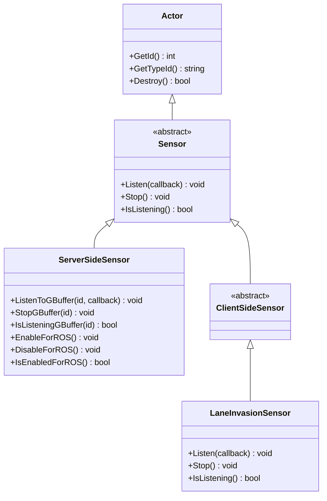
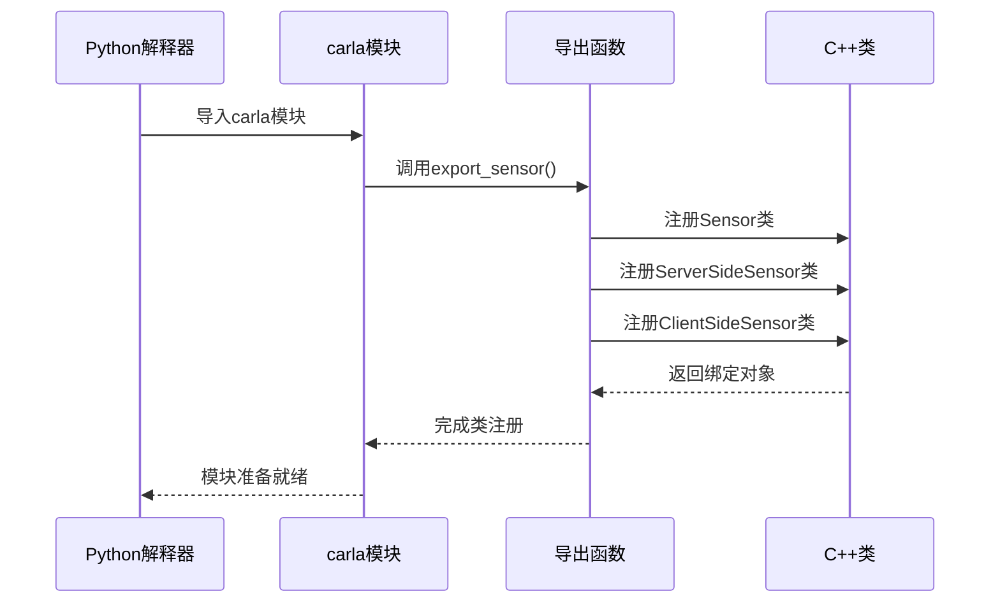
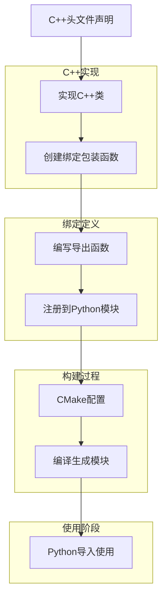

# 绑定实现机制


**本文档中引用的文件**  
- [Sensor.h](https://github.com/carla-simulator/carla/blob/ue5-dev/LibCarla/source/carla/client/Sensor.h)
- [ServerSideSensor.h](https://github.com/carla-simulator/carla/blob/ue5-dev/LibCarla/source/carla/client/ServerSideSensor.h)
- [ClientSideSensor.h](https://github.com/carla-simulator/carla/blob/ue5-dev/LibCarla/source/carla/client/ClientSideSensor.h)
- [LaneInvasionSensor.h](https://github.com/carla-simulator/carla/blob/ue5-dev/LibCarla/source/carla/client/LaneInvasionSensor.h)
- [Sensor.cpp](https://github.com/carla-simulator/carla/blob/ue5-dev/PythonAPI/carla/src/Sensor.cpp)
- [PythonAPI.h](https://github.com/carla-simulator/carla/blob/ue5-dev/PythonAPI/carla/include/PythonAPI.h)
- [PythonAPI.cpp](https://github.com/carla-simulator/carla/blob/ue5-dev/PythonAPI/carla/src/PythonAPI.cpp)
- [CMakeLists.txt.in](https://github.com/carla-simulator/carla/blob/ue5-dev/PythonAPI/carla/CMakeLists.txt.in)
- [LibCarla/CMakeLists.txt](https://github.com/carla-simulator/carla/blob/ue5-dev/LibCarla/CMakeLists.txt)
- [ServerSideSensor.cpp](https://github.com/carla-simulator/carla/blob/ue5-dev/LibCarla/source/carla/client/ServerSideSensor.cpp)
- [LaneInvasionSensor.cpp](https://github.com/carla-simulator/carla/blob/ue5-dev/LibCarla/source/carla/client/LaneInvasionSensor.cpp)


## 目录
1. [引言](#引言)
2. [传感器模块的C++类结构](#传感器模块的c类结构)
3. [pybind11绑定机制概述](#pybind11绑定机制概述)
4. [Sensor类的绑定实现](#sensor类的绑定实现)
5. [继承关系与多态绑定](#继承关系与多态绑定)
6. [回调函数的绑定策略](#回调函数的绑定策略)
7. [构建系统与CMake配置](#构建系统与cmake配置)
8. [绑定实现流程](#绑定实现流程)
9. [常见绑定错误与解决方案](#常见绑定错误与解决方案)
10. [结论](#结论)

## 引言

CARLA仿真平台通过Python与C++的混合架构实现了高性能的自动驾驶仿真功能。其中，C++负责核心仿真逻辑和性能敏感的计算，而Python提供了用户友好的API接口。这种架构的关键在于Python与C++之间的绑定机制，该机制使得Python代码能够无缝调用C++实现的功能。本文档详细阐述CARLA中Python与C++之间的绑定实现机制，重点分析pybind11在传感器模块中的具体应用。

## 传感器模块的C++类结构

CARLA的传感器模块采用面向对象的设计模式，通过继承关系组织不同类型的传感器。核心基类`Sensor`定义了所有传感器的通用接口，包括数据监听、停止监听和状态查询等基本功能。该类继承自`Actor`类，表明传感器在仿真环境中被视为一种特殊的参与者。



**图源**  
- [Sensor.h](https://github.com/carla-simulator/carla/blob/ue5-dev/LibCarla/source/carla/client/Sensor.h)
- [ServerSideSensor.h](https://github.com/carla-simulator/carla/blob/ue5-dev/LibCarla/source/carla/client/ServerSideSensor.h)
- [ClientSideSensor.h](https://github.com/carla-simulator/carla/blob/ue5-dev/LibCarla/source/carla/client/ClientSideSensor.h)
- [LaneInvasionSensor.h](https://github.com/carla-simulator/carla/blob/ue5-dev/LibCarla/source/carla/client/LaneInvasionSensor.h)

`ServerSideSensor`类代表在服务器端运行的传感器，如摄像头和激光雷达，这些传感器的数据需要通过网络流传输。`ClientSideSensor`类则代表在客户端运行的传感器，如车道入侵检测器，其数据处理直接在客户端完成。`LaneInvasionSensor`是`ClientSideSensor`的具体实现，用于检测车辆是否偏离车道。

**本节来源**  
- [Sensor.h](https://github.com/carla-simulator/carla/blob/ue5-dev/LibCarla/source/carla/client/Sensor.h)
- [ServerSideSensor.h](https://github.com/carla-simulator/carla/blob/ue5-dev/LibCarla/source/carla/client/ServerSideSensor.h)
- [ClientSideSensor.h](https://github.com/carla-simulator/carla/blob/ue5-dev/LibCarla/source/carla/client/ClientSideSensor.h)
- [LaneInvasionSensor.h](https://github.com/carla-simulator/carla/blob/ue5-dev/LibCarla/source/carla/client/LaneInvasionSensor.h)

## pybind11绑定机制概述

CARLA使用pybind11库实现Python与C++之间的绑定。pybind11是一个轻量级的头文件库，能够将C++代码暴露给Python，同时保持高性能和易用性。在CARLA中，pybind11的绑定实现遵循模块化的设计原则，每个功能模块都有独立的导出函数。

绑定过程的核心是`BOOST_PYTHON_MODULE`宏，它定义了Python模块的入口点。在`PythonAPI.cpp`文件中，通过调用各个模块的导出函数来注册C++类和函数。这种设计使得绑定代码的组织更加清晰，便于维护和扩展。



**图源**  
- [PythonAPI.cpp](https://github.com/carla-simulator/carla/blob/ue5-dev/PythonAPI/carla/src/PythonAPI.cpp)
- [Sensor.cpp](https://github.com/carla-simulator/carla/blob/ue5-dev/PythonAPI/carla/src/Sensor.cpp)

pybind11的另一个重要特性是能够处理复杂的C++类型系统，包括模板、智能指针和回调函数。CARLA充分利用了这些特性，将C++的`std::shared_ptr`、`std::function`等类型无缝转换为Python对象，使得Python代码能够自然地使用C++的高级功能。

**本节来源**  
- [PythonAPI.cpp](https://github.com/carla-simulator/carla/blob/ue5-dev/PythonAPI/carla/src/PythonAPI.cpp)
- [PythonAPI.h](https://github.com/carla-simulator/carla/blob/ue5-dev/PythonAPI/carla/include/PythonAPI.h)

## Sensor类的绑定实现

Sensor类的绑定实现位于`PythonAPI/carla/src/Sensor.cpp`文件中，通过`export_sensor()`函数完成。该函数使用pybind11的`class_`模板来定义Python类，并将其与C++的`Sensor`类关联。绑定过程中需要指定类的继承关系、内存管理策略和初始化方式。

```cpp
class_<cc::Sensor, bases<cc::Actor>, boost::noncopyable, std::shared_ptr<cc::Sensor>>("Sensor", no_init)
  .add_property("is_listening", &cc::Sensor::IsListening)
  .def("listen", &SubscribeToStream, (arg("callback")))
  .def("is_listening", &cc::Sensor::IsListening)
  .def("stop", &cc::Sensor::Stop)
  .def(self_ns::str(self_ns::self))
;
```

上述代码展示了Sensor类的基本绑定结构。`bases<cc::Actor>`指定了继承关系，表明Python的Sensor类继承自Actor类。`boost::noncopyable`表示该类不可复制，`std::shared_ptr<cc::Sensor>`指定了内存管理策略，使用智能指针自动管理对象生命周期。`no_init`表示该类不能直接实例化，必须通过工厂方法创建。

属性和方法的绑定通过`.add_property()`和`.def()`方法完成。`is_listening`属性通过`add_property`绑定到`IsListening()`方法，而`listen`和`stop`方法则直接绑定到相应的C++成员函数。特别值得注意的是`listen`方法的绑定，它使用了一个包装函数`SubscribeToStream`来处理Python回调函数的转换。

**本节来源**  
- [Sensor.cpp](https://github.com/carla-simulator/carla/blob/ue5-dev/PythonAPI/carla/src/Sensor.cpp)
- [Sensor.h](https://github.com/carla-simulator/carla/blob/ue5-dev/LibCarla/source/carla/client/Sensor.h)

## 继承关系与多态绑定

CARLA的传感器类体系展示了复杂的继承关系，绑定实现需要正确处理多态性。在pybind11中，这通过指定基类和使用虚函数机制来实现。每个派生类的绑定都需要明确指定其基类，确保Python中的继承关系与C++保持一致。

```mermaid
classDiagram
class Sensor {
+Listen(callback) void
+Stop() void
+IsListening() bool
}
class ServerSideSensor {
+ListenToGBuffer(id, callback) void
+StopGBuffer(id) void
+IsListeningGBuffer(id) bool
+EnableForROS() void
+DisableForROS() void
+IsEnabledForROS() bool
}
class ClientSideSensor {
}
class LaneInvasionSensor {
+Listen(callback) void
+Stop() void
+IsListening() bool
}
Sensor <|-- ServerSideSensor
Sensor <|-- ClientSideSensor
ClientSideSensor <|-- LaneInvasionSensor
note right of ServerSideSensor
重写Listen和Stop方法
添加GBuffer相关方法
支持ROS2集成
end note
note right of LaneInvasionSensor
重写Listen和Stop方法
实现客户端车道检测逻辑
end note
```

**图源**  
- [Sensor.cpp](https://github.com/carla-simulator/carla/blob/ue5-dev/PythonAPI/carla/src/Sensor.cpp)
- [ServerSideSensor.h](https://github.com/carla-simulator/carla/blob/ue5-dev/LibCarla/source/carla/client/ServerSideSensor.h)
- [LaneInvasionSensor.h](https://github.com/carla-simulator/carla/blob/ue5-dev/LibCarla/source/carla/client/LaneInvasionSensor.h)

`ServerSideSensor`类的绑定展示了如何处理继承和扩展。它继承自`Sensor`类，并添加了`ListenToGBuffer`、`StopGBuffer`等特定于GBuffer流的方法。这些方法的绑定同样使用包装函数`SubscribeToGBuffer`来处理参数转换和回调机制。

```cpp
class_<cc::ServerSideSensor, bases<cc::Sensor>, boost::noncopyable, std::shared_ptr<cc::ServerSideSensor>>
    ("ServerSideSensor", no_init)
  .def("listen_to_gbuffer", &SubscribeToGBuffer, (arg("gbuffer_id"), arg("callback")))
  .def("is_listening_gbuffer", &cc::ServerSideSensor::IsListeningGBuffer, (arg("gbuffer_id")))
  .def("stop_gbuffer", &cc::ServerSideSensor::StopGBuffer, (arg("gbuffer_id")))
  .def("enable_for_ros", &cc::ServerSideSensor::EnableForROS)
  .def("disable_for_ros", &cc::ServerSideSensor::DisableForROS)
  .def("is_enabled_for_ros", &cc::ServerSideSensor::IsEnabledForROS)
  .def(self_ns::str(self_ns::self))
;
```

`LaneInvasionSensor`类的绑定则展示了客户端传感器的特殊处理。由于其`Listen`方法的实现与基类不同，需要重写该方法的绑定。在C++实现中，`LaneInvasionSensor`的`Listen`方法会注册一个tick事件回调，而不是直接订阅数据流。

**本节来源**  
- [Sensor.cpp](https://github.com/carla-simulator/carla/blob/ue5-dev/PythonAPI/carla/src/Sensor.cpp)
- [ServerSideSensor.h](https://github.com/carla-simulator/carla/blob/ue5-dev/LibCarla/source/carla/client/ServerSideSensor.h)
- [LaneInvasionSensor.h](https://github.com/carla-simulator/carla/blob/ue5-dev/LibCarla/source/carla/client/LaneInvasionSensor.h)

## 回调函数的绑定策略

回调函数的绑定是CARLA传感器模块的关键技术难点。传感器需要将数据传递给Python用户定义的回调函数，这涉及到跨语言的函数调用和异常处理。CARLA通过`MakeCallback`辅助函数和智能指针的组合来解决这一问题。

```cpp
inline auto MakeCallback(boost::python::object callback) {
  namespace py = boost::python;
  // 确保回调函数是可调用的
  if (!PyCallable_Check(callback.ptr())) {
    PyErr_SetString(PyExc_TypeError, "callback argument must be callable!");
    py::throw_error_already_set();
  }

  // 使用智能指针管理回调函数的生命周期
  using Deleter = carla::PythonUtil::AcquireGILDeleter;
  auto callback_ptr = carla::SharedPtr<py::object>{new py::object(callback), Deleter()};

  // 创建lambda回调
  return [callback=std::move(callback_ptr)](auto message) {
    carla::PythonUtil::AcquireGIL lock;
    try {
      py::call<void>(callback->ptr(), py::object(message));
    } catch (const py::error_already_set &) {
      PyErr_Print();
    }
  };
}
```

`MakeCallback`函数首先验证Python对象是否可调用，然后使用`SharedPtr`包装回调函数，确保其生命周期与C++对象一致。关键的是，它使用了特殊的删除器`AcquireGILDeleter`，在删除回调函数时自动获取Python全局解释器锁（GIL），避免了多线程环境下的竞态条件。

对于`listen`方法的绑定，CARLA使用了包装函数`SubscribeToStream`来桥接C++和Python的调用：

```cpp
static void SubscribeToStream(carla::client::Sensor &self, boost::python::object callback) {
  self.Listen(MakeCallback(std::move(callback)));
}
```

这个包装函数将Python的`object`类型转换为C++的`std::function`类型，并通过`MakeCallback`处理生命周期和线程安全问题。当传感器接收到新数据时，C++的`Listen`方法会调用这个包装后的回调函数，从而触发Python端的处理逻辑。

**本节来源**  
- [PythonAPI.h](https://github.com/carla-simulator/carla/blob/ue5-dev/PythonAPI/carla/include/PythonAPI.h)
- [Sensor.cpp](https://github.com/carla-simulator/carla/blob/ue5-dev/PythonAPI/carla/src/Sensor.cpp)

## 构建系统与CMake配置

CARLA的构建系统使用CMake来管理Python绑定的编译过程。`PythonAPI/carla/CMakeLists.txt.in`文件定义了Python模块的构建规则，包括源文件、头文件、依赖项和编译选项的配置。

```cmake
Python3_add_library (
  ${SKBUILD_PROJECT_NAME}
  MODULE
  ${PYTHON_API_ADD_LIBRARY_ARGS}
  ${PYTHON_API_HEADERS}
  ${PYTHON_API_SOURCES}
)
```

`Python3_add_library`宏是构建Python扩展模块的核心，它创建一个动态链接库（.so或.pyd），可以被Python直接导入。模块的名称由`SKBUILD_PROJECT_NAME`变量指定，通常为"carla"。

构建系统还需要正确配置头文件搜索路径和链接依赖项：

```cmake
target_include_directories (
  ${SKBUILD_PROJECT_NAME} SYSTEM PRIVATE
  ${CARLA_PYTHON_API_INCLUDE_PATH}
  $<TARGET_PROPERTY:carla-client,INTERFACE_INCLUDE_DIRECTORIES>
  $<TARGET_PROPERTY:@Boost_python_TARGET_NAME@,INTERFACE_INCLUDE_DIRECTORIES>
  ...
)

target_link_libraries (
  ${SKBUILD_PROJECT_NAME} PUBLIC
  $<TARGET_FILE:carla-client>
  $<TARGET_FILE:@Boost_python_TARGET_NAME@>
  ...
)
```

这些配置确保编译器能够找到所有必要的头文件，并在链接阶段包含正确的库文件。特别重要的是`carla-client`库，它包含了传感器类的实现。

构建系统还处理了不同平台的差异，如Windows和Linux下的模块扩展名：

```cmake
if (WIN32)
  set (PYTHON_MODULE_EXT .pyd)
else ()
  set (PYTHON_MODULE_EXT .so)
endif ()
```

此外，CMake配置还支持条件编译，根据构建选项启用或禁用特定功能：

```cmake
if (ENABLE_OSM2ODR)
  list (
    APPEND
    PYTHON_API_SOURCES
    ${CARLA_PYTHON_API_SOURCE_PATH}/OSM2ODR.cpp
  )
endif ()

if (ENABLE_RSS)
  list (
    APPEND
    PYTHON_API_SOURCES
    ${CARLA_PYTHON_API_SOURCE_PATH}/AdRss.cpp
  )
endif ()
```

**本节来源**  
- [CMakeLists.txt.in](https://github.com/carla-simulator/carla/blob/ue5-dev/PythonAPI/carla/CMakeLists.txt.in)
- [LibCarla/CMakeLists.txt](https://github.com/carla-simulator/carla/blob/ue5-dev/LibCarla/CMakeLists.txt)

## 绑定实现流程

CARLA的Python绑定实现遵循一个清晰的流程，从C++头文件声明到Python模块生成。这个流程可以分为以下几个关键步骤：



**图源**  
- [Sensor.h](https://github.com/carla-simulator/carla/blob/ue5-dev/LibCarla/source/carla/client/Sensor.h)
- [Sensor.cpp](https://github.com/carla-simulator/carla/blob/ue5-dev/PythonAPI/carla/src/Sensor.cpp)
- [CMakeLists.txt.in](https://github.com/carla-simulator/carla/blob/ue5-dev/PythonAPI/carla/CMakeLists.txt.in)

首先，在C++头文件中定义传感器类的接口，包括构造函数、方法和属性。然后在实现文件中完成具体的功能逻辑。对于需要暴露给Python的类，需要在`PythonAPI`目录下创建对应的绑定文件。

绑定文件的核心是导出函数，如`export_sensor()`。这个函数使用pybind11的API来定义Python类，包括类名、继承关系、构造函数、方法和属性。对于复杂的方法，如带有回调函数的`listen`方法，需要创建包装函数来处理参数转换。

所有导出函数最终在`PythonAPI.cpp`中被调用，通过`BOOST_PYTHON_MODULE`宏注册到Python模块中。CMake构建系统根据`CMakeLists.txt.in`文件的配置，将所有绑定源文件编译成一个Python扩展模块。

完整的绑定流程体现了CARLA架构的模块化设计：C++负责核心功能实现，绑定层负责接口转换，构建系统负责自动化编译。这种分离使得开发人员可以专注于各自领域的实现，而不必担心跨语言集成的复杂性。

**本节来源**  
- [Sensor.h](https://github.com/carla-simulator/carla/blob/ue5-dev/LibCarla/source/carla/client/Sensor.h)
- [Sensor.cpp](https://github.com/carla-simulator/carla/blob/ue5-dev/PythonAPI/carla/src/Sensor.cpp)
- [PythonAPI.cpp](https://github.com/carla-simulator/carla/blob/ue5-dev/PythonAPI/carla/src/PythonAPI.cpp)
- [CMakeLists.txt.in](https://github.com/carla-simulator/carla/blob/ue5-dev/PythonAPI/carla/CMakeLists.txt.in)

## 常见绑定错误与解决方案

在实现Python与C++绑定时，可能会遇到多种常见错误。理解这些错误的原因和解决方案对于维护绑定代码的稳定性至关重要。

### 内存管理错误

最常见的错误是内存管理问题，特别是智能指针的使用不当。例如，如果忘记使用`SharedPtr`包装Python回调函数，可能会导致回调函数在C++代码尝试调用时已经被Python的垃圾回收器销毁。

**解决方案**：始终使用`SharedPtr`和适当的删除器来管理跨语言对象的生命周期。在CARLA中，`MakeCallback`函数已经处理了这个问题。

### 线程安全问题

由于Python的全局解释器锁（GIL）机制，跨线程的Python调用需要特别注意。如果在没有获取GIL的情况下调用Python代码，可能会导致解释器崩溃。

**解决方案**：在调用Python代码前使用`carla::PythonUtil::AcquireGIL`获取GIL锁。CARLA的`MakeCallback`函数中已经包含了这一机制。

### 类型转换错误

C++和Python之间的类型系统不完全兼容，可能会出现类型转换错误。例如，将Python的列表直接传递给期望C++向量的函数。

**解决方案**：使用pybind11提供的类型转换工具，或创建自定义的转换函数。CARLA在`PythonAPI.h`中定义了多个辅助宏来处理常见类型转换。

### 继承关系错误

在绑定继承类时，如果基类没有正确注册，可能会导致多态行为异常。

**解决方案**：确保基类在派生类之前注册，并正确指定继承关系。使用`bases<基类>`模板参数明确声明继承。

### 构建配置错误

CMake配置错误可能导致头文件找不到或链接失败。

**解决方案**：仔细检查`target_include_directories`和`target_link_libraries`的配置，确保所有依赖项都正确声明。使用`$<TARGET_PROPERTY:...>`语法引用其他目标的属性。

通过遵循CARLA已有的最佳实践和模式，可以有效避免这些常见错误，确保绑定代码的稳定性和可靠性。

**本节来源**  
- [PythonAPI.h](https://github.com/carla-simulator/carla/blob/ue5-dev/PythonAPI/carla/include/PythonAPI.h)
- [Sensor.cpp](https://github.com/carla-simulator/carla/blob/ue5-dev/PythonAPI/carla/src/Sensor.cpp)
- [CMakeLists.txt.in](https://github.com/carla-simulator/carla/blob/ue5-dev/PythonAPI/carla/CMakeLists.txt.in)

## 结论

CARLA的Python与C++绑定机制通过pybind11库实现了高效、稳定的跨语言集成。传感器模块的绑定实现展示了如何处理复杂的继承关系、回调函数和内存管理。构建系统通过CMake配置自动化了绑定代码的编译过程，确保了跨平台的兼容性。

这种绑定机制不仅提供了Python的易用性，还保持了C++的高性能，使得CARLA能够满足自动驾驶仿真对实时性和功能性的双重需求。通过深入理解这一机制，开发人员可以更好地利用CARLA平台的功能，或为其他项目设计类似的绑定架构。