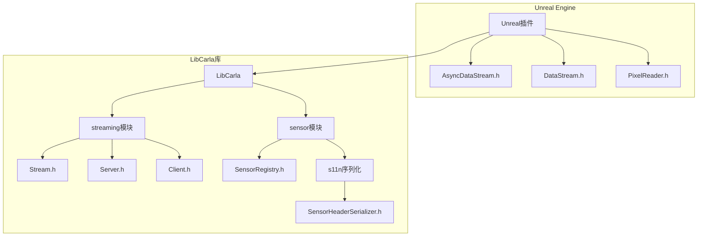
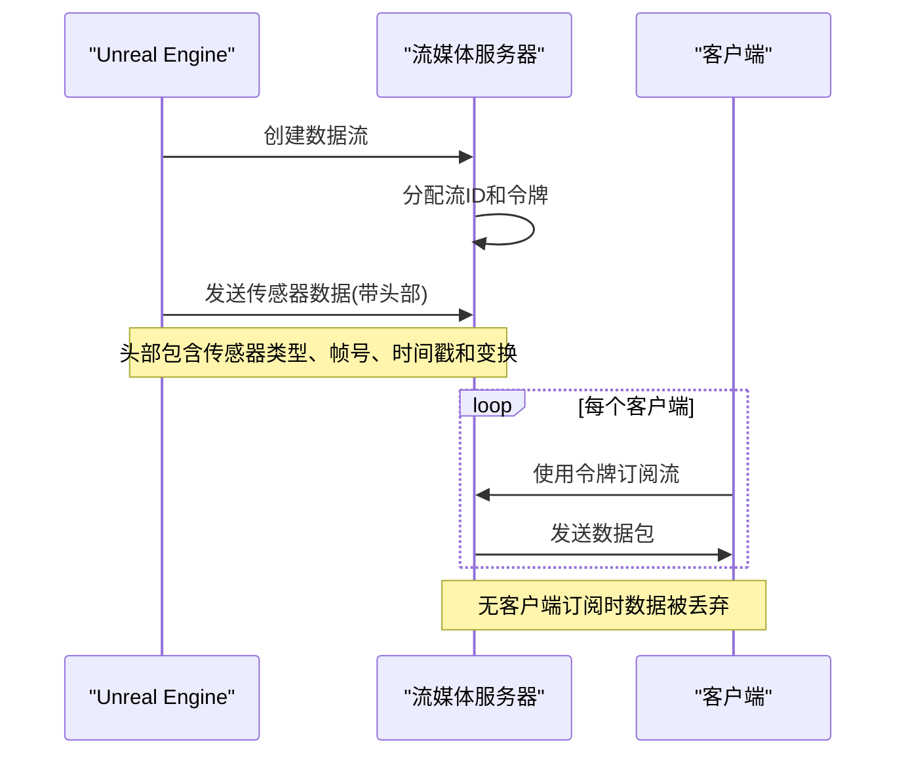
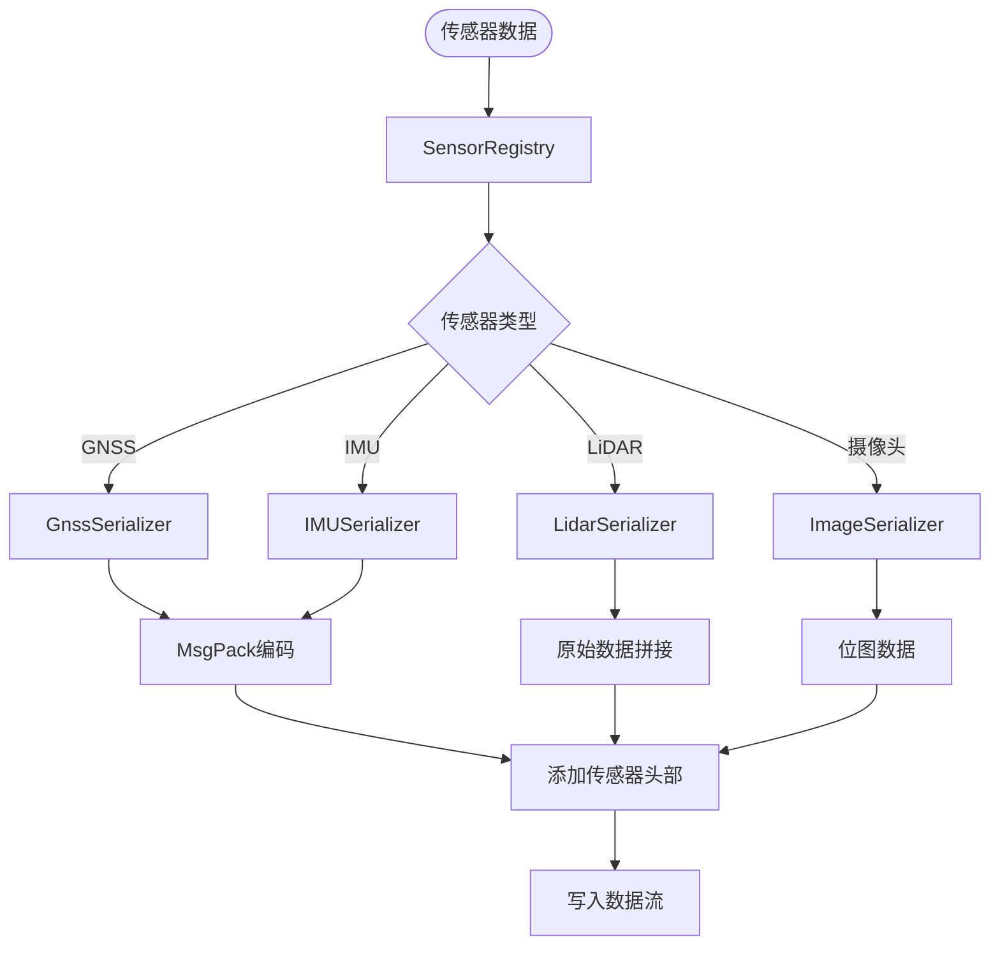
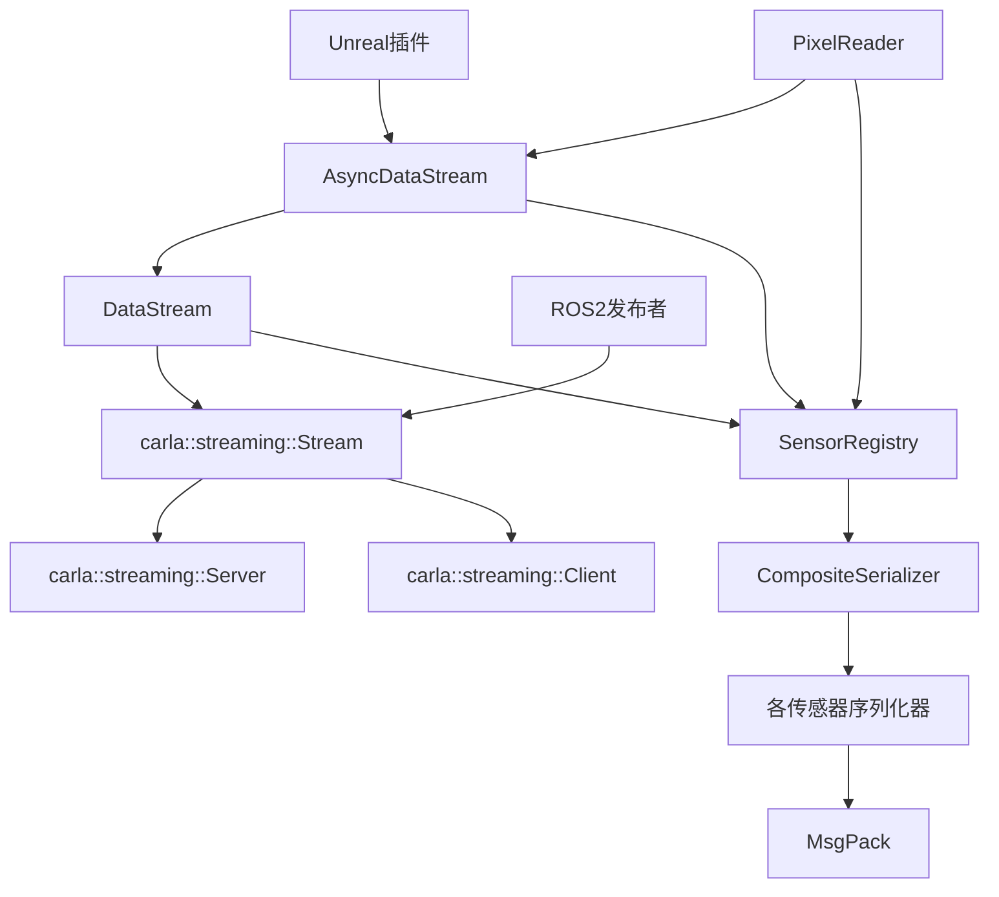

# 传感器数据流


**本文档中引用的文件**  
- [AsyncDataStream.h](https://github.com/carla-simulator/carla/blob/ue5-dev/Unreal/CarlaUnreal/Plugins/Carla/Source/Carla/Sensor/AsyncDataStream.h)
- [DataStream.h](https://github.com/carla-simulator/carla/blob/ue5-dev/Unreal/CarlaUnreal/Plugins/Carla/Source/Carla/Sensor/DataStream.h)
- [SensorHeaderSerializer.h](https://github.com/carla-simulator/carla/blob/ue5-dev/LibCarla/source/carla/sensor/s11n/SensorHeaderSerializer.h)
- [SensorHeaderSerializer.cpp](https://github.com/carla-simulator/carla/blob/ue5-dev/LibCarla/source/carla/sensor/s11n/SensorHeaderSerializer.cpp)
- [SensorRegistry.h](https://github.com/carla-simulator/carla/blob/ue5-dev/LibCarla/source/carla/sensor/SensorRegistry.h)
- [CompositeSerializer.h](https://github.com/carla-simulator/carla/blob/ue5-dev/LibCarla/source/carla/sensor/CompositeSerializer.h)
- [Deserializer.h](https://github.com/carla-simulator/carla/blob/ue5-dev/LibCarla/source/carla/sensor/Deserializer.h)
- [Deserializer.cpp](https://github.com/carla-simulator/carla/blob/ue5-dev/LibCarla/source/carla/sensor/Deserializer.cpp)
- [Stream.h](https://github.com/carla-simulator/carla/blob/ue5-dev/LibCarla/source/carla/streaming/Stream.h)
- [Server.h](https://github.com/carla-simulator/carla/blob/ue5-dev/LibCarla/source/carla/streaming/Server.h)
- [Client.h](https://github.com/carla-simulator/carla/blob/ue5-dev/LibCarla/source/carla/streaming/Client.h)
- [GnssSerializer.h](https://github.com/carla-simulator/carla/blob/ue5-dev/LibCarla/source/carla/sensor/s11n/GnssSerializer.h)
- [IMUSerializer.h](https://github.com/carla-simulator/carla/blob/ue5-dev/LibCarla/source/carla/sensor/s11n/IMUSerializer.h)
- [SemanticLidarSerializer.h](https://github.com/carla-simulator/carla/blob/ue5-dev/LibCarla/source/carla/sensor/s11n/SemanticLidarSerializer.h)
- [PixelReader.h](https://github.com/carla-simulator/carla/blob/ue5-dev/Unreal/CarlaUnreal/Plugins/Carla/Source/Carla/Sensor/PixelReader.h)
- [CarlaRGBCameraPublisher.cpp](https://github.com/carla-simulator/carla/blob/ue5-dev/LibCarla/source/carla/ros2/publishers/CarlaRGBCameraPublisher.cpp)
- [CarlaLidarPublisher.cpp](https://github.com/carla-simulator/carla/blob/ue5-dev/LibCarla/source/carla/ros2/publishers/CarlaLidarPublisher.cpp)


## 目录
1. [引言](#引言)
2. [项目结构](#项目结构)
3. [核心组件](#核心组件)
4. [架构概述](#架构概述)
5. [详细组件分析](#详细组件分析)
6. [依赖分析](#依赖分析)
7. [性能考虑](#性能考虑)
8. [故障排除指南](#故障排除指南)
9. [结论](#结论)

## 引言
本文档详细描述了CARLA仿真平台中传感器数据从Unreal Engine到客户端的完整传输路径。重点分析了AsyncDataStream如何通过TCP连接实现高效的数据流传输，包括连接建立、会话管理和流量控制机制。文档还解释了数据包的帧结构、序列化格式和错误恢复策略，分析了不同传感器类型在数据流特性上的差异及其对网络带宽的影响，并提供了性能监控工具的使用方法和优化建议。

## 项目结构
CARLA项目的传感器数据流系统主要分布在Unreal插件和LibCarla库中。Unreal插件负责在游戏线程中捕获传感器数据，而LibCarla库提供了跨平台的流媒体基础设施和序列化机制。



**图表来源**
- [AsyncDataStream.h](https://github.com/carla-simulator/carla/blob/ue5-dev/Unreal/CarlaUnreal/Plugins/Carla/Source/Carla/Sensor/AsyncDataStream.h)
- [DataStream.h](https://github.com/carla-simulator/carla/blob/ue5-dev/Unreal/CarlaUnreal/Plugins/Carla/Source/Carla/Sensor/DataStream.h)
- [Stream.h](https://github.com/carla-simulator/carla/blob/ue5-dev/LibCarla/source/carla/streaming/Stream.h)
- [Server.h](https://github.com/carla-simulator/carla/blob/ue5-dev/LibCarla/source/carla/streaming/Server.h)
- [SensorRegistry.h](https://github.com/carla-simulator/carla/blob/ue5-dev/LibCarla/source/carla/sensor/SensorRegistry.h)
- [SensorHeaderSerializer.h](https://github.com/carla-simulator/carla/blob/ue5-dev/LibCarla/source/carla/sensor/s11n/SensorHeaderSerializer.h)

**章节来源**
- [AsyncDataStream.h](https://github.com/carla-simulator/carla/blob/ue5-dev/Unreal/CarlaUnreal/Plugins/Carla/Source/Carla/Sensor/AsyncDataStream.h)
- [DataStream.h](https://github.com/carla-simulator/carla/blob/ue5-dev/Unreal/CarlaUnreal/Plugins/Carla/Source/Carla/Sensor/DataStream.h)
- [Stream.h](https://github.com/carla-simulator/carla/blob/ue5-dev/LibCarla/source/carla/streaming/Stream.h)

## 核心组件
传感器数据流的核心组件包括AsyncDataStream、DataStream、SensorRegistry和流媒体基础设施。AsyncDataStream允许从任何线程异步发送数据，而DataStream负责在游戏线程中创建数据流。SensorRegistry管理所有传感器的序列化器注册，确保不同类型传感器数据的正确序列化和反序列化。

**章节来源**
- [AsyncDataStream.h](https://github.com/carla-simulator/carla/blob/ue5-dev/Unreal/CarlaUnreal/Plugins/Carla/Source/Carla/Sensor/AsyncDataStream.h)
- [DataStream.h](https://github.com/carla-simulator/carla/blob/ue5-dev/Unreal/CarlaUnreal/Plugins/Carla/Source/Carla/Sensor/DataStream.h)
- [SensorRegistry.h](https://github.com/carla-simulator/carla/blob/ue5-dev/LibCarla/source/carla/sensor/SensorRegistry.h)

## 架构概述
CARLA的传感器数据流架构采用客户端-服务器模型，通过TCP连接实现高效的数据传输。服务器端（Unreal Engine）创建数据流并发送传感器数据，客户端通过订阅流令牌接收数据。



**图表来源**
- [Server.h](https://github.com/carla-simulator/carla/blob/ue5-dev/LibCarla/source/carla/streaming/Server.h)
- [Client.h](https://github.com/carla-simulator/carla/blob/ue5-dev/LibCarla/source/carla/streaming/Client.h)
- [AsyncDataStream.h](https://github.com/carla-simulator/carla/blob/ue5-dev/Unreal/CarlaUnreal/Plugins/Carla/Source/Carla/Sensor/AsyncDataStream.h)

## 详细组件分析

### AsyncDataStream分析
AsyncDataStream是传感器数据流的核心组件，提供异步数据发送功能。它通过缓冲池重用内存，显著提高大数据消息的性能。

```mermaid
classDiagram
class FAsyncDataStreamTmpl {
+StreamType Stream
+carla : : Buffer Header
+GetToken() Token
+PopBufferFromPool() Buffer
+Send(Sensor, Args) void
+SerializeAndSend(Sensor, Args) void
+SetFrameNumber(FrameNumber) void
+GetSensorType() uint64_t
+GetSensorTransform() FTransform
+GetSensorTimestamp() double
}
class FDataStreamTmpl {
+std : : optional<StreamType> Stream
+MakeAsyncDataStream(Sensor, Timestamp) FAsyncDataStreamTmpl
+IsStreamReady() bool
+GetToken() Token
+GetSensorType() uint64_t
+AreClientsListening() bool
}
FDataStreamTmpl --> FAsyncDataStreamTmpl : "创建"
FAsyncDataStreamTmpl --> carla : : streaming : : Stream : "使用"
```

**图表来源**
- [AsyncDataStream.h](https://github.com/carla-simulator/carla/blob/ue5-dev/Unreal/CarlaUnreal/Plugins/Carla/Source/Carla/Sensor/AsyncDataStream.h)
- [DataStream.h](https://github.com/carla-simulator/carla/blob/ue5-dev/Unreal/CarlaUnreal/Plugins/Carla/Source/Carla/Sensor/DataStream.h)

**章节来源**
- [AsyncDataStream.h](https://github.com/carla-simulator/carla/blob/ue5-dev/Unreal/CarlaUnreal/Plugins/Carla/Source/Carla/Sensor/AsyncDataStream.h)
- [DataStream.h](https://github.com/carla-simulator/carla/blob/ue5-dev/Unreal/CarlaUnreal/Plugins/Carla/Source/Carla/Sensor/DataStream.h)

### 数据序列化分析
传感器数据的序列化由SensorRegistry统一管理，不同类型的传感器使用不同的序列化器进行数据编码。



**图表来源**
- [SensorRegistry.h](https://github.com/carla-simulator/carla/blob/ue5-dev/LibCarla/source/carla/sensor/SensorRegistry.h)
- [CompositeSerializer.h](https://github.com/carla-simulator/carla/blob/ue5-dev/LibCarla/source/carla/sensor/CompositeSerializer.h)
- [GnssSerializer.h](https://github.com/carla-simulator/carla/blob/ue5-dev/LibCarla/source/carla/sensor/s11n/GnssSerializer.h)
- [IMUSerializer.h](https://github.com/carla-simulator/carla/blob/ue5-dev/LibCarla/source/carla/sensor/s11n/IMUSerializer.h)
- [SemanticLidarSerializer.h](https://github.com/carla-simulator/carla/blob/ue5-dev/LibCarla/source/carla/sensor/s11n/SemanticLidarSerializer.h)

**章节来源**
- [SensorRegistry.h](https://github.com/carla-simulator/carla/blob/ue5-dev/LibCarla/source/carla/sensor/SensorRegistry.h)
- [CompositeSerializer.h](https://github.com/carla-simulator/carla/blob/ue5-dev/LibCarla/source/carla/sensor/CompositeSerializer.h)
- [Deserializer.h](https://github.com/carla-simulator/carla/blob/ue5-dev/LibCarla/source/carla/sensor/Deserializer.h)

### 传感器头部结构
所有传感器数据包都包含一个标准化的头部，包含元信息用于数据解析和同步。

```mermaid
classDiagram
class SensorHeaderSerializer : : Header {
+uint64_t sensor_type
+uint64_t frame
+double timestamp
+rpc : : Transform sensor_transform
}
note right of SensorHeaderSerializer : : Header
头部大小 : 48字节
sensor_type : 传感器类型ID
frame : 帧计数器
timestamp : 时间戳(秒)
sensor_transform : 传感器变换矩阵
end
```

**图表来源**
- [SensorHeaderSerializer.h](https://github.com/carla-simulator/carla/blob/ue5-dev/LibCarla/source/carla/sensor/s11n/SensorHeaderSerializer.h)
- [SensorHeaderSerializer.cpp](https://github.com/carla-simulator/carla/blob/ue5-dev/LibCarla/source/carla/sensor/s11n/SensorHeaderSerializer.cpp)

**章节来源**
- [SensorHeaderSerializer.h](https://github.com/carla-simulator/carla/blob/ue5-dev/LibCarla/source/carla/sensor/s11n/SensorHeaderSerializer.h)
- [SensorHeaderSerializer.cpp](https://github.com/carla-simulator/carla/blob/ue5-dev/LibCarla/source/carla/sensor/s11n/SensorHeaderSerializer.cpp)

## 依赖分析
传感器数据流系统的组件依赖关系清晰，各模块职责分明。



**图表来源**
- [AsyncDataStream.h](https://github.com/carla-simulator/carla/blob/ue5-dev/Unreal/CarlaUnreal/Plugins/Carla/Source/Carla/Sensor/AsyncDataStream.h)
- [DataStream.h](https://github.com/carla-simulator/carla/blob/ue5-dev/Unreal/CarlaUnreal/Plugins/Carla/Source/Carla/Sensor/DataStream.h)
- [Stream.h](https://github.com/carla-simulator/carla/blob/ue5-dev/LibCarla/source/carla/streaming/Stream.h)
- [Server.h](https://github.com/carla-simulator/carla/blob/ue5-dev/LibCarla/source/carla/streaming/Server.h)
- [Client.h](https://github.com/carla-simulator/carla/blob/ue5-dev/LibCarla/source/carla/streaming/Client.h)
- [SensorRegistry.h](https://github.com/carla-simulator/carla/blob/ue5-dev/LibCarla/source/carla/sensor/SensorRegistry.h)
- [CompositeSerializer.h](https://github.com/carla-simulator/carla/blob/ue5-dev/LibCarla/source/carla/sensor/CompositeSerializer.h)
- [PixelReader.h](https://github.com/carla-simulator/carla/blob/ue5-dev/Unreal/CarlaUnreal/Plugins/Carla/Source/Carla/Sensor/PixelReader.h)

**章节来源**
- [AsyncDataStream.h](https://github.com/carla-simulator/carla/blob/ue5-dev/Unreal/CarlaUnreal/Plugins/Carla/Source/Carla/Sensor/AsyncDataStream.h)
- [DataStream.h](https://github.com/carla-simulator/carla/blob/ue5-dev/Unreal/CarlaUnreal/Plugins/Carla/Source/Carla/Sensor/DataStream.h)
- [Stream.h](https://github.com/carla-simulator/carla/blob/ue5-dev/LibCarla/source/carla/streaming/Stream.h)
- [SensorRegistry.h](https://github.com/carla-simulator/carla/blob/ue5-dev/LibCarla/source/carla/sensor/SensorRegistry.h)

## 性能考虑
传感器数据流的性能优化主要集中在缓冲区管理、序列化效率和网络传输优化三个方面。

### 缓冲区管理
AsyncDataStream使用缓冲池重用内存，避免频繁的内存分配和释放操作，特别适合大数据量的传感器如LiDAR和摄像头。

### 序列化效率
- 使用MsgPack进行紧凑的二进制序列化
- 预分配头部缓冲区
- 零拷贝数据视图操作

### 网络传输
- TCP连接提供可靠传输
- 流量控制基于客户端订阅状态
- 支持多客户端并行接收

**章节来源**
- [AsyncDataStream.h](https://github.com/carla-simulator/carla/blob/ue5-dev/Unreal/CarlaUnreal/Plugins/Carla/Source/Carla/Sensor/AsyncDataStream.h)
- [Buffer.h](https://github.com/carla-simulator/carla/blob/ue5-dev/LibCarla/source/carla/Buffer.h)
- [BufferView.h](https://github.com/carla-simulator/carla/blob/ue5-dev/LibCarla/source/carla/BufferView.h)

## 故障排除指南
### 常见问题
1. **数据流中断**：检查客户端是否正确订阅流令牌
2. **数据延迟**：检查网络带宽和客户端处理能力
3. **内存泄漏**：确保正确管理缓冲区生命周期

### 调试工具
- 使用CARLA的性能基准测试工具
- 监控流媒体服务器的客户端连接状态
- 检查传感器数据的帧率和时间戳连续性

**章节来源**
- [Server.h](https://github.com/carla-simulator/carla/blob/ue5-dev/LibCarla/source/carla/streaming/Server.h)
- [Client.h](https://github.com/carla-simulator/carla/blob/ue5-dev/LibCarla/source/carla/streaming/Client.h)
- [adv_benchmarking.md](https://github.com/carla-simulator/carla/blob/ue5-dev/Docs/adv_benchmarking.md)

## 结论
CARLA的传感器数据流系统通过AsyncDataStream和流媒体基础设施实现了高效、可靠的传感器数据传输。系统采用模块化设计，各组件职责分明，支持多种传感器类型和灵活的客户端订阅机制。通过缓冲池、高效的序列化和TCP传输优化，系统能够满足自动驾驶仿真对实时性和可靠性的严格要求。