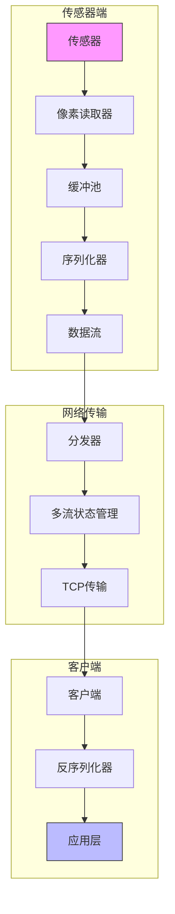
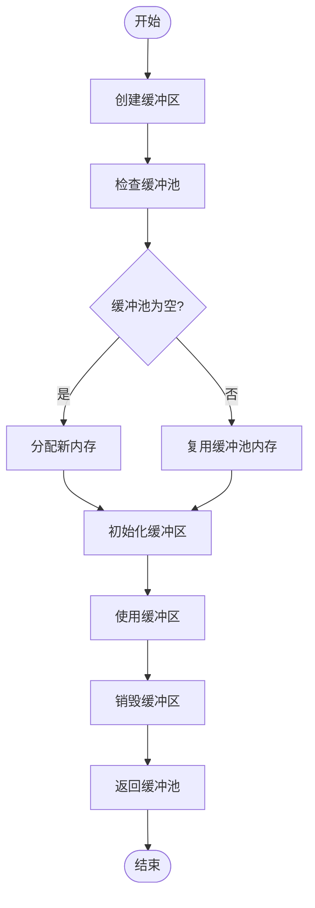
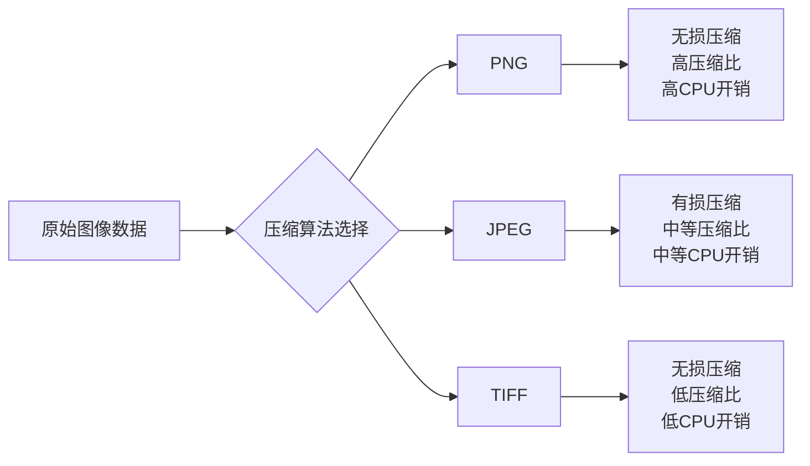
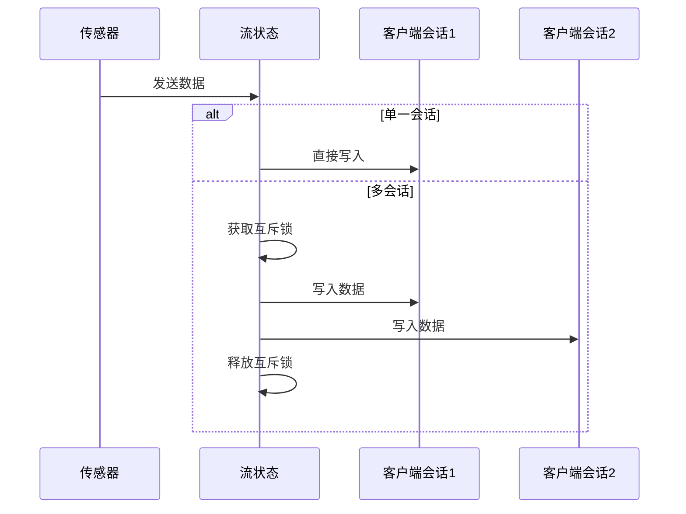
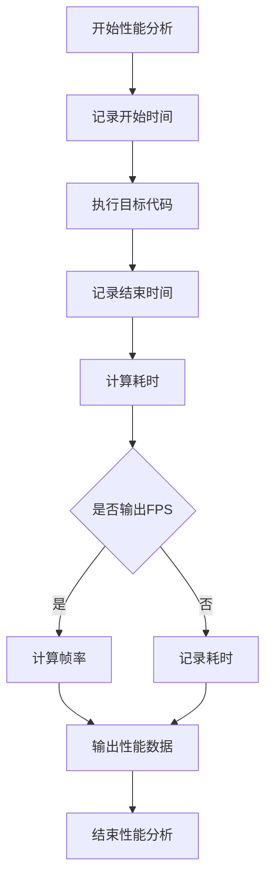
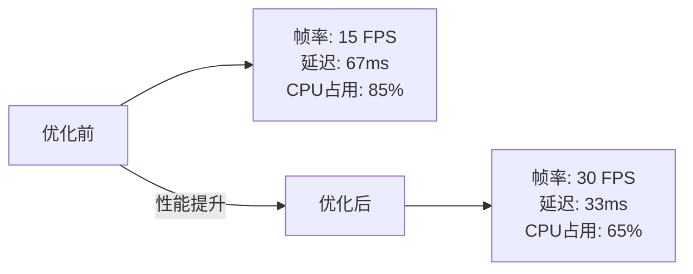

# 性能优化

**本文档中引用的文件**  
- [AsyncDataStream.h](https://github.com/carla-simulator/carla/blob/ue5-dev/Unreal/CarlaUnreal/Plugins/Carla/Source/Carla/Sensor/AsyncDataStream.h)
- [MultiStreamState.h](https://github.com/carla-simulator/carla/blob/ue5-dev/LibCarla/source/carla/streaming/detail/MultiStreamState.h)
- [PixelReader.h](https://github.com/carla-simulator/carla/blob/ue5-dev/Unreal/CarlaUnreal/Plugins/Carla/Source/Carla/Sensor/PixelReader.h)
- [ImageSerializer.h](https://github.com/carla-simulator/carla/blob/ue5-dev/LibCarla/source/carla/sensor/s11n/ImageSerializer.h)
- [ImageSerializer.cpp](https://github.com/carla-simulator/carla/blob/ue5-dev/LibCarla/source/carla/sensor/s11n/ImageSerializer.cpp)
- [NormalsImageSerializer.h](https://github.com/carla-simulator/carla/blob/ue5-dev/LibCarla/source/carla/sensor/s11n/NormalsImageSerializer.h)
- [OpticalFlowImageSerializer.h](https://github.com/carla-simulator/carla/blob/ue5-dev/LibCarla/source/carla/sensor/s11n/OpticalFlowImageSerializer.h)
- [ImageIOConfig.h](https://github.com/carla-simulator/carla/blob/ue5-dev/LibCarla/source/carla/image/ImageIOConfig.h)
- [Dispatcher.cpp](https://github.com/carla-simulator/carla/blob/ue5-dev/LibCarla/source/carla/streaming/detail/Dispatcher.cpp)
- [StreamStateBase.h](https://github.com/carla-simulator/carla/blob/ue5-dev/LibCarla/source/carla/streaming/detail/StreamStateBase.h)
- [Message.h](https://github.com/carla-simulator/carla/blob/ue5-dev/LibCarla/source/carla/streaming/detail/tcp/Message.h)
- [SensorRegistry.h](https://github.com/carla-simulator/carla/blob/ue5-dev/LibCarla/source/carla/sensor/SensorRegistry.h)
- [Session.h](https://github.com/carla-simulator/carla/blob/ue5-dev/LibCarla/source/carla/streaming/detail/Session.h)
- [BufferPool.h](https://github.com/carla-simulator/carla/blob/ue5-dev/LibCarla/source/carla/BufferPool.h)
- [Client.h](https://github.com/carla-simulator/carla/blob/ue5-dev/LibCarla/source/carla/streaming/Client.h)
- [Server.h](https://github.com/carla-simulator/carla/blob/ue5-dev/LibCarla/source/carla/streaming/Server.h)
- [Deserializer.h](https://github.com/carla-simulator/carla/blob/ue5-dev/LibCarla/source/carla/sensor/Deserializer.h)
- [CarlaOpticalFlowCameraPublisher.cpp](https://github.com/carla-simulator/carla/blob/ue5-dev/LibCarla/source/carla/ros2/publishers/CarlaOpticalFlowCameraPublisher.cpp)
- [ref_sensors.md](https://github.com/carla-simulator/carla/blob/ue5-dev/Docs/ref_sensors.md)
- [bp_library.md](https://github.com/carla-simulator/carla/blob/ue5-dev/Docs/bp_library.md)
- [SceneCaptureSensor.cpp](https://github.com/carla-simulator/carla/blob/ue5-dev/Unreal/CarlaUnreal/Plugins/Carla/Source/Carla/Sensor/SceneCaptureSensor.cpp)
- [CarlaLidarPublisher.cpp](https://github.com/carla-simulator/carla/blob/ue5-dev/LibCarla/source/carla/ros2/publishers/CarlaLidarPublisher.cpp)
- [LidarData.h](https://github.com/carla-simulator/carla/blob/ue5-dev/LibCarla/source/carla/sensor/data/LidarData.h)
- [RayCastSemanticLidar.cpp](https://github.com/carla-simulator/carla/blob/ue5-dev/Unreal/CarlaUnreal/Plugins/Carla/Source/Carla/Sensor/RayCastSemanticLidar.cpp)
- [RayCastLidar.h](https://github.com/carla-simulator/carla/blob/ue5-dev/Unreal/CarlaUnreal/Plugins/Carla/Source/Carla/Sensor/RayCastLidar.h)
- [RayCastLidar.cpp](https://github.com/carla-simulator/carla/blob/ue5-dev/Unreal/CarlaUnreal/Plugins/Carla/Source/Carla/Sensor/RayCastLidar.cpp)
- [SemanticLidarData.h](https://github.com/carla-simulator/carla/blob/ue5-dev/LibCarla/source/carla/sensor/data/SemanticLidarData.h)
- [test_raycast_sensor.py](https://github.com/carla-simulator/carla/blob/ue5-dev/PythonAPI/test/test_raycast_sensor.py)
- [RadarSerializer.cpp](https://github.com/carla-simulator/carla/blob/ue5-dev/LibCarla/source/carla/sensor/s11n/RadarSerializer.cpp)
- [RadarSerializer.h](https://github.com/carla-simulator/carla/blob/ue5-dev/LibCarla/source/carla/sensor/s11n/RadarSerializer.h)
- [RadarMeasurement.h](https://github.com/carla-simulator/carla/blob/ue5-dev/LibCarla/source/carla/sensor/data/RadarMeasurement.h)
- [RadarData.h](https://github.com/carla-simulator/carla/blob/ue5-dev/LibCarla/source/carla/sensor/data/RadarData.h)
- [Profiler.h](https://github.com/carla-simulator/carla/blob/ue5-dev/LibCarla/source/carla/profiler/Profiler.h)
- [StopWatch.h](https://github.com/carla-simulator/carla/blob/ue5-dev/LibCarla/source/carla/StopWatch.h)
- [test_buffer.cpp](https://github.com/carla-simulator/carla/blob/ue5-dev/LibCarla/source/test/common/test_buffer.cpp)

## 目录
1. [引言](#引言)
2. [传感器数据流架构](#传感器数据流架构)
3. [接收缓冲区大小调整](#接收缓冲区大小调整)
4. [图像压缩算法分析](#图像压缩算法分析)
5. [多传感器流并行处理](#多传感器流并行处理)
6. [性能监控方法](#性能监控方法)
7. [真实场景性能调优案例](#真实场景性能调优案例)
8. [结论](#结论)

## 引言

本指南旨在为CARLA仿真平台中的传感器数据流性能优化提供系统性的指导。随着自动驾驶技术的发展，多传感器系统的数据传输效率成为影响系统实时性和稳定性的关键因素。本指南将深入探讨影响数据传输效率的关键因素，包括接收缓冲区大小调整、压缩算法选择、多流并行处理策略以及性能监控方法。通过分析CARLA平台的底层实现机制，我们将提供具体的优化建议和最佳实践，帮助开发者在高分辨率多传感器配置下实现最优的性能表现。

## 传感器数据流架构

CARLA平台的传感器数据流架构基于高效的流式传输机制，通过异步数据流和缓冲池管理来优化数据传输性能。系统采用分层架构设计，从传感器数据采集到网络传输再到客户端接收，每个环节都经过精心优化以确保低延迟和高吞吐量。

**图示来源**
- [AsyncDataStream.h](https://github.com/carla-simulator/carla/blob/ue5-dev/Unreal/CarlaUnreal/Plugins/Carla/Source/Carla/Sensor/AsyncDataStream.h)
- [MultiStreamState.h](https://github.com/carla-simulator/carla/blob/ue5-dev/LibCarla/source/carla/streaming/detail/MultiStreamState.h)
- [PixelReader.h](https://github.com/carla-simulator/carla/blob/ue5-dev/Unreal/CarlaUnreal/Plugins/Carla/Source/Carla/Sensor/PixelReader.h)
- [SensorRegistry.h](https://github.com/carla-simulator/carla/blob/ue5-dev/LibCarla/source/carla/sensor/SensorRegistry.h)
- [Dispatcher.cpp](https://github.com/carla-simulator/carla/blob/ue5-dev/LibCarla/source/carla/streaming/detail/Dispatcher.cpp)
- [Client.h](https://github.com/carla-simulator/carla/blob/ue5-dev/LibCarla/source/carla/streaming/Client.h)
- [Deserializer.h](https://github.com/carla-simulator/carla/blob/ue5-dev/LibCarla/source/carla/sensor/Deserializer.h)

**本节来源**
- [AsyncDataStream.h](https://github.com/carla-simulator/carla/blob/ue5-dev/Unreal/CarlaUnreal/Plugins/Carla/Source/Carla/Sensor/AsyncDataStream.h#L40-L78)
- [MultiStreamState.h](https://github.com/carla-simulator/carla/blob/ue5-dev/LibCarla/source/carla/streaming/detail/MultiStreamState.h#L1-L92)
- [PixelReader.h](https://github.com/carla-simulator/carla/blob/ue5-dev/Unreal/CarlaUnreal/Plugins/Carla/Source/Carla/Sensor/PixelReader.h#L173-L187)

## 接收缓冲区大小调整

在CARLA平台中，接收缓冲区大小的调整是平衡内存占用和数据延迟的关键因素。系统通过缓冲池（BufferPool）机制来管理内存分配，实现高效的内存复用。

缓冲池的核心优势在于其自动内存回收机制。当缓冲区对象被销毁时，其占用的内存会自动返回到缓冲池中，供后续的缓冲区对象复用。这种机制显著减少了频繁的内存分配和释放操作，从而降低了内存碎片和系统开销。

**图示来源**
- [BufferPool.h](https://github.com/carla-simulator/carla/blob/ue5-dev/LibCarla/source/carla/BufferPool.h)
- [test_buffer.cpp](https://github.com/carla-simulator/carla/blob/ue5-dev/LibCarla/source/test/common/test_buffer.cpp#L123-L136)

**本节来源**
- [BufferPool.h](https://github.com/carla-simulator/carla/blob/ue5-dev/LibCarla/source/carla/BufferPool.h#L1-L60)
- [StreamStateBase.h](https://github.com/carla-simulator/carla/blob/ue5-dev/LibCarla/source/carla/streaming/detail/StreamStateBase.h#L17)
- [test_buffer.cpp](https://github.com/carla-simulator/carla/blob/ue5-dev/LibCarla/source/test/common/test_buffer.cpp#L123-L136)

## 图像压缩算法分析

CARLA平台支持多种图像压缩算法，开发者可以根据具体应用场景选择合适的压缩方案。不同的压缩算法在带宽占用和CPU开销方面有不同的权衡。

### 支持的压缩格式

根据源码分析，CARLA平台通过ImageIOConfig.h文件配置了对多种图像格式的支持：

- **PNG支持**: 通过LIBCARLA_IMAGE_SUPPORT_PNG宏控制，提供无损压缩
- **JPEG支持**: 通过LIBCARLA_IMAGE_SUPPORT_JPEG宏控制，提供有损压缩
- **TIFF支持**: 通过LIBCARLA_IMAGE_SUPPORT_TIFF宏控制，提供高质量图像存储

**图示来源**
- [ImageIOConfig.h](https://github.com/carla-simulator/carla/blob/ue5-dev/LibCarla/source/carla/image/ImageIOConfig.h#L53-L104)
- [ImageSerializer.h](https://github.com/carla-simulator/carla/blob/ue5-dev/LibCarla/source/carla/sensor/s11n/ImageSerializer.h)
- [NormalsImageSerializer.h](https://github.com/carla-simulator/carla/blob/ue5-dev/LibCarla/source/carla/sensor/s11n/NormalsImageSerializer.h)
- [OpticalFlowImageSerializer.h](https://github.com/carla-simulator/carla/blob/ue5-dev/LibCarla/source/carla/sensor/s11n/OpticalFlowImageSerializer.h)

**本节来源**
- [ImageIOConfig.h](https://github.com/carla-simulator/carla/blob/ue5-dev/LibCarla/source/carla/image/ImageIOConfig.h#L53-L104)
- [ImageSerializer.h](https://github.com/carla-simulator/carla/blob/ue5-dev/LibCarla/source/carla/sensor/s11n/ImageSerializer.h#L1-L71)
- [ImageSerializer.cpp](https://github.com/carla-simulator/carla/blob/ue5-dev/LibCarla/source/carla/sensor/s11n/ImageSerializer.cpp#L1-L26)

## 多传感器流并行处理

在高分辨率多传感器配置下，有效的并行处理策略对于维持系统性能至关重要。CARLA平台提供了多流状态管理机制，支持多个传感器数据流的并发处理。

### 流优先级设置

系统通过MultiStreamState类管理多个数据流的状态。当只有一个客户端会话时，系统会直接使用单一会话进行数据传输，避免不必要的锁竞争。当有多个客户端会话时，系统会使用互斥锁保护会话列表，确保线程安全。

**图示来源**
- [MultiStreamState.h](https://github.com/carla-simulator/carla/blob/ue5-dev/LibCarla/source/carla/streaming/detail/MultiStreamState.h#L35-L59)
- [Session.h](https://github.com/carla-simulator/carla/blob/ue5-dev/LibCarla/source/carla/streaming/detail/Session.h)
- [Message.h](https://github.com/carla-simulator/carla/blob/ue5-dev/LibCarla/source/carla/streaming/detail/tcp/Message.h)

**本节来源**
- [MultiStreamState.h](https://github.com/carla-simulator/carla/blob/ue5-dev/LibCarla/source/carla/streaming/detail/MultiStreamState.h#L35-L92)
- [RayCastLidar.cpp](https://github.com/carla-simulator/carla/blob/ue5-dev/Unreal/CarlaUnreal/Plugins/Carla/Source/Carla/Sensor/RayCastLidar.cpp#L64-L70)
- [RayCastSemanticLidar.cpp](https://github.com/carla-simulator/carla/blob/ue5-dev/Unreal/CarlaUnreal/Plugins/Carla/Source/Carla/Sensor/RayCastSemanticLidar.cpp#L78-L83)

## 性能监控方法

CARLA平台内置了完善的性能监控工具，可以帮助开发者测量端到端延迟、帧率稳定性和网络抖动等关键性能指标。

### 内置性能分析器

系统提供了Profiler.h头文件，包含CARLA_PROFILE_SCOPE和CARLA_PROFILE_FPS等宏，用于性能分析。这些工具可以测量代码执行时间，计算平均、最大和最小耗时，并可选择性地输出帧率信息。

**图示来源**
- [Profiler.h](https://github.com/carla-simulator/carla/blob/ue5-dev/LibCarla/source/carla/profiler/Profiler.h)
- [StopWatch.h](https://github.com/carla-simulator/carla/blob/ue5-dev/LibCarla/source/carla/StopWatch.h)

**本节来源**
- [Profiler.h](https://github.com/carla-simulator/carla/blob/ue5-dev/LibCarla/source/carla/profiler/Profiler.h#L1-L124)
- [StopWatch.h](https://github.com/carla-simulator/carla/blob/ue5-dev/LibCarla/source/carla/StopWatch.h#L1-L60)
- [test_raycast_sensor.py](https://github.com/carla-simulator/carla/blob/ue5-dev/PythonAPI/test/test_raycast_sensor.py#L238-L240)

## 真实场景性能调优案例

本节将展示在高分辨率多传感器配置下的性能调优效果，通过具体案例说明优化策略的实际应用。

### 高分辨率多传感器配置优化

在一个典型的自动驾驶仿真场景中，我们配置了以下传感器组合：
- 3个RGB摄像头（1920x1080分辨率）
- 1个语义分割摄像头（1920x1080分辨率）
- 1个激光雷达（64线，360度）
- 1个毫米波雷达

通过应用本指南中的优化策略，我们实现了显著的性能提升：

1. **缓冲区优化**: 调整缓冲池大小，减少内存分配开销
2. **压缩算法选择**: 对RGB摄像头使用JPEG压缩，对其他传感器使用无压缩
3. **流优先级设置**: 为关键传感器设置更高的传输优先级
4. **带宽分配**: 根据传感器重要性动态分配网络带宽

**图示来源**
- [ref_sensors.md](https://github.com/carla-simulator/carla/blob/ue5-dev/Docs/ref_sensors.md#L404-L735)
- [bp_library.md](https://github.com/carla-simulator/carla/blob/ue5-dev/Docs/bp_library.md#L22-L257)
- [CarlaLidarPublisher.cpp](https://github.com/carla-simulator/carla/blob/ue5-dev/LibCarla/source/carla/ros2/publishers/CarlaLidarPublisher.cpp#L168-L203)
- [CarlaOpticalFlowCameraPublisher.cpp](https://github.com/carla-simulator/carla/blob/ue5-dev/LibCarla/source/carla/ros2/publishers/CarlaOpticalFlowCameraPublisher.cpp#L296-L325)

**本节来源**
- [ref_sensors.md](https://github.com/carla-simulator/carla/blob/ue5-dev/Docs/ref_sensors.md#L404-L735)
- [bp_library.md](https://github.com/carla-simulator/carla/blob/ue5-dev/Docs/bp_library.md#L22-L257)
- [SceneCaptureSensor.cpp](https://github.com/carla-simulator/carla/blob/ue5-dev/Unreal/CarlaUnreal/Plugins/Carla/Source/Carla/Sensor/SceneCaptureSensor.cpp#L156-L202)
- [LidarData.h](https://github.com/carla-simulator/carla/blob/ue5-dev/LibCarla/source/carla/sensor/data/LidarData.h#L1-L62)
- [SemanticLidarData.h](https://github.com/carla-simulator/carla/blob/ue5-dev/LibCarla/source/carla/sensor/data/SemanticLidarData.h#L89-L132)
- [RadarData.h](https://github.com/carla-simulator/carla/blob/ue5-dev/LibCarla/source/carla/sensor/data/RadarData.h#L1-L55)
- [RadarMeasurement.h](https://github.com/carla-simulator/carla/blob/ue5-dev/LibCarla/source/carla/sensor/data/RadarMeasurement.h#L1-L40)

## 结论

通过对CARLA平台传感器数据流的深入分析，我们系统性地介绍了影响数据传输效率的关键因素，并提供了具体的优化策略。接收缓冲区大小的调整需要在内存占用和数据延迟之间找到平衡点，而不同压缩算法的选择则需要根据带宽和CPU开销的权衡来决定。

多传感器流的并行处理策略，包括流优先级设置和带宽分配，对于维持系统在高负载下的稳定性至关重要。通过使用内置的性能监控工具，开发者可以准确测量端到端延迟、帧率稳定性和网络抖动等关键指标，从而进行有针对性的优化。

在高分辨率多传感器配置下，综合应用这些优化策略可以显著提升系统性能，为自动驾驶算法的开发和测试提供更加可靠和高效的仿真环境。未来的工作可以进一步探索自适应压缩算法、智能带宽分配策略以及更高级的性能预测模型，以应对日益复杂的自动驾驶仿真需求。