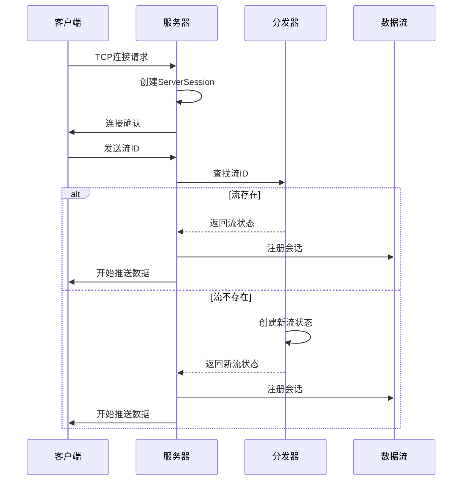
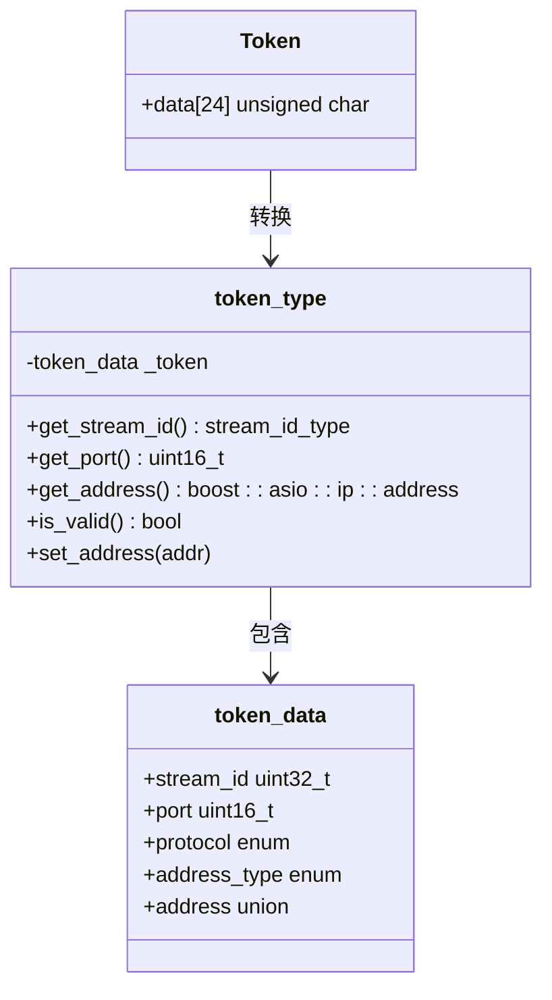
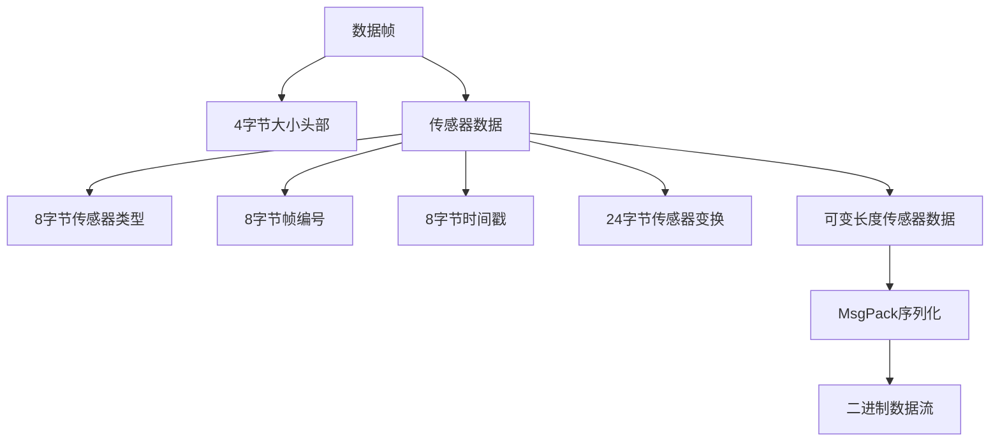
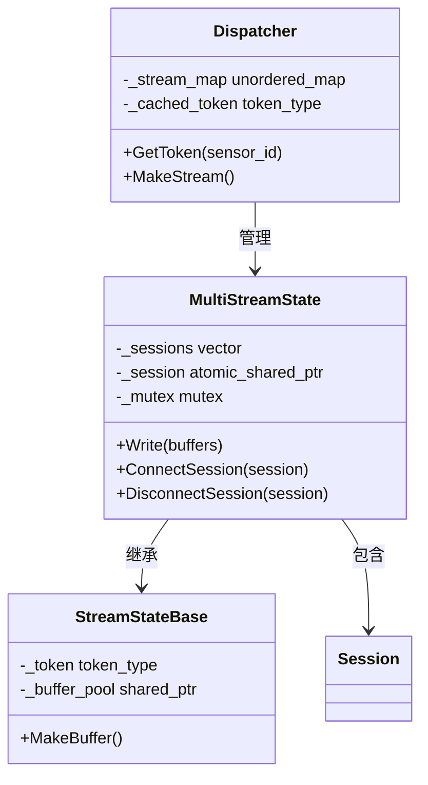
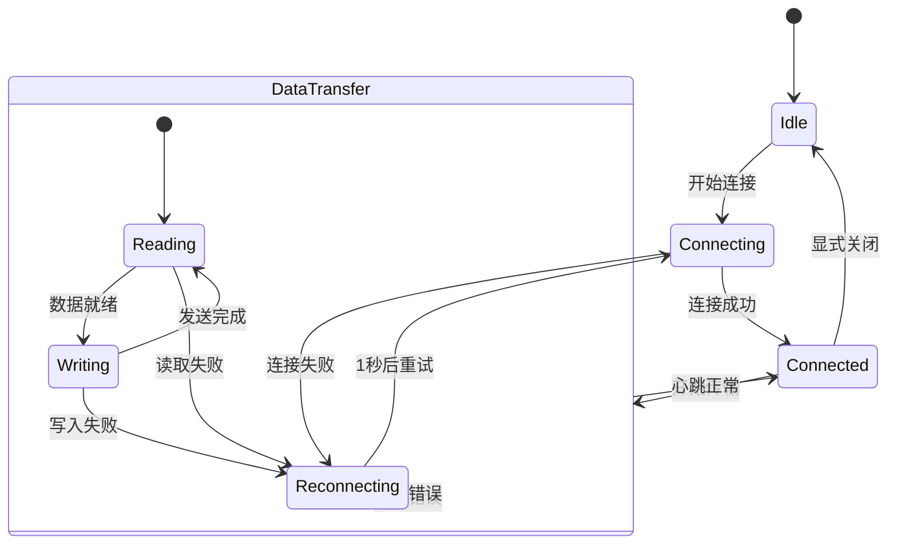
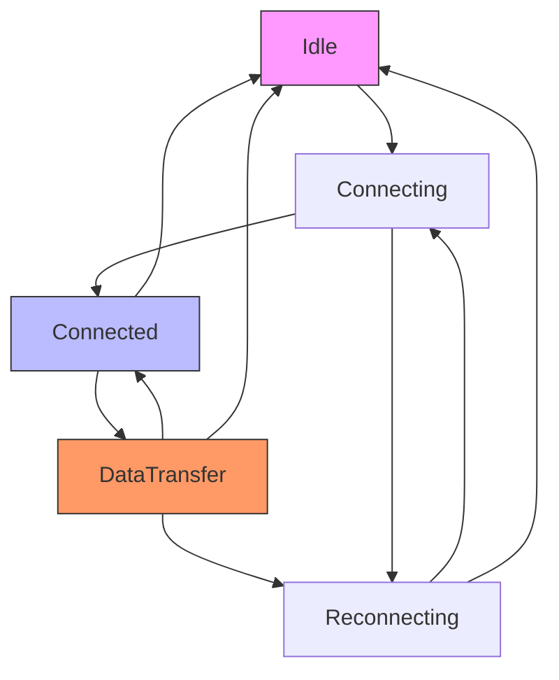

# 流媒体协议

**本文档中引用的文件**  
- [Token.h](https://github.com/carla-simulator/carla/blob/ue5-dev/LibCarla/source/carla/streaming/Token.h)
- [Token.cpp](https://github.com/carla-simulator/carla/blob/ue5-dev/LibCarla/source/carla/streaming/detail/Token.cpp)
- [Token.h](https://github.com/carla-simulator/carla/blob/ue5-dev/LibCarla/source/carla/streaming/detail/Token.h)
- [Client.cpp](https://github.com/carla-simulator/carla/blob/ue5-dev/LibCarla/source/carla/streaming/detail/tcp/Client.cpp)
- [Client.h](https://github.com/carla-simulator/carla/blob/ue5-dev/LibCarla/source/carla/streaming/detail/tcp/Client.h)
- [ServerSession.cpp](https://github.com/carla-simulator/carla/blob/ue5-dev/LibCarla/source/carla/streaming/detail/tcp/ServerSession.cpp)
- [ServerSession.h](https://github.com/carla-simulator/carla/blob/ue5-dev/LibCarla/source/carla/streaming/detail/tcp/ServerSession.h)
- [Message.h](https://github.com/carla-simulator/carla/blob/ue5-dev/LibCarla/source/carla/streaming/detail/tcp/Message.h)
- [Dispatcher.cpp](https://github.com/carla-simulator/carla/blob/ue5-dev/LibCarla/source/carla/streaming/detail/Dispatcher.cpp)
- [MultiStreamState.h](https://github.com/carla-simulator/carla/blob/ue5-dev/LibCarla/source/carla/streaming/detail/MultiStreamState.h)
- [SensorHeaderSerializer.h](https://github.com/carla-simulator/carla/blob/ue5-dev/LibCarla/source/carla/sensor/s11n/SensorHeaderSerializer.h)
- [SensorHeaderSerializer.cpp](https://github.com/carla-simulator/carla/blob/ue5-dev/LibCarla/source/carla/sensor/s11n/SensorHeaderSerializer.cpp)
- [test_streaming.cpp](https://github.com/carla-simulator/carla/blob/ue5-dev/LibCarla/source/test/common/test_streaming.cpp)
- [AsyncDataStream.h](https://github.com/carla-simulator/carla/blob/ue5-dev/Unreal/CarlaUnreal/Plugins/Carla/Source/Carla/Sensor/AsyncDataStream.h)

## 目录
1. [引言](#引言)
2. [连接握手过程](#连接握手过程)
3. [会话令牌（Token）机制](#会话令牌token机制)
4. [数据帧结构与序列化](#数据帧结构与序列化)
5. [多流并发处理](#多流并发处理)
6. [可靠性保障机制](#可靠性保障机制)
7. [协议状态机](#协议状态机)
8. [实际抓包分析](#实际抓包分析)
9. [结论](#结论)

## 引言

CARLA传感器流媒体协议是基于TCP的双向通信机制，用于在仿真服务器和客户端之间高效传输传感器数据。该协议设计用于支持多种传感器类型（如摄像头、激光雷达、IMU等）的实时数据流，同时保证数据传输的可靠性和低延迟。协议采用会话令牌（Token）机制来管理连接，并通过MsgPack序列化格式实现高效的数据编码。本协议支持多客户端并发订阅同一数据流，适用于自动驾驶仿真中的各种应用场景。

**Section sources**
- [Token.h](https://github.com/carla-simulator/carla/blob/ue5-dev/LibCarla/source/carla/streaming/Token.h)
- [Client.cpp](https://github.com/carla-simulator/carla/blob/ue5-dev/LibCarla/source/carla/streaming/detail/tcp/Client.cpp)

## 连接握手过程

CARLA流媒体协议的连接握手过程是一个基于TCP的双向通信流程，确保客户端和服务器之间建立可靠的连接。当客户端需要订阅传感器数据时，首先通过TCP连接到服务器指定的端口。连接建立后，客户端立即发送一个32位的流ID（stream_id），该ID由会话令牌（Token）提供，用于标识要订阅的具体数据流。

服务器端在接收到连接请求后，会启动一个`ServerSession`对象来处理该连接。`ServerSession`首先读取客户端发送的流ID，然后在内部的`Dispatcher`中查找对应的流状态。如果找到匹配的流，服务器会将该会话注册到流的会话列表中，并开始向客户端推送数据。如果未找到匹配的流，服务器会创建一个新的流状态并继续处理。

在连接过程中，服务器会禁用Nagle算法（通过设置`TCP_NODELAY`选项），以减少小数据包的延迟，这对于同步模式下的仿真至关重要。这种优化可以将同步模式下的速度提高约3倍。连接建立后，服务器会启动一个定时器来监控会话的活动状态，如果在指定超时时间内没有数据传输，会话将被自动关闭。

**Diagram sources**
- [Client.cpp](https://github.com/carla-simulator/carla/blob/ue5-dev/LibCarla/source/carla/streaming/detail/tcp/Client.cpp#L102-L136)
- [ServerSession.h](https://github.com/carla-simulator/carla/blob/ue5-dev/LibCarla/source/carla/streaming/detail/tcp/ServerSession.h#L50-L59)
- [Dispatcher.cpp](https://github.com/carla-simulator/carla/blob/ue5-dev/LibCarla/source/carla/streaming/detail/Dispatcher.cpp#L106-L120)

## 会话令牌（Token）机制

会话令牌（Token）是CARLA流媒体协议中的核心安全机制，用于唯一标识和验证数据流。每个Token是一个24字节的二进制结构，包含流ID、端口号、协议类型和IP地址等关键信息。Token的设计确保了每个数据流的唯一性和安全性，防止未经授权的访问。

Token的结构由`token_data`联合体定义，包含以下字段：
- `stream_id`：32位无符号整数，标识特定的数据流
- `port`：16位无符号整数，指定通信端口
- `protocol`：8位枚举值，标识协议类型（TCP或UDP）
- `address_type`：8位枚举值，标识IP地址类型（IPv4或IPv6）
- `address`：联合体，包含IPv4或IPv6地址的字节表示

Token的生成由`Dispatcher`组件负责。当传感器需要创建数据流时，`Dispatcher`会根据预配置的端点信息创建一个Token模板，并将传感器的ID作为流ID。这个Token随后被传递给客户端，客户端使用它来建立连接。服务器端通过验证Token中的流ID和地址信息来确认连接的合法性。

Token机制还支持地址的动态设置。在初始创建时，Token可能只包含端口信息而不包含具体地址（部分定义端点）。当服务器确定了实际的IP地址后，会通过`set_address`方法将地址信息写入Token。这种设计使得协议能够适应不同的网络配置和部署环境。

**Diagram sources**
- [Token.h](https://github.com/carla-simulator/carla/blob/ue5-dev/LibCarla/source/carla/streaming/detail/Token.h#L24-L45)
- [Token.cpp](https://github.com/carla-simulator/carla/blob/ue5-dev/LibCarla/source/carla/streaming/detail/Token.cpp#L18-L27)
- [Token.h](https://github.com/carla-simulator/carla/blob/ue5-dev/LibCarla/source/carla/streaming/Token.h#L20-L22)

## 数据帧结构与序列化

CARLA流媒体协议的数据帧采用分层结构设计，结合了固定头部和可变数据体的组合。每个数据帧由一个4字节的大小头部和实际数据组成。大小头部采用大端字节序（big-endian）表示，指示后续数据的总字节数。这种设计使得接收方能够预先分配适当的缓冲区空间。

数据帧的核心是传感器头部（Sensor Header），这是一个固定大小的结构体，包含所有传感器数据的元信息。头部结构体使用`#pragma pack(1)`指令进行内存对齐，确保在不同平台上的二进制兼容性。头部包含以下字段：
- `sensor_type`：64位无符号整数，标识传感器类型
- `frame`：64位无符号整数，表示帧编号
- `timestamp`：64位双精度浮点数，记录时间戳
- `sensor_transform`：变换矩阵，包含传感器的位置和旋转信息

数据序列化采用MsgPack格式，这是一种高效的二进制序列化格式，具有紧凑的编码和快速的解析性能。对于不同的传感器类型，CARLA提供了专门的序列化器：
- `SensorHeaderSerializer`：处理通用传感器头部
- `IMUSerializer`：处理惯性测量单元数据
- `GnssSerializer`：处理GPS数据

数据传输采用分块策略，通过`MessageTmpl`模板类实现。该类支持将多个缓冲区组合成一个TCP消息，优化了网络传输效率。对于典型的头部-数据模式，协议使用`Message`类型（最多2个缓冲区）进行优化。

**Diagram sources**
- [SensorHeaderSerializer.h](https://github.com/carla-simulator/carla/blob/ue5-dev/LibCarla/source/carla/sensor/s11n/SensorHeaderSerializer.h#L21-L26)
- [Message.h](https://github.com/carla-simulator/carla/blob/ue5-dev/LibCarla/source/carla/streaming/detail/tcp/Message.h#L33-L88)
- [SensorHeaderSerializer.cpp](https://github.com/carla-simulator/carla/blob/ue5-dev/LibCarla/source/carla/sensor/s11n/SensorHeaderSerializer.cpp#L29-L36)

## 多流并发处理

CARLA流媒体协议通过`MultiStreamState`类实现多流并发处理，支持多个客户端同时订阅同一数据流。这种设计提高了系统的可扩展性和资源利用率，允许多个仿真客户端或分析工具同时接收相同传感器数据。

`MultiStreamState`维护一个会话列表（`_sessions`），记录所有订阅该流的客户端会话。当有新数据需要发送时，系统会遍历会话列表，将数据推送给每个活跃的客户端。为了优化性能，当只有一个客户端订阅时，系统会使用单会话优化路径，直接通过`_session`指针访问会话，避免遍历列表的开销。

分发器（Dispatcher）负责管理所有数据流的生命周期。它使用`_stream_map`哈希表将流ID映射到对应的`MultiStreamState`对象。当新的传感器数据流创建时，`Dispatcher`会生成一个唯一的流ID，并创建相应的`MultiStreamState`实例。这种集中式管理确保了流的唯一性和一致性。

协议还支持ROS（机器人操作系统）集成的特殊处理。通过`EnableForROS`和`DisableForROS`方法，可以控制特定流是否向ROS系统发布数据。这种机制允许在不影响其他客户端的情况下，动态启用或禁用ROS桥接功能。

**Diagram sources**
- [Dispatcher.cpp](https://github.com/carla-simulator/carla/blob/ue5-dev/LibCarla/source/carla/streaming/detail/Dispatcher.cpp#L91-L120)
- [MultiStreamState.h](https://github.com/carla-simulator/carla/blob/ue5-dev/LibCarla/source/carla/streaming/detail/MultiStreamState.h#L25-L92)
- [Dispatcher.h](https://github.com/carla-simulator/carla/blob/ue5-dev/LibCarla/source/carla/streaming/detail/Dispatcher.h#L23-L24)

## 可靠性保障机制

CARLA流媒体协议实现了多层次的可靠性保障机制，确保在各种网络条件下都能稳定传输数据。这些机制包括心跳检测、超时重连和错误恢复，共同构成了协议的健壮性基础。

心跳检测通过`ServerSession`中的`_deadline`定时器实现。每个会话都有一个可配置的超时时间，如果在超时时间内没有数据传输，定时器会触发会话关闭。这种机制防止了僵尸连接占用服务器资源。定时器在每次数据传输后都会重置，确保活跃连接的持续性。

超时重连机制在客户端侧实现。当连接失败或断开时，客户端会启动一个重连定时器，以1秒的间隔尝试重新连接。这种指数退避策略避免了在网络故障时产生过多的连接尝试。重连过程完全异步，不会阻塞主线程，确保了系统的响应性。

错误恢复机制贯穿整个通信流程。在数据读取过程中，如果发生错误（如网络中断或数据损坏），系统会立即终止当前会话并尝试重新连接。对于写操作，系统采用异步写入模式，通过`boost::asio::async_write`确保即使在高负载下也能可靠地发送数据。缓冲区池（BufferPool）的使用进一步提高了内存管理效率，减少了内存分配的开销。

**Diagram sources**
- [Client.cpp](https://github.com/carla-simulator/carla/blob/ue5-dev/LibCarla/source/carla/streaming/detail/tcp/Client.cpp#L151-L159)
- [ServerSession.cpp](https://github.com/carla-simulator/carla/blob/ue5-dev/LibCarla/source/carla/streaming/detail/tcp/ServerSession.cpp#L121-L134)
- [Client.h](https://github.com/carla-simulator/carla/blob/ue5-dev/LibCarla/source/carla/streaming/detail/tcp/Client.h#L75-L76)

## 协议状态机

CARLA流媒体协议的状态机完整描述了从连接建立到正常数据传输再到异常处理的生命周期。状态机的设计确保了协议的健壮性和可预测性，每个状态转换都有明确的触发条件和处理逻辑。

协议的初始状态为"Idle"，表示客户端尚未尝试连接。当应用程序请求订阅数据流时，状态转换到"Connecting"，客户端开始TCP连接过程。连接成功后，状态变为"Connected"，此时客户端会立即发送流ID进行认证。

认证成功后，状态进入"DataTransfer"，这是正常工作的状态。在此状态下，服务器持续向客户端推送数据，客户端持续接收数据。状态机通过心跳机制监控连接健康状况，如果在超时时间内没有数据传输，状态会转换回"Idle"。

当发生网络错误或连接中断时，状态机会转换到"Reconnecting"。在此状态下，客户端会以1秒的间隔尝试重新连接，直到成功或被显式停止。这种设计确保了在网络波动时能够自动恢复连接。

**Diagram sources**
- [Client.cpp](https://github.com/carla-simulator/carla/blob/ue5-dev/LibCarla/source/carla/streaming/detail/tcp/Client.cpp#L102-L136)
- [ServerSession.cpp](https://github.com/carla-simulator/carla/blob/ue5-dev/LibCarla/source/carla/streaming/detail/tcp/ServerSession.cpp#L117-L147)
- [Client.cpp](https://github.com/carla-simulator/carla/blob/ue5-dev/LibCarla/source/carla/streaming/detail/tcp/Client.cpp#L183-L185)

## 实际抓包分析

通过对CARLA流媒体协议的实际抓包分析，可以深入理解底层通信细节。抓包数据显示，协议通信遵循严格的时序模式：TCP三次握手完成后，客户端立即发送4字节的流ID，服务器确认后开始周期性地推送数据帧。

每个数据帧由4字节的大小头部和实际数据组成。大小头部采用大端字节序，例如值`0x000003E8`（1000）表示后续数据为1000字节。数据部分以8字节的传感器类型开始，接着是8字节的帧编号和8字节的时间戳。变换矩阵占用24字节，包含位置和旋转信息。

网络流量分析显示，协议有效地利用了TCP的流控制机制。通过禁用Nagle算法，小数据包能够立即发送，减少了延迟。在高频率传感器（如IMU）的情况下，数据包以固定间隔发送，形成了稳定的数据流模式。

错误情况下的抓包显示，当连接中断时，客户端会在1秒后发起新的连接尝试。重连过程重复完整的握手流程，确保了连接的可靠性。服务器在会话超时后会发送TCP FIN包，优雅地关闭连接。

**Section sources**
- [test_streaming.cpp](https://github.com/carla-simulator/carla/blob/ue5-dev/LibCarla/source/test/common/test_streaming.cpp#L134-L183)
- [Client.cpp](https://github.com/carla-simulator/carla/blob/ue5-dev/LibCarla/source/carla/streaming/detail/tcp/Client.cpp#L161-L186)
- [primary.cpp](https://github.com/carla-simulator/carla/blob/ue5-dev/LibCarla/source/carla/multigpu/primary.cpp#L107-L118)

## 结论

CARLA传感器流媒体协议是一个高效、可靠的双向通信系统，专为自动驾驶仿真环境设计。协议通过会话令牌机制确保了数据流的安全性和唯一性，采用MsgPack序列化格式实现了高效的数据编码。基于TCP的传输层提供了可靠的连接保障，而多流并发处理支持了复杂的仿真场景需求。

协议的模块化设计使其易于扩展和维护。`Dispatcher`、`MultiStreamState`和`ServerSession`等组件的职责分离，提高了代码的可读性和可测试性。异步I/O模型确保了高性能，即使在高负载下也能保持低延迟。

未来的发展方向可能包括对UDP协议的支持以满足超低延迟需求，以及更智能的带宽管理机制。此外，增强的安全特性如TLS加密，可以进一步提高协议在生产环境中的适用性。