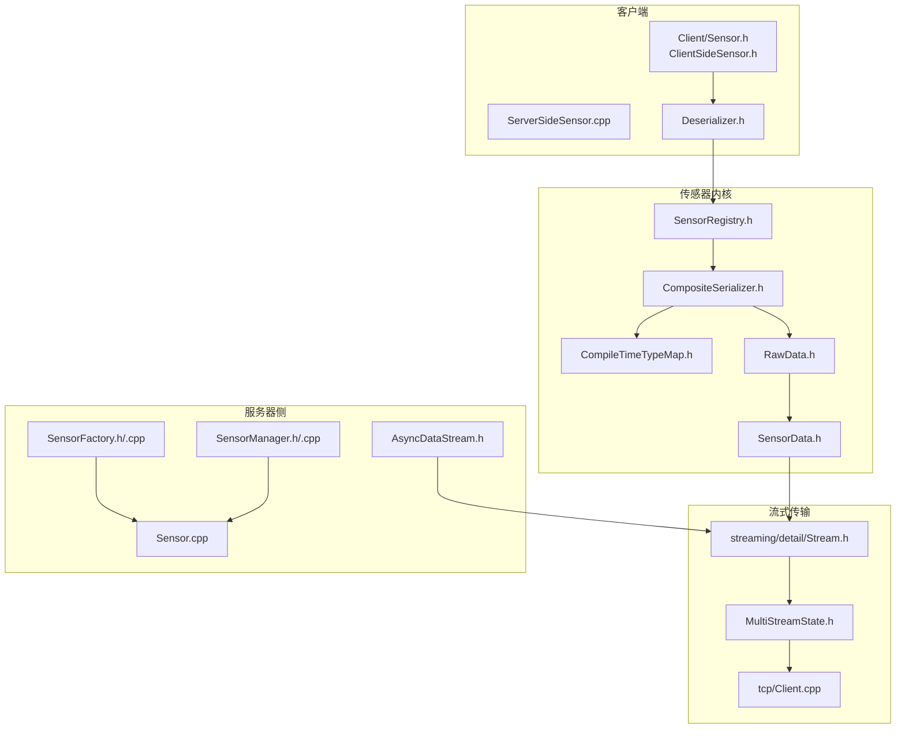
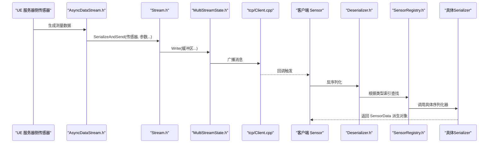
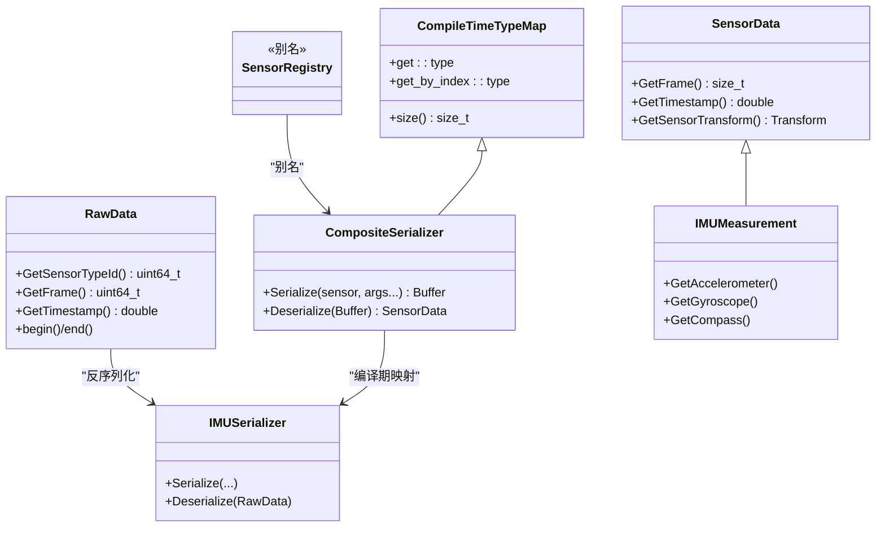
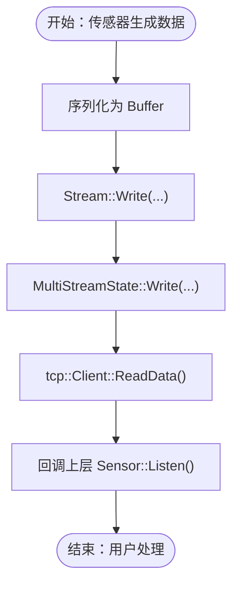
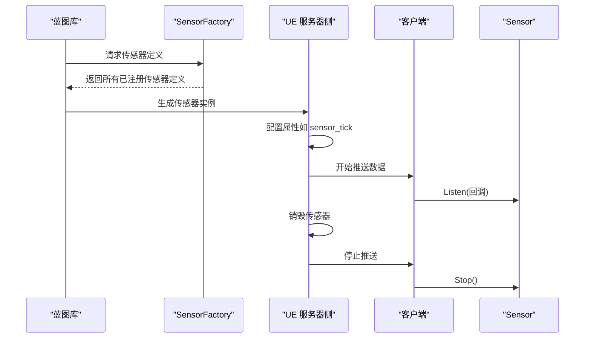
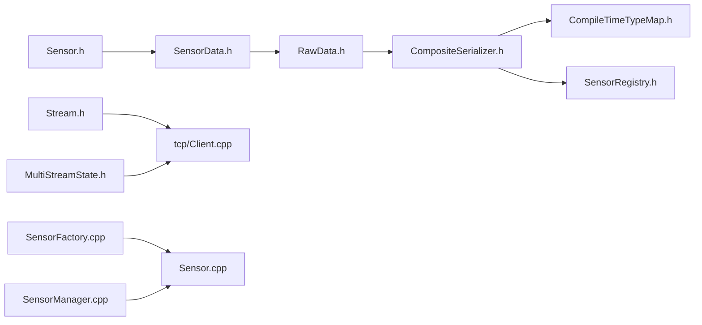

# 传感器架构概述

**本文引用的文件**
- [LibCarla/source/carla/client/Sensor.h](https://github.com/carla-simulator/carla/blob/ue5-dev/LibCarla/source/carla/client/Sensor.h)
- [LibCarla/source/carla/sensor/SensorRegistry.h](https://github.com/carla-simulator/carla/blob/ue5-dev/LibCarla/source/carla/sensor/SensorRegistry.h)
- [LibCarla/source/carla/sensor/SensorData.h](https://github.com/carla-simulator/carla/blob/ue5-dev/LibCarla/source/carla/sensor/SensorData.h)
- [LibCarla/source/carla/sensor/CompositeSerializer.h](https://github.com/carla-simulator/carla/blob/ue5-dev/LibCarla/source/carla/sensor/CompositeSerializer.h)
- [LibCarla/source/carla/sensor/CompileTimeTypeMap.h](https://github.com/carla-simulator/carla/blob/ue5-dev/LibCarla/source/carla/sensor/CompileTimeTypeMap.h)
- [LibCarla/source/carla/sensor/RawData.h](https://github.com/carla-simulator/carla/blob/ue5-dev/LibCarla/source/carla/sensor/RawData.h)
- [LibCarla/source/carla/sensor/Deserializer.h](https://github.com/carla-simulator/carla/blob/ue5-dev/LibCarla/source/carla/sensor/Deserializer.h)
- [LibCarla/source/carla/streaming/detail/Stream.h](https://github.com/carla-simulator/carla/blob/ue5-dev/LibCarla/source/carla/streaming/detail/Stream.h)
- [LibCarla/source/carla/streaming/detail/MultiStreamState.h](https://github.com/carla-simulator/carla/blob/ue5-dev/LibCarla/source/carla/streaming/detail/MultiStreamState.h)
- [LibCarla/source/carla/streaming/detail/tcp/Client.cpp](https://github.com/carla-simulator/carla/blob/ue5-dev/LibCarla/source/carla/streaming/detail/tcp/Client.cpp)
- [Unreal/CarlaUnreal/Plugins/Carla/Source/Carla/Sensor/SensorFactory.h](https://github.com/carla-simulator/carla/blob/ue5-dev/Unreal/CarlaUnreal/Plugins/Carla/Source/Carla/Sensor/SensorFactory.h)
- [Unreal/CarlaUnreal/Plugins/Carla/Source/Carla/Sensor/SensorFactory.cpp](https://github.com/carla-simulator/carla/blob/ue5-dev/Unreal/CarlaUnreal/Plugins/Carla/Source/Carla/Sensor/SensorFactory.cpp)
- [Unreal/CarlaUnreal/Plugins/Carla/Source/Carla/Sensor/SensorManager.h](https://github.com/carla-simulator/carla/blob/ue5-dev/Unreal/CarlaUnreal/Plugins/Carla/Source/Carla/Sensor/SensorManager.h)
- [Unreal/CarlaUnreal/Plugins/Carla/Source/Carla/Sensor/SensorManager.cpp](https://github.com/carla-simulator/carla/blob/ue5-dev/Unreal/CarlaUnreal/Plugins/Carla/Source/Carla/Sensor/SensorManager.cpp)
- [Unreal/CarlaUnreal/Plugins/Carla/Source/Carla/Sensor/Sensor.cpp](https://github.com/carla-simulator/carla/blob/ue5-dev/Unreal/CarlaUnreal/Plugins/Carla/Source/Carla/Sensor/Sensor.cpp)
- [Unreal/CarlaUnreal/Plugins/Carla/Source/Carla/Sensor/AsyncDataStream.h](https://github.com/carla-simulator/carla/blob/ue5-dev/Unreal/CarlaUnreal/Plugins/Carla/Source/Carla/Sensor/AsyncDataStream.h)
- [LibCarla/source/carla/client/ServerSideSensor.cpp](https://github.com/carla-simulator/carla/blob/ue5-dev/LibCarla/source/carla/client/ServerSideSensor.cpp)
- [LibCarla/source/carla/client/ClientSideSensor.h](https://github.com/carla-simulator/carla/blob/ue5-dev/LibCarla/source/carla/client/ClientSideSensor.h)
- [LibCarla/source/carla/sensor/s11n/IMUSerializer.h](https://github.com/carla-simulator/carla/blob/ue5-dev/LibCarla/source/carla/sensor/s11n/IMUSerializer.h)
- [LibCarla/source/carla/sensor/data/IMUMeasurement.h](https://github.com/carla-simulator/carla/blob/ue5-dev/LibCarla/source/carla/sensor/data/IMUMeasurement.h)
- [LibCarla/source/carla/sensor/s11n/GnssSerializer.h](https://github.com/carla-simulator/carla/blob/ue5-dev/LibCarla/source/carla/sensor/s11n/GnssSerializer.h)
- [LibCarla/source/carla/sensor/s11n/NoopSerializer.h](https://github.com/carla-simulator/carla/blob/ue5-dev/LibCarla/source/carla/sensor/s11n/NoopSerializer.h)

## 目录
1. [引言](#引言)
2. [项目结构](#项目结构)
3. [核心组件](#核心组件)
4. [架构总览](#架构总览)
5. [详细组件分析](#详细组件分析)
6. [依赖分析](#依赖分析)
7. [性能考量](#性能考量)
8. [故障排查指南](#故障排查指南)
9. [结论](#结论)
10. [附录](#附录)

## 引言
本文件系统性梳理 CARLA 传感器子系统的架构与实现，聚焦于 LibCarla 客户端侧 Sensor 基类与 SensorRegistry 注册中心的设计，解释传感器生命周期管理、数据发布机制与线程安全策略；深入解析 SensorRegistry 的编译期类型映射与模板特化，说明如何通过 CompositeSerializer 实现传感器类型到序列化器的动态绑定；阐述客户端-服务器架构下的传感器创建、配置与销毁流程；最后以 UML 类图展示 Sensor、SensorData、Serializer 和 DataStream 的交互，并总结内存池、零拷贝传输与异步处理等性能优化点，以及通过插件机制扩展传感器类型与版本兼容性的处理方式。

## 项目结构
传感器相关代码主要分布在以下位置：
- 客户端接口层：LibCarla/source/carla/client/Sensor.h、ServerSideSensor.cpp、ClientSideSensor.h
- 传感器数据与序列化：LibCarla/source/carla/sensor/SensorData.h、CompositeSerializer.h、RawData.h、Deserializer.h、s11n/* 序列化器
- 注册中心与类型映射：SensorRegistry.h、CompileTimeTypeMap.h
- 流式传输与多路复用：LibCarla/source/carla/streaming/detail/Stream.h、MultiStreamState.h、tcp/Client.cpp
- 服务器侧传感器工厂与管理：Unreal/CarlaUnreal/Plugins/Carla/Source/Carla/Sensor/SensorFactory.*、SensorManager.*

图表来源
- [LibCarla/source/carla/client/Sensor.h](https://github.com/carla-simulator/carla/blob/ue5-dev/LibCarla/source/carla/client/Sensor.h#L1-L36)
- [LibCarla/source/carla/client/ServerSideSensor.cpp](https://github.com/carla-simulator/carla/blob/ue5-dev/LibCarla/source/carla/client/ServerSideSensor.cpp#L83-L109)
- [LibCarla/source/carla/client/ClientSideSensor.h](https://github.com/carla-simulator/carla/blob/ue5-dev/LibCarla/source/carla/client/ClientSideSensor.h#L1-L21)
- [LibCarla/source/carla/sensor/SensorRegistry.h](https://github.com/carla-simulator/carla/blob/ue5-dev/LibCarla/source/carla/sensor/SensorRegistry.h#L57-L84)
- [LibCarla/source/carla/sensor/CompositeSerializer.h](https://github.com/carla-simulator/carla/blob/ue5-dev/LibCarla/source/carla/sensor/CompositeSerializer.h#L23-L95)
- [LibCarla/source/carla/sensor/CompileTimeTypeMap.h](https://github.com/carla-simulator/carla/blob/ue5-dev/LibCarla/source/carla/sensor/CompileTimeTypeMap.h#L1-L104)
- [LibCarla/source/carla/sensor/RawData.h](https://github.com/carla-simulator/carla/blob/ue5-dev/LibCarla/source/carla/sensor/RawData.h#L19-L101)
- [LibCarla/source/carla/sensor/SensorData.h](https://github.com/carla-simulator/carla/blob/ue5-dev/LibCarla/source/carla/sensor/SensorData.h#L19-L73)
- [LibCarla/source/carla/streaming/detail/Stream.h](https://github.com/carla-simulator/carla/blob/ue5-dev/LibCarla/source/carla/streaming/detail/Stream.h#L50-L84)
- [LibCarla/source/carla/streaming/detail/MultiStreamState.h](https://github.com/carla-simulator/carla/blob/ue5-dev/LibCarla/source/carla/streaming/detail/MultiStreamState.h#L48-L92)
- [LibCarla/source/carla/streaming/detail/tcp/Client.cpp](https://github.com/carla-simulator/carla/blob/ue5-dev/LibCarla/source/carla/streaming/detail/tcp/Client.cpp#L138-L186)
- [Unreal/CarlaUnreal/Plugins/Carla/Source/Carla/Sensor/SensorFactory.h](https://github.com/carla-simulator/carla/blob/ue5-dev/Unreal/CarlaUnreal/Plugins/Carla/Source/Carla/Sensor/SensorFactory.h#L1-L30)
- [Unreal/CarlaUnreal/Plugins/Carla/Source/Carla/Sensor/SensorFactory.cpp](https://github.com/carla-simulator/carla/blob/ue5-dev/Unreal/CarlaUnreal/Plugins/Carla/Source/Carla/Sensor/SensorFactory.cpp#L38-L83)
- [Unreal/CarlaUnreal/Plugins/Carla/Source/Carla/Sensor/SensorManager.h](https://github.com/carla-simulator/carla/blob/ue5-dev/Unreal/CarlaUnreal/Plugins/Carla/Source/Carla/Sensor/SensorManager.h#L1-L26)
- [Unreal/CarlaUnreal/Plugins/Carla/Source/Carla/Sensor/SensorManager.cpp](https://github.com/carla-simulator/carla/blob/ue5-dev/Unreal/CarlaUnreal/Plugins/Carla/Source/Carla/Sensor/SensorManager.cpp#L1-L27)
- [Unreal/CarlaUnreal/Plugins/Carla/Source/Carla/Sensor/AsyncDataStream.h](https://github.com/carla-simulator/carla/blob/ue5-dev/Unreal/CarlaUnreal/Plugins/Carla/Source/Carla/Sensor/AsyncDataStream.h#L40-L78)
- [Unreal/CarlaUnreal/Plugins/Carla/Source/Carla/Sensor/Sensor.cpp](https://github.com/carla-simulator/carla/blob/ue5-dev/Unreal/CarlaUnreal/Plugins/Carla/Source/Carla/Sensor/Sensor.cpp#L38-L96)

章节来源
- [LibCarla/source/carla/client/Sensor.h](https://github.com/carla-simulator/carla/blob/ue5-dev/LibCarla/source/carla/client/Sensor.h#L1-L36)
- [LibCarla/source/carla/sensor/SensorRegistry.h](https://github.com/carla-simulator/carla/blob/ue5-dev/LibCarla/source/carla/sensor/SensorRegistry.h#L57-L84)
- [LibCarla/source/carla/streaming/detail/Stream.h](https://github.com/carla-simulator/carla/blob/ue5-dev/LibCarla/source/carla/streaming/detail/Stream.h#L50-L84)

## 核心组件
- Sensor 基类（客户端）：定义回调监听、停止监听与状态查询的纯虚接口，作为所有传感器的统一抽象。
- SensorData：传感器测量结果的基类，封装帧号、时间戳、传感器位姿等元信息。
- SensorRegistry：编译期注册中心，通过模板特化将传感器类型与对应序列化器绑定，形成类型映射。
- CompositeSerializer：基于 CompileTimeTypeMap 的复合序列化器，提供运行时按类型选择具体序列化器的能力。
- RawData：对原始二进制数据的轻量包装，暴露传感器类型、帧号、时间戳、变换等头部信息。
- Deserializer：对外暴露的反序列化入口，内部委托 SensorRegistry 完成类型分发。
- 流式传输：Stream/ MultiStreamState/ tcp::Client 提供零拷贝写入、多会话广播与异步读取。

章节来源
- [LibCarla/source/carla/client/Sensor.h](https://github.com/carla-simulator/carla/blob/ue5-dev/LibCarla/source/carla/client/Sensor.h#L17-L33)
- [LibCarla/source/carla/sensor/SensorData.h](https://github.com/carla-simulator/carla/blob/ue5-dev/LibCarla/source/carla/sensor/SensorData.h#L19-L73)
- [LibCarla/source/carla/sensor/SensorRegistry.h](https://github.com/carla-simulator/carla/blob/ue5-dev/LibCarla/source/carla/sensor/SensorRegistry.h#L57-L84)
- [LibCarla/source/carla/sensor/CompositeSerializer.h](https://github.com/carla-simulator/carla/blob/ue5-dev/LibCarla/source/carla/sensor/CompositeSerializer.h#L23-L95)
- [LibCarla/source/carla/sensor/RawData.h](https://github.com/carla-simulator/carla/blob/ue5-dev/LibCarla/source/carla/sensor/RawData.h#L19-L101)
- [LibCarla/source/carla/sensor/Deserializer.h](https://github.com/carla-simulator/carla/blob/ue5-dev/LibCarla/source/carla/sensor/Deserializer.h#L17-L28)
- [LibCarla/source/carla/streaming/detail/Stream.h](https://github.com/carla-simulator/carla/blob/ue5-dev/LibCarla/source/carla/streaming/detail/Stream.h#L50-L84)

## 架构总览
下图展示了从传感器生成数据到客户端接收的完整链路，以及注册中心在其中的关键作用。

图表来源
- [Unreal/CarlaUnreal/Plugins/Carla/Source/Carla/Sensor/AsyncDataStream.h](https://github.com/carla-simulator/carla/blob/ue5-dev/Unreal/CarlaUnreal/Plugins/Carla/Source/Carla/Sensor/AsyncDataStream.h#L40-L78)
- [LibCarla/source/carla/streaming/detail/Stream.h](https://github.com/carla-simulator/carla/blob/ue5-dev/LibCarla/source/carla/streaming/detail/Stream.h#L50-L84)
- [LibCarla/source/carla/streaming/detail/MultiStreamState.h](https://github.com/carla-simulator/carla/blob/ue5-dev/LibCarla/source/carla/streaming/detail/MultiStreamState.h#L48-L92)
- [LibCarla/source/carla/streaming/detail/tcp/Client.cpp](https://github.com/carla-simulator/carla/blob/ue5-dev/LibCarla/source/carla/streaming/detail/tcp/Client.cpp#L138-L186)
- [LibCarla/source/carla/client/Sensor.h](https://github.com/carla-simulator/carla/blob/ue5-dev/LibCarla/source/carla/client/Sensor.h#L17-L33)
- [LibCarla/source/carla/sensor/Deserializer.h](https://github.com/carla-simulator/carla/blob/ue5-dev/LibCarla/source/carla/sensor/Deserializer.h#L17-L28)
- [LibCarla/source/carla/sensor/SensorRegistry.h](https://github.com/carla-simulator/carla/blob/ue5-dev/LibCarla/source/carla/sensor/SensorRegistry.h#L57-L84)

## 详细组件分析

### Sensor 基类与生命周期
- 接口职责
  - Listen：注册回调函数，每次新测量到达时执行。
  - Stop：停止监听。
  - IsListening：查询当前监听状态。
- 生命周期要点
  - 客户端侧传感器（ClientSideSensor）用于仅在客户端计算的传感器（如车道入侵检测），通常不发送数据。
  - 服务器侧传感器（ServerSideSensor）负责与仿真世界交互并推送数据，支持启用/禁用 ROS 发布、销毁时清理订阅等。
- 线程安全
  - 服务器侧传感器在销毁前会遍历并停止所有 GBuffer 订阅与主回调，避免悬挂引用。
  - 流式传输状态维护使用互斥锁保护会话列表与状态切换。

章节来源
- [LibCarla/source/carla/client/Sensor.h](https://github.com/carla-simulator/carla/blob/ue5-dev/LibCarla/source/carla/client/Sensor.h#L17-L33)
- [LibCarla/source/carla/client/ClientSideSensor.h](https://github.com/carla-simulator/carla/blob/ue5-dev/LibCarla/source/carla/client/ClientSideSensor.h#L1-L21)
- [LibCarla/source/carla/client/ServerSideSensor.cpp](https://github.com/carla-simulator/carla/blob/ue5-dev/LibCarla/source/carla/client/ServerSideSensor.cpp#L83-L109)
- [LibCarla/source/carla/streaming/detail/MultiStreamState.h](https://github.com/carla-simulator/carla/blob/ue5-dev/LibCarla/source/carla/streaming/detail/MultiStreamState.h#L48-L92)

### SensorData 与 RawData
- SensorData
  - 封装帧号、时间戳、传感器位姿等元信息，派生类通过友元 Serializer 解析原始负载。
  - 提供访问器方法，便于上层业务读取测量数据。
- RawData
  - 对底层 Buffer 的轻量包装，提供头部解析能力（传感器类型、帧号、时间戳、变换）。
  - 通过迭代器接口暴露有效载荷起始位置，便于序列化器直接读取。

章节来源
- [LibCarla/source/carla/sensor/SensorData.h](https://github.com/carla-simulator/carla/blob/ue5-dev/LibCarla/source/carla/sensor/SensorData.h#L19-L73)
- [LibCarla/source/carla/sensor/RawData.h](https://github.com/carla-simulator/carla/blob/ue5-dev/LibCarla/source/carla/sensor/RawData.h#L19-L101)

### SensorRegistry 与 CompositeSerializer
- SensorRegistry
  - 通过 using 别名将一组“传感器指针类型 -> 序列化器”的映射实例化为 CompositeSerializer。
  - 注释中明确四步注册流程：包含序列化器头文件、前置声明 UE 传感器类型、在 SensorRegistry 中注册、可选包含传感器头文件。
- CompositeSerializer
  - 继承 CompileTimeTypeMap，提供编译期类型映射能力。
  - Serialize：根据传感器类型在编译期确定对应序列化器并调用其 Serialize。
  - Deserialize：从 RawData 中提取传感器类型索引，运行时选择对应序列化器的 Deserialize。
- CompileTimeTypeMap
  - 提供按键或索引查询的编译期映射结构，支持 size()、get<>、get_by_index<> 等接口。

图表来源
- [LibCarla/source/carla/sensor/SensorData.h](https://github.com/carla-simulator/carla/blob/ue5-dev/LibCarla/source/carla/sensor/SensorData.h#L19-L73)
- [LibCarla/source/carla/sensor/RawData.h](https://github.com/carla-simulator/carla/blob/ue5-dev/LibCarla/source/carla/sensor/RawData.h#L19-L101)
- [LibCarla/source/carla/sensor/CompileTimeTypeMap.h](https://github.com/carla-simulator/carla/blob/ue5-dev/LibCarla/source/carla/sensor/CompileTimeTypeMap.h#L1-L104)
- [LibCarla/source/carla/sensor/CompositeSerializer.h](https://github.com/carla-simulator/carla/blob/ue5-dev/LibCarla/source/carla/sensor/CompositeSerializer.h#L23-L95)
- [LibCarla/source/carla/sensor/SensorRegistry.h](https://github.com/carla-simulator/carla/blob/ue5-dev/LibCarla/source/carla/sensor/SensorRegistry.h#L57-L84)
- [LibCarla/source/carla/sensor/s11n/IMUSerializer.h](https://github.com/carla-simulator/carla/blob/ue5-dev/LibCarla/source/carla/sensor/s11n/IMUSerializer.h#L1-L60)
- [LibCarla/source/carla/sensor/data/IMUMeasurement.h](https://github.com/carla-simulator/carla/blob/ue5-dev/LibCarla/source/carla/sensor/data/IMUMeasurement.h#L1-L56)

章节来源
- [LibCarla/source/carla/sensor/SensorRegistry.h](https://github.com/carla-simulator/carla/blob/ue5-dev/LibCarla/source/carla/sensor/SensorRegistry.h#L57-L84)
- [LibCarla/source/carla/sensor/CompositeSerializer.h](https://github.com/carla-simulator/carla/blob/ue5-dev/LibCarla/source/carla/sensor/CompositeSerializer.h#L23-L95)
- [LibCarla/source/carla/sensor/CompileTimeTypeMap.h](https://github.com/carla-simulator/carla/blob/ue5-dev/LibCarla/source/carla/sensor/CompileTimeTypeMap.h#L1-L104)

### 数据发布机制与线程安全
- 发布路径
  - 服务器侧传感器生成数据后，通过 AsyncDataStream 将数据序列化并写入 Stream。
  - Stream 写入 MultiStreamState，后者在互斥锁保护下向所有会话广播消息。
  - tcp::Client 异步读取并回调上层，最终由客户端侧 Sensor 的回调函数处理。
- 线程安全
  - MultiStreamState 使用 std::scoped_lock 保护会话列表与状态切换。
  - Stream::Write 支持无拷贝写入，结合缓冲池减少分配开销。
  - 客户端回调在异步网络栈中触发，注意避免阻塞。

图表来源
- [Unreal/CarlaUnreal/Plugins/Carla/Source/Carla/Sensor/AsyncDataStream.h](https://github.com/carla-simulator/carla/blob/ue5-dev/Unreal/CarlaUnreal/Plugins/Carla/Source/Carla/Sensor/AsyncDataStream.h#L40-L78)
- [LibCarla/source/carla/streaming/detail/Stream.h](https://github.com/carla-simulator/carla/blob/ue5-dev/LibCarla/source/carla/streaming/detail/Stream.h#L50-L84)
- [LibCarla/source/carla/streaming/detail/MultiStreamState.h](https://github.com/carla-simulator/carla/blob/ue5-dev/LibCarla/source/carla/streaming/detail/MultiStreamState.h#L48-L92)
- [LibCarla/source/carla/streaming/detail/tcp/Client.cpp](https://github.com/carla-simulator/carla/blob/ue5-dev/LibCarla/source/carla/streaming/detail/tcp/Client.cpp#L138-L186)
- [LibCarla/source/carla/client/Sensor.h](https://github.com/carla-simulator/carla/blob/ue5-dev/LibCarla/source/carla/client/Sensor.h#L17-L33)

章节来源
- [LibCarla/source/carla/streaming/detail/Stream.h](https://github.com/carla-simulator/carla/blob/ue5-dev/LibCarla/source/carla/streaming/detail/Stream.h#L50-L84)
- [LibCarla/source/carla/streaming/detail/MultiStreamState.h](https://github.com/carla-simulator/carla/blob/ue5-dev/LibCarla/source/carla/streaming/detail/MultiStreamState.h#L48-L92)
- [LibCarla/source/carla/streaming/detail/tcp/Client.cpp](https://github.com/carla-simulator/carla/blob/ue5-dev/LibCarla/source/carla/streaming/detail/tcp/Client.cpp#L138-L186)

### 客户端-服务器架构下的传感器创建、配置与销毁
- 创建与发现
  - 服务器侧工厂（SensorFactory）通过 SensorRegistry 的编译期映射枚举所有已注册传感器，生成蓝图定义，供蓝图库使用。
  - 服务器侧传感器（ASensor）在 Tick 中根据是否仍有客户端监听决定开启/关闭采集。
- 配置
  - 传感器属性（如 sensor_tick）通过 ActorVariation 设置，影响 Tick 间隔与采样频率。
- 销毁
  - 服务器侧传感器销毁前会停止所有订阅（含 GBuffer），确保资源释放。
  - 客户端侧传感器销毁前会停止回调与 GBuffer 订阅。

图表来源
- [Unreal/CarlaUnreal/Plugins/Carla/Source/Carla/Sensor/SensorFactory.h](https://github.com/carla-simulator/carla/blob/ue5-dev/Unreal/CarlaUnreal/Plugins/Carla/Source/Carla/Sensor/SensorFactory.h#L1-L30)
- [Unreal/CarlaUnreal/Plugins/Carla/Source/Carla/Sensor/SensorFactory.cpp](https://github.com/carla-simulator/carla/blob/ue5-dev/Unreal/CarlaUnreal/Plugins/Carla/Source/Carla/Sensor/SensorFactory.cpp#L38-L83)
- [Unreal/CarlaUnreal/Plugins/Carla/Source/Carla/Sensor/Sensor.cpp](https://github.com/carla-simulator/carla/blob/ue5-dev/Unreal/CarlaUnreal/Plugins/Carla/Source/Carla/Sensor/Sensor.cpp#L38-L96)
- [LibCarla/source/carla/client/ServerSideSensor.cpp](https://github.com/carla-simulator/carla/blob/ue5-dev/LibCarla/source/carla/client/ServerSideSensor.cpp#L83-L109)
- [LibCarla/source/carla/client/Sensor.h](https://github.com/carla-simulator/carla/blob/ue5-dev/LibCarla/source/carla/client/Sensor.h#L17-L33)

章节来源
- [Unreal/CarlaUnreal/Plugins/Carla/Source/Carla/Sensor/SensorFactory.h](https://github.com/carla-simulator/carla/blob/ue5-dev/Unreal/CarlaUnreal/Plugins/Carla/Source/Carla/Sensor/SensorFactory.h#L1-L30)
- [Unreal/CarlaUnreal/Plugins/Carla/Source/Carla/Sensor/SensorFactory.cpp](https://github.com/carla-simulator/carla/blob/ue5-dev/Unreal/CarlaUnreal/Plugins/Carla/Source/Carla/Sensor/SensorFactory.cpp#L38-L83)
- [Unreal/CarlaUnreal/Plugins/Carla/Source/Carla/Sensor/Sensor.cpp](https://github.com/carla-simulator/carla/blob/ue5-dev/Unreal/CarlaUnreal/Plugins/Carla/Source/Carla/Sensor/Sensor.cpp#L38-L96)
- [LibCarla/source/carla/client/ServerSideSensor.cpp](https://github.com/carla-simulator/carla/blob/ue5-dev/LibCarla/source/carla/client/ServerSideSensor.cpp#L83-L109)

### 插件机制与版本兼容性
- 插件机制
  - 通过 SensorRegistry 的四步注册流程，新增传感器类型只需添加序列化器头文件、前置声明 UE 传感器类型、在 SensorRegistry 中注册映射、可选包含传感器头文件。
  - SensorFactory 通过 SensorRegistry::size() 与 get_by_index<> 编译期遍历，自动发现所有可生成的传感器定义。
- 版本兼容性
  - 通过编译期类型映射与模板特化，SensorRegistry 在编译阶段完成类型绑定，避免运行时反射带来的兼容风险。
  - NoopSerializer 用于仅在客户端侧使用的传感器，避免空数据传输。

章节来源
- [LibCarla/source/carla/sensor/SensorRegistry.h](https://github.com/carla-simulator/carla/blob/ue5-dev/LibCarla/source/carla/sensor/SensorRegistry.h#L13-L32)
- [LibCarla/source/carla/sensor/SensorRegistry.h](https://github.com/carla-simulator/carla/blob/ue5-dev/LibCarla/source/carla/sensor/SensorRegistry.h#L57-L84)
- [Unreal/CarlaUnreal/Plugins/Carla/Source/Carla/Sensor/SensorFactory.cpp](https://github.com/carla-simulator/carla/blob/ue5-dev/Unreal/CarlaUnreal/Plugins/Carla/Source/Carla/Sensor/SensorFactory.cpp#L38-L83)
- [LibCarla/source/carla/sensor/s11n/NoopSerializer.h](https://github.com/carla-simulator/carla/blob/ue5-dev/LibCarla/source/carla/sensor/s11n/NoopSerializer.h#L1-L32)

## 依赖分析
- 组件耦合
  - SensorData 与具体测量类型（如 IMUMeasurement）通过友元 Serializer 解耦，避免在 SensorData 中引入具体序列化器。
  - CompositeSerializer 依赖 CompileTimeTypeMap 进行编译期映射，运行时通过 RawData 的类型索引进行分发。
  - 流式传输层与序列化层解耦，Stream 仅负责写入，具体序列化在 AsyncDataStream 层完成。
- 外部依赖
  - 底层 Buffer 与异步网络栈（Boost.Asio）用于高性能传输。
  - ROS2 发布器在 ROS2 模块中使用，与 SensorRegistry 通过 NoopSerializer 协同工作。

图表来源
- [LibCarla/source/carla/client/Sensor.h](https://github.com/carla-simulator/carla/blob/ue5-dev/LibCarla/source/carla/client/Sensor.h#L17-L33)
- [LibCarla/source/carla/sensor/SensorData.h](https://github.com/carla-simulator/carla/blob/ue5-dev/LibCarla/source/carla/sensor/SensorData.h#L19-L73)
- [LibCarla/source/carla/sensor/RawData.h](https://github.com/carla-simulator/carla/blob/ue5-dev/LibCarla/source/carla/sensor/RawData.h#L19-L101)
- [LibCarla/source/carla/sensor/CompositeSerializer.h](https://github.com/carla-simulator/carla/blob/ue5-dev/LibCarla/source/carla/sensor/CompositeSerializer.h#L23-L95)
- [LibCarla/source/carla/sensor/CompileTimeTypeMap.h](https://github.com/carla-simulator/carla/blob/ue5-dev/LibCarla/source/carla/sensor/CompileTimeTypeMap.h#L1-L104)
- [LibCarla/source/carla/sensor/SensorRegistry.h](https://github.com/carla-simulator/carla/blob/ue5-dev/LibCarla/source/carla/sensor/SensorRegistry.h#L57-L84)
- [LibCarla/source/carla/streaming/detail/Stream.h](https://github.com/carla-simulator/carla/blob/ue5-dev/LibCarla/source/carla/streaming/detail/Stream.h#L50-L84)
- [LibCarla/source/carla/streaming/detail/tcp/Client.cpp](https://github.com/carla-simulator/carla/blob/ue5-dev/LibCarla/source/carla/streaming/detail/tcp/Client.cpp#L138-L186)
- [Unreal/CarlaUnreal/Plugins/Carla/Source/Carla/Sensor/SensorFactory.cpp](https://github.com/carla-simulator/carla/blob/ue5-dev/Unreal/CarlaUnreal/Plugins/Carla/Source/Carla/Sensor/SensorFactory.cpp#L38-L83)
- [Unreal/CarlaUnreal/Plugins/Carla/Source/Carla/Sensor/Sensor.cpp](https://github.com/carla-simulator/carla/blob/ue5-dev/Unreal/CarlaUnreal/Plugins/Carla/Source/Carla/Sensor/Sensor.cpp#L38-L96)
- [Unreal/CarlaUnreal/Plugins/Carla/Source/Carla/Sensor/SensorManager.cpp](https://github.com/carla-simulator/carla/blob/ue5-dev/Unreal/CarlaUnreal/Plugins/Carla/Source/Carla/Sensor/SensorManager.cpp#L1-L27)

章节来源
- [LibCarla/source/carla/sensor/CompositeSerializer.h](https://github.com/carla-simulator/carla/blob/ue5-dev/LibCarla/source/carla/sensor/CompositeSerializer.h#L23-L95)
- [LibCarla/source/carla/streaming/detail/Stream.h](https://github.com/carla-simulator/carla/blob/ue5-dev/LibCarla/source/carla/streaming/detail/Stream.h#L50-L84)

## 性能考量
- 内存池与零拷贝
  - Stream::Write 支持无拷贝写入，结合缓冲池减少频繁分配与复制。
  - AsyncDataStream 通过内存池弹出 Buffer，避免大消息重复分配。
- 异步处理
  - tcp::Client 使用异步连接与读取，失败时自动重连，保证高可用。
  - MultiStreamState 使用互斥锁保护会话列表，避免竞态条件。
- 编译期绑定
  - SensorRegistry 通过编译期类型映射，运行时仅做一次索引查找，避免运行时反射成本。
- 序列化效率
  - 使用 MsgPack 进行紧凑序列化，减少网络带宽占用。
  - NoopSerializer 用于客户端侧传感器，避免不必要的网络传输。

章节来源
- [LibCarla/source/carla/streaming/detail/Stream.h](https://github.com/carla-simulator/carla/blob/ue5-dev/LibCarla/source/carla/streaming/detail/Stream.h#L50-L84)
- [Unreal/CarlaUnreal/Plugins/Carla/Source/Carla/Sensor/AsyncDataStream.h](https://github.com/carla-simulator/carla/blob/ue5-dev/Unreal/CarlaUnreal/Plugins/Carla/Source/Carla/Sensor/AsyncDataStream.h#L40-L78)
- [LibCarla/source/carla/streaming/detail/tcp/Client.cpp](https://github.com/carla-simulator/carla/blob/ue5-dev/LibCarla/source/carla/streaming/detail/tcp/Client.cpp#L138-L186)
- [LibCarla/source/carla/streaming/detail/MultiStreamState.h](https://github.com/carla-simulator/carla/blob/ue5-dev/LibCarla/source/carla/streaming/detail/MultiStreamState.h#L48-L92)
- [LibCarla/source/carla/sensor/s11n/IMUSerializer.h](https://github.com/carla-simulator/carla/blob/ue5-dev/LibCarla/source/carla/sensor/s11n/IMUSerializer.h#L1-L60)
- [LibCarla/source/carla/sensor/s11n/NoopSerializer.h](https://github.com/carla-simulator/carla/blob/ue5-dev/LibCarla/source/carla/sensor/s11n/NoopSerializer.h#L1-L32)

## 故障排查指南
- 无法收到传感器数据
  - 检查客户端是否正确调用 Listen 并保持回调活跃。
  - 确认服务器侧传感器是否仍在监听（Tick 中根据 AreClientsListening 切换）。
- 传感器类型不匹配
  - 确认 SensorRegistry 是否包含该传感器与序列化器的映射。
  - 检查 RawData 的传感器类型索引是否与序列化器一致。
- 网络异常
  - tcp::Client 在读取失败时会尝试重连，检查日志输出定位错误码。
  - MultiStreamState 的互斥锁保护下会记录会话数量变化，排查连接数异常。
- 销毁后资源泄漏
  - 服务器侧传感器销毁前应停止所有订阅；客户端侧传感器销毁前应 Stop()。

章节来源
- [LibCarla/source/carla/client/Sensor.h](https://github.com/carla-simulator/carla/blob/ue5-dev/LibCarla/source/carla/client/Sensor.h#L17-L33)
- [LibCarla/source/carla/client/ServerSideSensor.cpp](https://github.com/carla-simulator/carla/blob/ue5-dev/LibCarla/source/carla/client/ServerSideSensor.cpp#L83-L109)
- [LibCarla/source/carla/streaming/detail/tcp/Client.cpp](https://github.com/carla-simulator/carla/blob/ue5-dev/LibCarla/source/carla/streaming/detail/tcp/Client.cpp#L138-L186)
- [LibCarla/source/carla/streaming/detail/MultiStreamState.h](https://github.com/carla-simulator/carla/blob/ue5-dev/LibCarla/source/carla/streaming/detail/MultiStreamState.h#L48-L92)
- [LibCarla/source/carla/sensor/SensorRegistry.h](https://github.com/carla-simulator/carla/blob/ue5-dev/LibCarla/source/carla/sensor/SensorRegistry.h#L57-L84)

## 结论
CARLA 传感器架构通过编译期类型映射与模板特化实现了强类型、低开销的数据序列化与分发；客户端-服务器分离的发布模型结合异步网络栈与内存池，提供了高吞吐与低延迟的数据传输能力。SensorRegistry 的四步注册流程使得扩展新传感器类型简单可靠，且具备良好的版本兼容性。通过合理的线程安全设计与资源回收策略，系统在复杂场景下仍能保持稳定与高效。

## 附录
- 典型传感器类型映射参考
  - IMU：IMUSerializer <-> IMUMeasurement
  - GNSS：GnssSerializer <-> 具体测量类型
  - Lidar/SemanticLidar：LidarSerializer/SemanticLidarSerializer <-> 具体测量类型
  - Radar：RadarSerializer <-> 具体测量类型
  - Collision：CollisionEventSerializer <-> 具体测量类型
  - 仅客户端传感器：NoopSerializer（不发送数据）

章节来源
- [LibCarla/source/carla/sensor/s11n/IMUSerializer.h](https://github.com/carla-simulator/carla/blob/ue5-dev/LibCarla/source/carla/sensor/s11n/IMUSerializer.h#L1-L60)
- [LibCarla/source/carla/sensor/s11n/GnssSerializer.h](https://github.com/carla-simulator/carla/blob/ue5-dev/LibCarla/source/carla/sensor/s11n/GnssSerializer.h#L1-L44)
- [LibCarla/source/carla/sensor/s11n/NoopSerializer.h](https://github.com/carla-simulator/carla/blob/ue5-dev/LibCarla/source/carla/sensor/s11n/NoopSerializer.h#L1-L32)
- [LibCarla/source/carla/sensor/SensorRegistry.h](https://github.com/carla-simulator/carla/blob/ue5-dev/LibCarla/source/carla/sensor/SensorRegistry.h#L57-L84)