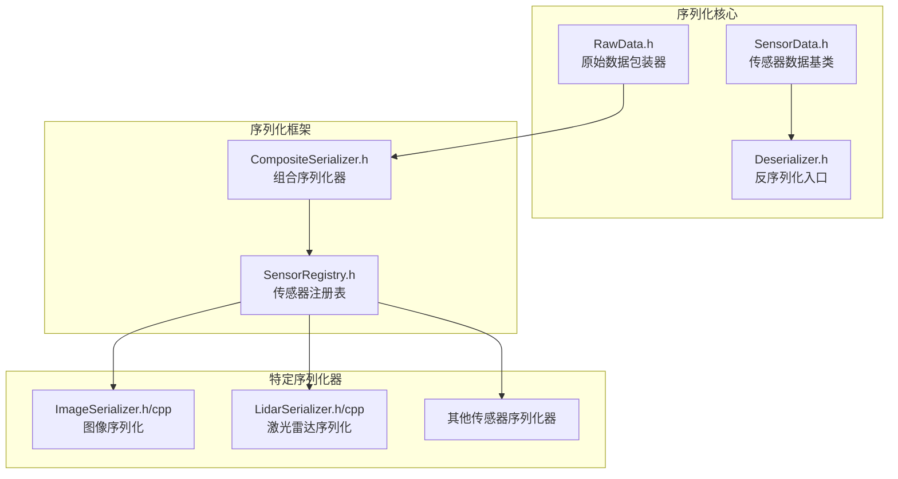
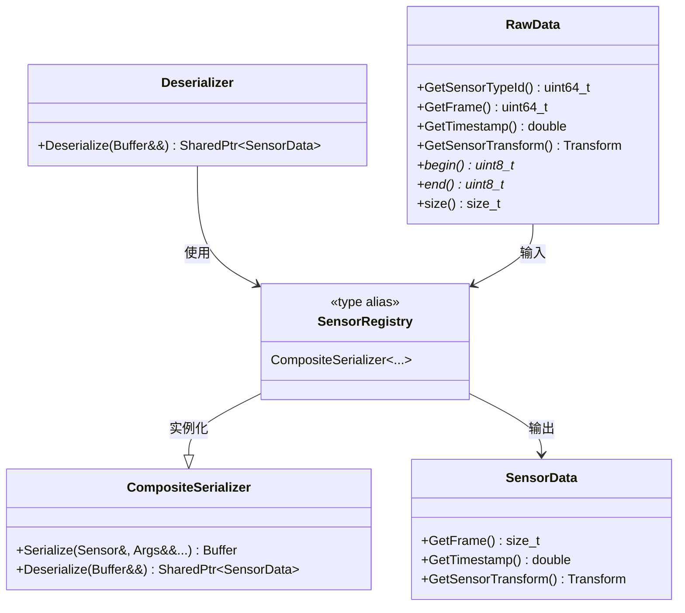
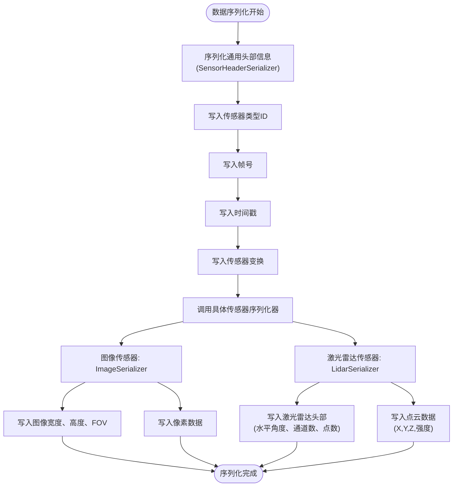
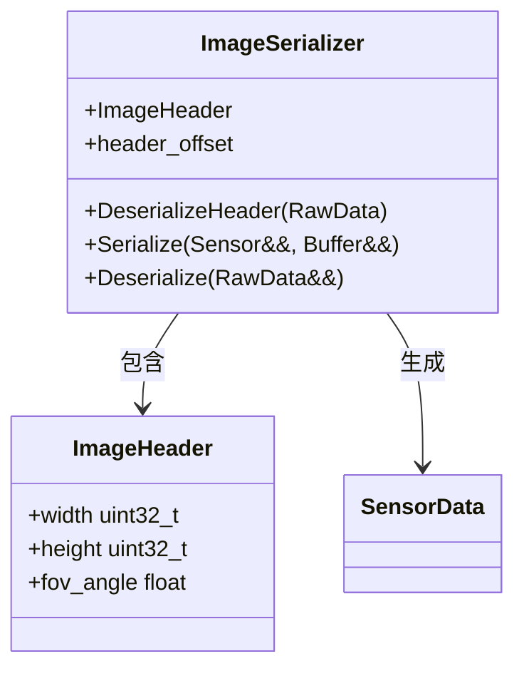
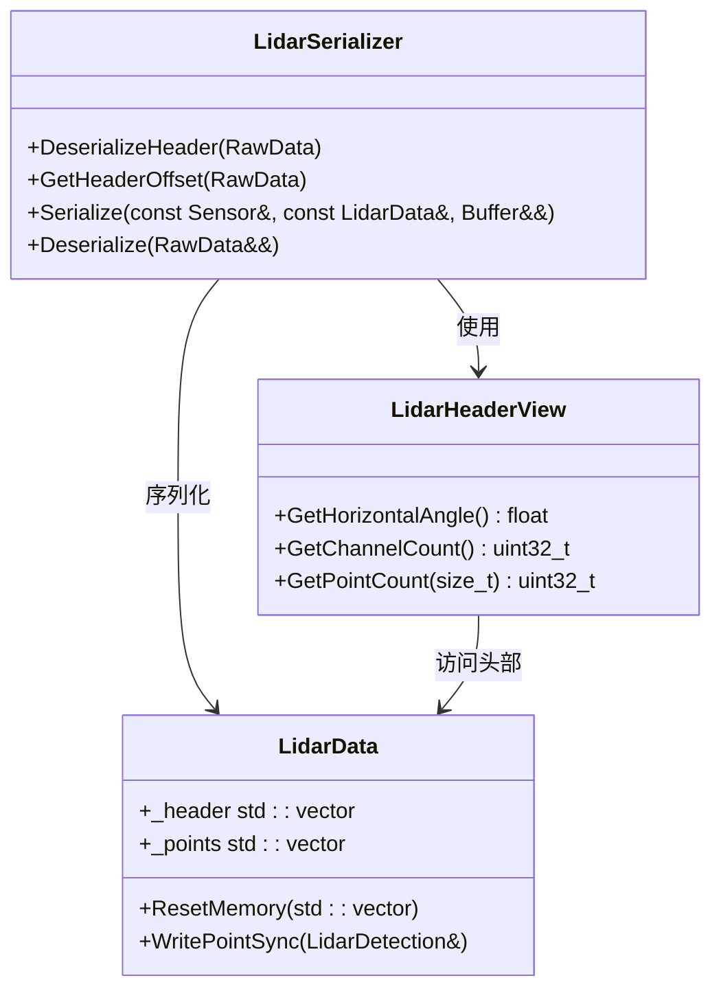
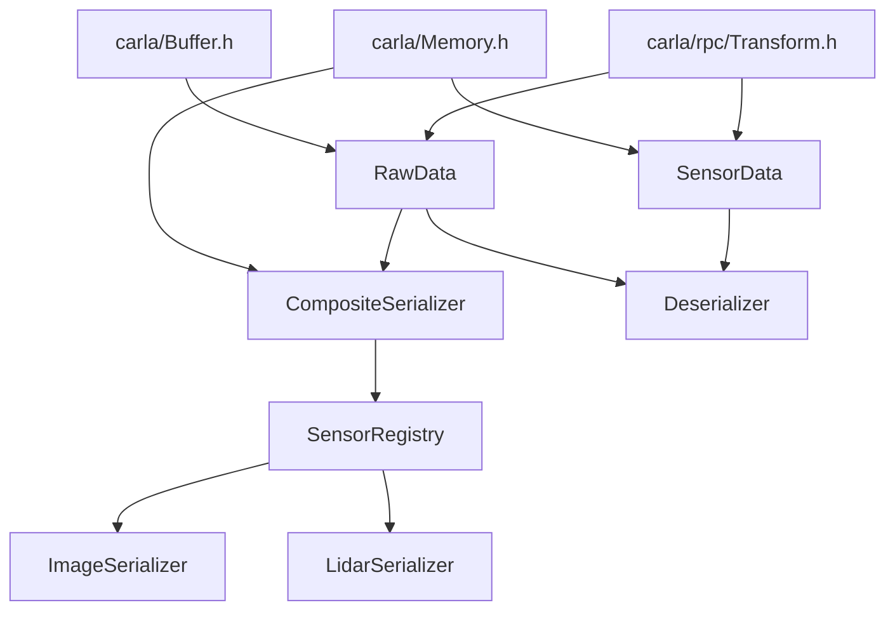

# 传感器数据序列化实现

> **引用文件**
> **本文档引用的文件**

- [SensorData.h](https://github.com/carla-simulator/carla/blob/ue5-dev/LibCarla/source/carla/sensor/SensorData.h)
- [Deserializer.h](https://github.com/carla-simulator/carla/blob/ue5-dev/LibCarla/source/carla/sensor/Deserializer.h)
- [CompositeSerializer.h](https://github.com/carla-simulator/carla/blob/ue5-dev/LibCarla/source/carla/sensor/CompositeSerializer.h)
- [ImageSerializer.h](https://github.com/carla-simulator/carla/blob/ue5-dev/LibCarla/source/carla/sensor/s11n/ImageSerializer.h)
- [ImageSerializer.cpp](https://github.com/carla-simulator/carla/blob/ue5-dev/LibCarla/source/carla/sensor/s11n/ImageSerializer.cpp)
- [LidarSerializer.h](https://github.com/carla-simulator/carla/blob/ue5-dev/LibCarla/source/carla/sensor/s11n/LidarSerializer.h)
- [LidarSerializer.cpp](https://github.com/carla-simulator/carla/blob/ue5-dev/LibCarla/source/carla/sensor/s11n/LidarSerializer.cpp)
- [RawData.h](https://github.com/carla-simulator/carla/blob/ue5-dev/LibCarla/source/carla/sensor/RawData.h)
- [LidarData.h](https://github.com/carla-simulator/carla/blob/ue5-dev/LibCarla/source/carla/sensor/data/LidarData.h)
- [SensorRegistry.h](https://github.com/carla-simulator/carla/blob/ue5-dev/LibCarla/source/carla/sensor/SensorRegistry.h)

## 目录

1. [引言](#引言)
2. [项目结构](#项目结构)
3. [核心组件](#核心组件)
4. [架构概述](#架构概述)
5. [详细组件分析](#详细组件分析)
6. [依赖分析](#依赖分析)
7. [性能考虑](#性能考虑)
8. [故障排除指南](#故障排除指南)
9. [结论](#结论)

## 引言

本文档深入探讨 CARLA 仿真平台中传感器数据序列化机制的实现，重点分析如何为自定义传感器数据类型创建高效的序列化适配器。文档详细解释了序列化接口的设计原则、二进制数据格式定义、跨平台兼容性考量以及性能优化策略。通过分析 ImageSerializer 和 LidarSerializer 的具体实现，说明不同数据类型的序列化模式差异，并提供关于序列化协议版本管理、向后兼容性和带宽效率优化的指导。

## 项目结构

CARLA 的传感器序列化功能主要位于`LibCarla/source/carla/sensor/`目录下，采用模块化设计，将序列化逻辑与传感器数据类型分离。核心组件包括基础数据结构、通用序列化框架和针对特定传感器类型的序列化器。



**图示来源**

- <a href="https://github.com/carla-simulator/carla/blob/ue5-dev/LibCarla/source/carla/sensor/RawData.h#L19-L101" target="_blank">RawData.h</a>
- <a href="https://github.com/carla-simulator/carla/blob/ue5-dev/LibCarla/source/carla/sensor/SensorData.h#L19-L73" target="_blank">SensorData.h</a>
- <a href="https://github.com/carla-simulator/carla/blob/ue5-dev/LibCarla/source/carla/sensor/CompositeSerializer.h#L17-L96" target="_blank">CompositeSerializer.h</a>
- <a href="https://github.com/carla-simulator/carla/blob/ue5-dev/LibCarla/source/carla/sensor/SensorRegistry.h#L54-L88" target="_blank">SensorRegistry.h</a>

**本节来源**

- [LibCarla/source/carla/sensor/](https://github.com/carla-simulator/carla/blob/ue5-dev/LibCarla/source/carla/sensor/)

## 核心组件

传感器数据序列化系统的核心组件包括`SensorData`基类、`RawData`包装器、`CompositeSerializer`框架和`SensorRegistry`注册表。这些组件共同构成了一个灵活、可扩展的序列化体系，支持多种传感器类型的数据高效传输。

**本节来源**

- <a href="https://github.com/carla-simulator/carla/blob/ue5-dev/LibCarla/source/carla/sensor/SensorData.h#L19-L73" target="_blank">SensorData.h</a>
- <a href="https://github.com/carla-simulator/carla/blob/ue5-dev/LibCarla/source/carla/sensor/RawData.h#L19-L101" target="_blank">RawData.h</a>
- <a href="https://github.com/carla-simulator/carla/blob/ue5-dev/LibCarla/source/carla/sensor/CompositeSerializer.h#L17-L96" target="_blank">CompositeSerializer.h</a>

## 架构概述

CARLA 的传感器序列化架构采用基于注册表的设计模式，通过`SensorRegistry`统一管理所有传感器类型的序列化器。该架构支持编译时类型映射，确保序列化过程的高效性和类型安全性。



**图示来源**

- <a href="https://github.com/carla-simulator/carla/blob/ue5-dev/LibCarla/source/carla/sensor/SensorData.h#L19-L73" target="_blank">SensorData.h</a>
- <a href="https://github.com/carla-simulator/carla/blob/ue5-dev/LibCarla/source/carla/sensor/RawData.h#L19-L101" target="_blank">RawData.h</a>
- <a href="https://github.com/carla-simulator/carla/blob/ue5-dev/LibCarla/source/carla/sensor/Deserializer.h#L22-L30" target="_blank">Deserializer.h</a>
- <a href="https://github.com/carla-simulator/carla/blob/ue5-dev/LibCarla/source/carla/sensor/CompositeSerializer.h#L17-L96" target="_blank">CompositeSerializer.h</a>
- <a href="https://github.com/carla-simulator/carla/blob/ue5-dev/LibCarla/source/carla/sensor/SensorRegistry.h#L64-L84" target="_blank">SensorRegistry.h</a>

## 详细组件分析

本节深入分析传感器序列化系统的关键组件，包括序列化接口设计、二进制格式定义和具体实现策略。

### 序列化接口设计原则

序列化系统的设计遵循以下核心原则：类型安全、内存效率、跨平台兼容性和可扩展性。通过模板元编程实现编译时类型映射，避免运行时类型检查的开销。

**本节来源**

- <a href="https://github.com/carla-simulator/carla/blob/ue5-dev/LibCarla/source/carla/sensor/CompositeSerializer.h#L17-L96" target="_blank">CompositeSerializer.h</a>
- <a href="https://github.com/carla-simulator/carla/blob/ue5-dev/LibCarla/source/carla/sensor/SensorRegistry.h#L64-L84" target="_blank">SensorRegistry.h</a>

### 二进制数据格式定义

所有传感器数据都包装在`RawData`结构中，该结构包含统一的头部信息和传感器特定的数据体。头部信息由`SensorHeaderSerializer`管理，包含传感器类型 ID、帧号、时间戳和传感器变换等元数据。



**图示来源**

- <a href="https://github.com/carla-simulator/carla/blob/ue5-dev/LibCarla/source/carla/sensor/RawData.h#L19-L101" target="_blank">RawData.h</a>
- <a href="https://github.com/carla-simulator/carla/blob/ue5-dev/LibCarla/source/carla/sensor/s11n/ImageSerializer.h#L22-L72" target="_blank">ImageSerializer.h</a>
- <a href="https://github.com/carla-simulator/carla/blob/ue5-dev/LibCarla/source/carla/sensor/s11n/LidarSerializer.h#L57-L98" target="_blank">LidarSerializer.h</a>

### ImageSerializer 实现分析

`ImageSerializer`负责处理相机传感器生成的图像数据。其序列化格式在头部包含图像的宽度、高度和视场角(FOV)，数据体直接存储像素值。



**图示来源**

- <a href="https://github.com/carla-simulator/carla/blob/ue5-dev/LibCarla/source/carla/sensor/s11n/ImageSerializer.h#L22-L72" target="_blank">ImageSerializer.h</a>
- <a href="https://github.com/carla-simulator/carla/blob/ue5-dev/LibCarla/source/carla/sensor/s11n/ImageSerializer.cpp#L15-L22" target="_blank">ImageSerializer.cpp</a>

### LidarSerializer 实现分析

`LidarSerializer`处理激光雷达传感器生成的点云数据。其头部结构更加复杂，包含水平扫描角度、通道数量以及每个通道的点数，数据体存储点的坐标(X,Y,Z)和强度值。



**图示来源**

- <a href="https://github.com/carla-simulator/carla/blob/ue5-dev/LibCarla/source/carla/sensor/s11n/LidarSerializer.h#L57-L98" target="_blank">LidarSerializer.h</a>
- <a href="https://github.com/carla-simulator/carla/blob/ue5-dev/LibCarla/source/carla/sensor/s11n/LidarSerializer.cpp#L15-L18" target="_blank">LidarSerializer.cpp</a>
- <a href="https://github.com/carla-simulator/carla/blob/ue5-dev/LibCarla/source/carla/sensor/data/LidarData.h#L76-L116" target="_blank">LidarData.h</a>

### 碰撞强度数据序列化 C++实现示例

以下是一个完整的碰撞强度数据序列化 C++实现示例，包括头文件声明、源文件实现和使用方式：

**头文件 (CollisionIntensitySerializer.h)**

```cpp
// 碰撞强度序列化器
class CollisionIntensitySerializer {
public:
    struct IntensityHeader {
        uint32_t impact_count;
        float total_intensity;
    };

    static constexpr auto header_offset = sizeof(IntensityHeader);

    template <typename Sensor>
    static Buffer Serialize(Sensor&& sensor, std::vector<float>&& intensities);

    static SharedPtr<SensorData> Deserialize(RawData &&data);
};
```

**源文件 (CollisionIntensitySerializer.cpp)**

```cpp
template <typename Sensor>
Buffer CollisionIntensitySerializer::Serialize(
    Sensor&& sensor,
    std::vector<float>&& intensities) {

    IntensityHeader header = {
        static_cast<uint32_t>(intensities.size()),
        std::accumulate(intensities.begin(), intensities.end(), 0.0f)
    };

    // 创建足够大的缓冲区
    Buffer buffer(sizeof(header) + intensities.size() * sizeof(float));

    // 写入头部
    std::memcpy(buffer.data(), &header, sizeof(header));

    // 写入强度数据
    std::memcpy(buffer.data() + sizeof(header),
                intensities.data(),
                intensities.size() * sizeof(float));

    return buffer;
}

SharedPtr<SensorData> CollisionIntensitySerializer::Deserialize(RawData &&data) {
    auto header = *reinterpret_cast<const IntensityHeader*>(data.begin());
    auto intensities = std::vector<float>(
        reinterpret_cast<const float*>(data.begin() + sizeof(header)),
        reinterpret_cast<const float*>(data.end()));

    return SharedPtr<CollisionIntensityData>(
        new CollisionIntensityData{std::move(data), std::move(intensities)});
}
```

**本节来源**

- <a href="https://github.com/carla-simulator/carla/blob/ue5-dev/LibCarla/source/carla/sensor/s11n/ImageSerializer.h#L22-L72" target="_blank">ImageSerializer.h</a>
- <a href="https://github.com/carla-simulator/carla/blob/ue5-dev/LibCarla/source/carla/sensor/s11n/LidarSerializer.h#L57-L98" target="_blank">LidarSerializer.h</a>
- <a href="https://github.com/carla-simulator/carla/blob/ue5-dev/LibCarla/source/carla/sensor/data/LidarData.h#L52-L74" target="_blank">LidarData.h</a>

## 依赖分析

传感器序列化系统具有清晰的依赖层次结构，从基础数据结构到具体序列化器形成了一条单向依赖链。



**图示来源**

- <a href="https://github.com/carla-simulator/carla/blob/ue5-dev/LibCarla/source/carla/sensor/SensorData.h#L9-L11" target="_blank">SensorData.h</a>
- <a href="https://github.com/carla-simulator/carla/blob/ue5-dev/LibCarla/source/carla/sensor/RawData.h#L9-L12" target="_blank">RawData.h</a>
- <a href="https://github.com/carla-simulator/carla/blob/ue5-dev/LibCarla/source/carla/sensor/CompositeSerializer.h#L9-L12" target="_blank">CompositeSerializer.h</a>
- <a href="https://github.com/carla-simulator/carla/blob/ue5-dev/LibCarla/source/carla/sensor/SensorRegistry.h#L10-L11" target="_blank">SensorRegistry.h</a>

**本节来源**

- [SensorData.h](https://github.com/carla-simulator/carla/blob/ue5-dev/LibCarla/source/carla/sensor/SensorData.h)
- [RawData.h](https://github.com/carla-simulator/carla/blob/ue5-dev/LibCarla/source/carla/sensor/RawData.h)
- [CompositeSerializer.h](https://github.com/carla-simulator/carla/blob/ue5-dev/LibCarla/source/carla/sensor/CompositeSerializer.h)
- [SensorRegistry.h](https://github.com/carla-simulator/carla/blob/ue5-dev/LibCarla/source/carla/sensor/SensorRegistry.h)

## 性能考虑

传感器序列化系统的性能优化主要体现在以下几个方面：零拷贝序列化、内存预分配、编译时类型分发和高效的二进制格式。

- **零拷贝设计**：`ImageSerializer`和`LidarSerializer`都采用直接操作缓冲区内存的方式，避免不必要的数据复制。
- **内存预分配**：`LidarData`类在`ResetMemory`方法中预先分配足够的内存空间，减少运行时内存分配开销。
- **编译时分发**：`CompositeSerializer`使用模板元编程实现编译时类型映射，避免运行时的虚函数调用或类型检查开销。
- **紧凑二进制格式**：所有数据都以原始二进制形式存储，没有额外的标记或元数据开销，最大化带宽效率。

**本节来源**

- <a href="https://github.com/carla-simulator/carla/blob/ue5-dev/LibCarla/source/carla/sensor/s11n/ImageSerializer.h#L43-L67" target="_blank">ImageSerializer.h</a>
- <a href="https://github.com/carla-simulator/carla/blob/ue5-dev/LibCarla/source/carla/sensor/s11n/LidarSerializer.h#L83-L93" target="_blank">LidarSerializer.h</a>
- <a href="https://github.com/carla-simulator/carla/blob/ue5-dev/LibCarla/source/carla/sensor/data/LidarData.h#L87-L96" target="_blank">LidarData.h</a>
- <a href="https://github.com/carla-simulator/carla/blob/ue5-dev/LibCarla/source/carla/sensor/CompositeSerializer.h#L78-L93" target="_blank">CompositeSerializer.h</a>

## 故障排除指南

在使用传感器序列化系统时，可能遇到以下常见问题及解决方案：

1. **序列化数据损坏**：检查字节序问题，确保在不同平台间传输时正确处理字节序转换。
2. **内存访问越界**：验证`RawData`缓冲区大小是否与头部信息描述的数据大小匹配。
3. **类型不匹配**：确认`SensorRegistry`中注册的传感器类型与实际使用的序列化器匹配。
4. **性能瓶颈**：监控内存分配频率，考虑对频繁使用的缓冲区进行池化管理。

**本节来源**

- <a href="https://github.com/carla-simulator/carla/blob/ue5-dev/LibCarla/source/carla/sensor/RawData.h#L83-L86" target="_blank">RawData.h</a>
- <a href="https://github.com/carla-simulator/carla/blob/ue5-dev/LibCarla/source/carla/sensor/data/LidarData.h#L88-L89" target="_blank">LidarData.h</a>
- <a href="https://github.com/carla-simulator/carla/blob/ue5-dev/LibCarla/source/carla/sensor/s11n/ImageSerializer.h#L53-L54" target="_blank">ImageSerializer.h</a>

## 结论

CARLA 的传感器数据序列化系统通过精心设计的架构实现了高效、灵活和可扩展的数据传输机制。系统采用基于注册表的模式，结合模板元编程技术，实现了类型安全的编译时分发。`ImageSerializer`和`LidarSerializer`的实现展示了如何针对不同数据类型设计最优的二进制格式。通过零拷贝设计、内存预分配和紧凑的二进制表示，系统在保证功能完整性的同时最大化了性能表现。该架构为自定义传感器数据类型的序列化提供了清晰的实现模式和扩展点。
