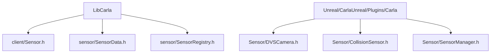
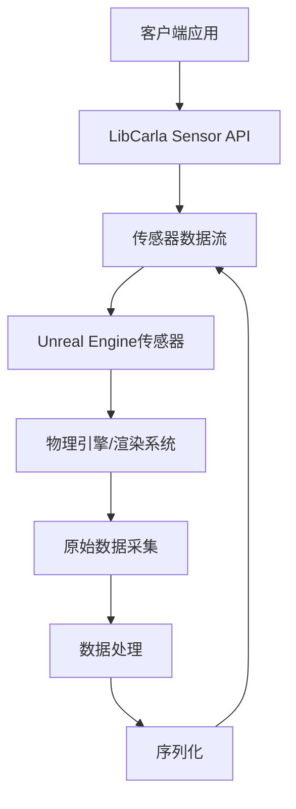
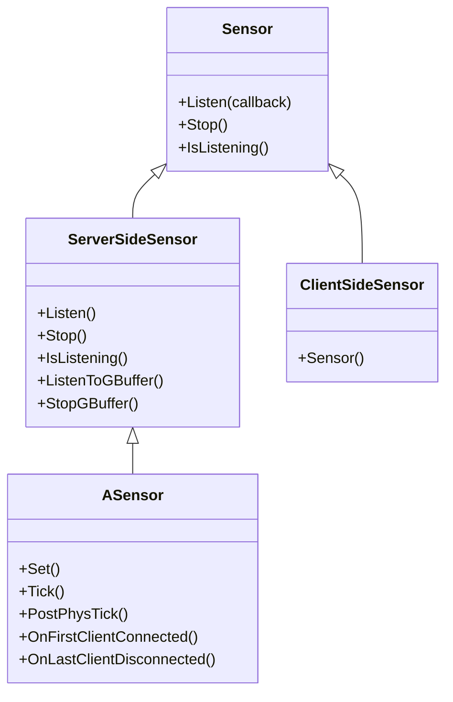
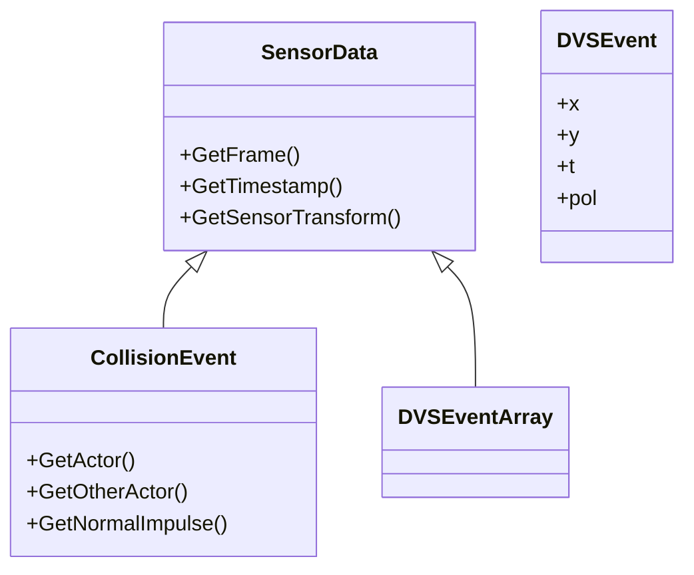
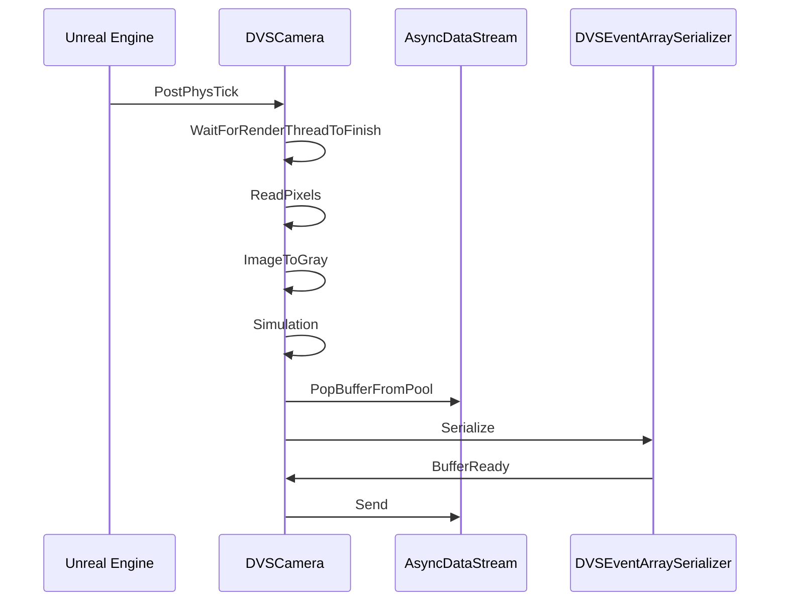
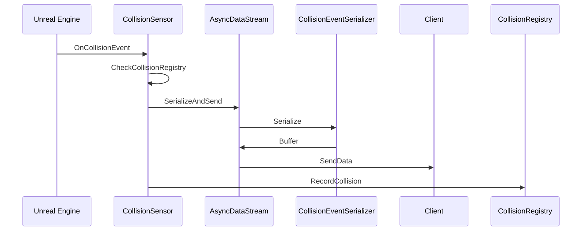
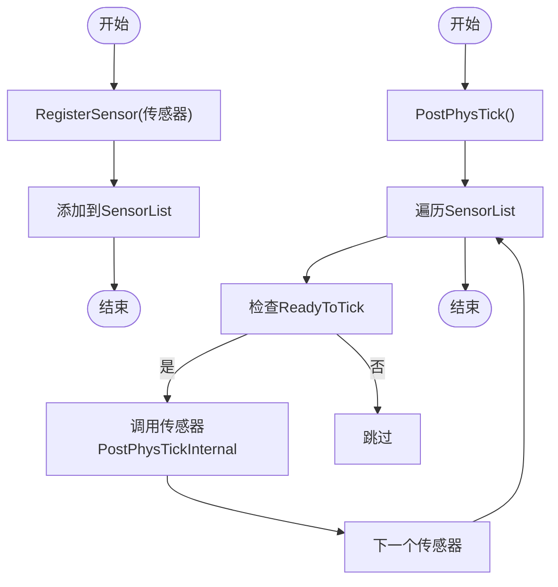
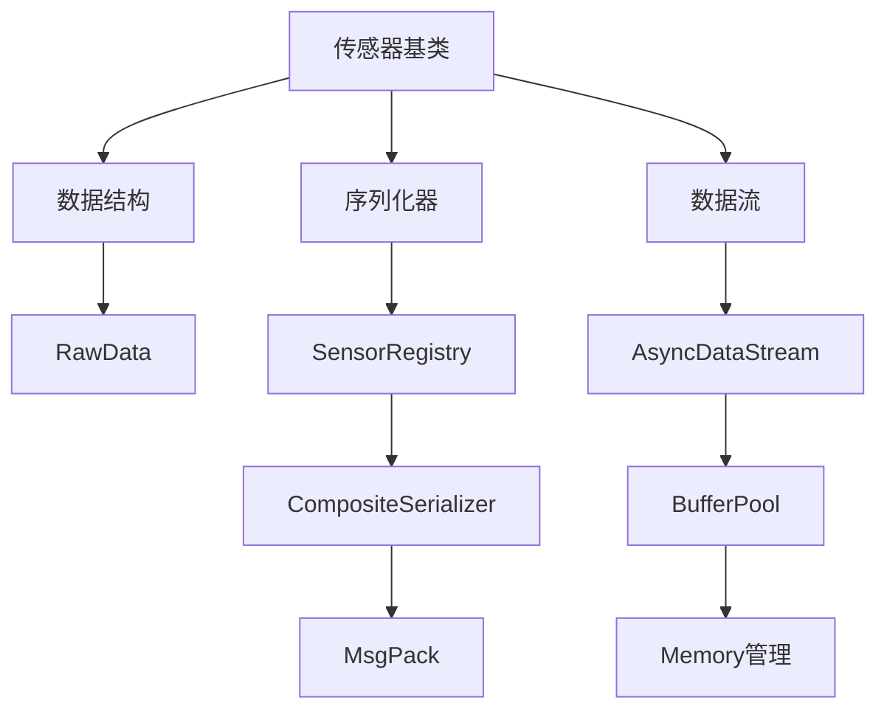

# 自定义传感器实现

> **引用文件**
> **本文档引用的文件**

- [Sensor.h](https://github.com/carla-simulator/carla/blob/ue5-dev/LibCarla/source/carla/client/Sensor.h)
- [SensorData.h](https://github.com/carla-simulator/carla/blob/ue5-dev/LibCarla/source/carla/sensor/SensorData.h)
- [DVSCamera.h](https://github.com/carla-simulator/carla/blob/ue5-dev/Unreal/CarlaUnreal/Plugins/Carla/Source/Carla/Sensor/DVSCamera.h)
- [DVSCamera.cpp](https://github.com/carla-simulator/carla/blob/ue5-dev/Unreal/CarlaUnreal/Plugins/Carla/Source/Carla/Sensor/DVSCamera.cpp)
- [CollisionSensor.h](https://github.com/carla-simulator/carla/blob/ue5-dev/Unreal/CarlaUnreal/Plugins/Carla/Source/Carla/Sensor/CollisionSensor.h)
- [CollisionSensor.cpp](https://github.com/carla-simulator/carla/blob/ue5-dev/Unreal/CarlaUnreal/Plugins/Carla/Source/Carla/Sensor/CollisionSensor.cpp)
- [SensorRegistry.h](https://github.com/carla-simulator/carla/blob/ue5-dev/LibCarla/source/carla/sensor/SensorRegistry.h)
- [CompositeSerializer.h](https://github.com/carla-simulator/carla/blob/ue5-dev/LibCarla/source/carla/sensor/CompositeSerializer.h)
- [CollisionEvent.h](https://github.com/carla-simulator/carla/blob/ue5-dev/LibCarla/source/carla/sensor/data/CollisionEvent.h)
- [CollisionEventSerializer.h](https://github.com/carla-simulator/carla/blob/ue5-dev/LibCarla/source/carla/sensor/s11n/CollisionEventSerializer.h)
- [AsyncDataStream.h](https://github.com/carla-simulator/carla/blob/ue5-dev/Unreal/CarlaUnreal/Plugins/Carla/Source/Carla/Sensor/AsyncDataStream.h)
- [RawData.h](https://github.com/carla-simulator/carla/blob/ue5-dev/LibCarla/source/carla/sensor/RawData.h)
- [Sensor.cpp](https://github.com/carla-simulator/carla/blob/ue5-dev/Unreal/CarlaUnreal/Plugins/Carla/Source/Carla/Sensor/Sensor.cpp)
- [SensorManager.h](https://github.com/carla-simulator/carla/blob/ue5-dev/Unreal/CarlaUnreal/Plugins/Carla/Source/Carla/Sensor/SensorManager.h)
- [SensorManager.cpp](https://github.com/carla-simulator/carla/blob/ue5-dev/Unreal/CarlaUnreal/Plugins/Carla/Source/Carla/Sensor/SensorManager.cpp)

## 目录

1. [简介](#简介)
2. [项目结构](#项目结构)
3. [核心组件](#核心组件)
4. [架构概述](#架构概述)
5. [详细组件分析](#详细组件分析)
6. [依赖分析](#依赖分析)
7. [性能考虑](#性能考虑)
8. [故障排除指南](#故障排除指南)
9. [结论](#结论)

## 简介

本文档详细探讨了在 CARLA 模拟器中实现自定义传感器的技术细节。重点介绍了如何通过继承基类创建新的传感器，重写虚函数以处理数据采集和发布，以及设计传感器数据结构的原则。文档以 DVSCamera 和 CollisionSensor 的实现为例，说明了如何集成 Unreal Engine 的渲染和物理系统来获取原始数据，并提供了完整的自定义传感器实现示例。

## 项目结构

CARLA 的传感器系统分布在多个目录中，主要分为客户端库(LibCarla)和 Unreal Engine 插件部分。LibCarla 包含核心传感器接口和数据结构，而 Unreal 插件部分实现了具体的传感器功能。

**图示来源**

- [Sensor.h](https://github.com/carla-simulator/carla/blob/ue5-dev/LibCarla/source/carla/client/Sensor.h)
- [SensorData.h](https://github.com/carla-simulator/carla/blob/ue5-dev/LibCarla/source/carla/sensor/SensorData.h)
- [DVSCamera.h](https://github.com/carla-simulator/carla/blob/ue5-dev/Unreal/CarlaUnreal/Plugins/Carla/Source/Carla/Sensor/DVSCamera.h)
- [CollisionSensor.h](https://github.com/carla-simulator/carla/blob/ue5-dev/Unreal/CarlaUnreal/Plugins/Carla/Source/Carla/Sensor/CollisionSensor.h)

**章节来源**

- <a href="https://github.com/carla-simulator/carla/blob/ue5-dev/LibCarla/source/carla/client/Sensor.h#L1-L36" target="_blank">Sensor.h</a>
- <a href="https://github.com/carla-simulator/carla/blob/ue5-dev/LibCarla/source/carla/sensor/SensorData.h#L1-L73" target="_blank">SensorData.h</a>

## 核心组件

自定义传感器实现的核心组件包括传感器基类、数据结构、序列化器和数据流管理。传感器基类定义了通用接口，数据结构用于存储传感器测量值，序列化器负责数据的序列化和反序列化，数据流管理则处理传感器数据的传输。

**章节来源**

- <a href="https://github.com/carla-simulator/carla/blob/ue5-dev/LibCarla/source/carla/client/Sensor.h#L17-L33" target="_blank">Sensor.h</a>
- <a href="https://github.com/carla-simulator/carla/blob/ue5-dev/LibCarla/source/carla/sensor/SensorData.h#L19-L69" target="_blank">SensorData.h</a>

## 架构概述

CARLA 的传感器架构采用分层设计，分为客户端接口层、数据处理层和物理引擎集成层。客户端接口层提供统一的 API，数据处理层负责数据的序列化和传输，物理引擎集成层则与 Unreal Engine 交互获取原始数据。

**图示来源**

- <a href="https://github.com/carla-simulator/carla/blob/ue5-dev/LibCarla/source/carla/client/Sensor.h#L17-L33" target="_blank">Sensor.h</a>
- <a href="https://github.com/carla-simulator/carla/blob/ue5-dev/Unreal/CarlaUnreal/Plugins/Carla/Source/Carla/Sensor/AsyncDataStream.h#L40-L78" target="_blank">AsyncDataStream.h</a>
- <a href="https://github.com/carla-simulator/carla/blob/ue5-dev/Unreal/CarlaUnreal/Plugins/Carla/Source/Carla/Sensor/SensorManager.h#L1-L26" target="_blank">SensorManager.h</a>

## 详细组件分析

### 传感器基类分析

CARLA 的传感器系统基于继承的面向对象设计，所有传感器都从基类继承并实现特定功能。

**图示来源**

- <a href="https://github.com/carla-simulator/carla/blob/ue5-dev/LibCarla/source/carla/client/Sensor.h#L17-L33" target="_blank">Sensor.h</a>
- <a href="https://github.com/carla-simulator/carla/blob/ue5-dev/LibCarla/source/carla/client/ServerSideSensor.h#L15-L48" target="_blank">ServerSideSensor.h</a>
- <a href="https://github.com/carla-simulator/carla/blob/ue5-dev/LibCarla/source/carla/client/ClientSideSensor.h#L14-L21" target="_blank">ClientSideSensor.h</a>
- <a href="https://github.com/carla-simulator/carla/blob/ue5-dev/Unreal/CarlaUnreal/Plugins/Carla/Source/Carla/Sensor/Sensor.cpp#L38-L96" target="_blank">Sensor.cpp</a>

**章节来源**

- <a href="https://github.com/carla-simulator/carla/blob/ue5-dev/LibCarla/source/carla/client/Sensor.h#L17-L33" target="_blank">Sensor.h</a>
- <a href="https://github.com/carla-simulator/carla/blob/ue5-dev/Unreal/CarlaUnreal/Plugins/Carla/Source/Carla/Sensor/Sensor.cpp#L38-L96" target="_blank">Sensor.cpp</a>

### 传感器数据结构分析

传感器数据结构设计遵循继承原则，所有数据类都从 SensorData 基类派生，并通过序列化器进行数据转换。

**图示来源**

- <a href="https://github.com/carla-simulator/carla/blob/ue5-dev/LibCarla/source/carla/sensor/SensorData.h#L20-L69" target="_blank">SensorData.h</a>
- <a href="https://github.com/carla-simulator/carla/blob/ue5-dev/LibCarla/source/carla/sensor/data/CollisionEvent.h#L20-L58" target="_blank">CollisionEvent.h</a>
- <a href="https://github.com/carla-simulator/carla/blob/ue5-dev/LibCarla/source/carla/sensor/data/DVSEvent.h#L16-L64" target="_blank">DVSEvent.h</a>

**章节来源**

- <a href="https://github.com/carla-simulator/carla/blob/ue5-dev/LibCarla/source/carla/sensor/SensorData.h#L20-L69" target="_blank">SensorData.h</a>
- <a href="https://github.com/carla-simulator/carla/blob/ue5-dev/LibCarla/source/carla/sensor/data/CollisionEvent.h#L20-L58" target="_blank">CollisionEvent.h</a>

### DVS 相机实现分析

DVSCamera 传感器通过继承 ShaderBasedSensor 实现，利用 Unreal Engine 的渲染系统获取图像数据，并将其转换为动态视觉传感器事件。

**图示来源**

- <a href="https://github.com/carla-simulator/carla/blob/ue5-dev/Unreal/CarlaUnreal/Plugins/Carla/Source/Carla/Sensor/DVSCamera.cpp#L132-L170" target="_blank">DVSCamera.cpp</a>
- <a href="https://github.com/carla-simulator/carla/blob/ue5-dev/Unreal/CarlaUnreal/Plugins/Carla/Source/Carla/Sensor/AsyncDataStream.h#L60-L63" target="_blank">AsyncDataStream.h</a>
- <a href="https://github.com/carla-simulator/carla/blob/ue5-dev/LibCarla/source/carla/sensor/CompositeSerializer.h#L38-L84" target="_blank">CompositeSerializer.h</a>

**章节来源**

- <a href="https://github.com/carla-simulator/carla/blob/ue5-dev/Unreal/CarlaUnreal/Plugins/Carla/Source/Carla/Sensor/DVSCamera.cpp#L132-L170" target="_blank">DVSCamera.cpp</a>
- <a href="https://github.com/carla-simulator/carla/blob/ue5-dev/Unreal/CarlaUnreal/Plugins/Carla/Source/Carla/Sensor/DVSCamera.h#L46-L54" target="_blank">DVSCamera.h</a>

### 碰撞传感器实现分析

碰撞传感器通过监听 Unreal Engine 的物理事件来检测碰撞，并将碰撞信息序列化后发送给客户端。

**图示来源**

- <a href="https://github.com/carla-simulator/carla/blob/ue5-dev/Unreal/CarlaUnreal/Plugins/Carla/Source/Carla/Sensor/CollisionSensor.cpp#L41-L128" target="_blank">CollisionSensor.cpp</a>
- <a href="https://github.com/carla-simulator/carla/blob/ue5-dev/Unreal/CarlaUnreal/Plugins/Carla/Source/Carla/Sensor/AsyncDataStream.h#L63-L64" target="_blank">AsyncDataStream.h</a>
- <a href="https://github.com/carla-simulator/carla/blob/ue5-dev/LibCarla/source/carla/sensor/s11n/CollisionEventSerializer.h#L45-L51" target="_blank">CollisionEventSerializer.h</a>

**章节来源**

- <a href="https://github.com/carla-simulator/carla/blob/ue5-dev/Unreal/CarlaUnreal/Plugins/Carla/Source/Carla/Sensor/CollisionSensor.cpp#L41-L128" target="_blank">CollisionSensor.cpp</a>
- <a href="https://github.com/carla-simulator/carla/blob/ue5-dev/Unreal/CarlaUnreal/Plugins/Carla/Source/Carla/Sensor/CollisionSensor.h#L19-L43" target="_blank">CollisionSensor.h</a>

### 传感器管理器分析

传感器管理器负责管理所有传感器实例的生命周期和数据流，确保传感器在正确的时机进行数据采集和发布。

**图示来源**

- <a href="https://github.com/carla-simulator/carla/blob/ue5-dev/Unreal/CarlaUnreal/Plugins/Carla/Source/Carla/Sensor/SensorManager.cpp#L1-L27" target="_blank">SensorManager.cpp</a>
- <a href="https://github.com/carla-simulator/carla/blob/ue5-dev/Unreal/CarlaUnreal/Plugins/Carla/Source/Carla/Sensor/SensorManager.h#L1-L26" target="_blank">SensorManager.h</a>

**章节来源**

- <a href="https://github.com/carla-simulator/carla/blob/ue5-dev/Unreal/CarlaUnreal/Plugins/Carla/Source/Carla/Sensor/SensorManager.cpp#L1-L27" target="_blank">SensorManager.cpp</a>
- <a href="https://github.com/carla-simulator/carla/blob/ue5-dev/Unreal/CarlaUnreal/Plugins/Carla/Source/Carla/Sensor/SensorManager.h#L1-L26" target="_blank">SensorManager.h</a>

## 依赖分析

CARLA 的传感器系统具有复杂的依赖关系，涉及多个模块的协同工作。

**图示来源**

- <a href="https://github.com/carla-simulator/carla/blob/ue5-dev/LibCarla/source/carla/sensor/SensorRegistry.h#L64-L84" target="_blank">SensorRegistry.h</a>
- <a href="https://github.com/carla-simulator/carla/blob/ue5-dev/LibCarla/source/carla/sensor/CompositeSerializer.h#L29-L35" target="_blank">CompositeSerializer.h</a>
- <a href="https://github.com/carla-simulator/carla/blob/ue5-dev/LibCarla/source/carla/sensor/RawData.h#L21-L97" target="_blank">RawData.h</a>
- <a href="https://github.com/carla-simulator/carla/blob/ue5-dev/Unreal/CarlaUnreal/Plugins/Carla/Source/Carla/Sensor/AsyncDataStream.h#L40-L78" target="_blank">AsyncDataStream.h</a>

**章节来源**

- <a href="https://github.com/carla-simulator/carla/blob/ue5-dev/LibCarla/source/carla/sensor/SensorRegistry.h#L64-L84" target="_blank">SensorRegistry.h</a>
- <a href="https://github.com/carla-simulator/carla/blob/ue5-dev/LibCarla/source/carla/sensor/CompositeSerializer.h#L29-L35" target="_blank">CompositeSerializer.h</a>

## 性能考虑

在实现自定义传感器时，需要考虑线程同步、内存管理和异常处理的最佳实践。使用缓冲池可以重用内存，减少内存分配开销；通过适当的锁机制确保线程安全；并实现错误处理机制来应对异常情况。

## 故障排除指南

当自定义传感器无法正常工作时，可以检查以下方面：确保传感器已正确注册到传感器管理器；验证数据流是否已正确设置；检查序列化器是否已正确注册到 SensorRegistry；确认 Unreal Engine 的物理或渲染系统是否正常工作。

**章节来源**

- <a href="https://github.com/carla-simulator/carla/blob/ue5-dev/Unreal/CarlaUnreal/Plugins/Carla/Source/Carla/Sensor/SensorManager.cpp#L10-L18" target="_blank">SensorManager.cpp</a>
- <a href="https://github.com/carla-simulator/carla/blob/ue5-dev/LibCarla/source/carla/sensor/SensorRegistry.h#L64-L84" target="_blank">SensorRegistry.h</a>
- <a href="https://github.com/carla-simulator/carla/blob/ue5-dev/Unreal/CarlaUnreal/Plugins/Carla/Source/Carla/Sensor/AsyncDataStream.h#L53-L56" target="_blank">AsyncDataStream.h</a>

## 结论

通过继承 CARLA 的传感器基类并实现相应的虚函数，可以创建功能完整的自定义传感器。关键是要理解传感器数据流的处理流程，正确实现数据采集、处理和发布机制，并遵循线程安全和内存管理的最佳实践。
