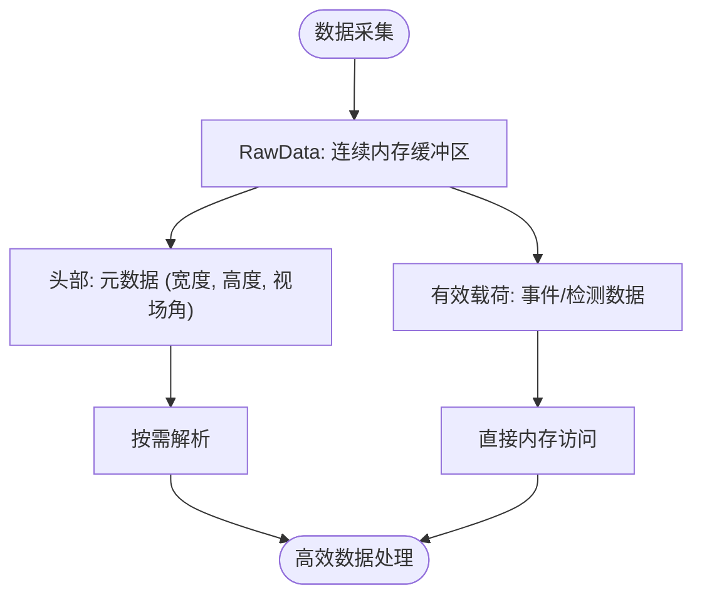
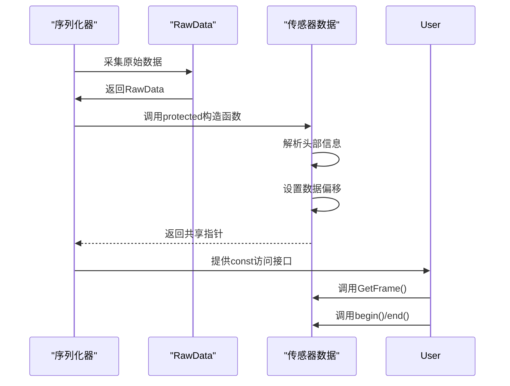
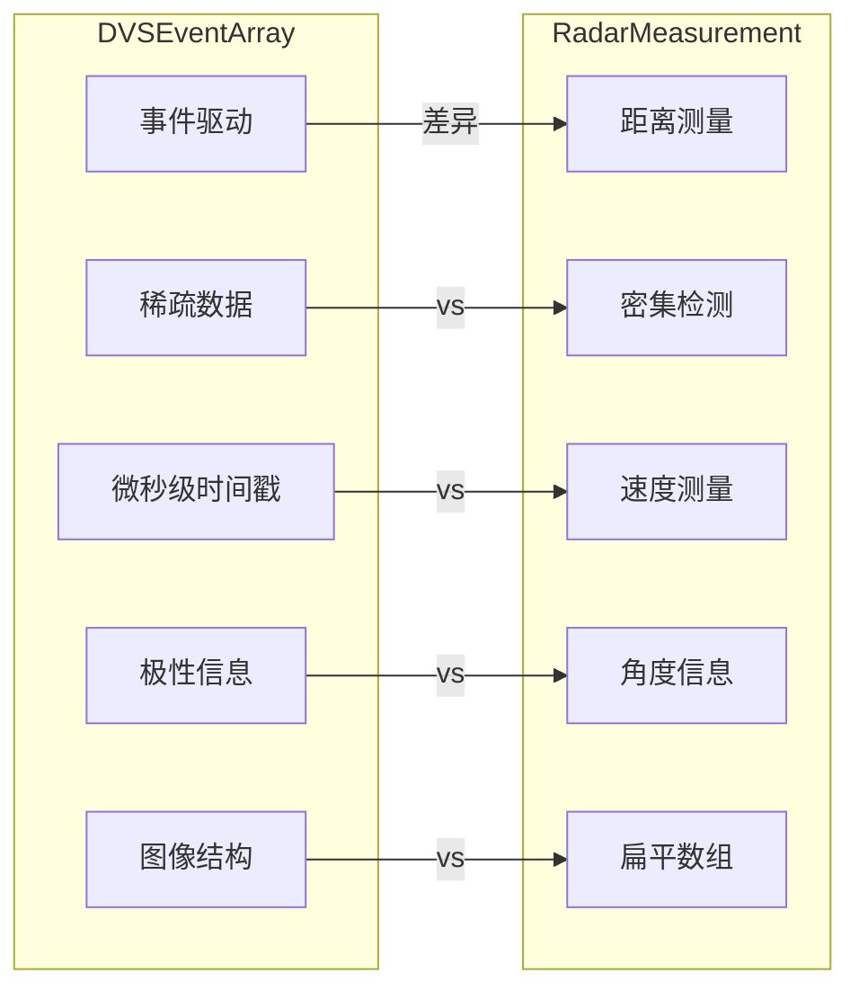

# 自定义传感器数据模型设计

> **引用文件**
> **本文档引用的文件**

- [SensorData.h](https://github.com/carla-simulator/carla/blob/ue5-dev/LibCarla/source/carla/sensor/SensorData.h)
- [Array.h](https://github.com/carla-simulator/carla/blob/ue5-dev/LibCarla/source/carla/sensor/data/Array.h)
- [DVSEventArray.h](https://github.com/carla-simulator/carla/blob/ue5-dev/LibCarla/source/carla/sensor/data/DVSEventArray.h)
- [RadarMeasurement.h](https://github.com/carla-simulator/carla/blob/ue5-dev/LibCarla/source/carla/sensor/data/RadarMeasurement.h)
- [DVSEvent.h](https://github.com/carla-simulator/carla/blob/ue5-dev/LibCarla/source/carla/sensor/data/DVSEvent.h)
- [RadarData.h](https://github.com/carla-simulator/carla/blob/ue5-dev/LibCarla/source/carla/sensor/data/RadarData.h)
- [CollisionEvent.h](https://github.com/carla-simulator/carla/blob/ue5-dev/LibCarla/source/carla/sensor/data/CollisionEvent.h)
- [DVSEventArraySerializer.h](https://github.com/carla-simulator/carla/blob/ue5-dev/LibCarla/source/carla/sensor/s11n/DVSEventArraySerializer.h)
- [RadarSerializer.h](https://github.com/carla-simulator/carla/blob/ue5-dev/LibCarla/source/carla/sensor/s11n/RadarSerializer.h)

## 目录

1. [引言](#引言)
2. [核心数据结构与继承体系](#核心数据结构与继承体系)
3. [数据字段选择原则](#数据字段选择原则)
4. [内存布局优化策略](#内存布局优化策略)
5. [数据类型定义与 Unreal Engine 映射](#数据类型定义与unreal-engine映射)
6. [构造函数与访问器方法设计](#构造函数与访问器方法设计)
7. [数据验证逻辑实现](#数据验证逻辑实现)
8. [事件驱动与距离测量传感器对比](#事件驱动与距离测量传感器对比)
9. [碰撞强度数据模型实现示例](#碰撞强度数据模型实现示例)
10. [数据一致性与缓存友好设计](#数据一致性与缓存友好设计)

## 引言

本文档深入探讨 CARLA 仿真平台中自定义传感器数据模型的设计原理与实现方法。重点分析如何基于 SensorData 基类构建高效、可扩展的传感器数据结构，涵盖数据字段选择、内存布局优化、类型定义、构造函数设计、访问器方法实现以及数据验证等关键方面。通过 DVSEventArray 和 RadarMeasurement 两个典型示例，展示事件驱动传感器与距离测量传感器在数据模型设计上的差异，并提供一个完整的碰撞强度数据模型 C++实现。

## 核心数据结构与继承体系

CARLA 的传感器数据模型采用分层继承体系，以`SensorData`为所有传感器数据的基类。该类定义了所有传感器数据共有的基本属性：帧计数、时间戳和传感器变换矩阵。

```mermaid
classDiagram
class SensorData {
+GetFrame() size_t
+GetTimestamp() double
+GetSensorTransform() rpc : : Transform
-_frame size_t
-_timestamp double
-_sensor_transform rpc : : Transform
}
class T[] {
+begin() T*
+end() T*
+size() size_t
+operator[]() T&
-_data RawData
-_offset size_t
}
class DVSEventArray {
+GetWidth() auto
+GetHeight() auto
+GetFOVAngle() auto
+ToImage() std : : vector<Color>
+ToArray() std : : vector<std : : vector<int64_t>>
}
class RadarMeasurement {
+GetDetectionAmount() size_type
}
class CollisionEvent {
+GetActor() SharedPtr~Actor~
+GetOtherActor() SharedPtr~Actor~
+GetNormalImpulse() geom : : Vector3D
-_self_actor ActorVariant
-_other_actor ActorVariant
-_normal_impulse geom : : Vector3D
}
SensorData <|-- Array
Array <|-- DVSEventArray
Array <|-- RadarMeasurement
SensorData <|-- CollisionEvent
```

**图表来源**

- <a href="https://github.com/carla-simulator/carla/blob/ue5-dev/LibCarla/source/carla/sensor/SensorData.h#L19-L69" target="_blank">SensorData.h</a>
- <a href="https://github.com/carla-simulator/carla/blob/ue5-dev/LibCarla/source/carla/sensor/data/Array.h#L23-L148" target="_blank">Array.h</a>
- <a href="https://github.com/carla-simulator/carla/blob/ue5-dev/LibCarla/source/carla/sensor/data/DVSEventArray.h#L20-L117" target="_blank">DVSEventArray.h</a>
- <a href="https://github.com/carla-simulator/carla/blob/ue5-dev/LibCarla/source/carla/sensor/data/RadarMeasurement.h#L20-L36" target="_blank">RadarMeasurement.h</a>
- <a href="https://github.com/carla-simulator/carla/blob/ue5-dev/LibCarla/source/carla/sensor/data/CollisionEvent.h#L20-L58" target="_blank">CollisionEvent.h</a>

## 数据字段选择原则

传感器数据字段的选择遵循以下原则：

1. **物理意义明确**：每个字段都应具有清晰的物理含义，如 DVSEvent 中的 x、y 坐标表示像素位置，t 表示时间戳，pol 表示极性。
2. **最小完备性**：只包含必要的数据字段，避免冗余信息。例如 RadarDetection 仅包含 velocity、azimuth、altitude 和 depth 四个基本测量值。
3. **可扩展性**：通过继承机制支持特定传感器的扩展字段，如 DVSEventArray 通过私有 GetHeader()方法访问宽度、高度和视场角等元数据。
4. **序列化友好**：字段布局考虑序列化效率，使用`#pragma pack(push, 1)`确保内存对齐，避免填充字节。

**节来源**

- <a href="https://github.com/carla-simulator/carla/blob/ue5-dev/LibCarla/source/carla/sensor/data/DVSEvent.h#L61-L64" target="_blank">DVSEvent.h</a>
- <a href="https://github.com/carla-simulator/carla/blob/ue5-dev/LibCarla/source/carla/sensor/data/RadarData.h#L27-L31" target="_blank">RadarData.h</a>
- <a href="https://github.com/carla-simulator/carla/blob/ue5-dev/LibCarla/source/carla/sensor/s11n/DVSEventArraySerializer.h#L28-L32" target="_blank">DVSEventArraySerializer.h</a>

## 内存布局优化策略

CARLA 采用多种内存布局优化策略以提高性能：

1. **连续内存存储**：使用`Array<T>`模板类将传感器数据存储在连续内存块中，提高缓存命中率。
2. **零拷贝设计**：通过`RawData`类直接管理原始数据缓冲区，避免不必要的数据复制。
3. **内存对齐控制**：使用`#pragma pack(push, 1)`指令强制结构体紧凑排列，减少内存占用。
4. **延迟解析**：元数据（如 DVSEventArray 的头部信息）在需要时才从原始数据中解析，减少初始化开销。



**图表来源**

- <a href="https://github.com/carla-simulator/carla/blob/ue5-dev/LibCarla/source/carla/sensor/data/Array.h#L126-L134" target="_blank">Array.h</a>
- <a href="https://github.com/carla-simulator/carla/blob/ue5-dev/LibCarla/source/carla/sensor/data/DVSEventArray.h#L34-L36" target="_blank">DVSEventArray.h</a>
- <a href="https://github.com/carla-simulator/carla/blob/ue5-dev/LibCarla/source/carla/sensor/s11n/DVSEventArraySerializer.h#L28-L32" target="_blank">DVSEventArraySerializer.h</a>

## 数据类型定义与 Unreal Engine 映射

传感器数据类型的设计考虑了与 Unreal Engine 的兼容性：

1. **基础类型映射**：使用标准 C++类型确保跨平台兼容性，如 uint16_t、int64_t、float 等。
2. **颜色类型转换**：Color 结构体提供到 rpc::Color 和 rpc::FloatColor 的转换操作符，便于与 Unreal Engine 的渲染系统集成。
3. **几何类型复用**：直接使用 rpc::Transform 和 geom::Vector3D 等已定义的几何类型，保持一致性。
4. **静态断言验证**：使用 static_assert 确保类型大小符合预期，如 Color 结构体大小必须等于 uint32_t。

```mermaid
classDiagram
class Color {
+operator rpc : : Color()
+operator rpc : : FloatColor()
+b uint8_t
+g uint8_t
+r uint8_t
+a uint8_t
}
class rpc : : Color {
+r uint8_t
+g uint8_t
+b uint8_t
}
class rpc : : FloatColor {
+r float
+g float
+b float
+a float
}
Color --> rpc : : Color : "转换"
Color --> rpc : : FloatColor : "转换"
```

**图表来源**

- <a href="https://github.com/carla-simulator/carla/blob/ue5-dev/LibCarla/source/carla/sensor/data/Color.h#L20-L48" target="_blank">Color.h</a>
- <a href="https://github.com/carla-simulator/carla/blob/ue5-dev/LibCarla/source/carla/sensor/data/Color.h#L37-L42" target="_blank">Color.h</a>
- <a href="https://github.com/carla-simulator/carla/blob/ue5-dev/LibCarla/source/carla/sensor/data/Color.h#L52" target="_blank">Color.h</a>

## 构造函数与访问器方法设计

传感器数据类的构造函数和访问器方法遵循以下设计模式：

1. **保护构造**：关键构造函数声明为 protected，仅允许序列化器等友元类调用。
2. **移动语义优化**：使用移动构造函数和移动赋值操作符减少内存分配开销。
3. **常量正确性**：所有访问器方法声明为 const，确保不会意外修改对象状态。
4. **迭代器支持**：继承 Array<T>提供标准容器迭代器接口，便于数据遍历。



**图表来源**

- <a href="https://github.com/carla-simulator/carla/blob/ue5-dev/LibCarla/source/carla/sensor/data/DVSEventArray.h#L28-L30" target="_blank">DVSEventArray.h</a>
- <a href="https://github.com/carla-simulator/carla/blob/ue5-dev/LibCarla/source/carla/sensor/data/DVSEvent.h#L18-L29" target="_blank">DVSEvent.h</a>
- <a href="https://github.com/carla-simulator/carla/blob/ue5-dev/LibCarla/source/carla/sensor/data/Array.h#L37-L51" target="_blank">Array.h</a>

## 数据验证逻辑实现

数据验证逻辑通过多种机制实现：

1. **调试断言**：在调试版本中使用 DEBUG_ASSERT 验证数据完整性，如检查数据大小和偏移量。
2. **异常处理**：在访问越界时抛出 std::out_of_range 异常，如 Array<T>::at()方法。
3. **静态检查**：使用 static_assert 在编译时验证类型大小和内存布局。
4. **友元访问控制**：通过 friend 声明限制序列化器对私有成员的访问，确保数据一致性。

**节来源**

- <a href="https://github.com/carla-simulator/carla/blob/ue5-dev/LibCarla/source/carla/sensor/data/Array.h#L110-L122" target="_blank">Array.h</a>
- <a href="https://github.com/carla-simulator/carla/blob/ue5-dev/LibCarla/source/carla/sensor/data/LidarMeasurement.h#L21" target="_blank">LidarMeasurement.h</a>
- <a href="https://github.com/carla-simulator/carla/blob/ue5-dev/LibCarla/source/carla/sensor/data/DVSEventArray.h#L26" target="_blank">DVSEventArray.h</a>

## 事件驱动与距离测量传感器对比

### DVSEventArray（事件驱动传感器）

DVSEventArray 代表动态视觉传感器(DVS)的数据模型，其特点是：

- **稀疏数据**：只记录像素亮度变化的事件，而非完整图像帧。
- **高时间分辨率**：每个事件包含精确的时间戳(t)。
- **极性信息**：包含极性(pol)字段表示亮度增加或减少。
- **图像结构**：数据按图像宽度和高度组织，便于可视化。

### RadarMeasurement（距离测量传感器）

RadarMeasurement 代表雷达传感器的数据模型，其特点是：

- **密集检测**：包含多个目标的完整检测信息。
- **角度信息**：包含方位角(azimuth)和仰角(altitude)。
- **速度测量**：直接提供目标的相对速度。
- **简单结构**：数据为 RadarDetection 的扁平数组。



**图表来源**

- <a href="https://github.com/carla-simulator/carla/blob/ue5-dev/LibCarla/source/carla/sensor/data/DVSEventArray.h#L19-L117" target="_blank">DVSEventArray.h</a>
- <a href="https://github.com/carla-simulator/carla/blob/ue5-dev/LibCarla/source/carla/sensor/data/RadarMeasurement.h#L18-L36" target="_blank">RadarMeasurement.h</a>
- <a href="https://github.com/carla-simulator/carla/blob/ue5-dev/LibCarla/source/carla/sensor/data/DVSEvent.h#L61-L64" target="_blank">DVSEvent.h</a>
- <a href="https://github.com/carla-simulator/carla/blob/ue5-dev/LibCarla/source/carla/sensor/data/RadarData.h#L27-L31" target="_blank">RadarData.h</a>

## 碰撞强度数据模型实现示例

以下是一个完整的碰撞强度数据模型 C++实现示例：

```cpp
// CollisionIntensity.h
#pragma once
#include "carla/sensor/SensorData.h"
#include "carla/geom/Vector3D.h"
#include "carla/client/detail/ActorVariant.h"

namespace carla {
namespace sensor {
namespace data {

  class CollisionIntensity : public SensorData {
    using Super = SensorData;
  protected:
    using Serializer = s11n::CollisionIntensitySerializer;

    friend Serializer;

    explicit CollisionIntensity(const RawData &data)
      : Super(data),
        _intensity(Serializer::DeserializeRawData(data).intensity),
        _impact_point(Serializer::DeserializeRawData(data).impact_point),
        _actor(Serializer::DeserializeRawData(data).actor) {}

  public:
    /// 获取碰撞强度值 (0.0-1.0)
    float GetIntensity() const {
      return _intensity;
    }

    /// 获取碰撞点在世界坐标系中的位置
    const geom::Vector3D &GetImpactPoint() const {
      return _impact_point;
    }

    /// 获取发生碰撞的参与者
    SharedPtr<client::Actor> GetActor() const {
      return _actor.Get(GetEpisode());
    }

  private:
    float _intensity;
    geom::Vector3D _impact_point;
    client::detail::ActorVariant _actor;
  };

} // namespace data
} // namespace sensor
} // namespace carla
```

**节来源**

- <a href="https://github.com/carla-simulator/carla/blob/ue5-dev/LibCarla/source/carla/sensor/data/CollisionEvent.h#L20-L58" target="_blank">CollisionEvent.h</a>
- <a href="https://github.com/carla-simulator/carla/blob/ue5-dev/LibCarla/source/carla/sensor/SensorData.h#L20-L69" target="_blank">SensorData.h</a>

## 数据一致性与缓存友好设计

为确保数据一致性和缓存友好性，CARLA 采用以下设计原则：

1. **不可变性**：SensorData 及其派生类的关键属性（如帧号、时间戳）在构造后不可修改。
2. **共享所有权**：使用 SharedPtr 管理传感器数据的生命周期，避免悬空指针。
3. **缓存行对齐**：数据结构设计考虑 CPU 缓存行大小，减少缓存未命中。
4. **批量处理**：通过 Array<T>支持批量数据访问，提高内存访问局部性。

**节来源**

- <a href="https://github.com/carla-simulator/carla/blob/ue5-dev/LibCarla/source/carla/sensor/SensorData.h#L21-L22" target="_blank">SensorData.h</a>
- <a href="https://github.com/carla-simulator/carla/blob/ue5-dev/LibCarla/source/carla/sensor/data/Array.h#L23" target="_blank">Array.h</a>
- <a href="https://github.com/carla-simulator/carla/blob/ue5-dev/LibCarla/source/carla/sensor/data/CollisionEvent.h#L53-L57" target="_blank">CollisionEvent.h</a>
