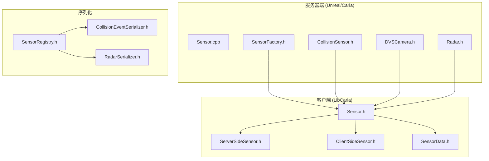
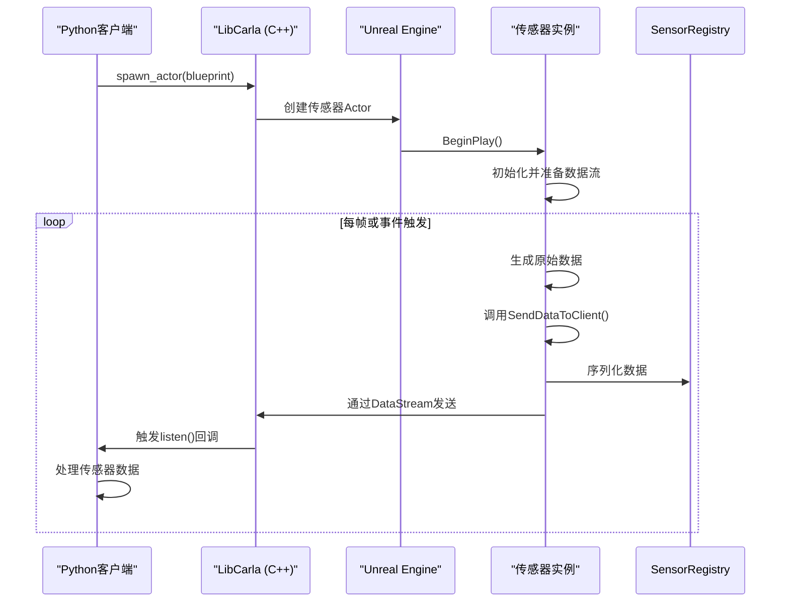
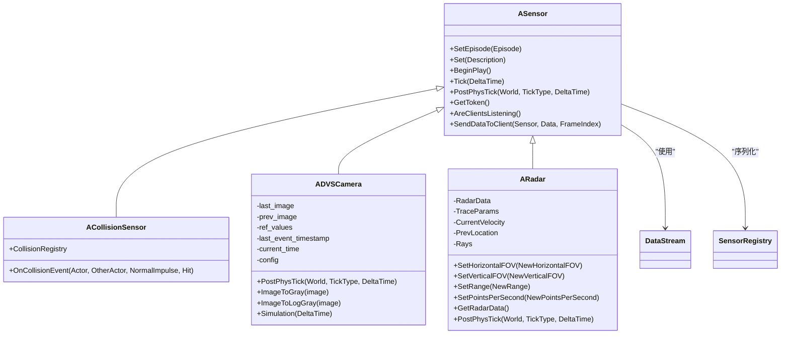
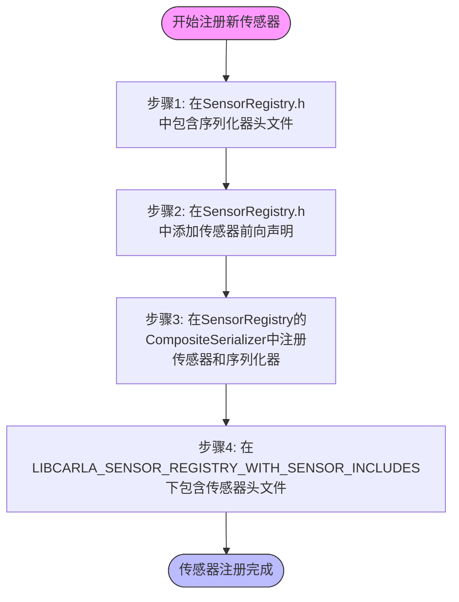

# 自定义传感器开发


**本文档中引用的文件**  
- [Sensor.h](https://github.com/carla-simulator/carla/blob/ue5-dev/LibCarla/source/carla/client/Sensor.h)
- [SensorRegistry.h](https://github.com/carla-simulator/carla/blob/ue5-dev/LibCarla/source/carla/sensor/SensorRegistry.h)
- [ServerSideSensor.h](https://github.com/carla-simulator/carla/blob/ue5-dev/LibCarla/source/carla/client/ServerSideSensor.h)
- [ClientSideSensor.h](https://github.com/carla-simulator/carla/blob/ue5-dev/LibCarla/source/carla/client/ClientSideSensor.h)
- [SensorData.h](https://github.com/carla-simulator/carla/blob/ue5-dev/LibCarla/source/carla/sensor/SensorData.h)
- [Sensor.cpp](https://github.com/carla-simulator/carla/blob/ue5-dev/Unreal/CarlaUnreal/Plugins/Carla/Source/Carla/Sensor/Sensor.cpp)
- [Sensor.h](https://github.com/carla-simulator/carla/blob/ue5-dev/Unreal/CarlaUnreal/Plugins/Carla/Source/Carla/Sensor/Sensor.h)
- [SensorFactory.h](https://github.com/carla-simulator/carla/blob/ue5-dev/Unreal/CarlaUnreal/Plugins/Carla/Source/Carla/Sensor/SensorFactory.h)
- [CollisionSensor.h](https://github.com/carla-simulator/carla/blob/ue5-dev/Unreal/CarlaUnreal/Plugins/Carla/Source/Carla/Sensor/CollisionSensor.h)
- [DVSCamera.h](https://github.com/carla-simulator/carla/blob/ue5-dev/Unreal/CarlaUnreal/Plugins/Carla/Source/Carla/Sensor/DVSCamera.h)
- [Radar.h](https://github.com/carla-simulator/carla/blob/ue5-dev/Unreal/CarlaUnreal/Plugins/Carla/Source/Carla/Sensor/Radar.h)
- [CollisionEventSerializer.h](https://github.com/carla-simulator/carla/blob/ue5-dev/LibCarla/source/carla/sensor/s11n/CollisionEventSerializer.h)
- [RadarSerializer.h](https://github.com/carla-simulator/carla/blob/ue5-dev/LibCarla/source/carla/sensor/s11n/RadarSerializer.h)
- [core_sensors.md](https://github.com/carla-simulator/carla/blob/ue5-dev/Docs/core_sensors.md)


## 目录
1. [引言](#引言)
2. [项目结构](#项目结构)
3. [核心组件](#核心组件)
4. [架构概述](#架构概述)
5. [详细组件分析](#详细组件分析)
6. [依赖分析](#依赖分析)
7. [性能考虑](#性能考虑)
8. [故障排除指南](#故障排除指南)
9. [结论](#结论)

## 引言
本文档深入探讨CARLA模拟器中的自定义传感器开发，重点分析其传感器架构。文档详细解释了`Sensor.h`和`SensorRegistry.h`中的核心类与注册机制，以及如何通过继承基类创建新的传感器类型。同时，文档描述了从Unreal Engine到客户端的完整传感器数据流路径，包括序列化格式和通信协议，并提供创建自定义传感器的完整示例，涵盖C++实现、蓝图集成和Python API暴露。

## 项目结构
CARLA的传感器系统分布在多个目录中，主要分为客户端（LibCarla）和服务器端（Unreal插件）两大部分。客户端负责与Python API交互，而服务器端在Unreal Engine中实现传感器逻辑。



**图示来源**
- [Sensor.h](https://github.com/carla-simulator/carla/blob/ue5-dev/LibCarla/source/carla/client/Sensor.h#L1-L37)
- [SensorRegistry.h](https://github.com/carla-simulator/carla/blob/ue5-dev/LibCarla/source/carla/sensor/SensorRegistry.h#L1-L113)
- [Sensor.h](https://github.com/carla-simulator/carla/blob/ue5-dev/Unreal/CarlaUnreal/Plugins/Carla/Source/Carla/Sensor/Sensor.h#L1-L278)

**本节来源**
- [Sensor.h](https://github.com/carla-simulator/carla/blob/ue5-dev/LibCarla/source/carla/client/Sensor.h#L1-L37)
- [SensorRegistry.h](https://github.com/carla-simulator/carla/blob/ue5-dev/LibCarla/source/carla/sensor/SensorRegistry.h#L1-L113)
- [core_sensors.md](https://github.com/carla-simulator/carla/blob/ue5-dev/Docs/core_sensors.md#L1-L198)

## 核心组件
CARLA的传感器系统由几个核心组件构成：`Sensor`基类定义了所有传感器的公共接口，`SensorRegistry`管理所有传感器类型的注册和序列化，`SensorData`是所有传感器数据的基类，而`DataStream`处理传感器数据的流式传输。

**本节来源**
- [Sensor.h](https://github.com/carla-simulator/carla/blob/ue5-dev/LibCarla/source/carla/client/Sensor.h#L1-L37)
- [SensorData.h](https://github.com/carla-simulator/carla/blob/ue5-dev/LibCarla/source/carla/sensor/SensorData.h#L1-L73)
- [SensorRegistry.h](https://github.com/carla-simulator/carla/blob/ue5-dev/LibCarla/source/carla/sensor/SensorRegistry.h#L1-L113)

## 架构概述
CARLA的传感器架构采用客户端-服务器模式，传感器在Unreal Engine中实现并生成数据，然后通过序列化和流式传输机制将数据发送到客户端。



**图示来源**
- [Sensor.h](https://github.com/carla-simulator/carla/blob/ue5-dev/LibCarla/source/carla/client/Sensor.h#L1-L37)
- [Sensor.h](https://github.com/carla-simulator/carla/blob/ue5-dev/Unreal/CarlaUnreal/Plugins/Carla/Source/Carla/Sensor/Sensor.h#L1-L278)
- [core_sensors.md](https://github.com/carla-simulator/carla/blob/ue5-dev/Docs/core_sensors.md#L1-L198)

## 详细组件分析

### 传感器基类分析
CARLA的传感器系统基于继承架构，所有传感器都继承自`ASensor`基类，该类提供了基本功能如数据流管理、时间步处理和客户端通信。



**图示来源**
- [Sensor.h](https://github.com/carla-simulator/carla/blob/ue5-dev/Unreal/CarlaUnreal/Plugins/Carla/Source/Carla/Sensor/Sensor.h#L1-L278)
- [CollisionSensor.h](https://github.com/carla-simulator/carla/blob/ue5-dev/Unreal/CarlaUnreal/Plugins/Carla/Source/Carla/Sensor/CollisionSensor.h#L1-L44)
- [DVSCamera.h](https://github.com/carla-simulator/carla/blob/ue5-dev/Unreal/CarlaUnreal/Plugins/Carla/Source/Carla/Sensor/DVSCamera.h#L1-L78)
- [Radar.h](https://github.com/carla-simulator/carla/blob/ue5-dev/Unreal/CarlaUnreal/Plugins/Carla/Source/Carla/Sensor/Radar.h#L1-L94)

**本节来源**
- [Sensor.h](https://github.com/carla-simulator/carla/blob/ue5-dev/Unreal/CarlaUnreal/Plugins/Carla/Source/Carla/Sensor/Sensor.h#L1-L278)
- [CollisionSensor.h](https://github.com/carla-simulator/carla/blob/ue5-dev/Unreal/CarlaUnreal/Plugins/Carla/Source/Carla/Sensor/CollisionSensor.h#L1-L44)
- [DVSCamera.h](https://github.com/carla-simulator/carla/blob/ue5-dev/Unreal/CarlaUnreal/Plugins/Carla/Source/Carla/Sensor/DVSCamera.h#L1-L78)

### 传感器注册机制
CARLA使用模板化的`SensorRegistry`来管理所有传感器类型的注册和序列化。这是一个编译时注册系统，通过包含特定头文件来注册新传感器。



**图示来源**
- [SensorRegistry.h](https://github.com/carla-simulator/carla/blob/ue5-dev/LibCarla/source/carla/sensor/SensorRegistry.h#L1-L113)

**本节来源**
- [SensorRegistry.h](https://github.com/carla-simulator/carla/blob/ue5-dev/LibCarla/source/carla/sensor/SensorRegistry.h#L1-L113)

### 数据流分析
传感器数据从Unreal Engine生成，经过序列化后通过流式传输发送到客户端，最终在Python中被处理。

```mermaid
flowchart LR
A[Unreal Engine] --> B[传感器生成原始数据]
B --> C[调用SendDataToClient()]
C --> D[通过DataStream发送]
D --> E[使用SensorRegistry序列化]
E --> F[通过网络传输]
F --> G[LibCarla反序列化]
G --> H[触发Python回调]
H --> I[用户处理数据]
```

**图示来源**
- [Sensor.h](https://github.com/carla-simulator/carla/blob/ue5-dev/Unreal/CarlaUnreal/Plugins/Carla/Source/Carla/Sensor/Sensor.h#L1-L278)
- [SensorData.h](https://github.com/carla-simulator/carla/blob/ue5-dev/LibCarla/source/carla/sensor/SensorData.h#L1-L73)

**本节来源**
- [Sensor.h](https://github.com/carla-simulator/carla/blob/ue5-dev/Unreal/CarlaUnreal/Plugins/Carla/Source/Carla/Sensor/Sensor.h#L1-L278)
- [SensorData.h](https://github.com/carla-simulator/carla/blob/ue5-dev/LibCarla/source/carla/sensor/SensorData.h#L1-L73)
- [core_sensors.md](https://github.com/carla-simulator/carla/blob/ue5-dev/Docs/core_sensors.md#L1-L198)

## 依赖分析
CARLA的传感器系统涉及多个组件之间的复杂依赖关系，包括客户端、服务器端、序列化和流式传输系统。

```mermaid
graph TD
A[Python API] --> B[LibCarla]
B --> C[Sensor.h]
C --> D[ServerSideSensor.h]
C --> E[ClientSideSensor.h]
C --> F[SensorData.h]
F --> G[RawData.h]
D --> H[DataStream]
H --> I[Buffer]
I --> J[Boost.Asio]
K[Unreal Engine] --> L[ASensor]
L --> M[SensorFactory]
M --> N[SensorRegistry]
N --> O[Serializer]
O --> P[MsgPack]
L --> Q[Episode]
Q --> R[World]
H < --> O
```

**图示来源**
- [Sensor.h](https://github.com/carla-simulator/carla/blob/ue5-dev/LibCarla/source/carla/client/Sensor.h#L1-L37)
- [SensorRegistry.h](https://github.com/carla-simulator/carla/blob/ue5-dev/LibCarla/source/carla/sensor/SensorRegistry.h#L1-L113)
- [Sensor.h](https://github.com/carla-simulator/carla/blob/ue5-dev/Unreal/CarlaUnreal/Plugins/Carla/Source/Carla/Sensor/Sensor.h#L1-L278)

**本节来源**
- [Sensor.h](https://github.com/carla-simulator/carla/blob/ue5-dev/LibCarla/source/carla/client/Sensor.h#L1-L37)
- [SensorRegistry.h](https://github.com/carla-simulator/carla/blob/ue5-dev/LibCarla/source/carla/sensor/SensorRegistry.h#L1-L113)
- [SensorFactory.h](https://github.com/carla-simulator/carla/blob/ue5-dev/Unreal/CarlaUnreal/Plugins/Carla/Source/Carla/Sensor/SensorFactory.h#L1-L30)

## 性能考虑
创建高性能传感器时需要考虑多个因素，包括数据压缩、采样率控制和内存管理。

| 优化技术 | 描述 | 实现建议 |
|---------|------|---------|
| 数据压缩 | 减少传输数据量 | 使用高效的序列化格式如MsgPack，对图像数据使用适当压缩 |
| 采样率控制 | 控制数据生成频率 | 通过`sensor_tick`属性设置合适的采样间隔，避免过度采样 |
| 内存管理 | 优化内存使用 | 使用对象池和缓冲区重用，避免频繁内存分配 |
| 异步处理 | 提高处理效率 | 对于计算密集型传感器，考虑使用异步处理 |
| 批量传输 | 减少通信开销 | 将多个小数据包合并为批量传输 |

**本节来源**
- [Sensor.h](https://github.com/carla-simulator/carla/blob/ue5-dev/Unreal/CarlaUnreal/Plugins/Carla/Source/Carla/Sensor/Sensor.h#L1-L278)
- [core_sensors.md](https://github.com/carla-simulator/carla/blob/ue5-dev/Docs/core_sensors.md#L1-L198)

## 故障排除指南
在开发自定义传感器时可能会遇到一些常见问题，以下是一些解决方案。

**常见问题及解决方案**

| 问题 | 可能原因 | 解决方案 |
|------|--------|---------|
| 传感器数据未到达客户端 | 数据流未正确设置 | 确保调用`SetDataStream()`并检查`AreClientsListening()` |
| 传感器性能低下 | 计算过于密集 | 优化算法，考虑降低分辨率或采样率 |
| 序列化错误 | 数据类型不匹配 | 检查序列化器实现，确保数据结构一致 |
| 内存泄漏 | 缓冲区未正确管理 | 确保正确使用`BufferPool`和智能指针 |
| 蓝图无法识别新传感器 | 未正确注册 | 确保在`SensorFactory`中正确注册新传感器类型 |

**本节来源**
- [Sensor.h](https://github.com/carla-simulator/carla/blob/ue5-dev/Unreal/CarlaUnreal/Plugins/Carla/Source/Carla/Sensor/Sensor.h#L1-L278)
- [SensorFactory.h](https://github.com/carla-simulator/carla/blob/ue5-dev/Unreal/CarlaUnreal/Plugins/Carla/Source/Carla/Sensor/SensorFactory.h#L1-L30)
- [core_sensors.md](https://github.com/carla-simulator/carla/blob/ue5-dev/Docs/core_sensors.md#L1-L198)

## 结论
CARLA的传感器架构提供了一个强大而灵活的框架，用于开发自定义传感器。通过理解`Sensor`基类、`SensorRegistry`注册机制和数据流路径，开发者可以创建满足特定需求的传感器。文档提供了从简单碰撞传感器到高级DVS相机的开发指导，并强调了性能优化和最佳实践的重要性。