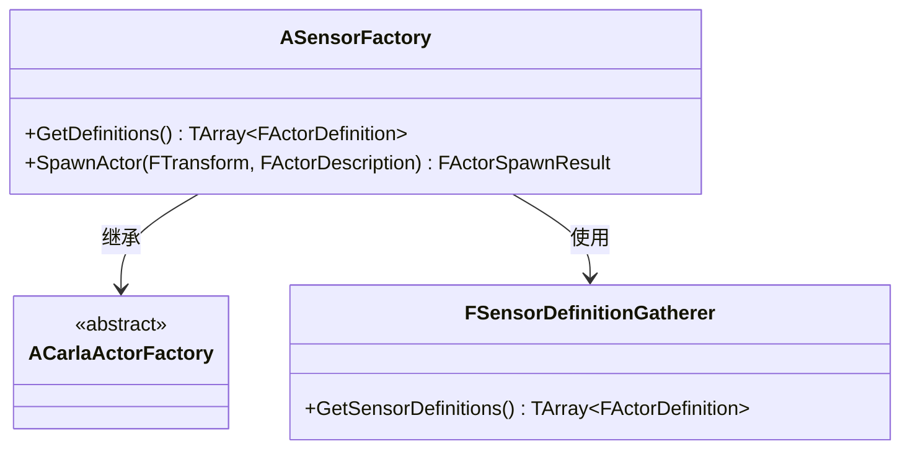
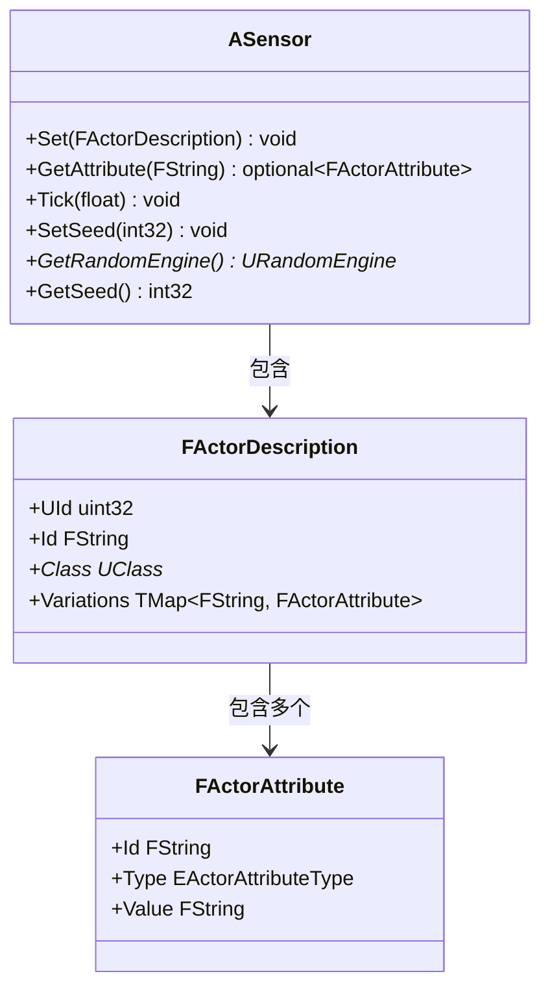
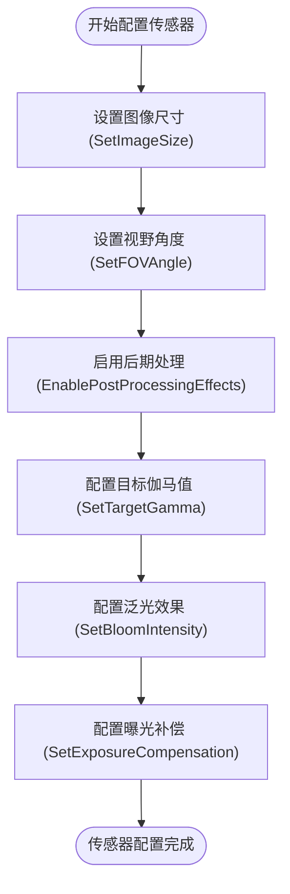
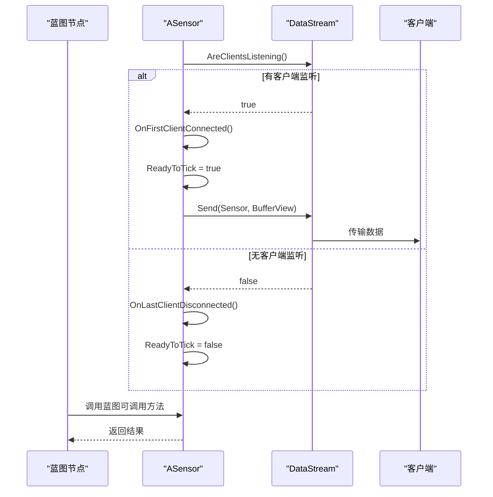
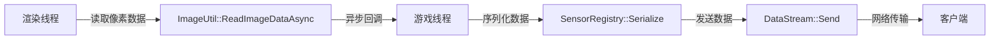
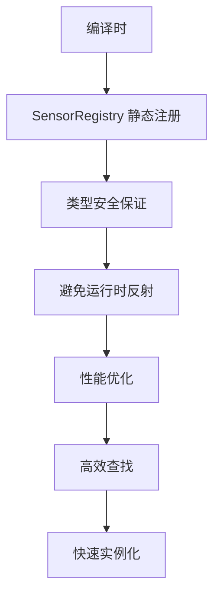

# 蓝图系统集成

> **引用文件**
> **本文档中引用的文件**

- [SensorFactory.cpp](https://github.com/carla-simulator/carla/blob/ue5-dev/Unreal/CarlaUnreal/Plugins/Carla/Source/Carla/Sensor/SensorFactory.cpp)
- [SensorFactory.h](https://github.com/carla-simulator/carla/blob/ue5-dev/Unreal/CarlaUnreal/Plugins/Carla/Source/Carla/Sensor/SensorFactory.h)
- [Sensor.h](https://github.com/carla-simulator/carla/blob/ue5-dev/Unreal/CarlaUnreal/Plugins/Carla/Source/Carla/Sensor/Sensor.h)
- [Sensor.cpp](https://github.com/carla-simulator/carla/blob/ue5-dev/Unreal/CarlaUnreal/Plugins/Carla/Source/Carla/Sensor/Sensor.cpp)
- [ActorBlueprintFunctionLibrary.h](https://github.com/carla-simulator/carla/blob/ue5-dev/Unreal/CarlaUnreal/Plugins/Carla/Source/Carla/Actor/ActorBlueprintFunctionLibrary.h)
- [SceneCaptureSensor.h](https://github.com/carla-simulator/carla/blob/ue5-dev/Unreal/CarlaUnreal/Plugins/Carla/Source/Carla/Sensor/SceneCaptureSensor.h)
- [SensorRegistry.h](https://github.com/carla-simulator/carla/blob/ue5-dev/LibCarla/source/carla/sensor/SensorRegistry.h)
- [ref_sensors.md](https://github.com/carla-simulator/carla/blob/ue5-dev/Docs/ref_sensors.md)

## 目录

1. [简介](#简介)
2. [传感器工厂与反射系统集成](#传感器工厂与反射系统集成)
3. [蓝图中传感器属性的暴露机制](#蓝图中传感器属性的暴露机制)
4. [可配置传感器参数的完整示例](#可配置传感器参数的完整示例)
5. [C++代码与蓝图节点间的数据交换](#c代码与蓝图节点间的数据交换)
6. [跨线程蓝图事件回调处理](#跨线程蓝图事件回调处理)
7. [类型安全与性能考虑](#类型安全与性能考虑)
8. [结论](#结论)

## 简介

本文档详细阐述了 CARLA 模拟器中蓝图系统与自定义传感器的集成机制。重点介绍如何通过反射系统将传感器组件注册到蓝图编辑器中，使其能够在可视化脚本中被使用。文档涵盖了从传感器注册、属性暴露到数据交换的完整流程，并强调了在关键路径上避免昂贵反射操作的重要性。

## 传感器工厂与反射系统集成

CARLA 使用`ASensorFactory`类作为传感器的创建工厂，该工厂通过反射系统注册所有可用的传感器组件，使其出现在蓝图编辑器的添加组件菜单中。`ASensorFactory`继承自`ACarlaActorFactory`，并实现了`GetDefinitions()`方法来获取所有注册传感器的定义。

传感器注册的核心机制位于`SensorRegistry.h`文件中，该文件通过模板元编程技术静态注册所有传感器类型及其序列化器。每个传感器类型在编译时被注册到`SensorRegistry`中，确保了高效的类型查找和实例化。

**图表来源**

- <a href="https://github.com/carla-simulator/carla/blob/ue5-dev/Unreal/CarlaUnreal/Plugins/Carla/Source/Carla/Sensor/SensorFactory.cpp#L98-L101" target="_blank">SensorFactory.cpp</a>
- <a href="https://github.com/carla-simulator/carla/blob/ue5-dev/Unreal/CarlaUnreal/Plugins/Carla/Source/Carla/Sensor/SensorFactory.h#L17-L29" target="_blank">SensorFactory.h</a>
- <a href="https://github.com/carla-simulator/carla/blob/ue5-dev/LibCarla/source/carla/sensor/SensorRegistry.h#L57-L84" target="_blank">SensorRegistry.h</a>

**本节来源**

- <a href="https://github.com/carla-simulator/carla/blob/ue5-dev/Unreal/CarlaUnreal/Plugins/Carla/Source/Carla/Sensor/SensorFactory.cpp#L1-L160" target="_blank">SensorFactory.cpp</a>
- <a href="https://github.com/carla-simulator/carla/blob/ue5-dev/LibCarla/source/carla/sensor/SensorRegistry.h#L1-L113" target="_blank">SensorRegistry.h</a>

## 蓝图中传感器属性的暴露机制

在 CARLA 中，传感器属性通过`UPROPERTY`宏暴露给蓝图系统，使得这些属性可以在蓝图编辑器中进行可视化配置。`UPROPERTY`宏的使用需要遵循特定的规范和元数据配置，以确保属性能够正确地在蓝图中显示和编辑。

传感器基类`ASensor`定义了多个可通过蓝图访问的属性和方法。例如，`Seed`属性使用`EditAnywhere`元数据，允许在编辑器中直接修改随机种子值。同时，`BlueprintCallable`标记的方法可以在蓝图中作为节点调用。

**图表来源**

- <a href="https://github.com/carla-simulator/carla/blob/ue5-dev/Unreal/CarlaUnreal/Plugins/Carla/Source/Carla/Sensor/Sensor.h#L70-L277" target="_blank">Sensor.h</a>
- <a href="https://github.com/carla-simulator/carla/blob/ue5-dev/Unreal/CarlaUnreal/Plugins/Carla/Source/Carla/Sensor/Sensor.cpp#L38-L96" target="_blank">Sensor.cpp</a>

**本节来源**

- <a href="https://github.com/carla-simulator/carla/blob/ue5-dev/Unreal/CarlaUnreal/Plugins/Carla/Source/Carla/Sensor/Sensor.h#L249-L254" target="_blank">Sensor.h</a>
- <a href="https://github.com/carla-simulator/carla/blob/ue5-dev/Unreal/CarlaUnreal/Plugins/Carla/Source/Carla/Sensor/Sensor.cpp#L38-L60" target="_blank">Sensor.cpp</a>

## 可配置传感器参数的完整示例

以下示例展示了如何创建一个可配置的传感器参数并在蓝图中动态调整。以`ASceneCaptureSensor`为例，该传感器提供了多个可通过蓝图配置的属性，如图像尺寸、视野角度、后期处理效果等。

传感器参数的配置通过`FActorDescription`结构体传递，该结构体包含了传感器的所有可配置属性。在`ASensor::Set()`方法中，这些属性被解析并应用到传感器实例上。

**图表来源**

- <a href="https://github.com/carla-simulator/carla/blob/ue5-dev/Unreal/CarlaUnreal/Plugins/Carla/Source/Carla/Sensor/SceneCaptureSensor.h#L152-L550" target="_blank">SceneCaptureSensor.h</a>
- <a href="https://github.com/carla-simulator/carla/blob/ue5-dev/Unreal/CarlaUnreal/Plugins/Carla/Source/Carla/Sensor/Sensor.cpp#L38-L49" target="_blank">Sensor.cpp</a>

**本节来源**

- <a href="https://github.com/carla-simulator/carla/blob/ue5-dev/Unreal/CarlaUnreal/Plugins/Carla/Source/Carla/Sensor/SceneCaptureSensor.h#L164-L550" target="_blank">SceneCaptureSensor.h</a>
- <a href="https://github.com/carla-simulator/carla/blob/ue5-dev/Docs/ref_sensors.md#L161-L177" target="_blank">ref_sensors.md</a>

## C++代码与蓝图节点间的数据交换

CARLA 实现了高效的 C++代码与蓝图节点之间的数据交换机制。传感器数据通过`DataStream`系统进行传输，该系统负责管理传感器数据的序列化和网络传输。

当传感器检测到有客户端监听时，会触发`OnFirstClientConnected()`回调；当所有客户端断开连接时，会触发`OnLastClientDisconnected()`回调。这种机制确保了传感器只在需要时才生成数据，提高了系统性能。

**图表来源**

- <a href="https://github.com/carla-simulator/carla/blob/ue5-dev/Unreal/CarlaUnreal/Plugins/Carla/Source/Carla/Sensor/Sensor.cpp#L62-L85" target="_blank">Sensor.cpp</a>
- <a href="https://github.com/carla-simulator/carla/blob/ue5-dev/Unreal/CarlaUnreal/Plugins/Carla/Source/Carla/Sensor/Sensor.h#L123-L125" target="_blank">Sensor.h</a>

**本节来源**

- <a href="https://github.com/carla-simulator/carla/blob/ue5-dev/Unreal/CarlaUnreal/Plugins/Carla/Source/Carla/Sensor/Sensor.cpp#L62-L85" target="_blank">Sensor.cpp</a>
- <a href="https://github.com/carla-simulator/carla/blob/ue5-dev/Unreal/CarlaUnreal/Plugins/Carla/Source/Carla/Sensor/Sensor.h#L113-L116" target="_blank">Sensor.h</a>

## 跨线程蓝图事件回调处理

CARLA 的传感器系统需要处理跨线程的事件回调，特别是在渲染线程和游戏线程之间传递数据。为了确保线程安全，CARLA 使用了异步数据流机制来处理传感器数据的传输。

`SendDataToClient`静态方法是处理跨线程数据传输的核心，它通过`Async`系统将数据从渲染线程安全地传递到游戏线程。该方法使用`TArrayView`来避免数据复制，提高了性能。

**图表来源**

- <a href="https://github.com/carla-simulator/carla/blob/ue5-dev/Unreal/CarlaUnreal/Plugins/Carla/Source/Carla/Sensor/Sensor.h#L173-L246" target="_blank">Sensor.h</a>
- [ImageUtil.h](https://github.com/carla-simulator/carla/blob/ue5-dev/Unreal/CarlaUnreal/Plugins/Carla/Source/Carla/Sensor/ImageUtil.h)

**本节来源**

- <a href="https://github.com/carla-simulator/carla/blob/ue5-dev/Unreal/CarlaUnreal/Plugins/Carla/Source/Carla/Sensor/Sensor.h#L173-L246" target="_blank">Sensor.h</a>

## 类型安全与性能考虑

在 CARLA 的蓝图系统集成中，类型安全和性能是两个关键考虑因素。系统通过静态类型注册和编译时检查来确保类型安全，避免了运行时类型错误。

为了优化性能，CARLA 在关键路径上避免了昂贵的反射操作。传感器注册在编译时完成，使用模板元编程技术生成高效的查找表。数据序列化也通过静态注册的序列化器完成，避免了运行时的类型查找开销。

此外，系统通过`not_spawnable`类型特征来控制哪些传感器可以被用户直接创建，这提供了一种编译时的安全检查机制。

**图表来源**

- <a href="https://github.com/carla-simulator/carla/blob/ue5-dev/LibCarla/source/carla/sensor/SensorRegistry.h#L57-L84" target="_blank">SensorRegistry.h</a>
- <a href="https://github.com/carla-simulator/carla/blob/ue5-dev/Unreal/CarlaUnreal/Plugins/Carla/Source/Carla/Sensor/SensorFactory.cpp#L50-L60" target="_blank">SensorFactory.cpp</a>

**本节来源**

- <a href="https://github.com/carla-simulator/carla/blob/ue5-dev/LibCarla/source/carla/sensor/SensorRegistry.h#L57-L84" target="_blank">SensorRegistry.h</a>
- <a href="https://github.com/carla-simulator/carla/blob/ue5-dev/Unreal/CarlaUnreal/Plugins/Carla/Source/Carla/Sensor/SensorFactory.cpp#L50-L60" target="_blank">SensorFactory.cpp</a>

## 结论

CARLA 的蓝图系统集成为自定义传感器的开发提供了完整的框架。通过`SensorFactory`和`SensorRegistry`的协同工作，传感器能够自动注册到蓝图系统中。使用`UPROPERTY`和`BlueprintCallable`宏可以方便地将传感器属性和方法暴露给蓝图编辑器。系统的数据交换机制和跨线程回调处理确保了高性能和线程安全。开发者在创建自定义传感器时，应遵循这些模式和最佳实践，以确保与 CARLA 系统的良好集成和高性能表现。
