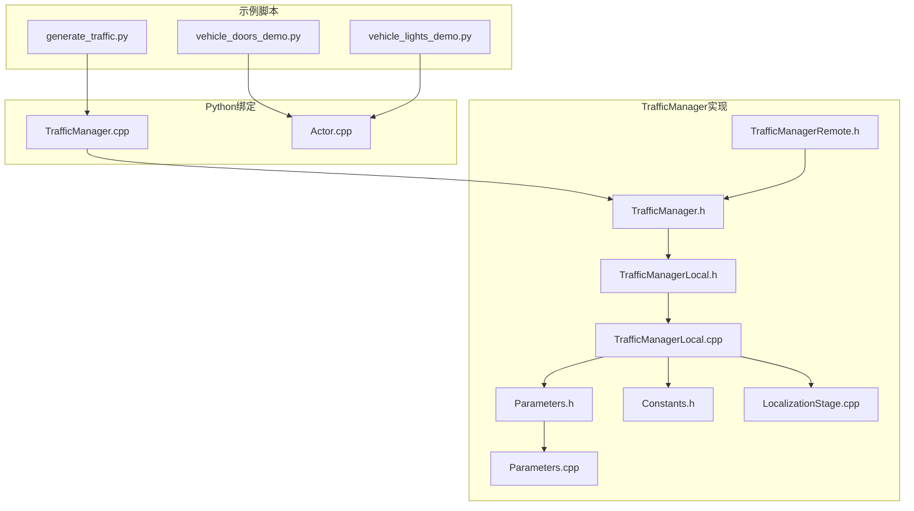
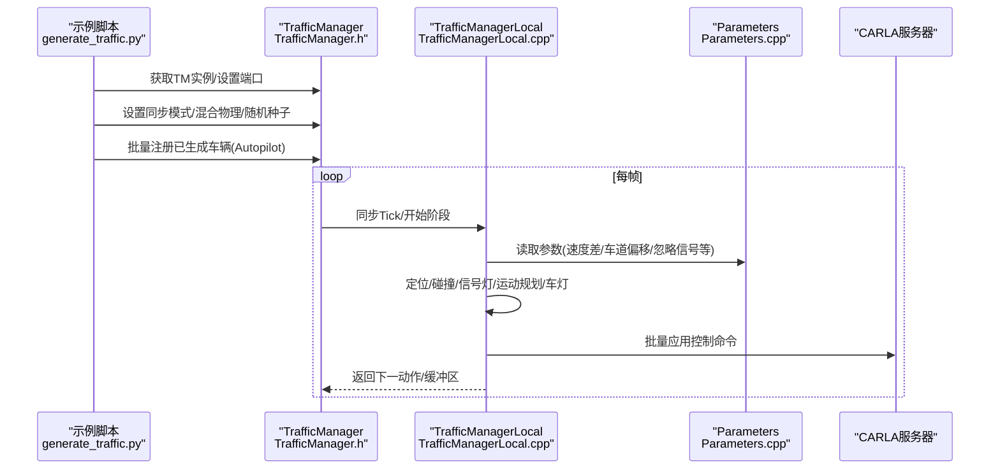
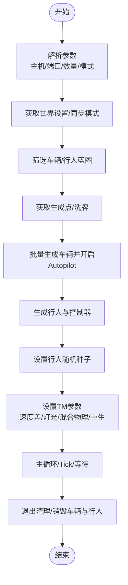
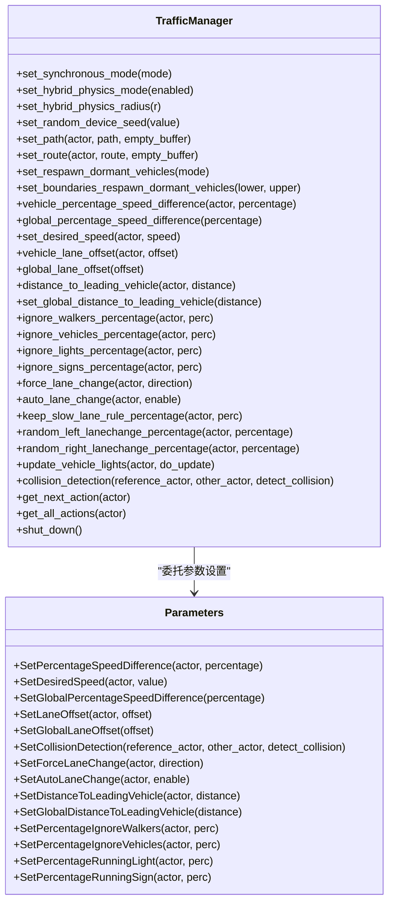
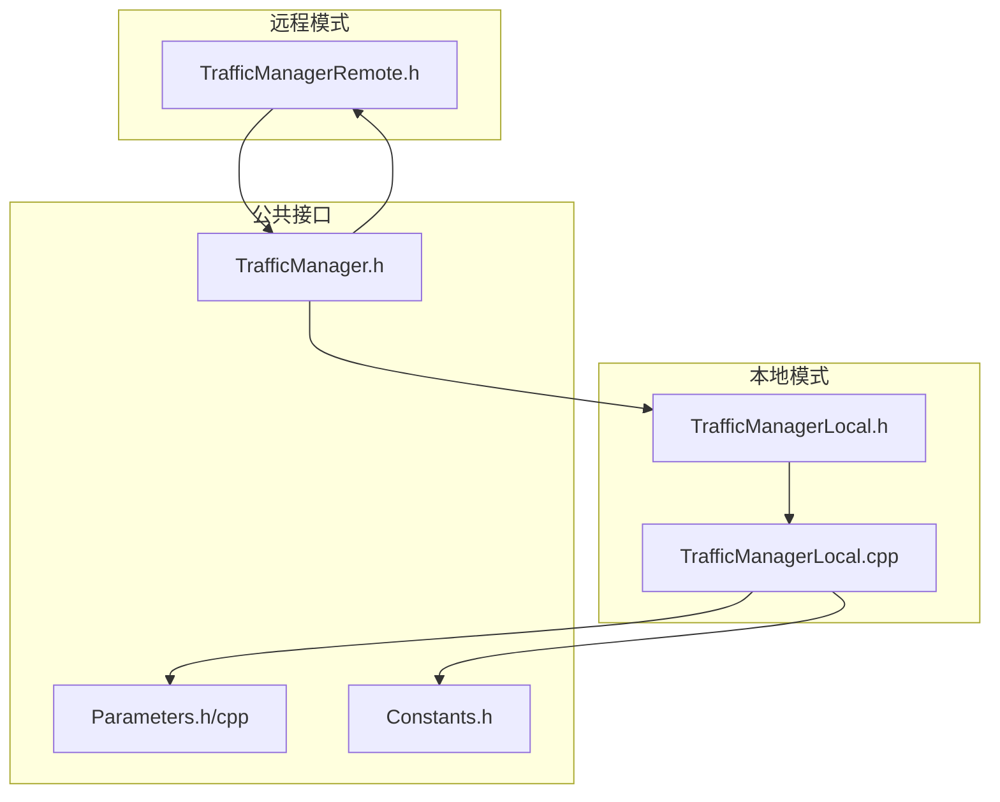
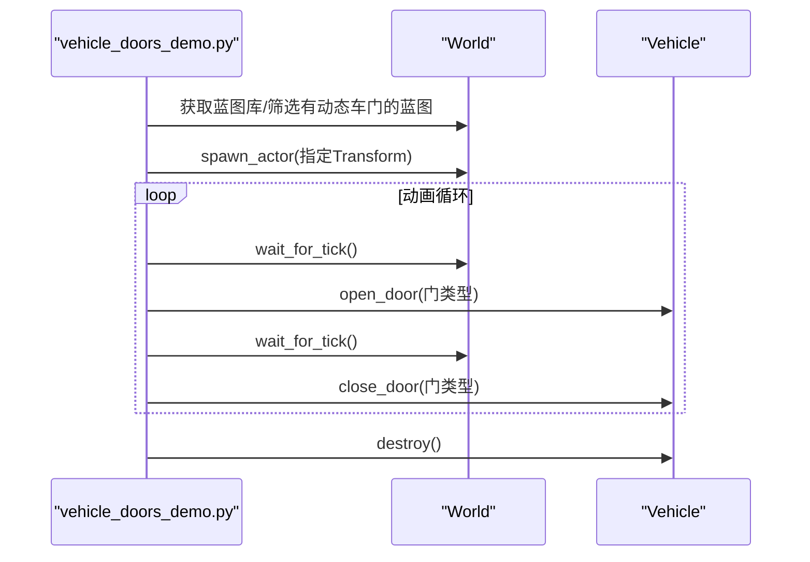
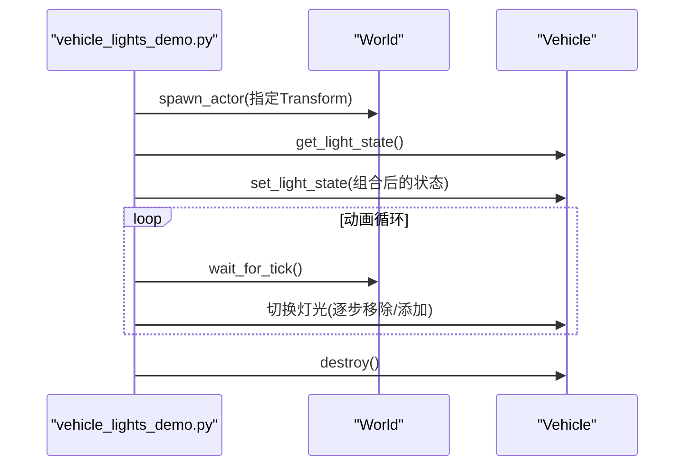
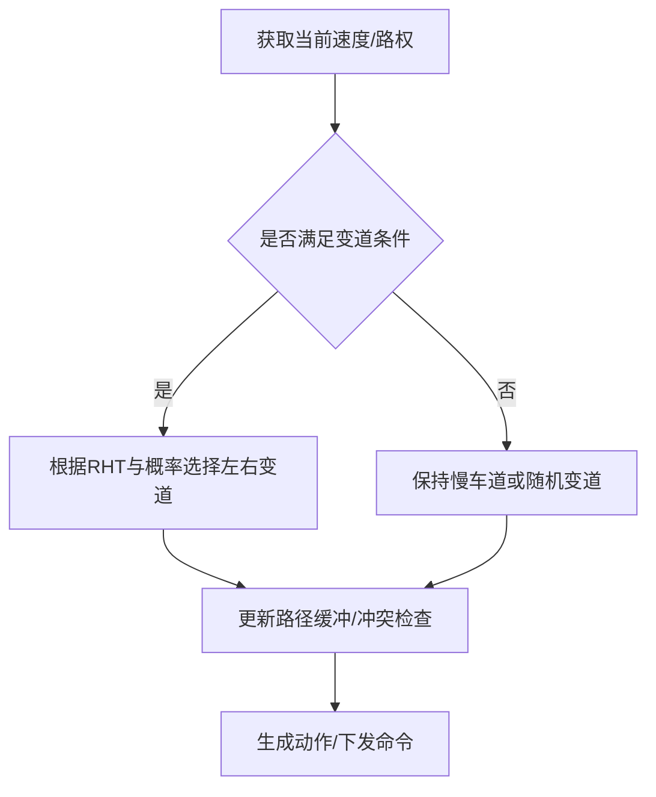
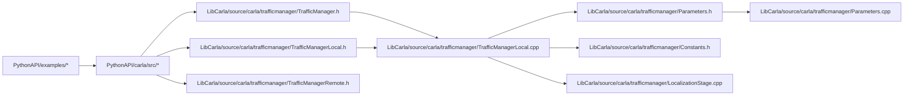

# 交通场景生成与管理

**本文引用的文件**
- [generate_traffic.py](https://github.com/carla-simulator/carla/blob/ue5-dev/PythonAPI/examples/generate_traffic.py)
- [vehicle_doors_demo.py](https://github.com/carla-simulator/carla/blob/ue5-dev/PythonAPI/examples/vehicle_doors_demo.py)
- [vehicle_lights_demo.py](https://github.com/carla-simulator/carla/blob/ue5-dev/PythonAPI/examples/vehicle_lights_demo.py)
- [TrafficManager.h](https://github.com/carla-simulator/carla/blob/ue5-dev/LibCarla/source/carla/trafficmanager/TrafficManager.h)
- [TrafficManagerLocal.h](https://github.com/carla-simulator/carla/blob/ue5-dev/LibCarla/source/carla/trafficmanager/TrafficManagerLocal.h)
- [TrafficManagerLocal.cpp](https://github.com/carla-simulator/carla/blob/ue5-dev/LibCarla/source/carla/trafficmanager/TrafficManagerLocal.cpp)
- [TrafficManagerRemote.h](https://github.com/carla-simulator/carla/blob/ue5-dev/LibCarla/source/carla/trafficmanager/TrafficManagerRemote.h)
- [Parameters.h](https://github.com/carla-simulator/carla/blob/ue5-dev/LibCarla/source/carla/trafficmanager/Parameters.h)
- [Parameters.cpp](https://github.com/carla-simulator/carla/blob/ue5-dev/LibCarla/source/carla/trafficmanager/Parameters.cpp)
- [Constants.h](https://github.com/carla-simulator/carla/blob/ue5-dev/LibCarla/source/carla/trafficmanager/Constants.h)
- [LocalizationStage.cpp](https://github.com/carla-simulator/carla/blob/ue5-dev/LibCarla/source/carla/trafficmanager/LocalizationStage.cpp)
- [TrafficManager.cpp](https://github.com/carla-simulator/carla/blob/ue5-dev/PythonAPI/carla/src/TrafficManager.cpp)
- [Actor.cpp](https://github.com/carla-simulator/carla/blob/ue5-dev/PythonAPI/carla/src/Actor.cpp)
- [VehicleDoor.h](https://github.com/carla-simulator/carla/blob/ue5-dev/LibCarla/source/carla/rpc/VehicleDoor.h)
- [VehicleLightState.h](https://github.com/carla-simulator/carla/blob/ue5-dev/LibCarla/source/carla/rpc/VehicleLightState.h)
- [tuto_G_traffic_manager.md](https://github.com/carla-simulator/carla/blob/ue5-dev/Docs/tuto_G_traffic_manager.md)
- [adv_traffic_manager.md](https://github.com/carla-simulator/carla/blob/ue5-dev/Docs/adv_traffic_manager.md)

## 目录
1. [简介](#简介)
2. [项目结构](#项目结构)
3. [核心组件](#核心组件)
4. [架构总览](#架构总览)
5. [详细组件分析](#详细组件分析)
6. [依赖关系分析](#依赖关系分析)
7. [性能考量](#性能考量)
8. [故障排查指南](#故障排查指南)
9. [结论](#结论)
10. [附录](#附录)

## 简介
本文件围绕CARLA中的交通场景生成与管理展开，结合generate_traffic.py示例，系统讲解如何批量生成车辆与行人、配置Traffic Manager（TM）参数（如车辆密度、速度限制、碰撞避免、车道保持/变道策略、灯光自动管理等），并解释TM的本地与远程模式及其适用场景。同时，通过vehicle_doors_demo.py与vehicle_lights_demo.py示例，演示如何控制车辆车门与车灯等高级功能。最后给出创建自定义交通行为、处理交通冲突以及优化大规模交通仿真的最佳实践与流程图。

## 项目结构
- 示例脚本位于PythonAPI/examples目录：
  - generate_traffic.py：批量生成车辆与行人，设置TM参数，支持同步/异步/混合物理模式。
  - vehicle_doors_demo.py：可视化车门开关动画。
  - vehicle_lights_demo.py：可视化车灯状态切换。
- Traffic Manager核心实现位于LibCarla/source/carla/trafficmanager：
  - TrafficManager.h/Local.h/Local.cpp/Remote.h：TM接口、本地执行器、远程执行器与客户端封装。
  - Parameters.h/cpp：参数存储与Setter方法。
  - Constants.h：网络、移除阈值、混合物理、速度阈值等常量。
  - LocalizationStage.cpp：路径规划与车道变更决策。
- Python绑定位于PythonAPI/carla/src：
  - TrafficManager.cpp：导出TM的Python API。
  - Actor.cpp：导出VehicleDoor与VehicleLightState枚举。
- 文档位于Docs：
  - tuto_G_traffic_manager.md：基础教程与路径/路由设置。
  - adv_traffic_manager.md：架构、多TM、同步模式、混合物理等进阶内容。

图表来源
- [generate_traffic.py](https://github.com/carla-simulator/carla/blob/ue5-dev/PythonAPI/examples/generate_traffic.py#L1-L327)
- [vehicle_doors_demo.py](https://github.com/carla-simulator/carla/blob/ue5-dev/PythonAPI/examples/vehicle_doors_demo.py#L1-L113)
- [vehicle_lights_demo.py](https://github.com/carla-simulator/carla/blob/ue5-dev/PythonAPI/examples/vehicle_lights_demo.py#L1-L124)
- [TrafficManager.cpp](https://github.com/carla-simulator/carla/blob/ue5-dev/PythonAPI/carla/src/TrafficManager.cpp#L1-L114)
- [Actor.cpp](https://github.com/carla-simulator/carla/blob/ue5-dev/PythonAPI/carla/src/Actor.cpp#L170-L183)
- [TrafficManager.h](https://github.com/carla-simulator/carla/blob/ue5-dev/LibCarla/source/carla/trafficmanager/TrafficManager.h#L200-L399)
- [TrafficManagerLocal.h](https://github.com/carla-simulator/carla/blob/ue5-dev/LibCarla/source/carla/trafficmanager/TrafficManagerLocal.h#L120-L286)
- [TrafficManagerLocal.cpp](https://github.com/carla-simulator/carla/blob/ue5-dev/LibCarla/source/carla/trafficmanager/TrafficManagerLocal.cpp#L1-L483)
- [TrafficManagerRemote.h](https://github.com/carla-simulator/carla/blob/ue5-dev/LibCarla/source/carla/trafficmanager/TrafficManagerRemote.h#L1-L135)
- [Parameters.h](https://github.com/carla-simulator/carla/blob/ue5-dev/LibCarla/source/carla/trafficmanager/Parameters.h#L103-L136)
- [Parameters.cpp](https://github.com/carla-simulator/carla/blob/ue5-dev/LibCarla/source/carla/trafficmanager/Parameters.cpp#L43-L77)
- [Constants.h](https://github.com/carla-simulator/carla/blob/ue5-dev/LibCarla/source/carla/trafficmanager/Constants.h#L2-L44)
- [LocalizationStage.cpp](https://github.com/carla-simulator/carla/blob/ue5-dev/LibCarla/source/carla/trafficmanager/LocalizationStage.cpp#L107-L130)

章节来源
- [generate_traffic.py](https://github.com/carla-simulator/carla/blob/ue5-dev/PythonAPI/examples/generate_traffic.py#L1-L327)
- [tuto_G_traffic_manager.md](https://github.com/carla-simulator/carla/blob/ue5-dev/Docs/tuto_G_traffic_manager.md#L1-L227)
- [adv_traffic_manager.md](https://github.com/carla-simulator/carla/blob/ue5-dev/Docs/adv_traffic_manager.md#L1-L548)

## 核心组件
- Traffic Manager（TM）：在客户端侧运行，负责自动驾驶NPC车辆的行为控制与生命周期管理。通过阶段化流水线（定位、碰撞、信号灯、运动规划、车灯）计算每帧命令，并批量应用到服务器。
- 参数系统（Parameters）：集中管理速度差、车道偏移、碰撞检测、强制/自动变道、忽略信号/标志、全局距离、随机性种子、混合物理半径等。
- 本地/远程模式：
  - 本地模式（TrafficManagerLocal）：单进程内完整执行，适合单机仿真或小规模多客户端。
  - 远程模式（TrafficManagerRemote）：作为客户端连接TM服务器，统一控制多个客户端或跨进程场景。
- 车辆灯光与车门控制：通过VehicleLightState与VehicleDoor枚举进行位操作与按门控制。

章节来源
- [TrafficManager.h](https://github.com/carla-simulator/carla/blob/ue5-dev/LibCarla/source/carla/trafficmanager/TrafficManager.h#L200-L399)
- [TrafficManagerLocal.h](https://github.com/carla-simulator/carla/blob/ue5-dev/LibCarla/source/carla/trafficmanager/TrafficManagerLocal.h#L180-L286)
- [Parameters.h](https://github.com/carla-simulator/carla/blob/ue5-dev/LibCarla/source/carla/trafficmanager/Parameters.h#L103-L136)
- [Parameters.cpp](https://github.com/carla-simulator/carla/blob/ue5-dev/LibCarla/source/carla/trafficmanager/Parameters.cpp#L43-L77)
- [TrafficManagerRemote.h](https://github.com/carla-simulator/carla/blob/ue5-dev/LibCarla/source/carla/trafficmanager/TrafficManagerRemote.h#L1-L135)
- [Actor.cpp](https://github.com/carla-simulator/carla/blob/ue5-dev/PythonAPI/carla/src/Actor.cpp#L170-L183)
- [VehicleLightState.h](https://github.com/carla-simulator/carla/blob/ue5-dev/LibCarla/source/carla/rpc/VehicleLightState.h#L1-L109)
- [VehicleDoor.h](https://github.com/carla-simulator/carla/blob/ue5-dev/LibCarla/source/carla/rpc/VehicleDoor.h#L1-L29)

## 架构总览
TM采用“阶段化流水线+同步屏障”的控制循环，确保所有车辆在同一帧内完成同一阶段的计算，再进入下一阶段。各阶段职责如下：
- 定位阶段：根据当前轨迹与地图网格生成近未来路径，评估潜在冲突与优先级。
- 碰撞阶段：沿路径扩展边界框，识别真实碰撞风险。
- 信号灯阶段：识别红灯/停止标志/无号令交叉口等影响因素。
- 运动规划阶段：综合路径与风险，使用PID控制器生成油门/刹车/转向指令。
- 车灯阶段：依据环境与动作动态更新车灯状态。

图表来源
- [generate_traffic.py](https://github.com/carla-simulator/carla/blob/ue5-dev/PythonAPI/examples/generate_traffic.py#L100-L210)
- [TrafficManager.h](https://github.com/carla-simulator/carla/blob/ue5-dev/LibCarla/source/carla/trafficmanager/TrafficManager.h#L289-L328)
- [TrafficManagerLocal.cpp](https://github.com/carla-simulator/carla/blob/ue5-dev/LibCarla/source/carla/trafficmanager/TrafficManagerLocal.cpp#L236-L335)
- [Parameters.cpp](https://github.com/carla-simulator/carla/blob/ue5-dev/LibCarla/source/carla/trafficmanager/Parameters.cpp#L43-L77)

章节来源
- [adv_traffic_manager.md](https://github.com/carla-simulator/carla/blob/ue5-dev/Docs/adv_traffic_manager.md#L183-L253)
- [TrafficManagerLocal.cpp](https://github.com/carla-simulator/carla/blob/ue5-dev/LibCarla/source/carla/trafficmanager/TrafficManagerLocal.cpp#L236-L335)

## 详细组件分析

### 组件A：批量生成车辆与行人（generate_traffic.py）
- 蓝图筛选与生成
  - 支持按过滤器与代际选择车辆/行人蓝图；可安全过滤（仅保留非事故倾向车辆）。
  - 使用世界地图的预设生成点，若请求数量超过可用点数则警告并调整。
- 同步/异步/混合物理/渲染模式
  - 默认启用同步模式与固定步长；可通过参数切换异步模式、混合物理模式（半径默认50米）、渲染模式关闭。
  - 可设置随机种子以保证确定性。
- 车辆与行人的批量生成
  - 车辆：为每个蓝图设置颜色、驾驶员ID、role_name（hero或autopilot），并批量Spawn+SetAutopilot。
  - 行人：随机导航点、设置最大步行/跑步速度、生成控制器并启动。
- TM参数示例
  - 全局速度差、响应式重生、自动车灯更新、全局最小跟车距离等。

图表来源
- [generate_traffic.py](https://github.com/carla-simulator/carla/blob/ue5-dev/PythonAPI/examples/generate_traffic.py#L43-L327)

章节来源
- [generate_traffic.py](https://github.com/carla-simulator/carla/blob/ue5-dev/PythonAPI/examples/generate_traffic.py#L43-L327)

### 组件B：Traffic Manager参数与行为控制
- 关键参数Setter（Python API导出）
  - 速度差：车辆百分比速度差、全局速度差；期望速度（覆盖百分比）。
  - 车道：车道偏移（全局/单体）、强制/自动变道、左右变道概率。
  - 碰撞与信号：忽略行人/车辆碰撞概率、忽略红灯/标志概率、与特定目标的碰撞检测开关。
  - 距离：与前车距离（全局/单体）、保持慢车道概率。
  - 同步/混合物理：同步模式、混合物理开关与半径、随机种子。
  - 路径/路线：自定义路径、导入路线。
  - 唤醒/重生：自动重生休眠车辆及边界。
- 参数存储与约束
  - 百分比速度差上限、期望速度非负、全局/单体参数分离。
  - 强制/自动变道、忽略概率等均通过Parameters集中管理。

图表来源
- [TrafficManager.cpp](https://github.com/carla-simulator/carla/blob/ue5-dev/PythonAPI/carla/src/TrafficManager.cpp#L76-L114)
- [TrafficManager.h](https://github.com/carla-simulator/carla/blob/ue5-dev/LibCarla/source/carla/trafficmanager/TrafficManager.h#L200-L399)
- [Parameters.h](https://github.com/carla-simulator/carla/blob/ue5-dev/LibCarla/source/carla/trafficmanager/Parameters.h#L103-L136)
- [Parameters.cpp](https://github.com/carla-simulator/carla/blob/ue5-dev/LibCarla/source/carla/trafficmanager/Parameters.cpp#L43-L77)

章节来源
- [TrafficManager.cpp](https://github.com/carla-simulator/carla/blob/ue5-dev/PythonAPI/carla/src/TrafficManager.cpp#L76-L114)
- [TrafficManager.h](https://github.com/carla-simulator/carla/blob/ue5-dev/LibCarla/source/carla/trafficmanager/TrafficManager.h#L200-L399)
- [Parameters.cpp](https://github.com/carla-simulator/carla/blob/ue5-dev/LibCarla/source/carla/trafficmanager/Parameters.cpp#L43-L77)

### 组件C：本地与远程模式及其使用场景
- 本地模式（TrafficManagerLocal）
  - 单进程内完整执行，适合单机仿真或小规模多客户端；支持同步/异步、混合物理、路径/路线导入、重生边界设置等。
- 远程模式（TrafficManagerRemote）
  - 作为客户端连接TM服务器，统一控制多个客户端或跨进程场景；服务器端决定行为，客户端跟随。
- 使用建议
  - 多客户端/多仿真：优先使用远程模式，由单一TM服务器统一调度。
  - 小规模/单机：本地模式更简单直接。
  - 确保同步模式一致性，避免多TM同时设为同步导致阻塞。

图表来源
- [TrafficManagerLocal.h](https://github.com/carla-simulator/carla/blob/ue5-dev/LibCarla/source/carla/trafficmanager/TrafficManagerLocal.h#L120-L286)
- [TrafficManagerLocal.cpp](https://github.com/carla-simulator/carla/blob/ue5-dev/LibCarla/source/carla/trafficmanager/TrafficManagerLocal.cpp#L1-L483)
- [TrafficManagerRemote.h](https://github.com/carla-simulator/carla/blob/ue5-dev/LibCarla/source/carla/trafficmanager/TrafficManagerRemote.h#L1-L135)
- [TrafficManager.h](https://github.com/carla-simulator/carla/blob/ue5-dev/LibCarla/source/carla/trafficmanager/TrafficManager.h#L200-L399)
- [Parameters.h](https://github.com/carla-simulator/carla/blob/ue5-dev/LibCarla/source/carla/trafficmanager/Parameters.h#L103-L136)
- [Constants.h](https://github.com/carla-simulator/carla/blob/ue5-dev/LibCarla/source/carla/trafficmanager/Constants.h#L2-L44)

章节来源
- [adv_traffic_manager.md](https://github.com/carla-simulator/carla/blob/ue5-dev/Docs/adv_traffic_manager.md#L421-L490)

### 组件D：车门控制（vehicle_doors_demo.py）
- 功能要点
  - 遍历蓝图库，筛选具备动态车门的车辆类型。
  - 围绕车辆旋转视角，依次打开/关闭前后左右车门，最后全开。
  - 使用open_door/close_door按门控制，支持按门与全开。
- 最佳实践
  - 在演示前先spawn_actor，再设置视角，逐帧wait_for_tick以稳定动画。
  - 注意不同车型车门位置差异，必要时调整观察角度。

图表来源
- [vehicle_doors_demo.py](https://github.com/carla-simulator/carla/blob/ue5-dev/PythonAPI/examples/vehicle_doors_demo.py#L1-L113)
- [VehicleDoor.h](https://github.com/carla-simulator/carla/blob/ue5-dev/LibCarla/source/carla/rpc/VehicleDoor.h#L1-L29)
- [Actor.cpp](https://github.com/carla-simulator/carla/blob/ue5-dev/PythonAPI/carla/src/Actor.cpp#L170-L176)

章节来源
- [vehicle_doors_demo.py](https://github.com/carla-simulator/carla/blob/ue5-dev/PythonAPI/examples/vehicle_doors_demo.py#L1-L113)
- [Actor.cpp](https://github.com/carla-simulator/carla/blob/ue5-dev/PythonAPI/carla/src/Actor.cpp#L170-L176)

### 组件E：车灯控制（vehicle_lights_demo.py）
- 功能要点
  - 获取车辆灯光状态，按位添加/移除多种灯光（位置、近光、远光、刹车、转向、倒车、雾灯、内饰、特殊灯）。
  - 演示不同阶段的灯光切换，配合相机旋转展示效果。
- 最佳实践
  - 使用位运算组合灯光状态，避免重复开启/关闭。
  - 结合天气与环境条件（夜间/雨雾）合理启用灯光。

图表来源
- [vehicle_lights_demo.py](https://github.com/carla-simulator/carla/blob/ue5-dev/PythonAPI/examples/vehicle_lights_demo.py#L1-L124)
- [VehicleLightState.h](https://github.com/carla-simulator/carla/blob/ue5-dev/LibCarla/source/carla/rpc/VehicleLightState.h#L1-L109)
- [Actor.cpp](https://github.com/carla-simulator/carla/blob/ue5-dev/PythonAPI/carla/src/Actor.cpp#L170-L183)

章节来源
- [vehicle_lights_demo.py](https://github.com/carla-simulator/carla/blob/ue5-dev/PythonAPI/examples/vehicle_lights_demo.py#L1-L124)
- [Actor.cpp](https://github.com/carla-simulator/carla/blob/ue5-dev/PythonAPI/carla/src/Actor.cpp#L170-L183)

### 组件F：复杂逻辑与冲突处理（LocalizationStage）
- 决策流程
  - 基于当前速度与路权规则，随机决定是否左/右变道或保持慢车道。
  - 考虑道路规则（RHT）与参数化概率，避免频繁变道造成不稳定。
- 冲突规避
  - 通过路径缓冲与重叠区域判定，提前触发减速/避让策略。

图表来源
- [LocalizationStage.cpp](https://github.com/carla-simulator/carla/blob/ue5-dev/LibCarla/source/carla/trafficmanager/LocalizationStage.cpp#L107-L130)

章节来源
- [LocalizationStage.cpp](https://github.com/carla-simulator/carla/blob/ue5-dev/LibCarla/source/carla/trafficmanager/LocalizationStage.cpp#L107-L130)

## 依赖关系分析
- Python层绑定
  - TrafficManager.cpp导出TM方法至Python，Actor.cpp导出VehicleDoor与VehicleLightState枚举。
- C++层实现
  - TrafficManager.h对外暴露参数Setter；TrafficManagerLocal.h/Local.cpp实现本地执行；TrafficManagerRemote.h实现远程客户端；Parameters.h/cpp集中参数；Constants.h提供常量；LocalizationStage.cpp实现路径与变道决策。
- 示例脚本依赖
  - generate_traffic.py依赖Python绑定与World/Client接口，批量生成与注册车辆，调用TM参数Setter。

图表来源
- [TrafficManager.cpp](https://github.com/carla-simulator/carla/blob/ue5-dev/PythonAPI/carla/src/TrafficManager.cpp#L76-L114)
- [Actor.cpp](https://github.com/carla-simulator/carla/blob/ue5-dev/PythonAPI/carla/src/Actor.cpp#L170-L183)
- [TrafficManager.h](https://github.com/carla-simulator/carla/blob/ue5-dev/LibCarla/source/carla/trafficmanager/TrafficManager.h#L200-L399)
- [TrafficManagerLocal.h](https://github.com/carla-simulator/carla/blob/ue5-dev/LibCarla/source/carla/trafficmanager/TrafficManagerLocal.h#L120-L286)
- [TrafficManagerLocal.cpp](https://github.com/carla-simulator/carla/blob/ue5-dev/LibCarla/source/carla/trafficmanager/TrafficManagerLocal.cpp#L1-L483)
- [Parameters.h](https://github.com/carla-simulator/carla/blob/ue5-dev/LibCarla/source/carla/trafficmanager/Parameters.h#L103-L136)
- [Parameters.cpp](https://github.com/carla-simulator/carla/blob/ue5-dev/LibCarla/source/carla/trafficmanager/Parameters.cpp#L43-L77)
- [Constants.h](https://github.com/carla-simulator/carla/blob/ue5-dev/LibCarla/source/carla/trafficmanager/Constants.h#L2-L44)
- [LocalizationStage.cpp](https://github.com/carla-simulator/carla/blob/ue5-dev/LibCarla/source/carla/trafficmanager/LocalizationStage.cpp#L107-L130)

章节来源
- [TrafficManager.cpp](https://github.com/carla-simulator/carla/blob/ue5-dev/PythonAPI/carla/src/TrafficManager.cpp#L76-L114)
- [Actor.cpp](https://github.com/carla-simulator/carla/blob/ue5-dev/PythonAPI/carla/src/Actor.cpp#L170-L183)
- [TrafficManagerLocal.cpp](https://github.com/carla-simulator/carla/blob/ue5-dev/LibCarla/source/carla/trafficmanager/TrafficManagerLocal.cpp#L1-L483)

## 性能考量
- 混合物理模式（Hybrid Physics Mode）
  - 通过半径控制启用/禁用物理计算，减少大规模NPC带来的物理瓶颈；半径默认50米，可通过radius参数调整。
  - Hero车辆为中心，多Hero时形成多个半径区域。
- 同步模式
  - TM设计用于同步模式，建议固定步长（如0.05秒）；异步模式需至少20-30fps，否则可能出现不可预期结果。
- 确定性与随机性
  - 通过随机种子保证多次运行的一致性；reload世界后需重新设置种子。
- 路径与路线
  - 使用set_path/set_route引导车辆形成汇聚/冲突场景，便于训练复杂驾驶行为。
- 清理与重生
  - 自动重生休眠车辆与边界设置，避免长时间停滞导致的地图拥堵。

章节来源
- [adv_traffic_manager.md](https://github.com/carla-simulator/carla/blob/ue5-dev/Docs/adv_traffic_manager.md#L399-L446)
- [adv_traffic_manager.md](https://github.com/carla-simulator/carla/blob/ue5-dev/Docs/adv_traffic_manager.md#L492-L538)
- [tuto_G_traffic_manager.md](https://github.com/carla-simulator/carla/blob/ue5-dev/Docs/tuto_G_traffic_manager.md#L170-L227)
- [generate_traffic.py](https://github.com/carla-simulator/carla/blob/ue5-dev/PythonAPI/examples/generate_traffic.py#L112-L124)

## 故障排查指南
- 同步模式问题
  - 若出现卡顿或阻塞，检查是否多个TM同时设为同步；遵循“仅TM-Server或仅一个TM-Server设为同步”的原则。
- 端口冲突
  - 多TM/多仿真时，确保TM端口与CARLA RPC端口不冲突；错误连接会导致连接失败。
- 车辆不动或卡住
  - 检查重生边界与重生开关；确认混合物理半径内是否有Hero车辆；适当提高固定步长。
- 灯光不更新
  - 对需要自动灯光管理的车辆，显式调用update_vehicle_lights(True)。
- 车门动画异常
  - 确认蓝图具备动态车门属性；spawn位置与观察角度需合适。

章节来源
- [adv_traffic_manager.md](https://github.com/carla-simulator/carla/blob/ue5-dev/Docs/adv_traffic_manager.md#L492-L538)
- [TrafficManager.cpp](https://github.com/carla-simulator/carla/blob/ue5-dev/PythonAPI/carla/src/TrafficManager.cpp#L88-L112)
- [vehicle_doors_demo.py](https://github.com/carla-simulator/carla/blob/ue5-dev/PythonAPI/examples/vehicle_doors_demo.py#L57-L113)
- [vehicle_lights_demo.py](https://github.com/carla-simulator/carla/blob/ue5-dev/PythonAPI/examples/vehicle_lights_demo.py#L58-L124)

## 结论
通过generate_traffic.py与Traffic Manager的参数体系，可以高效地构建复杂城市交通场景，涵盖车辆密度、速度分布、碰撞避免、变道策略与灯光管理等关键要素。结合本地/远程模式与混合物理模式，可在单机与多客户端/多仿真环境下灵活部署。借助vehicle_doors_demo.py与vehicle_lights_demo.py，可进一步完善车辆外观与交互体验。建议在大规模仿真中优先采用混合物理模式与合理的同步步长，并通过路径/路线引导形成多样化的交通冲突场景，以提升训练鲁棒性。

## 附录
- 实战清单
  - 批量生成：使用generate_traffic.py的过滤器与代际参数，控制车辆/行人数量与类型。
  - TM参数：设置速度差、跟车距离、忽略信号/标志概率、变道策略、灯光自动管理、混合物理半径。
  - 模式选择：多客户端/多仿真使用远程模式；单机/小规模使用本地模式。
  - 灯光/车门：按需启用自动灯光管理；演示车门动画时注意蓝图属性与观察角度。
  - 性能优化：固定步长、混合物理半径、确定性随机种子、路径/路线引导。