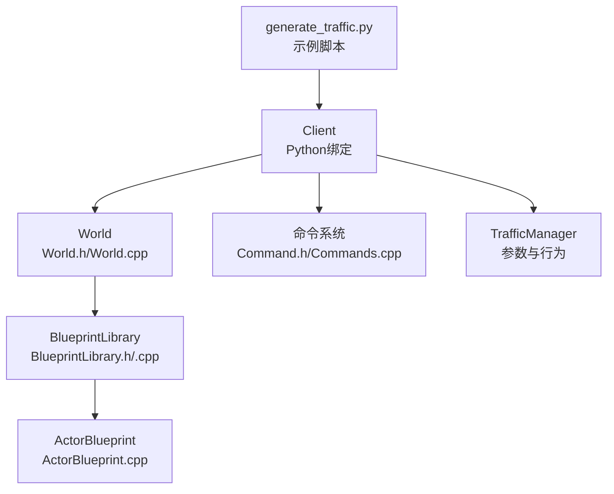
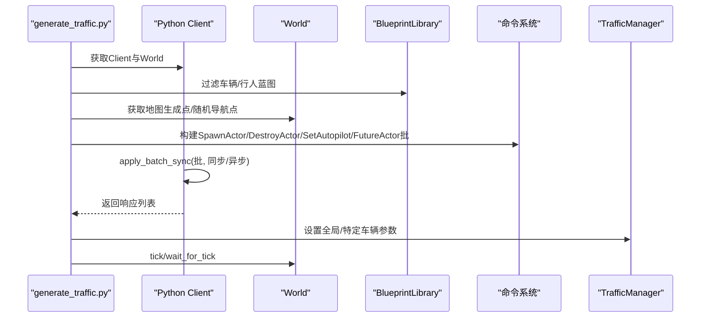
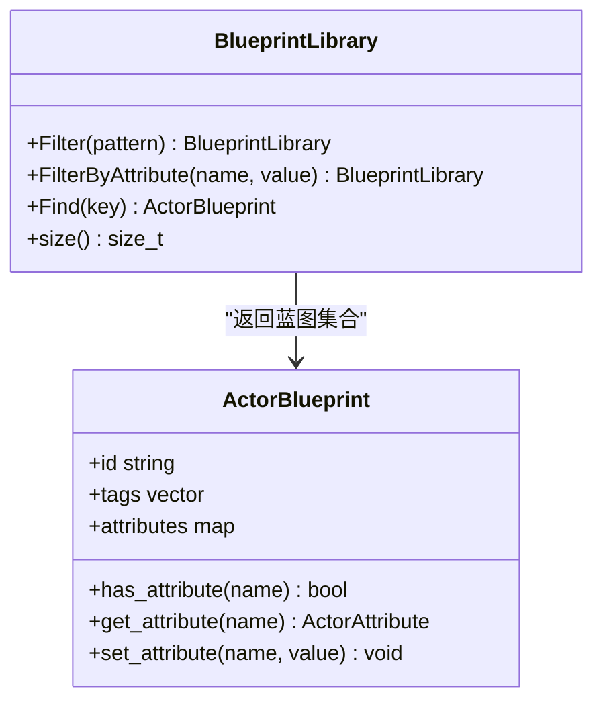
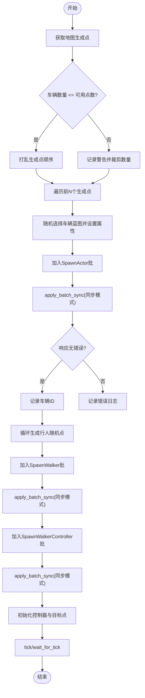
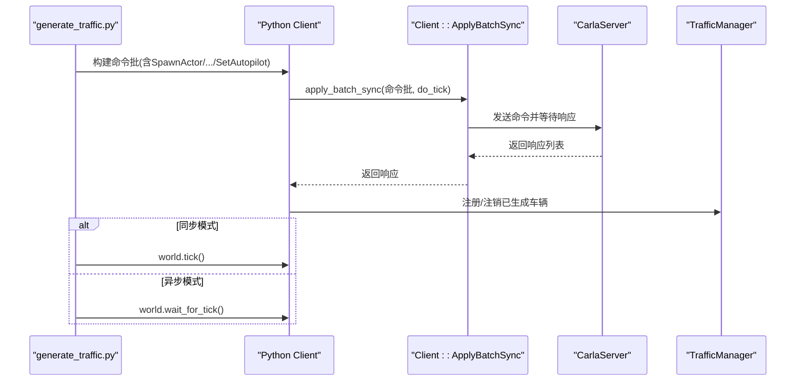
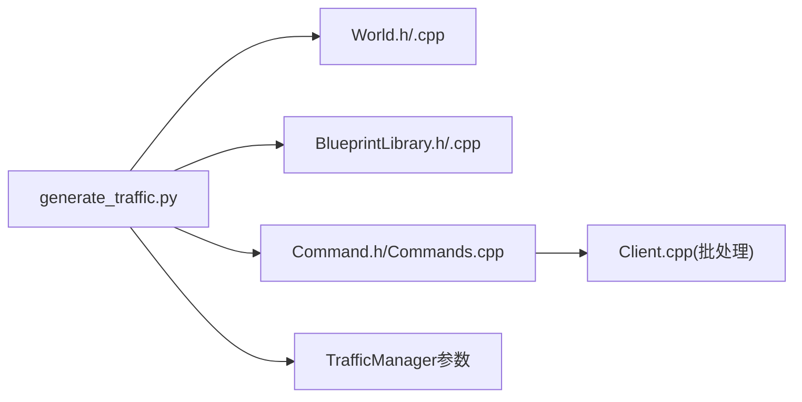

# 交通生成

> **引用文件**
> **本文引用的文件列表**

- [generate_traffic.py](https://github.com/carla-simulator/carla/blob/ue5-dev/PythonAPI/examples/generate_traffic.py)
- [World.h](https://github.com/carla-simulator/carla/blob/ue5-dev/LibCarla/source/carla/client/World.h)
- [World.cpp](https://github.com/carla-simulator/carla/blob/ue5-dev/LibCarla/source/carla/client/World.cpp)
- [BlueprintLibrary.h](https://github.com/carla-simulator/carla/blob/ue5-dev/LibCarla/source/carla/client/BlueprintLibrary.h)
- [BlueprintLibrary.cpp](https://github.com/carla-simulator/carla/blob/ue5-dev/LibCarla/source/carla/client/BlueprintLibrary.cpp)
- [ActorBlueprint.cpp](https://github.com/carla-simulator/carla/blob/ue5-dev/LibCarla/source/carla/client/ActorBlueprint.cpp)
- [Client.cpp](https://github.com/carla-simulator/carla/blob/ue5-dev/LibCarla/source/carla/client/detail/Client.cpp)
- [Commands.cpp](https://github.com/carla-simulator/carla/blob/ue5-dev/PythonAPI/carla/src/Commands.cpp)
- [Client.cpp（Python 绑定）](https://github.com/carla-simulator/carla/blob/ue5-dev/PythonAPI/carla/src/Client.cpp)
- [Command.h](https://github.com/carla-simulator/carla/blob/ue5-dev/LibCarla/source/carla/rpc/Command.h)
- [python_api.md](https://github.com/carla-simulator/carla/blob/ue5-dev/Docs/python_api.md)
- [test_sync.py](https://github.com/carla-simulator/carla/blob/ue5-dev/PythonAPI/test/smoke/test_sync.py)
- [invertedai_traffic.py](https://github.com/carla-simulator/carla/blob/ue5-dev/PythonAPI/examples/invertedai_traffic.py)
- [python_api.md（片段：carla.Client.apply_batch_sync.py）](https://github.com/carla-simulator/carla/blob/ue5-dev/PythonAPI/docs/snipets/carla.Client.apply_batch_sync.py)
- [python_api.md（片段：carla.ActorBlueprint.set_attribute.py）](https://github.com/carla-simulator/carla/blob/ue5-dev/PythonAPI/docs/snipets/carla.ActorBlueprint.set_attribute.py)
- [test_blueprint.py](https://github.com/carla-simulator/carla/blob/ue5-dev/PythonAPI/test/smoke/test_blueprint.py)

## 目录

1. [简介](#简介)
2. [项目结构与入口](#项目结构与入口)
3. [核心组件](#核心组件)
4. [架构总览](#架构总览)
5. [详细组件分析](#详细组件分析)
6. [依赖关系分析](#依赖关系分析)
7. [性能考量](#性能考量)
8. [故障排查指南](#故障排查指南)
9. [结论](#结论)
10. [附录](#附录)

## 简介

本文件围绕 CARLA 中“交通生成”的实现机制展开，以 Python 示例脚本 generate_traffic.py 为核心，系统解析如何通过 World.spawn_actor()与批处理命令完成车辆与行人的批量生成；详解 Blueprint 库的筛选与属性设置；说明生成过程中的随机性控制、生成点选择策略及冲突处理；并给出可定制化交通流密度与组成的实践建议，最后总结大规模交通生成的性能优化技巧（批量操作与异步生成）。

## 项目结构与入口

- 示例脚本位于 PythonAPI/examples/generate_traffic.py，提供完整的车辆与行人生成流程，包含参数解析、同步/异步模式切换、TrafficManager 配置、随机种子设定、光照自动管理等。
- 蓝图库与世界接口在 LibCarla 源码中定义，Python 侧通过绑定暴露给用户。

图表来源

- <a href="https://github.com/carla-simulator/carla/blob/ue5-dev/PythonAPI/examples/generate_traffic.py#L1-L327" target="_blank">generate_traffic.py</a>
- <a href="https://github.com/carla-simulator/carla/blob/ue5-dev/LibCarla/source/carla/client/World.h#L70-L120" target="_blank">World.h</a>
- <a href="https://github.com/carla-simulator/carla/blob/ue5-dev/LibCarla/source/carla/client/World.cpp#L36-L46" target="_blank">World.cpp</a>
- <a href="https://github.com/carla-simulator/carla/blob/ue5-dev/LibCarla/source/carla/client/BlueprintLibrary.h#L40-L70" target="_blank">BlueprintLibrary.h</a>
- <a href="https://github.com/carla-simulator/carla/blob/ue5-dev/LibCarla/source/carla/client/BlueprintLibrary.cpp#L25-L34" target="_blank">BlueprintLibrary.cpp</a>
- <a href="https://github.com/carla-simulator/carla/blob/ue5-dev/LibCarla/source/carla/client/ActorBlueprint.cpp#L26-L39" target="_blank">ActorBlueprint.cpp</a>
- <a href="https://github.com/carla-simulator/carla/blob/ue5-dev/LibCarla/source/carla/rpc/Command.h#L51-L85" target="_blank">Command.h</a>
- <a href="https://github.com/carla-simulator/carla/blob/ue5-dev/PythonAPI/carla/src/Commands.cpp#L70-L100" target="_blank">Commands.cpp</a>

章节来源

- <a href="https://github.com/carla-simulator/carla/blob/ue5-dev/PythonAPI/examples/generate_traffic.py#L1-L120" target="_blank">generate_traffic.py</a>
- <a href="https://github.com/carla-simulator/carla/blob/ue5-dev/LibCarla/source/carla/client/World.h#L70-L120" target="_blank">World.h</a>
- <a href="https://github.com/carla-simulator/carla/blob/ue5-dev/LibCarla/source/carla/client/World.cpp#L36-L46" target="_blank">World.cpp</a>

## 核心组件

- World 与蓝图库
  - World 提供获取蓝图库、随机导航点、同步/异步 tick、行人穿越因子与种子设置等能力。
  - BlueprintLibrary 支持通配符过滤与按属性过滤，ActorBlueprint 承载蓝图元数据与推荐值。
- 命令系统
  - Python 侧通过 carla.command.SpawnActor、SetAutopilot、FutureActor 等构建批处理命令链，由 Client.apply_batch_sync 统一执行。
- TrafficManager
  - 通过端口与 World.tick/async 模式配合，实现车辆自动驾驶、灯光更新、碰撞检测、速度差等参数化行为。

章节来源

- <a href="https://github.com/carla-simulator/carla/blob/ue5-dev/LibCarla/source/carla/client/World.h#L70-L120" target="_blank">World.h</a>
- <a href="https://github.com/carla-simulator/carla/blob/ue5-dev/LibCarla/source/carla/client/World.cpp#L36-L46" target="_blank">World.cpp</a>
- <a href="https://github.com/carla-simulator/carla/blob/ue5-dev/LibCarla/source/carla/client/BlueprintLibrary.h#L40-L70" target="_blank">BlueprintLibrary.h</a>
- <a href="https://github.com/carla-simulator/carla/blob/ue5-dev/LibCarla/source/carla/client/BlueprintLibrary.cpp#L25-L34" target="_blank">BlueprintLibrary.cpp</a>
- <a href="https://github.com/carla-simulator/carla/blob/ue5-dev/LibCarla/source/carla/client/ActorBlueprint.cpp#L26-L39" target="_blank">ActorBlueprint.cpp</a>
- <a href="https://github.com/carla-simulator/carla/blob/ue5-dev/LibCarla/source/carla/rpc/Command.h#L51-L85" target="_blank">Command.h</a>
- <a href="https://github.com/carla-simulator/carla/blob/ue5-dev/PythonAPI/carla/src/Commands.cpp#L70-L100" target="_blank">Commands.cpp</a>
- <a href="https://github.com/carla-simulator/carla/blob/ue5-dev/PythonAPI/carla/src/Client.cpp#L51-L114" target="_blank">Client.cpp（Python 绑定）</a>

## 架构总览

下图展示了从示例脚本到底层命令执行的关键路径，以及蓝图筛选与属性设置的交互。

图表来源

- <a href="https://github.com/carla-simulator/carla/blob/ue5-dev/PythonAPI/examples/generate_traffic.py#L120-L210" target="_blank">generate_traffic.py</a>
- <a href="https://github.com/carla-simulator/carla/blob/ue5-dev/PythonAPI/carla/src/Client.cpp#L51-L114" target="_blank">Client.cpp（Python 绑定）</a>
- <a href="https://github.com/carla-simulator/carla/blob/ue5-dev/LibCarla/source/carla/client/detail/Client.cpp#L670-L702" target="_blank">Client.cpp</a>
- <a href="https://github.com/carla-simulator/carla/blob/ue5-dev/LibCarla/source/carla/client/World.h#L111-L140" target="_blank">World.h</a>
- <a href="https://github.com/carla-simulator/carla/blob/ue5-dev/LibCarla/source/carla/rpc/Command.h#L51-L85" target="_blank">Command.h</a>

## 详细组件分析

### 蓝图库与筛选

- 过滤策略
  - 使用通配符过滤车辆与行人蓝图，支持 generation 限定与 base_type 过滤（安全模式）。
  - 可按属性值过滤（例如 generation），或直接按 id 查找。
- 属性设置
  - 随机选择推荐值设置颜色、驾驶员 ID、角色名（hero/autopilot）。
  - 行人蓝图可设置不可穿透属性为 false，速度属性按概率选择步行/跑步。
- 蓝图元数据
  - ActorBlueprint 保存 id、标签、属性与推荐值，供筛选与设置使用。

图表来源

- <a href="https://github.com/carla-simulator/carla/blob/ue5-dev/LibCarla/source/carla/client/BlueprintLibrary.h#L40-L70" target="_blank">BlueprintLibrary.h</a>
- <a href="https://github.com/carla-simulator/carla/blob/ue5-dev/LibCarla/source/carla/client/BlueprintLibrary.cpp#L25-L34" target="_blank">BlueprintLibrary.cpp</a>
- <a href="https://github.com/carla-simulator/carla/blob/ue5-dev/LibCarla/source/carla/client/ActorBlueprint.cpp#L26-L39" target="_blank">ActorBlueprint.cpp</a>

章节来源

- <a href="https://github.com/carla-simulator/carla/blob/ue5-dev/PythonAPI/examples/generate_traffic.py#L19-L42" target="_blank">generate_traffic.py</a>
- <a href="https://github.com/carla-simulator/carla/blob/ue5-dev/PythonAPI/docs/snipets/carla.ActorBlueprint.set_attribute.py#L2-L19" target="_blank">python_api.md（片段：carla.ActorBlueprint.set_attribute.py）</a>
- <a href="https://github.com/carla-simulator/carla/blob/ue5-dev/PythonAPI/test/smoke/test_blueprint.py#L12-L26" target="_blank">test_blueprint.py</a>

### 生成点选择与冲突处理

- 车辆
  - 从地图获取生成点，若请求数量大于可用点则警告并裁剪；若小于等于则打乱顺序后取前 N 个。
  - 通过随机选择蓝图并设置颜色、角色名等属性，再批量 SpawnActor。
- 行人
  - 使用 World.get_random_location_from_navigation()从导航网格采样随机位置，垂直方向加偏移避免穿模。
  - 先批量 SpawnWalker，再批量 SpawnWalker 控制器（controller.ai.walker），随后初始化控制器目标与最大速度。
- 冲突处理
  - 通过随机导航点与垂直偏移降低重叠；必要时可结合 TrafficManager 的最小车距与避撞策略。

图表来源

- <a href="https://github.com/carla-simulator/carla/blob/ue5-dev/PythonAPI/examples/generate_traffic.py#L153-L210" target="_blank">generate_traffic.py</a>
- <a href="https://github.com/carla-simulator/carla/blob/ue5-dev/PythonAPI/examples/generate_traffic.py#L210-L286" target="_blank">generate_traffic.py</a>
- <a href="https://github.com/carla-simulator/carla/blob/ue5-dev/LibCarla/source/carla/client/World.h#L78-L80" target="_blank">World.h</a>

章节来源

- <a href="https://github.com/carla-simulator/carla/blob/ue5-dev/PythonAPI/examples/generate_traffic.py#L153-L210" target="_blank">generate_traffic.py</a>
- <a href="https://github.com/carla-simulator/carla/blob/ue5-dev/PythonAPI/examples/generate_traffic.py#L210-L286" target="_blank">generate_traffic.py</a>
- <a href="https://github.com/carla-simulator/carla/blob/ue5-dev/LibCarla/source/carla/client/World.h#L78-L80" target="_blank">World.h</a>

### 批量生成与异步/同步模式

- 批处理命令
  - 使用 carla.command.SpawnActor、SetAutopilot、FutureActor 组合，构建命令链并在一次 apply_batch_sync 中提交。
  - Python 绑定会识别 SetAutopilot 命令并自动注册到 TrafficManager 实例。
- 同步/异步
  - 同步模式下 World.tick 推进仿真；异步模式下 World.wait_for_tick 等待帧到达。
  - 示例脚本支持异步模式标志，提示异步可能带来的问题。

图表来源

- <a href="https://github.com/carla-simulator/carla/blob/ue5-dev/PythonAPI/carla/src/Client.cpp#L51-L114" target="_blank">Client.cpp（Python 绑定）</a>
- <a href="https://github.com/carla-simulator/carla/blob/ue5-dev/LibCarla/source/carla/client/detail/Client.cpp#L670-L702" target="_blank">Client.cpp</a>
- <a href="https://github.com/carla-simulator/carla/blob/ue5-dev/LibCarla/source/carla/rpc/Command.h#L51-L85" target="_blank">Command.h</a>
- <a href="https://github.com/carla-simulator/carla/blob/ue5-dev/PythonAPI/carla/src/Commands.cpp#L70-L100" target="_blank">Commands.cpp</a>

章节来源

- <a href="https://github.com/carla-simulator/carla/blob/ue5-dev/PythonAPI/examples/generate_traffic.py#L163-L204" target="_blank">generate_traffic.py</a>
- <a href="https://github.com/carla-simulator/carla/blob/ue5-dev/PythonAPI/examples/generate_traffic.py#L292-L306" target="_blank">generate_traffic.py</a>
- <a href="https://github.com/carla-simulator/carla/blob/ue5-dev/PythonAPI/test/smoke/test_sync.py#L150-L179" target="_blank">test_sync.py</a>

### TrafficManager 参数与行为

- 参数设置
  - 全局速度差、最小车距、混合物理模式、重生策略、随机种子等。
  - 可按需为单个车辆设置忽略红绿灯、强制变道、碰撞检测等。
- 自动灯光
  - 通过 TrafficManager 更新车辆灯光状态，示例脚本在车辆生成后批量启用。

章节来源

- <a href="https://github.com/carla-simulator/carla/blob/ue5-dev/PythonAPI/examples/generate_traffic.py#L112-L124" target="_blank">generate_traffic.py</a>
- <a href="https://github.com/carla-simulator/carla/blob/ue5-dev/PythonAPI/examples/generate_traffic.py#L199-L204" target="_blank">generate_traffic.py</a>
- <a href="https://github.com/carla-simulator/carla/blob/ue5-dev/PythonAPI/docs/snipets/carla.Client.apply_batch_sync.py#L1-L40" target="_blank">python_api.md（片段：carla.Client.apply_batch_sync.py）</a>

### 大规模交通生成的定制化

- 密度与组成
  - 通过--number-of-vehicles/--number-of-walkers 控制总量；通过--filterv/--filterw 与--generationv/--generationw 限制类型与代际。
  - 安全模式仅保留 base_type 为 car 的蓝图，降低事故风险。
- 随机性
  - 统一设置随机种子，确保可复现；行人模块可单独设置种子并打乱随机序列。
- 生成策略
  - 车辆优先使用地图生成点，不足时打乱顺序；行人使用导航网格随机采样并加垂直偏移。
- 冲突与避障
  - 通过最小车距、避撞策略与垂直偏移减少冲突；必要时调整生成点分布或密度。

章节来源

- <a href="https://github.com/carla-simulator/carla/blob/ue5-dev/PythonAPI/examples/generate_traffic.py#L44-L99" target="_blank">generate_traffic.py</a>
- <a href="https://github.com/carla-simulator/carla/blob/ue5-dev/PythonAPI/examples/generate_traffic.py#L141-L162" target="_blank">generate_traffic.py</a>
- <a href="https://github.com/carla-simulator/carla/blob/ue5-dev/PythonAPI/examples/generate_traffic.py#L210-L243" target="_blank">generate_traffic.py</a>

## 依赖关系分析

- 脚本依赖
  - generate_traffic.py 依赖 World 接口（蓝图库、生成点、随机导航点）、命令系统（SpawnActor/SetAutopilot/FutureActor）、TrafficManager（端口、参数）。
- 源码依赖
  - World.h/World.cpp 提供蓝图库与导航点接口；BlueprintLibrary.h/.cpp 提供过滤与查找；Command.h/Commands.cpp 提供命令定义与 Python 绑定；Client.cpp 负责批处理执行与 TrafficManager 集成。

图表来源

- <a href="https://github.com/carla-simulator/carla/blob/ue5-dev/PythonAPI/examples/generate_traffic.py#L120-L210" target="_blank">generate_traffic.py</a>
- <a href="https://github.com/carla-simulator/carla/blob/ue5-dev/LibCarla/source/carla/client/World.h#L70-L120" target="_blank">World.h</a>
- <a href="https://github.com/carla-simulator/carla/blob/ue5-dev/LibCarla/source/carla/client/BlueprintLibrary.h#L40-L70" target="_blank">BlueprintLibrary.h</a>
- <a href="https://github.com/carla-simulator/carla/blob/ue5-dev/LibCarla/source/carla/rpc/Command.h#L51-L85" target="_blank">Command.h</a>
- <a href="https://github.com/carla-simulator/carla/blob/ue5-dev/LibCarla/source/carla/client/detail/Client.cpp#L670-L702" target="_blank">Client.cpp</a>

章节来源

- <a href="https://github.com/carla-simulator/carla/blob/ue5-dev/PythonAPI/examples/generate_traffic.py#L120-L210" target="_blank">generate_traffic.py</a>
- <a href="https://github.com/carla-simulator/carla/blob/ue5-dev/LibCarla/source/carla/client/World.h#L70-L120" target="_blank">World.h</a>
- <a href="https://github.com/carla-simulator/carla/blob/ue5-dev/LibCarla/source/carla/client/BlueprintLibrary.h#L40-L70" target="_blank">BlueprintLibrary.h</a>
- <a href="https://github.com/carla-simulator/carla/blob/ue5-dev/LibCarla/source/carla/rpc/Command.h#L51-L85" target="_blank">Command.h</a>
- <a href="https://github.com/carla-simulator/carla/blob/ue5-dev/LibCarla/source/carla/client/detail/Client.cpp#L670-L702" target="_blank">Client.cpp</a>

## 性能考量

- 批量操作
  - 将多个 SpawnActor/DestroyActor/SetAutopilot 组合为单次 apply_batch_sync，减少网络往返与服务器调度开销。
  - Python 绑定内部对 SetAutopilot 命令进行识别与分批注册，提升并发效率。
- 异步生成
  - 在异步模式下使用 wait_for_tick，避免阻塞；但注意异步可能带来状态不一致的风险，需谨慎使用。
- 地图与导航
  - 使用 World.get_map().get_spawn_points()与 World.get_random_location_from_navigation()可避免重复查询，提高生成效率。
- TrafficManager
  - 合理设置最小车距、速度差与混合物理半径，平衡真实感与性能；在大地图上开启重生策略可减少频繁销毁/创建。

章节来源

- <a href="https://github.com/carla-simulator/carla/blob/ue5-dev/PythonAPI/carla/src/Client.cpp#L51-L114" target="_blank">Client.cpp（Python 绑定）</a>
- <a href="https://github.com/carla-simulator/carla/blob/ue5-dev/PythonAPI/examples/generate_traffic.py#L125-L139" target="_blank">generate_traffic.py</a>
- <a href="https://github.com/carla-simulator/carla/blob/ue5-dev/PythonAPI/examples/generate_traffic.py#L292-L306" target="_blank">generate_traffic.py</a>

## 故障排查指南

- 蓝图筛选失败
  - 若 filter 返回空，检查通配符是否正确；generation 参数需在允许范围内。
- 生成点不足
  - 当请求数量超过可用生成点时会警告并裁剪；可通过增大地图生成点或减少请求数量解决。
- 命令响应错误
  - apply_batch_sync 返回的响应列表包含错误信息；逐条检查并定位失败原因。
- 异步模式异常
  - 异步模式下 tick/同步状态需与脚本逻辑匹配；必要时切换到同步模式验证问题。
- 行人冲突
  - 通过垂直偏移与随机导航点减少穿模；若仍冲突，降低密度或调整控制器目标点。

章节来源

- <a href="https://github.com/carla-simulator/carla/blob/ue5-dev/PythonAPI/examples/generate_traffic.py#L141-L162" target="_blank">generate_traffic.py</a>
- <a href="https://github.com/carla-simulator/carla/blob/ue5-dev/PythonAPI/examples/generate_traffic.py#L193-L198" target="_blank">generate_traffic.py</a>
- <a href="https://github.com/carla-simulator/carla/blob/ue5-dev/PythonAPI/test/smoke/test_sync.py#L150-L179" target="_blank">test_sync.py</a>

## 结论

通过 generate_traffic.py 示例，可以清晰看到 CARLA 交通生成的完整闭环：蓝图筛选与属性设置、生成点选择与冲突规避、批处理命令与 TrafficManager 集成、同步/异步模式切换与性能权衡。按照本文提供的策略与最佳实践，可在不同场景下高效、可控地生成符合需求的交通流，并在大规模场景中保持稳定与高性能。

## 附录

- 参考文档与示例
  - PythonAPI 文档中关于 apply_batch_sync 与蓝图属性设置的片段。
  - invertedai_traffic.py 展示了另一种行人生成与控制器绑定的流程。

章节来源

- <a href="https://github.com/carla-simulator/carla/blob/ue5-dev/PythonAPI/docs/snipets/carla.Client.apply_batch_sync.py#L1-L40" target="_blank">python_api.md（片段：carla.Client.apply_batch_sync.py）</a>
- <a href="https://github.com/carla-simulator/carla/blob/ue5-dev/PythonAPI/docs/snipets/carla.ActorBlueprint.set_attribute.py#L2-L19" target="_blank">python_api.md（片段：carla.ActorBlueprint.set_attribute.py）</a>
- <a href="https://github.com/carla-simulator/carla/blob/ue5-dev/PythonAPI/examples/invertedai_traffic.py#L227-L303" target="_blank">invertedai_traffic.py</a>
