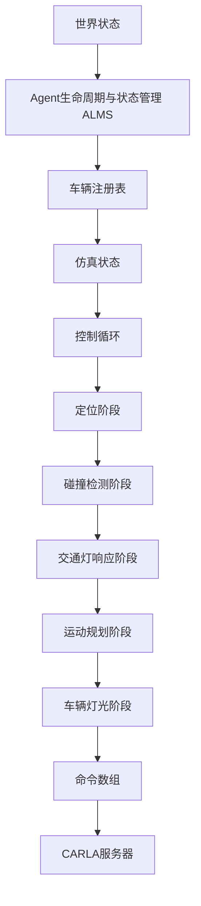
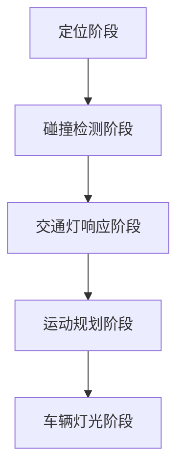

# 交通管理器


**本文档中引用的文件**   
- [TrafficManager.h](https://github.com/carla-simulator/carla/blob/ue5-dev/LibCarla/source/carla/trafficmanager/TrafficManager.h)
- [TrafficManagerLocal.h](https://github.com/carla-simulator/carla/blob/ue5-dev/LibCarla/source/carla/trafficmanager/TrafficManagerLocal.h)
- [TrafficManagerRemote.h](https://github.com/carla-simulator/carla/blob/ue5-dev/LibCarla/source/carla/trafficmanager/TrafficManagerRemote.h)
- [Parameters.h](https://github.com/carla-simulator/carla/blob/ue5-dev/LibCarla/source/carla/trafficmanager/Parameters.h)
- [Constants.h](https://github.com/carla-simulator/carla/blob/ue5-dev/LibCarla/source/carla/trafficmanager/Constants.h)
- [TrafficManagerBase.h](https://github.com/carla-simulator/carla/blob/ue5-dev/LibCarla/source/carla/trafficmanager/TrafficManagerBase.h)
- [DataStructures.h](https://github.com/carla-simulator/carla/blob/ue5-dev/LibCarla/source/carla/trafficmanager/DataStructures.h)
- [LocalizationStage.h](https://github.com/carla-simulator/carla/blob/ue5-dev/LibCarla/source/carla/trafficmanager/LocalizationStage.h)
- [CollisionStage.h](https://github.com/carla-simulator/carla/blob/ue5-dev/LibCarla/source/carla/trafficmanager/CollisionStage.h)
- [MotionPlanStage.h](https://github.com/carla-simulator/carla/blob/ue5-dev/LibCarla/source/carla/trafficmanager/MotionPlanStage.h)
- [TrafficManager.cpp](https://github.com/carla-simulator/carla/blob/ue5-dev/LibCarla/source/carla/trafficmanager/TrafficManager.cpp)
- [TrafficManager.cpp](https://github.com/carla-simulator/carla/blob/ue5-dev/PythonAPI/carla/src/TrafficManager.cpp)
- [tuto_G_traffic_manager.md](https://github.com/carla-simulator/carla/blob/ue5-dev/Docs/tuto_G_traffic_manager.md)
- [adv_traffic_manager.md](https://github.com/carla-simulator/carla/blob/ue5-dev/Docs/adv_traffic_manager.md)
- [generate_traffic.py](https://github.com/carla-simulator/carla/blob/ue5-dev/PythonAPI/examples/generate_traffic.py)


## 目录
1. [简介](#简介)
2. [架构与核心组件](#架构与核心组件)
3. [局部模式与远程模式](#局部模式与远程模式)
4. [核心功能详解](#核心功能详解)
5. [可配置参数](#可配置参数)
6. [代码示例](#代码示例)
7. [结论](#结论)

## 简介

CARLA交通管理器（Traffic Manager）是用于控制仿真环境中自动驾驶车辆的核心模块。其主要目标是为仿真环境生成逼真的城市交通状况，通过管理非玩家角色（NPC）车辆的行为和生命周期，为自动驾驶车辆（通常称为"主车"或"Ego vehicle"）创造真实的交通挑战。交通管理器允许用户通过设置各种参数来自定义交通行为，以适应不同的训练和测试场景。

交通管理器的设计基于客户端架构，其执行流程被划分为多个独立的阶段，每个阶段都有特定的操作和目标。这种模块化设计不仅便于开发和维护，还能提高计算效率。交通管理器支持同步模式运行，这是其正常工作的推荐模式，异步模式可能导致不可预测的结果。

**Section sources**
- [adv_traffic_manager.md](https://github.com/carla-simulator/carla/blob/ue5-dev/Docs/adv_traffic_manager.md#what-is-the-traffic-manager)
- [tuto_G_traffic_manager.md](https://github.com/carla-simulator/carla/blob/ue5-dev/Docs/tuto_G_traffic_manager.md#traffic-manager)

## 架构与核心组件

交通管理器采用分层架构设计，由多个协同工作的核心组件构成。其架构可以分为三个主要阶段：状态管理、运动规划和命令执行。



**Diagram sources**
- [adv_traffic_manager.md](https://github.com/carla-simulator/carla/blob/ue5-dev/Docs/adv_traffic_manager.md#architecture)
- [TrafficManagerBase.h](https://github.com/carla-simulator/carla/blob/ue5-dev/LibCarla/source/carla/trafficmanager/TrafficManagerBase.h)

### Agent生命周期与状态管理 (ALSM)

Agent生命周期与状态管理（ALSM）是交通管理器逻辑循环的第一步，负责提供仿真当前状态的上下文。ALSM组件扫描整个世界，跟踪所有车辆和行人的位置、速度等状态信息。如果启用了物理引擎，速度信息直接从`Vehicle.get_velocity()`获取；否则，通过一段时间内的位置更新历史来计算速度。ALSM将所有信息存储在仿真状态组件中，并更新车辆注册表，确保控制循环和PBVT（路径缓冲区与车辆跟踪）组件与车辆注册表保持一致。

**Section sources**
- [adv_traffic_manager.md](https://github.com/carla-simulator/carla/blob/ue5-dev/Docs/adv_traffic_manager.md#alsm)

### 车辆注册表与仿真状态

车辆注册表负责跟踪仿真中所有车辆和行人的状态，它接收来自ALSM的更新列表，并将注册到交通管理器的车辆存储在单独的数组中，以便在控制循环中进行迭代。仿真状态组件则作为一个缓存，存储所有车辆和行人的位置、速度、交通灯影响、交通灯状态等信息，避免在控制循环期间频繁调用服务器，从而提高性能。

**Section sources**
- [adv_traffic_manager.md](https://github.com/carla-simulator/carla/blob/ue5-dev/Docs/adv_traffic_manager.md#vehicle-registry)
- [adv_traffic_manager.md](https://github.com/carla-simulator/carla/blob/ue5-dev/Docs/adv_traffic_manager.md#simulation-state)

### 控制循环与处理阶段

控制循环是交通管理器的核心，它管理所有自动驾驶车辆的下一个命令计算，确保这些计算同步进行。控制循环由五个不同的阶段组成，每个阶段对所有车辆独立执行计算，并在阶段之间创建同步屏障，以保证一致性。所有车辆必须完成当前阶段的计算后才能进入下一阶段，确保所有车辆在同一帧内更新。



**Diagram sources**
- [adv_traffic_manager.md](https://github.com/carla-simulator/carla/blob/ue5-dev/Docs/adv_traffic_manager.md#architecture)

#### 定位阶段

定位阶段为交通管理器控制的车辆定义一个近期的路径。它从仿真状态获取所有车辆的位置和速度，利用内存地图（In-Memory Map）将每辆车与描述其当前位置和近期路径的航点列表关联起来。路径长度与车辆速度成正比，速度越快，路径越长。该阶段还会根据车道变更、速度限制、与前车距离等参数化设置来更新路径，并将路径存储在PBVT模块中。

**Section sources**
- [adv_traffic_manager.md](https://github.com/carla-simulator/carla/blob/ue5-dev/Docs/adv_traffic_manager.md#stage-1-localization-stage)
- [LocalizationStage.h](https://github.com/carla-simulator/carla/blob/ue5-dev/LibCarla/source/carla/trafficmanager/LocalizationStage.h)

#### 碰撞检测阶段

碰撞检测阶段负责识别潜在的碰撞风险。它接收来自定位阶段的可能路径重叠的车辆对列表，然后沿每辆车的路径延伸边界框（测地线边界），检查它们是否实际重叠，从而确定碰撞风险是否真实存在。检测到的碰撞风险将被发送到运动规划阶段，以便相应地调整车辆路径。

**Section sources**
- [adv_traffic_manager.md](https://github.com/carla-simulator/carla/blob/ue5-dev/Docs/adv_traffic_manager.md#stage-2-collision-stage)
- [CollisionStage.h](https://github.com/carla-simulator/carla/blob/ue5-dev/LibCarla/source/carla/trafficmanager/CollisionStage.h)

#### 交通灯响应阶段

交通灯响应阶段负责处理交通信号灯、停车标志和路口优先级等交通规则带来的风险。当车辆处于黄灯或红灯的影响下，或遇到停车标志时，该阶段会设置交通风险。对于无信号灯的路口，该阶段会为路径重叠的车辆设置"先到先走"的顺序，并设定固定的等待时间。

**Section sources**
- [adv_traffic_manager.md](https://github.com/carla-simulator/carla/blob/ue5-dev/Docs/adv_traffic_manager.md#stage-3-traffic-light-stage)

#### 运动规划阶段

运动规划阶段生成应用于车辆的CARLA命令。它收集车辆的位置和速度（来自仿真状态）、路径（来自PBVT）以及风险信息（来自碰撞检测阶段和交通灯响应阶段），做出关于车辆如何移动的高层决策，例如计算为避免碰撞风险所需的刹车力度。该阶段使用PID控制器根据目标值估算行为，并将期望的移动转换为`carla.VehicleControl`命令，发送到命令数组。

**Section sources**
- [adv_traffic_manager.md](https://github.com/carla-simulator/carla/blob/ue5-dev/Docs/adv_traffic_manager.md#stage-4-motion-planner-stage)
- [MotionPlanStage.h](https://github.com/carla-simulator/carla/blob/ue5-dev/LibCarla/source/carla/trafficmanager/MotionPlanStage.h)

#### 车辆灯光阶段

车辆灯光阶段根据车辆状态和周围环境动态激活车灯。它检索车辆的计划航点、车灯信息（如灯光状态和计划应用的命令）以及天气条件，然后确定车灯的新状态。例如，如果车辆计划在下一个路口转弯，会打开转向灯；如果应用的命令要求刹车，会打开刹车灯；在日落到日出之间或大雨条件下，会打开近光灯和位置灯；在大雾条件下，会打开雾灯。

**Section sources**
- [adv_traffic_manager.md](https://github.com/carla-simulator/carla/blob/ue5-dev/Docs/adv_traffic_manager.md#stage-5-vehicle-lights-stage)

## 局部模式与远程模式

交通管理器有两种主要的运行模式：局部模式（Local Mode）和远程模式（Remote Mode），它们适用于不同的仿真场景。

### 局部模式

局部模式是交通管理器的默认模式，当客户端首次在指定端口上创建交通管理器实例时，会启动一个本地的交通管理器服务器（TrafficManagerLocal）。在这种模式下，所有的计算都在客户端本地进行，包括车辆状态的获取、路径规划、碰撞检测和命令生成。`TrafficManagerLocal`类继承自`TrafficManagerBase`，它包含一个工作线程来顺序执行各个处理阶段，并直接与CARLA客户端和世界对象交互。

局部模式适用于单客户端仿真，提供了最高的控制权和性能，因为所有计算都在本地完成，没有网络延迟。它通过`CreateTrafficManagerServer`方法创建，并在`TrafficManager`的构造函数中被实例化。

**Section sources**
- [TrafficManager.cpp](https://github.com/carla-simulator/carla/blob/ue5-dev/LibCarla/source/carla/trafficmanager/TrafficManager.cpp#L82-L173)
- [TrafficManagerLocal.h](https://github.com/carla-simulator/carla/blob/ue5-dev/LibCarla/source/carla/trafficmanager/TrafficManagerLocal.h)

### 远程模式

远程模式允许多个客户端连接到同一个交通管理器实例。当一个客户端尝试连接到已被占用的端口时，它会创建一个`TrafficManagerRemote`实例，该实例作为客户端连接到已存在的交通管理器服务器。`TrafficManagerRemote`类通过RPC（远程过程调用）与服务器通信，将所有请求（如注册车辆、设置参数）转发给服务器，并接收计算结果。

这种模式适用于多客户端仿真，例如在分布式训练或测试环境中，多个AI代理需要共享相同的交通行为。所有客户端的行为由同一个服务器协调，确保了行为的一致性。`TrafficManagerRemote`通过`TrafficManagerClient`与服务器通信，并在`CreateTrafficManagerClient`方法中被创建。

**Section sources**
- [TrafficManager.cpp](https://github.com/carla-simulator/carla/blob/ue5-dev/LibCarla/source/carla/trafficmanager/TrafficManager.cpp#L176-L233)
- [TrafficManagerRemote.h](https://github.com/carla-simulator/carla/blob/ue5-dev/LibCarla/source/carla/trafficmanager/TrafficManagerRemote.h)

## 核心功能详解

交通管理器提供了丰富的功能来控制和管理仿真中的交通流。

### 自动车辆控制

交通管理器的核心功能是为注册的车辆提供自动驾驶控制。通过调用`set_autopilot(True)`方法并将交通管理器的端口作为参数传递，可以将车辆的控制权交给交通管理器。交通管理器随后会为这些车辆生成`VehicleControl`命令，控制其油门、刹车和转向，使其在道路上自主行驶。

### 碰撞避免

交通管理器通过碰撞检测阶段实现碰撞避免。它使用Boost.Geometry库计算车辆路径的测地线边界，并检查这些边界是否重叠。如果检测到潜在的碰撞风险，运动规划阶段会调整车辆的速度或路径以避免碰撞。用户可以通过`set_collision_detection`方法配置特定车辆之间的碰撞检测规则。

### 速度限制

交通管理器允许对车辆的速度进行精细控制。可以通过`set_percentage_speed_difference`方法设置单个车辆相对于当前速度限制的百分比速度差（负值表示加速）。`set_desired_speed`方法可以设置车辆的精确期望速度。此外，`set_global_percentage_speed_difference`方法可以为所有注册车辆设置全局速度比例。

### 车道变更

交通管理器支持多种车道变更策略。`set_force_lane_change`方法可以强制车辆进行车道变更，忽略可能的碰撞。`set_auto_lane_change`方法可以启用或禁用车辆的自动车道变更功能。用户还可以通过`set_keep_slow_lane_percentage`、`set_random_left_lanechange_percentage`和`set_random_right_lanechange_percentage`等方法设置车辆保持慢车道或随机变道的概率。

### 红绿灯响应

交通管理器能够响应交通信号灯和停车标志。在交通灯响应阶段，它会检测车辆是否受到红灯或黄灯的影响，并相应地规划停车。用户可以通过`set_percentage_running_light`和`set_percentage_running_sign`方法设置车辆闯红灯或闯停车标志的概率，以模拟不守规矩的驾驶员行为。

**Section sources**
- [adv_traffic_manager.md](https://github.com/carla-simulator/carla/blob/ue5-dev/Docs/adv_traffic_manager.md#using-the-traffic-manager)
- [TrafficManager.h](https://github.com/carla-simulator/carla/blob/ue5-dev/LibCarla/source/carla/trafficmanager/TrafficManager.h)

## 可配置参数

交通管理器提供了大量可配置参数，允许用户根据需要定制交通行为。

### 全局与车辆特定参数

参数分为全局参数和车辆特定参数。全局参数影响所有注册车辆，而车辆特定参数仅影响单个车辆。例如，`set_global_distance_to_leading_vehicle`设置所有车辆与前车的最小距离，而`set_distance_to_leading_vehicle`仅设置特定车辆的距离。

### 随机性因子

`set_random_device_seed`方法用于设置随机设备种子，这对于实现确定性模式至关重要。在同步模式下，设置相同的种子值可以确保在相同条件下产生完全相同的交通行为，这对于可重复的实验和测试非常有用。

### 混合物理模式

混合物理模式（Hybrid Physics Mode）是一个重要的性能优化功能。通过`set_hybrid_physics_mode(True)`启用后，可以禁用大部分自动驾驶车辆的物理计算，这些车辆将通过瞬移方式移动，从而显著提高仿真性能。`set_hybrid_physics_radius`方法可以设置物理计算启用的半径，通常以标记为"hero"的主车为中心。

### 其他关键参数

- **车辆间距**: 通过`set_distance_to_leading_vehicle`和`set_global_distance_to_leading_vehicle`控制。
- **忽略行人/车辆**: 通过`set_percentage_ignore_walkers`和`set_percentage_ignore_vehicles`设置忽略碰撞的概率。
- **路径与路线**: 通过`set_path`和`set_route`方法为车辆指定自定义路径或路线。
- **自动重生**: 通过`set_respawn_dormant_vehicles`启用，允许在大型地图上自动重生静止的车辆。

**Section sources**
- [Parameters.h](https://github.com/carla-simulator/carla/blob/ue5-dev/LibCarla/source/carla/trafficmanager/Parameters.h)
- [adv_traffic_manager.md](https://github.com/carla-simulator/carla/blob/ue5-dev/Docs/adv_traffic_manager.md#hybrid-physics-mode)
- [adv_traffic_manager.md](https://github.com/carla-simulator/carla/blob/ue5-dev/Docs/adv_traffic_manager.md#deterministic-mode)

## 代码示例

以下代码示例展示了如何连接客户端到交通管理器并为车辆启用自动控制。

```python
import carla

# 连接到CARLA客户端
client = carla.Client('localhost', 2000)
world = client.get_world()

# 设置同步模式
settings = world.get_settings()
settings.synchronous_mode = True
settings.fixed_delta_seconds = 0.05
world.apply_settings(settings)

# 获取交通管理器实例
traffic_manager = client.get_trafficmanager()
traffic_manager.set_synchronous_mode(True)

# 设置随机种子以实现确定性行为
traffic_manager.set_random_device_seed(0)

# 获取蓝图库和生成点
blueprint_library = world.get_blueprint_library()
spawn_points = world.get_map().get_spawn_points()

# 选择车辆蓝图
vehicle_bp = blueprint_library.filter('vehicle.*')[0]

# 生成车辆并启用自动驾驶
for spawn_point in spawn_points[:50]:  # 生成50辆车
    vehicle = world.try_spawn_actor(vehicle_bp, spawn_point)
    if vehicle is not None:
        # 将车辆控制权交给交通管理器
        vehicle.set_autopilot(True, traffic_manager.get_port())
        
        # 配置车辆行为
        traffic_manager.vehicle_percentage_speed_difference(vehicle, 10)  # 速度比限速快10%
        traffic_manager.distance_to_leading_vehicle(vehicle, 5.0)  # 与前车保持5米距离
        traffic_manager.ignore_lights_percentage(vehicle, 10)  # 有10%概率闯红灯

# 运行仿真
while True:
    world.tick()
```

**Section sources**
- [tuto_G_traffic_manager.md](https://github.com/carla-simulator/carla/blob/ue5-dev/Docs/tuto_G_traffic_manager.md#setting-up-the-simulator-and-initialising-traffic-manager)
- [generate_traffic.py](https://github.com/carla-simulator/carla/blob/ue5-dev/PythonAPI/examples/generate_traffic.py)

## 结论

CARLA交通管理器是一个功能强大且高度可配置的模块，为自动驾驶仿真提供了逼真的交通环境。其模块化的架构设计，包括ALSM、控制循环和多个处理阶段，确保了高效和一致的车辆行为管理。通过区分局部模式和远程模式，交通管理器能够适应从单客户端到多客户端的各种仿真需求。

其丰富的核心功能，如自动车辆控制、碰撞避免、速度限制、车道变更和红绿灯响应，以及大量的可配置参数，使得用户能够精确地定制交通行为，以满足特定的训练或测试目标。混合物理模式和确定性模式等高级功能进一步增强了其在大规模仿真和可重复实验中的实用性。

通过提供的Python API，集成交通管理器到仿真流程中非常简单，开发者可以轻松地生成复杂的交通场景，为自动驾驶系统的开发和验证提供坚实的基础。