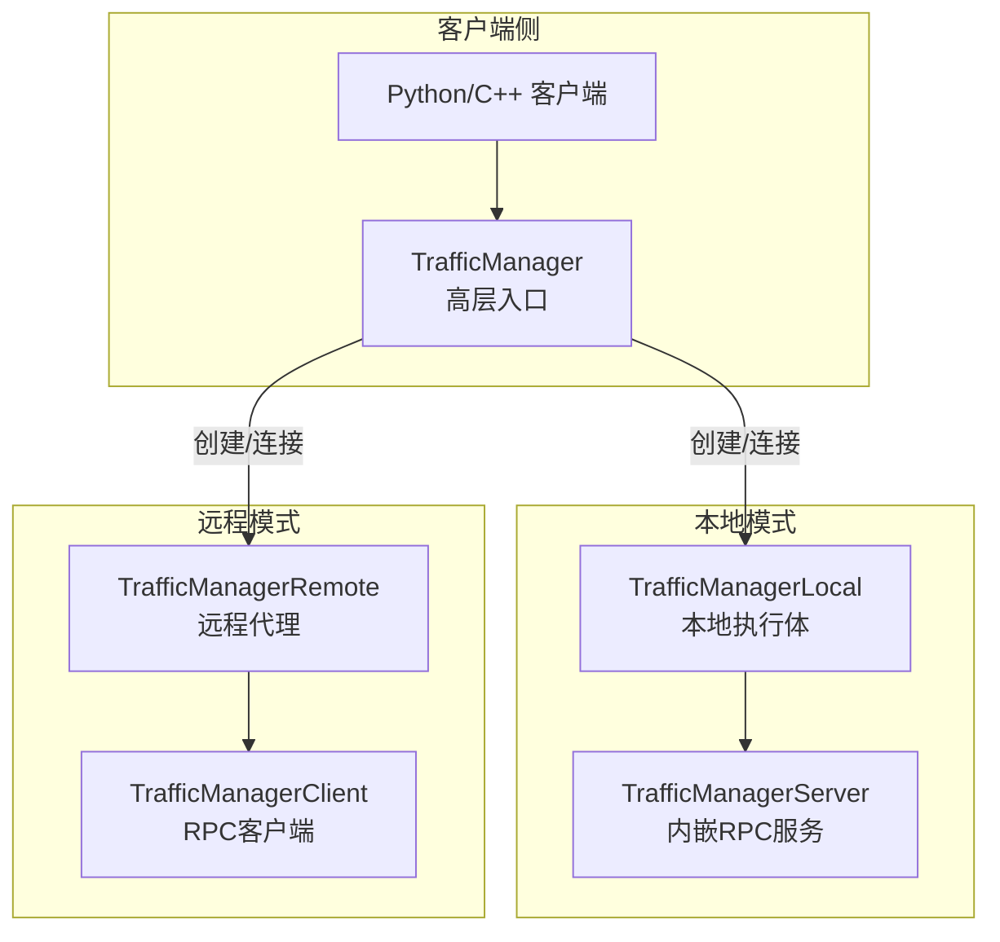
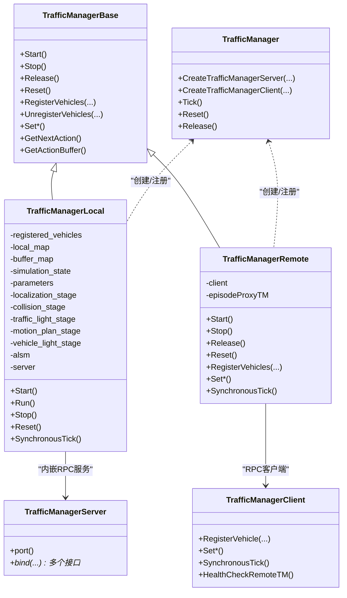
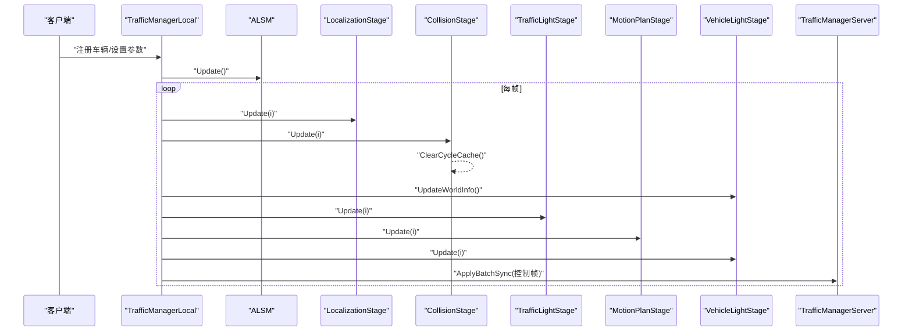
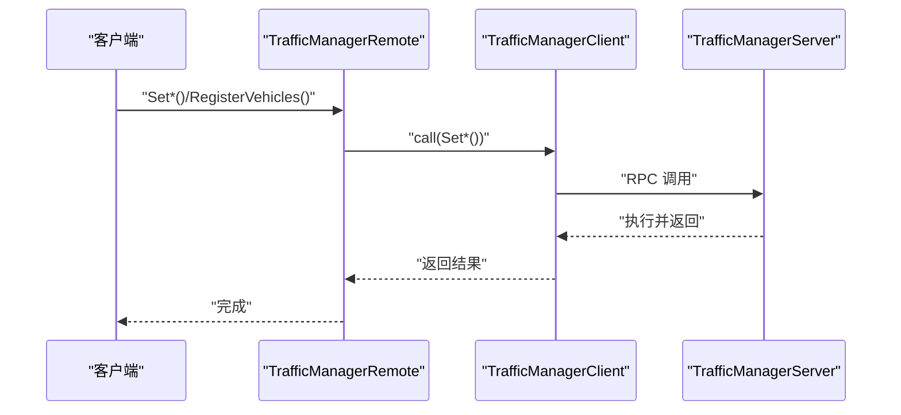
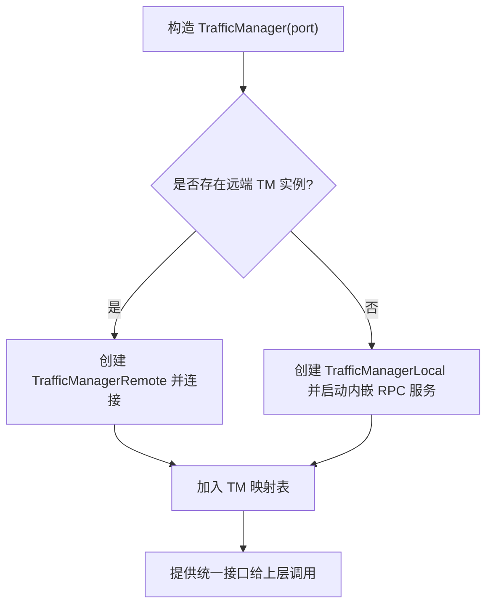
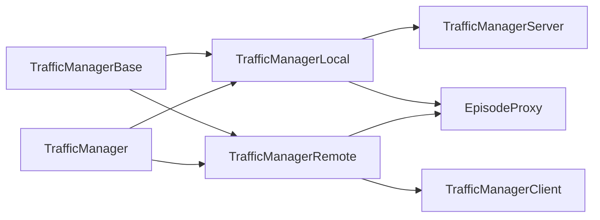

# 交通管理器模式

**本文引用的文件**
- [TrafficManagerLocal.h](https://github.com/carla-simulator/carla/blob/ue5-dev/LibCarla/source/carla/trafficmanager/TrafficManagerLocal.h)
- [TrafficManagerLocal.cpp](https://github.com/carla-simulator/carla/blob/ue5-dev/LibCarla/source/carla/trafficmanager/TrafficManagerLocal.cpp)
- [TrafficManagerRemote.h](https://github.com/carla-simulator/carla/blob/ue5-dev/LibCarla/source/carla/trafficmanager/TrafficManagerRemote.h)
- [TrafficManagerRemote.cpp](https://github.com/carla-simulator/carla/blob/ue5-dev/LibCarla/source/carla/trafficmanager/TrafficManagerRemote.cpp)
- [TrafficManagerBase.h](https://github.com/carla-simulator/carla/blob/ue5-dev/LibCarla/source/carla/trafficmanager/TrafficManagerBase.h)
- [TrafficManagerServer.h](https://github.com/carla-simulator/carla/blob/ue5-dev/LibCarla/source/carla/trafficmanager/TrafficManagerServer.h)
- [TrafficManagerClient.h](https://github.com/carla-simulator/carla/blob/ue5-dev/LibCarla/source/carla/trafficmanager/TrafficManagerClient.h)
- [TrafficManager.h](https://github.com/carla-simulator/carla/blob/ue5-dev/LibCarla/source/carla/trafficmanager/TrafficManager.h)
- [TrafficManager.cpp](https://github.com/carla-simulator/carla/blob/ue5-dev/LibCarla/source/carla/trafficmanager/TrafficManager.cpp)
- [tuto_G_traffic_manager.md](https://github.com/carla-simulator/carla/blob/ue5-dev/Docs/tuto_G_traffic_manager.md)

## 目录
1. [引言](#引言)
2. [项目结构](#项目结构)
3. [核心组件](#核心组件)
4. [架构总览](#架构总览)
5. [详细组件分析](#详细组件分析)
6. [依赖关系分析](#依赖关系分析)
7. [性能考量](#性能考量)
8. [故障排查指南](#故障排查指南)
9. [结论](#结论)
10. [附录：初始化与配置示例](#附录初始化与配置示例)

## 引言
本文件系统性解析 CARLA 交通管理器（TrafficManager）的两种运行模式：局部模式（Local）与远程模式（Remote）。我们将从架构差异、通信机制、数据流与处理逻辑入手，解释局部模式在单机仿真中的优势，以及远程模式在分布式仿真环境中的适用场景。同时，结合代码实现，阐述 TrafficManagerLocal 与 TrafficManagerRemote 的核心职责、交互方式与生命周期管理，并给出不同模式下的初始化与配置要点，最后分析两种模式对仿真精度与性能的影响。

## 项目结构
围绕交通管理器的关键文件组织如下：
- TrafficManagerBase.h：定义统一接口，约束所有模式下的行为能力。
- TrafficManagerLocal.{h,cpp}：本地模式实现，包含完整的状态机与多阶段流水线。
- TrafficManagerRemote.{h,cpp}：远程模式实现，通过 RPC 客户端调用远端 TM 实例。
- TrafficManagerServer.h：本地 TM 内嵌 RPC 服务端，暴露参数设置与控制接口。
- TrafficManagerClient.h：远程模式使用的 RPC 客户端封装。
- TrafficManager.{h,cpp}：高层入口与模式选择逻辑，负责创建或连接 TM 实例。
- tuto_G_traffic_manager.md：官方教程，展示同步模式、路径设定等典型用法。

图表来源
- [TrafficManager.h](https://github.com/carla-simulator/carla/blob/ue5-dev/LibCarla/source/carla/trafficmanager/TrafficManager.h#L1-L120)
- [TrafficManager.cpp](https://github.com/carla-simulator/carla/blob/ue5-dev/LibCarla/source/carla/trafficmanager/TrafficManager.cpp#L138-L236)
- [TrafficManagerLocal.h](https://github.com/carla-simulator/carla/blob/ue5-dev/LibCarla/source/carla/trafficmanager/TrafficManagerLocal.h#L1-L120)
- [TrafficManagerRemote.h](https://github.com/carla-simulator/carla/blob/ue5-dev/LibCarla/source/carla/trafficmanager/TrafficManagerRemote.h#L1-L60)
- [TrafficManagerServer.h](https://github.com/carla-simulator/carla/blob/ue5-dev/LibCarla/source/carla/trafficmanager/TrafficManagerServer.h#L1-L120)
- [TrafficManagerClient.h](https://github.com/carla-simulator/carla/blob/ue5-dev/LibCarla/source/carla/trafficmanager/TrafficManagerClient.h#L1-L80)

章节来源
- [TrafficManager.h](https://github.com/carla-simulator/carla/blob/ue5-dev/LibCarla/source/carla/trafficmanager/TrafficManager.h#L1-L120)
- [TrafficManager.cpp](https://github.com/carla-simulator/carla/blob/ue5-dev/LibCarla/source/carla/trafficmanager/TrafficManager.cpp#L138-L236)

## 核心组件
- TrafficManagerBase：抽象基类，定义统一的车辆注册/注销、参数设置、同步模式切换、动作查询等接口。
- TrafficManagerLocal：本地模式完整实现，包含地图缓存、帧缓冲区、多阶段流水线（定位、碰撞、信号灯、运动规划、车灯）、同步/异步执行循环、随机数生成器、ALSM 生命周期管理器等。
- TrafficManagerRemote：远程模式代理，不直接执行计算，仅通过 RPC 调用远端 TrafficManagerServer 暴露的方法。
- TrafficManagerServer：内嵌 RPC 服务器，绑定大量 TM 接口方法，接收来自 TrafficManagerClient 的调用。
- TrafficManagerClient：RPC 客户端，封装对远端 TM 的调用。
- TrafficManager：高层入口，负责根据当前是否已有远端 TM 实例，自动选择本地创建或远程连接；维护 TM 实例映射表。

章节来源
- [TrafficManagerBase.h](https://github.com/carla-simulator/carla/blob/ue5-dev/LibCarla/source/carla/trafficmanager/TrafficManagerBase.h#L1-L178)
- [TrafficManagerLocal.h](https://github.com/carla-simulator/carla/blob/ue5-dev/LibCarla/source/carla/trafficmanager/TrafficManagerLocal.h#L1-L120)
- [TrafficManagerRemote.h](https://github.com/carla-simulator/carla/blob/ue5-dev/LibCarla/source/carla/trafficmanager/TrafficManagerRemote.h#L1-L60)
- [TrafficManagerServer.h](https://github.com/carla-simulator/carla/blob/ue5-dev/LibCarla/source/carla/trafficmanager/TrafficManagerServer.h#L1-L120)
- [TrafficManagerClient.h](https://github.com/carla-simulator/carla/blob/ue5-dev/LibCarla/source/carla/trafficmanager/TrafficManagerClient.h#L1-L120)
- [TrafficManager.h](https://github.com/carla-simulator/carla/blob/ue5-dev/LibCarla/source/carla/trafficmanager/TrafficManager.h#L1-L120)

## 架构总览
两种模式的核心差异在于“执行体”所在位置：
- 局部模式：本地执行体在本地进程内，拥有完整的地图缓存、状态机与流水线，适合单机高吞吐与低延迟场景。
- 远程模式：本地仅保留代理对象，所有参数设置与控制均由 RPC 调用远端 TM 实例完成，适合分布式仿真或多客户端共享同一 TM 实例。

图表来源
- [TrafficManagerBase.h](https://github.com/carla-simulator/carla/blob/ue5-dev/LibCarla/source/carla/trafficmanager/TrafficManagerBase.h#L1-L178)
- [TrafficManagerLocal.h](https://github.com/carla-simulator/carla/blob/ue5-dev/LibCarla/source/carla/trafficmanager/TrafficManagerLocal.h#L1-L120)
- [TrafficManagerRemote.h](https://github.com/carla-simulator/carla/blob/ue5-dev/LibCarla/source/carla/trafficmanager/TrafficManagerRemote.h#L1-L60)
- [TrafficManagerServer.h](https://github.com/carla-simulator/carla/blob/ue5-dev/LibCarla/source/carla/trafficmanager/TrafficManagerServer.h#L1-L120)
- [TrafficManagerClient.h](https://github.com/carla-simulator/carla/blob/ue5-dev/LibCarla/source/carla/trafficmanager/TrafficManagerClient.h#L1-L120)
- [TrafficManager.h](https://github.com/carla-simulator/carla/blob/ue5-dev/LibCarla/source/carla/trafficmanager/TrafficManager.h#L1-L120)

## 详细组件分析

### 局部模式（TrafficManagerLocal）
- 执行体与资源
  - 持有本地地图缓存（InMemoryMap），支持从缓存文件加载或在线构建。
  - 维护注册车辆集合、帧缓冲区、仿真状态、参数集、随机数生成器。
  - 内嵌 TrafficManagerServer，监听 RPC 端口，供远程代理调用。
- 流水线阶段
  - 定位阶段：为每辆车计算下一动作与轨迹缓冲。
  - 碰撞阶段：检测潜在冲突并清理周期缓存。
  - 信号灯阶段：根据信号灯状态调整行为。
  - 运动规划阶段：综合纵向/横向 PID 参数生成控制指令。
  - 车灯阶段：按需更新车灯状态。
  - ALSM：生命周期管理器，负责车辆注册/移除、清理与边界设置。
- 同步/异步执行
  - 支持同步模式：通过条件变量等待外部触发，保证与世界 tick 对齐。
  - 支持异步模式：按帧去重，hybrid 物理模式下限制最小更新间隔。
  - 帧内存按车辆数量动态扩容，避免重复分配。
- 关键接口
  - 注册/注销车辆、速度/车道偏移/距离/信号忽略概率/强制变道/自动变道等参数设置。
  - 同步 tick、随机种子设置、OSM 模式、自定义路径/路线、重生策略等。

图表来源
- [TrafficManagerLocal.cpp](https://github.com/carla-simulator/carla/blob/ue5-dev/LibCarla/source/carla/trafficmanager/TrafficManagerLocal.cpp#L140-L249)
- [TrafficManagerServer.h](https://github.com/carla-simulator/carla/blob/ue5-dev/LibCarla/source/carla/trafficmanager/TrafficManagerServer.h#L1-L120)

章节来源
- [TrafficManagerLocal.h](https://github.com/carla-simulator/carla/blob/ue5-dev/LibCarla/source/carla/trafficmanager/TrafficManagerLocal.h#L1-L286)
- [TrafficManagerLocal.cpp](https://github.com/carla-simulator/carla/blob/ue5-dev/LibCarla/source/carla/trafficmanager/TrafficManagerLocal.cpp#L1-L249)

### 远程模式（TrafficManagerRemote）
- 角色与职责
  - 作为远程代理，不直接执行任何计算，所有操作均通过 RPC 调用远端 TrafficManagerServer。
  - 提供健康检查线程，定期向远端发送健康检查请求，失败时记录异常。
- 通信机制
  - 使用 TrafficManagerClient 封装 RPC 调用，包括注册/注销、参数设置、同步 tick、动作查询等。
  - 远端 TrafficManagerServer 绑定大量接口，将调用转发到 TrafficManagerBase 实现。
- 生命周期
  - Start：启动健康检查线程。
  - Stop/Release：停止健康检查，等待线程退出。
  - Reset：重新获取 EpisodeProxy 并重启健康检查。

图表来源
- [TrafficManagerRemote.cpp](https://github.com/carla-simulator/carla/blob/ue5-dev/LibCarla/source/carla/trafficmanager/TrafficManagerRemote.cpp#L92-L210)
- [TrafficManagerClient.h](https://github.com/carla-simulator/carla/blob/ue5-dev/LibCarla/source/carla/trafficmanager/TrafficManagerClient.h#L60-L220)
- [TrafficManagerServer.h](https://github.com/carla-simulator/carla/blob/ue5-dev/LibCarla/source/carla/trafficmanager/TrafficManagerServer.h#L120-L288)

章节来源
- [TrafficManagerRemote.h](https://github.com/carla-simulator/carla/blob/ue5-dev/LibCarla/source/carla/trafficmanager/TrafficManagerRemote.h#L1-L196)
- [TrafficManagerRemote.cpp](https://github.com/carla-simulator/carla/blob/ue5-dev/LibCarla/source/carla/trafficmanager/TrafficManagerRemote.cpp#L1-L302)
- [TrafficManagerClient.h](https://github.com/carla-simulator/carla/blob/ue5-dev/LibCarla/source/carla/trafficmanager/TrafficManagerClient.h#L1-L325)
- [TrafficManagerServer.h](https://github.com/carla-simulator/carla/blob/ue5-dev/LibCarla/source/carla/trafficmanager/TrafficManagerServer.h#L1-L315)

### 高层入口与模式选择（TrafficManager）
- 模式选择逻辑
  - 若当前 Episode 中已存在指定端口的 TM 实例，则创建 TrafficManagerRemote 并连接。
  - 否则创建 TrafficManagerLocal，并在其内部启动 TrafficManagerServer。
- 实例管理
  - 维护端口到 TrafficManagerBase* 的映射，支持全局 Reset/Tick/Release。
  - 提供 AddTrafficManagerRunning/DestroyTrafficManager 等 RPC 接口，供客户端侧管理远端实例。

图表来源
- [TrafficManager.cpp](https://github.com/carla-simulator/carla/blob/ue5-dev/LibCarla/source/carla/trafficmanager/TrafficManager.cpp#L138-L236)
- [TrafficManager.h](https://github.com/carla-simulator/carla/blob/ue5-dev/LibCarla/source/carla/trafficmanager/TrafficManager.h#L1-L120)

章节来源
- [TrafficManager.h](https://github.com/carla-simulator/carla/blob/ue5-dev/LibCarla/source/carla/trafficmanager/TrafficManager.h#L1-L120)
- [TrafficManager.cpp](https://github.com/carla-simulator/carla/blob/ue5-dev/LibCarla/source/carla/trafficmanager/TrafficManager.cpp#L138-L236)

## 依赖关系分析
- 组件耦合
  - TrafficManagerLocal 与 TrafficManagerServer 双向协作：前者持有后者实例以暴露 RPC 接口；后者持有 TrafficManagerBase* 以回调具体实现。
  - TrafficManagerRemote 与 TrafficManagerClient 单向依赖：代理通过客户端调用远端服务。
  - TrafficManagerBase 为抽象接口，确保 Local/Remote 一致的行为契约。
- 外部依赖
  - RPC 框架（rpc::server/client）用于跨进程通信。
  - EpisodeProxy 提供与仿真器的交互接口，包括注册/销毁 TM、同步 tick 等。
- 潜在环路
  - 无直接循环依赖；Local/Remote 通过抽象接口与 RPC 间接交互。

图表来源
- [TrafficManagerBase.h](https://github.com/carla-simulator/carla/blob/ue5-dev/LibCarla/source/carla/trafficmanager/TrafficManagerBase.h#L1-L178)
- [TrafficManagerLocal.h](https://github.com/carla-simulator/carla/blob/ue5-dev/LibCarla/source/carla/trafficmanager/TrafficManagerLocal.h#L1-L120)
- [TrafficManagerRemote.h](https://github.com/carla-simulator/carla/blob/ue5-dev/LibCarla/source/carla/trafficmanager/TrafficManagerRemote.h#L1-L60)
- [TrafficManagerServer.h](https://github.com/carla-simulator/carla/blob/ue5-dev/LibCarla/source/carla/trafficmanager/TrafficManagerServer.h#L1-L120)
- [TrafficManagerClient.h](https://github.com/carla-simulator/carla/blob/ue5-dev/LibCarla/source/carla/trafficmanager/TrafficManagerClient.h#L1-L120)
- [TrafficManager.h](https://github.com/carla-simulator/carla/blob/ue5-dev/LibCarla/source/carla/trafficmanager/TrafficManager.h#L1-L120)

章节来源
- [TrafficManagerBase.h](https://github.com/carla-simulator/carla/blob/ue5-dev/LibCarla/source/carla/trafficmanager/TrafficManagerBase.h#L1-L178)
- [TrafficManagerServer.h](https://github.com/carla-simulator/carla/blob/ue5-dev/LibCarla/source/carla/trafficmanager/TrafficManagerServer.h#L1-L120)
- [TrafficManagerClient.h](https://github.com/carla-simulator/carla/blob/ue5-dev/LibCarla/source/carla/trafficmanager/TrafficManagerClient.h#L1-L120)
- [TrafficManager.h](https://github.com/carla-simulator/carla/blob/ue5-dev/LibCarla/source/carla/trafficmanager/TrafficManager.h#L1-L120)

## 性能考量
- 局部模式优势
  - 本地执行，无网络开销，延迟更低；适合单机高并发仿真。
  - 帧缓冲区按需扩容，减少频繁分配；hybrid 物理模式下限制最小更新间隔，避免过频更新。
  - 同步模式下与世界 tick 对齐，便于调试与一致性验证。
- 远程模式适用场景
  - 分布式仿真或多客户端共享同一 TM 实例，降低重复计算与内存占用。
  - 通过健康检查线程监控远端可用性，异常时及时上报。
- 精度与稳定性
  - 局部模式可获得更细粒度的状态与控制，利于复杂场景的精确建模。
  - 远程模式受网络抖动影响，建议在同步模式下配合合理的超时与重试策略。

[本节为通用性能讨论，无需列出具体文件来源]

## 故障排查指南
- 远程连接失败
  - 现象：健康检查线程捕获异常并记录错误信息。
  - 排查：确认远端 TM 已启动且端口正确；检查网络连通性与防火墙设置。
- 同步模式卡顿
  - 现象：SynchronousTick 等待超时。
  - 排查：检查世界 tick 是否正常推进；适当增大超时时间；确认本地/远端执行体未被阻塞。
- 帧缓冲区不足
  - 现象：车辆数量变化导致帧空间不足。
  - 排查：关注动态扩容逻辑；必要时预估最大车辆数并预留足够容量。
- 地图缓存缺失
  - 现象：首次启动时提示未找到缓存并进行在线构建。
  - 排查：提前生成并缓存 InMemoryMap 文件，减少启动时间。

章节来源
- [TrafficManagerRemote.cpp](https://github.com/carla-simulator/carla/blob/ue5-dev/LibCarla/source/carla/trafficmanager/TrafficManagerRemote.cpp#L31-L68)
- [TrafficManagerLocal.cpp](https://github.com/carla-simulator/carla/blob/ue5-dev/LibCarla/source/carla/trafficmanager/TrafficManagerLocal.cpp#L140-L249)
- [TrafficManagerLocal.cpp](https://github.com/carla-simulator/carla/blob/ue5-dev/LibCarla/source/carla/trafficmanager/TrafficManagerLocal.cpp#L116-L133)

## 结论
- 局部模式适合单机高吞吐与低延迟需求，具备完整的执行体与状态机，便于调试与精度控制。
- 远程模式适合分布式仿真与多客户端共享，通过 RPC 解耦执行体，提升资源复用效率。
- 两种模式均通过 TrafficManager 统一入口进行创建/连接与生命周期管理，保持上层 API 一致。

[本节为总结性内容，无需列出具体文件来源]

## 附录：初始化与配置示例
以下示例基于官方教程与代码实现，展示在不同模式下的典型初始化与配置流程。请根据实际部署选择“本地模式”或“远程模式”。

- 同步模式初始化与种子设置
  - 在同步模式下，先设置世界同步参数，再获取 TrafficManager 并开启同步模式，最后设置随机种子以保证可重复性。
  - 示例参考：[tuto_G_traffic_manager.md](https://github.com/carla-simulator/carla/blob/ue5-dev/Docs/tuto_G_traffic_manager.md#L1-L40)

- 车辆注册与路径设定
  - 获取 TM 实例后，为车辆设置自动驾驶并设定路径，以引导车辆沿指定路径行驶。
  - 示例参考：[tuto_G_traffic_manager.md](https://github.com/carla-simulator/carla/blob/ue5-dev/Docs/tuto_G_traffic_manager.md#L170-L227)

- 局部模式（本地执行体）
  - 当前客户端侧未发现显式“仅本地模式”的构造函数；通常由 TrafficManager 自动选择：若检测到远端 TM 则连接，否则创建本地实例。
  - 关键实现参考：
    - [TrafficManager.cpp](https://github.com/carla-simulator/carla/blob/ue5-dev/LibCarla/source/carla/trafficmanager/TrafficManager.cpp#L138-L236)
    - [TrafficManagerLocal.h](https://github.com/carla-simulator/carla/blob/ue5-dev/LibCarla/source/carla/trafficmanager/TrafficManagerLocal.h#L1-L120)
    - [TrafficManagerLocal.cpp](https://github.com/carla-simulator/carla/blob/ue5-dev/LibCarla/source/carla/trafficmanager/TrafficManagerLocal.cpp#L1-L133)

- 远程模式（连接远端 TM）
  - 当前客户端侧未发现显式“仅远程模式”的构造函数；通常由 TrafficManager 自动选择：若检测到远端 TM 则连接，否则创建本地实例。
  - 关键实现参考：
    - [TrafficManager.cpp](https://github.com/carla-simulator/carla/blob/ue5-dev/LibCarla/source/carla/trafficmanager/TrafficManager.cpp#L176-L236)
    - [TrafficManagerRemote.h](https://github.com/carla-simulator/carla/blob/ue5-dev/LibCarla/source/carla/trafficmanager/TrafficManagerRemote.h#L1-L60)
    - [TrafficManagerRemote.cpp](https://github.com/carla-simulator/carla/blob/ue5-dev/LibCarla/source/carla/trafficmanager/TrafficManagerRemote.cpp#L1-L68)

- 参数设置与行为控制
  - 可设置速度差异、车道偏移、跟车距离、信号忽略概率、强制/自动变道、混合物理模式、自定义路径/路线、重生策略等。
  - 接口定义参考：
    - [TrafficManagerBase.h](https://github.com/carla-simulator/carla/blob/ue5-dev/LibCarla/source/carla/trafficmanager/TrafficManagerBase.h#L50-L178)
  - 远端 RPC 绑定参考：
    - [TrafficManagerServer.h](https://github.com/carla-simulator/carla/blob/ue5-dev/LibCarla/source/carla/trafficmanager/TrafficManagerServer.h#L120-L288)
  - 远端 RPC 调用封装参考：
    - [TrafficManagerClient.h](https://github.com/carla-simulator/carla/blob/ue5-dev/LibCarla/source/carla/trafficmanager/TrafficManagerClient.h#L60-L325)

章节来源
- [tuto_G_traffic_manager.md](https://github.com/carla-simulator/carla/blob/ue5-dev/Docs/tuto_G_traffic_manager.md#L1-L227)
- [TrafficManager.cpp](https://github.com/carla-simulator/carla/blob/ue5-dev/LibCarla/source/carla/trafficmanager/TrafficManager.cpp#L138-L236)
- [TrafficManagerBase.h](https://github.com/carla-simulator/carla/blob/ue5-dev/LibCarla/source/carla/trafficmanager/TrafficManagerBase.h#L50-L178)
- [TrafficManagerServer.h](https://github.com/carla-simulator/carla/blob/ue5-dev/LibCarla/source/carla/trafficmanager/TrafficManagerServer.h#L120-L288)
- [TrafficManagerClient.h](https://github.com/carla-simulator/carla/blob/ue5-dev/LibCarla/source/carla/trafficmanager/TrafficManagerClient.h#L60-L325)