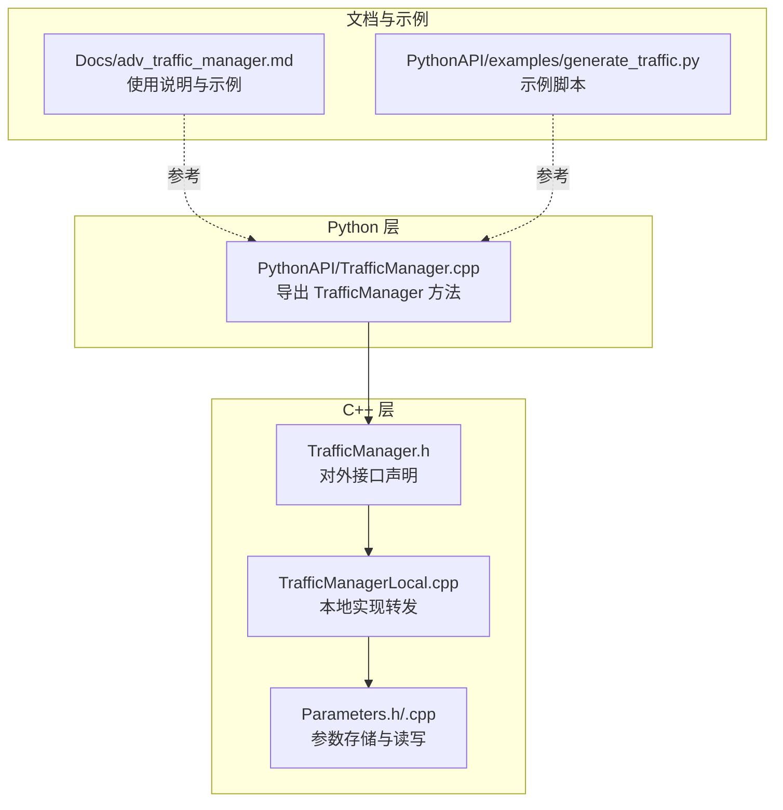
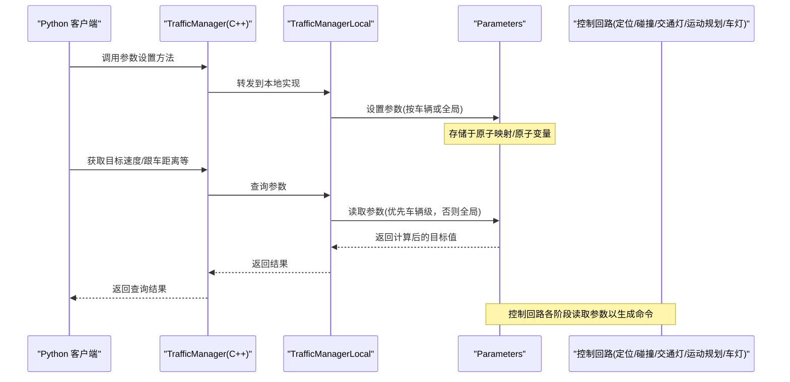
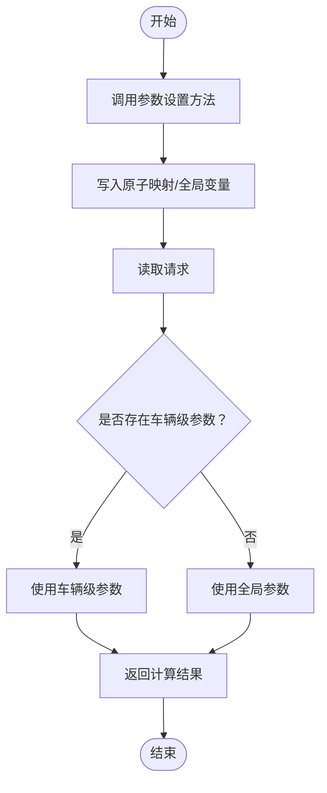
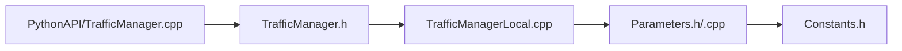

# 参数配置

> **引用文件**
> **本文引用的文件**

- [Parameters.h](https://github.com/carla-simulator/carla/blob/ue5-dev/LibCarla/source/carla/trafficmanager/Parameters.h)
- [Parameters.cpp](https://github.com/carla-simulator/carla/blob/ue5-dev/LibCarla/source/carla/trafficmanager/Parameters.cpp)
- [TrafficManager.h](https://github.com/carla-simulator/carla/blob/ue5-dev/LibCarla/source/carla/trafficmanager/TrafficManager.h)
- [TrafficManagerLocal.cpp](https://github.com/carla-simulator/carla/blob/ue5-dev/LibCarla/source/carla/trafficmanager/TrafficManagerLocal.cpp)
- [TrafficManager.cpp](https://github.com/carla-simulator/carla/blob/ue5-dev/PythonAPI/carla/src/TrafficManager.cpp)
- [adv_traffic_manager.md](https://github.com/carla-simulator/carla/blob/ue5-dev/Docs/adv_traffic_manager.md)
- [generate_traffic.py](https://github.com/carla-simulator/carla/blob/ue5-dev/PythonAPI/examples/generate_traffic.py)
- [Constants.h](https://github.com/carla-simulator/carla/blob/ue5-dev/LibCarla/source/carla/trafficmanager/Constants.h)

## 目录

1. [简介](#简介)
2. [项目结构与定位](#项目结构与定位)
3. [核心组件总览](#核心组件总览)
4. [架构概览](#架构概览)
5. [参数详解与影响分析](#参数详解与影响分析)
6. [运行时动态调整机制](#运行时动态调整机制)
7. [Python API 配置示例](#python-api-配置示例)
8. [C++ API 配置示例](#c-api-配置示例)
9. [依赖关系分析](#依赖关系分析)
10. [性能与稳定性考量](#性能与稳定性考量)
11. [故障排查指南](#故障排查指南)
12. [结论](#结论)

## 简介

本文件面向希望深入理解并灵活配置 CARLA 交通管理器（Traffic Manager，简称 TM）参数的用户，系统梳理 Parameters 类中所有可配置参数，明确其语义、取值范围、默认行为以及对交通流行为的影响；同时说明参数在运行时如何被动态调整，并提供 Python 与 C++ 双端 API 的完整配置示例，最后给出不同仿真场景下的推荐参数设置建议。

## 项目结构与定位

- 参数定义与实现位于 C++ 模块 LibCarla/source/carla/trafficmanager：
  - Parameters.h/Parameters.cpp：集中定义与实现所有参数的读写接口、默认值与边界约束。
  - TrafficManager.h/TrafficManagerLocal.cpp：对外暴露的 TrafficManager 接口与本地实现，封装对 Parameters 的调用。
- Python 绑定位于 PythonAPI/carla/src/TrafficManager.cpp：将 C++ 方法导出为 Python API。
- 文档与示例位于 Docs/adv_traffic_manager.md 与 PythonAPI/examples/generate_traffic.py：提供使用说明、示例脚本与行为说明。
- 常量定义位于 LibCarla/source/carla/trafficmanager/Constants.h：包含 TM 内部使用的各类阈值与常量，有助于理解参数的物理意义与边界。

图表来源

- <a href="https://github.com/carla-simulator/carla/blob/ue5-dev/PythonAPI/carla/src/TrafficManager.cpp#L76-L113" target="_blank">TrafficManager.cpp</a>
- <a href="https://github.com/carla-simulator/carla/blob/ue5-dev/LibCarla/source/carla/trafficmanager/TrafficManager.h#L180-L213" target="_blank">TrafficManager.h</a>
- <a href="https://github.com/carla-simulator/carla/blob/ue5-dev/LibCarla/source/carla/trafficmanager/TrafficManagerLocal.cpp#L333-L405" target="_blank">TrafficManagerLocal.cpp</a>
- <a href="https://github.com/carla-simulator/carla/blob/ue5-dev/LibCarla/source/carla/trafficmanager/Parameters.h#L103-L296" target="_blank">Parameters.h</a>
- <a href="https://github.com/carla-simulator/carla/blob/ue5-dev/LibCarla/source/carla/trafficmanager/Parameters.cpp#L21-L486" target="_blank">Parameters.cpp</a>
- <a href="https://github.com/carla-simulator/carla/blob/ue5-dev/Docs/adv_traffic_manager.md#L255-L354" target="_blank">adv_traffic_manager.md</a>
- <a href="https://github.com/carla-simulator/carla/blob/ue5-dev/PythonAPI/examples/generate_traffic.py#L112-L124" target="_blank">generate_traffic.py</a>

章节来源

- <a href="https://github.com/carla-simulator/carla/blob/ue5-dev/LibCarla/source/carla/trafficmanager/Parameters.h#L103-L296" target="_blank">Parameters.h</a>
- <a href="https://github.com/carla-simulator/carla/blob/ue5-dev/LibCarla/source/carla/trafficmanager/Parameters.cpp#L21-L486" target="_blank">Parameters.cpp</a>
- <a href="https://github.com/carla-simulator/carla/blob/ue5-dev/LibCarla/source/carla/trafficmanager/TrafficManager.h#L180-L213" target="_blank">TrafficManager.h</a>
- <a href="https://github.com/carla-simulator/carla/blob/ue5-dev/LibCarla/source/carla/trafficmanager/TrafficManagerLocal.cpp#L333-L405" target="_blank">TrafficManagerLocal.cpp</a>
- <a href="https://github.com/carla-simulator/carla/blob/ue5-dev/PythonAPI/carla/src/TrafficManager.cpp#L76-L113" target="_blank">TrafficManager.cpp</a>
- <a href="https://github.com/carla-simulator/carla/blob/ue5-dev/Docs/adv_traffic_manager.md#L255-L354" target="_blank">adv_traffic_manager.md</a>
- <a href="https://github.com/carla-simulator/carla/blob/ue5-dev/PythonAPI/examples/generate_traffic.py#L112-L124" target="_blank">generate_traffic.py</a>

## 核心组件总览

- Parameters 类：集中管理 TM 的所有可配置参数，采用原子类型与线程安全容器，支持按车辆粒度与全局粒度的配置；提供丰富的 setter/getter，覆盖速度、车道、跟车距离、碰撞检测、信号忽略、自动灯光更新、混合物理模式、重生策略、自定义路径/路线等。
- TrafficManager 接口层：对外暴露统一的 API，将 Python/C++ 调用映射到 Parameters 的具体实现。
- 常量模块：提供 TM 内部算法所需的阈值与常量，如碰撞半径、PID 控制参数、路径缓冲更新速率等，有助于理解参数的物理边界与性能影响。

章节来源

- <a href="https://github.com/carla-simulator/carla/blob/ue5-dev/LibCarla/source/carla/trafficmanager/Parameters.h#L103-L296" target="_blank">Parameters.h</a>
- <a href="https://github.com/carla-simulator/carla/blob/ue5-dev/LibCarla/source/carla/trafficmanager/Parameters.cpp#L21-L486" target="_blank">Parameters.cpp</a>
- <a href="https://github.com/carla-simulator/carla/blob/ue5-dev/LibCarla/source/carla/trafficmanager/Constants.h#L1-L166" target="_blank">Constants.h</a>

## 架构概览

下图展示从 Python/C++ 调用到参数存储与读取的整体流程，以及参数如何影响控制回路中的关键阶段（定位、碰撞、交通灯、运动规划、车灯）。

图表来源

- <a href="https://github.com/carla-simulator/carla/blob/ue5-dev/PythonAPI/carla/src/TrafficManager.cpp#L76-L113" target="_blank">TrafficManager.cpp</a>
- <a href="https://github.com/carla-simulator/carla/blob/ue5-dev/LibCarla/source/carla/trafficmanager/TrafficManager.h#L180-L213" target="_blank">TrafficManager.h</a>
- <a href="https://github.com/carla-simulator/carla/blob/ue5-dev/LibCarla/source/carla/trafficmanager/TrafficManagerLocal.cpp#L333-L405" target="_blank">TrafficManagerLocal.cpp</a>
- <a href="https://github.com/carla-simulator/carla/blob/ue5-dev/LibCarla/source/carla/trafficmanager/Parameters.cpp#L241-L481" target="_blank">Parameters.cpp</a>

## 参数详解与影响分析

以下参数均来自 Parameters 类的成员与接口，涵盖全局速度比例因子、车辆间距、随机性因子、碰撞避免距离等关键项。为便于理解，我们将参数分为“速度相关”、“跟车与间距”、“碰撞与忽略”、“车道与变道”、“混合物理与重生”、“自定义路径/路线”等类别。

- 全局速度比例因子

  - 名称与接口：SetGlobalPercentageSpeedDifference、SetPercentageSpeedDifference、SetDesiredSpeed、GetVehicleTargetVelocity
  - 含义：设定车辆目标速度相对于限速的百分比差异，或直接设定期望速度；若同时设置百分比与期望速度，后者优先。
  - 取值范围与默认：百分比上限通常受内部约束（例如不超过 100），期望速度非负；默认目标速度为限速的 70%（参见文档说明）。
  - 影响：直接影响车辆在运动规划阶段的目标速度，从而改变加减速行为与整体流量密度。
  - 边界与优先级：SetDesiredSpeed 会清除已存在的百分比设置；GetVehicleTargetVelocity 优先返回期望速度，否则按百分比计算。

- 车辆间距与跟车距离

  - 名称与接口：SetDistanceToLeadingVehicle、SetGlobalDistanceToLeadingVehicle、GetDistanceToLeadingVehicle
  - 含义：设定某车辆与前车之间的最小安全距离，或设置全局默认值。
  - 取值范围与默认：距离非负，默认值由 distance_margin 提供。
  - 影响：决定运动规划阶段的刹车与减速策略，过小导致频繁急刹，过大导致队列拉长、拥堵感降低。

- 碰撞避免与忽略规则

  - 名称与接口：SetCollisionDetection、GetCollisionDetection
  - 含义：针对某车辆与其他特定车辆是否进行碰撞检测；可通过添加/移除忽略集合实现“忽略某类对象”。
  - 影响：减少不必要的碰撞检测开销，或允许特定车辆“穿越”其他对象（需谨慎）。

- 信号与标志忽略概率

  - 名称与接口：SetPercentageRunningLight、SetPercentageRunningSign、GetPercentageRunningLight、GetPercentageRunningSign
  - 含义：设定某车辆无视红灯/标志的概率（0~100）。
  - 影响：影响交通流的“鲁棒性”与危险性，适合极端场景训练。

- 忽略行人类/车类概率

  - 名称与接口：SetPercentageIgnoreVehicles、SetPercentageIgnoreWalkers、GetPercentageIgnoreVehicles、GetPercentageIgnoreWalkers
  - 含义：设定某车辆忽略其他车/人的概率。
  - 影响：在复杂交叉口或高密度场景中，可能引发更接近的跟车或更少的避让行为。

- 保持慢车道规则

  - 名称与接口：SetKeepSlowLanePercentage、GetKeepSlowLanePercentage
  - 含义：设定某车辆保持在慢车道的概率。
  - 影响：在多车道场景中形成更稳定的车道分布。

- 随机左右变道概率

  - 名称与接口：SetRandomLeftLaneChangePercentage、SetRandomRightLaneChangePercentage、GetRandomLeftLaneChangePercentage、GetRandomRightLaneChangePercentage
  - 含义：设定某车辆随机左/右变道的概率。
  - 影响：过高会增加不稳定与事故风险，过低则导致交通不畅。

- 自动变道开关

  - 名称与接口：SetAutoLaneChange、GetAutoLaneChange
  - 含义：启用/禁用某车辆的自动变道能力。
  - 影响：影响车辆在合适时机的变道决策，结合随机概率共同作用。

- 强制变道

  - 名称与接口：SetForceLaneChange、GetForceLaneChange
  - 含义：强制某车辆在指定方向（左/右）进行一次变道；读取后即移除该指令。
  - 影响：用于临时干预交通流，适合演示或测试。

- 车辆灯光自动更新

  - 名称与接口：SetUpdateVehicleLights、GetUpdateVehicleLights
  - 含义：是否委托 TM 更新某车辆的灯光状态。
  - 影响：提升视觉真实度，但需注意与天气/光照条件的匹配。

- 混合物理模式

  - 名称与接口：SetHybridPhysicsMode、SetHybridPhysicsRadius、GetHybridPhysicsMode、GetHybridPhysicsRadius
  - 含义：启用混合物理模式，并设置以“英雄车”为中心的半径范围；半径外车辆物理关闭，仅保留基本运动学。
  - 影响：显著降低 CPU/GPU 压力，适合大规模仿真；需合理设置半径以平衡真实度与性能。

- 同步模式与超时

  - 名称与接口：SetSynchronousMode、SetSynchronousModeTimeOutInMiliSecond、GetSynchronousMode、GetSynchronousModeTimeOutInMiliSecond
  - 含义：开启/关闭同步模式，并设置超时时间。
  - 影响：TM 设计为同步模式工作，异步可能导致不可预期行为。

- 重生策略

  - 名称与接口：SetRespawnDormantVehicles、SetBoundariesRespawnDormantVehicles、SetMaxBoundaries、GetRespawnDormantVehicles、GetLowerBoundaryRespawnDormantVehicles、GetUpperBoundaryRespawnDormantVehicles
  - 含义：启用/禁用自动重生、设置重生边界与上下限。
  - 影响：在大型地图中维持持续的交通流，避免车辆堆积。

- OSM 模式

  - 名称与接口：SetOSMMode、GetOSMMode
  - 含义：启用/禁用 OSM 地图导入模式。
  - 影响：影响路径规划与拓扑结构。

- 自定义路径与路线
  - 名称与接口：SetCustomPath、RemoveUploadPath、UpdateUploadPath、GetCustomPath、GetUploadPath、SetImportedRoute、RemoveImportedRoute、UpdateImportedRoute、GetImportedRoute、GetUploadRoute
  - 含义：为某车辆上传自定义路径点或路线（道路选项序列）。
  - 影响：用于精确控制车辆轨迹，适合特殊场景验证。

章节来源

- <a href="https://github.com/carla-simulator/carla/blob/ue5-dev/LibCarla/source/carla/trafficmanager/Parameters.h#L103-L296" target="_blank">Parameters.h</a>
- <a href="https://github.com/carla-simulator/carla/blob/ue5-dev/LibCarla/source/carla/trafficmanager/Parameters.cpp#L21-L486" target="_blank">Parameters.cpp</a>
- <a href="https://github.com/carla-simulator/carla/blob/ue5-dev/Docs/adv_traffic_manager.md#L255-L354" target="_blank">adv_traffic_manager.md</a>

## 运行时动态调整机制

- 参数存储结构：
  - 车辆级参数：通过原子映射（AtomicMap）保存，键为 ActorId，值为对应参数；支持 AddEntry/RemoveEntry/Contains/GetValue 等操作。
  - 全局参数：直接存储在成员变量中，配合原子类型保证并发安全。
- 读取优先级：
  - 对于目标速度：优先返回车辆级期望速度；否则按百分比计算；最后回退到全局百分比。
  - 对于跟车距离：优先返回车辆级距离；否则使用全局默认值。
  - 对于碰撞检测：若在忽略集合中则不检测。
- 动态生效：
  - Python/C++ 调用通过 TrafficManager -> TrafficManagerLocal -> Parameters 的链路完成设置；
  - 控制回路在每帧同步屏障内读取最新参数，确保一致性。

图表来源

- <a href="https://github.com/carla-simulator/carla/blob/ue5-dev/LibCarla/source/carla/trafficmanager/Parameters.cpp#L241-L481" target="_blank">Parameters.cpp</a>
- <a href="https://github.com/carla-simulator/carla/blob/ue5-dev/LibCarla/source/carla/trafficmanager/TrafficManagerLocal.cpp#L333-L405" target="_blank">TrafficManagerLocal.cpp</a>
- <a href="https://github.com/carla-simulator/carla/blob/ue5-dev/PythonAPI/carla/src/TrafficManager.cpp#L76-L113" target="_blank">TrafficManager.cpp</a>

章节来源

- <a href="https://github.com/carla-simulator/carla/blob/ue5-dev/LibCarla/source/carla/trafficmanager/Parameters.cpp#L241-L481" target="_blank">Parameters.cpp</a>
- <a href="https://github.com/carla-simulator/carla/blob/ue5-dev/LibCarla/source/carla/trafficmanager/TrafficManagerLocal.cpp#L333-L405" target="_blank">TrafficManagerLocal.cpp</a>
- <a href="https://github.com/carla-simulator/carla/blob/ue5-dev/PythonAPI/carla/src/TrafficManager.cpp#L76-L113" target="_blank">TrafficManager.cpp</a>

## Python API 配置示例

以下示例基于 PythonAPI 的 TrafficManager 导出方法，展示如何在 Python 中配置上述参数。请根据实际需求选择相应方法并传入合适的参数值。

- 创建 TrafficManager 并设置端口
  - 参考：<a href="https://github.com/carla-simulator/carla/blob/ue5-dev/PythonAPI/carla/src/TrafficManager.cpp#L76-L113" target="_blank">TrafficManager.cpp</a>
- 设置全局速度比例因子
  - 方法：global_percentage_speed_difference(percentage)
  - 示例：设置为 80%，表示目标速度为限速的 80%
  - 参考：<a href="https://github.com/carla-simulator/carla/blob/ue5-dev/Docs/adv_traffic_manager.md#L327-L339" target="_blank">adv_traffic_manager.md</a>
- 设置单个车辆的速度百分比或期望速度
  - 方法：vehicle_percentage_speed_difference(actor, percentage)
  - 方法：set_desired_speed(actor, speed)
  - 参考：<a href="https://github.com/carla-simulator/carla/blob/ue5-dev/PythonAPI/carla/src/TrafficManager.cpp#L82-L88" target="_blank">TrafficManager.cpp</a>
- 设置全局与单个车辆的跟车距离
  - 方法：set_global_distance_to_leading_vehicle(distance)
  - 方法：distance_to_leading_vehicle(actor, distance)
  - 参考：<a href="https://github.com/carla-simulator/carla/blob/ue5-dev/PythonAPI/carla/src/TrafficManager.cpp#L97-L98" target="_blank">TrafficManager.cpp</a>
- 设置忽略信号/标志/行人类/车类的概率
  - 方法：ignore_lights_percentage(actor, perc)
  - 方法：ignore_signs_percentage(actor, perc)
  - 方法：ignore_walkers_percentage(actor, perc)
  - 方法：ignore_vehicles_percentage(actor, perc)
  - 参考：<a href="https://github.com/carla-simulator/carla/blob/ue5-dev/PythonAPI/carla/src/TrafficManager.cpp#L95-L97" target="_blank">TrafficManager.cpp</a>
- 设置保持慢车道与随机左右变道概率
  - 方法：keep_slow_lane_rule_percentage(actor, perc)
  - 方法：random_left_lanechange_percentage(actor, percentage)
  - 方法：random_right_lanechange_percentage(actor, percentage)
  - 参考：<a href="https://github.com/carla-simulator/carla/blob/ue5-dev/PythonAPI/carla/src/TrafficManager.cpp#L98-L100" target="_blank">TrafficManager.cpp</a>
- 设置自动变道与强制变道
  - 方法：auto_lane_change(actor, enable)
  - 方法：force_lane_change(actor, direction)
  - 参考：<a href="https://github.com/carla-simulator/carla/blob/ue5-dev/PythonAPI/carla/src/TrafficManager.cpp#L91-L94" target="_blank">TrafficManager.cpp</a>
- 设置车辆灯光自动更新
  - 方法：update_vehicle_lights(actor, do_update)
  - 参考：<a href="https://github.com/carla-simulator/carla/blob/ue5-dev/PythonAPI/carla/src/TrafficManager.cpp#L88-L90" target="_blank">TrafficManager.cpp</a>
- 设置混合物理模式与半径
  - 方法：set_hybrid_physics_mode(enabled)
  - 方法：set_hybrid_physics_radius(r)
  - 参考：<a href="https://github.com/carla-simulator/carla/blob/ue5-dev/PythonAPI/carla/src/TrafficManager.cpp#L102-L103" target="_blank">TrafficManager.cpp</a>
- 设置同步模式与随机种子
  - 方法：set_synchronous_mode(mode_switch)
  - 方法：set_random_device_seed(value)
  - 参考：<a href="https://github.com/carla-simulator/carla/blob/ue5-dev/PythonAPI/carla/src/TrafficManager.cpp#L101-L104" target="_blank">TrafficManager.cpp</a>
- 设置重生策略与边界
  - 方法：set_respawn_dormant_vehicles(mode_switch)
  - 方法：set_boundaries_respawn_dormant_vehicles(lower_bound, upper_bound)
  - 参考：<a href="https://github.com/carla-simulator/carla/blob/ue5-dev/PythonAPI/carla/src/TrafficManager.cpp#L108-L109" target="_blank">TrafficManager.cpp</a>
- 设置 OSM 模式
  - 方法：set_osm_mode(mode_switch)
  - 参考：<a href="https://github.com/carla-simulator/carla/blob/ue5-dev/PythonAPI/carla/src/TrafficManager.cpp#L105-L105" target="_blank">TrafficManager.cpp</a>
- 设置自定义路径与路线
  - 方法：set_path(actor, path, empty_buffer=True)
  - 方法：set_route(actor, route, empty_buffer=True)
  - 参考：<a href="https://github.com/carla-simulator/carla/blob/ue5-dev/PythonAPI/carla/src/TrafficManager.cpp#L106-L107" target="_blank">TrafficManager.cpp</a>

章节来源

- <a href="https://github.com/carla-simulator/carla/blob/ue5-dev/PythonAPI/carla/src/TrafficManager.cpp#L76-L113" target="_blank">TrafficManager.cpp</a>
- <a href="https://github.com/carla-simulator/carla/blob/ue5-dev/Docs/adv_traffic_manager.md#L255-L354" target="_blank">adv_traffic_manager.md</a>

## C++ API 配置示例

C++ 端通过 TrafficManagerLocal 将参数设置转发至 Parameters。以下示例展示常用方法的调用方式（以注释形式给出路径）：

- 设置全局速度比例因子
  - 方法：SetGlobalPercentageSpeedDifference(percentage)
  - 方法：SetDesiredSpeed(actor, value)
  - 参考：<a href="https://github.com/carla-simulator/carla/blob/ue5-dev/LibCarla/source/carla/trafficmanager/TrafficManagerLocal.cpp#L333-L347" target="_blank">TrafficManagerLocal.cpp</a>
- 设置单个车辆的速度百分比或期望速度
  - 方法：SetPercentageSpeedDifference(actor, percentage)
  - 方法：SetDesiredSpeed(actor, value)
  - 参考：<a href="https://github.com/carla-simulator/carla/blob/ue5-dev/LibCarla/source/carla/trafficmanager/TrafficManagerLocal.cpp#L345-L347" target="_blank">TrafficManagerLocal.cpp</a>
- 设置全局与单个车辆的跟车距离
  - 方法：SetGlobalDistanceToLeadingVehicle(distance)
  - 方法：SetDistanceToLeadingVehicle(actor, distance)
  - 参考：<a href="https://github.com/carla-simulator/carla/blob/ue5-dev/LibCarla/source/carla/trafficmanager/TrafficManagerLocal.cpp#L366-L372" target="_blank">TrafficManagerLocal.cpp</a>
- 设置忽略信号/标志/行人类/车类的概率
  - 方法：SetPercentageRunningLight(actor, perc)
  - 方法：SetPercentageRunningSign(actor, perc)
  - 方法：SetPercentageIgnoreWalkers(actor, perc)
  - 方法：SetPercentageIgnoreVehicles(actor, perc)
  - 参考：<a href="https://github.com/carla-simulator/carla/blob/ue5-dev/LibCarla/source/carla/trafficmanager/TrafficManagerLocal.cpp#L382-L389" target="_blank">TrafficManagerLocal.cpp</a>
- 设置保持慢车道与随机左右变道概率
  - 方法：SetKeepSlowLanePercentage(actor, percentage)
  - 方法：SetRandomLeftLaneChangePercentage(actor, percentage)
  - 方法：SetRandomRightLaneChangePercentage(actor, percentage)
  - 参考：<a href="https://github.com/carla-simulator/carla/blob/ue5-dev/LibCarla/source/carla/trafficmanager/TrafficManagerLocal.cpp#L390-L401" target="_blank">TrafficManagerLocal.cpp</a>
- 设置自动变道与强制变道
  - 方法：SetAutoLaneChange(actor, enable)
  - 方法：SetForceLaneChange(actor, direction)
  - 参考：<a href="https://github.com/carla-simulator/carla/blob/ue5-dev/LibCarla/source/carla/trafficmanager/TrafficManagerLocal.cpp#L362-L364" target="_blank">TrafficManagerLocal.cpp</a>
- 设置车辆灯光自动更新
  - 方法：SetUpdateVehicleLights(actor, do_update)
  - 参考：<a href="https://github.com/carla-simulator/carla/blob/ue5-dev/LibCarla/source/carla/trafficmanager/TrafficManagerLocal.cpp#L349-L352" target="_blank">TrafficManagerLocal.cpp</a>
- 设置混合物理模式与半径
  - 方法：SetHybridPhysicsMode(mode_switch)
  - 方法：SetHybridPhysicsRadius(radius)
  - 参考：<a href="https://github.com/carla-simulator/carla/blob/ue5-dev/LibCarla/source/carla/trafficmanager/TrafficManagerLocal.cpp#L403-L405" target="_blank">TrafficManagerLocal.cpp</a>
- 设置同步模式与随机种子
  - 方法：SetSynchronousMode(mode_switch)
  - 方法：SetSynchronousModeTimeOutInMiliSecond(time_ms)
  - 参考：<a href="https://github.com/carla-simulator/carla/blob/ue5-dev/LibCarla/source/carla/trafficmanager/Parameters.cpp#L147-L153" target="_blank">Parameters.cpp</a>
- 设置重生策略与边界
  - 方法：SetRespawnDormantVehicles(mode_switch)
  - 方法：SetBoundariesRespawnDormantVehicles(lower, upper)
  - 方法：SetMaxBoundaries(min_lower, max_upper)
  - 参考：<a href="https://github.com/carla-simulator/carla/blob/ue5-dev/LibCarla/source/carla/trafficmanager/Parameters.cpp#L33-L41" target="_blank">Parameters.cpp</a>
- 设置 OSM 模式
  - 方法：SetOSMMode(mode_switch)
  - 参考：<a href="https://github.com/carla-simulator/carla/blob/ue5-dev/LibCarla/source/carla/trafficmanager/Parameters.cpp#L193-L195" target="_blank">Parameters.cpp</a>
- 设置自定义路径与路线
  - 方法：SetCustomPath(actor, path, empty_buffer)
  - 方法：RemoveUploadPath(actor_id, remove_path)
  - 方法：UpdateUploadPath(actor_id, path)
  - 方法：SetImportedRoute(actor, route, empty_buffer)
  - 方法：RemoveImportedRoute(actor_id, remove_path)
  - 方法：UpdateImportedRoute(actor_id, route)
  - 参考：<a href="https://github.com/carla-simulator/carla/blob/ue5-dev/LibCarla/source/carla/trafficmanager/Parameters.cpp#L197-L237" target="_blank">Parameters.cpp</a>

章节来源

- <a href="https://github.com/carla-simulator/carla/blob/ue5-dev/LibCarla/source/carla/trafficmanager/TrafficManagerLocal.cpp#L333-L405" target="_blank">TrafficManagerLocal.cpp</a>
- <a href="https://github.com/carla-simulator/carla/blob/ue5-dev/LibCarla/source/carla/trafficmanager/Parameters.cpp#L33-L41" target="_blank">Parameters.cpp</a>

## 依赖关系分析

- Python 绑定与 C++ 实现的耦合：
  - PythonAPI/TrafficManager.cpp 将 TrafficManager 的方法导出，内部调用 TrafficManagerLocal 的同名方法，最终落到 Parameters 的具体实现。
- 参数读取的依赖链：
  - 控制回路在每帧同步屏障内读取 Parameters 的值，依赖关系为：TrafficManagerLocal -> Parameters -> 原子映射/全局变量。
- 常量与参数的关系：
  - Constants.h 中的阈值（如碰撞半径、PID 参数、路径缓冲速率等）为参数的实际物理边界提供参考，帮助用户理解参数的合理取值范围。

图表来源

- <a href="https://github.com/carla-simulator/carla/blob/ue5-dev/PythonAPI/carla/src/TrafficManager.cpp#L76-L113" target="_blank">TrafficManager.cpp</a>
- <a href="https://github.com/carla-simulator/carla/blob/ue5-dev/LibCarla/source/carla/trafficmanager/TrafficManager.h#L180-L213" target="_blank">TrafficManager.h</a>
- <a href="https://github.com/carla-simulator/carla/blob/ue5-dev/LibCarla/source/carla/trafficmanager/TrafficManagerLocal.cpp#L333-L405" target="_blank">TrafficManagerLocal.cpp</a>
- <a href="https://github.com/carla-simulator/carla/blob/ue5-dev/LibCarla/source/carla/trafficmanager/Parameters.h#L103-L296" target="_blank">Parameters.h</a>
- <a href="https://github.com/carla-simulator/carla/blob/ue5-dev/LibCarla/source/carla/trafficmanager/Parameters.cpp#L21-L486" target="_blank">Parameters.cpp</a>
- <a href="https://github.com/carla-simulator/carla/blob/ue5-dev/LibCarla/source/carla/trafficmanager/Constants.h#L1-L166" target="_blank">Constants.h</a>

章节来源

- <a href="https://github.com/carla-simulator/carla/blob/ue5-dev/PythonAPI/carla/src/TrafficManager.cpp#L76-L113" target="_blank">TrafficManager.cpp</a>
- <a href="https://github.com/carla-simulator/carla/blob/ue5-dev/LibCarla/source/carla/trafficmanager/TrafficManager.h#L180-L213" target="_blank">TrafficManager.h</a>
- <a href="https://github.com/carla-simulator/carla/blob/ue5-dev/LibCarla/source/carla/trafficmanager/TrafficManagerLocal.cpp#L333-L405" target="_blank">TrafficManagerLocal.cpp</a>
- <a href="https://github.com/carla-simulator/carla/blob/ue5-dev/LibCarla/source/carla/trafficmanager/Parameters.h#L103-L296" target="_blank">Parameters.h</a>
- <a href="https://github.com/carla-simulator/carla/blob/ue5-dev/LibCarla/source/carla/trafficmanager/Parameters.cpp#L21-L486" target="_blank">Parameters.cpp</a>
- <a href="https://github.com/carla-simulator/carla/blob/ue5-dev/LibCarla/source/carla/trafficmanager/Constants.h#L1-L166" target="_blank">Constants.h</a>

## 性能与稳定性考量

- 同步模式：TM 设计为同步模式工作，异步可能导致不可预期行为；建议在需要确定性与一致性时启用同步模式。
- 混合物理模式：通过半径控制物理计算范围，半径越大越真实但越耗资源；应根据场景规模与硬件能力权衡。
- 跟车距离与速度比例：过小的距离与过高的速度比例会导致频繁刹车与碰撞风险上升；建议在高密度场景适当增大安全距离。
- 随机性参数：随机左/右变道与忽略信号的概率过高会引入不稳定因素；建议在训练场景适度提高，在演示场景降低。
- 灯光更新：开启自动灯光更新会增加额外计算；可根据渲染与性能需求选择性启用。

章节来源

- <a href="https://github.com/carla-simulator/carla/blob/ue5-dev/Docs/adv_traffic_manager.md#L255-L354" target="_blank">adv_traffic_manager.md</a>
- <a href="https://github.com/carla-simulator/carla/blob/ue5-dev/LibCarla/source/carla/trafficmanager/Constants.h#L1-L166" target="_blank">Constants.h</a>

## 故障排查指南

- 症状：车辆在同步模式下卡顿或无法前进
  - 排查：确认世界与 TM 均处于同步模式；检查同步超时设置是否合理。
  - 参考：<a href="https://github.com/carla-simulator/carla/blob/ue5-dev/PythonAPI/carla/src/TrafficManager.cpp#L101-L104" target="_blank">TrafficManager.cpp</a>
- 症状：混合物理模式下远处车辆不动
  - 排查：确认半径设置是否覆盖目标区域；检查“英雄车”角色名是否正确。
  - 参考：<a href="https://github.com/carla-simulator/carla/blob/ue5-dev/PythonAPI/carla/src/TrafficManager.cpp#L102-L103" target="_blank">TrafficManager.cpp</a>
- 症状：变道过于频繁或异常
  - 排查：检查随机变道概率与自动变道开关；必要时强制变道后观察效果。
  - 参考：<a href="https://github.com/carla-simulator/carla/blob/ue5-dev/PythonAPI/carla/src/TrafficManager.cpp#L91-L100" target="_blank">TrafficManager.cpp</a>
- 症状：忽略信号/标志导致冲突
  - 排查：核对忽略概率设置；在安全场景下调低该概率。
  - 参考：<a href="https://github.com/carla-simulator/carla/blob/ue5-dev/PythonAPI/carla/src/TrafficManager.cpp#L95-L97" target="_blank">TrafficManager.cpp</a>
- 症状：确定性不一致
  - 排查：确保每次重载世界后重新设置随机种子；仅在同步模式下启用确定性。
  - 参考：<a href="https://github.com/carla-simulator/carla/blob/ue5-dev/Docs/adv_traffic_manager.md#L367-L387" target="_blank">adv_traffic_manager.md</a>

章节来源

- <a href="https://github.com/carla-simulator/carla/blob/ue5-dev/PythonAPI/carla/src/TrafficManager.cpp#L76-L113" target="_blank">TrafficManager.cpp</a>
- <a href="https://github.com/carla-simulator/carla/blob/ue5-dev/Docs/adv_traffic_manager.md#L367-L387" target="_blank">adv_traffic_manager.md</a>

## 结论

通过对 Parameters 类的系统梳理与运行时机制分析，可以清晰地把握 TM 的参数体系与行为边界。建议在不同仿真目标下分场景配置参数：在安全演示中提高安全距离与降低忽略概率；在极限训练中适度提高忽略概率与随机性；在大规模仿真中启用混合物理模式并合理设置半径。通过 Python/C++ 双端 API，用户可以在运行时灵活调整参数，获得可控且可复现的交通流行为。
