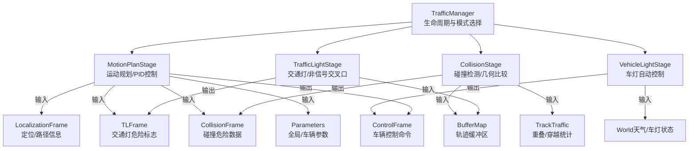
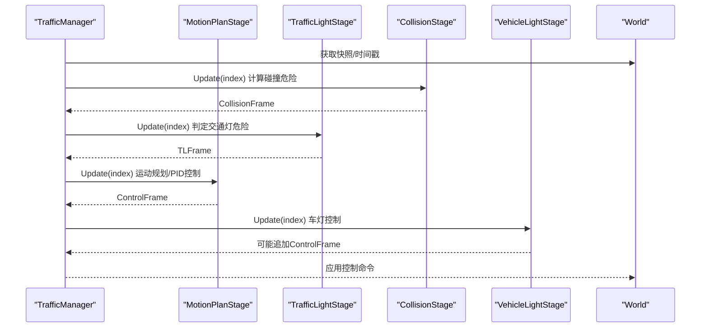
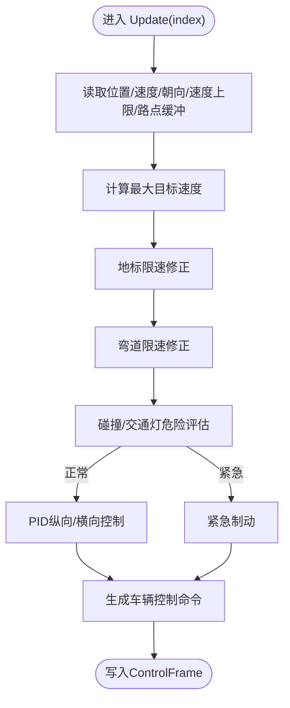
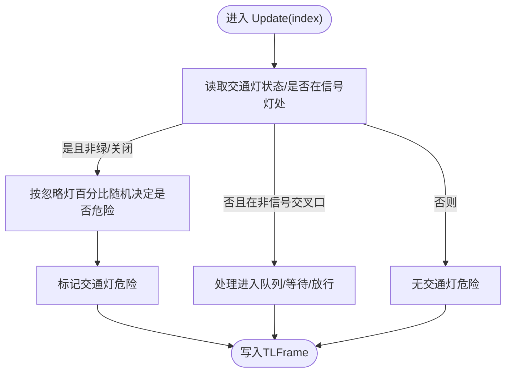
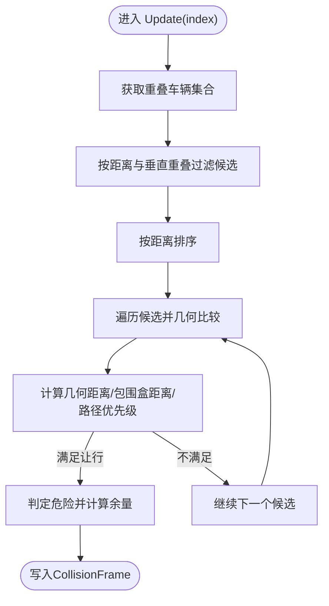
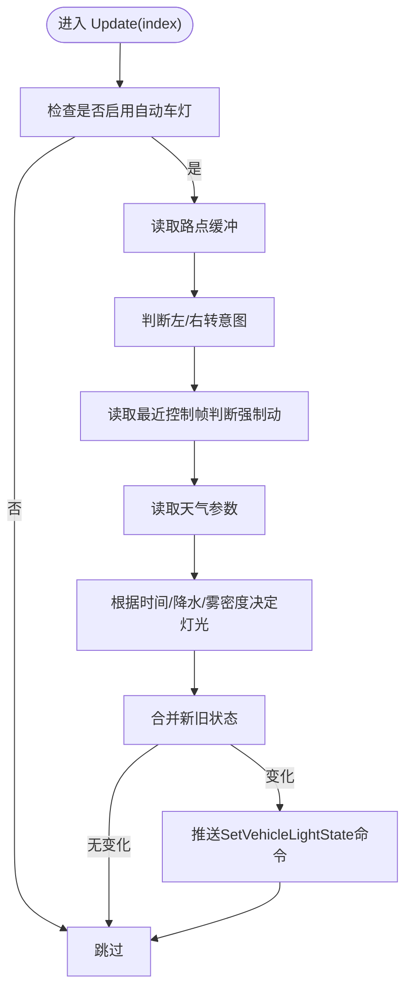
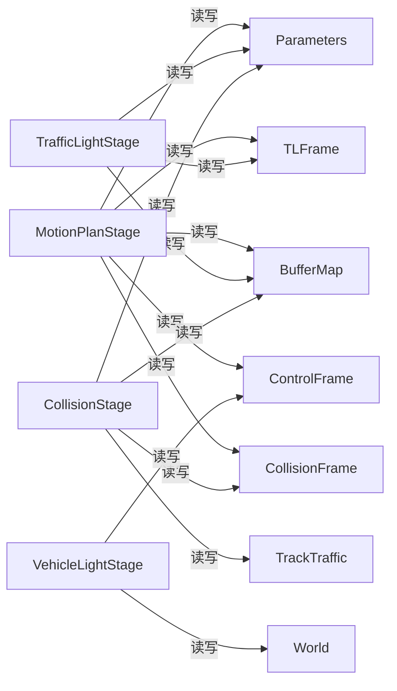

# 核心功能

**本文引用的文件**
- [LibCarla/source/carla/trafficmanager/TrafficManager.cpp](https://github.com/carla-simulator/carla/blob/ue5-dev/LibCarla/source/carla/trafficmanager/TrafficManager.cpp)
- [LibCarla/source/carla/trafficmanager/MotionPlanStage.cpp](https://github.com/carla-simulator/carla/blob/ue5-dev/LibCarla/source/carla/trafficmanager/MotionPlanStage.cpp)
- [LibCarla/source/carla/trafficmanager/MotionPlanStage.h](https://github.com/carla-simulator/carla/blob/ue5-dev/LibCarla/source/carla/trafficmanager/MotionPlanStage.h)
- [LibCarla/source/carla/trafficmanager/TrafficLightStage.cpp](https://github.com/carla-simulator/carla/blob/ue5-dev/LibCarla/source/carla/trafficmanager/TrafficLightStage.cpp)
- [LibCarla/source/carla/trafficmanager/TrafficLightStage.h](https://github.com/carla-simulator/carla/blob/ue5-dev/LibCarla/source/carla/trafficmanager/TrafficLightStage.h)
- [LibCarla/source/carla/trafficmanager/CollisionStage.cpp](https://github.com/carla-simulator/carla/blob/ue5-dev/LibCarla/source/carla/trafficmanager/CollisionStage.cpp)
- [LibCarla/source/carla/trafficmanager/CollisionStage.h](https://github.com/carla-simulator/carla/blob/ue5-dev/LibCarla/source/carla/trafficmanager/CollisionStage.h)
- [LibCarla/source/carla/trafficmanager/VehicleLightStage.cpp](https://github.com/carla-simulator/carla/blob/ue5-dev/LibCarla/source/carla/trafficmanager/VehicleLightStage.cpp)
- [LibCarla/source/carla/trafficmanager/VehicleLightStage.h](https://github.com/carla-simulator/carla/blob/ue5-dev/LibCarla/source/carla/trafficmanager/VehicleLightStage.h)
- [LibCarla/source/carla/trafficmanager/Constants.h](https://github.com/carla-simulator/carla/blob/ue5-dev/LibCarla/source/carla/trafficmanager/Constants.h)
- [PythonAPI/carla/src/TrafficManager.cpp](https://github.com/carla-simulator/carla/blob/ue5-dev/PythonAPI/carla/src/TrafficManager.cpp)
- [Docs/tuto_G_traffic_manager.md](https://github.com/carla-simulator/carla/blob/ue5-dev/Docs/tuto_G_traffic_manager.md)

## 目录
1. [引言](#引言)
2. [项目结构](#项目结构)
3. [核心组件](#核心组件)
4. [架构总览](#架构总览)
5. [详细组件分析](#详细组件分析)
6. [依赖关系分析](#依赖关系分析)
7. [性能考量](#性能考量)
8. [故障排查指南](#故障排查指南)
9. [结论](#结论)
10. [附录：API使用与配置](#附录api使用与配置)

## 引言
本文件围绕CARLA交通管理器（Traffic Manager）的核心功能进行系统化技术解读，重点覆盖以下方面：
- 运动规划（MotionPlanStage）：基于轨迹缓冲区、地标限速、弯道速度限制、碰撞与交通灯响应的动态目标速度生成与PID控制。
- 交通灯响应（TrafficLightStage）：信号灯与非信号交叉口优先级处理、停车时序与进入策略。
- 碰撞避免（CollisionStage）：几何边界建模、路径与包围盒距离比较、锁车机制与让行判定。
- 车辆灯光控制（VehicleLightStage）：根据转向意图、制动状态与天气条件自动切换车灯。
并解释这些模块如何协同工作以实现逼真的交通行为，同时提供通过Python API启用与配置这些功能的方法及对仿真真实度的贡献说明。

## 项目结构
交通管理器位于LibCarla源码的trafficmanager子目录中，采用“阶段化流水线”设计，每个Stage负责一个独立的功能域，通过共享的状态帧（如LocalizationFrame、CollisionFrame、TLFrame、ControlFrame）在不同阶段间传递信息。核心文件如下：
- TrafficManager.cpp：交通管理器生命周期与服务器/客户端模式初始化。
- MotionPlanStage.*：运动规划与PID控制、地标与弯道限速、紧急制动与混合物理模式下的瞬移更新。
- TrafficLightStage.*：交通灯状态与非信号交叉口优先级处理。
- CollisionStage.*：碰撞检测与几何比较、锁车与让行策略。
- VehicleLightStage.*：车灯状态自动更新。
- Constants.h：统一的阈值、参数与PID配置。
- PythonAPI/carla/src/TrafficManager.cpp：Python绑定导出，提供设置各类百分比、速度、距离、同步模式等接口。
- Docs/tuto_G_traffic_manager.md：官方教程，展示如何在Python中启用同步模式、设置随机种子、设置路径与忽略交通灯概率等。

图表来源
- [LibCarla/source/carla/trafficmanager/TrafficManager.cpp](https://github.com/carla-simulator/carla/blob/ue5-dev/LibCarla/source/carla/trafficmanager/TrafficManager.cpp#L1-L237)
- [LibCarla/source/carla/trafficmanager/MotionPlanStage.cpp](https://github.com/carla-simulator/carla/blob/ue5-dev/LibCarla/source/carla/trafficmanager/MotionPlanStage.cpp#L1-L268)
- [LibCarla/source/carla/trafficmanager/TrafficLightStage.cpp](https://github.com/carla-simulator/carla/blob/ue5-dev/LibCarla/source/carla/trafficmanager/TrafficLightStage.cpp#L1-L195)
- [LibCarla/source/carla/trafficmanager/CollisionStage.cpp](https://github.com/carla-simulator/carla/blob/ue5-dev/LibCarla/source/carla/trafficmanager/CollisionStage.cpp#L1-L110)
- [LibCarla/source/carla/trafficmanager/VehicleLightStage.cpp](https://github.com/carla-simulator/carla/blob/ue5-dev/LibCarla/source/carla/trafficmanager/VehicleLightStage.cpp#L1-L161)

章节来源
- [LibCarla/source/carla/trafficmanager/TrafficManager.cpp](https://github.com/carla-simulator/carla/blob/ue5-dev/LibCarla/source/carla/trafficmanager/TrafficManager.cpp#L1-L237)
- [LibCarla/source/carla/trafficmanager/Constants.h](https://github.com/carla-simulator/carla/blob/ue5-dev/LibCarla/source/carla/trafficmanager/Constants.h#L1-L166)

## 核心组件
- 运动规划（MotionPlanStage）
  - 输入：LocalizationFrame（定位/路径）、CollisionFrame（碰撞危险）、TLFrame（交通灯危险）、BufferMap（轨迹缓冲）、Parameters（参数）、World（时间戳）、TrackTraffic（地理网格占用）。
  - 输出：ControlFrame（车辆控制命令）。
  - 关键逻辑：目标速度由“最大目标速度、地标限速、弯道限速”三者取最小；碰撞与交通灯危险触发紧急制动；根据是否启用物理模拟选择PID控制或混合模式瞬移；在非信号交叉口后安全检查避免进入拥堵。
- 交通灯响应（TrafficLightStage）
  - 输入：SimulationState（交通灯状态）、BufferMap（轨迹缓冲）、Parameters（忽略灯/标百分比）、World（时间戳）。
  - 输出：TLFrame（交通灯危险标志）。
  - 关键逻辑：信号灯红/黄触发危险；非信号交叉口按到达顺序排队，先停再按最短等待时间放行；支持随机性以模拟真实驾驶。
- 碰撞避免（CollisionStage）
  - 输入：SimulationState（位置/速度/朝向/尺寸）、BufferMap（轨迹缓冲）、TrackTraffic（重叠统计）、Parameters（忽略行人类/车类百分比、距离到前车）。
  - 输出：CollisionFrame（碰撞危险与可用距离余量）。
  - 关键逻辑：基于包围盒扩展与路径几何距离的多准则比较；锁车机制维持与前车的最小距离；前后车相对速度与角度决定让行优先级。
- 车辆灯光控制（VehicleLightStage）
  - 输入：BufferMap（轨迹缓冲）、Parameters（是否更新车灯）、World（天气/当前车灯状态）。
  - 输出：ControlFrame（车灯状态变更命令）。
  - 关键逻辑：根据转向意图（左/右转）与制动状态开启相应指示灯；根据日出/日落、降水、雾密度自动开启位置/近光/远光/雾灯。

章节来源
- [LibCarla/source/carla/trafficmanager/MotionPlanStage.h](https://github.com/carla-simulator/carla/blob/ue5-dev/LibCarla/source/carla/trafficmanager/MotionPlanStage.h#L1-L97)
- [LibCarla/source/carla/trafficmanager/TrafficLightStage.h](https://github.com/carla-simulator/carla/blob/ue5-dev/LibCarla/source/carla/trafficmanager/TrafficLightStage.h#L1-L65)
- [LibCarla/source/carla/trafficmanager/CollisionStage.h](https://github.com/carla-simulator/carla/blob/ue5-dev/LibCarla/source/carla/trafficmanager/CollisionStage.h#L1-L114)
- [LibCarla/source/carla/trafficmanager/VehicleLightStage.h](https://github.com/carla-simulator/carla/blob/ue5-dev/LibCarla/source/carla/trafficmanager/VehicleLightStage.h#L1-L47)

## 架构总览
交通管理器以“阶段流水线”组织，每个阶段只关注自身职责，通过共享的数据帧解耦。下图展示了典型一次仿真步长内的调用序列与数据流。

图表来源
- [LibCarla/source/carla/trafficmanager/TrafficManager.cpp](https://github.com/carla-simulator/carla/blob/ue5-dev/LibCarla/source/carla/trafficmanager/TrafficManager.cpp#L62-L80)
- [LibCarla/source/carla/trafficmanager/MotionPlanStage.cpp](https://github.com/carla-simulator/carla/blob/ue5-dev/LibCarla/source/carla/trafficmanager/MotionPlanStage.cpp#L63-L268)
- [LibCarla/source/carla/trafficmanager/TrafficLightStage.cpp](https://github.com/carla-simulator/carla/blob/ue5-dev/LibCarla/source/carla/trafficmanager/TrafficLightStage.cpp#L31-L81)
- [LibCarla/source/carla/trafficmanager/CollisionStage.cpp](https://github.com/carla-simulator/carla/blob/ue5-dev/LibCarla/source/carla/trafficmanager/CollisionStage.cpp#L34-L110)
- [LibCarla/source/carla/trafficmanager/VehicleLightStage.cpp](https://github.com/carla-simulator/carla/blob/ue5-dev/LibCarla/source/carla/trafficmanager/VehicleLightStage.cpp#L32-L151)

## 详细组件分析

### 运动规划（MotionPlanStage）
- 目标速度合成
  - 最大目标速度来自Parameters与速度上限；地标限速（交通灯、停止、让行、限速标志）按距离线性插值影响目标速度；弯道半径由三点圆拟合计算，结合摩擦与重力得到最大侧向速度。
- 碰撞与交通灯响应
  - 当存在碰撞危险且未被交通灯触发时，依据相对速度与可用距离余量决定减速或紧急制动；若处于非信号交叉口入口且后方无足够安全距离，则禁止进入。
- PID控制与混合物理模式
  - 物理启用时，使用纵向/横向PID参数（城市/高速区分）计算油门、刹车与转向；物理禁用时，按目标速度进行瞬移以保持期望轨迹。
- 混合模式与重生
  - 在异步模式下按固定周期进行瞬移；当车辆休眠且允许重生时，从英雄车附近随机采样可通行的路点进行传送，并更新仿真状态。

图表来源
- [LibCarla/source/carla/trafficmanager/MotionPlanStage.cpp](https://github.com/carla-simulator/carla/blob/ue5-dev/LibCarla/source/carla/trafficmanager/MotionPlanStage.cpp#L63-L268)
- [LibCarla/source/carla/trafficmanager/MotionPlanStage.h](https://github.com/carla-simulator/carla/blob/ue5-dev/LibCarla/source/carla/trafficmanager/MotionPlanStage.h#L48-L93)

章节来源
- [LibCarla/source/carla/trafficmanager/MotionPlanStage.cpp](https://github.com/carla-simulator/carla/blob/ue5-dev/LibCarla/source/carla/trafficmanager/MotionPlanStage.cpp#L63-L268)
- [LibCarla/source/carla/trafficmanager/Constants.h](https://github.com/carla-simulator/carla/blob/ue5-dev/LibCarla/source/carla/trafficmanager/Constants.h#L116-L156)

### 交通灯响应（TrafficLightStage）
- 信号灯处理
  - 若车辆接近信号灯且非绿灯/关闭，按忽略灯百分比进行随机决策，触发危险标志并移除其在非信号交叉口中的登记。
- 非信号交叉口
  - 维护“进入交叉口的车辆队列”，按到达时间排序；首车需先完全停下至少最小等待时间，其他车辆一律停止；同一时刻仅允许一车进入。
- 影响判定
  - 通过前瞻路点判断受影响交叉口ID，若离开交叉口则清理登记。

图表来源
- [LibCarla/source/carla/trafficmanager/TrafficLightStage.cpp](https://github.com/carla-simulator/carla/blob/ue5-dev/LibCarla/source/carla/trafficmanager/TrafficLightStage.cpp#L31-L81)
- [LibCarla/source/carla/trafficmanager/TrafficLightStage.h](https://github.com/carla-simulator/carla/blob/ue5-dev/LibCarla/source/carla/trafficmanager/TrafficLightStage.h#L35-L61)

章节来源
- [LibCarla/source/carla/trafficmanager/TrafficLightStage.cpp](https://github.com/carla-simulator/carla/blob/ue5-dev/LibCarla/source/carla/trafficmanager/TrafficLightStage.cpp#L31-L195)
- [LibCarla/source/carla/trafficmanager/Constants.h](https://github.com/carla-simulator/carla/blob/ue5-dev/LibCarla/source/carla/trafficmanager/Constants.h#L111-L115)

### 碰撞避免（CollisionStage）
- 候选筛选
  - 基于重叠网格与垂直重叠阈值快速筛选潜在碰撞体；按距离升序排序。
- 几何比较
  - 构造包围盒与路径几何边界（左右边界），使用Boost.Geometry计算多边形间距离与相交程度，综合得出“参考车到对方几何距离”、“对方车到参考几何距离”、“两几何距离”、“两包围盒距离”。
- 决策规则
  - 当几何距离小于阈值且满足让行条件（路径远离优先、角度优先、路径清晰优先）时判定为碰撞危险，并计算可用距离余量。
- 锁车机制
  - 当与前车接触时，记录初始距离并在一定范围内维持，避免边界快速收缩导致跟踪丢失。

图表来源
- [LibCarla/source/carla/trafficmanager/CollisionStage.cpp](https://github.com/carla-simulator/carla/blob/ue5-dev/LibCarla/source/carla/trafficmanager/CollisionStage.cpp#L34-L110)
- [LibCarla/source/carla/trafficmanager/CollisionStage.h](https://github.com/carla-simulator/carla/blob/ue5-dev/LibCarla/source/carla/trafficmanager/CollisionStage.h#L27-L111)

章节来源
- [LibCarla/source/carla/trafficmanager/CollisionStage.cpp](https://github.com/carla-simulator/carla/blob/ue5-dev/LibCarla/source/carla/trafficmanager/CollisionStage.cpp#L1-L429)
- [LibCarla/source/carla/trafficmanager/Constants.h](https://github.com/carla-simulator/carla/blob/ue5-dev/LibCarla/source/carla/trafficmanager/Constants.h#L73-L90)

### 车辆灯光控制（VehicleLightStage）
- 转向与制动
  - 通过前瞻路点判断左/右转意图；通过最近控制帧判断是否强制动（刹车>0.5）。
- 天气联动
  - 日出/日落前后、强降水、高雾密度时自动开启位置/近光/雾灯。
- 状态更新
  - 对比当前车灯状态与新状态，必要时推送SetVehicleLightState命令。

图表来源
- [LibCarla/source/carla/trafficmanager/VehicleLightStage.cpp](https://github.com/carla-simulator/carla/blob/ue5-dev/LibCarla/source/carla/trafficmanager/VehicleLightStage.cpp#L32-L151)
- [LibCarla/source/carla/trafficmanager/VehicleLightStage.h](https://github.com/carla-simulator/carla/blob/ue5-dev/LibCarla/source/carla/trafficmanager/VehicleLightStage.h#L13-L47)

章节来源
- [LibCarla/source/carla/trafficmanager/VehicleLightStage.cpp](https://github.com/carla-simulator/carla/blob/ue5-dev/LibCarla/source/carla/trafficmanager/VehicleLightStage.cpp#L1-L161)
- [LibCarla/source/carla/trafficmanager/Constants.h](https://github.com/carla-simulator/carla/blob/ue5-dev/LibCarla/source/carla/trafficmanager/Constants.h#L135-L143)

## 依赖关系分析
- 模块内聚与耦合
  - 各Stage均通过共享的BufferMap、SimulationState、Parameters、TrackTraffic、World等对象交互，耦合集中在数据帧与参数对象上，内聚度高。
- 外部依赖
  - CollisionStage依赖Boost.Geometry进行多边形与距离计算；VehicleLightStage依赖World天气参数与当前车灯状态列表。
- 参数与常量
  - Constants.h集中定义阈值、比例、PID参数、混合模式时间步长等，便于统一调整与调试。

图表来源
- [LibCarla/source/carla/trafficmanager/MotionPlanStage.h](https://github.com/carla-simulator/carla/blob/ue5-dev/LibCarla/source/carla/trafficmanager/MotionPlanStage.h#L22-L47)
- [LibCarla/source/carla/trafficmanager/TrafficLightStage.h](https://github.com/carla-simulator/carla/blob/ue5-dev/LibCarla/source/carla/trafficmanager/TrafficLightStage.h#L13-L34)
- [LibCarla/source/carla/trafficmanager/CollisionStage.h](https://github.com/carla-simulator/carla/blob/ue5-dev/LibCarla/source/carla/trafficmanager/CollisionStage.h#L44-L68)
- [LibCarla/source/carla/trafficmanager/VehicleLightStage.h](https://github.com/carla-simulator/carla/blob/ue5-dev/LibCarla/source/carla/trafficmanager/VehicleLightStage.h#L13-L28)

章节来源
- [LibCarla/source/carla/trafficmanager/Constants.h](https://github.com/carla-simulator/carla/blob/ue5-dev/LibCarla/source/carla/trafficmanager/Constants.h#L1-L166)

## 性能考量
- 计算复杂度
  - CollisionStage对每辆车扫描重叠网格内的候选，几何比较使用多边形距离计算，整体复杂度与候选数量与路点长度相关；可通过增大重叠阈值与缩小缓冲区长度降低开销。
- 缓存优化
  - CollisionStage内部维护几何缓存与路径边界缓存，避免同一周期重复计算；建议在每帧结束时清理缓存以释放内存。
- 混合模式
  - 在异步模式下，MotionPlanStage按固定时间步长进行瞬移，减少物理引擎压力；同步模式下PID控制更平滑但CPU开销更高。
- 参数调优
  - PID参数（纵向/横向）与阈值（碰撞/交通灯/弯道）直接影响稳定性与性能，应结合硬件能力与仿真精度需求平衡。

## 故障排查指南
- 交通灯误判
  - 检查Parameters中忽略交通灯/标百分比设置是否过高；确认TrafficLightStage的随机数种子与世界时间戳一致。
- 碰撞频繁触发
  - 降低Parameters中距离到前车阈值或提高忽略行人类/车类百分比；检查CollisionStage的几何阈值与包围盒扩展是否合理。
- 车辆卡在交叉口
  - 检查非信号交叉口队列是否正确维护；确认最小等待时间与进入队列逻辑。
- 车灯不更新
  - 确认VehicleLightStage已启用自动更新；检查World天气参数是否可用；核对控制帧中是否推送了SetVehicleLightState命令。

章节来源
- [LibCarla/source/carla/trafficmanager/TrafficLightStage.cpp](https://github.com/carla-simulator/carla/blob/ue5-dev/LibCarla/source/carla/trafficmanager/TrafficLightStage.cpp#L83-L191)
- [LibCarla/source/carla/trafficmanager/CollisionStage.cpp](https://github.com/carla-simulator/carla/blob/ue5-dev/LibCarla/source/carla/trafficmanager/CollisionStage.cpp#L116-L429)
- [LibCarla/source/carla/trafficmanager/VehicleLightStage.cpp](https://github.com/carla-simulator/carla/blob/ue5-dev/LibCarla/source/carla/trafficmanager/VehicleLightStage.cpp#L24-L151)

## 结论
交通管理器通过“阶段化流水线”实现了运动规划、交通灯响应、碰撞避免与车灯控制的协同工作。各模块职责清晰、参数集中、依赖明确，既保证了仿真真实度，又兼顾了性能与可配置性。通过Python API可以灵活地设置速度、距离、忽略率、同步模式与路径，从而构建多样化的交通场景。

## 附录：API使用与配置
- 同步模式与随机种子
  - 在Python端设置同步模式与随机种子，确保行为可复现。
- 车辆行为参数
  - 设置期望速度、车道偏移、忽略交通灯/标百分比、忽略行人类/车类百分比、距离到前车、强制/自动变道概率等。
- 路径与路线
  - 使用set_path或set_route为车辆指定自定义路径或导入路线。
- 车灯更新
  - 为特定车辆启用自动车灯更新，使其随转向与制动以及天气条件自动切换。
- 示例（路径）
  - 参考官方教程，展示如何在同步模式下设置TrafficManager、设置随机种子、设置路径并交替生成两路汇聚交通。

章节来源
- [PythonAPI/carla/src/TrafficManager.cpp](https://github.com/carla-simulator/carla/blob/ue5-dev/PythonAPI/carla/src/TrafficManager.cpp#L76-L113)
- [Docs/tuto_G_traffic_manager.md](https://github.com/carla-simulator/carla/blob/ue5-dev/Docs/tuto_G_traffic_manager.md#L1-L227)